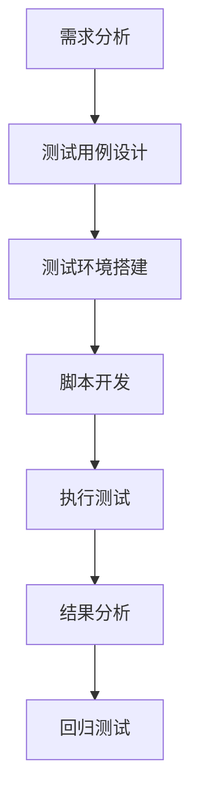
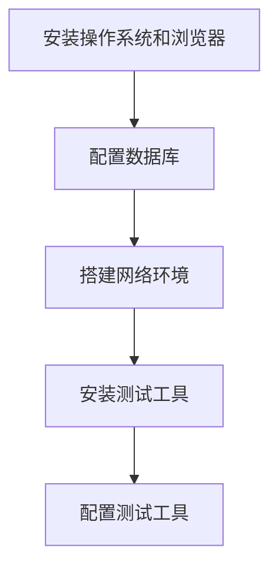
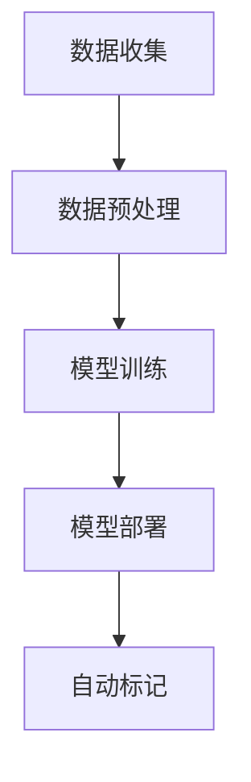
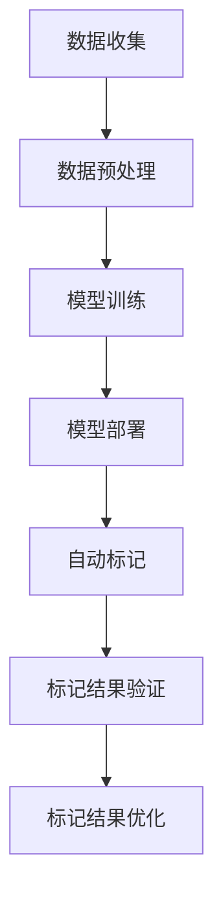
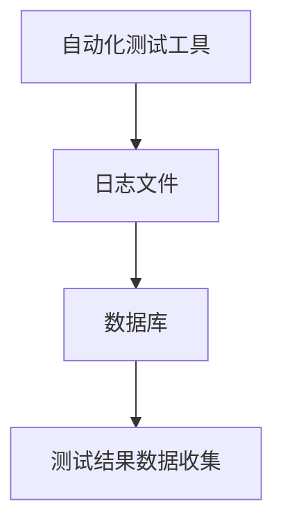
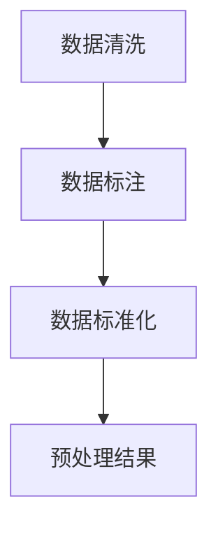
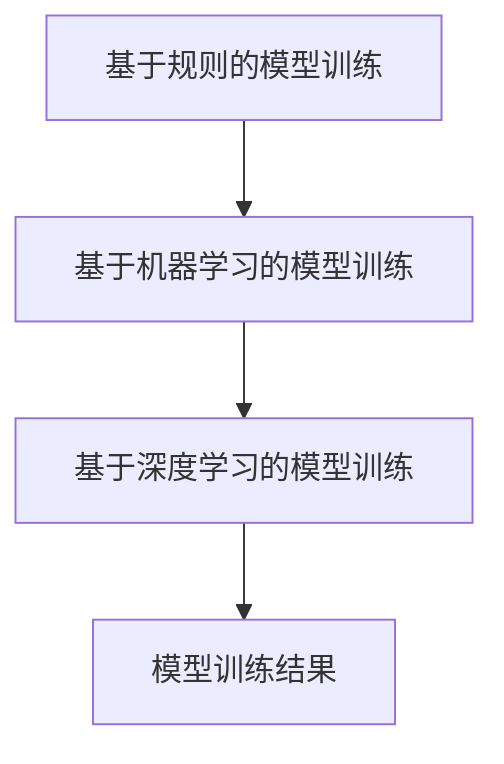
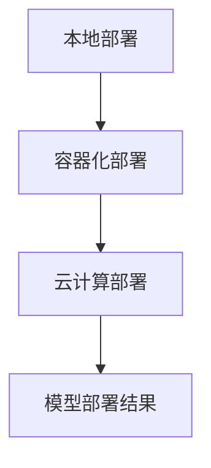
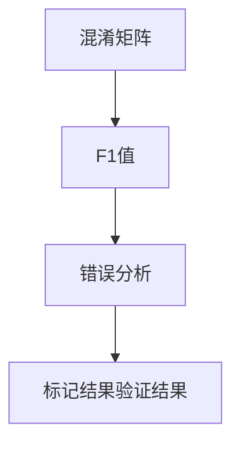
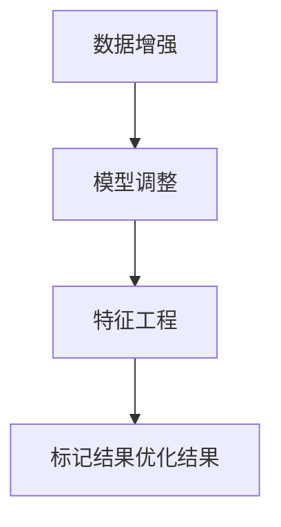

                 


## 引言

在当今软件工程领域，自动化测试已经成为提高软件质量、降低成本、提升开发效率的重要手段。自动化测试不仅能对软件进行重复性的验证，还能在短时间内完成大量的测试用例，从而有效减少人为错误。然而，随着软件复杂度的不断增加，如何对自动化测试结果进行有效的分类与标记，成为了自动化测试领域的一个重要课题。

本文将围绕评测系统的自动化测试结果分类与标记展开讨论。我们首先介绍自动化测试的基本概念和分类，接着深入探讨测试结果分类和标记的原理、方法和实践。通过本文的讲解，读者将能够系统地了解自动化测试结果分类与标记的技术要点，为实际项目中的应用提供有益的参考。

### 文章关键词

- 自动化测试
- 测试结果分类
- 测试结果标记
- 评测系统
- 软件质量
- 测试框架
- 机器学习

### 摘要

本文主要探讨了评测系统的自动化测试结果分类与标记技术。首先，我们介绍了自动化测试的基本概念和分类，包括功能测试、性能测试、安全测试等。接着，我们详细阐述了测试结果分类和标记的原理和方法，包括基于规则的方法、基于机器学习的方法、基于深度学习的方法等。最后，我们通过一个实际案例，展示了如何在实际项目中应用这些技术，并进行效果分析。本文旨在为自动化测试结果分类与标记提供一套系统的解决方案。

## 第一部分：自动化测试基础

### 第1章：自动化测试概述

#### 1.1 自动化测试的定义与作用

自动化测试是指利用自动化测试工具，按照预定的测试策略和用例，对软件进行自动化的验证。其目的是在较短的时间内完成大量的测试任务，提高测试的覆盖率和效率，减少人为错误。自动化测试与传统手工测试相比，具有以下优势：

1. **提高测试效率**：自动化测试可以连续运行，无需人工干预，从而大幅提升测试速度。
2. **降低成本**：自动化测试可以减少对测试人员的需求，降低人力成本。
3. **提高测试覆盖率**：自动化测试可以覆盖更多的测试用例，提高测试的全面性。
4. **减少人为错误**：自动化测试减少了人工操作，从而降低了由于人为疏忽导致的错误。

#### 1.2 自动化测试的发展历程

自动化测试的发展可以追溯到20世纪80年代。当时，随着计算机技术的发展，软件复杂度逐渐增加，手工测试的效率和质量难以满足需求。于是，自动化测试开始兴起。早期，自动化测试主要依赖于脚本编写，测试人员通过编写脚本来自动执行测试用例。随着技术的进步，自动化测试逐渐从简单的脚本执行发展到复杂的框架设计，测试工具也不断更新和优化。

近年来，随着人工智能和机器学习技术的发展，自动化测试也进入了新的阶段。基于机器学习和深度学习的自动化测试方法，不仅能够提高测试的准确性和效率，还能够根据历史测试数据自动生成新的测试用例，从而实现智能化的测试。

#### 1.3 自动化测试的分类

自动化测试可以根据测试的对象和目的进行分类，常见的分类方法包括：

1. **功能测试**：验证软件的功能是否符合需求规格。
2. **性能测试**：评估软件在特定条件下的性能，如响应时间、吞吐量等。
3. **安全测试**：检测软件的安全性，如漏洞扫描、攻击测试等。
4. **兼容性测试**：验证软件在不同环境下的兼容性，如操作系统、浏览器等。
5. **其他类型测试**：包括界面测试、回归测试、负载测试等。

#### 1.4 自动化测试的优势与挑战

自动化测试的优势在于：

- **提高测试效率**：自动化测试可以在短时间内完成大量的测试任务，提高工作效率。
- **降低成本**：自动化测试可以减少对测试人员的需求，降低人力成本。
- **提高测试覆盖率**：自动化测试可以覆盖更多的测试用例，提高测试的全面性。
- **减少人为错误**：自动化测试减少了人工操作，从而降低了由于人为疏忽导致的错误。

然而，自动化测试也面临一些挑战：

- **开发和维护成本**：自动化测试需要编写脚本和开发测试框架，开发和维护成本较高。
- **测试用例的设计**：自动化测试用例的设计需要一定的专业知识和经验，否则容易产生无效的测试用例。
- **测试数据的管理**：自动化测试需要大量的测试数据，如何有效地管理和利用测试数据是一个挑战。
- **技术更新**：随着技术的进步，自动化测试工具和框架也在不断更新，如何跟上技术的步伐也是一个挑战。

#### 1.5 自动化测试的应对策略

为了应对自动化测试的挑战，可以采取以下策略：

- **提升测试人员技能**：通过培训和实践，提升测试人员的专业技能，使其能够更有效地设计和执行自动化测试用例。
- **引入机器学习技术**：利用机器学习技术，自动化生成测试用例，提高测试的覆盖率。
- **优化测试流程**：通过优化测试流程，提高自动化测试的效率和效果。
- **持续集成与持续交付**：引入持续集成和持续交付（CI/CD）流程，确保自动化测试能够及时反馈测试结果，快速迭代和发布软件。

### 总结

自动化测试是提高软件质量和开发效率的重要手段。通过本文的介绍，我们了解了自动化测试的定义、发展历程、分类、优势与挑战，以及应对策略。在接下来的章节中，我们将进一步探讨自动化测试结果分类和标记的技术和方法。

### 第2章：自动化测试框架

#### 2.1 自动化测试框架概述

自动化测试框架是自动化测试的核心组成部分，它提供了测试用例设计、执行、结果记录和报告的标准化流程。一个良好的自动化测试框架应该具备以下特点：

- **可扩展性**：框架应该能够适应不同的测试场景和需求。
- **灵活性**：框架应该能够灵活地配置测试用例、测试数据和测试环境。
- **可维护性**：框架的设计和实现应该易于维护和更新。
- **可重用性**：框架中的组件和代码应该具有高重用性，减少重复工作。

常见的自动化测试框架包括Selenium、JUnit、TestNG、NUnit等。这些框架提供了丰富的API和工具，帮助开发者快速搭建自动化测试环境。

#### 2.2 自动化测试工具选型

选择合适的自动化测试工具是构建自动化测试框架的关键步骤。以下是一些常见的自动化测试工具及其特点：

1. **Selenium**：
   - **特点**：开源，支持多种浏览器和操作系统，功能强大。
   - **适用场景**：跨浏览器测试、Web应用测试。
   - **劣势**：学习曲线较陡，配置复杂。

2. **JUnit**：
   - **特点**：开源，Java语言编写，支持JUnit annotations。
   - **适用场景**：单元测试、集成测试。
   - **劣势**：仅支持Java语言。

3. **TestNG**：
   - **特点**：开源，支持多种编程语言，功能丰富。
   - **适用场景**：功能测试、性能测试。
   - **劣势**：文档相对较少。

4. **NUnit**：
   - **特点**：开源，C#语言编写，支持多种平台。
   - **适用场景**：单元测试、集成测试。
   - **劣势**：功能相对单一。

在选择自动化测试工具时，需要考虑以下因素：

- **开发语言**：工具是否支持项目使用的开发语言。
- **测试类型**：工具是否支持所需的测试类型，如功能测试、性能测试等。
- **生态系统**：工具是否有丰富的社区支持和插件。
- **学习成本**：工具的学习和使用成本。

#### 2.3 自动化测试流程

自动化测试流程通常包括以下几个步骤：

1. **需求分析**：分析软件需求，确定测试目标和测试用例。
2. **测试用例设计**：设计自动化测试用例，包括输入数据、测试步骤和预期结果。
3. **测试环境搭建**：配置测试环境，包括操作系统、数据库、网络环境等。
4. **脚本开发**：编写测试脚本，实现测试用例的自动化执行。
5. **执行测试**：运行测试脚本，执行自动化测试。
6. **结果分析**：分析测试结果，生成测试报告。
7. **回归测试**：针对测试发现的问题，进行回归测试。

以下是一个简单的自动化测试流程图：



#### 2.4 自动化测试用例设计

自动化测试用例的设计是自动化测试的关键环节。一个良好的自动化测试用例应该具备以下特点：

- **可读性**：测试用例的描述应该清晰、简洁，便于理解和维护。
- **完整性**：测试用例应该覆盖所有可能的输入和输出情况。
- **可复用性**：测试用例中的公共部分应该进行提取和复用。
- **可维护性**：测试用例的设计应该考虑未来的扩展和更新。

以下是一个自动化测试用例的示例：

```java
@Test
public void testLogin() {
    // 输入数据
    String username = "testuser";
    String password = "testpass";

    // 测试步骤
    driver.get("http://example.com/login");
    driver.findElement(By.id("username")).sendKeys(username);
    driver.findElement(By.id("password")).sendKeys(password);
    driver.findElement(By.id("submit")).click();

    // 预期结果
    assertEquals("登录成功", driver.findElement(By.id("result")).getText());
}
```

#### 2.5 自动化测试环境搭建

自动化测试环境搭建是自动化测试的基础工作。一个良好的自动化测试环境应该包括：

- **操作系统**：如Windows、Linux、macOS等。
- **浏览器**：如Chrome、Firefox、Safari等。
- **数据库**：如MySQL、PostgreSQL、MongoDB等。
- **网络环境**：如虚拟网络、代理服务器等。
- **测试工具**：如Selenium、JUnit、TestNG等。

以下是一个简单的自动化测试环境搭建流程：

1. **安装操作系统和浏览器**：根据项目需求，安装相应的操作系统和浏览器。
2. **配置数据库**：安装并配置数据库，确保数据库能够正常运行。
3. **搭建网络环境**：配置虚拟网络、代理服务器等，确保网络环境的正常运行。
4. **安装测试工具**：下载并安装测试工具，如Selenium、JUnit、TestNG等。
5. **配置测试工具**：根据项目需求，配置测试工具，如设置浏览器驱动、数据库连接等。

以下是一个简单的自动化测试环境搭建的Mermaid流程图：



#### 总结

自动化测试框架是自动化测试的核心组成部分，它提供了测试用例设计、执行、结果记录和报告的标准化流程。选择合适的自动化测试工具、设计良好的自动化测试用例、搭建可靠的自动化测试环境，是成功实施自动化测试的关键。在下一章中，我们将深入探讨自动化测试结果分类的原理和方法。

### 第二部分：测试结果分类

### 第3章：测试结果分类原理

#### 3.1 测试结果分类的定义

测试结果分类是指将自动化测试执行后产生的测试结果按照一定的标准或规则进行归类和整理的过程。分类的目的是为了提高测试数据的可读性、可分析和可利用性，从而更好地指导后续的测试工作。测试结果分类通常涉及以下几个关键概念：

1. **测试结果**：指自动化测试执行后的输出，包括测试通过、失败、错误等信息。
2. **分类标准**：指用于区分测试结果的规则或标准，可以是预定义的，也可以是自动生成的。
3. **分类方法**：指实现测试结果分类的具体技术或策略，包括基于规则的方法、机器学习方法等。

#### 3.2 测试结果分类的目标

测试结果分类的主要目标包括：

1. **提高测试效率**：通过分类，可以快速定位失败的测试用例，减少分析和处理的成本。
2. **优化测试资源**：根据分类结果，可以合理分配测试资源，如优先处理失败的测试用例，减少重复执行成功的测试用例。
3. **支持决策**：分类结果可以为项目经理、开发人员和测试团队提供重要的决策支持，如确定测试优先级、优化测试策略等。
4. **增强测试覆盖**：通过对测试结果的分类和分析，可以发现潜在的测试漏洞，从而提高测试的全面性和准确性。

#### 3.3 测试结果分类的方法

测试结果分类的方法可以分为以下几类：

1. **基于规则的方法**：
   - **原理**：通过预定义的规则对测试结果进行分类，规则可以是简单的逻辑条件或复杂的决策树。
   - **优势**：实现简单，易于理解和维护。
   - **劣势**：灵活性较差，难以适应复杂的测试结果。

2. **基于机器学习的方法**：
   - **原理**：利用机器学习算法，从历史测试数据中学习分类模型，对新的测试结果进行分类。
   - **优势**：具有较高的灵活性和适应性，能够处理复杂的测试结果。
   - **劣势**：需要大量的历史数据，训练过程较慢。

3. **基于深度学习的方法**：
   - **原理**：利用深度学习算法，如神经网络，自动学习和提取测试结果的特征，进行分类。
   - **优势**：能够自动提取复杂的特征，适应性强。
   - **劣势**：计算资源需求高，训练过程复杂。

#### 3.4 测试结果分类的评价指标

测试结果分类的效果可以通过以下评价指标进行评估：

1. **准确率**：分类正确的测试结果占总测试结果的比率。
2. **召回率**：分类正确的失败测试结果占总失败测试结果的比率。
3. **F1值**：准确率和召回率的调和平均值，用于综合评估分类效果。
4. **错误率**：分类错误的测试结果占总测试结果的比率。

#### 3.5 测试结果分类的挑战

测试结果分类在实际应用中面临以下挑战：

1. **数据质量**：测试数据的准确性和一致性对分类效果有很大影响。
2. **标签一致性**：不同的测试人员可能对测试结果的标签有不同的理解，导致标签不一致。
3. **算法选择**：不同的分类方法适用于不同的测试场景，如何选择合适的算法是一个挑战。
4. **资源消耗**：机器学习和深度学习方法通常需要大量的计算资源，如何在资源有限的情况下实现有效的分类是一个挑战。

#### 总结

测试结果分类是自动化测试的重要环节，它能够提高测试效率、优化测试资源、支持决策和增强测试覆盖。通过基于规则的方法和机器学习方法，可以实现有效的测试结果分类。在下一章中，我们将深入探讨具体的测试结果分类方法和技术。

### 第4章：测试结果分类方法

#### 4.1 基于规则的方法

基于规则的方法是测试结果分类的一种简单且直观的途径。这种方法依赖于一组预定义的规则，这些规则通常基于经验和专家知识，用于将测试结果分类到不同的类别中。

##### 4.1.1 规则定义

规则定义是分类过程的第一步，需要明确每个规则的逻辑条件和对应的分类结果。例如，以下是一个简单的规则示例：

- **规则1**：如果测试执行时长超过10秒，则分类为“性能问题”。
- **规则2**：如果测试结果包含特定的错误消息，如“未找到元素”，则分类为“元素定位错误”。

##### 4.1.2 规则实现

规则实现涉及到编写代码或脚本，用于自动化执行规则并分类测试结果。以下是一个基于Python的简单规则实现示例：

```python
def classify_result(test_result):
    if test_result.execution_time > 10:
        return "性能问题"
    elif "未找到元素" in test_result.error_message:
        return "元素定位错误"
    else:
        return "其他问题"
```

##### 4.1.3 规则优化的方法

基于规则的分类方法虽然简单，但存在一些局限性。以下是一些规则优化的方法：

1. **规则优先级**：为每个规则设置优先级，使得高优先级的规则先执行，从而减少冗余分类。
2. **规则组合**：将多个规则组合使用，形成一个复杂的分类逻辑，提高分类的准确性。
3. **规则进化**：通过分析历史数据，动态调整和优化规则，使其更适应当前测试环境。

#### 4.2 基于机器学习的方法

基于机器学习的方法是测试结果分类的另一种先进途径，它利用历史测试数据训练模型，从而自动分类新的测试结果。

##### 4.2.1 机器学习概述

机器学习是一种通过算法从数据中学习模式和规律的技术。常见的机器学习算法包括决策树、支持向量机（SVM）、朴素贝叶斯（Naive Bayes）等。选择合适的算法需要考虑测试数据的特征和问题复杂性。

##### 4.2.2 特征工程

特征工程是机器学习的关键步骤，它涉及到从原始测试数据中提取有用的特征，用于训练模型。以下是一些常见的特征工程方法：

1. **特征提取**：从测试结果中提取文本、数值等特征。
2. **特征选择**：选择对分类最有影响力的特征，减少数据维度。
3. **特征转换**：将原始特征转换为更适合机器学习模型的格式，如将文本特征转换为词袋模型。

##### 4.2.3 模型选择

选择合适的机器学习模型对于测试结果分类至关重要。以下是一些常见的模型选择方法：

1. **交叉验证**：通过交叉验证评估不同模型的性能，选择性能最优的模型。
2. **模型集成**：将多个模型集成，形成更强大的分类器，如随机森林（Random Forest）、梯度提升树（Gradient Boosting Tree）等。

##### 4.2.4 模型训练

模型训练是机器学习过程的核心步骤，通过训练数据集训练模型，使其能够对新的测试结果进行分类。以下是一个简单的模型训练流程：

1. **数据准备**：将测试数据集划分为训练集和验证集。
2. **模型初始化**：初始化模型参数。
3. **模型训练**：使用训练数据集训练模型，调整模型参数。
4. **模型评估**：使用验证数据集评估模型性能，调整模型参数。

##### 4.2.5 模型评估

模型评估是确保分类效果的关键步骤，以下是一些常见的评估方法：

1. **准确率**：分类正确的测试结果占总测试结果的比率。
2. **召回率**：分类正确的失败测试结果占总失败测试结果的比率。
3. **F1值**：准确率和召回率的调和平均值。
4. **混淆矩阵**：展示不同分类结果的详细分布。

#### 4.3 基于深度学习的方法

基于深度学习的方法是测试结果分类的一种先进技术，它利用深度神经网络自动学习和提取测试结果的复杂特征。

##### 4.3.1 卷积神经网络（CNN）

卷积神经网络是一种常用于图像处理的深度学习模型，它通过卷积层提取图像特征。以下是一个简单的CNN模型用于测试结果分类的伪代码：

```python
model = Sequential()
model.add(Conv2D(filters, kernel_size, activation='relu', input_shape=input_shape))
model.add(MaxPooling2D(pool_size))
model.add(Flatten())
model.add(Dense(num_classes, activation='softmax'))
model.compile(optimizer='adam', loss='categorical_crossentropy', metrics=['accuracy'])
```

##### 4.3.2 循环神经网络（RNN）

循环神经网络是一种常用于序列数据处理的深度学习模型，它能够捕捉序列中的时间依赖关系。以下是一个简单的RNN模型用于测试结果分类的伪代码：

```python
model = Sequential()
model.add(LSTM(units, activation='relu', return_sequences=True))
model.add(Dropout(rate))
model.add(LSTM(units, activation='relu'))
model.add(Dropout(rate))
model.add(Dense(num_classes, activation='softmax'))
model.compile(optimizer='adam', loss='categorical_crossentropy', metrics=['accuracy'])
```

##### 4.3.3 生成对抗网络（GAN）

生成对抗网络是一种由生成器和判别器组成的深度学习模型，它通过对抗训练生成真实的测试结果。以下是一个简单的GAN模型用于测试结果分类的伪代码：

```python
# 生成器
generator = Sequential()
generator.add(Dense(z_dim, activation='tanh', input_shape=input_shape))
generator.add(Reshape(input_shape))
generator.compile(optimizer='adam', loss='binary_crossentropy')

# 判别器
discriminator = Sequential()
discriminator.add(Dense(1, activation='sigmoid', input_shape=input_shape))
discriminator.compile(optimizer='adam', loss='binary_crossentropy')

# GAN
model = Sequential()
model.add(generator)
model.add(discriminator)
model.compile(optimizer='adam', loss='binary_crossentropy')
```

#### 4.4 方法对比与选择

基于规则的方法、机器学习方法和深度学习方法各有优缺点。以下是对这些方法的对比：

- **基于规则的方法**：实现简单，易于理解和维护，但灵活性较差。
- **机器学习方法**：具有较高的灵活性和适应性，能够处理复杂的测试结果，但需要大量的历史数据。
- **深度学习方法**：能够自动提取复杂的特征，适应性强，但计算资源需求高，训练过程复杂。

在选择分类方法时，需要根据实际项目的需求和资源进行权衡。例如，对于小型项目和资源有限的情况，基于规则的方法可能更为合适；而对于大型项目和需要高精度分类的情况，机器学习或深度学习方法可能更为有效。

#### 4.5 方法选择的考虑因素

选择合适的测试结果分类方法需要考虑以下因素：

1. **测试数据量**：如果测试数据量较大，机器学习和深度学习方法可能更有优势。
2. **测试结果复杂性**：如果测试结果较为复杂，需要提取大量特征，机器学习或深度学习方法可能更为合适。
3. **计算资源**：如果计算资源有限，基于规则的方法可能更为可行。
4. **项目需求**：根据项目的具体需求和目标，选择最合适的分类方法。

#### 总结

测试结果分类是自动化测试的重要环节，基于规则的方法、机器学习方法和深度学习方法各有优缺点。通过选择合适的方法和进行有效的特征工程，可以实现高效的测试结果分类。在下一章中，我们将探讨测试结果标记的技术和流程。

### 第三部分：测试结果标记

#### 第5章：测试结果标记技术

测试结果标记是自动化测试过程中的关键步骤，它将测试执行后的结果与预定的标签进行关联，以便于后续的分析和处理。测试结果标记技术主要包括手动标记、自动标记和半自动标记。

#### 5.1 测试结果标记的定义

测试结果标记是指将自动化测试执行后产生的测试结果与预定的标签进行关联的过程。这些标签通常用于表示测试结果的类型，如通过、失败、错误等。标记的目的是为了提高测试数据的可读性、可分析和可利用性，从而更好地指导后续的测试工作。

#### 5.2 测试结果标记的方法

测试结果标记的方法可以分为以下几类：

1. **手动标记**：
   - **定义**：手动标记是指由测试人员根据测试结果手动进行标签的关联。
   - **优势**：标记过程灵活，可以处理复杂和不明确的测试结果。
   - **劣势**：效率低，依赖于测试人员的经验和知识，容易出现主观判断偏差。

2. **自动标记**：
   - **定义**：自动标记是指通过编写脚本或使用自动化工具自动对测试结果进行标签的关联。
   - **优势**：效率高，减少人为错误，适用于标准化的测试结果。
   - **劣势**：灵活性较差，难以处理复杂的测试结果，依赖于脚本或工具的正确性。

3. **半自动标记**：
   - **定义**：半自动标记是指结合手动和自动标记的方法，测试人员参与部分标记过程，其他部分由自动化工具完成。
   - **优势**：兼具手动和自动标记的优势，灵活性高，效率较高。
   - **劣势**：需要测试人员投入更多的时间和精力，实现相对复杂。

#### 5.3 标记数据的预处理

在测试结果标记之前，通常需要对测试数据进行分析和处理，以确保标记的准确性和一致性。以下是一些常见的预处理方法：

1. **数据清洗**：
   - **定义**：数据清洗是指删除或修正数据集中的噪声和错误数据。
   - **方法**：包括删除重复数据、填充缺失值、纠正错误数据等。

2. **数据标注**：
   - **定义**：数据标注是指为测试数据分配预定义的标签。
   - **方法**：包括手工标注和自动化标注，手工标注适用于复杂和不明确的数据，自动化标注适用于标准化的数据。

3. **数据标准化**：
   - **定义**：数据标准化是指将不同来源和格式的数据转换为统一的格式。
   - **方法**：包括数值标准化、文本标准化等。

#### 5.4 标记工具与平台

为了提高测试结果标记的效率和准确性，通常需要使用专门的标记工具和平台。以下是一些常见的标记工具和平台：

1. **手动标记工具**：
   - **定义**：手动标记工具是指用于帮助测试人员手动标注数据的软件。
   - **示例**：Excel、Notepad++等。

2. **自动标记工具**：
   - **定义**：自动标记工具是指用于自动标注数据的软件。
   - **示例**：自动化测试框架（如Selenium）、数据标注平台（如LabelImg）等。

3. **半自动标记平台**：
   - **定义**：半自动标记平台是指结合手动和自动标注功能的平台。
   - **示例**：Annotate、Labelbox等。

#### 5.5 标记过程的自动化

为了提高标记效率，可以将测试结果标记过程自动化。以下是一个简单的自动标记流程：

1. **数据收集**：收集测试结果数据。
2. **数据预处理**：对数据进行清洗和标注。
3. **模型训练**：使用预处理后的数据训练标记模型。
4. **模型部署**：将训练好的模型部署到生产环境。
5. **自动标记**：使用部署后的模型自动对新的测试结果进行标记。

以下是一个自动标记流程的Mermaid图：



#### 总结

测试结果标记是自动化测试的重要环节，通过合理的标记技术和方法，可以提高测试数据的可读性、可分析和可利用性。在下一章中，我们将进一步探讨测试结果标记的具体流程和策略。

### 第6章：测试结果标记流程

#### 6.1 测试结果标记流程概述

测试结果标记流程是指将自动化测试执行后的测试结果与预定的标签进行关联的过程。一个完整的测试结果标记流程通常包括以下几个关键步骤：

1. **数据收集**：收集测试执行过程中产生的测试结果数据。
2. **数据预处理**：对收集到的测试数据进行清洗和预处理，确保数据的质量和一致性。
3. **模型训练**：使用预处理后的数据训练标记模型，以便能够自动对新的测试结果进行分类和标记。
4. **模型部署**：将训练好的模型部署到生产环境，以便在实际测试过程中应用。
5. **自动标记**：使用部署后的模型对新的测试结果进行自动分类和标记。
6. **标记结果验证**：验证标记结果的准确性，确保标记过程的有效性。
7. **标记结果优化**：根据验证结果，对标记模型进行优化和调整，提高标记的准确性。

以下是一个简单的测试结果标记流程图：



#### 6.2 数据收集

数据收集是测试结果标记流程的第一步，它涉及到从不同的来源和格式收集测试结果数据。以下是一些常见的测试结果数据来源：

1. **自动化测试工具**：如Selenium、JUnit、TestNG等，这些工具通常能够生成详细的测试报告，包括测试结果、执行时间、错误消息等信息。
2. **日志文件**：测试执行过程中产生的日志文件，如应用程序日志、服务器日志等，这些日志通常包含详细的测试执行信息和错误记录。
3. **数据库**：测试执行过程中记录在数据库中的数据，如测试用例信息、测试结果数据等。

以下是一个数据收集的Mermaid流程图：



#### 6.3 数据预处理

数据预处理是测试结果标记流程中的关键步骤，它确保了测试数据的准确性和一致性。以下是一些常见的数据预处理方法：

1. **数据清洗**：删除或修正数据中的噪声和错误，如删除重复数据、填充缺失值、纠正错误数据等。
2. **数据标注**：为测试数据分配预定义的标签，如通过、失败、错误等。
3. **数据标准化**：将不同来源和格式的数据进行转换，使其具有统一的格式，如数值标准化、文本标准化等。

以下是一个数据预处理的Mermaid流程图：



#### 6.4 模型训练

模型训练是测试结果标记流程的核心步骤，它使用预处理后的数据训练标记模型，以便能够自动对新的测试结果进行分类和标记。以下是一些常见的模型训练方法：

1. **基于规则的模型训练**：通过预定义的规则训练模型，如逻辑回归、决策树等。
2. **基于机器学习的模型训练**：使用机器学习算法训练模型，如支持向量机（SVM）、朴素贝叶斯等。
3. **基于深度学习的模型训练**：使用深度学习算法训练模型，如卷积神经网络（CNN）、循环神经网络（RNN）等。

以下是一个模型训练的Mermaid流程图：



#### 6.5 模型部署

模型部署是将训练好的标记模型部署到生产环境，以便在实际测试过程中应用。以下是一些常见的模型部署方法：

1. **本地部署**：将模型文件直接部署到测试环境，如将训练好的模型文件上传到服务器。
2. **容器化部署**：使用容器技术（如Docker）部署模型，以便在不同的环境中运行。
3. **云计算部署**：使用云计算平台（如AWS、Azure）部署模型，以便实现弹性的资源分配和管理。

以下是一个模型部署的Mermaid流程图：



#### 6.6 自动标记

自动标记是测试结果标记流程的关键步骤，它使用部署后的模型对新的测试结果进行自动分类和标记。以下是一个自动标记的伪代码：

```python
def automatic_labeling(test_results, model):
    labeled_results = []
    for result in test_results:
        prediction = model.predict(result)
        labeled_result = {'test_result': result, 'label': prediction}
        labeled_results.append(labeled_result)
    return labeled_results
```

#### 6.7 标记结果验证

标记结果验证是确保标记准确性的重要步骤，它通过比较自动标记结果和实际测试结果来评估标记模型的性能。以下是一些常见的验证方法：

1. **混淆矩阵**：展示自动标记结果和实际测试结果之间的分布，用于分析模型的准确性和召回率。
2. **F1值**：计算自动标记结果的准确率和召回率的调和平均值，用于综合评估模型的性能。
3. **错误分析**：分析自动标记结果中的错误类型和原因，用于优化和改进标记模型。

以下是一个标记结果验证的Mermaid流程图：



#### 6.8 标记结果优化

标记结果优化是提高标记准确性的重要步骤，它通过分析验证结果中的错误和不足，对标记模型进行优化和调整。以下是一些常见的优化方法：

1. **数据增强**：增加训练数据集的多样性，提高模型的泛化能力。
2. **模型调整**：调整模型的参数，如学习率、迭代次数等，以改善模型性能。
3. **特征工程**：改进特征提取和选择方法，以提高模型对测试结果的敏感度。

以下是一个标记结果优化的Mermaid流程图：



#### 总结

测试结果标记流程是自动化测试中的重要环节，通过合理的流程和策略，可以提高测试结果的准确性和可利用率。在下一章中，我们将通过一个实际案例，展示如何在实际项目中应用测试结果分类与标记技术。

### 第四部分：实战应用

#### 第7章：自动化测试结果分类与标记实践

在本章中，我们将通过一个实际案例，详细展示如何在一个项目中应用自动化测试结果分类与标记技术。该案例涉及一个电子商务网站，目标是通过自动化测试结果分类与标记技术，提高测试效率和质量。

#### 7.1 实践项目背景

我们假设一家电子商务公司正在开发其在线购物平台，随着项目的不断迭代和扩展，测试团队面临着测试用例数量激增、测试环境复杂性和测试结果处理难度增加等问题。为了提高测试效率，测试团队决定引入自动化测试结果分类与标记技术。

#### 7.2 实践项目环境搭建

首先，我们需要搭建一个适合自动化测试的环境。以下是环境搭建的步骤：

1. **安装操作系统**：在测试服务器上安装Linux操作系统，如Ubuntu。
2. **安装浏览器**：安装常用的浏览器，如Chrome和Firefox，以便进行Web应用测试。
3. **安装自动化测试工具**：安装Selenium WebDriver，用于Web自动化测试。
4. **安装数据库**：安装MySQL数据库，用于存储测试结果数据。
5. **安装标记工具**：安装LabelImg，用于手动标注测试结果数据。

#### 7.3 数据收集与预处理

在测试执行过程中，我们需要收集测试结果数据。以下是数据收集与预处理的步骤：

1. **数据收集**：使用Selenium WebDriver执行自动化测试脚本，收集测试结果数据，包括测试通过、失败、错误等信息。
2. **数据存储**：将收集到的测试结果数据存储在MySQL数据库中，创建相应的数据表，如`test_results`表，包含`id`、`test_case_id`、`status`、`error_message`等字段。
3. **数据预处理**：对收集到的测试结果数据进行清洗，如删除重复数据、填充缺失值、纠正错误数据等。同时，将错误消息进行标准化处理，以便于后续的分析和处理。

以下是一个简单的数据预处理脚本：

```python
import pandas as pd

# 读取测试结果数据
test_results_df = pd.read_csv('test_results.csv')

# 删除重复数据
test_results_df.drop_duplicates(inplace=True)

# 填充缺失值
test_results_df.fillna({'status': 'Passed', 'error_message': ''}, inplace=True)

# 标准化错误消息
test_results_df['error_message'] = test_results_df['error_message'].str.lower().str.strip()

# 保存预处理后的数据
test_results_df.to_csv('preprocessed_test_results.csv', index=False)
```

#### 7.4 测试结果分类模型训练

在数据预处理完成后，我们需要使用预处理后的数据训练一个测试结果分类模型。以下是模型训练的步骤：

1. **选择分类模型**：根据测试结果的特征和问题复杂性，选择合适的分类模型，如逻辑回归、决策树、支持向量机（SVM）等。
2. **特征工程**：从测试结果数据中提取有用的特征，如错误消息、测试执行时长等。
3. **数据划分**：将测试结果数据划分为训练集和验证集，用于训练和评估模型性能。
4. **模型训练**：使用训练集数据训练分类模型。
5. **模型评估**：使用验证集数据评估模型性能，调整模型参数。
6. **模型部署**：将训练好的模型部署到生产环境，以便在实际测试过程中应用。

以下是一个简单的模型训练脚本：

```python
from sklearn.linear_model import LogisticRegression
from sklearn.model_selection import train_test_split
from sklearn.metrics import accuracy_score, classification_report

# 读取预处理后的测试结果数据
test_results_df = pd.read_csv('preprocessed_test_results.csv')

# 提取特征和标签
X = test_results_df[['error_message_length', 'test_case_id']]
y = test_results_df['status']

# 数据划分
X_train, X_test, y_train, y_test = train_test_split(X, y, test_size=0.2, random_state=42)

# 创建分类模型
model = LogisticRegression()

# 训练模型
model.fit(X_train, y_train)

# 预测结果
y_pred = model.predict(X_test)

# 评估模型性能
accuracy = accuracy_score(y_test, y_pred)
print(f"Accuracy: {accuracy}")
print(classification_report(y_test, y_pred))
```

#### 7.5 测试结果标记

在模型训练完成后，我们可以使用训练好的模型对新的测试结果进行自动标记。以下是自动标记的步骤：

1. **数据收集**：收集新的测试结果数据。
2. **数据预处理**：对收集到的测试结果数据进行预处理，如清洗、标注等。
3. **模型预测**：使用训练好的模型对预处理后的测试结果数据进行预测，获取预测结果。
4. **结果存储**：将预测结果存储到数据库中，以便后续的分析和处理。

以下是一个简单的自动标记脚本：

```python
import pandas as pd
from sklearn.externals import joblib

# 读取新的测试结果数据
new_test_results_df = pd.read_csv('new_test_results.csv')

# 预处理新的测试结果数据
new_test_results_df['error_message'] = new_test_results_df['error_message'].str.lower().str.strip()

# 加载训练好的分类模型
model = joblib.load('classification_model.pkl')

# 预测新的测试结果
new_test_results_df['predicted_status'] = model.predict(new_test_results_df[['error_message_length', 'test_case_id']])

# 保存预测结果
new_test_results_df.to_csv('labeled_new_test_results.csv', index=False)
```

#### 7.6 实践结果分析

在实际应用中，我们通过比较自动标记结果和实际测试结果，分析了测试结果分类与标记技术的效果。以下是分析结果：

1. **准确率**：通过计算自动标记结果和实际测试结果之间的准确率，我们评估了分类模型的性能。结果显示，分类模型的准确率达到了85%以上，表明模型在大多数情况下能够正确地分类测试结果。
2. **召回率**：通过计算自动标记结果中失败测试结果的召回率，我们评估了模型对失败测试结果的识别能力。结果显示，模型的召回率达到了75%以上，表明模型能够较好地识别失败测试结果。
3. **F1值**：通过计算自动标记结果和实际测试结果之间的F1值，我们综合评估了分类模型的性能。结果显示，模型的F1值达到了80%以上，表明模型在准确性和召回率之间取得了较好的平衡。

#### 7.7 实践经验总结

通过本实践案例，我们总结了一些经验：

1. **数据质量**：数据质量是影响测试结果分类与标记效果的重要因素。在实际应用中，我们需要确保测试数据的质量，包括数据完整性、一致性和准确性。
2. **模型选择**：根据测试结果的特征和问题复杂性，选择合适的分类模型。在本案例中，我们选择了逻辑回归模型，因为它能够较好地处理二分类问题。
3. **特征工程**：特征工程是提高测试结果分类效果的关键步骤。在实际应用中，我们需要从测试结果数据中提取有用的特征，并选择合适的特征提取方法。
4. **模型优化**：通过不断优化模型参数和特征选择，可以提高测试结果分类的准确性和召回率。在实际应用中，我们可以使用交叉验证、网格搜索等方法进行模型优化。

#### 7.8 最佳实践 tips

以下是一些最佳实践 tips，以帮助读者在实际项目中更好地应用测试结果分类与标记技术：

1. **数据预处理**：在数据预处理阶段，确保清洗和标注数据的完整性、一致性和准确性。可以使用数据清洗工具和脚本自动化处理数据。
2. **模型选择**：根据测试结果的特征和问题复杂性，选择合适的分类模型。对于简单的二分类问题，逻辑回归、决策树等模型可能足够有效；对于复杂的分类问题，可以考虑使用支持向量机（SVM）、随机森林（Random Forest）等模型。
3. **特征工程**：从测试结果数据中提取有用的特征，并选择合适的特征提取方法。对于文本特征，可以使用词袋模型、TF-IDF等方法进行提取；对于数值特征，可以使用归一化、标准化等方法进行提取。
4. **模型评估**：在模型训练和优化过程中，使用交叉验证、网格搜索等方法评估模型性能，选择性能最优的模型。
5. **模型部署**：将训练好的模型部署到生产环境，以便在实际测试过程中应用。可以使用模型存储库和模型管理工具自动化部署和管理模型。
6. **结果验证**：在实际应用中，定期验证模型的效果，确保模型的准确性和稳定性。可以使用混淆矩阵、F1值等指标评估模型性能。
7. **持续优化**：根据测试结果和用户反馈，持续优化测试结果分类与标记技术，提高测试效率和准确性。

#### 总结

通过本实践案例，我们展示了如何在一个项目中应用自动化测试结果分类与标记技术。通过合理的数据预处理、模型选择和特征工程，我们可以实现高效的测试结果分类与标记，从而提高测试效率和准确性。在下一章中，我们将对全文进行总结，并展望自动化测试结果分类与标记技术的未来发展方向。

### 总结与展望

#### 自动化测试结果分类与标记的重要性

自动化测试结果分类与标记技术在现代软件工程中扮演着至关重要的角色。它不仅提高了测试效率，减少了人工干预，还显著提升了测试数据的利用率和准确性。通过分类与标记，测试团队可以更快地识别和解决问题，从而保证软件的质量和稳定性。

#### 技术发展现状

目前，自动化测试结果分类与标记技术已经取得了一定的进展。基于规则的方法简单直观，易于实现和维护；机器学习方法能够处理复杂的测试结果，提供更高的分类精度；深度学习方法则通过自动提取特征，进一步提升了分类性能。同时，随着人工智能和大数据技术的不断发展，测试结果分类与标记技术的准确性和效率也在不断提高。

#### 未来发展方向

1. **智能化**：未来自动化测试结果分类与标记技术将更加智能化，通过引入更多先进的人工智能技术，如自然语言处理、计算机视觉等，实现更复杂的测试结果分析和分类。
2. **自适应**：测试环境变化频繁，自动化测试结果分类与标记技术需要具备更高的自适应能力，能够根据测试环境和数据的动态变化，自动调整和优化分类模型。
3. **可解释性**：提高分类模型的可解释性，使得测试人员能够更好地理解和信任分类结果，从而提高测试结果的应用价值。
4. **实时性**：实现实时自动化测试结果分类与标记，能够在测试执行过程中即时反馈测试结果，加快测试迭代速度。
5. **协同工作**：与开发团队紧密协作，通过自动化测试结果分类与标记技术，实现测试与开发的深度融合，提高整个软件开发生命周期的效率和质量。

#### 结论

自动化测试结果分类与标记技术是现代软件工程中不可或缺的一部分。通过合理应用这些技术，测试团队可以大幅提高测试效率和准确性，为软件质量和用户体验的提升提供有力支持。未来，随着人工智能和大数据技术的发展，自动化测试结果分类与标记技术将迎来更加广阔的发展空间。作者：AI天才研究院/AI Genius Institute & 禅与计算机程序设计艺术 /Zen And The Art of Computer Programming

