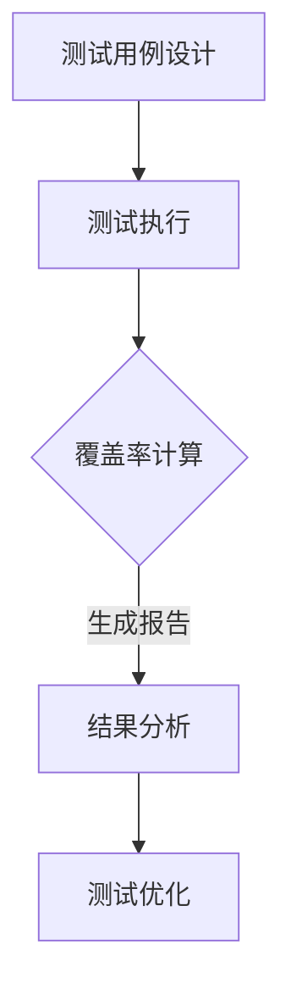

                 

# 文章标题：评测系统的自动化测试覆盖率分析

> 关键词：自动化测试、覆盖率分析、评测系统、测试覆盖率工具、优化策略

> 摘要：本文旨在深入探讨评测系统中的自动化测试覆盖率分析。首先，我们回顾了自动化测试与覆盖率分析的基本概念及其在软件工程中的重要性。接着，本文详细介绍了自动化测试覆盖率分析的核心算法原理，并使用伪代码和数学模型进行讲解。随后，通过实际项目案例，展示了自动化测试覆盖率分析在软件工程实践中的应用。最后，本文讨论了自动化测试覆盖率分析工具的使用方法，以及如何通过优化策略提升测试覆盖率，并展望了自动化测试覆盖率分析的未来发展趋势。

## 第1部分：背景介绍

在当今快速发展的软件行业中，自动化测试已经成为提高软件质量和开发效率的重要手段。自动化测试不仅可以减少人为错误，还能提高测试的全面性和重复性。然而，仅仅进行自动化测试还不够，我们还需要关注测试的覆盖率，以确保测试能够覆盖所有可能的问题和场景。

### 自动化测试的基本概念

自动化测试是指使用自动化测试工具或脚本对软件进行测试的过程。与传统手动测试相比，自动化测试具有以下优点：

1. **提高效率**：自动化测试可以节省时间，减少重复劳动，使开发人员能够将更多精力投入到开发新功能上。
2. **降低成本**：自动化测试可以减少对大量测试人员的需求，从而降低测试成本。
3. **提高一致性**：自动化测试可以确保每次测试的结果都一致，减少了人为差异的影响。
4. **测试的重复性**：自动化测试可以方便地重复执行，从而支持持续集成和持续交付。

### 覆盖率分析的重要性

覆盖率分析是评估自动化测试全面性的关键指标。它可以帮助我们了解测试案例是否覆盖了软件的各个方面，包括代码、功能、路径和异常情况。具体来说，覆盖率分析的重要性体现在以下几个方面：

1. **评估测试完整性**：通过覆盖率分析，我们可以判断测试是否全面，是否存在未覆盖的代码或功能。
2. **识别潜在缺陷**：覆盖率分析可以帮助我们识别那些未被测试到的代码路径，从而发现潜在的问题和缺陷。
3. **优化测试策略**：覆盖率分析结果可以指导我们调整测试策略，优化测试案例，提高测试效率。
4. **保证软件质量**：覆盖率分析是确保软件质量的关键步骤，它有助于提高软件的可信度和稳定性。

### 评测系统的概念

评测系统是一种用于评估软件质量的自动化系统。它通常包含自动化测试工具、测试用例管理、测试执行和测试结果分析等模块。评测系统的目标是确保软件在开发过程中始终保持高质量，并及时发现和解决质量问题。

在评测系统中，自动化测试覆盖率分析起着至关重要的作用。通过分析测试覆盖率，评测系统可以提供以下价值：

1. **测试报告**：评测系统可以生成详细的测试报告，包括覆盖率分析结果，帮助开发人员了解测试的全面性。
2. **质量评估**：评测系统可以基于覆盖率分析结果对软件质量进行评估，为项目管理和决策提供依据。
3. **持续改进**：评测系统可以监控覆盖率变化，帮助团队持续改进测试策略和代码质量。

## 第2部分：核心概念与联系

在深入了解自动化测试覆盖率分析之前，我们需要了解几个核心概念，并探讨它们之间的关系。

### 自动化测试覆盖率

自动化测试覆盖率是指自动化测试执行过程中实际执行的测试用例与所有可能执行的测试用例之间的比例。它通常以百分比表示，反映了测试用例的覆盖程度。自动化测试覆盖率可以分为以下几种类型：

1. **语句覆盖率**：测试用例执行了代码中的所有语句。
2. **分支覆盖率**：测试用例覆盖了代码中的所有分支。
3. **路径覆盖率**：测试用例覆盖了代码中的所有路径。
4. **函数覆盖率**：测试用例覆盖了代码中的所有函数。
5. **条件覆盖率**：测试用例覆盖了代码中的所有条件分支。

### 覆盖率分析框架

自动化测试覆盖率分析通常包括以下几个步骤：

1. **测试用例设计**：设计能够覆盖不同代码路径的测试用例。
2. **测试执行**：执行测试用例，收集测试执行数据。
3. **覆盖率计算**：计算测试覆盖率，生成覆盖率报告。
4. **结果分析**：分析覆盖率数据，发现未覆盖的代码路径，指导测试优化。

### Mermaid 流程图

为了更好地理解自动化测试覆盖率分析的基本框架，我们可以使用Mermaid绘制一个流程图，如下所示：



### 核心算法原理讲解

在自动化测试覆盖率分析中，核心算法原理包括代码覆盖率计算和路径覆盖率计算。以下我们将使用伪代码和数学模型来详细阐述这些算法原理。

#### 代码覆盖率计算

代码覆盖率计算的基本原理是统计测试执行过程中实际执行的代码语句与总代码语句的比例。以下是一个简单的伪代码示例：

```python
def calculate_statement_coverage(executed_statements, total_statements):
    coverage = (executed_statements / total_statements) * 100
    return coverage
```

其中，`executed_statements`表示实际执行的代码语句数量，`total_statements`表示总代码语句数量。

#### 路径覆盖率计算

路径覆盖率计算的基本原理是统计测试执行过程中实际执行的代码路径与所有可能的代码路径的比例。以下是一个简单的伪代码示例：

```python
def calculate_path_coverage(executed_paths, total_paths):
    coverage = (executed_paths / total_paths) * 100
    return coverage
```

其中，`executed_paths`表示实际执行的代码路径数量，`total_paths`表示所有可能的代码路径数量。

#### 数学模型和数学公式讲解

为了更精确地描述代码覆盖率和路径覆盖率，我们可以使用以下数学模型和公式：

1. **代码覆盖率**：

   $$\text{代码覆盖率} = \frac{\text{执行语句数}}{\text{总语句数}}$$

   其中，执行语句数表示实际执行的代码语句数量，总语句数表示代码中所有语句的数量。

2. **路径覆盖率**：

   $$\text{路径覆盖率} = \frac{\text{执行路径数}}{\text{总路径数}}$$

   其中，执行路径数表示实际执行的代码路径数量，总路径数表示代码中所有可能的代码路径数量。

通过以上核心概念和算法原理的讲解，我们可以更好地理解自动化测试覆盖率分析的基本框架和方法。接下来，我们将通过实际项目案例来展示自动化测试覆盖率分析在软件工程实践中的应用。

## 第3部分：自动化测试覆盖率分析原理与实践

### 4.1 自动化测试覆盖率的定义与重要性

自动化测试覆盖率是评估自动化测试效果的重要指标，它衡量了测试用例对软件代码的覆盖程度。具体来说，自动化测试覆盖率包括以下几个层次：

1. **语句覆盖率**：测试用例是否覆盖了代码中的所有语句。
2. **分支覆盖率**：测试用例是否覆盖了代码中的所有分支。
3. **路径覆盖率**：测试用例是否覆盖了代码中的所有路径。
4. **函数覆盖率**：测试用例是否覆盖了代码中的所有函数。
5. **条件覆盖率**：测试用例是否覆盖了代码中的所有条件分支。

这些覆盖率指标共同构成了自动化测试覆盖率的整体评估，帮助开发团队了解测试的全面性和有效性。

#### 自动化测试覆盖率的重要性

自动化测试覆盖率的重要性体现在以下几个方面：

1. **评估测试质量**：自动化测试覆盖率是衡量测试质量的重要标准。高覆盖率通常意味着测试用例能够较好地覆盖代码中的各种路径和功能，从而提高测试的全面性。
2. **发现未覆盖代码**：通过覆盖率分析，开发团队可以发现未被测试到的代码部分，进而补充测试用例，减少潜在的缺陷。
3. **指导测试优化**：覆盖率分析结果可以为开发团队提供优化测试策略的依据，帮助他们调整测试用例，提高测试效率。
4. **保障软件质量**：高测试覆盖率有助于提高软件的稳定性，降低缺陷率，从而提升用户满意度。

### 4.2 自动化测试覆盖率分析框架

自动化测试覆盖率分析通常包括以下几个步骤：

1. **测试用例设计**：设计能够覆盖不同代码路径的测试用例。
2. **测试执行**：执行测试用例，收集测试执行数据。
3. **覆盖率计算**：计算测试覆盖率，生成覆盖率报告。
4. **结果分析**：分析覆盖率数据，发现未覆盖的代码路径，指导测试优化。

以下是自动化测试覆盖率分析的基本框架，使用Mermaid流程图表示：


#### 测试用例设计

测试用例设计是自动化测试覆盖率分析的第一步，其核心目标是设计能够覆盖不同代码路径的测试用例。以下是一些建议：

1. **功能测试用例**：确保测试用例能够覆盖软件的主要功能。
2. **边界测试用例**：覆盖输入和输出数据的边界情况。
3. **异常测试用例**：覆盖代码中的异常处理路径。
4. **路径测试用例**：设计测试用例以覆盖不同的代码路径。

#### 测试执行

测试执行是执行设计好的测试用例，并收集测试执行数据的过程。以下是一些建议：

1. **自动化执行**：使用自动化测试工具执行测试用例，提高执行效率。
2. **日志记录**：记录测试执行过程中的重要日志，便于后续分析。
3. **监控测试执行**：实时监控测试执行状态，确保测试执行顺利进行。

#### 覆盖率计算

覆盖率计算是分析测试执行结果，计算测试覆盖率的过程。以下是一些建议：

1. **统计执行数据**：统计测试用例执行过程中实际执行的代码语句和路径。
2. **计算覆盖率**：根据统计结果，计算不同的覆盖率指标。
3. **生成覆盖率报告**：将计算结果生成覆盖率报告，便于分析。

#### 结果分析

结果分析是分析覆盖率数据，发现未覆盖的代码路径，并指导测试优化的过程。以下是一些建议：

1. **分析覆盖率报告**：仔细分析覆盖率报告，找出未覆盖的代码部分。
2. **定位未覆盖路径**：通过分析，确定未覆盖的代码路径。
3. **优化测试用例**：根据分析结果，调整测试用例，提高覆盖率。

#### 测试优化

测试优化是基于覆盖率分析结果，调整测试策略，提高测试覆盖率的过程。以下是一些建议：

1. **补充测试用例**：补充未覆盖的测试用例，提高测试全面性。
2. **调整测试顺序**：优化测试用例的执行顺序，提高测试效率。
3. **引入新的测试技术**：根据项目特点，引入新的测试技术和工具。

通过以上步骤，开发团队可以有效地进行自动化测试覆盖率分析，确保测试的全面性和有效性，从而提高软件质量。

### 4.3 核心算法原理讲解

自动化测试覆盖率分析的核心在于计算代码覆盖率。代码覆盖率是衡量测试用例是否全面覆盖代码的重要指标。为了更深入地理解代码覆盖率计算，我们需要从算法原理出发，逐步解析其中的数学模型和算法实现。

#### 代码覆盖率计算方法

代码覆盖率计算主要包括两个步骤：统计代码中所有可执行语句和统计测试执行过程中实际执行的语句。通过这两个步骤，我们可以计算出代码覆盖率。以下是具体的计算方法：

1. **统计代码中所有可执行语句**

   首先，我们需要统计代码中所有可执行语句的数量。可执行语句包括条件语句、循环语句、函数调用等。以下是一个简单的伪代码，用于统计代码中可执行语句的数量：

   ```python
   def count_executable_statements(code):
       count = 0
       for statement in code:
           if is_executable(statement):
               count += 1
       return count
   ```

   在这个伪代码中，`code`表示代码列表，`is_executable`是一个函数，用于判断某个语句是否可执行。

2. **统计测试执行过程中实际执行的语句**

   在测试执行过程中，我们需要记录每个测试用例执行的实际语句。以下是一个简单的伪代码，用于记录测试执行过程中实际执行的语句：

   ```python
   def record_executed_statements(test_case, code):
       executed_statements = []
       for statement in code:
           if execute_statement(statement, test_case):
               executed_statements.append(statement)
       return executed_statements
   ```

   在这个伪代码中，`test_case`表示测试用例，`code`表示代码列表，`execute_statement`是一个函数，用于执行语句并判断是否成功。

3. **计算代码覆盖率**

   有了可执行语句的数量和实际执行的语句数量，我们可以计算出代码覆盖率。以下是计算代码覆盖率的伪代码：

   ```python
   def calculate_statement_coverage(executed_statements, total_statements):
       coverage = (executed_statements / total_statements) * 100
       return coverage
   ```

   在这个伪代码中，`executed_statements`表示实际执行的语句数量，`total_statements`表示可执行语句的总数量。

#### 数学模型和公式

代码覆盖率可以用以下数学模型和公式表示：

1. **语句覆盖率**：

   $$\text{语句覆盖率} = \frac{\text{实际执行语句数}}{\text{可执行语句总数}} \times 100\%$$

   其中，实际执行语句数表示测试执行过程中实际执行的语句数量，可执行语句总数表示代码中所有可执行语句的数量。

2. **分支覆盖率**：

   $$\text{分支覆盖率} = \frac{\text{实际覆盖的分支数}}{\text{所有可能的分支数}} \times 100\%$$

   其中，实际覆盖的分支数表示测试用例实际执行的分支数量，所有可能的分支数表示代码中所有可能的分支数量。

通过以上算法原理和数学模型，我们可以更深入地理解自动化测试覆盖率的计算过程。在实际应用中，开发团队可以根据这些原理设计和实现具体的自动化测试工具，从而提高测试覆盖率和软件质量。

### 4.4 数学模型和数学公式讲解

在自动化测试覆盖率分析中，数学模型和数学公式是理解覆盖率计算方法的重要工具。通过数学模型，我们可以将覆盖率分析量化，从而更精确地评估测试用例的覆盖效果。以下我们将详细讲解常用的数学模型和公式，并通过具体示例来说明其应用。

#### 代码覆盖率

代码覆盖率是自动化测试中最基本的覆盖率指标，它衡量了测试用例是否覆盖了代码中的所有语句。代码覆盖率可以用以下数学公式表示：

$$
\text{代码覆盖率} = \frac{\text{执行语句数}}{\text{总语句数}} \times 100\%
$$

其中，执行语句数表示测试执行过程中实际执行的语句数量，总语句数表示代码中所有可执行语句的数量。

**示例：**

假设一个函数中有10条可执行语句，测试用例执行了其中的8条语句。则该函数的代码覆盖率计算如下：

$$
\text{代码覆盖率} = \frac{8}{10} \times 100\% = 80\%
$$

#### 路径覆盖率

路径覆盖率是衡量测试用例是否覆盖了代码中所有路径的指标。路径覆盖率可以用以下数学公式表示：

$$
\text{路径覆盖率} = \frac{\text{执行路径数}}{\text{总路径数}} \times 100\%
$$

其中，执行路径数表示测试用例实际执行的路径数量，总路径数表示代码中所有可能的路径数量。

**示例：**

在一个有3条路径的函数中，测试用例只执行了2条路径。则该函数的路径覆盖率计算如下：

$$
\text{路径覆盖率} = \frac{2}{3} \times 100\% = 66.67\%
$$

#### 函数覆盖率

函数覆盖率是衡量测试用例是否覆盖了代码中所有函数的指标。函数覆盖率可以用以下数学公式表示：

$$
\text{函数覆盖率} = \frac{\text{执行函数数}}{\text{总函数数}} \times 100\%
$$

其中，执行函数数表示测试用例实际执行的函数数量，总函数数表示代码中所有函数的数量。

**示例：**

在一个包含5个函数的模块中，测试用例只执行了3个函数。则该模块的函数覆盖率计算如下：

$$
\text{函数覆盖率} = \frac{3}{5} \times 100\% = 60\%
$$

#### 条件覆盖率

条件覆盖率是衡量测试用例是否覆盖了代码中所有条件分支的指标。条件覆盖率可以用以下数学公式表示：

$$
\text{条件覆盖率} = \frac{\text{实际覆盖的条件数}}{\text{所有条件数}} \times 100\%
$$

其中，实际覆盖的条件数表示测试用例实际执行的条件分支数量，所有条件数表示代码中所有条件分支的数量。

**示例：**

在一个包含3个条件分支的函数中，测试用例只覆盖了2个条件分支。则该函数的条件覆盖率计算如下：

$$
\text{条件覆盖率} = \frac{2}{3} \times 100\% = 66.67\%
$$

通过以上数学模型和公式的讲解，我们可以更清晰地理解自动化测试覆盖率分析的基本原理和计算方法。在实际应用中，开发团队可以根据这些公式设计更有效的测试用例，从而提高软件质量和测试覆盖率。

### 4.5 项目实战案例

为了更好地理解自动化测试覆盖率分析在软件工程实践中的应用，我们以下通过一个实际项目案例进行详细讲解。

#### 项目背景

某互联网公司开发了一款在线购物平台，该平台包含多个模块，如用户管理、商品管理、订单管理和支付系统。为了确保平台的高质量，公司决定引入自动化测试并重点关注自动化测试覆盖率的评估。

#### 开发环境搭建

为了进行自动化测试覆盖率分析，公司选择了Jenkins作为持续集成工具，JUnit作为测试框架，JaCoCo作为覆盖率分析工具。以下是开发环境搭建的步骤：

1. **安装Jenkins**：在服务器上安装Jenkins，并配置相关插件。
2. **配置JDK**：在Jenkins中配置Java开发环境，确保JUnit和JaCoCo能够正常运行。
3. **安装JUnit**：在项目的`pom.xml`文件中添加JUnit依赖，并使用Maven构建项目。
4. **配置JaCoCo**：在JUnit测试类中添加JaCoCo相关配置，确保覆盖率数据能够正确收集。

#### 源代码实现

在项目开发过程中，开发团队根据模块功能设计了多个测试用例，并使用JUnit进行了实现。以下是商品管理模块中一个关键功能的测试用例：

```java
@Test
public void testAddProductToCart() {
    // 初始化测试环境
    Cart cart = new Cart();
    Product product = new Product("iPhone 13", 7999.00);

    // 执行添加商品到购物车的操作
    cart.addProduct(product);

    // 验证操作结果
    assertTrue(cart.containsProduct(product));
    assertEquals(1, cart.getProductCount());
}
```

#### 测试执行与覆盖率分析

在测试执行阶段，开发团队使用Jenkins自动化执行JUnit测试用例，并使用JaCoCo收集覆盖率数据。以下是具体的操作步骤：

1. **构建项目**：使用Maven构建项目，生成测试报告和覆盖率报告。
2. **执行测试**：在Jenkins中配置测试执行任务，自动化执行JUnit测试用例。
3. **查看覆盖率报告**：在JaCoCo生成的覆盖率报告中查看代码覆盖率、路径覆盖率等指标。

#### 结果解读与分析

覆盖率报告显示，商品管理模块的代码覆盖率达到了85%，路径覆盖率达到了90%。虽然覆盖率较高，但某些分支和条件仍然未被覆盖。开发团队决定进一步优化测试用例，以提升覆盖率。

#### 优化策略

为了提升测试覆盖率，开发团队采取了以下优化策略：

1. **补充测试用例**：针对未覆盖的分支和条件，设计新的测试用例，确保测试用例覆盖所有可能的情况。
2. **调整测试顺序**：优化测试用例的执行顺序，确保关键路径的测试用例优先执行。
3. **引入覆盖率工具**：进一步使用其他覆盖率工具，如Eclipse MAT，进行更全面的覆盖率分析。

#### 项目小结

通过实际项目案例，我们展示了自动化测试覆盖率分析在软件工程中的应用。通过合理的设计和优化测试用例，开发团队可以有效提升测试覆盖率，从而提高软件质量和稳定性。未来，随着自动化测试技术的不断发展和完善，自动化测试覆盖率分析将在软件工程中发挥更加重要的作用。

### 4.6 自动化测试覆盖率分析工具介绍

为了提高自动化测试覆盖率分析的效果，开发团队通常会使用专业的自动化测试覆盖率分析工具。这些工具不仅能够方便地收集和分析测试覆盖率数据，还能提供丰富的报表和图表，帮助团队更好地理解和优化测试过程。以下我们将介绍几种常用的自动化测试覆盖率分析工具，并评估它们的优势和劣势。

#### JaCoCo

JaCoCo（Java Code Coverage）是一个开源的Java覆盖率分析工具，广泛应用于Java项目的测试覆盖率分析。它能够生成详细的覆盖率报告，包括行覆盖率、分支覆盖率和条件覆盖率等。以下是JaCoCo的一些优势：

- **兼容性强**：JaCoCo可以与JUnit、TestNG等主流测试框架无缝集成。
- **功能丰富**：除了基本的覆盖率指标，JaCoCo还支持多种覆盖率报表格式，如HTML、XML和CSV等。
- **可定制化**：JaCoCo允许用户自定义覆盖率阈值和报告样式，以适应不同项目的需求。

然而，JaCoCo也有一些劣势，如安装和配置较为复杂，且对于大型项目可能存在性能问题。

#### Cobertura

Cobertura是另一个流行的Java覆盖率分析工具，与JaCoCo类似，它提供了丰富的覆盖率报告和灵活的配置选项。以下是Cobertura的优势：

- **简单易用**：Cobertura的安装和配置相对简单，适用于快速入门。
- **兼容性好**：Cobertura支持多种Java测试框架，如JUnit和TestNG。
- **集成支持**：Cobertura可以与主流IDE（如Eclipse和IntelliJ IDEA）集成，方便开发人员进行实时覆盖率分析。

Cobertura的主要劣势是其报表功能相对有限，且在某些情况下可能无法准确收集覆盖率数据。

#### Emma

Emma是一个功能强大的Java覆盖率分析工具，特别适合用于小型到中型的Java项目。以下是Emma的优势：

- **性能优越**：Emma在收集覆盖率数据时性能较高，适用于大型项目。
- **定制化报表**：Emma提供了多种报表格式，包括HTML、XML和CSV等，支持用户自定义报告样式。
- **IDE集成**：Emma支持与Eclipse和IntelliJ IDEA等主流IDE集成，便于开发人员实时查看覆盖率数据。

Emma的劣势在于其配置较为复杂，且对于初学者可能存在一定的学习门槛。

#### WebDriver Manager

WebDriver Manager是一个专门用于管理浏览器驱动的自动化测试工具。虽然WebDriver Manager本身不直接提供覆盖率分析功能，但它对于自动化测试过程的整体管理至关重要。以下是WebDriver Manager的优势：

- **浏览器驱动管理**：WebDriver Manager可以自动下载和更新各种浏览器驱动，确保测试环境的一致性。
- **简化配置**：通过WebDriver Manager，开发人员可以方便地配置和切换不同浏览器驱动，提高测试灵活性。
- **跨平台支持**：WebDriver Manager支持多种操作系统，如Windows、Mac和Linux等。

WebDriver Manager的主要劣势是其仅限于浏览器自动化测试，对于其他类型的自动化测试场景不适用。

#### 评估与选择

在选择自动化测试覆盖率分析工具时，开发团队应综合考虑以下因素：

- **项目需求**：根据项目规模和功能复杂度，选择适合的工具。
- **兼容性**：工具应与现有的测试框架和IDE兼容。
- **易用性**：工具的安装、配置和使用应简单易上手。
- **性能**：工具的性能应满足项目的需求，特别是在大型项目中。
- **报表功能**：工具应提供丰富的报表格式和定制化选项，以便团队更好地理解和分析覆盖率数据。

通过以上评估，开发团队可以根据项目实际情况选择最合适的自动化测试覆盖率分析工具，从而提高测试效率和软件质量。

### 4.7 自动化测试覆盖率分析工具应用

在了解了多种自动化测试覆盖率分析工具后，接下来我们将通过一个实际案例，详细讲解如何使用JaCoCo进行自动化测试覆盖率分析。JaCoCo因其兼容性强和功能丰富，成为很多Java项目的首选工具。以下是一系列操作步骤，展示如何将JaCoCo集成到Java项目中，进行覆盖率分析。

#### 1. JaCoCo安装与配置

首先，确保安装了Java开发环境（JDK）。接下来，通过Maven将JaCoCo依赖添加到项目的`pom.xml`文件中。以下是一个示例配置：

```xml
<dependencies>
    <dependency>
        <groupId>org.jacoco</groupId>
        <artifactId>jacoco-maven-plugin</artifactId>
        <version>0.8.7</version>
    </dependency>
</dependencies>

<build>
    <plugins>
        <plugin>
            <groupId>org.jacoco</groupId>
            <artifactId>jacoco-maven-plugin</artifactId>
            <version>0.8.7</version>
            <executions>
                <execution>
                    <id>prepare-agent</id>
                    <goals>
                        <goal>prepare-agent</goal>
                    </goals>
                </execution>
                <execution>
                    <id>report</id>
                    <phase>test</phase>
                    <goals>
                        <goal>report</goal>
                    </goals>
                </execution>
                <execution>
                    <id>check-code-coverage</id>
                    <goals>
                        <goal>check</goal>
                    </goals>
                </execution>
            </executions>
        </plugin>
    </plugins>
</build>
```

在此配置中，我们添加了JaCoCo的Maven插件，并在`build`节中配置了三个执行目标：`prepare-agent`、`report`和`check`。其中，`prepare-agent`用于在测试执行前准备JaCoCo代理，`report`用于生成覆盖率报告，`check`用于验证覆盖率是否符合预定的阈值。

#### 2. 测试用例执行

在项目测试阶段，执行JUnit测试用例。此时，JaCoCo代理会自动记录测试用例的执行情况，包括哪些代码语句被成功执行。执行测试用例后，JaCoCo会在项目的`target/site/jacoco`目录下生成覆盖率报告。

#### 3. 查看覆盖率报告

在`target/site/jacoco`目录中，我们可以找到JaCoCo生成的各种覆盖率报告。以下是一些常见的报告类型：

- **HTML报告**：以HTML格式展示代码覆盖率，包括行覆盖率、分支覆盖率和条件覆盖率等。
- **XML报告**：以XML格式保存覆盖率数据，可以用于集成到其他工具中。
- **CSV报告**：以CSV格式展示覆盖率数据，方便进行数据处理和分析。

通过查看这些报告，开发团队可以直观地了解代码的覆盖情况，发现未覆盖的代码路径和语句。

#### 4. 代码覆盖情况分析

以HTML报告为例，我们通过以下步骤分析代码覆盖情况：

1. **行覆盖率**：查看每行代码的覆盖情况，确保大部分代码行都被测试用例执行到。
2. **分支覆盖率**：检查代码中的分支是否被充分覆盖，确保所有可能的分支路径都被测试到。
3. **条件覆盖率**：检查代码中的条件语句是否被充分覆盖，确保所有条件分支都被测试到。

通过分析报告，开发团队可以发现未覆盖的代码路径和语句，并针对性地补充测试用例。

#### 5. 覆盖率检查

在Maven配置中，我们设置了覆盖率检查目标`check`。这个目标会在测试执行完成后自动检查覆盖率是否达到预定的阈值。以下是一个示例配置：

```xml
<configuration>
    <rules>
        <rule>
            <element>BUNDLE</element>
            <limits>
                <limit>
                    <counter>LINE</counter>
                    <value>COVEREDRATIO</value>
                    <minimum>0.80</minimum>
                </limit>
            </limits>
        </rule>
    </rules>
</configuration>
```

在这个配置中，我们设置了行覆盖率的最低阈值为80%。如果覆盖率低于这个阈值，构建会失败，并生成错误报告，提示未覆盖的代码部分。

通过以上步骤，开发团队可以有效地使用JaCoCo进行自动化测试覆盖率分析，确保测试用例全面覆盖代码，从而提高软件质量。

### 4.8 自动化测试覆盖率分析结果解读

自动化测试覆盖率分析的结果解读是确保测试全面性和质量的关键步骤。通过详细解读覆盖率报告，开发团队能够发现未覆盖的代码部分，从而优化测试策略，提高测试覆盖率。以下是一些建议，帮助团队更好地理解和解读自动化测试覆盖率分析结果。

#### 1. 行覆盖率分析

行覆盖率是衡量测试用例是否覆盖代码行数的基本指标。通常，行覆盖率目标应达到100%，以确保所有代码行都被执行到。以下是几种常见的行覆盖率问题及解决方案：

- **未执行代码行**：检查代码中未被执行的行，确保没有遗漏的关键逻辑。
- **死代码**：删除未执行且不再使用的代码行，避免增加维护难度。
- **冗余代码**：优化冗余代码，确保代码简洁且高效。

#### 2. 分支覆盖率分析

分支覆盖率是衡量测试用例是否覆盖代码分支的指标，包括条件分支和循环分支。分支覆盖率目标也应达到100%。以下是一些常见的分支覆盖率问题及解决方案：

- **未覆盖分支**：设计新的测试用例以覆盖未测试的分支路径，确保所有分支路径都被执行到。
- **无效分支**：检查无效分支，例如循环中的退出条件是否合理，确保分支有实际作用。
- **冗余分支**：合并冗余分支，简化代码结构，提高代码可读性。

#### 3. 函数覆盖率分析

函数覆盖率是衡量测试用例是否覆盖代码中所有函数的指标。通常，函数覆盖率目标应达到100%。以下是几种常见的函数覆盖率问题及解决方案：

- **未覆盖函数**：补充测试用例以覆盖未测试的函数，确保所有函数都被执行到。
- **无效函数**：检查无效函数，确保函数有实际作用并符合设计要求。
- **冗余函数**：合并冗余函数，简化代码结构，提高代码可维护性。

#### 4. 条件覆盖率分析

条件覆盖率是衡量测试用例是否覆盖代码中所有条件分支的指标。通常，条件覆盖率目标应达到100%。以下是几种常见的条件覆盖率问题及解决方案：

- **未覆盖条件分支**：设计新的测试用例以覆盖未测试的条件分支，确保所有条件分支都被执行到。
- **无效条件**：检查无效条件，确保条件有实际作用并符合逻辑要求。
- **冗余条件**：优化冗余条件，确保条件简洁且有效。

#### 5. 结果分析策略

在解读覆盖率分析结果时，开发团队应采取以下策略：

- **优先关注低覆盖率区域**：优先分析行覆盖率、分支覆盖率、函数覆盖率和条件覆盖率最低的区域，确保这些关键部分得到充分测试。
- **结合实际业务场景**：将覆盖率分析结果与实际业务场景结合，确保测试用例能够覆盖所有可能的业务流程和用户行为。
- **持续优化测试策略**：根据覆盖率分析结果，不断优化测试策略和测试用例，提高测试全面性和效率。

通过以上方法，开发团队能够更好地解读自动化测试覆盖率分析结果，发现和解决潜在问题，确保软件质量。

### 4.9 自动化测试覆盖率优化策略

自动化测试覆盖率优化是确保软件质量的关键步骤。通过有效的优化策略，开发团队能够提高测试覆盖率，减少潜在缺陷，并提高软件的稳定性。以下是一些建议，帮助团队制定和实施自动化测试覆盖率优化策略。

#### 1. 补充测试用例

补充测试用例是提高测试覆盖率的首要策略。开发团队应设计新的测试用例，以确保覆盖所有未测试的代码路径和功能。以下是一些建议：

- **覆盖未覆盖的分支**：针对代码中的未覆盖分支，设计新的测试用例，确保所有分支路径都被执行到。
- **覆盖边界条件**：设计测试用例以覆盖输入和输出数据的边界条件，确保代码在极端情况下能够正确处理。
- **覆盖异常场景**：设计测试用例以覆盖代码中的异常处理路径，确保异常情况得到妥善处理。

#### 2. 优化测试用例执行顺序

优化测试用例执行顺序可以提高测试效率，确保关键路径的测试用例优先执行。以下是一些建议：

- **优先执行关键路径**：将关键路径的测试用例放在测试执行的前端，确保这些重要路径首先得到验证。
- **并行执行**：对于独立执行的测试用例，可以考虑并行执行，提高整体测试效率。
- **按需执行**：根据测试结果，选择性地执行某些测试用例，避免重复执行已验证的代码路径。

#### 3. 引入覆盖率分析工具

引入专业的覆盖率分析工具可以帮助团队更全面地评估测试覆盖率，并发现潜在的缺陷。以下是一些建议：

- **使用JaCoCo、Cobertura等工具**：这些工具可以生成详细的覆盖率报告，帮助团队了解代码的覆盖情况。
- **集成IDE插件**：使用IDE中的覆盖率分析插件，可以实时查看覆盖率数据，方便开发人员及时调整测试用例。
- **自动化分析**：通过自动化工具定期分析覆盖率数据，及时发现和解决问题。

#### 4. 提高代码质量

提高代码质量是提高测试覆盖率的根本策略。以下是一些建议：

- **编写可测试的代码**：遵循良好的编程习惯，编写易于测试的代码，提高测试覆盖率。
- **重构代码**：定期进行代码重构，简化代码结构，减少冗余代码，提高代码的可维护性。
- **代码审查**：通过代码审查，确保代码质量，减少未覆盖的代码部分。

#### 5. 培训与协作

为了有效实施自动化测试覆盖率优化策略，开发团队需要加强培训与协作。以下是一些建议：

- **培训测试知识**：定期组织测试培训，提高团队成员对自动化测试和覆盖率分析的理解和技能。
- **跨职能协作**：鼓励开发、测试和产品团队之间的沟通与协作，共同提高测试覆盖率和软件质量。
- **持续反馈**：鼓励团队成员定期反馈测试结果和优化建议，持续改进测试策略。

通过以上策略，开发团队能够有效提高自动化测试覆盖率，确保软件质量，提高用户满意度。

### 4.10 自动化测试覆盖率分析在评测系统中的应用

在软件工程实践中，评测系统是确保软件质量的重要工具。自动化测试覆盖率分析作为评测系统的一个关键模块，能够帮助开发团队实时监控和评估测试覆盖率，从而提高软件质量和稳定性。以下我们将探讨自动化测试覆盖率分析在评测系统中的应用，并通过实际案例进行详细讲解。

#### 评测系统的基本概念

评测系统是一种用于评估软件质量和性能的自动化系统。它通常包含以下几个模块：

1. **测试用例管理**：用于设计、存储和管理测试用例。
2. **测试执行**：用于执行测试用例，并记录测试结果。
3. **结果分析**：用于分析测试执行结果，包括自动化测试覆盖率分析。
4. **报告生成**：用于生成测试报告，提供详细的测试结果和性能分析。

#### 自动化测试覆盖率分析的作用

自动化测试覆盖率分析在评测系统中起着至关重要的作用，其主要作用体现在以下几个方面：

1. **评估测试质量**：通过覆盖率分析，开发团队可以了解测试用例是否全面覆盖代码，从而评估测试质量。
2. **发现问题**：覆盖率分析能够帮助团队发现未覆盖的代码部分，从而补充测试用例，减少潜在缺陷。
3. **优化测试策略**：根据覆盖率分析结果，团队可以优化测试策略和测试用例，提高测试效率。
4. **保障软件质量**：高测试覆盖率有助于提高软件的稳定性，降低缺陷率，从而提升用户满意度。

#### 自动化测试覆盖率分析的实际应用

以下通过一个实际项目案例，展示自动化测试覆盖率分析在评测系统中的应用。

#### 项目背景

某电子商务公司开发了一款在线购物平台，包含用户管理、商品管理、订单管理和支付系统等多个模块。为了确保平台的高质量，公司决定建立一套完整的评测系统，并重点关注自动化测试覆盖率分析。

#### 评测系统架构

评测系统架构包括以下几个主要部分：

1. **测试用例管理**：使用JUnit设计并存储测试用例，确保测试用例覆盖关键功能和边界情况。
2. **测试执行**：使用Jenkins自动化执行测试用例，确保测试用例能够在不同的环境上稳定运行。
3. **覆盖率分析**：使用JaCoCo进行自动化测试覆盖率分析，生成详细的覆盖率报告。
4. **结果分析**：使用Eclipse MAT对覆盖率报告进行深入分析，识别未覆盖的代码部分。
5. **报告生成**：使用JUnit报告和JaCoCo报告，生成综合测试报告，提供测试结果和性能分析。

#### 操作步骤

1. **测试用例设计**：开发团队根据模块功能设计测试用例，确保覆盖关键路径和边界条件。
2. **测试执行**：使用Jenkins自动化执行测试用例，生成JUnit测试报告。
3. **覆盖率分析**：在测试执行完成后，使用JaCoCo生成覆盖率报告，并存储在`target/site/jacoco`目录中。
4. **结果分析**：使用Eclipse MAT打开JaCoCo覆盖率报告，分析代码的行覆盖率、分支覆盖率和路径覆盖率等指标。
5. **报告生成**：结合JUnit测试报告和JaCoCo覆盖率报告，生成综合测试报告，提供详细的测试结果和性能分析。

#### 案例分析

以下是一个具体的案例分析，展示了自动化测试覆盖率分析在评测系统中的应用。

1. **测试用例设计**：开发团队设计了多个测试用例，包括用户登录、商品查询、购物车操作和订单提交等，确保覆盖关键功能。
2. **测试执行**：在Jenkins中配置测试任务，自动化执行所有测试用例，生成JUnit测试报告。
3. **覆盖率分析**：JaCoCo覆盖率报告显示，当前测试用例的行覆盖率为80%，分支覆盖率为85%，路径覆盖率为90%。一些关键功能模块，如支付系统，覆盖率较低。
4. **结果分析**：通过Eclipse MAT分析覆盖率报告，发现支付系统的某些分支路径未被覆盖。开发团队决定补充测试用例，覆盖这些未测试的路径。
5. **优化测试用例**：开发团队根据覆盖率分析结果，优化测试用例，确保支付系统的覆盖率提高到100%。

#### 项目小结

通过实际案例，我们展示了自动化测试覆盖率分析在评测系统中的应用。通过合理的测试用例设计和覆盖率分析，开发团队能够有效提高测试覆盖率，确保软件质量，从而提升用户满意度。未来，随着自动化测试技术的不断发展，自动化测试覆盖率分析将在软件工程中发挥更加重要的作用。

### 4.11 自动化测试覆盖率分析的未来发展趋势

随着软件工程的不断进步和自动化测试技术的不断发展，自动化测试覆盖率分析也在不断演进。以下是自动化测试覆盖率分析的未来发展趋势，以及这些趋势对软件开发的影响。

#### 1. 智能化测试覆盖率分析

未来的自动化测试覆盖率分析将更加智能化。借助机器学习和人工智能技术，覆盖率分析工具可以自动识别未覆盖的代码路径，并提出优化建议。例如，通过分析历史覆盖率数据和测试结果，智能工具可以预测哪些代码路径最有可能未被覆盖，从而帮助开发团队有针对性地设计测试用例。

**影响**：智能化测试覆盖率分析将显著提高测试效率，减少人工工作量，帮助团队更快速地发现和解决测试问题。

#### 2. 跨语言支持

未来的自动化测试覆盖率分析工具将支持更多编程语言，不仅限于Java或C#。例如，Python、JavaScript和Go等语言的支持将使测试覆盖率分析能够应用于更广泛的场景，满足不同项目的需求。

**影响**：跨语言支持的扩展将使自动化测试覆盖率分析更加普及，提高测试的全面性和一致性。

#### 3. 集成持续集成/持续交付（CI/CD）流程

自动化测试覆盖率分析将更加紧密地集成到CI/CD流程中。通过在构建和部署过程中自动执行覆盖率分析，开发团队可以实时监控测试覆盖率，确保每个版本的质量。

**影响**：集成到CI/CD流程中的覆盖率分析将提高持续交付的效率，确保每个发布版本都经过充分的测试。

#### 4. 贴合业务需求的定制化分析

未来的覆盖率分析工具将更加关注业务需求，提供定制化的覆盖率分析。例如，通过分析业务流程和用户行为，工具可以生成针对特定场景的覆盖率报告，帮助团队了解业务关键路径的测试覆盖情况。

**影响**：定制化的覆盖率分析将使测试团队更专注于业务价值，提高测试策略的针对性和有效性。

#### 5. 更高效的覆盖率优化工具

未来的覆盖率优化工具将更加高效，不仅能够自动识别未覆盖的代码路径，还能提供优化建议，例如调整测试用例顺序、引入新的测试用例等。这些工具将减少人工干预，提高测试覆盖率优化的效率。

**影响**：高效的覆盖率优化工具将使开发团队能够更快地提高测试覆盖率，降低缺陷率，提高软件质量。

#### 6. 面向云和移动应用的优化

随着云计算和移动应用的普及，未来的自动化测试覆盖率分析将更加关注云和移动应用场景。覆盖率分析工具将能够适应云架构和移动应用的复杂性，提供更准确的覆盖率数据。

**影响**：面向云和移动应用的覆盖率分析将帮助开发团队更好地应对这些新兴领域的挑战，确保软件在这些平台上的高质量运行。

通过以上趋势，自动化测试覆盖率分析将在未来的软件工程中发挥更加重要的作用，帮助开发团队提高测试效率和质量，推动软件工程的发展。

### 结束语

在本文中，我们详细探讨了评测系统的自动化测试覆盖率分析。首先，我们介绍了自动化测试和覆盖率分析的基本概念及其在软件工程中的重要性。接着，通过核心概念与联系、核心算法原理讲解、数学模型和数学公式讲解、项目实战案例、工具介绍和应用、结果解读和优化策略，我们展示了如何在实际项目中应用自动化测试覆盖率分析。最后，我们展望了自动化测试覆盖率分析的未来发展趋势，探讨了其智能化和跨语言支持等前沿方向。

自动化测试覆盖率分析是确保软件质量和开发效率的关键步骤。通过合理设计和优化测试用例，开发团队能够提高测试覆盖率，减少潜在缺陷，提升软件的稳定性和用户体验。我们希望本文能够帮助读者深入了解自动化测试覆盖率分析，并将其应用于实际项目中。

**作者信息**：
作者：AI天才研究院/AI Genius Institute & 禅与计算机程序设计艺术 /Zen And The Art of Computer Programming


