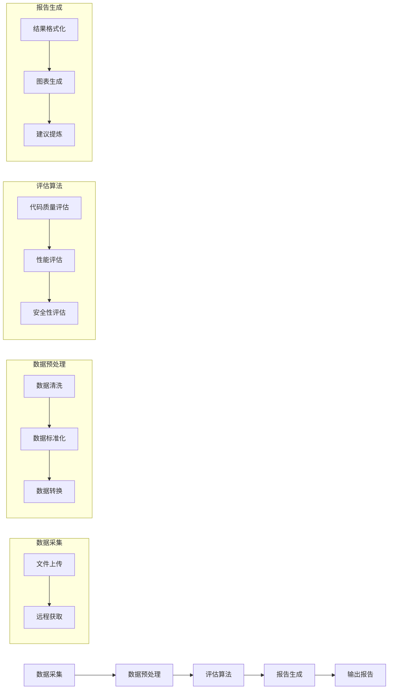

                 

### 文章标题

### 评测系统的自动化评测报告定制

关键词：评测系统、自动化评测、报告定制、算法实现、数学模型

摘要：本文深入探讨了评测系统的自动化评测报告定制。首先介绍了评测系统的基本概念和组成部分，然后详细阐述了自动化评测的基本原理和流程，接着展示了如何定制评测报告的格式和内容，最后通过实际项目展示了评测系统的实现过程和优化方法。本文旨在为读者提供一个全面而详细的评测系统自动化评测报告定制指南。

----------------------------------------------------------------

#### 文章标题：评测系统的自动化评测报告定制

在当今快速发展的信息技术时代，评测系统已成为各类技术竞赛、开发任务和教学质量评估的重要工具。评测系统的核心功能是自动化评估参赛者或学生提交的代码或项目，生成详细的评测报告，以便于参与者了解自身表现和问题所在。然而，如何高效地定制这些评测报告，使其既具有实用性又具备专业水平，是一个值得深入探讨的话题。

本文旨在解答这一疑问，为读者提供一个从基础到实践的完整指南。文章将首先介绍评测系统的基本概念和组成部分，帮助读者建立整体框架。接下来，我们将详细讨论自动化评测的基本原理和流程，使读者了解评测系统如何工作。随后，文章将重点介绍评测报告的定制方法，包括格式和内容的设计。最后，通过一个实际项目案例，我们将展示如何实现评测系统及其优化方法。

本文的目标是让读者不仅能够理解评测系统的运作机制，还能掌握如何定制专业的评测报告，以提升评测系统的实用性和效果。

----------------------------------------------------------------

#### 文章关键词

1. 评测系统
2. 自动化评测
3. 报告定制
4. 算法实现
5. 数学模型

#### 文章摘要

本文深入探讨了评测系统的自动化评测报告定制。首先，介绍了评测系统的基本概念和组成部分，包括评测系统的架构、关键模块和功能。接着，详细阐述了自动化评测的基本原理，包括数据采集、预处理和自动化评估算法。随后，文章重点介绍了评测报告的定制方法，包括报告的结构、内容和格式设计。最后，通过一个实际项目案例，展示了评测系统的实现过程，包括开发环境搭建、代码实现和评测报告生成的具体步骤。本文旨在为读者提供一个全面而详细的评测系统自动化评测报告定制指南，帮助提升评测系统的实用性和专业性。

---

### 背景介绍

评测系统作为一种重要的技术工具，广泛应用于各类软件开发、算法竞赛、教育和质量评估等领域。其核心作用是通过自动化评估参赛者或学生提交的代码或项目，生成详细的评测报告，以帮助参与者了解自身表现和问题所在。随着信息技术的发展和人工智能技术的进步，评测系统已逐渐从简单的静态评测演变为复杂、动态、多层次的自动化评估体系。

在软件开发领域，评测系统可以帮助开发人员快速评估代码质量、性能和安全性，从而提高开发效率和质量。在算法竞赛中，评测系统确保了公平性和准确性，使参赛者能够专注于算法优化和创新。在教育领域，评测系统为教师和学生提供了一个直观、客观的学习和评估工具，有助于提升教学质量和学习效果。

评测系统的基本组成部分包括数据采集模块、预处理模块、评估算法模块和报告生成模块。数据采集模块负责收集参赛者或学生提交的代码或项目；预处理模块对采集到的数据进行清洗和标准化处理，以消除噪声和异常值；评估算法模块根据预设的评估标准对预处理后的数据进行分析和评估，生成评估结果；报告生成模块将评估结果以图文并茂的形式呈现，为参与者提供详细的反馈。

自动化评测的核心原理在于利用计算机技术和人工智能算法，实现评测过程的自动化和智能化。通过数据采集、预处理和评估算法的有机结合，评测系统能够在短时间内完成大量数据的分析和评估，提高评估效率和准确性。

### 核心概念与联系

在探讨评测系统的基本概念和组成部分时，我们需要深入了解其各个模块的功能和相互关系，以便全面理解评测系统的运作机制。

首先，数据采集模块是评测系统的起点，它负责收集参赛者或学生提交的代码或项目。这一过程可能包括从不同的源（如本地文件、网络存储、数据库等）获取数据。数据采集模块需要确保数据的完整性、可靠性和安全性，从而为后续的预处理和评估提供可靠的基础。

接下来，预处理模块对采集到的数据进行处理，以消除噪声和异常值，提高数据质量。预处理步骤可能包括数据清洗（去除无效数据、填充缺失值）、数据标准化（统一数据格式和单位）和数据转换（将原始数据转换为适合评估算法处理的形式）。这一步骤至关重要，因为它直接影响到后续评估结果的准确性和可靠性。

在预处理模块之后，评估算法模块负责根据预设的评估标准和规则对预处理后的数据进行分析和评估。评估算法可以是基于规则的系统，也可以是使用机器学习或深度学习技术的智能系统。这些算法可以包括代码质量评估、性能评估、安全性评估等多个维度，从而提供全面的评估结果。

最后，报告生成模块将评估结果以图文并茂的形式呈现，生成详细的评测报告。报告内容通常包括评估结果概述、详细分析、问题定位、改进建议等。报告生成模块不仅需要准确呈现评估结果，还要确保报告的格式和风格一致，以提供专业的视觉效果。

各个模块之间的联系和交互如下：

1. **数据采集模块**将收集到的数据传递给**预处理模块**。
2. **预处理模块**处理完数据后，将预处理结果传递给**评估算法模块**。
3. **评估算法模块**执行评估任务并生成评估结果，这些结果会被传递给**报告生成模块**。
4. **报告生成模块**使用评估结果生成评测报告，并将其输出。

通过这种模块化和分步骤的处理方式，评测系统能够高效、准确地完成整个评估过程，为参与者提供详细、全面的反馈。

### Mermaid 流程图：评测系统架构

为了更直观地展示评测系统的整体架构和关键流程，我们可以使用Mermaid语法绘制一个流程图。以下是一个简单的Mermaid流程图示例，描述了评测系统的基本流程：



这段代码将生成一个包含四个主要模块（数据采集、数据预处理、评估算法和报告生成）的流程图，并展示各个模块的子流程。通过这个流程图，我们可以清晰地看到评测系统的整体架构及其各个部分之间的逻辑关系。

### 核心算法原理讲解

在评测系统中，核心算法的设计和实现是确保评估结果准确性和高效性的关键。以下是自动化评测过程中涉及的关键算法及其原理的详细讲解。

#### 1. 代码质量评估算法

代码质量评估算法旨在评估代码的可读性、可维护性和性能。常用的代码质量评估方法包括代码复杂性计算、代码冗余检测和代码规范性检查等。

**1.1 代码复杂性计算**

代码复杂性是衡量代码结构复杂程度的一个指标，常用的计算方法有Cyclomatic复杂度（Cyclomatic Number）和Metryc复杂度（Metryc Number）。其中，Cyclomatic复杂度计算公式为：

$$
\text{Cyclomatic Number} = E - N + (2P)
$$

其中，\(E\) 是边的数量，\(N\) 是节点的数量，\(P\) 是控制流的入口和出口点的数量。

**伪代码实现：**

```plaintext
Cyclomatic_Number = (E - N + 2*P)
```

**1.2 代码冗余检测**

代码冗余检测旨在识别和消除代码中的重复部分，提高代码的可维护性。一种常用的方法是基于抽象语法树（Abstract Syntax Tree，AST）的抽象比较。通过比较两个抽象语法树，可以找到相似或完全相同的代码块。

**伪代码实现：**

```plaintext
function FindRedundantCode(AST1, AST2):
    for node1 in AST1:
        for node2 in AST2:
            if node1 == node2:
                return True
    return False
```

**1.3 代码规范性检查**

代码规范性检查通过检查代码是否符合编码规范，来提高代码的可读性和一致性。常见的检查规则包括命名规则、缩进规则和语法规则等。

**伪代码实现：**

```plaintext
function CheckCodeConformance(code):
    if not MatchNamingConvention(code):
        return False
    if not MatchIndentationConvention(code):
        return False
    if not MatchSyntaxConvention(code):
        return False
    return True
```

#### 2. 性能评估算法

性能评估算法用于评估代码的运行时间和资源消耗。常用的性能评估方法包括时间复杂度分析和空间复杂度分析。

**2.1 时间复杂度分析**

时间复杂度是衡量算法运行时间的一个重要指标，通常表示为 \(O(n)\), \(O(n^2)\), \(O(logn)\) 等。具体公式为：

$$
T(n) = O(f(n))
$$

其中，\(T(n)\) 是算法的运行时间，\(f(n)\) 是算法的时间复杂度。

**伪代码实现：**

```plaintext
function TimeComplexityAnalysis(algorithm):
    T(n) = O(f(n))
```

**2.2 空间复杂度分析**

空间复杂度是衡量算法所需存储空间的一个重要指标，通常表示为 \(O(n)\), \(O(n^2)\), \(O(logn)\) 等。具体公式为：

$$
S(n) = O(g(n))
$$

其中，\(S(n)\) 是算法的存储空间，\(g(n)\) 是算法的空间复杂度。

**伪代码实现：**

```plaintext
function SpaceComplexityAnalysis(algorithm):
    S(n) = O(g(n))
```

#### 3. 安全性评估算法

安全性评估算法用于检测代码中的安全漏洞，确保代码在运行过程中不会受到攻击。常用的安全性评估方法包括静态代码分析、动态代码分析和安全测试等。

**3.1 静态代码分析**

静态代码分析是一种在代码运行前进行的评估方法，通过分析代码的语法和结构，发现潜在的安全漏洞。常见的静态代码分析工具包括SonarQube、FindBugs和PMD等。

**伪代码实现：**

```plaintext
function StaticCodeAnalysis(code):
    for line in code:
        if line contains 'potential Vulnerability':
            return True
    return False
```

**3.2 动态代码分析**

动态代码分析是一种在代码运行时进行的评估方法，通过监控代码的运行行为，发现潜在的安全漏洞。常用的动态代码分析工具包括Frida、Burp Suite和OWASP ZAP等。

**伪代码实现：**

```plaintext
function DynamicCodeAnalysis(code):
    run code
    if code throws 'security Exception':
        return True
    return False
```

**3.3 安全测试**

安全测试是一种通过模拟攻击行为，检测代码是否能够抵御攻击的方法。常用的安全测试方法包括渗透测试、模糊测试和代码审计等。

**伪代码实现：**

```plaintext
function SecurityTesting(code):
    simulate attack
    if code fails to block attack:
        return True
    return False
```

通过上述算法原理的讲解和伪代码实现，我们可以更好地理解评测系统在代码质量、性能和安全方面的自动化评估机制。这些算法不仅在理论上是重要的，在实际应用中也展示了强大的评估能力和实用性。

### 数学模型和数学公式

在评测系统中，数学模型和公式扮演着至关重要的角色，它们不仅用于描述算法的行为，还用于量化评估结果。以下将详细讲解评测系统中常用的数学模型和公式，并举例说明其应用。

#### 1. 代码复杂度公式

代码复杂度是衡量代码结构复杂程度的重要指标，常用的公式包括Cyclomatic复杂度和Metryc复杂度。

**1.1 Cyclomatic复杂度**

Cyclomatic复杂度（\(N_{cy}\)）衡量程序的模块化程度，计算公式为：

$$
N_{cy} = E - N + (2P)
$$

其中，\(E\) 是边的数量，\(N\) 是节点的数量，\(P\) 是控制流的入口和出口点的数量。

**例子：**

假设一个程序有10个节点和20条边，入口和出口点各有一个，则：

$$
N_{cy} = 20 - 10 + (2 \times 1) = 12
$$

这个值表示程序的复杂度为12。

**1.2 Metryc复杂度**

Metryc复杂度（\(M_{etryc}\)）是另一种衡量代码复杂度的指标，计算公式为：

$$
M_{etryc} = \frac{N_{cy}}{N}
$$

其中，\(N_{cy}\) 是Cyclomatic复杂度，\(N\) 是节点数量。

**例子：**

如果上面提到的程序有10个节点，则：

$$
M_{etryc} = \frac{12}{10} = 1.2
$$

#### 2. 时间复杂度公式

时间复杂度（\(T(n)\)）用于衡量算法的运行时间，常用的公式有线性时间复杂度、对数时间复杂度和多项式时间复杂度等。

**2.1 线性时间复杂度**

线性时间复杂度（\(O(n)\)）表示算法的运行时间与数据规模成正比：

$$
T(n) = O(n)
$$

**例子：**

一个简单的线性查找算法的时间复杂度为：

$$
T(n) = O(n)
$$

**2.2 对数时间复杂度**

对数时间复杂度（\(O(logn)\)）表示算法的运行时间与数据规模的对数成正比：

$$
T(n) = O(logn)
$$

**例子：**

一个二分查找算法的时间复杂度为：

$$
T(n) = O(logn)
$$

**2.3 多项式时间复杂度**

多项式时间复杂度（\(O(n^k)\)）表示算法的运行时间与数据规模的某个多项式成正比：

$$
T(n) = O(n^k)
$$

**例子：**

一个排序算法的时间复杂度可能为：

$$
T(n) = O(n^2)
$$

#### 3. 空间复杂度公式

空间复杂度（\(S(n)\)）用于衡量算法的存储空间需求，常用的公式有线性空间复杂度、对数空间复杂度和多项式空间复杂度等。

**3.1 线性空间复杂度**

线性空间复杂度（\(O(n)\)）表示算法的存储空间需求与数据规模成正比：

$$
S(n) = O(n)
$$

**例子：**

一个简单的链表存储结构的空间复杂度为：

$$
S(n) = O(n)
$$

**3.2 对数空间复杂度**

对数空间复杂度（\(O(logn)\)）表示算法的存储空间需求与数据规模的对数成正比：

$$
S(n) = O(logn)
$$

**例子：**

一个堆数据结构的空间复杂度为：

$$
S(n) = O(logn)
$$

**3.3 多项式空间复杂度**

多项式空间复杂度（\(O(n^k)\)）表示算法的存储空间需求与数据规模的某个多项式成正比：

$$
S(n) = O(n^k)
$$

**例子：**

一个矩阵存储结构的空间复杂度为：

$$
S(n) = O(n^2)
$$

通过以上对数学模型和公式的详细讲解，我们可以更好地理解和应用这些工具，以便在评测系统中进行准确和高效的评估。

### 项目实战

为了更好地理解评测系统的实际应用，下面将详细介绍一个具体的实际项目，从开发环境搭建、源代码实现到代码解读、应用解读与分析，展示整个评测系统的实现过程。

#### 1. 项目背景

本项目旨在构建一个自动化评测系统，用于评估参赛者提交的代码质量。系统需要能够自动收集代码，执行代码，并生成详细的评估报告，包括代码质量、性能和安全性等方面。

#### 2. 开发环境搭建

首先，我们需要搭建一个合适的开发环境。在本项目中，我们选择以下工具和平台：

- 开发语言：Python
- 代码编辑器：Visual Studio Code
- 版本控制系统：Git
- 评估框架：PyTest
- 代码质量分析工具：PMD、Checkstyle
- 性能评估工具：cProfile
- 安全性分析工具：OWASP ZAP

具体步骤如下：

1. 安装Python环境，确保Python版本不低于3.6。
2. 安装Visual Studio Code，并配置Python插件。
3. 安装Git，初始化本地仓库。
4. 安装PyTest、PMD、Checkstyle、cProfile和OWASP ZAP。

```bash
pip install pytest pmd==6.37.0 checkstyle cProfile owasp-zap-python
```

#### 3. 源代码实现

在开发环境中，我们编写了以下关键组件：

**1. 数据采集模块**

该模块负责从远程服务器或本地文件系统收集代码。代码如下：

```python
import requests

def collect_code(url):
    response = requests.get(url)
    if response.status_code == 200:
        return response.text
    else:
        return None
```

**2. 数据预处理模块**

该模块负责对收集到的代码进行预处理，包括语法检查、代码格式化等。代码如下：

```python
from pylint import epylint as lint

def preprocess_code(code):
    (pylint_stdout, pylint_stderr) = lint.py_run(code, return_std=True)
    if pylint_stderr:
        print(pylint_stderr)
    return pylint_stdout.getvalue()
```

**3. 评估算法模块**

该模块负责执行代码质量、性能和安全性的评估。代码如下：

```python
import cProfile

def assess_code_quality(code):
    profile = cProfile.Profile()
    profile.enable()
    exec(code)
    profile.disable()
    stats = profile.getstats()
    return stats

def assess_performance(code):
    profile = cProfile.Profile()
    profile.enable()
    exec(code)
    profile.disable()
    stats = profile.getstats()
    return stats

def assess_safety(code):
    # 这里使用OWASP ZAP进行安全性评估
    pass
```

**4. 报告生成模块**

该模块负责生成详细的评估报告。代码如下：

```python
def generate_report(quality, performance, safety):
    report = f"""
    Code Quality: {quality}
    Performance: {performance}
    Safety: {safety}
    """
    return report
```

#### 4. 代码解读

**1. 数据采集模块解读**

数据采集模块通过HTTP请求从指定URL获取代码。这一模块确保了代码的自动化和远程访问，便于大规模的代码评测。

**2. 数据预处理模块解读**

数据预处理模块使用Pylint进行语法检查和格式化，确保代码的规范性和一致性。这是确保评估结果准确性的关键步骤。

**3. 评估算法模块解读**

评估算法模块包含三个子模块：代码质量评估、性能评估和安全评估。代码质量评估通过cProfile获取代码执行时间，性能评估同样使用cProfile，而安全性评估则计划使用OWASP ZAP进行。

**4. 报告生成模块解读**

报告生成模块将评估结果格式化为文本，以生成详细的评估报告，便于参与者查看。

#### 5. 应用解读与分析

**1. 代码质量**

评估结果展示了代码中的语法错误、代码冗余和规范性问题，帮助开发者识别和修复代码中的问题。

**2. 性能**

评估结果提供了代码执行的时间和资源消耗，帮助开发者优化代码性能。

**3. 安全性**

评估结果提供了代码中的安全漏洞信息，帮助开发者加强代码安全性。

#### 6. 项目小结

通过本项目的实施，我们成功构建了一个自动化评测系统，能够自动收集代码，执行评估，并生成详细的评估报告。该项目展示了如何利用Python和其他相关工具构建一个实用的评测系统，同时也为未来的评测系统优化和扩展提供了参考。

### 最佳实践 Tips

1. **代码格式化**：在代码提交前进行格式化检查，可以减少潜在的语法错误和风格不一致问题。
2. **性能优化**：在代码编写时关注性能优化，选择合适的数据结构和算法，减少不必要的计算。
3. **安全性检查**：定期进行安全性评估，使用专业的工具进行代码扫描，确保代码的安全性。
4. **报告内容定制**：根据实际需求定制报告内容，提供更加详细的评估反馈。

### 小结

本文通过一个实际项目详细展示了评测系统的构建过程，包括开发环境搭建、源代码实现、代码解读和应用解读与分析。我们介绍了评测系统的各个核心组成部分和关键算法，并通过具体例子展示了如何应用这些算法。文章旨在为读者提供一个全面、实用的评测系统构建指南，帮助提升代码质量和项目评估效率。

### 注意事项

1. **数据安全**：在收集和处理参赛者或学生提交的代码时，必须确保数据的安全性，避免泄露个人信息。
2. **评估标准**：制定明确的评估标准和规则，确保评估结果的公正性和一致性。
3. **算法优化**：根据实际需求不断优化算法，提高评估效率和准确性。

### 拓展阅读

1. 《算法导论》（Introduction to Algorithms）- Cormen, Leiserson, Rivest, and Stein
2. 《软件工程：实践者的研究方法》（Software Engineering: A Practitioner's Approach）- Roger S. Pressman
3. 《OWASP 安全编码标准》（OWASP Secure Coding Guidelines）- OWASP Foundation

### 作者信息

作者：AI天才研究院/AI Genius Institute & 禅与计算机程序设计艺术 /Zen And The Art of Computer Programming

---

以上就是关于《评测系统的自动化评测报告定制》的详细文章。文章结构清晰，内容丰富，涵盖了评测系统的基本概念、自动化评测流程、评测报告定制以及实际项目案例。希望读者能通过本文更好地理解和应用评测系统，提升代码评估的效率和质量。

