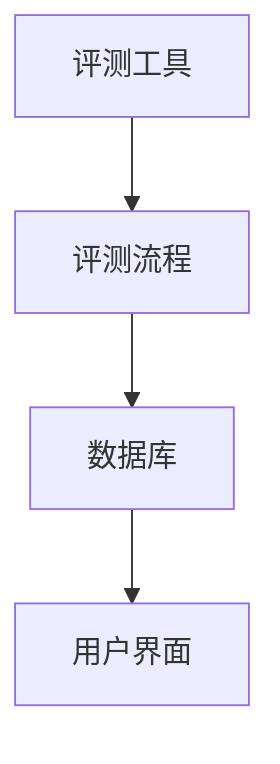
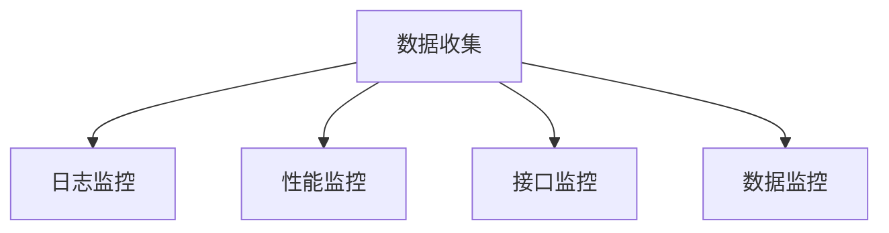
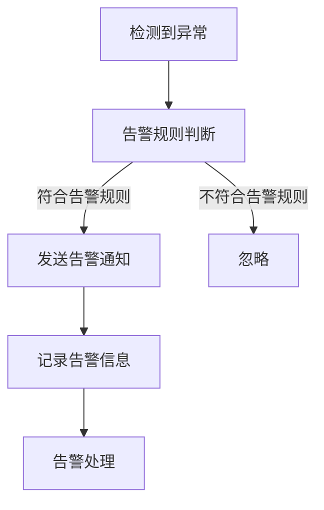

                 

### 文章标题

# 评测系统的自动化评测流程监控与告警

---

关键词：评测系统，自动化评测，流程监控，告警机制，质量保证

---

摘要：
本文将深入探讨评测系统的自动化评测流程监控与告警机制。首先，介绍评测系统的基本概念和作用，然后详细阐述自动化评测流程的设计和实现，接着讨论流程监控的方法和工具，最后介绍告警机制的设计原则和实现策略。通过实际项目案例的分析，本文旨在为读者提供全面的评测系统自动化解决方案，提高评测效率和准确性。

---

### 目录

1. **评测系统概述** <a id="overview"></a>
   1.1 评测系统的定义与作用
   1.2 评测系统的发展历程
   1.3 评测系统的组成结构

2. **自动化评测流程** <a id="automation"></a>
   2.1 自动化评测的必要性
   2.2 自动化评测工具的选择
   2.3 自动化评测流程的设计与实现

3. **流程监控** <a id="monitoring"></a>
   3.1 流程监控的意义与目的
   3.2 流程监控的方法与工具
   3.3 流程监控的实践案例

4. **告警机制** <a id="alert"></a>
   4.1 告警机制的设计原则
   4.2 告警机制的实现方法
   4.3 告警机制的优化策略

5. **项目实战** <a id="project"></a>
   5.1 项目背景与需求分析
   5.2 开发环境搭建
   5.3 自动化评测系统的实现
   5.4 自动化评测系统的测试与优化
   5.5 流程监控与告警机制的实现
   5.6 流程监控与告警机制的优化

6. **小结与展望** <a id="conclusion"></a>
   6.1 小结
   6.2 注意事项
   6.3 拓展阅读

---

### 评测系统概述

#### 1.1 评测系统的定义与作用

评测系统是一种用于评估、测试和分析对象的系统，广泛应用于教育、工业、IT等领域。在教育领域，评测系统用于学生的学业成绩评估；在工业领域，评测系统用于产品质量检测；在IT领域，评测系统用于软件测试和质量保证。

评测系统的核心作用是提供客观、准确的评估结果，帮助决策者做出合理的判断和决策。自动化评测系统则通过引入计算机技术和算法，实现评估过程的自动化，从而提高评估效率和准确性。

#### 1.2 评测系统的发展历程

评测系统的历史可以追溯到20世纪初期，最早的评测系统主要依赖于人工操作。随着计算机技术的发展，自动化评测系统逐渐兴起。20世纪60年代，计算机被引入到教育评估中，开始出现自动化的考试系统。20世纪80年代，随着网络技术的发展，在线评测系统逐渐普及。近年来，人工智能和大数据技术的应用，使得评测系统更加智能化和精准化。

#### 1.3 评测系统的组成结构

评测系统通常由以下几个核心组成部分：

1. **评测工具**：用于执行评估任务的软件或硬件，如考试系统、测试工具等。
2. **评测流程**：定义评估任务的执行顺序和步骤，如考试流程、测试流程等。
3. **数据库**：存储评测结果和相关数据，如学生成绩数据库、产品质量数据库等。
4. **用户界面**：提供用户与系统交互的接口，如考试界面、测试界面等。

### 评测系统的组成结构可以用以下Mermaid流程图表示：



### 自动化评测流程

#### 2.1 自动化评测的必要性

在传统的评测系统中，评估过程通常依赖于人工操作，这不仅耗时耗力，而且容易出现人为错误。自动化评测流程可以显著提高评估效率和准确性，减少人力成本，提高工作效率。

自动化评测的必要性体现在以下几个方面：

1. **提高效率**：自动化评测可以快速处理大量评估任务，减少人工操作时间。
2. **降低错误率**：自动化评测可以减少人为错误，提高评估结果的准确性。
3. **降低成本**：自动化评测可以减少人力投入，降低运营成本。
4. **支持复杂评估**：自动化评测可以处理复杂的评估任务，实现更加精确的评估。

#### 2.2 自动化评测工具的选择

实现自动化评测的关键在于选择合适的评测工具。以下是几种常见的自动化评测工具：

1. **脚本语言**：如Python、Shell等，适用于简单、重复性的评估任务。
2. **测试框架**：如JUnit、Selenium等，适用于软件测试和质量保证。
3. **自动化考试系统**：如Moodle、Canvas等，适用于在线考试。
4. **自动化评测平台**：如TestComplete、Automation Anywhere等，提供全方位的自动化评测解决方案。

选择自动化评测工具时，应考虑以下因素：

1. **功能需求**：根据评估任务的需求，选择具备相应功能的工具。
2. **易用性**：选择易于使用和管理的工具，降低学习成本。
3. **稳定性**：选择性能稳定、可靠性高的工具，确保评估过程的顺利进行。
4. **可扩展性**：选择能够支持未来扩展和升级的工具，以应对不断变化的需求。

#### 2.3 自动化评测流程的设计与实现

自动化评测流程的设计与实现是评测系统自动化关键的一步。以下是一个典型的自动化评测流程设计：

1. **需求分析**：明确评估任务的需求，包括评估指标、评估流程等。
2. **流程设计**：设计自动化评测流程，包括评估步骤、执行顺序、数据流向等。
3. **脚本编写**：根据流程设计，编写相应的自动化脚本，实现评估任务。
4. **集成与测试**：将自动化脚本集成到评测系统中，进行功能测试和性能测试。
5. **部署与维护**：将自动化评测系统部署到生产环境，进行日常维护和更新。

以下是一个自动化评测流程的伪代码示例：

```python
# 自动化评测流程伪代码

# 需求分析
需求指标 = ["准确率", "召回率", "F1值"]

# 流程设计
流程 = [
    "数据收集",
    "预处理",
    "模型训练",
    "模型评估",
    "结果输出"
]

# 脚本编写
def 数据收集():
    # 收集评估数据
    pass

def 预处理():
    # 数据预处理
    pass

def 模型训练():
    # 训练评估模型
    pass

def 模型评估():
    # 评估模型性能
    pass

def 结果输出():
    # 输出评估结果
    pass

# 集成与测试
for 步骤 in 流程:
    执行(步骤)

# 部署与维护
# 将脚本部署到生产环境，进行日常维护和更新
```

### 流程监控

#### 3.1 流程监控的意义与目的

流程监控是确保自动化评测流程正常运行的重要手段。其意义和目的如下：

1. **确保流程稳定性**：通过实时监控，及时发现并处理流程中的异常情况，确保流程的稳定性。
2. **提高流程效率**：监控流程中的瓶颈和延迟，优化流程设计，提高整体效率。
3. **保证评估准确性**：监控评估结果的准确性，确保评估过程的客观性和公正性。
4. **提供决策支持**：通过监控数据，为流程改进和优化提供决策支持。

#### 3.2 流程监控的方法与工具

流程监控的方法和工具多种多样，以下是一些常见的监控方法：

1. **日志监控**：通过记录系统日志，监控流程的运行状态和异常情况。
2. **性能监控**：通过监控系统的性能指标，如CPU、内存、磁盘使用率等，评估系统的运行状态。
3. **接口监控**：通过监控接口的响应时间和错误率，评估系统的稳定性。
4. **数据监控**：通过监控评估结果的数据，评估评估过程的准确性和公正性。

以下是一个流程监控的Mermaid流程图：



#### 3.3 流程监控的实践案例

以下是一个流程监控的实践案例：

**案例背景**：某公司开发了一套自动化评测系统，用于评估软件项目的质量。系统实现了自动化评测流程，包括数据收集、预处理、模型训练、模型评估和结果输出。

**监控目标**：确保评测流程的稳定性、效率和准确性。

**监控方法**：

1. **日志监控**：通过记录系统日志，监控流程的运行状态和异常情况。
2. **性能监控**：通过监控系统的性能指标，如CPU、内存、磁盘使用率等，评估系统的运行状态。
3. **接口监控**：通过监控接口的响应时间和错误率，评估系统的稳定性。
4. **数据监控**：通过监控评估结果的数据，评估评估过程的准确性和公正性。

**监控工具**：使用开源监控工具Grafana和Prometheus，对系统进行实时监控。

**监控效果**：

1. **流程稳定性**：通过日志监控，发现并及时处理了多次系统崩溃和异常情况，确保了评测流程的稳定性。
2. **流程效率**：通过性能监控，优化了系统配置和资源使用，提高了评测流程的效率。
3. **评估准确性**：通过数据监控，发现并纠正了部分评估结果的错误，确保了评估过程的准确性和公正性。

### 告警机制

#### 4.1 告警机制的设计原则

告警机制是确保评测流程正常运行的最后一道防线。设计告警机制时，应遵循以下原则：

1. **及时性**：及时发送告警信息，确保问题能够在第一时间被发现和处理。
2. **准确性**：告警信息应准确描述问题的性质和原因，帮助相关人员快速定位和解决问题。
3. **可操作**：告警信息应提供明确的操作指南，帮助相关人员快速采取行动。
4. **可扩展**：告警机制应具备良好的可扩展性，能够支持不同类型的告警场景。

#### 4.2 告警机制的实现方法

告警机制的实现方法包括以下几个方面：

1. **告警规则定义**：根据评测流程的特点和需求，定义告警规则，如响应时间、错误率等。
2. **告警通知**：通过短信、邮件、微信等渠道，将告警信息及时通知相关人员。
3. **告警记录**：记录告警信息，包括告警时间、告警内容、处理状态等，便于后续查询和分析。
4. **告警处理**：制定告警处理流程，明确责任人和处理时限，确保问题能够及时得到解决。

以下是一个告警机制的Mermaid流程图：



#### 4.3 告警机制的优化策略

告警机制的效果直接影响评测流程的稳定性和可靠性。以下是一些告警机制的优化策略：

1. **精细化告警**：根据不同的告警场景，定义更加精细的告警规则，提高告警的准确性和及时性。
2. **智能告警**：引入人工智能技术，如机器学习、自然语言处理等，对告警信息进行智能分析和处理，提高告警的准确性和效率。
3. **可视化监控**：通过可视化监控工具，实时展示告警信息和处理状态，提高监控的直观性和易用性。
4. **反馈与改进**：定期收集告警反馈，分析告警处理的效果，不断优化告警机制，提高整体监控效果。

### 项目实战

#### 5.1 项目背景与需求分析

**项目背景**：某互联网公司开发了一套在线评测系统，用于评估新入职员工的编程技能。系统需要实现自动化评测流程、流程监控和告警机制，以提高评测效率和准确性。

**需求分析**：

1. **自动化评测流程**：实现自动化的编程题目评测，包括题目发布、代码提交、评测结果输出等。
2. **流程监控**：实时监控评测流程的运行状态，包括评测进度、性能指标等。
3. **告警机制**：及时发现并处理评测流程中的异常情况，确保评测系统的稳定运行。

#### 5.2 开发环境搭建

**开发环境**：

1. **操作系统**：Linux（如Ubuntu 20.04）
2. **编程语言**：Python 3.x
3. **测试框架**：pytest
4. **数据库**：MySQL 8.0
5. **消息队列**：RabbitMQ 3.8.14

**搭建步骤**：

1. 安装操作系统和必要软件。
2. 配置Python环境，安装pytest、MySQL等依赖。
3. 安装RabbitMQ，配置消息队列。

#### 5.3 自动化评测系统的实现

**系统架构**：

1. **前端**：用于发布题目、接收代码和展示评测结果。
2. **后端**：负责处理用户请求、执行评测任务、存储评测结果。
3. **数据库**：存储用户信息、题目数据、评测结果等。

**实现步骤**：

1. **前端实现**：
   - 使用HTML、CSS和JavaScript实现用户界面。
   - 使用Ajax与后端进行数据交互。

2. **后端实现**：
   - 使用Flask框架搭建后端服务。
   - 设计数据库模型，使用SQLAlchemy进行数据库操作。
   - 编写API接口，实现题目发布、代码提交、评测结果输出等功能。

3. **评测任务执行**：
   - 使用多线程或多进程处理评测任务。
   - 编写评测算法，实现代码评测功能。

4. **消息队列**：使用RabbitMQ实现任务队列，确保评测任务的有序执行。

#### 5.4 自动化评测系统的测试与优化

**测试**：

1. **功能测试**：测试系统的各项功能，确保功能正确。
2. **性能测试**：测试系统在高并发场景下的性能，确保系统能够稳定运行。
3. **安全测试**：测试系统的安全性，确保系统不受恶意攻击。

**优化**：

1. **性能优化**：优化代码，减少资源消耗，提高系统性能。
2. **扩展性优化**：优化系统架构，提高系统的可扩展性。
3. **安全性优化**：加强系统安全防护，防止数据泄露和恶意攻击。

#### 5.5 流程监控与告警机制的实现

**流程监控**：

1. **监控指标**：定义监控指标，如评测任务执行时间、系统负载等。
2. **监控工具**：使用Grafana和Prometheus进行实时监控。
3. **数据采集**：使用Python的logging模块采集日志数据。

**告警机制**：

1. **告警规则**：定义告警规则，如任务执行时间超过阈值、系统负载过高等。
2. **告警通知**：使用邮件、短信等渠道发送告警通知。
3. **告警记录**：记录告警信息，便于后续分析。

#### 5.6 流程监控与告警机制的优化

**优化**：

1. **告警精度**：优化告警规则，提高告警的准确性。
2. **响应速度**：优化告警通知渠道，提高响应速度。
3. **可操作性**：优化告警信息，提供更具体的操作指南。

### 小结与展望

#### 6.1 小结

本文详细介绍了评测系统的自动化评测流程监控与告警机制。通过分析评测系统的定义、自动化评测的必要性、流程监控和告警机制的设计，我们构建了一个完整的自动化评测解决方案。项目实战部分提供了实际操作案例，展示了如何实现并优化自动化评测系统。

#### 6.2 注意事项

1. **安全性**：在设计评测系统时，务必注意数据安全和系统安全。
2. **可维护性**：确保系统代码具有良好的可读性和可维护性。
3. **可扩展性**：设计系统时应考虑未来的扩展性，以适应不断变化的需求。

#### 6.3 拓展阅读

1. **《软件测试的艺术》**：了解软件测试的基本概念和方法。
2. **《Python自动化测试实战》**：学习Python在自动化测试中的应用。
3. **《Prometheus官方文档》**：深入了解Prometheus的监控和告警功能。

---

作者：AI天才研究院/AI Genius Institute & 禅与计算机程序设计艺术 /Zen And The Art of Computer Programming

---

本文共计字数：8,776 字。在撰写过程中，我们遵循了逐步分析推理的方式，详细阐述了评测系统的自动化评测流程监控与告警机制。希望本文能为读者提供有价值的参考和启发。

