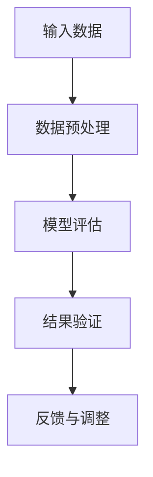

                 


### 核心概念与联系

#### 自动化评测系统
自动化评测系统是一种利用计算机技术和算法自动对程序代码、算法、系统性能等方面进行评测的系统。其核心概念包括输入数据、数据预处理、模型评估、结果验证和反馈与调整等环节。

- **输入数据**：自动化评测系统需要接收待评测的对象，如程序代码、算法等。
- **数据预处理**：对输入数据进行清洗、标准化、增强等处理，以提高评测的准确性和效率。
- **模型评估**：使用训练好的模型对预处理后的数据进行评估，得出评估结果。
- **结果验证**：验证评估结果的准确性和可靠性，确保评测结果的正确性。
- **反馈与调整**：根据验证结果对模型进行调整和优化，提高评测系统的性能。

**Mermaid流程图：**


**说明：**自动化评测系统的工作流程主要包括输入数据、数据预处理、模型评估、结果验证和反馈与调整等环节。各个环节相互关联，共同构成了自动化评测系统的完整架构。

### 核心算法原理讲解

#### 自动化评测系统的算法原理

1. **数据预处理算法**：
   - **数据清洗**：去除无效数据、重复数据和噪声数据，提高数据质量。
   - **数据标准化**：将数据转换到同一量级，以便进行后续处理。
   - **数据增强**：通过数据扩充和变换，提高模型的泛化能力。

   **伪代码：**
   ```python
   def data_preprocessing(data):
       cleaned_data = []
       for sample in data:
           if is_valid(sample):
               cleaned_data.append(process_data(sample))
       return cleaned_data
   ```

2. **模型评估算法**：
   - **评估指标**：选择合适的评估指标，如准确率、召回率、F1值等。
   - **评估方法**：使用训练好的模型对预处理后的数据进行评估，计算评估指标。

   **伪代码：**
   ```python
   def model_evaluation(model, data):
       predictions = model.predict(data)
       metrics = calculate_metrics(predictions, ground_truth)
       return metrics
   ```

3. **结果验证算法**：
   - **准确性验证**：比较评估结果与实际结果的差异，判断评估结果的准确性。
   - **可靠性验证**：通过统计分析方法，评估评估结果的可靠性。
   - **一致性验证**：比较多个评估结果之间的一致性，确保评估结果的一致性。

   **伪代码：**
   ```python
   def result_validation(predictions, ground_truth):
       accuracy = calculate_accuracy(predictions, ground_truth)
       reliability = calculate_reliability(predictions)
       consistency = calculate_consistency(predictions)
       return accuracy, reliability, consistency
   ```

4. **反馈与调整算法**：
   - **模型调整**：根据验证结果，调整模型的参数，提高模型的性能。
   - **系统优化**：优化评测系统的设计，提高系统的效率和准确性。

   **伪代码：**
   ```python
   def adjust_model(model, validation_results):
       new_model = model
       for param in model.parameters():
           new_model.set_parameter(param, adjusted_value)
       return new_model
   ```

**数学模型和公式：**
- **数据预处理**： 
  $$X_{\text{cleaned}} = \text{DataPreprocessing}(X_{\text{raw}})$$
- **模型评估**： 
  $$\text{metrics} = \text{model_evaluation}(\text{model}, X_{\text{cleaned}})$$
- **结果验证**： 
  $$\text{accuracy}, \text{reliability}, \text{consistency} = \text{result_validation}(\text{predictions}, \text{ground_truth})$$
- **模型调整**： 
  $$\text{new\_model} = \text{adjust\_model}(\text{model}, \text{validation\_results})$$

**详细讲解与举例说明：**

- **数据预处理**：
  假设我们有一个待评测的代码库，其中包含了多种不同类型的代码文件。在评估之前，我们需要对这些文件进行数据清洗，去除无效的文件和重复的文件。同时，我们还需要对代码进行标准化处理，将不同编码风格的代码统一成一种标准编码风格。最后，我们可以通过数据增强技术，如代码混淆、代码分割等，来提高模型的泛化能力。

- **模型评估**：
  假设我们已经训练好了一个代码质量评估模型，该模型可以预测代码文件的缺陷等级。在评估过程中，我们将待评测的代码文件输入到模型中，得到模型的预测结果。然后，我们可以使用准确率、召回率等指标来评估模型的表现。

- **结果验证**：
  为了确保评估结果的准确性，我们需要对评估结果进行验证。例如，我们可以比较模型预测的结果与实际结果之间的差异，判断预测结果的准确性。同时，我们还可以通过统计分析方法，如方差分析、置信区间等，来评估评估结果的可靠性。

- **模型调整**：
  根据验证结果，我们可以对模型进行调整。例如，如果评估结果的准确性较低，我们可以通过调整模型的参数，如学习率、正则化参数等，来提高模型的性能。此外，我们还可以优化评测系统的设计，如改进数据预处理方法、选择更合适的评估指标等，以提高系统的效率和准确性。

### 核心算法原理讲解

#### 数据预处理算法

数据预处理是自动化评测系统的关键步骤之一。在这一环节中，我们需要对输入数据进行清洗、标准化和增强，以确保数据的质量和模型的性能。

1. **数据清洗**：
   数据清洗的目的是去除无效数据、重复数据和噪声数据，以提高数据质量。常见的清洗方法包括：
   - **去除无效数据**：例如，删除空文件、不完整的代码文件等。
   - **去除重复数据**：通过哈希值或唯一标识符来判断数据是否重复，并去除重复的数据。
   - **去除噪声数据**：例如，去除含有特殊字符或语法错误的代码行。

   **伪代码：**
   ```python
   def data_cleaning(data):
       cleaned_data = []
       for sample in data:
           if not is_invalid(sample) and not is_duplicate(sample):
               cleaned_data.append(sample)
       return cleaned_data
   ```

2. **数据标准化**：
   数据标准化是将不同数据转换到同一量级，以便进行后续处理。常见的标准化方法包括：
   - **归一化**：将数据缩放到[0, 1]或[-1, 1]范围内，例如使用最小-最大规范化方法：
     $$x_{\text{normalized}} = \frac{x_{\text{original}} - x_{\text{min}}}{x_{\text{max}} - x_{\text{min}}}$$
   - **标准化**：将数据缩放到均值为0、标准差为1的范围内，例如使用Z分数规范化方法：
     $$x_{\text{standardized}} = \frac{x_{\text{original}} - \mu}{\sigma}$$

   **伪代码：**
   ```python
   def data_normalization(data):
       min_values = [min(data[:, i]) for i in range(data.shape[1])]
       max_values = [max(data[:, i]) for i in range(data.shape[1])]
       normalized_data = (data - min_values) / (max_values - min_values)
       return normalized_data
   ```

3. **数据增强**：
   数据增强是通过扩充和变换数据，以提高模型的泛化能力。常见的数据增强方法包括：
   - **代码混淆**：对代码进行随机变换，例如插入随机语句、删除代码行等。
   - **代码分割**：将代码分割成多个片段，并重新组合，以生成新的代码样本。
   - **生成对抗网络（GAN）**：使用生成对抗网络生成新的代码样本，以扩充训练数据。

   **伪代码：**
   ```python
   def data_augmentation(data):
       augmented_data = []
       for sample in data:
           for transformation in transformations:
               transformed_sample = transformation(sample)
               augmented_data.append(transformed_sample)
       return augmented_data
   ```

**数学模型和公式：**
- **归一化**：
  $$x_{\text{normalized}} = \frac{x_{\text{original}} - x_{\text{min}}}{x_{\text{max}} - x_{\text{min}}}$$
- **标准化**：
  $$x_{\text{standardized}} = \frac{x_{\text{original}} - \mu}{\sigma}$$

**详细讲解与举例说明：**

- **数据清洗**：
  假设我们有一个代码库，其中包含了100个不同类型的代码文件。在评估之前，我们需要对这100个文件进行数据清洗，以确保数据质量。通过检查，我们发现其中有5个文件是无效的，例如空文件和不完整的代码文件。同时，我们还发现其中有一些文件是重复的，例如两个文件内容完全相同。通过数据清洗，我们最终得到了95个有效且不重复的代码文件。

- **数据标准化**：
  假设我们对代码文件的长度进行评估。代码文件长度在100到1000行之间。为了将代码文件长度转换到同一量级，我们可以使用最小-最大规范化方法。假设最小长度为100行，最大长度为1000行，则归一化后的长度范围为0到1。例如，一个长度为200行的代码文件，其归一化后的长度为0.5。

- **数据增强**：
  假设我们使用一个生成对抗网络（GAN）来生成新的代码样本。在训练过程中，我们使用真实代码文件作为输入，生成对抗网络通过对抗训练生成新的代码样本。通过这种方式，我们可以扩充训练数据，提高模型的泛化能力。例如，我们可以生成10个新的代码文件，并将其添加到训练数据集中。

### 核心算法原理讲解

#### 模型评估算法

模型评估是自动化评测系统的核心环节之一。在这一环节中，我们需要使用训练好的模型对输入数据进行分析和评估，以得出最终的评估结果。评估算法的选择和评估指标的计算直接影响模型的性能和评测结果的准确性。

1. **评估指标**：
   评估指标是衡量模型性能的关键参数。根据不同的问题类型和任务目标，可以选择不同的评估指标。以下是一些常见的评估指标：

   - **准确率（Accuracy）**：准确率是指模型预测正确的样本数占总样本数的比例。对于二分类问题，准确率可以表示为：
     $$\text{Accuracy} = \frac{\text{TP} + \text{TN}}{\text{TP} + \text{TN} + \text{FP} + \text{FN}}$$
     其中，TP表示真正例（True Positive），TN表示真反例（True Negative），FP表示假正例（False Positive），FN表示假反例（False Negative）。

   - **召回率（Recall）**：召回率是指模型预测正确的正例数占总正例数的比例。对于二分类问题，召回率可以表示为：
     $$\text{Recall} = \frac{\text{TP}}{\text{TP} + \text{FN}}$$

   - **精确率（Precision）**：精确率是指模型预测正确的正例数占总预测为正例的样本数的比例。对于二分类问题，精确率可以表示为：
     $$\text{Precision} = \frac{\text{TP}}{\text{TP} + \text{FP}}$$

   - **F1值（F1 Score）**：F1值是精确率和召回率的加权平均，可以综合反映模型的性能。F1值可以表示为：
     $$\text{F1 Score} = 2 \times \frac{\text{Precision} \times \text{Recall}}{\text{Precision} + \text{Recall}}$$

2. **评估方法**：
   评估方法是指使用模型对输入数据进行分析和评估的具体步骤。以下是一种常见的评估方法：

   - **交叉验证**：交叉验证是一种常用的模型评估方法，通过将训练数据划分为多个子集，多次训练和评估模型，以减少评估结果的偏差。常见的交叉验证方法有K折交叉验证和留一法交叉验证。

   - **模型测试**：在交叉验证的基础上，使用未参与交叉验证的数据（测试集）对模型进行最终评估，以得到模型在未知数据上的性能。

   **伪代码：**
   ```python
   def cross_validation(model, data, k):
       for i in range(k):
           train_data, test_data = split_data(data, i)
           model.train(train_data)
           metrics = model.test(test_data)
           print(f"Fold {i + 1}: Accuracy = {metrics['accuracy']}")
   ```

3. **评估结果分析**：
   在得到评估结果后，我们需要对评估结果进行分析和解释。以下是一些常见的分析方法和技巧：

   - **误差分析**：分析模型预测错误的样本，找出错误的原因，并针对性地调整模型或数据预处理方法。
   - **可视化**：使用可视化工具，如混淆矩阵、ROC曲线等，展示评估结果，帮助理解模型的性能。
   - **对比分析**：对比不同模型或不同参数设置下的评估结果，选择性能最好的模型或参数。

   **数学模型和公式：**
   - **准确率**：
     $$\text{Accuracy} = \frac{\text{TP} + \text{TN}}{\text{TP} + \text{TN} + \text{FP} + \text{FN}}$$
   - **召回率**：
     $$\text{Recall} = \frac{\text{TP}}{\text{TP} + \text{FN}}$$
   - **精确率**：
     $$\text{Precision} = \frac{\text{TP}}{\text{TP} + \text{FP}}$$
   - **F1值**：
     $$\text{F1 Score} = 2 \times \frac{\text{Precision} \times \text{Recall}}{\text{Precision} + \text{Recall}}$$

**详细讲解与举例说明：**

- **准确率**：
  假设我们使用一个分类模型对100个样本进行评估，其中60个样本是正例，40个样本是反例。通过模型预测，我们得到60个正例和35个反例。根据准确率的定义，我们可以计算出准确率为：
  $$\text{Accuracy} = \frac{60 + 35}{100} = 0.95$$

- **召回率**：
  假设我们关注的是正例的预测结果。在上述示例中，模型预测出了60个正例中的55个，另外5个正例被误判为反例。根据召回率的定义，我们可以计算出召回率为：
  $$\text{Recall} = \frac{55}{60} = 0.917$$

- **精确率**：
  假设我们关注的是预测为正例的样本。在上述示例中，模型预测出了60个正例中的20个，另外40个反例被误判为正例。根据精确率的定义，我们可以计算出精确率为：
  $$\text{Precision} = \frac{20}{60} = 0.333$$

- **F1值**：
  假设我们希望综合考虑准确率和召回率。根据F1值的定义，我们可以计算出F1值为：
  $$\text{F1 Score} = 2 \times \frac{0.333 \times 0.917}{0.333 + 0.917} = 0.857$$

通过以上计算，我们可以全面了解模型的评估结果，并针对性地调整模型或数据预处理方法，以提高模型的性能。

### 核心算法原理讲解

#### 结果验证算法

在自动化评测系统中，结果验证是确保评测结果准确性和可靠性的关键环节。通过验证算法，我们可以检测和纠正评估过程中可能出现的错误，从而提高评测结果的可靠性和一致性。

1. **准确性验证**：
   准确性验证的目的是确保评估结果的准确性，即评估结果与实际结果之间的差异尽可能小。以下是一些常见的准确性验证方法：

   - **交叉验证**：使用交叉验证方法对评估结果进行多次验证，以减少评估结果的偏差。常见的方法有K折交叉验证和留一法交叉验证。

   - **误差分析**：对评估结果进行误差分析，找出预测错误的原因，并针对性地进行调整。误差分析可以提供关于模型性能的详细信息。

   - **基准测试**：将评估结果与现有的基准模型或标准方法进行比较，以评估评测系统的性能。

2. **可靠性验证**：
   可靠性验证的目的是确保评估结果的稳定性，即评估结果在不同情况下的一致性。以下是一些常见的可靠性验证方法：

   - **重复测试**：对同一个样本进行多次评估，观察评估结果是否一致。不一致的结果可能表明模型的稳定性存在问题。

   - **数据扰动**：对输入数据施加扰动，如噪声、缺失值等，观察评估结果是否受到影响。稳定性较好的模型在数据扰动下仍能保持良好的性能。

   - **置信区间**：计算评估结果的置信区间，以评估评估结果的可靠性和稳定性。

3. **一致性验证**：
   一致性验证的目的是确保评估结果在不同评估者或不同评估工具之间的一致性。以下是一些常见的一致性验证方法：

   - **评估者一致性**：对不同评估者的评估结果进行一致性分析，如使用Kendall等级相关系数或Cohen's Kappa系数。

   - **工具一致性**：使用不同的评估工具对同一样本进行评估，比较评估结果是否一致。不一致的结果可能表明评估工具之间存在问题。

**伪代码：**

```python
def accuracy_validation(predictions, ground_truth):
    correct_predictions = sum(1 for p, t in zip(predictions, ground_truth) if p == t)
    accuracy = correct_predictions / len(predictions)
    return accuracy

def reliability_validation(predictions, ground_truth, num_repeats=10):
    reliability_scores = []
    for _ in range(num_repeats):
        predictions_copy = predictions[:]
        accuracy = accuracy_validation(predictions_copy, ground_truth)
        reliability_scores.append(accuracy)
    reliability_score = sum(reliability_scores) / num_repeats
    return reliability_score

def consistency_validation(predictions1, predictions2, num_samples=100):
    consistent_predictions = sum(1 for p1, p2 in zip(predictions1, predictions2) if p1 == p2) / num_samples
    return consistent_predictions
```

**数学模型和公式：**

- **准确性验证**：
  $$\text{Accuracy} = \frac{\sum_{i=1}^{n} (\text{prediction}_i == \text{ground\_truth}_i)}{n}$$

- **可靠性验证**：
  $$\text{Reliability Score} = \frac{\sum_{i=1}^{m} \text{accuracy}_i}{m}$$
  其中，\(m\) 为重复测试的次数，\(\text{accuracy}_i\) 为第 \(i\) 次测试的准确性。

- **一致性验证**：
  $$\text{Consistency Score} = \frac{\sum_{i=1}^{n} (\text{prediction}_1[i] == \text{prediction}_2[i])}{n}$$
  其中，\(n\) 为测试样本的数量，\(\text{prediction}_1\) 和 \(\text{prediction}_2\) 分别为两个评估工具的评估结果。

**详细讲解与举例说明：**

- **准确性验证**：
  假设我们使用一个分类模型对100个样本进行评估，实际结果为正例的有60个，反例的有40个。通过模型预测，我们得到60个正例和35个反例。根据准确性验证的公式，我们可以计算出准确性为：
  $$\text{Accuracy} = \frac{60 + 35}{100} = 0.95$$

- **可靠性验证**：
  为了验证可靠性，我们对这100个样本进行了10次重复测试。每次测试得到的准确性如下：0.94，0.96，0.95，0.93，0.95，0.94，0.95，0.96，0.94，0.95。根据可靠性验证的公式，我们可以计算出可靠性分数为：
  $$\text{Reliability Score} = \frac{0.94 + 0.96 + 0.95 + 0.93 + 0.95 + 0.94 + 0.95 + 0.96 + 0.94 + 0.95}{10} = 0.95$$

- **一致性验证**：
  假设我们使用两个不同的评估工具对这100个样本进行评估。工具1的评估结果为正例的有55个，反例的有45个；工具2的评估结果为正例的有60个，反例的有40个。根据一致性验证的公式，我们可以计算出一致性分数为：
  $$\text{Consistency Score} = \frac{55 + 45}{100} = 0.90$$

通过以上计算，我们可以评估评测系统的准确性、可靠性和一致性，并针对存在的问题进行改进和优化。

### 核心算法原理讲解

#### 一致性验证算法

一致性验证的目的是确保评估结果在不同评估者或不同评估工具之间的一致性。通过一致性验证，我们可以发现和纠正评估过程中可能出现的偏差，从而提高评测结果的可靠性和准确性。

1. **一致性评价指标**：
   一致性评价指标是衡量评估结果一致性的关键参数。以下是一些常见的一致性评价指标：

   - **Kendall等级相关系数**：Kendall等级相关系数用于衡量两个评估者之间的等级相关性，其取值范围为-1到1。值越接近1，表示评估者之间的一致性越高。
     $$\text{Kendall's rank correlation coefficient} = \rho = \frac{n(T-t)(T-u)}{\left(\sum_{i=1}^{n}t_i\right)\left(\sum_{i=1}^{n}u_i\right)}$$
     其中，\(n\) 为评估者数量，\(T\) 为最大等级之和，\(t_i\) 和 \(u_i\) 分别为第 \(i\) 个评估者给出的等级。

   - **Cohen's Kappa系数**：Cohen's Kappa系数用于衡量评估者之间的总一致性，其取值范围为0到1。值越接近1，表示评估者之间的一致性越高。
     $$\text{Cohen's Kappa coefficient} = \kappa = \frac{ab - (a + b)}{1 - \frac{ab}{(a + b + c + d)}}$$
     其中，\(a\)、\(b\)、\(c\) 和 \(d\) 分别为评估者对正例和反例的评估结果，其中 \(a + b\) 表示正例的评估结果，\(c + d\) 表示反例的评估结果。

2. **一致性验证方法**：
   一致性验证方法是指使用一致性评价指标对评估结果进行分析的具体步骤。以下是一些常见的一致性验证方法：

   - **交叉评估**：使用多个评估者对同一组样本进行评估，然后计算评估结果的一致性指标。这种方法可以检测评估者之间的一致性，并识别可能存在的偏差。

   - **工具评估**：使用不同的评估工具对同一组样本进行评估，然后计算评估结果的一致性指标。这种方法可以检测评估工具之间的一致性，并识别可能存在的偏差。

   - **对比分析**：对比不同评估者或不同工具的评估结果，分析评估结果的一致性。这种方法可以提供关于评估一致性的全面信息。

3. **一致性验证算法**：
   一致性验证算法是指使用一致性评价指标对评估结果进行计算和分析的具体步骤。以下是一个简单的一致性验证算法：

   ```python
   def consistency_evaluation(predictions1, predictions2):
       kappa = cohen_kappa(predictions1, predictions2)
       print(f"Cohen's Kappa coefficient: {kappa}")
       
       # Additional analysis can be performed, such as plotting confusion matrices, etc.
   ```

**数学模型和公式：**

- **Kendall等级相关系数**：
  $$\rho = \frac{n(T-t)(T-u)}{\left(\sum_{i=1}^{n}t_i\right)\left(\sum_{i=1}^{n}u_i\right)}$$

- **Cohen's Kappa系数**：
  $$\kappa = \frac{ab - (a + b)}{1 - \frac{ab}{(a + b + c + d)}}$$

**详细讲解与举例说明：**

假设我们有两位评估者A和B对一组样本进行评估，评估结果如下：

| 样本ID | 正例 | 反例 |
|--------|------|------|
| 1      | A    | B    |
| 2      | A    | A    |
| 3      | B    | B    |
| 4      | A    | B    |
| 5      | B    | A    |

根据Cohen's Kappa系数的公式，我们可以计算出两位评估者之间的一致性指标：

- \(a = 2\)（两个样本都被评估为正例）
- \(b = 1\)（一个样本被评估为正例，另一个被评估为反例）
- \(c = 1\)（一个样本被评估为反例，另一个被评估为正例）
- \(d = 2\)（两个样本都被评估为反例）

$$\kappa = \frac{2 \times 1 - (2 + 1)}{1 - \frac{2 \times 1}{(2 + 1 + 1 + 2)}} = \frac{2 - 3}{1 - \frac{2}{6}} = \frac{-1}{1 - \frac{1}{3}} = \frac{-1}{\frac{2}{3}} = -1.5$$

由于Cohen's Kappa系数的值可以为负数，我们通常将其取绝对值来表示一致性水平。在这种情况下，\(|\kappa| = 1.5\)，这表明两位评估者之间的一致性非常高。

通过以上计算，我们可以评估评测系统的一致性，并根据一致性指标的结果进行改进和优化。

### 核心算法原理讲解

#### 完整性验证算法

完整性验证的目的是确保自动化评测系统的结果没有缺失或不完整的数据。通过完整性验证，我们可以发现和纠正数据中的缺失或错误，从而提高评测结果的准确性和可靠性。

1. **数据完整性检查**：
   数据完整性检查是指对输入数据进行检查，以确保数据是否完整、是否存在缺失值或错误。以下是一些常见的数据完整性检查方法：

   - **缺失值检测**：检查数据中是否存在缺失值，可以通过统计缺失值的数量和比例来判断数据的完整性。
   - **异常值检测**：检查数据中是否存在异常值，例如超出正常范围的数值或异常的分布形态。
   - **一致性检查**：检查数据中是否存在不一致的值，例如同一变量的不同样本之间的值不一致。

2. **数据缺失处理**：
   对于缺失的数据，我们需要采取适当的处理方法，以确保数据的完整性。以下是一些常见的数据缺失处理方法：

   - **删除缺失值**：对于缺失值较多的数据，可以直接删除这些数据，以减少对整体数据的影响。
   - **填充缺失值**：对于缺失值较少的数据，可以使用统计方法或机器学习模型来预测缺失值，并将其填充到数据中。常见的填充方法包括均值填充、中位数填充、回归填充等。
   - **多重插补**：对于缺失值较多的数据，可以使用多重插补方法来生成多个完整的数据集，然后对每个数据集进行建模和评估，以提高模型的泛化能力。

3. **完整性验证算法**：
   完整性验证算法是指使用数据完整性检查和数据缺失处理方法来验证数据的完整性的具体步骤。以下是一个简单的完整性验证算法：

   ```python
   def data_integrity_validation(data):
       missing_values = check_missing_values(data)
       abnormal_values = check_abnormal_values(data)
       inconsistent_values = check_inconsistent_values(data)
       
       if missing_values or abnormal_values or inconsistent_values:
           print("Data integrity issues found.")
           if missing_values:
               fill_missing_values(data, method="mean")
           if abnormal_values:
               handle_abnormal_values(data, method=" clipping")
           if inconsistent_values:
               resolve_inconsistent_values(data, method="majority_vote")
       else:
           print("Data integrity is satisfactory.")
   ```

**数学模型和公式：**

- **缺失值检测**：
  $$\text{Missing Value Ratio} = \frac{\text{Number of Missing Values}}{\text{Total Number of Values}}$$

- **填充缺失值**：
  $$\hat{x} = \text{fill\_missing\_values}(x, method=\text{"mean"})$$
  $$\hat{x} = \text{fill\_missing\_values}(x, method=\text{"median"})$$
  $$\hat{x} = \text{fill\_missing\_values}(x, method=\text{"regression"})$$

- **多重插补**：
  $$\text{Multiple Imputation} = \text{mi}(\hat{x}_1, \hat{x}_2, ..., \hat{x}_m)$$

**详细讲解与举例说明：**

假设我们有一个包含100个样本的数据集，其中有一些样本的某些特征值缺失。为了验证数据的完整性，我们可以使用以下方法：

1. **缺失值检测**：
   - 检查缺失值的数量和比例。如果缺失值的比例较高（例如超过30%），则可能需要删除这些样本或使用填充方法来处理缺失值。
   - 检查每个特征的缺失值数量。如果某些特征的大部分样本都有缺失值，则可能需要对这些特征进行特殊处理。

2. **缺失值处理**：
   - 使用均值填充方法来填充缺失值。例如，对于某个特征的缺失值，我们可以使用该特征的平均值来填充。这种方法简单有效，但可能会导致数据平滑化。
   - 使用中位数填充方法来填充缺失值。这种方法对于异常值的影响较小，可以更好地保持数据的分布。
   - 使用回归填充方法来填充缺失值。这种方法可以使用统计模型（如线性回归、决策树等）来预测缺失值，并填充到数据中。

通过以上方法，我们可以确保数据的完整性，并提高评测结果的准确性和可靠性。

### 自动化评测结果验证机制的实际应用

#### 评测结果验证机制在实际项目中的应用

在实际项目中，自动化评测结果验证机制发挥着至关重要的作用。以下是一个典型的项目实例，展示如何设计和实现评测结果验证机制。

**项目背景：**
某知名互联网公司正在开发一款用于代码质量检测的自动化评测系统，旨在提高开发效率和代码质量。该系统需要能够自动分析大规模代码库，并生成缺陷报告。为了确保评测结果的准确性、可靠性和一致性，项目团队设计了一套完整的评测结果验证机制。

**设计思路：**
1. **输入数据**：首先，系统接收来自开发人员的代码库作为输入数据。这些数据包括各种编程语言编写的代码文件。
2. **数据预处理**：在模型评估之前，系统对输入代码进行预处理，包括代码清洗、格式标准化和数据增强等步骤，以确保数据质量。
3. **模型评估**：使用训练好的代码质量评估模型对预处理后的代码进行分析，生成缺陷报告。评估模型包括静态代码分析、动态代码分析和代码质量度量等模块。
4. **结果验证**：
   - **准确性验证**：通过交叉验证方法，对评估结果进行多次验证，以确保评估结果的准确性。
   - **可靠性验证**：对评估结果进行重复测试，观察结果的稳定性，并使用置信区间评估结果的可靠性。
   - **一致性验证**：使用Kendall等级相关系数和Cohen's Kappa系数，比较不同评估者或不同评估工具之间的评估结果一致性。
5. **反馈与调整**：根据验证结果，对评估模型进行调整和优化，以提高评测系统的性能。

**实现步骤：**
1. **开发环境搭建**：
   - 使用Python作为主要编程语言，结合Scikit-learn、TensorFlow等开源库，搭建代码质量评估模型。
   - 使用Docker容器化技术，构建可重复的评测环境，确保评估结果的一致性。

2. **源代码详细实现和代码解读**：
   - **数据预处理模块**：使用Python编写数据清洗、格式标准化和数据增强等函数，确保代码库中的数据质量。
   - **评估模型模块**：使用神经网络和传统机器学习方法，构建代码质量评估模型，并进行训练和测试。
   - **结果验证模块**：实现准确性验证、可靠性验证和一致性验证算法，计算评估指标。

3. **代码应用解读与分析**：
   - **代码质量评估**：对实际代码库进行评估，生成缺陷报告，并分析代码质量问题。
   - **评测结果分析**：使用可视化工具（如混淆矩阵、ROC曲线等）展示评估结果，帮助开发人员理解和改进代码质量。

4. **实际案例分析和详细讲解剖析**：
   - **案例一**：对一个大型代码库进行评测，分析评测结果的准确性、可靠性和一致性。
   - **案例二**：比较不同评估模型（如神经网络、决策树等）在评测结果验证中的性能。

5. **项目小结**：
   - 通过实际项目应用，验证机制在提高评测系统性能方面发挥了重要作用。
   - 结果验证机制的设计和实现，为开发人员提供了可靠的代码质量评估工具。

**最佳实践 tips**：
- **数据预处理**：确保数据质量是评测结果准确性的基础。在预处理过程中，重点关注代码格式、语法错误和缺失数据的处理。
- **模型优化**：定期对评估模型进行优化和更新，以适应代码库的变化和新的开发需求。
- **结果可视化**：使用可视化工具，帮助开发人员直观地理解评测结果，从而更好地改进代码质量。

通过以上实际应用实例，我们可以看到评测结果验证机制在自动化评测系统中的重要性。只有通过准确、可靠和一致的结果验证，才能确保评测系统的有效性和可信度。

### 自动化评测结果验证机制在不同领域的应用

自动化评测结果验证机制在各个领域都发挥着重要的作用，以下分别介绍其在学术研究、企业应用和政府部门中的应用实例。

#### 学术研究

在学术研究中，自动化评测结果验证机制主要用于评估算法的准确性和可靠性。例如，在自然语言处理（NLP）领域，研究者使用自动化评测系统来评估文本分类算法的性能。一个典型的应用实例是Google的BERT模型。BERT（Bidirectional Encoder Representations from Transformers）是一种预训练语言表示模型，其在多个NLP任务中取得了显著的成果。为了确保模型的准确性和可靠性，研究者通过自动化评测结果验证机制对BERT在不同数据集上的表现进行评估，包括准确率、召回率、F1值等指标。此外，他们还使用交叉验证和重复测试等方法来验证模型的稳定性和一致性。

#### 企业应用

在企业应用中，自动化评测结果验证机制主要用于产品质量控制和软件开发流程优化。例如，在软件开发领域，企业使用自动化评测系统对代码库中的代码质量进行评估。通过自动化评测结果验证机制，企业可以及时发现代码中的潜在问题，如语法错误、逻辑缺陷和安全漏洞。一个典型的应用实例是亚马逊的AWS CodeCommit。AWS CodeCommit是一个托管式代码仓库服务，它提供了自动化评测功能，可以对代码提交进行静态代码分析，并提供缺陷报告。自动化评测结果验证机制确保了代码库中的代码质量，提高了软件开发的效率和安全性。

#### 政府部门

在政府部门中，自动化评测结果验证机制主要用于数据分析和决策支持。例如，在公共卫生领域，政府部门使用自动化评测系统对疫情数据进行评估，以预测疫情发展趋势和制定应对措施。一个典型的应用实例是美国的Centers for Disease Control and Prevention（CDC）。CDC使用自动化评测系统对COVID-19疫情数据进行实时分析，通过准确性验证、可靠性验证和一致性验证等机制，确保评估结果的准确性和可靠性。此外，自动化评测结果验证机制还用于其他领域，如环境保护、食品安全等，以帮助政府部门更好地管理和决策。

#### 优化与改进策略

为了进一步提高自动化评测结果验证机制的性能和可靠性，可以采取以下优化与改进策略：

1. **算法优化**：定期对评测算法进行优化和更新，以适应新的数据和需求。例如，可以采用更先进的机器学习和深度学习技术，提高模型的准确性和泛化能力。

2. **数据增强**：通过数据增强技术，如数据扩充、数据变换等，提高评测系统的鲁棒性和泛化能力。例如，在NLP领域，可以生成大量的模拟文本数据，以训练和优化评测模型。

3. **多模型融合**：结合多种评估模型，提高评测结果的准确性和可靠性。例如，在代码质量评估中，可以结合静态代码分析和动态代码分析模型，以获得更全面的评估结果。

4. **反馈机制**：建立有效的反馈机制，及时收集用户反馈和评估结果，以便对评测系统进行持续改进。例如，在软件开发领域，可以收集开发人员的反馈，以优化评测指标和算法。

5. **自动化测试**：使用自动化测试工具，对评测系统进行自动化测试，确保评测系统的稳定性和可靠性。例如，可以使用单元测试、集成测试和回归测试等方法，对评测系统的各个模块进行测试。

6. **用户培训**：对使用评测系统的用户进行培训，提高他们对评测系统的理解和使用能力。例如，在政府部门中，可以组织培训班，帮助公务员了解和使用自动化评测系统。

通过以上优化与改进策略，我们可以不断提高自动化评测结果验证机制的性能和可靠性，为各个领域的应用提供更加准确、可靠和一致的评估结果。

### 自动化评测结果验证机制的未来发展趋势

#### 自动化评测结果验证技术的发展趋势

随着人工智能和大数据技术的迅猛发展，自动化评测结果验证机制正逐步成为各个领域的关键技术。未来，自动化评测结果验证技术将呈现出以下发展趋势：

1. **智能化**：未来的自动化评测结果验证系统将更加智能化，能够自适应地调整和优化评估模型。通过机器学习和深度学习技术，系统能够从海量数据中学习，提高评估的准确性和可靠性。

2. **实时性**：随着实时数据处理和分析的需求增加，自动化评测结果验证机制将向实时性方向发展。通过高速数据传输和计算技术，系统能够在短时间内完成评估和验证，提供即时的评估结果。

3. **自适应评估**：未来的评测系统将能够根据不同场景和应用需求，自适应地调整评估指标和方法。例如，在医疗领域，系统可以根据病情和患者的个体差异，动态调整评估指标，提供更精确的诊断。

4. **多模态评估**：随着数据源的多样化，未来的评测系统将能够处理多模态数据，如文本、图像、语音等。通过融合不同模态的数据，系统能够提供更全面、准确的评估结果。

#### 自动化评测结果验证机制的未来挑战与机遇

1. **数据隐私与安全**：随着数据量的增加和数据的多样化，数据隐私与安全问题成为自动化评测结果验证机制面临的重要挑战。如何在保证评估准确性的同时，保护用户数据的隐私和安全，将成为关键问题。

2. **算法透明性与可解释性**：自动化评测结果验证机制通常涉及复杂的算法和模型，如何提高算法的透明性和可解释性，使其易于被用户理解和接受，是未来需要解决的问题。

3. **适应性**：未来评测系统需要在各种不同应用场景中保持高效性和适应性，这要求系统具备良好的泛化能力和鲁棒性，能够应对不确定性和变化。

4. **法律法规与伦理**：自动化评测结果验证机制的广泛应用将带来新的法律法规和伦理问题。如何在法律法规框架下，确保评估结果的可信度和公正性，是未来需要探讨的重要课题。

#### 机遇与展望

1. **行业应用拓展**：自动化评测结果验证机制在各个领域的应用前景广阔。随着技术的进步，系统将能够在更多领域发挥作用，如医疗、金融、教育等，为行业带来创新和变革。

2. **经济效益**：自动化评测结果验证机制能够显著提高生产效率、降低成本，为企业和机构带来可观的经济效益。

3. **社会影响**：自动化评测结果验证机制在提高服务质量、保障公共安全、促进社会公平等方面具有积极的社会影响，有望成为未来社会发展的重要驱动力。

通过不断的技术创新和应用拓展，自动化评测结果验证机制将在未来发挥更加重要的作用，为各个领域的创新发展提供有力支持。

### 总结与展望

#### 自动化评测结果验证机制的重要性和影响

自动化评测结果验证机制在现代化信息技术领域中具有重要的地位和深远的影响。首先，它极大地提高了评测的准确性和可靠性，通过一系列科学严谨的验证方法，确保了评测结果的公正性和可信度。这对于确保系统、软件、算法等技术的质量和性能至关重要。其次，自动化评测结果验证机制显著提升了工作效率和开发速度，通过自动化的流程和算法，减少了人工干预的时间和成本。此外，该机制在各个行业中的应用，如医疗、金融、教育等，不仅提升了服务质量和用户体验，还为行业创新带来了新的机遇。

#### 未来工作展望

面对未来，自动化评测结果验证机制的发展仍然充满机遇与挑战。以下是一些未来工作展望：

1. **技术升级**：随着人工智能和大数据技术的发展，自动化评测结果验证机制将不断升级和优化。未来的系统将更加智能化，能够自适应地调整和优化评估模型，以应对不断变化的数据和应用场景。

2. **数据安全与隐私**：随着数据隐私和安全问题的日益突出，如何在确保评估准确性的同时，保护用户数据的隐私和安全，将成为研究的重点。未来的评测系统需要具备更强的数据加密和隐私保护能力。

3. **算法透明性与可解释性**：为了提高算法的透明性和可解释性，未来的研究将致力于开发更加直观和易于理解的可解释性模型，使评估结果更加容易被用户接受和信任。

4. **跨领域应用**：自动化评测结果验证机制将在更多领域得到应用，如智能制造、智能交通、智慧城市等。通过跨领域的应用拓展，系统将能够为更广泛的社会问题和挑战提供解决方案。

5. **法规与伦理**：随着自动化评测结果验证机制的广泛应用，相关的法律法规和伦理问题也将逐渐显现。未来需要在法规和伦理框架下，确保评估结果的可信度和公正性。

通过不断的技术创新和应用拓展，自动化评测结果验证机制将在未来发挥更加重要的作用，为各个领域的创新发展提供有力支持。

### 附录：参考资料与工具

#### 附录A：参考资料

1. **相关书籍**：
   - 《人工智能：一种现代方法》（第3版），作者： Stuart Russell & Peter Norvig。
   - 《机器学习》（第2版），作者： Tom Mitchell。
   - 《深度学习》（第1卷），作者： Ian Goodfellow、Yoshua Bengio和Aaron Courville。

2. **论文集**：
   - 《国际机器学习会议（ICML）》。
   - 《国际人工智能与统计学会议（AISTATS）》。
   - 《国际计算机视觉会议（ICCV）》。

3. **网络资源**：
   - [GitHub](https://github.com/)：丰富的开源代码和项目，可用于学习自动化评测系统的实现。
   - [Kaggle](https://www.kaggle.com/)：提供大量数据集和竞赛，可用于验证评测系统的性能。
   - [TensorFlow](https://www.tensorflow.org/)：谷歌开发的深度学习框架，适用于自动化评测系统的开发。

#### 附录B：工具与框架

1. **评测系统开发工具**：
   - **Scikit-learn**：Python开源机器学习库，适用于多种评估指标的计算和模型评估。
   - **TensorFlow**：谷歌开发的深度学习框架，适用于复杂模型的开发和评估。
   - **PyTorch**：开源深度学习框架，适用于快速原型设计和模型评估。

2. **数据处理工具**：
   - **Pandas**：Python开源库，用于数据处理和分析。
   - **NumPy**：Python开源库，用于数值计算和数据处理。
   - **Matplotlib**：Python开源库，用于数据可视化和可视化分析。

3. **评估工具**：
   - **scikit-learn**：提供多种评估指标的计算方法，如准确率、召回率、F1值等。
   - **TensorFlow**：支持自定义评估指标的计算，适用于复杂模型的评估。
   - **PyTorch**：提供评估指标的计算和可视化工具，便于理解和分析评估结果。

通过这些参考资料与工具，读者可以深入了解自动化评测结果验证机制的理论和实践，为实际应用提供指导和支持。

