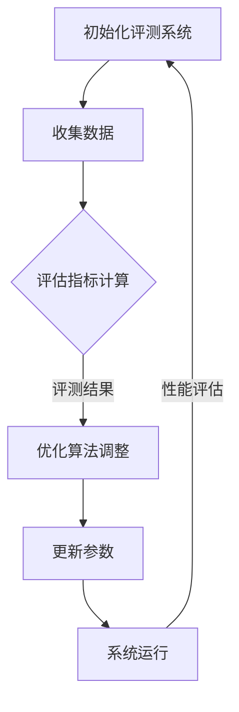

                 

### 核心概念与联系

在探讨评测系统的自我优化与学习能力之前，首先需要明确几个核心概念，并分析它们之间的联系。

#### 评测系统概述

评测系统是一种用于评估软件、算法或系统性能的自动化工具。其主要功能是收集数据、处理数据并生成性能评估报告。在软件开发和系统运维中，评测系统扮演着至关重要的角色，帮助开发人员和运维人员了解系统在不同条件下的表现，从而进行相应的优化和调整。

#### 核心概念

1. **评测指标**：评测指标是评估系统性能的关键参数。常见的评测指标包括响应时间、吞吐量、资源利用率、错误率等。这些指标提供了量化的评估结果，帮助开发者了解系统的性能状况。

2. **优化算法**：优化算法是用于改进系统性能的一系列计算方法。常见的优化算法有遗传算法、粒子群优化、模拟退火等。这些算法通过不断调整系统的参数，使其在特定条件下达到最优性能。

3. **学习能力**：学习能力是指系统在运行过程中，通过不断学习和适应环境变化，自动调整其行为和参数，以提高性能和适应能力。学习能力是评测系统自我优化的基础。

#### 核心概念之间的联系

- **评测指标**是评估系统性能的基础，为优化算法提供了评估依据。
- **优化算法**通过调整系统参数，试图优化评测指标，从而提高系统性能。
- **学习能力**则使评测系统具备自我调整的能力，能够在不同环境中自动优化性能。

#### Mermaid流程图

为了更好地理解评测系统的工作流程，我们可以使用Mermaid语法绘制一个流程图。以下是一个简化的Mermaid流程图示例：

在这个流程图中，评测系统首先初始化，然后收集数据，使用评估指标进行计算，根据评估结果使用优化算法调整参数，更新系统参数，并开始系统运行。系统运行过程中，会不断收集性能数据，重复评估、调整、运行的循环，以达到性能优化。

通过这个Mermaid流程图，我们可以直观地理解评测系统的核心工作流程，以及各个核心概念之间的联系。

### 总结

在本文中，我们介绍了评测系统的核心概念，包括评测指标、优化算法和学习能力，并分析了它们之间的联系。通过Mermaid流程图，我们展示了评测系统的工作流程。在后续章节中，我们将深入探讨这些核心概念的具体实现，以及如何利用它们构建一个具备自我优化和学习能力的评测系统。

---

**核心概念与联系**

- **评测系统**：用于评估软件、算法或系统性能的自动化工具。
- **评测指标**：评估系统性能的关键参数，如响应时间、吞吐量等。
- **优化算法**：用于调整系统参数，优化评测指标的计算方法。
- **学习能力**：系统在运行过程中，通过学习和适应环境变化，自动调整行为和参数的能力。

**Mermaid流程图**

在下一章节中，我们将深入讲解评测系统中的核心算法原理，包括评估指标的计算方法和优化算法的基本原理。这将为我们理解评测系统的自我优化与学习能力奠定坚实的基础。

