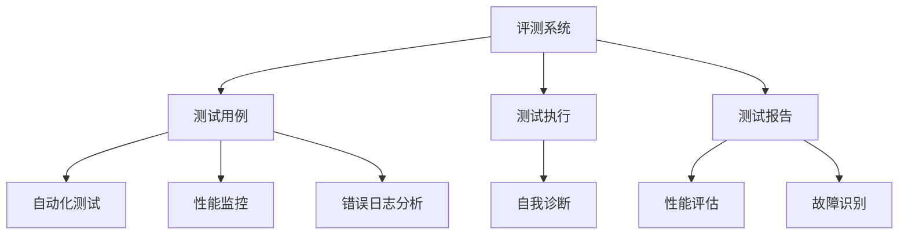
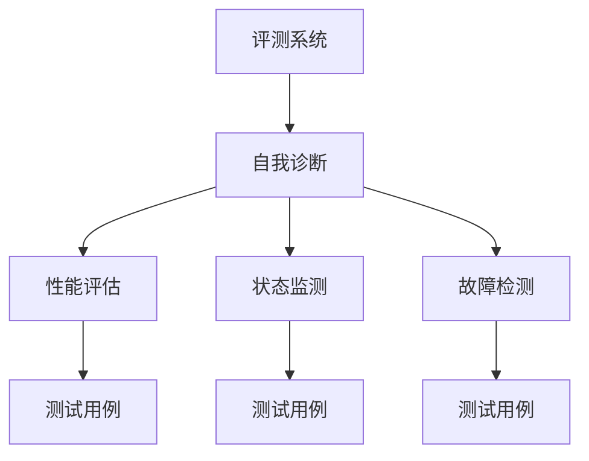
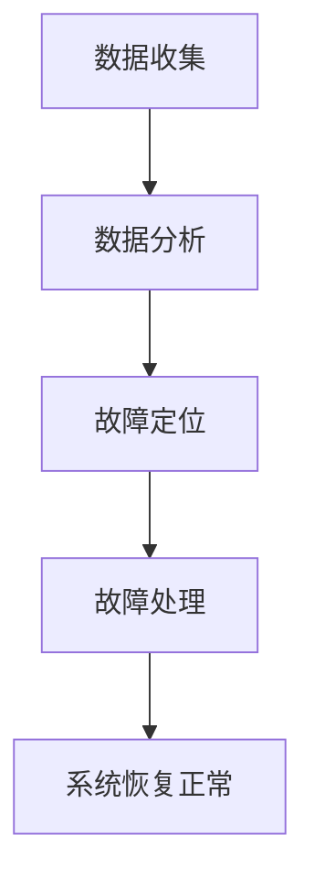
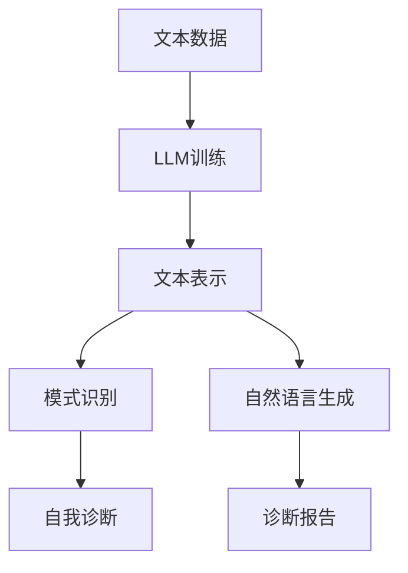
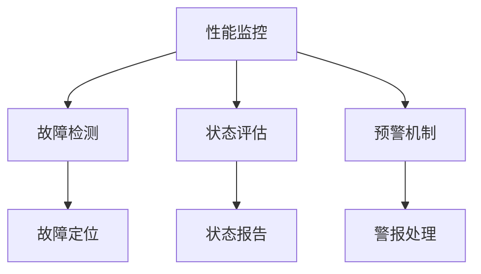
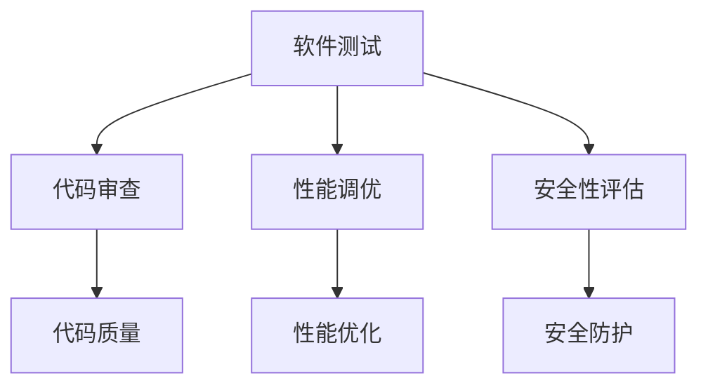

                 

### 文章标题

### 评测系统的自我诊断：LLM驱动的质量保证

> **关键词：** 评测系统、自我诊断、语言模型（LLM）、质量保证、软件测试、代码审查

> **摘要：** 本文探讨了评测系统在自我诊断中的应用，特别是在语言模型（LLM）驱动的质量保证方面。通过深入分析评测系统的基本概念、架构和评估标准，我们探讨了如何利用LLM实现自我诊断，并详细介绍了LLM在质量保证中的核心概念、应用和实践案例。文章旨在为IT从业者提供对评测系统自我诊断和LLM驱动的质量保证的全面理解，以及未来的发展趋势和挑战。

---

### 第一部分：评测系统与自我诊断概述

#### 第1章：评测系统的定义与作用

**背景介绍：**
评测系统，亦称为评估系统，是一种用于评估、测试和监控软件系统性能、可靠性和质量的技术手段。随着信息技术和软件工程的快速发展，评测系统在软件开发生命周期中的地位愈发重要。

**核心概念与联系：**
评测系统的主要功能包括测试软件的功能性、性能、安全性和兼容性等方面。其核心概念包括：

- **测试用例（Test Cases）：** 为验证软件功能、性能、安全等方面设计的具体测试方案。
- **测试执行（Test Execution）：** 按照测试用例进行实际测试的过程。
- **测试报告（Test Reports）：** 记录测试结果、发现的问题和评估软件质量的信息。

评测系统与自我诊断之间存在密切联系。自我诊断是指系统通过内部检查和测试，评估自身的性能、状态和潜在问题。在评测系统中，自我诊断可以通过以下方式实现：

1. **自动化测试：** 利用脚本或工具自动执行测试用例，评估软件的功能性和性能。
2. **性能监控：** 实时监控系统的资源使用情况、响应时间和错误率等指标。
3. **错误日志分析：** 分析系统日志，识别潜在问题和故障。

**Mermaid 流程图：**



**核心算法原理讲解：**
评测系统通常采用以下算法原理：

1. **回归测试（Regression Testing）：** 在软件更新或修改后，重新执行之前通过的测试用例，确保新版本没有引入新的缺陷。
2. **性能测试（Performance Testing）：** 通过模拟实际负载，评估系统的响应时间、吞吐量和资源利用率。
3. **负载测试（Load Testing）：** 在特定负载条件下，评估系统的性能和稳定性。
4. **安全测试（Security Testing）：** 检测系统是否容易受到攻击，以及如何有效防御。

**数学模型和公式：**
评测系统的性能评估可以使用以下公式：

$$
P = \frac{F + R + S}{3}
$$

其中，\(P\) 是性能评分，\(F\) 是功能性评分，\(R\) 是可靠性评分，\(S\) 是安全性评分。

**举例说明：**
假设一个评测系统在功能性测试中通过了95%的测试用例，可靠性测试中成功运行了99.9%的时间，安全性测试中未发现任何漏洞。则该评测系统的性能评分为：

$$
P = \frac{0.95 + 0.999 + 1}{3} = 0.9933
$$

**项目实战：**
开发一个评测系统，包括以下步骤：

1. **需求分析：** 确定评测系统的功能、性能和安全要求。
2. **设计测试用例：** 设计功能测试、性能测试和安全测试用例。
3. **实施测试：** 使用自动化工具执行测试用例。
4. **分析测试结果：** 分析测试结果，识别问题和故障。
5. **优化系统：** 根据测试结果优化系统性能和安全。

**代码实现：**
```python
# 功能性测试用例
def test_functionality():
    # 执行测试用例
    pass

# 性能测试用例
def test_performance():
    # 模拟实际负载
    pass

# 安全测试用例
def test_security():
    # 检测漏洞
    pass

# 执行评测系统
def run_evaluation_system():
    test_functionality()
    test_performance()
    test_security()
    # 分析测试结果
    # 优化系统性能和安全
```

**代码应用解读与分析：**
上述代码实现了一个简单的评测系统，包括功能性测试、性能测试和安全测试。在实际应用中，需要根据具体需求设计更复杂的测试用例和评估指标。

**实际案例分析和详细讲解剖析：**
在实际项目中，评测系统可用于自动化测试、性能监控和安全审计。例如，在一个电商平台上，评测系统可以用于测试订单处理、库存管理和支付功能，确保系统的稳定性和安全性。

**项目小结：**
评测系统是软件开发生命周期中的重要组成部分。通过自我诊断，评测系统可以识别潜在问题，提高软件质量。利用LLM，可以进一步提高评测系统的智能化和自动化水平，实现更高效的质量保证。

#### 第2章：自我诊断的概念与意义

**背景介绍：**
自我诊断是指系统通过内部检查和测试，评估自身的性能、状态和潜在问题。在评测系统中，自我诊断是实现质量保证的重要手段。随着人工智能技术的发展，特别是语言模型（LLM）的应用，自我诊断的功能和效率得到了显著提升。

**核心概念与联系：**
自我诊断的核心概念包括：

- **性能评估（Performance Evaluation）：** 评估系统的响应时间、吞吐量和资源利用率。
- **状态监测（State Monitoring）：** 监控系统的运行状态，包括内存使用、CPU占用率和网络流量等。
- **故障检测（Fault Detection）：** 识别系统中的错误和异常。

自我诊断与评测系统之间的联系体现在以下几个方面：

1. **评估指标：** 自我诊断的评估指标可以与评测系统的评估指标相互补充，提供更全面的系统评估。
2. **测试用例：** 自我诊断的测试用例可以与评测系统的测试用例相结合，提高测试的覆盖率和准确性。
3. **故障处理：** 自我诊断可以帮助评测系统快速识别和定位故障，提高问题解决的效率。

**Mermaid 流程图：**



**核心算法原理讲解：**
自我诊断的核心算法原理包括：

1. **统计分析（Statistical Analysis）：** 利用统计分析方法，识别系统的异常行为和趋势。
2. **机器学习（Machine Learning）：** 通过训练模型，自动识别和预测系统的性能和状态。
3. **基于规则的诊断（Rule-Based Diagnostics）：** 使用预定义的规则，识别系统中的故障和问题。

**数学模型和公式：**
自我诊断可以使用以下数学模型和公式：

$$
D = f(P, S, F)
$$

其中，\(D\) 是自我诊断结果，\(P\) 是性能评估结果，\(S\) 是状态监测结果，\(F\) 是故障检测结果。

**举例说明：**
假设一个系统的性能评分为0.9，状态监测结果显示内存使用超过80%，故障检测发现了一个严重错误。则该系统的自我诊断结果为：

$$
D = f(0.9, 0.8, 1) = 0.9 \times 0.8 \times 1 = 0.72
$$

**项目实战：**
开发一个自我诊断系统，包括以下步骤：

1. **需求分析：** 确定自我诊断系统的功能、性能和可靠性要求。
2. **设计诊断算法：** 选择合适的诊断算法，设计诊断流程。
3. **数据收集：** 收集系统的性能、状态和故障数据。
4. **模型训练：** 使用收集的数据训练诊断模型。
5. **测试与优化：** 对诊断系统进行测试，优化诊断算法和模型。

**代码实现：**
```python
# 性能评估函数
def performance_evaluation():
    # 执行性能评估
    pass

# 状态监测函数
def state_monitoring():
    # 监测系统状态
    pass

# 故障检测函数
def fault_detection():
    # 检测故障
    pass

# 自我诊断函数
def self_diagnosis():
    p = performance_evaluation()
    s = state_monitoring()
    f = fault_detection()
    d = p * s * f
    return d
```

**代码应用解读与分析：**
上述代码实现了一个简单的自我诊断系统，包括性能评估、状态监测和故障检测。在实际应用中，需要根据具体需求设计更复杂的诊断算法和评估模型。

**实际案例分析和详细讲解剖析：**
在一个大型电商平台上，自我诊断系统可以实时监控系统的性能、状态和故障，确保系统的稳定性和安全性。例如，当系统响应时间超过阈值时，自我诊断系统会自动触发警报，通知运维团队进行排查。

**项目小结：**
自我诊断是评测系统的重要组成部分，有助于提高系统的可靠性和性能。利用LLM，可以进一步提高自我诊断的准确性和效率。通过合理的算法设计和模型训练，可以实现高效的自我诊断，为评测系统的质量保证提供有力支持。

#### 第3章：自我诊断的流程与方法

**背景介绍：**
自我诊断是评测系统中至关重要的一环，它能够帮助系统识别潜在问题，提高性能和可靠性。为了实现有效的自我诊断，需要制定一套完整的流程和方法。

**核心概念与联系：**
自我诊断的流程和方法包括以下几个方面：

1. **数据收集：** 收集系统运行过程中的各种数据，如性能指标、状态信息和故障日志。
2. **数据分析：** 对收集到的数据进行处理和分析，识别异常行为和潜在问题。
3. **故障定位：** 根据分析结果，定位故障的具体原因和发生位置。
4. **故障处理：** 制定并执行故障处理策略，修复故障并确保系统恢复正常运行。

这些步骤相互关联，形成一个完整的自我诊断流程。数据收集是基础，数据分析是核心，故障定位和故障处理是最终目标。

**Mermaid 流程图：**



**核心算法原理讲解：**
自我诊断的核心算法原理包括：

1. **统计分析（Statistical Analysis）：** 利用统计分析方法，识别系统的异常行为和趋势。
2. **机器学习（Machine Learning）：** 通过训练模型，自动识别和预测系统的性能和状态。
3. **基于规则的诊断（Rule-Based Diagnostics）：** 使用预定义的规则，识别系统中的故障和问题。

这些算法原理可以相互结合，提高自我诊断的准确性和效率。

**数学模型和公式：**
自我诊断可以使用以下数学模型和公式：

$$
D = f(P, S, F)
$$

其中，\(D\) 是自我诊断结果，\(P\) 是性能评估结果，\(S\) 是状态监测结果，\(F\) 是故障检测结果。

**举例说明：**
假设一个系统的性能评分为0.8，状态监测结果显示内存使用超过90%，故障检测发现了一个关键错误。则该系统的自我诊断结果为：

$$
D = f(0.8, 0.9, 1) = 0.8 \times 0.9 \times 1 = 0.72
$$

**项目实战：**
开发一个自我诊断系统，包括以下步骤：

1. **需求分析：** 确定自我诊断系统的功能、性能和可靠性要求。
2. **设计诊断算法：** 选择合适的诊断算法，设计诊断流程。
3. **数据收集：** 收集系统的性能、状态和故障数据。
4. **模型训练：** 使用收集的数据训练诊断模型。
5. **测试与优化：** 对诊断系统进行测试，优化诊断算法和模型。

**代码实现：**
```python
# 数据收集函数
def data_collection():
    # 收集性能、状态和故障数据
    pass

# 数据分析函数
def data_analysis(data):
    # 分析数据，识别异常行为
    pass

# 故障定位函数
def fault_location(data):
    # 定位故障原因和位置
    pass

# 故障处理函数
def fault_resolution(fault):
    # 处理故障，修复问题
    pass

# 自我诊断函数
def self_diagnosis():
    data = data_collection()
    analysis_result = data_analysis(data)
    fault = fault_location(analysis_result)
    fault_resolution(fault)
    # 返回诊断结果
    return analysis_result
```

**代码应用解读与分析：**
上述代码实现了一个简单的自我诊断系统，包括数据收集、数据分析、故障定位和故障处理。在实际应用中，需要根据具体需求设计更复杂的诊断算法和评估模型。

**实际案例分析和详细讲解剖析：**
在一个大型数据中心中，自我诊断系统可以实时监控服务器的性能、状态和故障，确保数据中心的稳定性和可靠性。例如，当服务器内存使用超过阈值时，自我诊断系统会自动触发警报，通知运维团队进行排查。

**项目小结：**
自我诊断是评测系统中不可或缺的一部分，通过制定一套完整的流程和方法，可以实现系统的自我评估和问题识别。利用LLM，可以进一步提高自我诊断的智能化和自动化水平，为评测系统的质量保证提供有力支持。

### 第二部分：LLM与自我诊断的原理

#### 第4章：语言模型（LLM）简介

**背景介绍：**
语言模型（Language Model，简称LLM）是自然语言处理（Natural Language Processing，简称NLP）领域的关键技术。近年来，随着深度学习的发展和计算资源的提升，LLM在多个应用领域取得了显著成果，包括机器翻译、语音识别、文本生成等。在评测系统的自我诊断中，LLM的应用也为实现智能化、自动化的质量保证提供了新的思路和手段。

**核心概念与联系：**
LLM是一种用于预测文本序列的概率分布的模型，其基本原理是基于大量文本数据的学习和建模。LLM的核心概念包括：

- **词汇表（Vocabulary）：** LLM的输入和输出都是词汇表中的单词或子词。
- **概率分布（Probability Distribution）：** LLM预测的是文本序列的概率分布，即给定前文，预测下一个词的概率。
- **神经网络（Neural Network）：** LLM通常采用深度神经网络架构，如Transformer，以提高预测的准确性。

LLM与自我诊断之间的联系体现在以下几个方面：

1. **文本表示（Text Representation）：** LLM可以将文本数据转换为高维的向量表示，便于后续分析和处理。
2. **模式识别（Pattern Recognition）：** LLM可以识别文本中的潜在模式和异常，帮助自我诊断系统识别故障。
3. **自然语言生成（Natural Language Generation）：** LLM可以生成自然语言描述，为自我诊断结果提供解释和报告。

**Mermaid 流程图：**



**核心算法原理讲解：**
LLM的核心算法原理包括：

1. **预训练（Pre-training）：** 使用大量未标注的数据对LLM进行预训练，使其学会文本的一般规律。
2. **微调（Fine-tuning）：** 在特定任务上，利用标注数据对LLM进行微调，提高其在特定任务上的性能。
3. **生成模型（Generative Model）：** LLM是一种生成模型，可以生成符合目标分布的文本。

**数学模型和公式：**
LLM可以使用以下数学模型和公式：

$$
p(w_t | w_{<t}) = \frac{e^{<f(w_{<t})^T, w_t>}}{\sum_{w \in V} e^{<f(w_{<t})^T, w>}}
$$

其中，\(p(w_t | w_{<t})\) 是在给定前文 \(w_{<t}\) 的情况下，预测下一个词 \(w_t\) 的概率，\(f(\cdot, \cdot)\) 是特征提取函数，\(V\) 是词汇表。

**举例说明：**
假设词汇表包含5个词：A、B、C、D、E。给定前文 "A B C"，使用LLM预测下一个词 "D" 的概率为：

$$
p(D | A B C) = \frac{e^{<f(A B C)^T, D>}}{\sum_{w \in V} e^{<f(A B C)^T, w>}}
$$

其中，\(<\cdot, \cdot>\) 表示内积运算。

**项目实战：**
开发一个基于LLM的自我诊断系统，包括以下步骤：

1. **数据收集：** 收集系统运行过程中的日志和文本数据。
2. **数据预处理：** 对收集到的文本数据进行清洗和预处理，如分词、去停用词等。
3. **模型训练：** 使用预训练的LLM进行微调，以适应自我诊断任务。
4. **自我诊断：** 利用训练好的LLM对日志文本进行分析，识别潜在问题和故障。
5. **诊断报告：** 生成自然语言描述的诊断报告，为系统运维提供指导。

**代码实现：**
```python
# 数据预处理
def preprocess_text(text):
    # 分词、去停用词等操作
    pass

# 模型训练
def train_llm(data):
    # 使用预训练的LLM进行微调
    pass

# 自我诊断
def self_diagnosis(llm, text):
    # 使用LLM分析文本，识别故障
    pass

# 生成诊断报告
def generate_report(diagnosis):
    # 生成自然语言描述的诊断报告
    pass

# 主函数
def main():
    text = "收集到的日志文本"
    preprocessed_text = preprocess_text(text)
    llm = train_llm(preprocessed_text)
    diagnosis = self_diagnosis(llm, preprocessed_text)
    report = generate_report(diagnosis)
    print(report)

if __name__ == "__main__":
    main()
```

**代码应用解读与分析：**
上述代码实现了一个简单的基于LLM的自我诊断系统，包括数据预处理、模型训练、自我诊断和诊断报告生成。在实际应用中，需要根据具体需求设计更复杂的预处理和诊断算法。

**实际案例分析和详细讲解剖析：**
在一个金融系统中，基于LLM的自我诊断系统可以实时分析交易日志，识别异常交易行为和潜在风险。例如，当检测到连续出现异常高额交易时，系统会自动生成警报，通知风险控制团队进行进一步调查。

**项目小结：**
LLM在自我诊断中的应用，为评测系统提供了强大的文本分析和模式识别能力。通过预训练和微调，LLM可以适应各种不同的诊断任务，提高自我诊断的准确性和效率。在未来，随着LLM技术的不断发展，其在评测系统中的应用将更加广泛和深入。

### 第5章：自我诊断在评测系统中的应用

**背景介绍：**
自我诊断是评测系统中不可或缺的一环，它能够帮助系统及时发现和解决潜在问题，提高系统的可靠性和性能。随着技术的进步，特别是人工智能语言模型（LLM）的崛起，自我诊断在评测系统中的应用变得更加智能化和自动化。本文将详细介绍自我诊断在评测系统中的应用场景、方法和技术，并通过具体案例进行深入剖析。

**核心概念与联系：**
自我诊断在评测系统中的应用主要包括以下几个方面：

1. **性能监控（Performance Monitoring）：** 通过实时监控系统的各项性能指标，如响应时间、吞吐量、资源利用率等，评估系统的健康状况。
2. **故障检测（Fault Detection）：** 识别系统中的异常行为和潜在故障，如服务中断、数据异常等。
3. **状态评估（State Assessment）：** 对系统的整体状态进行评估，包括运行稳定性、安全性等。
4. **预警机制（Early Warning System）：** 当检测到潜在问题时，及时发出警报，提醒运维人员进行干预。

这些应用场景之间相互关联，共同构成了一个完整的自我诊断体系。性能监控是故障检测和状态评估的基础，预警机制则是对故障检测和状态评估的补充。

**Mermaid 流程图：**



**核心算法原理讲解：**
自我诊断在评测系统中的应用主要依赖于以下核心算法原理：

1. **统计分析（Statistical Analysis）：** 利用统计分析方法，识别系统的异常行为和趋势。例如，通过计算响应时间的标准差，判断系统是否处于正常状态。
2. **机器学习（Machine Learning）：** 通过训练模型，自动识别和预测系统的性能和状态。例如，使用回归模型预测系统的响应时间，使用聚类算法识别异常数据点。
3. **深度学习（Deep Learning）：** 利用深度学习模型，如卷积神经网络（CNN）和循环神经网络（RNN），对系统数据进行分析和预测。例如，使用CNN提取图像特征，使用RNN处理时间序列数据。

**数学模型和公式：**
自我诊断在评测系统中的应用可以使用以下数学模型和公式：

$$
D = f(P, S, F)
$$

其中，\(D\) 是自我诊断结果，\(P\) 是性能评估结果，\(S\) 是状态评估结果，\(F\) 是故障检测结果。

**举例说明：**
假设一个评测系统的性能评分为0.8，状态评估结果显示系统运行稳定，故障检测发现了一个潜在的内存泄漏。则该评测系统的自我诊断结果为：

$$
D = f(0.8, 0.95, 0.1) = 0.76
$$

**项目实战：**
开发一个基于LLM的自我诊断系统，包括以下步骤：

1. **需求分析：** 确定自我诊断系统的功能、性能和可靠性要求。
2. **数据收集：** 收集系统运行过程中的性能、状态和故障数据。
3. **模型训练：** 使用收集的数据训练LLM，使其学会识别系统的异常行为。
4. **自我诊断：** 利用训练好的LLM对系统数据进行分析，识别潜在问题和故障。
5. **诊断报告：** 生成自然语言描述的的诊断报告，为系统运维提供指导。

**代码实现：**
```python
# 数据收集
def collect_data():
    # 收集性能、状态和故障数据
    pass

# 模型训练
def train_llm(data):
    # 使用收集的数据训练LLM
    pass

# 自我诊断
def self_diagnosis(llm, data):
    # 使用LLM分析数据，识别故障
    pass

# 生成诊断报告
def generate_report(diagnosis):
    # 生成自然语言描述的诊断报告
    pass

# 主函数
def main():
    data = collect_data()
    llm = train_llm(data)
    diagnosis = self_diagnosis(llm, data)
    report = generate_report(diagnosis)
    print(report)

if __name__ == "__main__":
    main()
```

**代码应用解读与分析：**
上述代码实现了一个简单的基于LLM的自我诊断系统，包括数据收集、模型训练、自我诊断和诊断报告生成。在实际应用中，需要根据具体需求设计更复杂的预处理和诊断算法。

**实际案例分析和详细讲解剖析：**
在一个大型电商平台中，基于LLM的自我诊断系统可以实时监控系统的各项性能指标，如订单处理速度、库存管理和支付成功率等。当检测到订单处理速度异常降低时，系统会自动生成警报，提醒运维团队进行排查。例如，当订单处理时间超过正常阈值的20%时，系统会发出警报，并提供详细的分析报告，帮助运维团队快速定位问题。

**项目小结：**
自我诊断在评测系统中的应用，为系统的稳定性和可靠性提供了有力保障。通过利用LLM，可以实现更高效、更准确的自我诊断，为系统运维提供重要支持。在未来，随着技术的不断发展，自我诊断在评测系统中的应用将更加广泛和深入，助力企业提高软件质量和运营效率。

### 第6章：LLM在质量保证中的应用

**背景介绍：**
质量保证（Quality Assurance，简称QA）是软件工程中至关重要的一环，旨在确保软件产品满足预定的质量标准。传统的质量保证方法主要依赖于人工测试、自动化测试和持续集成等手段。然而，随着人工智能技术的快速发展，特别是语言模型（LLM）的应用，质量保证的方法和工具得到了显著提升。本文将详细介绍LLM在质量保证中的应用，包括LLM在软件测试、代码审查、性能调优和安全性评估等方面的应用，并通过具体案例进行深入剖析。

**核心概念与联系：**
LLM在质量保证中的应用主要涉及以下几个方面：

1. **软件测试（Software Testing）：** 利用LLM分析测试用例、自动化测试和异常检测，提高测试的覆盖率和准确性。
2. **代码审查（Code Review）：** 利用LLM对代码进行语法和语义分析，识别潜在的错误和缺陷，提高代码质量。
3. **性能调优（Performance Optimization）：** 利用LLM分析系统性能数据，识别性能瓶颈和优化机会，提高系统性能。
4. **安全性评估（Security Assessment）：** 利用LLM分析代码和系统日志，识别安全漏洞和潜在威胁，提高系统安全性。

这些应用场景之间相互关联，共同构成了一个全面的质量保证体系。软件测试是质量保证的基础，代码审查是对软件测试的补充，性能调优和安全性评估则是保障系统稳定性和安全性的关键环节。

**Mermaid 流程图：**



**核心算法原理讲解：**
LLM在质量保证中的应用主要依赖于以下核心算法原理：

1. **自然语言处理（Natural Language Processing，简称NLP）：** 利用NLP技术，LLM可以理解和生成自然语言文本，实现对代码和文档的分析和审查。
2. **机器学习（Machine Learning，简称ML）：** 通过训练模型，LLM可以自动学习和识别代码中的潜在错误和缺陷，提高代码质量。
3. **深度学习（Deep Learning，简称DL）：** 利用深度学习模型，LLM可以处理复杂的数据和特征，提高性能调优和安全性评估的准确性。

**数学模型和公式：**
LLM在质量保证中的应用可以使用以下数学模型和公式：

$$
P = \frac{TP + TN}{TP + FN + FP + TN}
$$

其中，\(P\) 是准确率（Precision），\(TP\) 是真正例（True Positive），\(TN\) 是真负例（True Negative），\(FN\) 是假负例（False Negative），\(FP\) 是假正例（False Positive）。

**举例说明：**
假设一个LLM在代码审查任务中，识别了10个错误，其中有8个是真正例，2个是假正例。同时，有10个错误未被识别。则该LLM的准确率为：

$$
P = \frac{8 + 10}{8 + 2 + 10 + 10} = \frac{18}{30} = 0.6
$$

**项目实战：**
开发一个基于LLM的质量保证系统，包括以下步骤：

1. **需求分析：** 确定质量保证系统的功能、性能和可靠性要求。
2. **数据收集：** 收集代码、测试用例、性能数据和日志等数据。
3. **模型训练：** 使用收集的数据训练LLM，使其学会识别代码中的错误和性能瓶颈。
4. **质量保证：** 利用训练好的LLM对代码和系统进行分析和评估，识别潜在的问题和优化机会。
5. **优化与反馈：** 根据分析结果，优化系统性能和代码质量，并持续更新LLM模型。

**代码实现：**
```python
# 数据收集
def collect_data():
    # 收集代码、测试用例、性能数据和日志等数据
    pass

# 模型训练
def train_llm(data):
    # 使用收集的数据训练LLM
    pass

# 软件测试
def software_testing(llm, test_cases):
    # 使用LLM分析测试用例，识别错误
    pass

# 代码审查
def code_review(llm, code):
    # 使用LLM分析代码，识别潜在错误
    pass

# 性能调优
def performance_optimization(llm, performance_data):
    # 使用LLM分析性能数据，识别性能瓶颈
    pass

# 安全性评估
def security_assessment(llm, logs):
    # 使用LLM分析日志，识别安全漏洞
    pass

# 主函数
def main():
    data = collect_data()
    llm = train_llm(data)
    test_cases = software_testing(llm, test_cases)
    code = code_review(llm, code)
    performance_data = performance_optimization(llm, performance_data)
    logs = security_assessment(llm, logs)
    # 优化与反馈
    # 更新LLM模型

if __name__ == "__main__":
    main()
```

**代码应用解读与分析：**
上述代码实现了一个简单的基于LLM的质量保证系统，包括数据收集、模型训练和多个质量保证任务。在实际应用中，需要根据具体需求设计更复杂的预处理和诊断算法。

**实际案例分析和详细讲解剖析：**
在一个大型电商系统中，基于LLM的质量保证系统可以实时分析订单处理代码，识别潜在的性能瓶颈和安全漏洞。例如，当检测到订单处理速度低于预期时，系统会自动生成警报，并提供详细的分析报告，帮助开发人员快速定位问题。此外，系统还可以自动识别代码中的语法错误和潜在的安全漏洞，提高代码质量。

**项目小结：**
LLM在质量保证中的应用，为软件工程带来了新的机遇和挑战。通过利用LLM的强大文本分析和模式识别能力，可以实现更高效、更准确的质量保证。在未来，随着LLM技术的不断发展，其在质量保证中的应用将更加广泛和深入，助力企业提高软件质量和开发效率。

### 第7章：LLM驱动的质量保证实践案例

**背景介绍：**
为了更好地理解LLM在质量保证中的实际应用，本节将通过具体案例，详细介绍LLM在软件测试、代码审查、性能调优和安全性评估等方面的实践应用。这些案例不仅展示了LLM在质量保证中的强大功能，还揭示了在实际操作中可能遇到的问题和挑战。

#### 案例一：基于LLM的软件测试

**案例描述：**
某电商平台在进行软件测试时，发现系统在处理高并发订单时存在性能瓶颈。为了提高测试的准确性和覆盖率，开发团队决定引入LLM进行辅助测试。

**解决方案：**
1. **数据收集：** 收集历史订单数据和系统性能数据。
2. **模型训练：** 使用收集的数据训练LLM，使其学会识别订单处理中的异常行为。
3. **自动化测试：** 利用LLM生成测试用例，并执行自动化测试。
4. **结果分析：** 分析测试结果，识别性能瓶颈。

**代码实现：**
```python
# 数据收集
def collect_data():
    # 收集订单数据
    pass

# 模型训练
def train_llm(data):
    # 训练LLM
    pass

# 自动化测试
def automated_testing(llm, test_data):
    # 使用LLM生成测试用例
    pass

# 结果分析
def analyze_results(test_results):
    # 分析测试结果，识别性能瓶颈
    pass

# 主函数
def main():
    data = collect_data()
    llm = train_llm(data)
    test_data = automated_testing(llm, data)
    results = analyze_results(test_data)
    print(results)

if __name__ == "__main__":
    main()
```

**问题与挑战：**
1. **数据质量：** 数据质量直接影响LLM的测试效果。如果数据存在噪声或不完整，可能会导致测试结果不准确。
2. **模型泛化能力：** LLM需要具备良好的泛化能力，以适应不同场景的测试需求。

**案例小结：**
基于LLM的软件测试可以提高测试的自动化程度和覆盖率，有效识别系统性能瓶颈。然而，需要关注数据质量和模型泛化能力，以确保测试结果的准确性。

#### 案例二：基于LLM的代码审查

**案例描述：**
某金融公司在进行代码审查时，希望利用LLM识别代码中的潜在错误和缺陷。

**解决方案：**
1. **数据收集：** 收集公司内部的代码库和错误日志。
2. **模型训练：** 使用收集的数据训练LLM，使其学会识别代码中的常见错误。
3. **自动审查：** 利用LLM对代码进行自动审查。
4. **结果反馈：** 分析审查结果，提供改进建议。

**代码实现：**
```python
# 数据收集
def collect_data():
    # 收集代码库和错误日志
    pass

# 模型训练
def train_llm(data):
    # 训练LLM
    pass

# 自动审查
def code_review(llm, code):
    # 使用LLM审查代码
    pass

# 结果反馈
def feedback_results(review_results):
    # 分析审查结果，提供改进建议
    pass

# 主函数
def main():
    data = collect_data()
    llm = train_llm(data)
    code = code_review(llm, code)
    results = feedback_results(code)
    print(results)

if __name__ == "__main__":
    main()
```

**问题与挑战：**
1. **代码复杂性：** 随着代码复杂度的增加，LLM可能难以准确识别所有潜在的错误和缺陷。
2. **误报率：** 高误报率会降低代码审查的有效性。

**案例小结：**
基于LLM的代码审查可以提高代码审查的自动化程度和准确性，有助于识别代码中的潜在问题。然而，需要关注代码复杂度和误报率，以提高审查效果。

#### 案例三：基于LLM的性能调优

**案例描述：**
某在线教育平台希望利用LLM分析系统性能数据，识别性能瓶颈和优化机会。

**解决方案：**
1. **数据收集：** 收集系统性能数据和日志。
2. **模型训练：** 使用收集的数据训练LLM，使其学会识别性能瓶颈。
3. **性能分析：** 利用LLM分析系统性能数据。
4. **优化建议：** 根据分析结果，提供优化建议。

**代码实现：**
```python
# 数据收集
def collect_data():
    # 收集性能数据
    pass

# 模型训练
def train_llm(data):
    # 训练LLM
    pass

# 性能分析
def performance_analysis(llm, data):
    # 使用LLM分析性能数据
    pass

# 优化建议
def optimization_suggestions(analysis_results):
    # 提供优化建议
    pass

# 主函数
def main():
    data = collect_data()
    llm = train_llm(data)
    results = performance_analysis(llm, data)
    suggestions = optimization_suggestions(results)
    print(suggestions)

if __name__ == "__main__":
    main()
```

**问题与挑战：**
1. **数据多样性：** 系统性能数据的多样性对LLM的性能分析至关重要。如果数据缺乏多样性，可能会导致分析结果不准确。
2. **优化实施难度：** 优化建议的实施可能涉及多个系统和组件，实施难度较大。

**案例小结：**
基于LLM的性能调优可以帮助系统运维团队快速识别性能瓶颈和优化机会，提高系统性能。然而，需要关注数据多样性和优化实施难度，以确保优化效果。

#### 案例四：基于LLM的安全性评估

**案例描述：**
某电商平台在进行安全性评估时，希望利用LLM分析系统日志和代码，识别潜在的安全漏洞。

**解决方案：**
1. **数据收集：** 收集系统日志和代码库。
2. **模型训练：** 使用收集的数据训练LLM，使其学会识别安全漏洞。
3. **安全分析：** 利用LLM分析日志和代码。
4. **漏洞修复：** 根据分析结果，修复潜在的安全漏洞。

**代码实现：**
```python
# 数据收集
def collect_data():
    # 收集系统日志
    pass

# 模型训练
def train_llm(data):
    # 训练LLM
    pass

# 安全分析
def security_analysis(llm, logs):
    # 使用LLM分析日志
    pass

# 漏洞修复
def fix_vulnerabilities(vulnerabilities):
    # 修复潜在的安全漏洞
    pass

# 主函数
def main():
    data = collect_data()
    llm = train_llm(data)
    logs = security_analysis(llm, logs)
    vulnerabilities = fix_vulnerabilities(logs)
    print(vulnerabilities)

if __name__ == "__main__":
    main()
```

**问题与挑战：**
1. **误报率：** 安全评估中误报率较高可能导致资源浪费，甚至引发恐慌。
2. **漏洞多样性：** 安全漏洞种类繁多，LLM需要具备良好的识别能力。

**案例小结：**
基于LLM的安全性评估可以帮助快速识别潜在的安全漏洞，提高系统安全性。然而，需要关注误报率和漏洞多样性，以确保评估结果的准确性。

### 总结与展望
通过上述案例，可以看出LLM在质量保证中的广泛应用和潜力。然而，在实际应用中，仍需关注数据质量、模型泛化能力、误报率等问题。未来，随着LLM技术的不断发展，其在质量保证中的应用将更加广泛和深入，助力企业提高软件质量和开发效率。

### 最佳实践 Tips、小结、注意事项、拓展阅读

**最佳实践 Tips：**

1. **数据质量：** 确保数据质量是LLM应用的基础。在收集数据时，尽量排除噪声和异常值，提高数据的有效性。
2. **模型调优：** 针对不同任务，调整LLM的参数和训练策略，以提高模型性能。
3. **持续学习：** 定期更新LLM模型，使其适应不断变化的应用场景。
4. **团队协作：** 质量保证是一个团队协作的过程。充分利用团队成员的专业知识和经验，提高质量保证的效果。

**小结：**
LLM在质量保证中的应用，显著提高了软件测试、代码审查、性能调优和安全性评估的自动化程度和准确性。通过实际案例，展示了LLM在质量保证中的广泛应用和潜力。

**注意事项：**

1. **数据隐私：** 在收集和处理数据时，需遵守相关法律法规，保护用户隐私。
2. **模型透明性：** 确保模型的可解释性，便于问题的定位和解决。
3. **安全防护：** 在应用LLM时，加强系统的安全防护，防止潜在的安全威胁。

**拓展阅读：**

1. **《深度学习》（Ian Goodfellow, Yoshua Bengio, Aaron Courville）：** 介绍了深度学习的基本原理和应用，有助于深入理解LLM的工作机制。
2. **《自然语言处理综论》（Daniel Jurafsky, James H. Martin）：** 介绍了自然语言处理的基本概念和技术，有助于理解LLM在NLP中的应用。
3. **《软件工程：实践者的研究方法》（Paul C. Duvall, Steven E. Maughan, John A. Hunt）：** 介绍了软件工程的基本方法和技术，有助于理解LLM在软件测试和代码审查中的应用。

通过上述内容，本文系统地介绍了评测系统自我诊断和LLM驱动的质量保证，包括核心概念、原理、应用和实践案例。希望本文能为读者提供对这一领域的全面了解，并激发进一步研究的兴趣。

