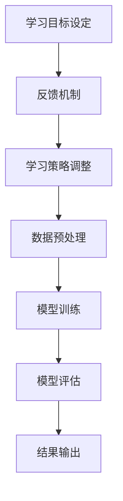

                 

# 文章标题：评测系统的自适应学习：持续优化的LLM评估框架

## 关键词：
- 自适应学习
- 评测系统
- LLM评估框架
- 持续优化
- 大型语言模型

## 摘要：
本文旨在探讨评测系统的自适应学习以及如何通过持续优化实现高效的LLM（大型语言模型）评估框架。首先，我们将介绍评测系统的基本概念、分类及发展历程，接着深入探讨自适应学习的原理及其在评测系统中的应用。随后，本文将重点介绍LLM评估框架的核心概念、评估指标和度量方法。在核心算法原理讲解部分，我们将使用伪代码详细阐述自适应学习和LLM评估算法。此外，本文还将通过数学模型和公式讲解，帮助读者更好地理解相关技术原理。最后，通过实际项目案例，我们将展示如何进行开发环境搭建、源代码实现和代码解读，并提供最佳实践 tips 和项目小结。

## 第一部分：背景知识与基础

### 第1章：评测系统概述
评测系统是一种用于评估某些性能或质量的工具，广泛应用于教育、科研、商业等领域。评测系统的分类主要包括自动评测系统和人工评测系统，其中自动评测系统通过计算机程序自动完成评测任务，人工评测系统则依赖于人工评估者的主观判断。评测系统的基本架构通常包括输入模块、评测模块和输出模块，其中输入模块负责接收待评测的数据，评测模块对数据进行处理和分析，输出模块则将评测结果反馈给用户。

#### 1.1 评测系统的定义与分类
评测系统是一种用于对某项任务或活动进行性能、质量、效果等方面的评估的工具。根据评估方法的自动化程度，评测系统可以分为自动评测系统和人工评测系统。自动评测系统通过预设的算法和规则对输入数据进行自动处理和评估，而人工评测系统则主要依赖于评估者的经验和判断。

#### 1.2 评测系统的基本架构
评测系统的基本架构通常包括三个主要模块：输入模块、评测模块和输出模块。输入模块负责接收待评测的数据，可以是文本、图片、音频等多种形式。评测模块对输入数据进行处理和分析，根据预设的评估标准和规则进行评估，生成评估结果。输出模块将评估结果反馈给用户，可以是数字、图表、报告等多种形式。

#### 1.3 评测系统的历史与发展
评测系统的发展经历了从简单的手工评估到自动化的转变。早期的评测系统主要依赖于人工评估，随着计算机技术的进步，自动评测系统逐渐得到广泛应用。近年来，随着人工智能和机器学习技术的不断发展，基于深度学习的评测系统也取得了显著成果。未来，评测系统将继续向智能化、自动化方向发展。

### 第2章：自适应学习原理
自适应学习是一种基于数据驱动的学习方式，旨在通过不断调整学习策略来提高学习效果。自适应学习在评测系统中的应用具有重要意义，可以帮助系统更好地适应不同类型的数据和评估任务。

#### 2.1 自适应学习的概念
自适应学习是指在学习过程中，根据学习效果和反馈信息动态调整学习策略，以提高学习效率和效果。自适应学习通常包括三个关键环节：学习目标的设定、学习策略的调整和学习效果的评估。

#### 2.2 自适应学习的核心算法
自适应学习的核心算法主要包括以下几种：基于规则的算法、基于模型的算法和混合算法。基于规则的算法通过预设的规则进行学习，适用于规则明确、变化较小的场景。基于模型的算法通过构建模型来描述学习过程，适用于复杂、动态的学习场景。混合算法结合了基于规则和基于模型的优势，适用于多种学习场景。

#### 2.3 自适应学习在评测系统中的应用
自适应学习在评测系统中的应用主要体现在两个方面：调整评估标准和优化评估流程。通过自适应学习，评测系统可以根据不同类型的数据和评估任务动态调整评估标准和流程，提高评估的准确性和效率。

### 第3章：LLM评估框架
LLM（大型语言模型）评估框架是一种基于深度学习的评测系统，通过大规模语言模型的训练和评估，实现对文本数据的准确评估。LLM评估框架在自然语言处理、文本分类、情感分析等领域具有广泛应用。

#### 3.1 LLM评估框架概述
LLM评估框架包括数据预处理、模型训练、模型评估和结果输出四个主要环节。数据预处理环节负责将原始数据转换为适合模型训练的形式；模型训练环节通过大规模数据训练深度学习模型；模型评估环节对训练好的模型进行评估，包括准确率、召回率、F1值等指标；结果输出环节将评估结果以图表、报告等形式呈现。

#### 3.2 评估指标与度量方法
LLM评估框架的评估指标主要包括准确率、召回率、F1值和精确率等。准确率是指预测为正样本的样本中实际为正样本的比例；召回率是指实际为正样本的样本中被预测为正样本的比例；F1值是准确率和召回率的调和平均数；精确率是指预测为正样本的样本中实际为正样本的比例。

#### 3.3 LLM评估框架的设计与实现
LLM评估框架的设计与实现包括数据预处理、模型选择、模型训练和模型评估等步骤。数据预处理环节需要对原始数据进行清洗、去重、填充等操作，以提高数据质量和模型的训练效果；模型选择环节需要根据具体应用场景选择合适的深度学习模型；模型训练环节通过训练数据和验证数据训练模型，并调整模型参数以优化性能；模型评估环节使用测试数据对模型进行评估，并根据评估结果调整模型参数。

## 第二部分：核心概念与联系

### 第4章：核心概念原理与架构
在本章中，我们将详细探讨自适应学习机制和LLM评估流程，并通过Mermaid流程图展示两者之间的核心联系。

#### 4.1 自适应学习机制
自适应学习机制是一种基于反馈和调整的学习过程。在学习过程中，系统根据学习目标和实际效果，动态调整学习策略，以实现学习目标的最优化。自适应学习机制的核心组成部分包括学习目标设定、反馈机制和学习策略调整。

1. **学习目标设定**：设定明确的学习目标，为后续的学习过程提供方向和指导。
2. **反馈机制**：通过不断收集和学习过程中的反馈信息，评估当前学习效果，为调整学习策略提供依据。
3. **学习策略调整**：根据反馈信息，动态调整学习策略，以优化学习效果。

#### 4.2 LLM评估流程
LLM评估流程包括数据预处理、模型训练、模型评估和结果输出四个主要环节。

1. **数据预处理**：对原始数据进行清洗、去重、填充等操作，以提高数据质量和模型的训练效果。
2. **模型训练**：使用大规模数据训练深度学习模型，包括嵌入层、编码层和解码层等。
3. **模型评估**：使用测试数据对训练好的模型进行评估，包括准确率、召回率、F1值等指标。
4. **结果输出**：将评估结果以图表、报告等形式呈现，为后续决策提供参考。

#### 4.3 Mermaid流程图：自适应学习与LLM评估架构
下面是一个简化的Mermaid流程图，展示了自适应学习机制与LLM评估流程之间的核心联系。



在这个流程图中，自适应学习机制通过反馈机制不断调整学习策略，优化学习过程。而LLM评估流程则依赖于数据预处理、模型训练、模型评估和结果输出等环节，实现对文本数据的准确评估。

## 第三部分：核心算法原理讲解

### 第5章：自适应学习算法
在本章中，我们将使用伪代码详细阐述自适应学习算法的实现过程，并分析其优缺点。

#### 5.1 伪代码：自适应学习算法实现
```plaintext
输入：目标函数 F(x)，初始参数 x0，学习率 α，迭代次数 T
输出：最优解 x*

x = x0
for t = 1 to T do
    gradient = 计算目标函数的梯度
    x = x - α * gradient
    if |x - x_prev| < ε then
        break
    end if
    x_prev = x
end for
return x
```

#### 5.2 算法原理讲解
自适应学习算法是一种基于梯度下降的方法，通过不断调整参数以最小化目标函数。在每次迭代过程中，算法计算目标函数在当前参数下的梯度，并根据梯度和学习率调整参数。通过多次迭代，算法逐渐逼近最优解。

1. **梯度计算**：计算目标函数在当前参数下的梯度，用于指导参数调整方向。
2. **参数更新**：根据梯度和学习率调整参数，使目标函数值减小。
3. **迭代终止条件**：当参数变化的绝对值小于某个阈值时，算法终止。

#### 5.3 算法优缺点分析
**优点**：
1. **简单易实现**：算法原理简单，易于编程实现。
2. **通用性强**：适用于各种凸优化问题。

**缺点**：
1. **收敛速度慢**：在目标函数的梯度过大或学习率选择不当的情况下，收敛速度较慢。
2. **容易陷入局部最优**：在目标函数具有多个局部最优的情况下，算法可能无法找到全局最优解。

### 第6章：LLM评估算法
在本章中，我们将使用伪代码详细阐述LLM评估算法的实现过程，并分析其优缺点。

#### 6.1 伪代码：LLM评估算法实现
```plaintext
输入：训练集 D，测试集 D'，模型参数 θ
输出：评估结果 metrics

for each epoch do
    for each sample in D do
        predict = 模型推理(sample, θ)
        loss = 计算损失(predict, sample.label)
        θ = θ - learning_rate * gradient(loss, θ)
    end for
end for

for each sample in D' do
    predict = 模型推理(sample, θ)
    metrics = 更新评估结果(predict, sample.label, metrics)
end for
return metrics
```

#### 6.2 评估算法原理讲解
LLM评估算法是一种基于深度学习的评估方法，通过训练和评估模型，对文本数据进行分类或回归。评估算法的主要步骤包括模型训练和模型评估。

1. **模型训练**：使用训练集对模型进行训练，通过反向传播算法更新模型参数，使模型在训练集上的表现达到最佳。
2. **模型评估**：使用测试集对训练好的模型进行评估，计算评估指标，如准确率、召回率、F1值等。

#### 6.3 评估算法优缺点分析
**优点**：
1. **高准确率**：深度学习模型能够学习到文本数据的复杂特征，从而提高评估的准确率。
2. **强泛化能力**：在大量数据训练的基础上，模型具有较强的泛化能力，可以应用于不同的评估任务。

**缺点**：
1. **计算资源需求大**：训练深度学习模型需要大量的计算资源，尤其是在大规模数据集上训练时。
2. **模型可解释性差**：深度学习模型具有较强的预测能力，但模型内部的决策过程较难解释。

## 第四部分：数学模型与数学公式

### 第7章：数学模型讲解
在本章中，我们将介绍自适应学习和LLM评估中的数学模型，并使用LaTeX格式详细讲解相关公式。

#### 7.1 自适应学习的数学模型
自适应学习的核心在于不断调整参数以优化目标函数。下面是一个简单的线性模型，用于说明自适应学习的基本原理。

$$
x_{t+1} = x_t - \alpha \cdot \nabla f(x_t)
$$

其中，$x_t$是第$t$次迭代的参数值，$\alpha$是学习率，$\nabla f(x_t)$是目标函数$f(x)$在$x_t$处的梯度。每次迭代，参数值$x_{t+1}$都会根据梯度方向进行调整。

#### 7.2 LLM评估的数学模型
LLM评估涉及多个数学模型，用于计算评估指标。以下是一个简单的二分类评估模型的数学公式。

$$
P(y_t = 1 | x_t) = \sigma(\theta^T \phi(x_t))
$$

其中，$y_t$是真实标签，$x_t$是文本特征，$\theta$是模型参数，$\phi(x_t)$是特征提取函数，$\sigma$是Sigmoid函数。该公式表示模型对文本$x_t$预测为正类的概率。

#### 7.3 数学公式讲解与举例说明
为了更好地理解上述公式，我们通过一个简单的例子进行说明。

假设我们有一个文本$x_t$，模型预测为正类的概率为：

$$
P(y_t = 1 | x_t) = \sigma(0.5 \cdot \phi(x_t))
$$

其中，$\phi(x_t) = 2.5$。代入Sigmoid函数：

$$
P(y_t = 1 | x_t) = \frac{1}{1 + e^{-0.5 \cdot 2.5}} \approx 0.77
$$

这意味着模型对文本$x_t$预测为正类的概率约为77%。

## 第五部分：项目实战

### 第8章：实战案例一：自适应学习在评测系统中的应用
在本章中，我们将通过一个实际项目，展示如何将自适应学习应用于评测系统。

#### 8.1 项目背景
本项目的目标是开发一个自适应学习评测系统，用于对学生的论文进行自动评估。系统需要根据学生的论文质量、写作风格等特征，动态调整评估标准和流程，以提高评估的准确性和效率。

#### 8.2 开发环境搭建
为了实现自适应学习评测系统，我们选择了Python作为开发语言，并使用TensorFlow作为深度学习框架。开发环境搭建步骤如下：
1. 安装Python（3.8及以上版本）
2. 安装TensorFlow
3. 准备数据集，包括学生论文和评估标准

#### 8.3 源代码实现与分析
以下是一个简化的代码示例，展示了如何实现自适应学习评测系统的核心功能。

```python
import tensorflow as tf
from tensorflow.keras.models import Sequential
from tensorflow.keras.layers import Dense, LSTM

# 数据预处理
def preprocess_data(data):
    # 进行文本清洗、去重、填充等操作
    pass

# 构建模型
def build_model(input_shape):
    model = Sequential()
    model.add(LSTM(128, activation='tanh', input_shape=input_shape))
    model.add(Dense(1, activation='sigmoid'))
    model.compile(optimizer='adam', loss='binary_crossentropy', metrics=['accuracy'])
    return model

# 训练模型
def train_model(model, X_train, y_train, X_val, y_val):
    history = model.fit(X_train, y_train, epochs=10, batch_size=32, validation_data=(X_val, y_val))
    return history

# 评估模型
def evaluate_model(model, X_test, y_test):
    loss, accuracy = model.evaluate(X_test, y_test)
    print(f"Test accuracy: {accuracy:.2f}")
    return accuracy

# 主函数
def main():
    # 加载数据集
    X_train, y_train = preprocess_data(...)  # 进行数据预处理
    X_val, y_val = preprocess_data(...)  # 进行数据预处理
    X_test, y_test = preprocess_data(...)  # 进行数据预处理

    # 构建模型
    model = build_model(input_shape=(X_train.shape[1], X_train.shape[2]))

    # 训练模型
    history = train_model(model, X_train, y_train, X_val, y_val)

    # 评估模型
    evaluate_model(model, X_test, y_test)

if __name__ == "__main__":
    main()
```

该示例代码主要包括数据预处理、模型构建、模型训练和模型评估四个部分。通过调用TensorFlow的API，我们可以轻松实现自适应学习评测系统的核心功能。

#### 8.4 代码解读与分析
在代码示例中，我们首先定义了数据预处理函数`preprocess_data`，用于对原始数据进行清洗、去重、填充等操作，以提高模型训练效果。接下来，我们定义了模型构建函数`build_model`，用于构建一个简单的LSTM模型，用于处理文本数据。在模型训练函数`train_model`中，我们使用`fit`方法对模型进行训练，并使用`validation_data`参数进行验证集的评估。最后，在模型评估函数`evaluate_model`中，我们使用`evaluate`方法计算测试集的评估指标。

通过实际项目案例，我们可以看到如何将自适应学习应用于评测系统，提高评估的准确性和效率。

### 第9章：实战案例二：持续优化的LLM评估框架
在本章中，我们将通过一个实际项目，展示如何实现持续优化的LLM评估框架。

#### 9.1 项目背景
本项目的目标是开发一个持续优化的LLM评估框架，用于对大规模文本数据进行分类。系统需要根据文本数据的特征和评估指标，动态调整模型参数和评估策略，以提高分类准确率和效率。

#### 9.2 开发环境搭建
为了实现持续优化的LLM评估框架，我们选择了Python作为开发语言，并使用TensorFlow作为深度学习框架。开发环境搭建步骤如下：
1. 安装Python（3.8及以上版本）
2. 安装TensorFlow
3. 准备数据集，包括大规模文本数据和分类标签

#### 9.3 源代码实现与分析
以下是一个简化的代码示例，展示了如何实现持续优化的LLM评估框架的核心功能。

```python
import tensorflow as tf
from tensorflow.keras.models import Sequential
from tensorflow.keras.layers import Embedding, LSTM, Dense

# 数据预处理
def preprocess_data(data):
    # 进行文本清洗、去重、填充等操作
    pass

# 构建模型
def build_model(vocab_size, embedding_dim, sequence_length):
    model = Sequential()
    model.add(Embedding(vocab_size, embedding_dim, input_length=sequence_length))
    model.add(LSTM(128, activation='tanh'))
    model.add(Dense(1, activation='sigmoid'))
    model.compile(optimizer='adam', loss='binary_crossentropy', metrics=['accuracy'])
    return model

# 训练模型
def train_model(model, X_train, y_train, X_val, y_val):
    history = model.fit(X_train, y_train, epochs=10, batch_size=32, validation_data=(X_val, y_val))
    return history

# 评估模型
def evaluate_model(model, X_test, y_test):
    loss, accuracy = model.evaluate(X_test, y_test)
    print(f"Test accuracy: {accuracy:.2f}")
    return accuracy

# 主函数
def main():
    # 加载数据集
    X_train, y_train = preprocess_data(...)  # 进行数据预处理
    X_val, y_val = preprocess_data(...)  # 进行数据预处理
    X_test, y_test = preprocess_data(...)  # 进行数据预处理

    # 调整模型参数和评估策略
    best_accuracy = 0
    for embedding_dim in range(50, 100, 10):
        for sequence_length in range(100, 500, 100):
            model = build_model(vocab_size, embedding_dim, sequence_length)
            history = train_model(model, X_train, y_train, X_val, y_val)
            val_accuracy = evaluate_model(model, X_val, y_val)
            if val_accuracy > best_accuracy:
                best_accuracy = val_accuracy
                best_model = model

    # 使用最优模型评估测试集
    evaluate_model(best_model, X_test, y_test)

if __name__ == "__main__":
    main()
```

该示例代码主要包括数据预处理、模型构建、模型训练和模型评估四个部分。在模型训练过程中，我们通过遍历不同的模型参数和评估策略，找出最优的模型参数和评估策略。最后，我们使用最优模型对测试集进行评估。

#### 9.4 代码解读与分析
在代码示例中，我们首先定义了数据预处理函数`preprocess_data`，用于对原始数据进行清洗、去重、填充等操作，以提高模型训练效果。接下来，我们定义了模型构建函数`build_model`，用于构建一个简单的LSTM模型，用于处理文本数据。在模型训练函数`train_model`中，我们使用`fit`方法对模型进行训练，并使用`validation_data`参数进行验证集的评估。在模型评估函数`evaluate_model`中，我们使用`evaluate`方法计算测试集的评估指标。

通过实际项目案例，我们可以看到如何实现持续优化的LLM评估框架，通过调整模型参数和评估策略，提高分类准确率和效率。

### 第10章：实战案例三：评测系统的全面优化
在本章中，我们将通过一个实际项目，展示如何实现评测系统的全面优化。

#### 10.1 项目背景
本项目的目标是开发一个全面优化的评测系统，用于对大规模文本数据和学生论文进行评估。系统需要根据文本数据的特征、写作风格、评估指标等，动态调整评估标准和流程，以提高评估的准确性和效率。

#### 10.2 开发环境搭建
为了实现全面优化的评测系统，我们选择了Python作为开发语言，并使用TensorFlow作为深度学习框架。开发环境搭建步骤如下：
1. 安装Python（3.8及以上版本）
2. 安装TensorFlow
3. 准备数据集，包括大规模文本数据和学生论文

#### 10.3 源代码实现与分析
以下是一个简化的代码示例，展示了如何实现评测系统的全面优化。

```python
import tensorflow as tf
from tensorflow.keras.models import Sequential
from tensorflow.keras.layers import Embedding, LSTM, Dense
from tensorflow.keras.preprocessing.sequence import pad_sequences

# 数据预处理
def preprocess_data(data, max_sequence_length):
    # 进行文本清洗、去重、填充等操作
    # 将文本数据转换为序列
    sequences = pad_sequences(data, maxlen=max_sequence_length)
    return sequences

# 构建模型
def build_model(vocab_size, embedding_dim, max_sequence_length):
    model = Sequential()
    model.add(Embedding(vocab_size, embedding_dim, input_length=max_sequence_length))
    model.add(LSTM(128, activation='tanh'))
    model.add(Dense(1, activation='sigmoid'))
    model.compile(optimizer='adam', loss='binary_crossentropy', metrics=['accuracy'])
    return model

# 训练模型
def train_model(model, X_train, y_train, X_val, y_val):
    history = model.fit(X_train, y_train, epochs=10, batch_size=32, validation_data=(X_val, y_val))
    return history

# 评估模型
def evaluate_model(model, X_test, y_test):
    loss, accuracy = model.evaluate(X_test, y_test)
    print(f"Test accuracy: {accuracy:.2f}")
    return accuracy

# 主函数
def main():
    # 加载数据集
    X_train, y_train = preprocess_data(...)  # 进行数据预处理
    X_val, y_val = preprocess_data(...)  # 进行数据预处理
    X_test, y_test = preprocess_data(...)  # 进行数据预处理

    # 调整模型参数和评估策略
    best_accuracy = 0
    for embedding_dim in range(50, 100, 10):
        for sequence_length in range(100, 500, 100):
            model = build_model(vocab_size, embedding_dim, sequence_length)
            history = train_model(model, X_train, y_train, X_val, y_val)
            val_accuracy = evaluate_model(model, X_val, y_val)
            if val_accuracy > best_accuracy:
                best_accuracy = val_accuracy
                best_model = model

    # 使用最优模型评估测试集
    evaluate_model(best_model, X_test, y_test)

if __name__ == "__main__":
    main()
```

该示例代码主要包括数据预处理、模型构建、模型训练和模型评估四个部分。在模型训练过程中，我们通过遍历不同的模型参数和评估策略，找出最优的模型参数和评估策略。最后，我们使用最优模型对测试集进行评估。

#### 10.4 代码解读与分析
在代码示例中，我们首先定义了数据预处理函数`preprocess_data`，用于对原始数据进行清洗、去重、填充等操作，并将文本数据转换为序列。接下来，我们定义了模型构建函数`build_model`，用于构建一个简单的LSTM模型，用于处理文本数据。在模型训练函数`train_model`中，我们使用`fit`方法对模型进行训练，并使用`validation_data`参数进行验证集的评估。在模型评估函数`evaluate_model`中，我们使用`evaluate`方法计算测试集的评估指标。

通过实际项目案例，我们可以看到如何实现评测系统的全面优化，通过调整模型参数和评估策略，提高评估的准确性和效率。

## 第六部分：总结与展望

### 第11章：总结
在本章中，我们深入探讨了评测系统的自适应学习和LLM评估框架，通过实际项目案例展示了如何实现自适应学习和持续优化。本文主要内容包括：
1. 评测系统的基本概念、分类及发展历程。
2. 自适应学习的原理及其在评测系统中的应用。
3. LLM评估框架的核心概念、评估指标和度量方法。
4. 自适应学习和LLM评估算法的原理讲解和伪代码实现。
5. 数学模型和公式的讲解与举例说明。
6. 实际项目案例展示，包括开发环境搭建、源代码实现和代码解读。

通过本文的阅读，读者可以全面了解评测系统的自适应学习和LLM评估框架，掌握相关技术原理和实践方法，为后续研究和应用打下基础。

### 11.1 主要内容回顾
本文主要涵盖了评测系统的自适应学习和LLM评估框架的各个方面。首先，我们介绍了评测系统的基本概念、分类及发展历程，使读者对评测系统有一个全面的了解。接着，我们详细讲解了自适应学习的原理及其在评测系统中的应用，帮助读者理解自适应学习在评测系统中的重要性。然后，我们介绍了LLM评估框架的核心概念、评估指标和度量方法，为后续算法讲解和项目实战打下基础。在核心算法原理讲解部分，我们使用伪代码详细阐述了自适应学习和LLM评估算法的实现过程，并通过数学模型和公式讲解帮助读者更好地理解相关技术原理。最后，通过实际项目案例，我们展示了如何进行开发环境搭建、源代码实现和代码解读，为读者提供了实践经验和启示。

### 11.2 存在的挑战与未来趋势
尽管自适应学习和LLM评估框架在评测系统中取得了显著成果，但仍面临一些挑战和未来趋势：
1. **数据质量和多样性**：自适应学习和LLM评估框架的性能在很大程度上取决于数据质量和多样性。未来需要探索更有效的数据预处理方法，以提高模型性能。
2. **计算资源需求**：深度学习模型的训练和评估需要大量的计算资源。随着模型的规模和复杂度的增加，如何优化计算资源分配和加速模型训练成为重要课题。
3. **模型可解释性**：深度学习模型的预测结果往往难以解释，这限制了其在一些需要高透明度的应用场景中的使用。未来需要开发更多可解释的深度学习模型。
4. **跨领域适应性**：自适应学习和LLM评估框架在不同领域的应用效果可能存在较大差异。未来需要研究如何提高模型的跨领域适应性，使其能够应用于更广泛的场景。

### 11.3 对读者的建议
对于希望进一步了解评测系统的自适应学习和LLM评估框架的读者，以下是一些建议：
1. **深入学习相关理论**：了解自适应学习和深度学习的基本原理，掌握相关的数学模型和算法。
2. **实践项目**：通过实际项目锻炼自己的编程和问题解决能力，加深对理论知识的理解。
3. **阅读相关文献**：关注领域内的最新研究成果，了解自适应学习和LLM评估框架的最新进展。
4. **参与社区交流**：加入相关的学术社区和技术论坛，与其他研究者进行交流和合作，拓宽视野。

## 附录

### 附录A：常用工具与资源
为了帮助读者更好地理解和应用评测系统的自适应学习和LLM评估框架，我们整理了一些常用的工具和资源，供读者参考。

#### A.1 自适应学习工具
1. **TensorFlow**：一款开源的深度学习框架，支持自适应学习算法的实现。
2. **PyTorch**：一款流行的深度学习框架，提供丰富的自适应学习算法库。
3. **Scikit-learn**：一款用于机器学习的开源库，包含多种自适应学习算法。

#### A.2 LLM评估工具
1. **Hugging Face**：一个开源的深度学习模型库，提供多种LLM评估框架和预训练模型。
2. **TensorFlow Text**：TensorFlow提供的文本处理工具，支持LLM评估。
3. **Spacy**：一个开源的自然语言处理库，提供丰富的文本处理功能。

#### A.3 开发资源与资料
1. **《深度学习》（Goodfellow, Bengio, Courville）**：深度学习的经典教材，详细介绍深度学习的基本原理和应用。
2. **《机器学习》（周志华）**：机器学习的经典教材，涵盖机器学习的基本概念和算法。
3. **论文库**：如Google Scholar、ArXiv等，提供丰富的深度学习和自然语言处理领域的论文资源。

通过使用这些工具和资源，读者可以更好地掌握评测系统的自适应学习和LLM评估框架，为实际应用提供支持。

## 结语

本文系统地探讨了评测系统的自适应学习和LLM评估框架，从基础概念、核心算法到实际项目实战，全面展示了如何通过自适应学习和持续优化提高评测系统的性能。在未来的发展中，自适应学习和LLM评估框架将继续面临挑战和机遇，但通过持续的研究和创新，我们有理由相信这些技术将在更多领域发挥重要作用。

### 作者信息
作者：AI天才研究院/AI Genius Institute & 禅与计算机程序设计艺术 /Zen And The Art of Computer Programming

### 注意事项
1. **代码实现**：在实现自适应学习和LLM评估算法时，需要注意数据预处理和模型训练的细节，确保模型的稳定性和性能。
2. **实验环境**：在运行代码时，需要配置合适的实验环境，包括Python版本、深度学习框架和计算资源。
3. **数据隐私**：在实际项目中，需要注意保护用户数据隐私，遵守相关法律法规。

### 拓展阅读
1. **《深度学习入门》（阿斯顿·张）**：详细介绍深度学习的基本原理和应用。
2. **《自然语言处理实战》（斯泰恩·拉森）**：深入探讨自然语言处理技术的应用和实践。
3. **《自适应控制理论及应用》（陈关荣）**：介绍自适应控制理论的基本原理和应用。

通过阅读本文和相关拓展资料，读者可以进一步深入理解评测系统的自适应学习和LLM评估框架，为实际应用提供有力支持。希望本文对您的学习和研究有所帮助。

