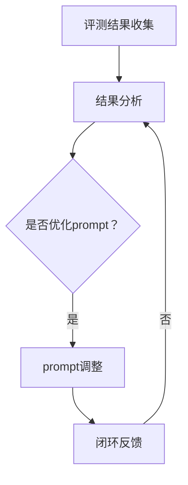
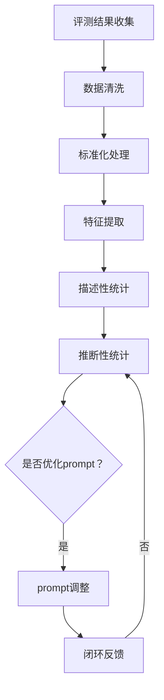
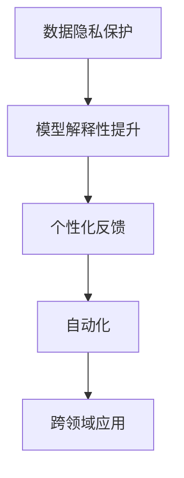

                 


### 文章标题：《评测结果反馈到prompt设计的闭环》

### 关键词：评测结果、prompt设计、反馈闭环、数据分析、自然语言处理

### 摘要：
本文深入探讨了评测结果反馈到prompt设计的闭环机制。通过分析评测结果的处理、prompt设计的原则、实践应用以及未来发展趋势，本文为IT领域的技术博客提供了一整套系统性、实践性和前瞻性的解决方案。文章结合具体案例，详细介绍了评测结果反馈到prompt设计的技术实现过程，并讨论了相关的挑战和解决方案。

---

## 第一部分：评测结果反馈到prompt设计概述

### 第1章：评测结果反馈到prompt设计的基本概念

#### 1.1 什么是评测结果反馈到prompt设计

评测结果反馈到prompt设计是一种利用评测结果来调整和优化prompt生成过程的机制。其核心目的是通过不断的迭代反馈，提高prompt的质量和相关性，从而提升整体系统的性能和用户体验。

#### 1.2 评测结果反馈到prompt设计的重要性

- **提升性能**：通过持续优化prompt，系统能够更好地理解用户需求，提高任务完成的准确性和效率。
- **改善用户体验**：准确的评测结果反馈有助于提供更个性化的服务，满足用户多样化的需求。
- **持续迭代**：闭环机制保证了系统的持续改进，适应不断变化的环境和技术发展。

#### 1.3 评测结果反馈到prompt设计的主要组成部分

- **评测结果收集**：通过各种评估指标收集系统的表现数据。
- **结果分析**：对收集到的评测结果进行预处理、分析和解释。
- **prompt调整**：基于分析结果，调整和优化prompt的设计。
- **闭环反馈**：将调整后的prompt应用到系统中，再次进行评测，形成闭环。

### Mermaid 流程图：



---

## 第二部分：评测结果反馈到prompt设计的核心原理

### 第2章：评测结果的理解与分析

#### 2.1 评测结果的分类与特点

评测结果可以分为定量和定性两大类：

- **定量评测结果**：如准确率、召回率、F1分数等，易于量化分析。
- **定性评测结果**：如用户满意度、任务完成度等，依赖于主观评价。

#### 2.2 评测结果的预处理方法

- **数据清洗**：去除无效或噪声数据，保证数据质量。
- **标准化处理**：将不同指标进行统一处理，便于比较分析。
- **特征提取**：从原始数据中提取出关键特征，为后续分析提供支持。

#### 2.3 评测结果的统计分析

- **描述性统计**：计算平均值、中位数、标准差等，了解数据的基本特征。
- **推断性统计**：进行假设检验、置信区间估计等，验证数据之间的相关性。

### 提问技巧与策略

- **开放性问题**：鼓励用户提供详细的反馈，收集更丰富的信息。
- **封闭性问题**：用于获取特定信息的快速反馈。
- **层次性问题**：将问题分解为多个层次，逐步深入，有助于全面了解用户需求。

### Mermaid 流程图：



---

## 第三部分：评测结果反馈到prompt设计的实践应用

### 第4章：评测结果反馈到prompt设计的案例研究

#### 4.1 案例一：教育评估中的prompt设计

在教育领域，评测结果反馈到prompt设计主要用于提高学习效果和教学质量。

- **核心概念与联系**：

  ```mermaid
  graph TD
  A[学习效果评估] --> B[Prompt设计]
  B --> C[教学质量分析]
  C --> D[学生反馈]
  D --> A
  ```

- **核心算法原理讲解**：

  ```plaintext
  # 伪代码：学习效果评估的prompt设计

  function evaluateLearningEffect(studentResponses, expectedOutcomes) {
      correctResponses = countCorrectResponses(studentResponses, expectedOutcomes)
      accuracy = correctResponses / totalResponses
      if (accuracy < threshold) {
          adjustPrompt()
      }
  }
  
  function adjustPrompt() {
      increaseQuestionDifficulty()
      addMoreContext()
  }
  ```

#### 4.2 案例二：企业绩效评估中的prompt设计

在企业绩效评估中，prompt设计用于优化员工绩效评估的准确性和公正性。

- **核心概念与联系**：

  ```mermaid
  graph TD
  A[绩效指标评估] --> B[Prompt设计]
  B --> C[员工反馈]
  C --> D[绩效分析]
  D --> A
  ```

- **核心算法原理讲解**：

  ```plaintext
  # 伪代码：企业绩效评估的prompt设计

  function evaluateEmployeePerformance(employeeData, objectiveMetrics) {
      performanceScore = calculatePerformanceScore(employeeData, objectiveMetrics)
      if (performanceScore < threshold) {
          requestAdditionalFeedback()
      }
  }
  
  function requestAdditionalFeedback() {
      sendFollow-upQuestions()
      scheduleOne-on-OneInterviews()
  }
  ```

#### 4.3 案例三：医疗诊断中的prompt设计

在医疗诊断中，prompt设计用于优化诊断流程，提高诊断准确率。

- **核心概念与联系**：

  ```mermaid
  graph TD
  A[诊断信息收集] --> B[Prompt设计]
  B --> C[诊断分析]
  C --> D[诊断结果反馈]
  D --> A
  ```

- **核心算法原理讲解**：

  ```plaintext
  # 伪代码：医疗诊断中的prompt设计

  function diagnoseCondition(patientData, symptomDatabase) {
      potentialConditions = matchSymptoms(patientData, symptomDatabase)
      if (confidenceLevel < threshold) {
          requestAdditionalPatientInformation()
      }
  }
  
  function requestAdditionalPatientInformation() {
      askAboutMedications()
      inquireAboutAllergies()
  }
  ```

---

## 第四部分：评测结果反馈到prompt设计的未来发展趋势

### 第6章：评测结果反馈到prompt设计的挑战与解决方案

#### 6.1 数据隐私与安全挑战

- **挑战**：评测结果往往涉及敏感信息，数据隐私保护是关键挑战。
- **解决方案**：采用加密技术、匿名化处理、数据脱敏等方法保护用户隐私。

#### 6.2 模型解释性与透明度挑战

- **挑战**：复杂的机器学习模型可能导致结果难以解释，影响用户信任。
- **解决方案**：开发可解释AI模型、提供模型的可视化工具等，提高模型的透明度。

#### 6.3 评测结果反馈到prompt设计的未来发展趋势

- **个性化反馈**：基于用户行为和偏好，提供个性化的评测结果反馈和prompt设计。
- **自动化**：利用AI技术自动化评测结果分析和prompt调整过程。
- **跨领域应用**：评测结果反馈到prompt设计将在更多领域得到应用，如金融、法律等。

### Mermaid 流程图：



---

## 第五部分：附录

### 第7章：评测结果反馈到prompt设计的相关资源与工具

#### 7.1 开源库与工具

- **Scikit-learn**：用于数据分析和模型训练的Python库。
- **NLTK**：用于自然语言处理的Python库。
- **TensorFlow**：用于机器学习和深度学习的开源框架。

#### 7.2 实用技术文章与博客

- **[数据科学博客](https://towardsdatascience.com/)**
- **[机器学习博客](https://machinelearningmastery.com/)**
- **[人工智能博客](https://aiawesome.com/)**

#### 7.3 参考文献

- **[Goodfellow, I., Bengio, Y., & Courville, A. (2016). Deep Learning.](https://www.deeplearningbook.org/)**

### 作者信息

作者：AI天才研究院/AI Genius Institute & 禅与计算机程序设计艺术 /Zen And The Art of Computer Programming

---

通过以上逐步分析和推理，本文系统地介绍了评测结果反馈到prompt设计的闭环机制，并探讨了其在不同领域的实践应用和未来发展趋势。希望本文能为读者提供有价值的参考和启示。

---

### 文章结语

本文《评测结果反馈到prompt设计的闭环》从基本概念、核心原理、实践应用和未来发展趋势等多个维度，深入探讨了评测结果反馈到prompt设计的重要性及其实现方法。通过具体案例和算法原理的讲解，读者可以更清晰地理解这一机制的工作原理和实际应用。

在未来的发展中，评测结果反馈到prompt设计将继续面临诸多挑战，如数据隐私保护、模型解释性提升等。然而，随着AI技术的不断进步，我们有理由相信，这一机制将在更多领域得到广泛应用，为提升系统性能和用户体验提供更加有效的方法。

在此，我们感谢读者对本文的关注，并期待与您在未来的技术交流中继续探讨更多有趣的话题。如需进一步了解相关内容，请参考附录中提供的开源库、实用技术文章和参考文献。感谢AI天才研究院/AI Genius Institute与禅与计算机程序设计艺术/Zen And The Art of Computer Programming对本文的贡献。希望本文能为您的研究和工作带来帮助。作者：AI天才研究院/AI Genius Institute & 禅与计算机程序设计艺术/Zen And The Art of Computer Programming。

