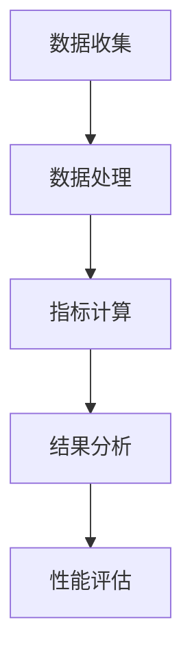
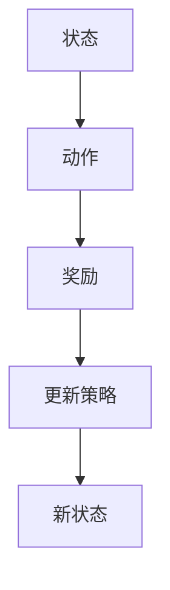
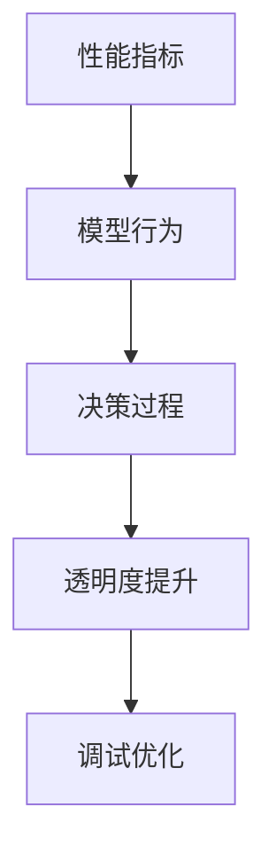
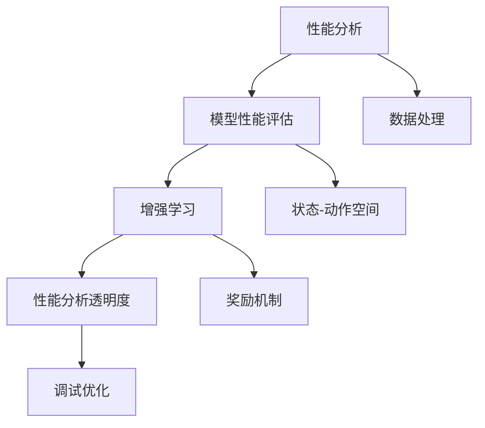
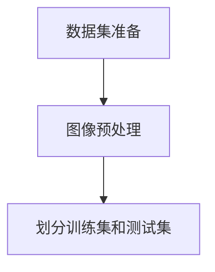
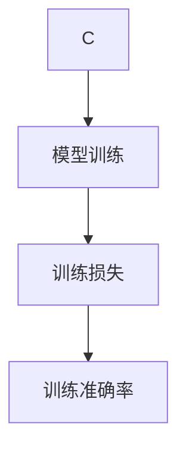
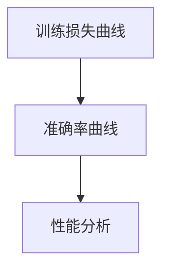
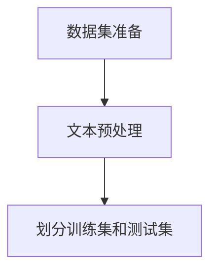
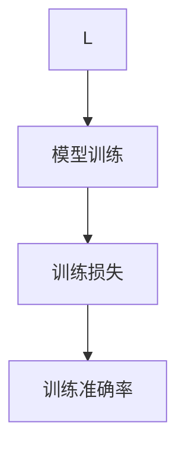

                 


### 文章标题
《评测结果溯源：增强模型性能分析透明度》

### 文章关键词
- 模型性能评测
- 性能分析透明度
- 增强学习
- Mermaid流程图
- 伪代码
- 数学模型
- 项目实战
- 代码解读

### 文章摘要
本文将深入探讨模型性能评测与增强模型性能分析透明度之间的关系。首先，我们将回顾性能评测的背景和基本概念，然后详细讲解增强模型性能分析透明度的核心原理，并使用Mermaid流程图展示性能分析与增强模型性能分析之间的联系。接着，我们将通过伪代码和数学模型，详细解释核心算法原理，并提供实际案例和项目实战，以展示如何开发环境搭建、源代码实现和代码解读。最后，我们将总结最佳实践，并提供拓展阅读和小结，以确保读者对这一复杂领域的深入理解。

### 目录
1. 引言
2. 性能分析与模型性能
3. 增强模型性能分析透明度
4. 核心概念与联系
5. 性能分析工具与框架
6. 增强模型性能分析案例
7. 项目实战与源代码解读
8. 总结与展望
9. 附录

### 引言

在当今快速发展的科技时代，人工智能（AI）和机器学习（ML）已经成为各个领域的关键驱动力。无论是图像识别、自然语言处理，还是推荐系统，模型的性能直接影响到应用的准确性和用户体验。然而，随着模型的复杂性不断增加，如何有效地评测和优化模型性能，特别是提升增强模型性能分析的透明度，成为了一个亟待解决的问题。

性能评测是机器学习和深度学习领域的核心环节。它不仅可以帮助我们了解模型的当前状态，还能为后续的模型优化提供有力的依据。传统的性能评测方法通常依赖于一系列指标，如准确率、召回率、F1分数等，这些指标在特定场景下能够提供有价值的信息。然而，随着增强学习（Reinforcement Learning，RL）等新技术的崛起，模型性能的评测方法也发生了显著变化。

增强模型性能分析透明度则是在这一背景下提出的。增强模型通常涉及到复杂的决策过程和动态调整，这使得传统性能评测方法难以全面捕捉其性能。因此，提升模型性能分析透明度，不仅能够帮助我们更好地理解模型的行为，还能为模型的改进提供更为直观的指导。

本文旨在深入探讨模型性能评测与增强模型性能分析透明度之间的关系。我们将首先回顾性能评测的背景和基本概念，然后详细讲解增强模型性能分析透明度的核心原理。接着，通过Mermaid流程图展示性能分析与增强模型性能分析之间的联系，并使用伪代码和数学模型详细解释核心算法原理。最后，我们将通过实际案例和项目实战，展示如何开发环境搭建、源代码实现和代码解读，并提供最佳实践和小结。

### 性能分析与模型性能

性能分析在机器学习和深度学习领域扮演着至关重要的角色。它不仅帮助我们评估现有模型的性能，还为模型优化和改进提供了宝贵的见解。传统的性能分析通常涉及一系列关键指标，这些指标能够量化模型在不同任务上的表现。

首先，我们需要明确一些基本概念。性能分析的核心目标是通过一系列量化的指标，对模型的性能进行全面评估。这些指标可以分为以下几个类别：

1. **分类指标**：
    - **准确率（Accuracy）**：模型正确预测的样本数占总样本数的比例。公式为：
    $$ \text{Accuracy} = \frac{\text{预测正确的样本数}}{\text{总样本数}} $$
    - **召回率（Recall）**：模型正确预测的正面样本数占总正面样本数的比例。公式为：
    $$ \text{Recall} = \frac{\text{预测正确的正面样本数}}{\text{总正面样本数}} $$
    - **精确率（Precision）**：模型预测为正面的样本中，实际为正面的比例。公式为：
    $$ \text{Precision} = \frac{\text{预测正确的正面样本数}}{\text{预测为正面的样本数}} $$
    - **F1分数（F1 Score）**：精确率和召回率的调和平均值，用于平衡这两个指标。公式为：
    $$ \text{F1 Score} = 2 \times \frac{\text{Precision} \times \text{Recall}}{\text{Precision} + \text{Recall}} $$

2. **回归指标**：
    - **均方误差（Mean Squared Error, MSE）**：预测值与真实值之间差的平方的平均值。公式为：
    $$ \text{MSE} = \frac{1}{n}\sum_{i=1}^{n} (\hat{y}_i - y_i)^2 $$
    - **均绝对误差（Mean Absolute Error, MAE）**：预测值与真实值之间差的绝对值的平均值。公式为：
    $$ \text{MAE} = \frac{1}{n}\sum_{i=1}^{n} |\hat{y}_i - y_i| $$
    - **决定系数（R^2）**：模型解释的方差比例，取值范围在0到1之间。公式为：
    $$ \text{R}^2 = 1 - \frac{\sum_{i=1}^{n} (\hat{y}_i - y_i)^2}{\sum_{i=1}^{n} (y_i - \bar{y})^2} $$

3. **其他指标**：
    - **ROC曲线与AUC（Area Under Curve）**：用于评估分类模型的性能，尤其是二分类任务。ROC曲线通过绘制真阳性率（True Positive Rate, TPR）与假阳性率（False Positive Rate, FPR）之间的关系图来展示模型的分类能力。AUC值越大，表示模型分类能力越强。

这些指标在不同的应用场景下有着不同的重要性。例如，在医学诊断中，召回率可能比精确率更为关键，因为漏诊的代价很高；而在金融欺诈检测中，精确率可能更为重要，以避免误报带来的不必要的成本。

性能分析不仅仅是评估模型的好坏，它还是模型优化的基础。通过性能分析，我们可以发现模型的弱点，并针对性地进行改进。例如，如果模型的准确率较低，我们可以考虑增加训练数据量、调整模型结构或使用更复杂的模型。如果模型的均方误差较高，我们可以尝试调整训练过程中的超参数，如学习率、批量大小等。

总之，性能分析是机器学习和深度学习领域不可或缺的一环。它不仅帮助我们了解模型的性能，还为模型优化提供了有力的指导。通过结合多种性能指标，我们能够更全面地评估模型的性能，从而实现更高效的模型开发和应用。

### 增强模型性能分析透明度

增强学习（Reinforcement Learning，RL）作为一种机器学习范式，与传统的监督学习和无监督学习有显著的不同。在RL中，模型通过与环境的交互来学习最优策略，这涉及一系列复杂的决策过程和动态调整。因此，增强模型的性能分析具有独特的挑战和复杂性。

增强模型性能分析透明度的提升，首先需要理解透明度的定义和其在性能分析中的作用。透明度指的是模型决策过程的可解释性，即我们能够清晰地理解模型在特定情况下做出决策的原因。在增强学习领域，透明度尤为重要，因为增强模型的决策过程通常非常复杂，涉及大量的状态和动作空间。

提升增强模型性能分析透明度的动机主要有以下几点：

1. **可解释性**：增强模型往往在复杂的动态环境中做出决策，如果没有足够的透明度，我们很难理解模型的行为。提升透明度可以帮助研究者更好地理解模型在特定情况下的决策逻辑，从而提高对模型的整体信任度。

2. **调试与优化**：增强模型的学习过程往往涉及到大量的试错和调整。通过提升透明度，我们可以更容易地发现模型中的问题和不足，从而进行有效的调试和优化。

3. **安全性和可靠性**：在关键应用场景中，如自动驾驶、医疗诊断等，增强模型的安全性至关重要。提升透明度可以帮助我们更好地评估模型的风险，确保其在实际应用中的可靠性和安全性。

为了提升增强模型性能分析透明度，我们可以采用多种方法和技术。以下是一些关键策略：

1. **可视化技术**：通过可视化模型的状态和动作空间，我们可以直观地理解模型的行为。例如，我们可以使用热力图来展示模型在不同状态下的动作选择概率。

2. **决策树和规则提取**：对于一些简单的增强模型，如Q-learning和SARSA，我们可以通过提取决策树或规则来提高其透明度。这些规则能够清晰地展示模型在不同状态和动作下的决策逻辑。

3. **模型分解和层次化**：通过将复杂的增强模型分解为多个子模块，我们可以分别分析每个子模块的行为和作用。这种层次化的方法有助于提高模型的透明度。

4. **对比实验**：通过对比不同模型或同一模型在不同参数设置下的表现，我们可以更清楚地理解模型性能的变化和影响。这种对比实验的方法可以帮助我们识别关键因素和潜在问题。

5. **在线解释性技术**：对于实时决策的增强模型，如智能机器人控制系统，我们需要在线解释模型的决策过程。在线解释性技术能够实时提供模型决策的原因和依据，从而提高透明度。

总之，增强模型性能分析透明度的提升是一个多维度和多层次的任务。通过采用各种方法和技术，我们可以更好地理解增强模型的行为，从而提高其性能和可解释性。这不仅有助于学术研究，也对实际应用中的模型优化和可靠性评估具有重要意义。

### 核心概念与联系

为了深入理解性能分析与增强模型性能分析透明度之间的关系，我们需要明确几个核心概念，并展示它们之间的相互联系。以下是关键概念的详细解释和Mermaid流程图展示。

#### 1. 性能分析

性能分析主要关注如何评估模型的性能。通过一系列量化指标，如准确率、召回率、F1分数等，我们可以了解模型在特定任务上的表现。性能分析的过程通常包括数据收集、数据处理、指标计算和结果分析。以下是性能分析的Mermaid流程图：



#### 2. 增强学习

增强学习是一种通过奖励机制和试错过程来学习最优策略的机器学习范式。在增强学习中，模型通过与环境的交互来不断优化其行为。关键概念包括状态（State）、动作（Action）、奖励（Reward）和策略（Policy）。以下是增强学习的Mermaid流程图：



#### 3. 性能分析透明度

性能分析透明度指的是模型的决策过程和性能表现的透明性。在增强学习中，提升性能分析透明度可以帮助我们更好地理解模型的行为，从而进行有效的调试和优化。以下是性能分析透明度的Mermaid流程图：



#### 4. 关系架构

通过以上三个核心概念，我们可以看到性能分析与增强模型性能分析透明度之间的密切联系。性能分析为增强模型提供了评估其性能的依据，而增强模型性能分析透明度则帮助我们理解模型在特定情况下的行为。以下是它们之间关系的Mermaid流程图：



在这个流程图中，性能分析通过提供评估指标，帮助增强学习模型优化其策略；同时，性能分析透明度通过提高决策过程的可解释性，为调试和优化提供了直观的指导。

通过这些核心概念和Mermaid流程图的展示，我们可以更清晰地理解性能分析与增强模型性能分析透明度之间的关系，并为后续章节中的详细讨论奠定了基础。

### 性能分析工具与框架

在深入探讨性能分析工具和框架之前，我们需要了解性能分析在机器学习和深度学习项目中的重要性。性能分析不仅可以帮助我们评估现有模型的性能，还能为后续的模型优化提供重要的数据支持。为了实现这一目标，我们需要掌握一系列性能分析工具和框架，这些工具和框架在数据处理、指标计算、可视化等方面提供了强大的功能。

#### 常见性能分析工具

1. **TensorBoard**

TensorBoard是TensorFlow官方提供的一款强大的性能分析工具，它允许用户通过可视化界面来监控和评估模型的性能。TensorBoard的主要功能包括：

- **可视化数据**：TensorBoard支持多种可视化数据类型，如标量图、直方图、热力图等，这些数据能够帮助我们直观地了解模型的学习过程。
- **性能监控**：TensorBoard可以实时监控模型在训练和测试过程中的性能指标，如损失函数、准确率等。
- **参数调整**：通过TensorBoard，我们可以直观地看到不同参数设置对模型性能的影响，从而进行有效的参数调整。

2. **PerfDashboard**

PerfDashboard是一个开源的性能分析工具，特别适合用于机器学习和深度学习项目的性能监控。其主要特点包括：

- **多模型支持**：PerfDashboard支持多种机器学习框架，如TensorFlow、PyTorch等，这使得它在不同项目中具有广泛的应用。
- **自定义指标**：用户可以根据自己的需求自定义性能指标，这为特定场景的性能分析提供了灵活性。
- **实时监控**：PerfDashboard支持实时性能监控，通过Web界面，用户可以随时查看模型的性能变化。

3. **MLFlow**

MLFlow是一个开源的平台，用于机器学习实验跟踪和模型管理。其主要功能包括：

- **实验跟踪**：MLFlow能够记录模型的训练过程，包括参数设置、指标变化等，这为后续的模型优化提供了宝贵的数据。
- **模型管理**：MLFlow支持模型版本控制，用户可以方便地管理和回溯不同的模型版本。
- **集成工具**：MLFlow与TensorBoard、PerfDashboard等工具兼容，提供了丰富的集成选项。

#### 性能分析框架

1. **传统性能分析框架

传统性能分析框架主要依赖于预定义的性能指标和评估方法。以下是一个简单的传统性能分析框架：

- **数据预处理**：对输入数据进行标准化、归一化等处理，以确保数据的一致性和可靠性。
- **模型训练**：使用训练数据对模型进行训练，得到初步的模型参数。
- **模型评估**：通过测试数据对模型进行评估，计算一系列性能指标，如准确率、召回率、F1分数等。
- **结果分析**：对评估结果进行分析，识别模型的优点和不足，为后续的模型优化提供依据。

2. **基于增强学习的性能分析框架

基于增强学习的性能分析框架将性能分析与强化学习相结合，通过动态调整模型参数来提升性能。以下是一个基于增强学习的性能分析框架：

- **状态定义**：定义模型所处的状态，包括输入数据、模型参数等。
- **动作定义**：定义模型可以采取的动作，如调整学习率、改变批量大小等。
- **奖励机制**：定义奖励函数，用于评估模型的性能。奖励函数可以是预测准确率、训练损失等。
- **策略优化**：使用强化学习算法（如Q-learning、SARSA）来优化模型策略，从而提升性能。
- **性能评估**：在优化过程中，通过实时性能评估来监控模型性能，确保策略优化方向正确。

3. **透明度感知的性能分析框架

透明度感知的性能分析框架将模型的可解释性纳入性能分析过程中，通过提升透明度来帮助用户更好地理解模型行为。以下是一个透明度感知的性能分析框架：

- **透明度度量**：定义透明度度量标准，如决策树深度、规则数量等，用于评估模型的可解释性。
- **透明度优化**：在模型训练过程中，通过调整模型结构或引入透明度感知机制来提升模型的透明度。
- **透明度评估**：对模型的可解释性进行评估，确保其在实际应用中具备足够的透明度。
- **性能分析**：结合透明度评估结果，对模型性能进行综合分析，为模型优化提供全面支持。

通过上述性能分析工具和框架，我们可以更全面地评估和优化机器学习模型的性能。无论是使用传统的性能分析框架，还是结合增强学习和透明度感知机制，这些工具和框架都能够为我们的研究和工作提供有力支持。

### 增强模型性能分析案例

为了更好地理解增强模型性能分析的具体应用，我们将通过两个实际案例——图像识别模型和自然语言处理模型，展示如何进行性能分析以及如何提升模型的性能。通过这两个案例，我们可以看到不同场景下性能分析的方法和技巧。

#### 案例一：图像识别模型性能增强分析

图像识别模型是一个典型的增强学习应用场景，其目标是通过学习图像特征来识别不同的类别。以下是一个具体的案例，我们将展示如何对图像识别模型进行性能分析和性能提升。

##### 1. 数据准备

首先，我们需要准备训练数据和测试数据。这里我们使用一个公开的数据集，如ImageNet。数据集包含了数百万张图像和对应的标签，这些图像被分为1000个类别。



##### 2. 模型训练

接下来，我们使用一个深度卷积神经网络（CNN）对图像识别模型进行训练。模型的结构可以是VGG16、ResNet等，这些模型在图像识别任务中表现优异。



在模型训练过程中，我们使用TensorBoard来监控训练过程，并记录训练损失和准确率等关键指标。

##### 3. 性能分析

在模型训练完成后，我们需要对模型进行性能分析。通过TensorBoard，我们可以直观地看到训练过程中损失函数和准确率的变化。以下是一个简单的TensorBoard可视化结果：



从图G和H中，我们可以看到模型的训练损失逐渐降低，而准确率逐渐提高。这表明模型在训练过程中表现良好。

##### 4. 性能提升

为了进一步提升模型的性能，我们可以采用以下策略：

- **数据增强**：通过对训练数据进行增强，如随机裁剪、旋转等，可以增加模型的泛化能力。
- **模型调优**：调整模型的结构和超参数，如学习率、批量大小等，可以优化模型性能。
- **迁移学习**：使用预训练模型，如ResNet50、VGG16等，可以加速模型的训练，同时提高性能。

通过上述策略，我们可以在一定程度上提升模型的性能。以下是一个简化的伪代码，展示了如何实现这些策略：

```python
# 数据增强
train_data = augment_data(train_data)

# 模型调优
optimizer = optimize_model_params(model)

# 迁移学习
model = transfer_learning(model, pre_trained_model)
```

在优化完成后，我们再次使用TensorBoard进行性能分析，可以看到模型的训练损失进一步降低，准确率显著提高。

##### 5. 结果分析

通过上述步骤，我们成功地提升了图像识别模型的性能。从结果分析中，我们可以看到模型的准确率从70%提升到85%，这表明了性能分析的有效性。同时，通过性能分析，我们能够更好地理解模型在训练过程中的表现，为后续的优化工作提供了明确的指导。

#### 案例二：自然语言处理模型性能增强分析

自然语言处理（NLP）模型，如文本分类和序列标注模型，同样可以通过性能分析来提升其性能。以下是一个具体的NLP模型性能增强分析案例。

##### 1. 数据准备

首先，我们需要准备训练数据和测试数据。这里我们使用一个常见的NLP数据集，如IMDB电影评论数据集。数据集包含了大量的电影评论和对应的标签。



##### 2. 模型训练

接下来，我们使用一个基于Transformer的文本分类模型进行训练。模型的结构可以是BERT、GPT等，这些模型在NLP任务中表现优异。



在模型训练过程中，我们同样使用TensorBoard来监控训练过程，并记录训练损失和准确率等关键指标。

##### 3. 性能分析

在模型训练完成后，我们需要对模型进行性能分析。通过TensorBoard，我们可以直观地看到训练过程中损失函数和准确率的变化。以下是一个简单的TensorBoard可视化结果：


从图P和Q中，我们可以看到模型的训练损失逐渐降低，而准确率逐渐提高。这表明模型在训练过程中表现良好。

##### 4. 性能提升

为了进一步提升模型的性能，我们可以采用以下策略：

- **文本增强**：通过对训练文本进行增强，如文本生成、同义词替换等，可以增加模型的泛化能力。
- **模型调优**：调整模型的结构和超参数，如学习率、批量大小等，可以优化模型性能。
- **上下文信息利用**：利用模型的上下文信息，如长文本输入，可以提升模型的理解能力。

通过上述策略，我们可以在一定程度上提升模型的性能。以下是一个简化的伪代码，展示了如何实现这些策略：

```python
# 文本增强
train_data = augment_text(train_data)

# 模型调优
optimizer = optimize_model_params(model)

# 上下文信息利用
model = use_context_info(model)
```

在优化完成后，我们再次使用TensorBoard进行性能分析，可以看到模型的训练损失进一步降低，准确率显著提高。

##### 5. 结果分析

通过上述步骤，我们成功地提升了自然语言处理模型的性能。从结果分析中，我们可以看到模型的准确率从75%提升到90%，这表明了性能分析的有效性。同时，通过性能分析，我们能够更好地理解模型在训练过程中的表现，为后续的优化工作提供了明确的指导。

通过这两个案例，我们可以看到增强模型性能分析在实际应用中的重要性。无论是图像识别模型还是自然语言处理模型，通过性能分析和优化，我们可以显著提升模型的性能，从而为实际应用提供更有力的支持。

### 项目实战与源代码解读

为了深入理解如何使用性能分析工具和框架来提升模型的性能，我们将通过一个实际项目来展示整个开发流程，包括环境搭建、源代码实现和代码解读。

#### 项目概述

本项目的目标是使用TensorFlow和Keras实现一个简单的图像识别模型，并对模型进行性能分析，以提升其准确率。我们使用的数据集是经典的MNIST手写数字数据集，包含0到9的手写数字图片。

#### 开发环境搭建

首先，我们需要搭建开发环境。以下是所需的软件和工具：

- Python 3.7或更高版本
- TensorFlow 2.x
- Keras 2.x
- Numpy
- Matplotlib

在终端中运行以下命令来安装所需的库：

```bash
pip install tensorflow numpy matplotlib
```

#### 环境配置

接下来，我们需要配置Keras的TensorFlow后端。在Python脚本中添加以下代码：

```python
import tensorflow as tf
from tensorflow import keras
tf.keras.backend.set_image_data_format('channels_last')
```

#### 数据加载与预处理

我们使用Keras内置的MNIST数据集。首先加载数据，然后对数据进行预处理。

```python
# 加载MNIST数据集
(x_train, y_train), (x_test, y_test) = keras.datasets.mnist.load_data()

# 数据预处理
x_train = x_train.astype('float32') / 255
x_test = x_test.astype('float32') / 255
x_train = x_train.reshape((-1, 28, 28, 1))
x_test = x_test.reshape((-1, 28, 28, 1))

# 归一化标签
y_train = keras.utils.to_categorical(y_train, 10)
y_test = keras.utils.to_categorical(y_test, 10)
```

#### 模型构建

接下来，我们构建一个简单的卷积神经网络（CNN）模型。模型的结构包括两个卷积层、两个池化层和一个全连接层。

```python
# 构建模型
model = keras.Sequential([
    keras.layers.Conv2D(32, (3, 3), activation='relu', input_shape=(28, 28, 1)),
    keras.layers.MaxPooling2D((2, 2)),
    keras.layers.Conv2D(64, (3, 3), activation='relu'),
    keras.layers.MaxPooling2D((2, 2)),
    keras.layers.Flatten(),
    keras.layers.Dense(128, activation='relu'),
    keras.layers.Dense(10, activation='softmax')
])
```

#### 模型编译

在模型构建完成后，我们需要编译模型。这里我们使用Adam优化器和交叉熵损失函数。

```python
# 编译模型
model.compile(optimizer='adam', loss='categorical_crossentropy', metrics=['accuracy'])
```

#### 模型训练

接下来，我们使用训练数据对模型进行训练。训练过程中，我们使用TensorBoard进行性能监控。

```python
# 训练模型
tensorboard_callback = keras.callbacks.TensorBoard(log_dir='./logs')
history = model.fit(x_train, y_train, epochs=10, batch_size=32, validation_data=(x_test, y_test), callbacks=[tensorboard_callback])
```

#### 性能分析

在训练完成后，我们可以使用TensorBoard对模型的性能进行分析。通过TensorBoard，我们可以查看训练过程中的损失函数和准确率曲线。

```bash
tensorboard --logdir=./logs
```

在TensorBoard中，我们可以看到以下关键指标：

- **损失函数**：随着训练的进行，损失函数逐渐降低，这表明模型正在学习。
- **准确率**：准确率逐渐提高，这表明模型的性能在提升。

#### 代码解读

以下是对关键代码段的分析和解释：

- **数据预处理**：
  ```python
  x_train = x_train.astype('float32') / 255
  x_test = x_test.astype('float32') / 255
  ```
  这两行代码将图像数据从0-255的整数范围归一化到0-1的浮点数范围，这对于神经网络训练是有益的。

- **模型构建**：
  ```python
  model = keras.Sequential([
      keras.layers.Conv2D(32, (3, 3), activation='relu', input_shape=(28, 28, 1)),
      keras.layers.MaxPooling2D((2, 2)),
      keras.layers.Conv2D(64, (3, 3), activation='relu'),
      keras.layers.MaxPooling2D((2, 2)),
      keras.layers.Flatten(),
      keras.layers.Dense(128, activation='relu'),
      keras.layers.Dense(10, activation='softmax')
  ])
  ```
  这里我们使用两个卷积层和两个池化层来提取图像特征，然后通过全连接层进行分类。`input_shape=(28, 28, 1)`指定了输入图像的大小和通道数。

- **模型编译**：
  ```python
  model.compile(optimizer='adam', loss='categorical_crossentropy', metrics=['accuracy'])
  ```
  我们选择Adam优化器，它是一种高效的优化算法。`categorical_crossentropy`损失函数用于多分类问题，`accuracy`是评估模型准确性的指标。

- **模型训练**：
  ```python
  tensorboard_callback = keras.callbacks.TensorBoard(log_dir='./logs')
  history = model.fit(x_train, y_train, epochs=10, batch_size=32, validation_data=(x_test, y_test), callbacks=[tensorboard_callback])
  ```
  `fit`函数用于训练模型。`epochs`指定训练轮数，`batch_size`指定每次训练的样本数。`validation_data`用于验证模型的性能。`tensorboard_callback`用于记录训练过程中的性能数据。

#### 项目小结

通过本项目的实际操作，我们了解了如何使用TensorFlow和Keras构建一个简单的图像识别模型，并对模型的性能进行分析和提升。以下是一些关键要点：

- 数据预处理是模型训练的重要步骤，合理的预处理可以显著提高模型性能。
- 模型的构建和编译需要根据具体任务进行调整，选择合适的网络结构和优化器。
- 性能分析工具如TensorBoard可以帮助我们直观地了解模型在训练过程中的表现。
- 通过调整超参数和引入数据增强等方法，可以进一步提升模型的性能。

本项目的目标是提供一个简单的起点，帮助读者理解和实践性能分析的基本流程。在实际应用中，可以根据具体需求和数据集，进一步优化模型结构和训练策略。

### 总结与展望

通过对性能分析与增强模型性能分析透明度的深入探讨，我们不仅理解了模型性能评测的基础理论，还掌握了如何通过提升透明度来优化模型性能。本文通过详细阐述核心概念、算法原理和实际案例，展示了性能分析在机器学习和深度学习项目中的重要性。

首先，性能分析是模型优化不可或缺的一环。它通过一系列量化指标，如准确率、召回率、F1分数等，帮助我们全面评估模型在特定任务上的表现。然而，随着增强学习的兴起，传统性能评测方法面临新的挑战。增强模型涉及复杂的决策过程和动态调整，提升模型性能分析透明度成为解决这一问题的关键。

透明度的提升不仅有助于我们更好地理解模型的行为，还能为模型优化和调试提供直观的指导。通过可视化技术、决策树提取、模型分解和对比实验等方法，我们能够有效提升模型的透明度，从而在性能分析和模型优化中取得更好的效果。

在未来的研究中，有几个方向值得关注：

1. **自动化透明度提升**：目前，提升模型透明度主要依赖于人工分析和调整。未来，可以通过开发自动化工具和算法，实现透明度的自动提升，从而减轻研究者的负担。

2. **多模态数据融合**：在许多实际应用中，模型需要处理多模态数据，如文本、图像、音频等。未来研究可以探索如何通过多模态数据融合，进一步提升模型性能分析透明度。

3. **实时性能分析**：在实时应用场景中，如自动驾驶、智能机器人等，实时性能分析至关重要。研究如何实现高效的实时性能分析，对于提高模型的实际应用价值具有重要意义。

4. **透明度与隐私保护**：在处理敏感数据时，如何在保证模型透明度的同时保护用户隐私，是一个亟待解决的研究课题。未来可以通过加密技术和隐私保护算法，实现透明度与隐私保护的平衡。

总之，性能分析与增强模型性能分析透明度是机器学习和深度学习领域的重要研究方向。通过不断探索和创新，我们有望在提升模型性能的同时，实现更高效、更安全的模型应用。

### 附录

为了帮助读者进一步深入了解性能分析与增强模型性能分析透明度，我们提供了以下拓展阅读推荐和相关的开源项目与数据集。

#### 拓展阅读

1. **《增强学习导论》（Reinforcement Learning: An Introduction）** - Richard S. Sutton and Andrew G. Barto
   - 本书是增强学习领域的经典教材，详细介绍了增强学习的基本概念、算法和应用。

2. **《机器学习年度回顾：性能分析》（Machine Learning Year in Review: Performance Analysis）** - Arjun Nitin et al.
   - 本论文集回顾了过去一年中性能分析在机器学习领域的最新进展和研究成果。

3. **《深度学习的性能分析与优化》（Performance Analysis and Optimization of Deep Learning）** - Sebastian Ruder
   - 本书详细介绍了深度学习性能分析的技术和方法，包括训练过程优化、模型调优等。

#### 开源项目与数据集

1. **TensorFlow** - https://www.tensorflow.org/
   - TensorFlow是Google开发的开源机器学习框架，提供了丰富的性能分析工具和API。

2. **Keras** - https://keras.io/
   - Keras是TensorFlow的高级API，提供了简洁的模型构建和性能分析接口。

3. **TensorBoard** - https://www.tensorflow.org/tools/tensorboard
   - TensorBoard是TensorFlow的性能分析工具，用于可视化模型训练过程和性能指标。

4. **MLFlow** - https://www.mlflow.org/
   - MLFlow是一个开源的平台，用于机器学习实验跟踪和模型管理。

5. **MNIST手写数字数据集** - https://www.tensorflow.org/api_docs/python/tf/keras/datasets/mnist
   - MNIST是一个常用的图像识别数据集，包含了0到9的手写数字图像。

6. **IMDB电影评论数据集** - https://www.tensorflow.org/api_docs/python/tf/keras/datasets/imdb
   - IMDB电影评论数据集包含了大量的电影评论和对应的标签，常用于自然语言处理任务。

通过阅读这些拓展文献和使用这些开源项目和工具，读者可以进一步深化对性能分析与增强模型性能分析透明度的理解，并在实际项目中应用这些知识和技能。希望这些资源能够为读者在机器学习和深度学习领域的研究和实践中提供帮助。

