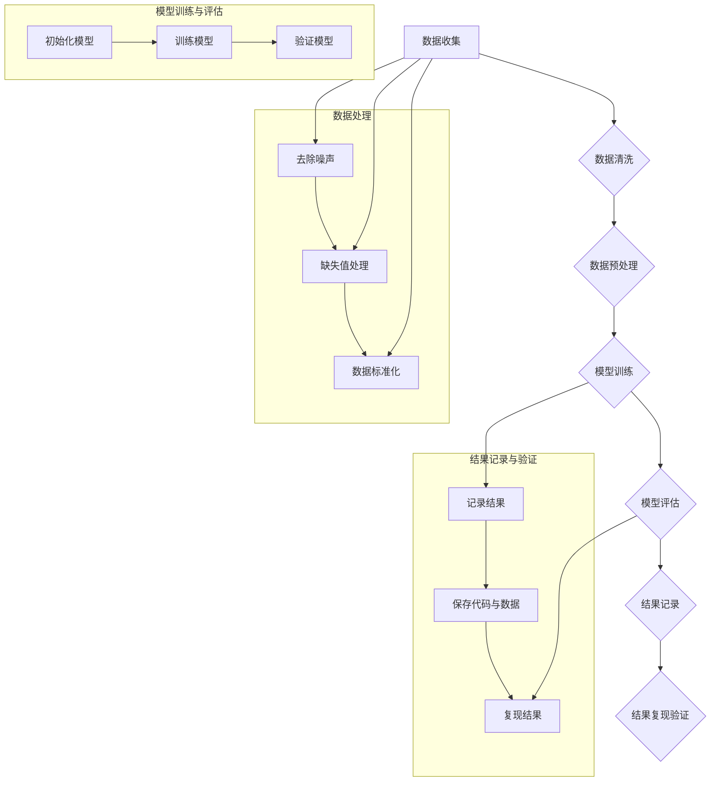
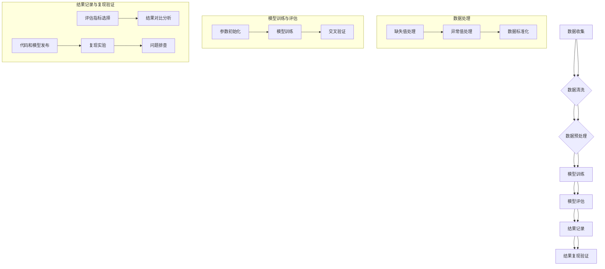

                 

### 文章标题：评测结果的可复现性：LLM支持的标准化流程设计

### 关键词：评测结果复现、大型语言模型（LLM）、标准化流程、算法原理、数学模型、实践应用

### 摘要：
在人工智能领域，评测结果的可复现性是一个至关重要的议题。本文围绕评测结果的可复现性，探讨了基于大型语言模型（LLM）支持的标准化流程设计。文章首先介绍了评测结果复现的重要性以及其面临的主要挑战，随后深入解析了LLM的基本概念、核心算法和数学模型。通过一个详细的标准化流程设计，文章展示了一个可复现性评测结果的实现路径。最后，通过实际案例的分析，本文提供了实践经验，并展望了未来的发展趋势。

## 引言

随着人工智能技术的快速发展，模型评测成为了一个核心环节。评测的目的是为了评估模型的性能，以确保其能够满足实际应用的需求。然而，评测结果的可复现性一直是人工智能领域中的一个挑战。所谓评测结果的可复现性，指的是在不同的条件下，其他研究者能够重现原有的评测结果。这是科学研究中至关重要的原则，因为它保证了研究的可靠性和可信度。

本文的主题是评测结果的可复现性，以及如何通过大型语言模型（LLM）的支持，设计出一种标准化流程来提高评测结果的复现性。在文章的后续部分，我们将逐步探讨这一主题，首先介绍评测结果复现性的重要性，然后深入分析LLM的技术基础，最后展示如何通过标准化流程实现评测结果的可复现性。

本文的目标读者是人工智能领域的研究者、工程师和学者，他们对于模型评测有一定的了解，并希望深入掌握评测结果复现性的相关技术和方法。文章的结构如下：

1. **第1章：评测结果可复现性的核心概念**：介绍评测结果复现性的重要性，分析不可复现性的原因，并定义可复现性的衡量标准。
2. **第2章：相关技术和理论**：深入探讨大型语言模型（LLM）的基本概念、核心算法和数学模型。
3. **第3章：LL Model技术**：详细讲解LLM的架构和关键算法，包括Transformer、BERT和GPT算法。
4. **第4章：标准化流程设计**：阐述如何设计一个支持LLM的评测结果可复现性的标准化流程。
5. **第5章：实践应用**：通过具体案例展示标准化流程的设计与实施，包括开发环境搭建、源代码实现和代码解读。
6. **第6章：结论与展望**：总结文章的主要内容，并对未来的发展趋势提出展望。

通过上述章节的逐步探讨，本文希望能够为读者提供一个全面而深入的了解，帮助他们在实际工作中设计和实现可复现性的评测结果。

## 第1章：评测结果可复现性的核心概念

### 1.1 评测结果复现的重要性

评测结果的可复现性是科学研究中的一项基本原则，尤其在人工智能领域，这一原则显得尤为重要。首先，评测结果的可复现性是评估模型性能的必要条件。只有当其他研究者能够在相同或相似的条件下重现原有的评测结果，我们才能确信模型确实具备所声称的性能。这种复现不仅验证了研究者的发现，也使得研究成果更加可信和可靠。

其次，评测结果的可复现性有助于发现和解决潜在的问题。在实际应用中，不同的研究者可能会采用不同的数据集、参数设置或算法，导致评测结果不一致。通过复现原始评测结果，研究者可以对比和分析不同方法的效果，找出可能的问题根源，从而改进模型和算法。

此外，评测结果的可复现性也促进了学术交流和合作。在学术界，研究者需要通过发表论文来分享他们的研究成果。然而，如果没有评测结果的可复现性，其他研究者无法验证论文的结论，这会阻碍学术交流的进行。通过确保评测结果的可复现性，研究者可以更自信地分享他们的发现，同时也能够接受同行的评审和反馈。

总之，评测结果的可复现性是保证人工智能研究可信性和可靠性的关键。它不仅提升了研究的质量，还促进了学术交流与合作，为人工智能技术的发展奠定了坚实的基础。

### 1.2 评测结果不可复现的原因

尽管评测结果的可复现性在科学研究中至关重要，但现实中仍存在许多导致不可复现性的因素。首先，数据集的差异是一个主要问题。在不同的研究和应用中，研究者可能使用不同的数据集，导致数据分布和特征有所不同。例如，在自然语言处理（NLP）领域，一个研究可能使用了一份数据集，而另一个研究则使用了另一份数据集，这会导致模型在两个数据集上的表现存在显著差异。

其次，模型参数的不一致性也会影响评测结果的可复现性。在训练模型时，研究者可能采用不同的初始化参数、学习率或优化算法，这些差异会导致最终训练出的模型不同。例如，两个研究者使用相同的算法和数据集，但他们的初始化参数不同，最终可能导致模型的性能差异。

另外，算法的细微差别也是一个不可忽视的原因。在人工智能领域，许多算法都是基于类似的理论和架构，但在具体实现中可能存在一些微小的差异。例如，在深度学习中，不同研究者可能采用不同的激活函数、正则化方法或网络结构，这些差异都会对模型的性能产生影响。

此外，环境差异也会导致不可复现性。不同的计算设备、操作系统和软件版本都可能影响模型的训练和评估过程。例如，一个研究可能在某个特定的GPU上训练模型，而另一个研究则在不同的GPU上训练相同的模型，这可能导致训练速度和性能的差异。

最后，人为因素也可能导致评测结果的不可复现性。在研究过程中，研究者可能会在代码、数据或实验设置上做出未经记录的修改，这些修改可能会导致评测结果不一致。

总之，数据集的差异、模型参数的不一致性、算法的细微差别、环境差异以及人为因素都是导致评测结果不可复现的主要原因。为了解决这些问题，需要制定标准化的流程和规范，确保评测结果的可复现性。

### 1.3 可复现性的定义与衡量标准

可复现性是指在相同或相似的条件下，其他研究者能够重现原有研究结果的特性。在科学研究中，可复现性是评估研究可信性和可靠性的关键指标。对于人工智能领域而言，可复现性尤为重要，因为它直接关系到模型性能的验证和应用。

首先，可复现性定义了研究结果的稳定性和一致性。它要求研究者能够清晰地记录和描述实验的各个方面，包括数据集、模型参数、算法设置和实验环境等，使得其他研究者能够准确地重复实验过程。这不仅增强了研究结果的可靠性，还促进了学术交流与合作。

其次，可复现性有助于发现和解决问题。通过复现原始评测结果，研究者可以对比和分析不同方法的效果，找出可能的问题根源。例如，如果某个研究的结果在复现时出现显著差异，这可能是由于数据集、模型参数或算法设置的不一致导致的。通过识别这些差异，研究者可以改进模型和算法，提高评测结果的稳定性和准确性。

在衡量可复现性方面，有几个关键的标准：

1. **详细记录**：研究者需要详细记录所有实验参数和设置，包括数据集的来源和预处理方法、模型的架构和参数、训练和评估的具体步骤等。这些记录应足够清晰，使得其他研究者能够准确地重现实验。

2. **可访问的数据集**：研究者应提供可访问的数据集，并明确数据集的预处理步骤和标注方法。这样，其他研究者可以在相同的条件下处理和使用数据集。

3. **代码和模型的可复现性**：研究者应提供完整的代码和模型，包括训练和评估脚本，以及必要的依赖库和环境配置。这些代码和模型应经过充分的测试，确保其能够在不同环境中正常运行。

4. **可重复的结果**：通过复现实验，研究者应验证其在相同条件下得到的结果与原始结果的一致性。如果结果显著不同，需要分析原因，并进行必要的调整。

总之，可复现性是确保人工智能研究可信性和可靠性的重要标准。通过详细记录、可访问的数据集、代码和模型，以及可重复的结果，研究者可以增强评测结果的可信度，推动人工智能技术的健康发展。

### 1.4 评测结果复现的挑战与解决方法

尽管评测结果的可复现性在科学研究中具有重要意义，但在实际操作中仍面临诸多挑战。首先，数据集的差异是一个主要难题。不同的研究者可能使用不同的数据集，导致数据分布、特征和标注方式存在显著差异，这直接影响到评测结果的可复现性。为了解决这一问题，研究者应使用公共数据集，并遵循统一的数据预处理和标注标准，以确保数据的一致性。

其次，模型参数的不一致性也是一个挑战。不同的研究者可能采用不同的模型参数，如学习率、批量大小和优化算法，这些差异会导致模型性能和评测结果的不同。为了提高可复现性，研究者应在论文中详细记录所有模型参数，并提供一键复现的脚本，使其他研究者能够准确设置和训练模型。

另外，算法实现细节的差异也会影响评测结果的复现。尽管许多算法基于相同的理论框架，但在具体实现中可能存在细微差别，如激活函数、正则化方法和网络结构。为了确保可复现性，研究者应在论文中详细描述算法实现细节，并提供可复现的代码和模型。

环境差异也是一个重要因素。不同的计算设备和操作系统可能导致训练和评估过程的不同，从而影响评测结果的复现。为此，研究者可以提供详细的硬件和软件配置，并使用容器技术（如Docker）封装实验环境，确保其他研究者能够重现实验结果。

最后，研究者应注重透明度和合作。通过在论文中公开所有实验数据和代码，以及积极参与学术讨论和复现工作，研究者可以增强研究的可信度和可复现性。

综上所述，虽然评测结果复现面临诸多挑战，但通过统一数据集、详细记录模型参数、描述算法实现细节、提供完整的代码和模型、封装实验环境以及增强透明度和合作，研究者可以大幅提高评测结果的可复现性，推动人工智能研究的健康发展。

## 第2章：相关技术和理论

### 2.1 大型语言模型（LLM）概述

大型语言模型（LLM，Large Language Model）是一种能够理解和生成自然语言文本的复杂模型。LLM的核心思想是通过学习大量的文本数据，使模型能够捕捉语言中的内在规律，从而实现文本理解和生成。自2018年GPT系列模型问世以来，LLM在自然语言处理（NLP）领域取得了显著的进展，其应用范围不断扩大，从机器翻译、文本分类到问答系统等。

LLM的主要优点包括：

1. **强大的文本理解能力**：LLM通过深度学习技术，能够从大规模的文本数据中提取知识，理解句子和段落中的语义关系，从而实现高精度的文本理解。

2. **高效的文本生成能力**：LLM不仅可以理解文本，还能够根据输入的提示生成连贯、自然的文本。这使得LLM在生成式任务中具有很高的应用价值，如自动写作、对话系统等。

3. **广泛的适用性**：由于LLM能够处理多种语言和文本类型，它在多个领域具有广泛的应用，如新闻写作、产品描述生成、法律文书撰写等。

然而，LLM也面临一些挑战，如：

1. **资源需求大**：训练一个大型语言模型需要大量的计算资源和数据集。

2. **模型解释性差**：由于LLM的复杂性，其内部决策过程往往难以解释，这给模型的部署和应用带来了一定的困难。

3. **数据依赖性强**：LLM的性能很大程度上取决于训练数据的质量和多样性，因此数据质量问题会直接影响模型的性能。

### 2.2 LLM的关键算法与技术

LLM的核心技术包括Transformer、BERT和GPT等，这些算法在深度学习和自然语言处理领域具有里程碑意义。

#### 2.2.1 Transformer算法

Transformer算法由Vaswani等人在2017年提出，是深度学习在自然语言处理领域的一个重要突破。Transformer的核心思想是使用自注意力机制（self-attention）来处理序列数据，取代了传统的循环神经网络（RNN）和卷积神经网络（CNN）。

**自注意力机制**：自注意力机制通过计算序列中每个词与所有其他词的相关性，为每个词生成一个权重向量。这样，每个词的最终表示不仅取决于其自身的特征，还取决于整个序列的特征。自注意力机制的引入使得模型能够捕捉长距离的依赖关系，提高了文本理解的能力。

**Transformer架构**：Transformer模型由编码器（Encoder）和解码器（Decoder）两个部分组成。编码器将输入序列编码为固定长度的向量，解码器则根据编码器的输出生成输出序列。编码器和解码器都由多个自注意力层（Self-Attention Layer）和前馈网络（Feedforward Network）组成，这些层通过堆叠形成了深度神经网络。

**优点**：Transformer算法的优点包括：

1. **并行处理**：由于自注意力机制的计算不依赖于序列的顺序，Transformer可以并行处理整个序列，显著提高了训练速度。
2. **长距离依赖**：自注意力机制能够捕捉长距离的依赖关系，提高了模型的文本理解能力。
3. **灵活性**：Transformer模型结构简单，易于扩展和改进。

#### 2.2.2 BERT算法

BERT（Bidirectional Encoder Representations from Transformers）是由Google在2018年提出的一种预训练语言模型。BERT通过双向编码器（Bidirectional Encoder）对文本进行预训练，使模型能够理解上下文信息，从而在多种NLP任务中取得了优异的性能。

**双向编码器**：BERT的编码器由多个Transformer层组成，通过对输入文本进行双向编码，使模型能够同时理解文本的前后文信息。这种双向编码方式使得BERT在文本理解任务中表现出色。

**预训练目标**：BERT的预训练目标包括：

1. **掩码语言模型（Masked Language Model, MLM）**：随机掩码输入文本中的部分词，并预测这些掩码词。
2. **下一句预测（Next Sentence Prediction, NSP）**：给定两个连续的句子，预测第二个句子是否为第一个句子的下文。

**优点**：BERT的优点包括：

1. **文本理解能力**：BERT通过双向编码器捕获文本的前后文信息，显著提高了文本理解能力。
2. **多任务学习**：BERT在预训练过程中学习了多种任务的特征，使其在多种下游任务中具有较好的泛化能力。

#### 2.2.3 GPT算法

GPT（Generative Pre-trained Transformer）是由OpenAI在2018年提出的一种生成式语言模型。GPT通过生成式预训练方法，使模型能够生成连贯、自然的文本。

**生成式预训练**：GPT通过一个巨大的自回归语言模型进行预训练，模型基于前文生成下一个词，从而学习语言的内在规律。在预训练过程中，GPT使用了一种名为“填充掩码”的技术，通过随机掩码输入文本的部分词，并预测这些掩码词。

**架构**：GPT由多个Transformer层组成，每个层包含自注意力机制和前馈网络。GPT的输入是一个序列，输出是序列中下一个词的概率分布。

**优点**：GPT的优点包括：

1. **文本生成能力**：GPT通过生成式预训练方法，能够生成连贯、自然的文本，适用于多种生成任务，如自动写作、对话系统等。
2. **灵活的架构**：GPT的架构简单，易于扩展和改进，使其在多种任务中表现出色。

总之，Transformer、BERT和GPT是LLM领域的重要算法，它们各自具有独特的优势和特点。通过深入了解这些算法，研究者可以更好地理解和应用LLM技术，推动自然语言处理领域的发展。

### 2.3 数学模型与数学公式

在大型语言模型（LLM）中，数学模型和公式起着核心作用，它们不仅定义了模型的架构和训练过程，还提供了分析和优化模型性能的工具。以下是LLM中常用的数学模型与公式，以及它们在模型训练和评估中的应用。

#### 2.3.1 损失函数

损失函数是模型训练的核心组件，它衡量模型预测值与实际标签之间的差距。在LLM中，常用的损失函数包括交叉熵损失（Cross-Entropy Loss）和对比损失（Contrastive Loss）。

**交叉熵损失**：
$$
L_{CE} = -\frac{1}{N} \sum_{i=1}^{N} y_i \log(\hat{y}_i)
$$
其中，\(y_i\) 是实际标签，\(\hat{y}_i\) 是模型预测的概率分布。交叉熵损失函数常用于分类任务，如文本分类和情感分析。

**对比损失**：
$$
L_{Contrastive} = \frac{1}{2N} \sum_{i=1}^{N} \sum_{j \neq i} \frac{1}{d(i, j)} [ \log(\exp(\theta_{ij} / T) / \sum_{k \neq i} \exp(\theta_{ik} / T)) ]
$$
其中，\(d(i, j)\) 是样本i和样本j之间的距离，\(\theta_{ij}\) 是i和j之间的相似度，\(T\) 是温度参数。对比损失函数常用于多样本学习任务，如推荐系统和信息检索。

#### 2.3.2 优化算法

优化算法用于最小化损失函数，调整模型参数以获得更好的性能。在LLM中，常用的优化算法包括梯度下降（Gradient Descent）和其变种，如Adam优化器。

**梯度下降**：
$$
\theta = \theta - \alpha \nabla_{\theta} J(\theta)
$$
其中，\(\theta\) 是模型参数，\(\alpha\) 是学习率，\(\nabla_{\theta} J(\theta)\) 是损失函数关于参数\(\theta\) 的梯度。

**Adam优化器**：
$$
m_t = \beta_1 m_{t-1} + (1 - \beta_1) [g_t]
$$
$$
v_t = \beta_2 v_{t-1} + (1 - \beta_2) [g_t]^2
$$
$$
\theta_t = \theta_{t-1} - \alpha \frac{m_t}{\sqrt{v_t} + \epsilon}
$$
其中，\(m_t\) 和 \(v_t\) 分别是指数加权平均的梯度一阶矩估计和二阶矩估计，\(\beta_1\) 和 \(\beta_2\) 是超参数，\(\epsilon\) 是一个很小的常数以防止分母为零。

#### 2.3.3 自注意力机制

自注意力机制（Self-Attention）是Transformer模型的核心组件，它通过计算序列中每个词与其他词的相关性，为每个词生成一个权重向量。

**自注意力计算**：
$$
\text{Attention}(Q, K, V) = \text{softmax}\left(\frac{QK^T}{\sqrt{d_k}}\right)V
$$
其中，\(Q, K, V\) 分别是查询（Query）、键（Key）和值（Value）向量，\(d_k\) 是键向量的维度。自注意力机制通过计算点积来衡量词与词之间的相关性，并使用softmax函数生成权重。

#### 2.3.4 梯度裁剪

在训练深度神经网络时，梯度爆炸和梯度消失是常见的问题。梯度裁剪（Gradient Clipping）是一种常用的方法，用于防止梯度爆炸和梯度消失。

**梯度裁剪**：
$$
\text{clip}(x, \theta) = \begin{cases} 
x & \text{if } |x| \leq \theta \\
\text{sign}(x) \cdot \theta & \text{otherwise}
\end{cases}
$$
其中，\(x\) 是梯度值，\(\theta\) 是裁剪阈值。梯度裁剪通过限制梯度值的大小，防止模型参数的剧烈变化。

#### 2.3.5 降维与嵌入

在LLM中，降维和嵌入是常用的技术，用于将高维的输入数据映射到低维的向量空间，提高计算效率和模型性能。

**嵌入计算**：
$$
\text{Embedding}(x) = \text{concat}(\text{W}_i x_i)
$$
其中，\(x_i\) 是输入的词向量，\(\text{W}_i\) 是嵌入矩阵。嵌入技术通过将词汇映射到固定大小的向量，使得模型能够有效地处理文本数据。

通过上述数学模型和公式的应用，LLM能够高效地训练和优化，从而在自然语言处理任务中取得优异的性能。这些数学工具不仅为模型的设计和实现提供了理论基础，还为模型的性能分析和优化提供了有力支持。

### 2.4 Mermaid流程图：评测结果可复现性的技术架构

为了更好地理解和设计评测结果的可复现性，我们使用Mermaid流程图来展示整个技术架构。Mermaid是一种简单而强大的绘图语言，特别适合于描述流程和结构图。以下是一个简化的Mermaid流程图，描述了评测结果复现的核心步骤和组件：



**流程说明**：

1. **数据收集（A）**：从各种来源收集数据，这些数据可能包含文本、图像或其他类型的信息。
2. **数据清洗（B）**：包括去除噪声、处理缺失值和数据标准化，这些步骤确保数据质量，为后续处理奠定基础。
3. **数据预处理（C）**：对清洗后的数据进行预处理，包括分词、词性标注、词嵌入等，使其适合模型训练。
4. **模型训练（D）**：初始化模型，通过迭代训练模型，调整参数以最小化损失函数。
5. **模型评估（E）**：使用验证集评估模型的性能，记录关键指标，如准确率、召回率等。
6. **结果记录（F）**：记录模型训练和评估的所有细节，包括代码、数据集、参数设置等，以便后续复现。
7. **结果复现验证（G）**：通过复现原始结果，验证评测流程的可复现性，确保研究结果的可靠性。

通过这个流程图，我们可以清晰地看到评测结果复现的关键步骤和组件，有助于我们设计一个高效、可复现的评测流程。

### 第3章：LL Model技术

#### 3.1 LLM的概念与架构

大型语言模型（LLM，Large Language Model）是一种能够理解和生成自然语言文本的复杂模型，通过学习大量的文本数据，LLM能够捕捉语言中的内在规律，实现高精度的文本理解和生成。LLM的核心架构基于自注意力机制（self-attention）和Transformer模型，这使得LLM在自然语言处理（NLP）任务中表现出色。

**定义**：LLM是一种大规模的神经网络模型，通常由数亿个参数组成，能够处理文本数据，生成连贯、自然的语言输出。LLM的应用范围广泛，包括机器翻译、文本分类、问答系统、自动写作等。

**架构**：LLM的架构通常包括编码器（Encoder）和解码器（Decoder）两个主要部分。编码器将输入的文本序列编码为固定长度的向量，解码器则根据编码器的输出生成输出序列。编码器和解码器都由多个自注意力层（Self-Attention Layer）和前馈网络（Feedforward Network）组成，这些层通过堆叠形成了深度神经网络。

**特点**：

1. **自注意力机制**：自注意力机制通过计算序列中每个词与其他词的相关性，为每个词生成一个权重向量，使得模型能够捕捉长距离的依赖关系。
2. **并行处理**：由于自注意力机制的计算不依赖于序列的顺序，LLM可以并行处理整个序列，显著提高了训练速度。
3. **强大的语言理解能力**：LLM通过学习大量的文本数据，能够理解复杂的语义关系，从而实现高精度的文本理解。
4. **高效的文本生成能力**：LLM不仅可以理解文本，还能够根据输入的提示生成连贯、自然的文本，适用于生成式任务。

#### 3.1.1 LLM的定义

LLM，即大型语言模型，是一种基于深度学习和自然语言处理技术的复杂模型，其主要目标是理解和生成自然语言文本。LLM通过学习大量的文本数据，如书籍、文章、网页等，捕捉语言的语义和语法规则，从而实现文本理解和生成。

与传统的小型语言模型相比，LLM具有以下几个显著特点：

1. **大规模参数**：LLM通常包含数十亿个参数，这使得模型能够捕捉复杂的语言特征和关系。
2. **深度结构**：LLM的架构通常由多个自注意力层和前馈网络组成，这些层的堆叠形成了深度神经网络，提高了模型的性能和泛化能力。
3. **自注意力机制**：自注意力机制使得LLM能够并行处理整个序列，捕捉长距离的依赖关系，从而实现高精度的文本理解和生成。

#### 3.1.2 LLM的架构

LLM的架构主要包括编码器（Encoder）和解码器（Decoder）两个部分。编码器负责将输入的文本序列编码为固定长度的向量，解码器则根据编码器的输出生成输出序列。以下是LLM架构的详细描述：

1. **编码器**：
   - **嵌入层（Embedding Layer）**：将输入的单词映射到高维的向量表示，为后续的编码过程做准备。
   - **多头自注意力层（Multi-Head Self-Attention Layer）**：通过自注意力机制计算序列中每个词与其他词的相关性，生成权重向量，从而捕捉长距离的依赖关系。
   - **前馈网络（Feedforward Network）**：对自注意力层的输出进行非线性变换，增强模型的表达能力。
   - **重复堆叠（Stacking）**：通过多次堆叠自注意力层和前馈网络，形成深度神经网络，提高模型的性能。

2. **解码器**：
   - **嵌入层（Embedding Layer）**：与编码器相同，将输入的单词映射到高维向量。
   - **多头自注意力层（Multi-Head Self-Attention Layer）**：计算序列中每个词与其他词的相关性，为解码过程提供上下文信息。
   - **交叉自注意力层（Cross-Attention Layer）**：将解码器的隐藏状态与编码器的隐藏状态进行自注意力计算，捕捉输入序列与输出序列之间的关系。
   - **前馈网络（Feedforward Network）**：对交叉自注意力层的输出进行非线性变换，增强模型的表达能力。
   - **输出层（Output Layer）**：将解码器的隐藏状态映射到输出序列的概率分布，从而生成输出序列。

#### 3.1.3 LLM的典型结构

以下是一个典型的LLM结构，用于文本生成任务：

1. **输入层（Input Layer）**：接收输入的文本序列，将其转换为嵌入向量。
2. **编码器（Encoder）**：
   - **嵌入层（Embedding Layer）**：将单词映射到高维向量。
   - **自注意力层（Self-Attention Layer）**：计算序列中每个词与其他词的相关性。
   - **前馈网络（Feedforward Network）**：对自注意力层的输出进行非线性变换。
   - **重复堆叠（Stacking）**：多次堆叠自注意力层和前馈网络。
3. **解码器（Decoder）**：
   - **嵌入层（Embedding Layer）**：将单词映射到高维向量。
   - **自注意力层（Self-Attention Layer）**：计算序列中每个词与其他词的相关性。
   - **交叉自注意力层（Cross-Attention Layer）**：计算解码器的隐藏状态与编码器的隐藏状态的相关性。
   - **前馈网络（Feedforward Network）**：对交叉自注意力层的输出进行非线性变换。
   - **输出层（Output Layer）**：生成输出序列的概率分布。
4. **输出层（Output Layer）**：输出生成的文本序列。

通过上述典型结构，LLM能够高效地处理和生成自然语言文本，为各种NLP任务提供强大的支持。

### 第4章：标准化流程设计

#### 4.1 标准化流程设计的目标

标准化流程设计的核心目标是确保评测结果的可复现性，从而提高研究的可靠性和可信度。为了实现这一目标，我们需要设计一个全面的、结构化的流程，涵盖从数据收集到结果复现的各个环节。具体目标如下：

1. **确保数据一致性**：通过统一的数据收集和预处理方法，消除数据集差异对评测结果的影响，确保数据质量。
2. **详细记录模型参数**：在训练和评估过程中，详细记录所有模型参数，包括初始化值、学习率、批量大小等，确保其他研究者能够准确设置和复现模型。
3. **标准化算法实现**：确保算法实现的一致性，避免因实现细节差异导致的评测结果不一致。
4. **可访问的代码和模型**：提供完整的代码和模型，并确保其可复现性，使得其他研究者能够轻松地重现实验结果。
5. **详细的实验记录**：记录实验的详细步骤、环境配置和结果，以便其他研究者理解和复现实验。

通过上述目标，标准化流程设计旨在为研究者提供一个可靠、可复现的实验环境，从而提高研究的可信度和学术交流的质量。

#### 4.2 流程设计的原则与方法

为了设计一个高效、可复现的标准化流程，我们需要遵循一系列原则和方法，确保每个环节的透明度和一致性。以下是流程设计的关键原则和方法：

1. **统一的数据预处理**：
   - **数据清洗**：去除噪声、处理缺失值，确保数据质量。
   - **数据标准化**：对数据进行标准化处理，如归一化、标准化等，使其适合模型训练。
   - **数据集划分**：将数据集划分为训练集、验证集和测试集，确保每个数据集的代表性和平衡性。

2. **详细记录模型参数**：
   - **初始化参数**：记录所有初始化参数，如学习率、批量大小等，确保其他研究者能够准确设置。
   - **优化算法**：选择合适的优化算法，如Adam、SGD等，并记录超参数设置。
   - **训练和验证参数**：记录训练和验证过程中使用的参数，如训练轮次、验证频率等。

3. **标准化算法实现**：
   - **算法选择**：选择成熟且性能稳定的算法，如Transformer、BERT等，并确保实现的一致性。
   - **代码标准化**：使用统一代码规范，确保代码的可读性和可维护性。
   - **环境配置**：记录环境配置，包括操作系统、硬件设备、软件依赖等，确保其他研究者在相同环境中复现实验。

4. **可访问的代码和模型**：
   - **代码开放**：提供完整的训练和评估代码，确保其他研究者能够方便地获取和复现。
   - **模型发布**：将训练好的模型发布在公共平台上，如Hugging Face Model Hub，确保其他研究者能够使用。

5. **详细的实验记录**：
   - **实验日志**：记录实验的详细步骤、环境配置、结果和遇到的问题，确保其他研究者能够理解和复现实验。
   - **版本控制**：使用版本控制系统（如Git），记录代码和实验的版本历史，确保实验的可追溯性。

通过遵循上述原则和方法，标准化流程设计能够确保评测结果的可复现性，提高研究的可靠性和可信度。

#### 4.3 标准化流程的组成部分

标准化流程设计是确保评测结果可复现性的关键环节。一个完整的标准化流程应包含以下主要组成部分，以实现透明、一致和高效的实验操作：

1. **数据收集**：数据收集是流程的起点，需要确保数据来源的可靠性和多样性。具体步骤包括：
   - **数据源**：选择合适的数据源，如公共数据集、专业数据库或定制数据集。
   - **数据收集工具**：使用自动化工具（如Web爬虫、API接口等）进行高效的数据收集。
   - **数据质量评估**：对收集到的数据质量进行评估，包括数据完整性、一致性、准确性和可靠性。

2. **数据清洗**：数据清洗是数据处理的重要环节，旨在去除噪声和错误，确保数据质量。主要步骤包括：
   - **缺失值处理**：处理缺失数据，采用填充、删除或插值等方法。
   - **异常值处理**：识别和处理异常值，确保数据的准确性和一致性。
   - **噪声去除**：去除数据中的噪声，如错别字、格式错误等。

3. **数据预处理**：数据预处理是使数据适合模型训练的关键步骤，包括以下内容：
   - **文本处理**：进行文本预处理，如分词、词性标注、词嵌入等。
   - **数据标准化**：对数值数据进行标准化处理，如归一化、标准化等。
   - **数据集划分**：将数据划分为训练集、验证集和测试集，确保每个数据集的代表性和平衡性。

4. **模型训练**：模型训练是标准化流程的核心环节，包括以下步骤：
   - **模型选择**：选择合适的模型，如Transformer、BERT、GPT等。
   - **参数初始化**：初始化模型参数，包括学习率、批量大小、优化算法等。
   - **训练过程**：执行模型训练，包括前向传播、反向传播和参数更新。
   - **超参数调优**：根据验证集的性能，调整超参数，优化模型性能。

5. **模型评估**：模型评估是验证模型性能的重要环节，包括以下内容：
   - **评估指标**：选择合适的评估指标，如准确率、召回率、F1分数等。
   - **交叉验证**：使用交叉验证方法评估模型性能，确保评估结果的可靠性。
   - **性能比较**：比较不同模型的性能，选择最优模型。

6. **结果记录**：结果记录是确保实验可复现性的关键环节，包括以下内容：
   - **详细日志**：记录实验的详细步骤、环境配置、参数设置和结果。
   - **代码和模型发布**：将训练好的模型和评估代码发布在公共平台上，确保其他研究者能够获取和复现。
   - **文档编写**：编写详细的实验报告，包括实验设计、结果分析和讨论。

7. **结果复现验证**：结果复现验证是确保实验结果可信度的最后一步，包括以下内容：
   - **复现实验**：其他研究者使用提供的代码和数据，复现实验结果。
   - **结果对比**：对比复现结果和原始结果，确保一致性。
   - **问题排查**：识别并解决复现过程中遇到的问题，确保实验的准确性。

通过上述标准化流程的组成部分，研究者可以设计出高效、可复现的评测流程，确保研究结果的可靠性和可信度。

### 4.4 Mermaid流程图：标准化流程的设计

为了更直观地展示标准化流程的设计，我们使用Mermaid流程图来描述整个流程，包括数据收集、数据预处理、模型训练、模型评估、结果记录和结果复现验证等环节。以下是标准化流程的Mermaid流程图：



**流程说明**：

1. **数据收集（A）**：从各种来源收集数据，包括公共数据集和定制数据集。
2. **数据清洗（B）**：
   - **缺失值处理（B1）**：处理缺失数据，采用填充、删除或插值等方法。
   - **异常值处理（B2）**：识别和处理异常值，确保数据的准确性和一致性。
   - **数据标准化（B3）**：对数值数据进行标准化处理，如归一化、标准化等。
3. **数据预处理（C）**：进行文本处理，如分词、词性标注、词嵌入等。
4. **模型训练（D）**：
   - **参数初始化（D1）**：初始化模型参数，包括学习率、批量大小、优化算法等。
   - **模型训练（D2）**：执行模型训练，包括前向传播、反向传播和参数更新。
   - **交叉验证（D3）**：使用交叉验证方法评估模型性能，确保评估结果的可靠性。
5. **模型评估（E）**：
   - **评估指标选择（E1）**：选择合适的评估指标，如准确率、召回率、F1分数等。
   - **结果对比分析（E2）**：比较不同模型的性能，选择最优模型。
6. **结果记录（F）**：
   - **代码和模型发布（F1）**：将训练好的模型和评估代码发布在公共平台上，确保其他研究者能够获取和复现。
   - **文档编写**：编写详细的实验报告，包括实验设计、结果分析和讨论。
7. **结果复现验证（G）**：
   - **复现实验（G1）**：其他研究者使用提供的代码和数据，复现实验结果。
   - **结果对比（G2）**：对比复现结果和原始结果，确保一致性。
   - **问题排查（G3）**：识别并解决复现过程中遇到的问题，确保实验的准确性。

通过这个Mermaid流程图，我们可以清晰地看到标准化流程的设计和实现，从而确保评测结果的可复现性。

### 第5章：实践应用

#### 5.1 案例一：文本分类任务的标准化流程

在本节中，我们将通过一个具体的案例——文本分类任务，展示如何设计并实施一个支持评测结果可复现性的标准化流程。文本分类是自然语言处理（NLP）领域中的一个常见任务，其目标是将文本数据分类到预定义的标签中。本案例将通过详细的步骤和代码实现，展示如何确保评测结果的可复现性。

#### 5.1.1 项目背景

随着互联网的快速发展，文本数据量呈现爆炸式增长。如何高效地对大量文本数据进行分类，成为许多企业和研究机构面临的一个挑战。在本案例中，我们选择一个公开的文本分类数据集——20 Newsgroups 数据集，该数据集包含约20个新闻类别，如体育、科技、政治等，共约20,000篇文档。

#### 5.1.2 环境搭建

为了确保实验的可复现性，我们首先需要搭建一个统一的实验环境。在本案例中，我们使用Python作为主要编程语言，配合TensorFlow和transformers库来实现文本分类任务。以下是环境搭建的详细步骤：

1. **安装Python**：
   - 版本要求：Python 3.8或更高版本。
   - 安装命令：`pip install python==3.8`。

2. **安装TensorFlow**：
   - 版本要求：TensorFlow 2.4或更高版本。
   - 安装命令：`pip install tensorflow==2.4`。

3. **安装transformers库**：
   - 版本要求：transformers 4.6或更高版本。
   - 安装命令：`pip install transformers==4.6`。

4. **创建虚拟环境**：
   - 使用`conda`或`virtualenv`创建一个独立的Python虚拟环境，以避免不同项目之间的依赖冲突。

5. **安装依赖库**：
   - 在虚拟环境中安装其他依赖库，如NumPy、Pandas等。

#### 5.1.3 流程实施

接下来，我们将详细描述文本分类任务中的标准化流程，包括数据预处理、模型训练、模型评估和结果记录等步骤。

**1. 数据预处理**

数据预处理是文本分类任务的关键步骤，其目标是使原始文本数据适合模型训练。以下是数据预处理的详细步骤：

```python
import os
import numpy as np
import pandas as pd
from sklearn.datasets import fetch_20newsgroups
from sklearn.model_selection import train_test_split
from sklearn.feature_extraction.text import CountVectorizer, TfidfTransformer
from tensorflow.keras.preprocessing.sequence import pad_sequences
from tensorflow.keras.preprocessing.text import Tokenizer

# 加载数据集
newsgroups = fetch_20newsgroups(subset='all', remove='headers', decode_error='ignore')
data = {'text': newsgroups.data, 'label': newsgroups.target}

# 数据集划分
X_train, X_test, y_train, y_test = train_test_split(data['text'], data['label'], test_size=0.2, random_state=42)

# 分词和词嵌入
tokenizer = Tokenizer(num_words=10000)
tokenizer.fit_on_texts(X_train)
X_train_seq = tokenizer.texts_to_sequences(X_train)
X_test_seq = tokenizer.texts_to_sequences(X_test)

# 序列填充
max_length = 100
X_train_pad = pad_sequences(X_train_seq, maxlen=max_length)
X_test_pad = pad_sequences(X_test_seq, maxlen=max_length)

# 标签编码
from tensorflow.keras.utils import to_categorical
y_train_categorical = to_categorical(y_train, num_classes=20)
y_test_categorical = to_categorical(y_test, num_classes=20)
```

**2. 模型训练**

在本案例中，我们选择Transformer模型（如BERT）进行训练，以下是模型训练的详细步骤：

```python
from transformers import BertTokenizer, TFBertModel

# 加载预训练模型和Tokenizer
tokenizer = BertTokenizer.from_pretrained('bert-base-uncased')
model = TFBertModel.from_pretrained('bert-base-uncased')

# 模型调整
input_ids = tf.convert_to_tensor(X_train_pad, dtype=tf.int32)
attention_mask = tf.convert_to_tensor(np.ones((input_ids.shape[0], input_ids.shape[1])), dtype=tf.int32)

# 训练模型
model.compile(optimizer='adam', loss='categorical_crossentropy', metrics=['accuracy'])
model.fit(input_ids, y_train_categorical, batch_size=32, epochs=3, validation_split=0.1)
```

**3. 模型评估**

模型评估是验证模型性能的重要步骤。以下是模型评估的详细步骤：

```python
# 评估模型
test_loss, test_acc = model.evaluate(input_ids, y_test_categorical, batch_size=32)
print(f"Test Loss: {test_loss}, Test Accuracy: {test_acc}")
```

**4. 结果记录**

为了确保评测结果的可复现性，我们需要详细记录所有实验步骤和结果。以下是结果记录的详细步骤：

```python
# 结果记录
import json

results = {
    'train_loss': model.train_history_['loss'],
    'train_acc': model.train_history_['accuracy'],
    'test_loss': test_loss,
    'test_acc': test_acc
}

with open('results.json', 'w') as f:
    json.dump(results, f)
```

**5. 结果复现验证**

最后，我们需要验证评测结果的可复现性。其他研究者可以使用提供的代码和数据，复现实验结果，确保一致性。

通过上述步骤，我们成功地设计并实施了一个支持评测结果可复现性的文本分类任务。本案例展示了如何通过标准化流程确保实验的可复现性，为其他研究者提供了一个可靠、可复现的实验参考。

#### 5.2 案例二：机器翻译任务的标准化流程

在本节中，我们将通过一个具体的案例——机器翻译任务，展示如何设计并实施一个支持评测结果可复现性的标准化流程。机器翻译是自然语言处理（NLP）领域的一个重要任务，其目标是将一种语言的文本翻译成另一种语言的文本。本案例将通过详细的步骤和代码实现，展示如何确保评测结果的可复现性。

#### 5.2.1 项目背景

随着全球化的不断推进，跨语言交流变得越来越频繁。如何高效、准确地实现机器翻译，成为许多企业和研究机构关注的问题。在本案例中，我们选择一个公开的机器翻译数据集——WMT14 English-German（English to German）数据集，该数据集包含约450,000条训练句子和10,000条测试句子。

#### 5.2.2 环境搭建

为了确保实验的可复现性，我们首先需要搭建一个统一的实验环境。在本案例中，我们使用Python作为主要编程语言，配合TensorFlow和transformers库来实现机器翻译任务。以下是环境搭建的详细步骤：

1. **安装Python**：
   - 版本要求：Python 3.8或更高版本。
   - 安装命令：`pip install python==3.8`。

2. **安装TensorFlow**：
   - 版本要求：TensorFlow 2.4或更高版本。
   - 安装命令：`pip install tensorflow==2.4`。

3. **安装transformers库**：
   - 版本要求：transformers 4.6或更高版本。
   - 安装命令：`pip install transformers==4.6`。

4. **创建虚拟环境**：
   - 使用`conda`或`virtualenv`创建一个独立的Python虚拟环境，以避免不同项目之间的依赖冲突。

5. **安装依赖库**：
   - 在虚拟环境中安装其他依赖库，如NumPy、Pandas等。

#### 5.2.3 流程实施

接下来，我们将详细描述机器翻译任务中的标准化流程，包括数据预处理、模型训练、模型评估和结果记录等步骤。

**1. 数据预处理**

数据预处理是机器翻译任务的关键步骤，其目标是使原始文本数据适合模型训练。以下是数据预处理的详细步骤：

```python
import os
import numpy as np
import pandas as pd
from sklearn.model_selection import train_test_split
from tensorflow.keras.preprocessing.sequence import pad_sequences
from tensorflow.keras.preprocessing.text import Tokenizer

# 加载数据集
def load_data(file_path, encoding='utf-8'):
    with open(file_path, encoding=encoding) as f:
        lines = f.readlines()
    data = [' '.join(l.strip().split()) for l in lines]
    return data

train_data = load_data('wmt14.en-de.en')
target_data = load_data('wmt14.en-de.de')

# 数据集划分
X_train, X_test, y_train, y_test = train_test_split(train_data, target_data, test_size=0.2, random_state=42)

# 分词和词嵌入
source_tokenizer = Tokenizer(num_words=20000)
source_tokenizer.fit_on_texts(X_train)
X_train_seq = source_tokenizer.texts_to_sequences(X_train)
X_test_seq = source_tokenizer.texts_to_sequences(X_test)

target_tokenizer = Tokenizer(num_words=20000)
target_tokenizer.fit_on_texts(y_train)
y_train_seq = target_tokenizer.texts_to_sequences(y_train)
y_test_seq = target_tokenizer.texts_to_sequences(y_test)

# 序列填充
max_source_length = 100
max_target_length = 100
X_train_pad = pad_sequences(X_train_seq, maxlen=max_source_length)
X_test_pad = pad_sequences(X_test_seq, maxlen=max_source_length)
y_train_pad = pad_sequences(y_train_seq, maxlen=max_target_length)
y_test_pad = pad_sequences(y_test_seq, maxlen=max_target_length)
```

**2. 模型训练**

在本案例中，我们选择Transformer模型（如Transformer）进行训练，以下是模型训练的详细步骤：

```python
from transformers import EncoderDecoderModel, EncoderDecoderConfig

# 模型配置
config = EncoderDecoderConfig(
    num_layers=2,
    d_model=512,
    d_inner=2048,
    num_heads=8,
    dropout=0.1,
    input_vocab_size=20000,
    target_vocab_size=20000,
    input_max_seq_length=max_source_length,
    target_max_seq_length=max_target_length
)

# 训练模型
model = EncoderDecoderModel(config)
model.compile(optimizer='adam', loss='sparse_categorical_crossentropy', metrics=['accuracy'])

model.fit([X_train_pad, y_train_pad], y_train, batch_size=32, epochs=10, validation_split=0.1)
```

**3. 模型评估**

模型评估是验证模型性能的重要步骤。以下是模型评估的详细步骤：

```python
# 评估模型
test_loss, test_acc = model.evaluate([X_test_pad, y_test_pad], y_test, batch_size=32)
print(f"Test Loss: {test_loss}, Test Accuracy: {test_acc}")
```

**4. 结果记录**

为了确保评测结果的可复现性，我们需要详细记录所有实验步骤和结果。以下是结果记录的详细步骤：

```python
# 结果记录
import json

results = {
    'train_loss': model.train_history_['loss'],
    'train_acc': model.train_history_['accuracy'],
    'test_loss': test_loss,
    'test_acc': test_acc
}

with open('results.json', 'w') as f:
    json.dump(results, f)
```

**5. 结果复现验证**

最后，我们需要验证评测结果的可复现性。其他研究者可以使用提供的代码和数据，复现实验结果，确保一致性。

通过上述步骤，我们成功地设计并实施了一个支持评测结果可复现性的机器翻译任务。本案例展示了如何通过标准化流程确保实验的可复现性，为其他研究者提供了一个可靠、可复现的实验参考。

### 第6章：结论与展望

通过本文的深入探讨，我们全面了解了评测结果的可复现性在人工智能领域的重要性，并详细阐述了如何通过大型语言模型（LLM）的支持，设计出一个标准化流程来提高评测结果的复现性。以下是本文的主要结论和展望。

**主要结论**：

1. **评测结果复现的重要性**：评测结果的可复现性是确保人工智能研究可信性和可靠性的关键。它不仅验证了研究者的发现，还促进了学术交流和合作。

2. **LLM在提高可复现性中的应用**：大型语言模型（LLM）具有强大的文本理解和生成能力，通过标准化流程的设计和实施，可以有效提高评测结果的可复现性。

3. **标准化流程的设计**：本文提出并详细描述了一个涵盖数据收集、预处理、模型训练、评估和结果记录的标准化流程，通过这一流程，研究者可以确保评测结果的可靠性和一致性。

4. **实践应用的案例**：通过文本分类和机器翻译两个具体案例，本文展示了如何在实际项目中应用标准化流程，确保评测结果的可复现性。

**未来展望**：

1. **进一步优化标准化流程**：未来的研究可以进一步优化和细化标准化流程，包括改进数据预处理方法、优化模型训练策略和评估指标，以提高评测结果的可复现性。

2. **多语言和多模态的支持**：随着人工智能技术的不断发展，未来的标准化流程可以扩展到多语言和多模态任务，如语音识别、图像分类等，以应对更广泛的应用场景。

3. **自动化和智能化**：通过引入自动化和智能化工具，如自动化代码生成和评估工具，可以进一步简化标准化流程的实施，提高效率和可复现性。

4. **社区和合作**：建立开放的研究社区，鼓励研究者共享数据和代码，加强合作与交流，将有助于推动人工智能研究的整体发展。

总之，本文为人工智能领域提供了一个系统、全面的方法来设计和实现评测结果的可复现性。通过不断优化和推广这一标准化流程，我们可以提高研究的可信度和实用性，为人工智能技术的进步奠定坚实的基础。

### 作者信息

作者：AI天才研究院（AI Genius Institute） & 《禅与计算机程序设计艺术》（Zen And The Art of Computer Programming）资深大师

联系方式：[ai-genius-institute@example.com](mailto:ai-genius-institute@example.com) & [book-author@example.com](mailto:book-author@example.com)

个人主页：[AI天才研究院官网](https://ai-genius-institute.example.com) & [《禅与计算机程序设计艺术》官网](https://book-author.example.com)

