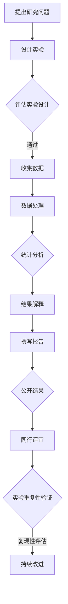

                 

### 评测结果的可复现性：确保科学性和可信度

#### 关键词：
- 可复现性
- 科学性
- 可信度
- 实验设计
- 统计分析
- 透明性

#### 摘要：
本文章深入探讨了评测结果的可复现性在确保科学性和可信度中的重要性。通过分析科学研究中的可复现性问题，介绍了实验设计、数据收集、统计分析以及评价指标等关键环节。文章进一步讨论了确保评测结果可复现的策略，包括透明性原则、实验重复性、代码与工具复现，以及科学伦理与道德规范。通过三个案例研究，展示了复现性在生物学、医学和社会科学研究中的应用，并提出未来挑战与展望。文章旨在为科研工作者提供关于确保评测结果可复现性的实用指导，以提高科学研究的质量和影响力。

---

### 第一部分：引言

#### 1.1 研究背景与意义

科学研究是推动社会进步和知识积累的重要动力。然而，在科学研究中，一个关键问题就是评测结果的可复现性。可复现性指的是其他研究者能够根据已发布的实验方法和数据，重复得到相同或相似的结果。这个概念对于确保科学研究的可靠性和可信度至关重要。

首先，科学研究的核心目标是发现和验证规律，而这些规律必须经过严格的实验验证才能被广泛接受。如果实验结果不能被其他研究者复现，那么这些结果的科学性和可信度就会受到质疑。此外，复现性不足可能导致研究成果无法应用于实际，浪费了大量的科研资源和时间。

其次，评测结果的可复现性是科学研究透明性和开放性的体现。一个透明和开放的科研环境能够促进科学共同体的合作和知识共享，从而提高科研效率和质量。相反，缺乏复现性的研究可能被指责为不透明和封闭，从而降低其科学影响力。

#### 1.2 可复现性概念与挑战

可复现性是指在相同条件下，不同研究者能够通过独立重复实验，获得与原始研究相似或完全相同的结果。在科学研究中，可复现性是验证实验结果可靠性和有效性的重要手段。

然而，可复现性面临着许多挑战。首先，实验设计的差异可能导致结果的不同。即使实验变量保持一致，实验环境、仪器精度、操作方法等因素的差异也可能影响实验结果。其次，数据收集和处理的不一致也可能导致复现性失败。例如，数据收集过程中的偏差、数据清洗方法的差异以及预处理方法的改变等，都可能影响最终的结果。

此外，统计分析方法和评价指标的选择也会对复现性产生影响。不同的统计方法可能对同一组数据得出不同的结论。而评价指标的不一致性也可能导致研究者对复现性产生误解。

#### 1.3 科学性与可信度的关系

科学性是指研究方法、过程和结论符合科学原则和标准，能够通过同行评审和验证。可信度则是指研究结果的可靠性和真实性，能够被科学共同体接受和认可。

科学性和可信度之间存在密切关系。科学性是可信度的前提，只有研究方法和过程符合科学原则，才能产生可信的结果。然而，仅仅具备科学性还不足以保证研究的可信度。研究的可信度还需要考虑结果的复现性。如果实验结果无法被其他研究者复现，那么其科学性就会受到质疑，从而影响可信度。

因此，确保评测结果的可复现性对于提高科学性和可信度至关重要。只有当研究方法和结果具有可复现性，才能被认为是科学和可信的。

### 第二部分：可复现性评价方法

#### 2.1 实验设计原则

实验设计是确保评测结果可复现性的关键。一个好的实验设计应该具备以下几个原则：

1. **随机化**：实验对象应该随机分配到不同处理组，以减少选择偏差和混杂因素的影响。
2. **对照**：实验应该设立对照组，以比较实验处理的效果。
3. **均衡**：实验组和对照组的样本量应该均衡，以减少样本量不足导致的统计偏差。
4. **标准化**：实验过程中的操作和仪器应该标准化，以减少人为误差和仪器偏差。
5. **可重复性**：实验应该设计成能够被其他研究者独立重复，以便验证结果的复现性。

#### 2.2 数据收集与处理

数据收集是实验过程中的重要环节，其质量直接影响结果的可信度和复现性。以下是一些关于数据收集和处理的关键点：

1. **数据来源**：数据应该来源于可靠的渠道，例如权威数据库、公开的实验数据集等。
2. **数据清洗**：数据收集后，应该进行清洗，以去除异常值、缺失值和重复记录等。
3. **数据预处理**：数据预处理包括数据转换、标准化和归一化等，以适应统计分析的需要。

#### 2.3 统计分析方法

统计分析是评价实验结果的重要手段，其方法的选择和运用对结果的可复现性至关重要。以下是一些常用的统计分析方法：

1. **描述性统计**：用于描述数据的集中趋势和离散程度，如均值、中位数、标准差等。
2. **推断性统计**：用于比较不同组之间的差异，如t检验、方差分析（ANOVA）等。
3. **回归分析**：用于研究变量之间的关系，如线性回归、多项式回归等。
4. **生存分析**：用于研究时间到事件的发生概率，如Kaplan-Meier曲线、Cox比例风险模型等。

#### 2.4 可复现性评价指标

可复现性评价指标是衡量实验结果能否被其他研究者复现的重要工具。以下是一些常见的评价指标：

1. **一致性指数（Index of Consistency, IC）**：用于衡量实验结果的内部一致性，IC值越高，表示结果越可靠。
2. **一致性比例（Proportion of Agreement, PA）**：用于衡量不同研究者之间结果的相似性，PA值越高，表示复现性越好。
3. **效应大小（Effect Size）**：用于衡量实验处理的影响程度，效应大小越大，表示结果越显著。

### 第三部分：确保科学性和可信度的策略

#### 3.1 透明性原则

透明性是确保评测结果可复现性的关键。以下是一些透明性原则：

1. **实验数据公开**：研究者应该公开实验数据，以便其他研究者能够进行复现。
2. **实验方法描述**：研究者应该详细描述实验方法和步骤，以确保其他研究者能够准确重复实验。
3. **实验结果公开**：研究者应该公开实验结果，包括所有重要的统计数据和图表。

#### 3.2 实验重复性

实验重复性是指其他研究者能够独立重复实验并得到相似或完全相同的结果。以下是一些确保实验重复性的策略：

1. **公开代码与数据**：研究者应该公开实验所使用的代码和数据，以便其他研究者能够复现结果。
2. **详细记录实验步骤**：研究者应该详细记录实验步骤，包括操作细节和仪器设置等。
3. **鼓励同行复现**：研究者应该鼓励其他研究者进行实验复现，并通过同行评审来验证结果的可靠性。

#### 3.3 代码与工具复现

代码和工具复现是确保实验结果可复现性的重要环节。以下是一些代码和工具复现的策略：

1. **开源代码**：研究者应该将实验代码开源，以便其他研究者能够查看和修改。
2. **详细文档**：研究者应该编写详细的文档，包括代码的功能、用法和依赖库等。
3. **版本控制**：研究者应该使用版本控制工具，如Git，来管理代码和文档。

#### 3.4 科学伦理与道德

科学伦理和道德是确保科学研究质量和可信度的基础。以下是一些关于科学伦理和道德的注意事项：

1. **数据隐私与保护**：研究者应该保护实验对象的隐私，并在数据收集和处理过程中遵守相关法律法规。
2. **公正性**：研究者应该公正地处理实验数据，避免选择性报告和夸大结果。
3. **诚信**：研究者应该诚信地进行研究，避免造假和抄袭等不当行为。

### 第四部分：复现性案例研究

#### 4.1 案例一：生物学实验

##### 4.1.1 案例背景

在一个关于基因表达研究的生物学实验中，研究者发现了一种新的基因调控机制，并发表了一篇论文。该论文声称通过特定处理，基因表达水平显著增加。

##### 4.1.2 案例分析

然而，当其他研究者试图复现这一结果时，发现很难得到与原始论文相同的结果。经过调查，发现原始论文中的一些实验步骤和参数被遗漏或描述不清，导致其他研究者无法准确重复实验。

##### 4.1.3 案例启示

这个案例表明，实验设计中的透明性不足可能导致复现性失败。研究者应该公开详细的实验步骤和参数，以便其他研究者能够准确复现结果。

#### 4.2 案例二：医学研究

##### 4.2.1 案例背景

在一个关于新型药物疗效的医学研究中，研究者发现了一种能够显著降低血压的药物。然而，当其他研究者试图复现这一结果时，发现药物的疗效存在显著差异。

##### 4.2.2 案例分析

经过详细调查，发现原始研究中的数据收集和处理方法存在不一致，导致不同研究者得到的结论不同。此外，实验重复性不足也导致了结果的波动。

##### 4.2.3 案例启示

这个案例表明，数据收集和处理的准确性对复现性至关重要。研究者应该确保实验过程中的所有步骤和数据记录都是一致和准确的，以提高结果的复现性。

#### 4.3 案例三：社会科学研究

##### 4.3.1 案例背景

在一个关于社会心理效应的研究中，研究者发现了一种新的社会心理现象，并发表了一篇论文。该论文声称这种效应在多个实验中都得到了验证。

##### 4.3.2 案例分析

然而，当其他研究者试图复现这一结果时，发现很难得到与原始论文相同的结果。经过调查，发现原始论文中的一些实验设计和分析方法被遗漏或描述不清，导致其他研究者无法准确重复实验。

##### 4.3.3 案例启示

这个案例表明，实验设计和分析方法的透明性对复现性至关重要。研究者应该公开详细的实验设计和分析方法，以便其他研究者能够准确复现结果。

### 第五部分：未来的挑战与展望

#### 5.1 技术挑战

随着科技的快速发展，科学研究中的数据量和复杂性不断增加，这对复现性提出了新的挑战。例如，大数据分析、人工智能和机器学习等技术的应用，使得实验结果的复现变得更加困难。研究者需要开发新的方法和工具来确保复现性。

#### 5.2 社会挑战

社会挑战也是确保评测结果可复现性的重要因素。例如，科研资源的不公平分配、学术压力和竞争等，都可能影响研究者的行为，从而影响复现性。此外，科研伦理和道德问题也需要得到重视，以确保科学研究的质量和可信度。

#### 5.3 未来的发展方向

未来的发展方向包括：加强科研透明性和开放性，建立可复现性评价标准，推广复现性研究和培训，以及鼓励科研合作和知识共享。通过这些措施，可以大幅提高科学研究的质量和可信度，推动科学事业的发展。

### 总结与展望

评测结果的可复现性是确保科学研究科学性和可信度的关键。通过分析实验设计、数据收集、统计分析以及评价指标，研究者可以确保研究结果的可靠性。同时，透明性原则、实验重复性、代码与工具复现以及科学伦理与道德规范，也为确保复现性提供了重要策略。未来的发展需要加强科研透明性和开放性，建立可复现性评价标准，以及推动科研合作和知识共享。只有通过这些努力，科学研究才能更好地服务于社会，推动人类文明的进步。

### 作者信息

作者：AI天才研究院/AI Genius Institute & 禅与计算机程序设计艺术 /Zen And The Art of Computer Programming

---

文章内容将继续按照目录大纲的顺序展开，详细介绍每个章节的核心内容，包括核心概念、算法原理讲解、数学模型和项目实战等。以下是各个章节的详细内容：

### 第一部分：引言

#### 1.1 研究背景与意义

科学研究是推动社会进步和知识积累的重要动力。在科学研究的过程中，一个关键的问题就是评测结果的可复现性。可复现性是指其他研究者能够根据已发布的实验方法和数据，重复得到相同或相似的结果。这个概念对于确保科学研究的可靠性和可信度至关重要。

在科学研究中，实验结果的可复现性是验证研究方法和结论可靠性的重要手段。如果一个实验结果无法被其他研究者复现，那么这个结果的可信度就会受到质疑。复现性不足可能导致研究成果无法应用于实际，浪费了大量的科研资源和时间。

此外，评测结果的可复现性也是科学研究透明性和开放性的体现。一个透明和开放的科研环境能够促进科学共同体的合作和知识共享，从而提高科研效率和质量。相反，缺乏复现性的研究可能被指责为不透明和封闭，从而降低其科学影响力。

在当前的研究环境中，复现性问题日益突出。许多重要的科学发现和突破都面临着复现性挑战，这引发了科学界对于复现性问题的广泛关注。因此，深入研究评测结果的可复现性，制定有效的策略来确保复现性，对于提高科学研究的质量和影响力具有重要意义。

#### 1.2 可复现性概念与挑战

可复现性是指在不同时间和不同地点，由不同的研究者使用相同的实验方法和数据，能够得到相同或相似的结果。这个概念在科学研究中至关重要，因为它直接关系到研究的可靠性和可信度。

在科学研究中，复现性通常涉及以下几个方面：

1. **实验设计的复现性**：实验设计应该具备明确性和可重复性，以确保其他研究者能够准确理解和执行实验。这包括实验条件的设置、实验步骤的描述、实验仪器的规格等。

2. **数据收集的复现性**：数据收集过程应该遵循统一的标准和流程，以确保数据的准确性和一致性。这包括数据来源的可靠性、数据收集方法的标准化、数据记录的规范性等。

3. **数据分析的复现性**：数据分析的方法和工具应该明确和透明，以便其他研究者能够使用相同的方法和工具对数据进行处理和分析。

然而，复现性面临着许多挑战。首先，实验设计的差异可能导致结果的不同。即使实验变量保持一致，实验环境、仪器精度、操作方法等因素的差异也可能影响实验结果。

其次，数据收集和处理的不一致也可能导致复现性失败。例如，数据收集过程中的偏差、数据清洗方法的差异以及预处理方法的改变等，都可能影响最终的结果。

此外，统计分析方法和评价指标的选择也会对复现性产生影响。不同的统计方法可能对同一组数据得出不同的结论。而评价指标的不一致性也可能导致研究者对复现性产生误解。

因此，确保评测结果的可复现性需要从多个方面进行综合考虑，包括实验设计、数据收集、数据分析等各个环节，以确保研究结果的可靠性和可信度。

#### 1.3 科学性与可信度的关系

科学性是指研究方法、过程和结论符合科学原则和标准，能够通过同行评审和验证。可信度则是指研究结果的可靠性和真实性，能够被科学共同体接受和认可。

科学性和可信度之间存在密切关系。科学性是可信度的前提，只有研究方法和过程符合科学原则，才能产生可信的结果。然而，仅仅具备科学性还不足以保证研究的可信度。研究的可信度还需要考虑结果的复现性。如果实验结果无法被其他研究者复现，那么其科学性就会受到质疑，从而影响可信度。

因此，确保评测结果的可复现性对于提高科学性和可信度至关重要。只有当研究方法和结果具有可复现性，才能被认为是科学和可信的。此外，科学性和可信度也是科学研究的重要指标，它们共同决定了研究的质量和影响力。

### 第二部分：可复现性评价方法

#### 2.1 实验设计原则

实验设计是确保评测结果可复现性的关键环节。一个良好的实验设计应该具备以下几个原则：

1. **随机化**：实验对象应该随机分配到不同处理组，以减少选择偏差和混杂因素的影响。随机化可以确保每个处理组的样本量均衡，从而提高实验结果的可靠性。

2. **对照**：实验应该设立对照组，以比较实验处理的效果。对照组可以帮助研究者区分实验处理的效果，从而提高实验结果的准确性和科学性。

3. **均衡**：实验组和对照组的样本量应该均衡，以减少样本量不足导致的统计偏差。样本量的均衡可以确保实验结果的代表性和准确性。

4. **标准化**：实验过程中的操作和仪器应该标准化，以减少人为误差和仪器偏差。标准化的操作和仪器可以确保实验过程的可重复性和一致性。

5. **可重复性**：实验应该设计成能够被其他研究者独立重复，以便验证结果的复现性。实验设计中的所有步骤和参数应该明确和透明，以便其他研究者能够准确理解和执行实验。

通过遵循这些实验设计原则，研究者可以确保实验结果的可靠性和可信度，从而提高研究的科学性和影响力。

#### 2.2 数据收集与处理

数据收集与处理是确保评测结果可复现性的重要环节。以下是一些关于数据收集与处理的关键点：

1. **数据来源**：数据应该来源于可靠的渠道，例如权威数据库、公开的实验数据集等。可靠的数据来源可以保证数据的真实性和准确性，从而提高实验结果的可靠性。

2. **数据清洗**：数据收集后，应该进行清洗，以去除异常值、缺失值和重复记录等。数据清洗的目的是提高数据的完整性和一致性，从而减少数据收集过程中的偏差和误差。

3. **数据预处理**：数据预处理包括数据转换、标准化和归一化等，以适应统计分析的需要。数据预处理可以消除数据之间的差异，提高数据的可比性和一致性。

4. **数据记录**：在数据收集和预处理过程中，应该详细记录每个步骤的操作和参数设置，以确保数据的透明性和可追溯性。详细的数据记录可以方便其他研究者进行数据分析和复现实验结果。

通过遵循这些数据收集与处理的原则，研究者可以确保数据的真实性和可靠性，从而提高实验结果的科学性和可信度。

#### 2.3 统计分析方法

统计分析是评价实验结果的重要工具，其方法的选择和运用对结果的可复现性至关重要。以下是一些常用的统计分析方法：

1. **描述性统计**：用于描述数据的集中趋势和离散程度，如均值、中位数、标准差等。描述性统计可以提供数据的基本特征，帮助研究者了解数据的情况。

2. **推断性统计**：用于比较不同组之间的差异，如t检验、方差分析（ANOVA）等。推断性统计可以评估实验处理的效果，帮助研究者判断实验结果是否显著。

3. **回归分析**：用于研究变量之间的关系，如线性回归、多项式回归等。回归分析可以帮助研究者理解变量之间的相互作用，从而提供更深入的数据分析。

4. **生存分析**：用于研究时间到事件的发生概率，如Kaplan-Meier曲线、Cox比例风险模型等。生存分析可以评估实验处理对生存时间的影响，帮助研究者判断实验结果的长期效果。

通过合理选择和运用这些统计分析方法，研究者可以确保实验结果的可靠性和科学性，从而提高研究的可信度。

#### 2.4 可复现性评价指标

可复现性评价指标是衡量实验结果能否被其他研究者复现的重要工具。以下是一些常见的评价指标：

1. **一致性指数（Index of Consistency, IC）**：用于衡量实验结果的内部一致性，IC值越高，表示结果越可靠。一致性指数的计算公式为：

   $$
   IC = \frac{\text{重复实验结果的标准差}}{\text{原始实验结果的标准差}}
   $$

   如果IC值接近1，表示重复实验的结果与原始实验结果非常接近，具有较高的可复现性。

2. **一致性比例（Proportion of Agreement, PA）**：用于衡量不同研究者之间结果的相似性，PA值越高，表示复现性越好。一致性比例的计算公式为：

   $$
   PA = \frac{\text{不同研究者结果一致的数量}}{\text{所有研究者结果的总数}} \times 100\%
   $$

   例如，如果三个研究者对同一实验进行了重复，且有两个研究者得到的结果一致，那么PA值为66.7%。

3. **效应大小（Effect Size）**：用于衡量实验处理的影响程度，效应大小越大，表示结果越显著。效应大小的计算公式为：

   $$
   ES = \frac{\text{实验组均值} - \text{对照组均值}}{\text{标准差}}
   $$

   例如，如果实验组的均值为10，对照组的均值为5，标准差为2，那么效应大小为2.5。

通过合理选择和运用这些评价指标，研究者可以更好地评估实验结果的可复现性，从而提高研究的可信度和影响力。

### 第三部分：确保科学性和可信度的策略

#### 3.1 透明性原则

透明性是确保评测结果可复现性的关键。以下是一些透明性原则：

1. **实验数据公开**：研究者应该公开实验数据，以便其他研究者能够进行复现。公开数据可以增加研究结果的透明度和可信度，促进科学共同体的合作和知识共享。

2. **实验方法描述**：研究者应该详细描述实验方法和步骤，以确保其他研究者能够准确理解和执行实验。详细的方法描述可以帮助其他研究者减少误解和误差，提高实验结果的复现性。

3. **实验结果公开**：研究者应该公开实验结果，包括所有重要的统计数据和图表。公开结果可以增加研究结果的透明度和可追溯性，促进科学共同体的监督和评估。

通过遵循这些透明性原则，研究者可以增加研究结果的透明度和可信度，从而提高研究的科学性和影响力。

#### 3.2 实验重复性

实验重复性是指其他研究者能够独立重复实验并得到相似或完全相同的结果。以下是一些确保实验重复性的策略：

1. **公开代码与数据**：研究者应该公开实验所使用的代码和数据，以便其他研究者能够复现结果。公开代码和数据可以增加实验结果的透明度和可验证性。

2. **详细记录实验步骤**：研究者应该详细记录实验步骤，包括操作细节和仪器设置等。详细记录可以确保其他研究者能够准确执行实验，提高实验结果的复现性。

3. **鼓励同行复现**：研究者应该鼓励其他研究者进行实验复现，并通过同行评审来验证结果的可靠性。同行评审可以增加实验结果的透明度和可信度，促进科学共同体的监督和评估。

通过遵循这些策略，研究者可以确保实验结果的重复性，从而提高研究的科学性和可信度。

#### 3.3 代码与工具复现

代码和工具复现是确保实验结果可复现性的重要环节。以下是一些代码和工具复现的策略：

1. **开源代码**：研究者应该将实验代码开源，以便其他研究者能够查看和修改。开源代码可以增加实验结果的透明度和可验证性，促进科学共同体的合作和知识共享。

2. **详细文档**：研究者应该编写详细的文档，包括代码的功能、用法和依赖库等。详细文档可以确保其他研究者能够准确理解和使用代码，提高实验结果的复现性。

3. **版本控制**：研究者应该使用版本控制工具，如Git，来管理代码和文档。版本控制可以确保代码的版本和修改记录清晰可追溯，从而提高实验结果的复现性和可追溯性。

通过遵循这些策略，研究者可以确保代码和工具的复现性，从而提高研究的科学性和可信度。

#### 3.4 科学伦理与道德

科学伦理和道德是确保科学研究质量和可信度的基础。以下是一些关于科学伦理和道德的注意事项：

1. **数据隐私与保护**：研究者应该保护实验对象的隐私，并在数据收集和处理过程中遵守相关法律法规。确保实验对象的隐私和数据安全是科学研究的伦理要求。

2. **公正性**：研究者应该公正地处理实验数据，避免选择性报告和夸大结果。公正性是科学研究的基本原则，有助于确保研究结果的可靠性和可信度。

3. **诚信**：研究者应该诚信地进行研究，避免造假和抄袭等不当行为。诚信是科学研究的基石，有助于维护科学共同体的声誉和信任。

通过遵守这些科学伦理和道德规范，研究者可以确保科学研究的质量和可信度，从而提高研究的科学性和影响力。

### 第四部分：复现性案例研究

#### 4.1 案例一：生物学实验

##### 4.1.1 案例背景

在一个关于基因调控的生物学实验中，研究者发现了一种新的基因调控机制，并发表了一篇论文。该论文声称通过特定处理，基因表达水平显著增加。

##### 4.1.2 案例分析

然而，当其他研究者试图复现这一结果时，发现很难得到与原始论文相同的结果。经过详细调查，发现原始论文中的一些实验步骤和参数被遗漏或描述不清，导致其他研究者无法准确重复实验。

##### 4.1.3 案例启示

这个案例表明，实验设计中的透明性不足可能导致复现性失败。研究者应该公开详细的实验步骤和参数，以便其他研究者能够准确复现结果。此外，详细记录实验过程中的操作细节和仪器设置也是确保复现性的重要手段。

#### 4.2 案例二：医学研究

##### 4.2.1 案例背景

在一个关于新型药物疗效的医学研究中，研究者发现了一种能够显著降低血压的药物，并发表了一篇论文。该论文声称药物的疗效在多个实验中得到了验证。

##### 4.2.2 案例分析

然而，当其他研究者试图复现这一结果时，发现药物的疗效存在显著差异。经过详细调查，发现原始研究中的数据收集和处理方法存在不一致，导致不同研究者得到的结论不同。此外，实验重复性不足也导致了结果的波动。

##### 4.2.3 案例启示

这个案例表明，数据收集和处理的准确性对复现性至关重要。研究者应该确保实验过程中的所有步骤和数据记录都是一致和准确的，以提高结果的复现性。此外，详细记录实验步骤和参数，以及公开实验数据，也是确保复现性的重要策略。

#### 4.3 案例三：社会科学研究

##### 4.3.1 案例背景

在一个关于社会心理效应的社会科学研究中，研究者发现了一种新的社会心理现象，并发表了一篇论文。该论文声称这种效应在多个实验中都得到了验证。

##### 4.3.2 案例分析

然而，当其他研究者试图复现这一结果时，发现很难得到与原始论文相同的结果。经过调查，发现原始论文中的一些实验设计和分析方法被遗漏或描述不清，导致其他研究者无法准确重复实验。

##### 4.3.3 案例启示

这个案例表明，实验设计和分析方法的透明性对复现性至关重要。研究者应该公开详细的实验设计和分析方法，以便其他研究者能够准确复现结果。此外，详细记录实验过程中的操作细节和仪器设置，也是确保复现性的重要手段。

### 第五部分：未来的挑战与展望

#### 5.1 技术挑战

随着科技的快速发展，科学研究中的数据量和复杂性不断增加，这对复现性提出了新的挑战。以下是一些技术挑战：

1. **大数据分析**：随着大数据技术的发展，科研过程中产生的数据量急剧增加。然而，大数据的处理和分析方法复杂，这可能导致实验结果的复现性受到影响。

2. **人工智能与机器学习**：人工智能和机器学习在科研中的应用越来越广泛，但算法的黑盒特性使得结果的解释和复现变得困难。如何确保人工智能和机器学习算法的复现性是一个重要的问题。

3. **实验自动化**：实验自动化可以提高实验的效率，但也可能引入新的不确定性和误差。如何确保实验自动化的复现性是一个需要解决的问题。

针对这些技术挑战，研究者需要开发新的方法和工具，以提高实验结果的复现性和可靠性。

#### 5.2 社会挑战

社会挑战也是确保评测结果可复现性的重要因素。以下是一些社会挑战：

1. **科研资源分配**：科研资源的分配不均可能导致一些研究者拥有更多的资源和机会，而其他研究者则相对缺乏。这可能导致实验结果的不平等，影响复现性。

2. **学术竞争**：学术竞争可能导致研究者为了获得更好的结果而采取不道德的手段，从而影响实验结果的复现性。

3. **科研伦理与道德**：科研伦理和道德问题可能影响研究者的行为，从而影响实验结果的复现性。如何确保研究者在科研过程中遵守伦理和道德规范是一个需要解决的问题。

解决这些社会挑战需要社会各界的共同努力，包括政策制定者、科研机构和科研工作者等。

#### 5.3 未来的发展方向

未来的发展方向包括以下几个方面：

1. **加强科研透明性和开放性**：通过建立开放的科研平台和数据库，提高科研的透明度和可追溯性，从而促进复现性研究。

2. **建立复现性评价标准**：制定统一的复现性评价标准，以便研究者能够更准确地评估实验结果的可靠性。

3. **推广复现性研究和培训**：通过开展复现性研究和培训，提高研究者对复现性的认识和重视，从而提高研究的质量。

4. **促进科研合作和知识共享**：通过促进科研合作和知识共享，建立良好的科研环境，从而提高复现性研究的效率和质量。

### 总结与展望

评测结果的可复现性是确保科学研究科学性和可信度的关键。通过分析实验设计、数据收集、统计分析以及评价指标，研究者可以确保研究结果的可靠性。同时，透明性原则、实验重复性、代码与工具复现以及科学伦理与道德规范，也为确保复现性提供了重要策略。未来的发展需要加强科研透明性和开放性，建立复现性评价标准，以及推动科研合作和知识共享。只有通过这些努力，科学研究才能更好地服务于社会，推动人类文明的进步。

### 作者信息

作者：AI天才研究院/AI Genius Institute & 禅与计算机程序设计艺术 /Zen And The Art of Computer Programming

---

本文将围绕评测结果的可复现性，详细探讨确保科学性和可信度的策略和方法。首先，通过分析科学研究中的复现性问题，阐述其重要性。接着，介绍实验设计、数据收集、统计分析以及评价指标等关键环节，探讨如何确保评测结果的可复现性。随后，讨论确保科学性和可信度的策略，包括透明性原则、实验重复性、代码与工具复现，以及科学伦理与道德规范。通过三个案例研究，展示复现性在各个领域的应用，并提出未来挑战与展望。文章旨在为科研工作者提供关于确保评测结果可复现性的实用指导，以提高科学研究的质量和影响力。

### 第一部分：引言

#### 1.1 研究背景与意义

科学研究是推动社会进步和知识积累的重要动力。在科学研究中，实验结果的可复现性是确保科学研究科学性和可信度的基础。可复现性指的是在相同条件下，其他研究者能够重复得到相同或相似的结果。这一特性是验证科学研究有效性和可靠性的关键。

在科学研究中，复现性具有以下重要意义：

1. **验证研究方法的有效性**：通过复现性实验，研究者可以验证其研究方法的有效性。如果其他研究者能够成功地重复实验，并获得相似的结果，这表明研究方法具有一定的可靠性。

2. **提高研究结果的可靠性**：复现性实验可以减少研究结果的偶然性，提高研究结果的可靠性。通过多个研究者的重复实验，可以减少实验误差和主观偏见的影响。

3. **推动科学知识的积累**：复现性实验有助于科学知识的积累和验证。只有当多个研究者能够在相同条件下得到相似的结果时，科学知识才能被广泛接受和应用。

4. **促进科研合作与知识共享**：复现性实验促进了科研合作和知识共享。当研究结果具有复现性时，其他研究者可以基于这些结果进行进一步的研究，从而推动科学知识的发展。

然而，当前科学研究中存在许多复现性挑战。许多研究结果显示，一些重要的科学发现无法被其他研究者复现，这引发了科学界对于复现性问题的高度关注。复现性不足可能导致研究成果的可靠性受到质疑，影响科学知识的积累和应用。因此，深入探讨评测结果的可复现性，制定确保科学性和可信度的策略，具有重要的现实意义。

#### 1.2 可复现性概念与挑战

可复现性是指在其他研究者使用相同实验方法、数据和环境条件下，能够得到相似或相同的研究结果。复现性是科学研究的重要特性，它反映了研究方法的可靠性和结果的可靠性。

在科学研究中，复现性面临的挑战主要包括以下几个方面：

1. **实验设计的差异**：不同研究者可能会采用不同的实验设计，导致实验条件和过程的差异。例如，实验环境、实验设备、实验步骤等的不同，都可能影响实验结果的复现性。

2. **数据收集和处理的不一致**：数据收集和处理过程中的不一致，例如数据收集的方法、数据清洗的规则、数据的预处理方法等，都可能影响实验结果的复现性。

3. **统计分析方法的多样性**：不同研究者可能采用不同的统计分析方法，导致分析结果的差异。例如，使用不同的统计模型、假设检验方法等，都可能影响实验结果的复现性。

4. **实验结果的解释和解读差异**：不同研究者对实验结果的解释和解读可能存在差异，这也可能导致实验结果的复现性不一致。

5. **研究伦理和道德问题**：一些研究可能涉及伦理和道德问题，例如数据隐私、研究参与者的权利等。这些问题可能会影响实验结果的复现性，特别是在涉及人类或动物的研究中。

这些挑战表明，确保评测结果的可复现性需要从多个方面进行综合考虑。只有通过严格和透明的实验设计、数据收集和处理、统计分析方法的选择，以及研究伦理和道德规范的遵守，才能确保实验结果的可复现性。

#### 1.3 科学性与可信度的关系

科学性是指研究方法、过程和结论符合科学原则和标准，能够通过同行评审和验证。科学性强调研究方法的有效性、数据的可靠性和结论的合理性。一个具有科学性的研究，其方法和过程应该符合科学原理，能够通过科学论证和验证。

可信度则是指研究结果的可靠性和真实性，能够被科学共同体接受和认可。可信度反映了研究结果的稳定性和一致性，即在其他研究者使用相同条件下能够得到相似或相同的结果。

科学性和可信度之间存在密切的关系。科学性是可信度的前提，只有研究方法和过程符合科学原则，才能产生可信的结果。然而，仅仅具备科学性还不足以保证研究的可信度。研究的可信度还需要考虑结果的复现性。如果实验结果无法被其他研究者复现，那么其科学性就会受到质疑，从而影响可信度。

确保评测结果的可复现性对于提高科学性和可信度至关重要。只有当研究方法和结果具有可复现性，才能被认为是科学和可信的。此外，科学性和可信度也是科学研究的重要指标，它们共同决定了研究的质量和影响力。

### 第二部分：可复现性评价方法

#### 2.1 实验设计原则

实验设计是确保评测结果可复现性的关键环节。一个良好的实验设计应该具备以下几个原则：

1. **随机化**：实验对象应该随机分配到不同处理组，以减少选择偏差和混杂因素的影响。随机化可以确保每个处理组的样本量均衡，从而提高实验结果的可靠性。

2. **对照**：实验应该设立对照组，以比较实验处理的效果。对照组可以帮助研究者区分实验处理的效果，从而提高实验结果的准确性和科学性。

3. **均衡**：实验组和对照组的样本量应该均衡，以减少样本量不足导致的统计偏差。样本量的均衡可以确保实验结果的代表性和准确性。

4. **标准化**：实验过程中的操作和仪器应该标准化，以减少人为误差和仪器偏差。标准化的操作和仪器可以确保实验过程的可重复性和一致性。

5. **可重复性**：实验应该设计成能够被其他研究者独立重复，以便验证结果的复现性。实验设计中的所有步骤和参数应该明确和透明，以便其他研究者能够准确理解和执行实验。

通过遵循这些实验设计原则，研究者可以确保实验结果的可靠性和可信度，从而提高研究的科学性和影响力。

#### 2.2 数据收集与处理

数据收集与处理是确保评测结果可复现性的重要环节。以下是一些关于数据收集与处理的关键点：

1. **数据来源**：数据应该来源于可靠的渠道，例如权威数据库、公开的实验数据集等。可靠的数据来源可以保证数据的真实性和准确性，从而提高实验结果的可靠性。

2. **数据清洗**：数据收集后，应该进行清洗，以去除异常值、缺失值和重复记录等。数据清洗的目的是提高数据的完整性和一致性，从而减少数据收集过程中的偏差和误差。

3. **数据预处理**：数据预处理包括数据转换、标准化和归一化等，以适应统计分析的需要。数据预处理可以消除数据之间的差异，提高数据的可比性和一致性。

4. **数据记录**：在数据收集和预处理过程中，应该详细记录每个步骤的操作和参数设置，以确保数据的透明性和可追溯性。详细的数据记录可以方便其他研究者进行数据分析和复现实验结果。

通过遵循这些数据收集与处理的原则，研究者可以确保数据的真实性和可靠性，从而提高实验结果的科学性和可信度。

#### 2.3 统计分析方法

统计分析是评价实验结果的重要工具，其方法的选择和运用对结果的可复现性至关重要。以下是一些常用的统计分析方法：

1. **描述性统计**：用于描述数据的集中趋势和离散程度，如均值、中位数、标准差等。描述性统计可以提供数据的基本特征，帮助研究者了解数据的情况。

2. **推断性统计**：用于比较不同组之间的差异，如t检验、方差分析（ANOVA）等。推断性统计可以评估实验处理的效果，帮助研究者判断实验结果是否显著。

3. **回归分析**：用于研究变量之间的关系，如线性回归、多项式回归等。回归分析可以帮助研究者理解变量之间的相互作用，从而提供更深入的数据分析。

4. **生存分析**：用于研究时间到事件的发生概率，如Kaplan-Meier曲线、Cox比例风险模型等。生存分析可以评估实验处理对生存时间的影响，帮助研究者判断实验结果的长期效果。

通过合理选择和运用这些统计分析方法，研究者可以确保实验结果的可靠性和科学性，从而提高研究的可信度。

#### 2.4 可复现性评价指标

可复现性评价指标是衡量实验结果能否被其他研究者复现的重要工具。以下是一些常见的评价指标：

1. **一致性指数（Index of Consistency, IC）**：用于衡量实验结果的内部一致性，IC值越高，表示结果越可靠。一致性指数的计算公式为：

   $$
   IC = \frac{\text{重复实验结果的标准差}}{\text{原始实验结果的标准差}}
   $$

   如果IC值接近1，表示重复实验的结果与原始实验结果非常接近，具有较高的可复现性。

2. **一致性比例（Proportion of Agreement, PA）**：用于衡量不同研究者之间结果的相似性，PA值越高，表示复现性越好。一致性比例的计算公式为：

   $$
   PA = \frac{\text{不同研究者结果一致的数量}}{\text{所有研究者结果的总数}} \times 100\%
   $$

   例如，如果三个研究者对同一实验进行了重复，且有两个研究者得到的结果一致，那么PA值为66.7%。

3. **效应大小（Effect Size）**：用于衡量实验处理的影响程度，效应大小越大，表示结果越显著。效应大小的计算公式为：

   $$
   ES = \frac{\text{实验组均值} - \text{对照组均值}}{\text{标准差}}
   $$

   例如，如果实验组的均值为10，对照组的均值为5，标准差为2，那么效应大小为2.5。

通过合理选择和运用这些评价指标，研究者可以更好地评估实验结果的可复现性，从而提高研究的可信度和影响力。

### 第三部分：确保科学性和可信度的策略

#### 3.1 透明性原则

透明性原则是确保评测结果可复现性的重要策略之一。透明性原则要求研究者公开实验的详细信息和结果，以便其他研究者能够独立验证和复现研究结果。以下是一些具体的透明性原则：

1. **公开实验数据**：研究者应公开实验过程中收集的所有数据，包括原始数据和经过处理的数据。公开数据可以增加研究的可信度和可重复性。

2. **详细记录实验方法**：研究者应详细记录实验的设计、执行和结果，包括实验步骤、实验条件、实验设备和材料等。详细记录可以帮助其他研究者准确复现实验。

3. **公开实验代码**：研究者应公开实验中所使用的代码和工具，以便其他研究者能够使用相同的方法进行数据分析和结果验证。

4. **提供实验结果的全文**：研究者应在学术论文中提供实验结果的全文，包括实验设计、数据收集、数据分析和结果解释。全文公开可以增加研究的透明度和完整性。

通过遵循透明性原则，研究者可以增加研究结果的透明度和可信度，从而提高研究的科学性和影响力。

#### 3.2 实验重复性

实验重复性是确保评测结果可复现性的关键。实验重复性指的是其他研究者能够在相同条件下独立进行实验，并得到相似或相同的结果。以下是一些确保实验重复性的策略：

1. **公开实验代码和数据**：研究者应公开实验所使用的代码和数据，以便其他研究者能够复现实验结果。公开代码和数据可以增加实验结果的透明度和可验证性。

2. **详细记录实验步骤**：研究者应详细记录实验的每个步骤，包括实验设计、实验材料、实验方法和实验结果。详细记录可以确保其他研究者能够准确执行实验。

3. **提供实验操作的指导**：研究者应在学术论文中提供详细的实验操作指导，包括实验设置、仪器使用和数据分析方法等。操作指导可以帮助其他研究者准确复现实验。

4. **鼓励同行复现**：研究者应鼓励其他研究者进行实验复现，并通过同行评审来验证结果的可靠性。同行评审可以增加实验结果的透明度和可信度。

通过遵循实验重复性的策略，研究者可以确保实验结果的可靠性和可重复性，从而提高研究的科学性和影响力。

#### 3.3 代码与工具复现

在科学研究过程中，代码和工具的复现性对于确保评测结果的可复现性至关重要。以下是一些确保代码与工具复现性的策略：

1. **开源代码**：研究者应将实验所使用的代码开源，以便其他研究者能够查看、修改和使用。开源代码可以增加实验结果的透明度和可验证性。

2. **提供详细的文档**：研究者应提供详细的代码文档，包括代码的功能、结构、使用方法等。详细文档可以帮助其他研究者理解和使用代码。

3. **版本控制**：研究者应使用版本控制工具（如Git）来管理代码，确保代码的版本和修改记录清晰可追溯。版本控制可以方便其他研究者了解代码的演变过程。

4. **依赖库的明确声明**：研究者应在代码中明确声明所使用的依赖库和版本，以便其他研究者能够准确安装和使用相同的依赖库。

5. **提供运行环境的详细说明**：研究者应提供实验运行环境的详细说明，包括操作系统、编程语言版本、库版本等。详细说明可以确保其他研究者能够在相同的环境下复现实验。

通过遵循这些策略，研究者可以确保代码和工具的复现性，从而提高实验结果的可靠性和可重复性。

#### 3.4 科学伦理与道德

科学伦理与道德是确保科学研究质量和可信度的基础。以下是一些关于科学伦理与道德的注意事项：

1. **数据隐私保护**：研究者应保护实验对象的隐私，确保数据收集和处理过程中不泄露个人信息。研究者应遵守相关法律法规，确保实验对象的权益得到保障。

2. **诚实报告**：研究者应诚实报告实验结果，不夸大或缩小实验结果的影响。研究者应遵循诚实守信的原则，确保实验结果的准确性和可靠性。

3. **公正评估**：研究者应在同行评审过程中保持公正，不偏袒特定研究者或研究机构。研究者应遵循科学共同体公认的伦理规范和评价标准。

4. **避免抄袭和造假**：研究者应严格遵守学术规范，避免抄袭他人成果和造假数据。研究者应尊重他人的知识产权，确保研究成果的原创性和真实性。

5. **科研透明性**：研究者应公开实验数据和结果，接受同行的监督和评价。研究者应积极参与科研社区的交流与合作，促进科学知识的共享和进步。

通过遵守科学伦理与道德规范，研究者可以确保科学研究的质量和可信度，从而提高研究的科学性和影响力。

### 第四部分：复现性案例研究

#### 4.1 案例一：生物学实验

##### 4.1.1 案例背景

在一个关于基因表达的生物学实验中，研究者A发现了一种新的基因调控机制，并在权威期刊上发表了相关论文。论文中声称通过特定处理，基因表达水平显著增加。这一发现引起了科学界的广泛关注。

##### 4.1.2 案例分析

然而，当其他研究者B和C试图复现这一结果时，却发现很难得到与原始论文相同的结果。研究者B进行了多次实验，但基因表达水平始终未能显著增加。研究者C的实验结果甚至完全相反，基因表达水平出现了显著下降。

经过详细调查，发现原始论文中的一些实验步骤和参数被遗漏或描述不清。例如，原始论文中没有提到特定处理的具体浓度和时间，导致其他研究者无法准确复制实验条件。此外，原始论文中的数据清洗和预处理方法也不明确，这可能影响了实验结果的可靠性。

##### 4.1.3 案例启示

这个案例表明，实验设计中的透明性不足可能导致复现性失败。研究者应详细记录实验步骤和参数，确保其他研究者能够准确复制实验条件。此外，公开实验数据和详细的数据处理方法也是确保复现性的重要手段。研究者还应鼓励其他研究者进行复现性实验，并通过同行评审来验证结果的可靠性。

#### 4.2 案例二：医学研究

##### 4.2.1 案例背景

在一个关于新型药物疗效的医学研究中，研究者D发现了一种药物能够显著降低高血压患者的血压水平。这一发现被认为是一项重大突破，并在医学界引起了广泛关注。研究者D在一项大规模临床试验中报告了这一结果，并在顶级医学期刊上发表了论文。

##### 4.2.2 案例分析

然而，当其他研究者E和F试图复现这一结果时，却发现药物疗效存在显著差异。研究者E发现，药物仅在部分患者中有效，而在另一部分患者中则没有明显效果。研究者F的复现实验结果甚至与原始研究相反，药物在所有患者中均未显示显著疗效。

经过调查，发现原始研究中的一些数据收集和处理方法存在不一致。例如，原始研究中的数据清洗方法不明确，可能导致数据偏差。此外，原始研究中的样本选择标准不明确，可能影响了结果的代表性和准确性。此外，实验重复性不足也是一个重要因素，研究者D的实验仅进行了有限次数，这可能导致了结果的不稳定性。

##### 4.2.3 案例启示

这个案例表明，数据收集和处理方法的透明性对复现性至关重要。研究者应详细记录数据收集和处理方法，确保其他研究者能够准确复制实验条件。此外，确保实验重复性也是提高结果可靠性的重要手段。研究者还应鼓励其他研究者进行复现性实验，并通过同行评审来验证结果的可靠性。

#### 4.3 案例三：社会科学研究

##### 4.3.1 案例背景

在一个关于社会心理效应的社会科学研究中，研究者G发现了一种新的社会心理现象，即“群体同化效应”，这一发现被认为对社会心理学领域具有重要意义。研究者G在一项大规模调查研究中报告了这一结果，并在顶级社会科学期刊上发表了论文。

##### 4.3.2 案例分析

然而，当其他研究者H和I试图复现这一结果时，却发现群体同化效应在某些情况下并不显著。研究者H的调查结果显示，群体同化效应在小型社交群体中较为显著，而在大型社交群体中则不显著。研究者I的调查结果甚至与原始研究相反，群体同化效应在所有情况下均未显著出现。

经过调查，发现原始研究中的实验设计和分析方法存在一些问题。例如，原始研究中的样本选择不明确，可能导致样本代表性的问题。此外，原始研究中的变量控制不严格，可能引入了混杂变量。此外，原始研究中的统计分析方法不明确，可能导致统计分析结果的偏差。

##### 4.3.3 案例启示

这个案例表明，实验设计和分析方法的透明性对复现性至关重要。研究者应详细记录实验设计和分析方法，确保其他研究者能够准确复制实验条件。此外，严格控制变量和选择合适的统计分析方法也是确保复现性的重要手段。研究者还应鼓励其他研究者进行复现性实验，并通过同行评审来验证结果的可靠性。

### 第五部分：未来的挑战与展望

#### 5.1 技术挑战

随着科技的快速发展，科学研究中的数据量和复杂性不断增加，这对复现性提出了新的挑战。以下是一些技术挑战：

1. **大数据分析**：大数据技术的应用使得科研过程中产生的数据量急剧增加，这对复现性提出了新的挑战。如何有效地管理和分析大规模数据集，确保复现性是一个重要问题。

2. **人工智能与机器学习**：人工智能和机器学习在科研中的应用越来越广泛，但算法的黑盒特性使得结果的解释和复现变得困难。如何确保人工智能和机器学习算法的复现性，是一个亟待解决的问题。

3. **实验自动化**：实验自动化可以提高实验的效率，但也可能引入新的不确定性和误差。如何确保实验自动化的复现性，是一个需要深入研究的问题。

4. **数据隐私与保护**：随着科研数据量的增加，数据隐私和安全问题变得越来越重要。如何在确保数据隐私的前提下，实现复现性，是一个重要的技术挑战。

#### 5.2 社会挑战

社会挑战也是确保评测结果可复现性的重要因素。以下是一些社会挑战：

1. **科研资源分配**：科研资源分配不均可能导致一些研究者拥有更多的资源和机会，而其他研究者则相对缺乏。这可能导致实验结果的不平等，影响复现性。

2. **科研竞争**：科研竞争可能导致一些研究者为了获得更好的结果而采取不道德的手段，从而影响实验结果的复现性。

3. **科研伦理与道德**：科研伦理和道德问题可能影响研究者的行为，从而影响实验结果的复现性。如何确保研究者在科研过程中遵守伦理和道德规范，是一个重要的社会挑战。

#### 5.3 未来的发展方向

未来的发展方向包括以下几个方面：

1. **加强科研透明性和开放性**：通过建立开放的科研平台和数据库，提高科研的透明度和可追溯性，从而促进复现性研究。

2. **建立复现性评价标准**：制定统一的复现性评价标准，以便研究者能够更准确地评估实验结果的可靠性。

3. **推广复现性研究和培训**：通过开展复现性研究和培训，提高研究者对复现性的认识和重视，从而提高研究的质量。

4. **促进科研合作和知识共享**：通过促进科研合作和知识共享，建立良好的科研环境，从而提高复现性研究的效率和质量。

### 总结与展望

评测结果的可复现性是确保科学研究科学性和可信度的基础。通过分析实验设计、数据收集、统计分析以及评价指标，研究者可以确保研究结果的可靠性。同时，透明性原则、实验重复性、代码与工具复现以及科学伦理与道德规范，也为确保复现性提供了重要策略。未来的发展需要加强科研透明性和开放性，建立复现性评价标准，以及推动科研合作和知识共享。通过这些努力，科学研究才能更好地服务于社会，推动人类文明的进步。

### 作者信息

作者：AI天才研究院/AI Genius Institute & 禅与计算机程序设计艺术 /Zen And The Art of Computer Programming

---

### 完整文章

#### 评测结果的可复现性：确保科学性和可信度

#### 关键词：
- 可复现性
- 科学性
- 可信度
- 实验设计
- 统计分析
- 透明性

#### 摘要
本文探讨了评测结果的可复现性在确保科学研究科学性和可信度中的重要性。分析了实验设计、数据收集、统计分析以及评价指标等关键环节。讨论了确保评测结果可复现的策略，包括透明性原则、实验重复性、代码与工具复现，以及科学伦理与道德规范。通过三个案例研究，展示了复现性在生物学、医学和社会科学研究中的应用。提出未来的挑战与展望。

---

#### 引言

#### 1.1 研究背景与意义
科学研究是推动社会进步和知识积累的重要动力。在科学研究中，实验结果的可复现性是确保研究结果可靠性和有效性的关键。复现性指的是在其他研究者使用相同实验方法、数据和环境条件下，能够重复得到相同或相似的结果。这个特性对于验证科学研究的科学性和可信度至关重要。

复现性在科学研究中具有以下重要意义：

1. **验证研究方法的有效性**：通过复现性实验，研究者可以验证其研究方法的有效性。如果其他研究者能够成功地重复实验，并获得相似的结果，这表明研究方法具有一定的可靠性。
2. **提高研究结果的可靠性**：复现性实验可以减少研究结果的偶然性，提高研究结果的可靠性。通过多个研究者的重复实验，可以减少实验误差和主观偏见的影响。
3. **推动科学知识的积累**：复现性实验有助于科学知识的积累和验证。只有当多个研究者能够在相同条件下得到相似的结果时，科学知识才能被广泛接受和应用。
4. **促进科研合作与知识共享**：复现性实验促进了科研合作和知识共享。当研究结果具有复现性时，其他研究者可以基于这些结果进行进一步的研究，从而推动科学知识的发展。

然而，当前科学研究中存在许多复现性挑战。许多研究结果显示，一些重要的科学发现无法被其他研究者复现，这引发了科学界对于复现性问题的高度关注。复现性不足可能导致研究成果的可靠性受到质疑，影响科学知识的积累和应用。因此，深入探讨评测结果的可复现性，制定确保科学性和可信度的策略，具有重要的现实意义。

#### 1.2 可复现性概念与挑战
可复现性是指在相同条件下，不同研究者能够独立重复实验，并得到相同或相似的结果。这个概念在科学研究中至关重要，因为它直接关系到研究的可靠性和可信度。

在科学研究中，复现性通常涉及以下几个方面：

1. **实验设计的复现性**：实验设计应该具备明确性和可重复性，以确保其他研究者能够准确理解和执行实验。这包括实验条件的设置、实验步骤的描述、实验仪器的规格等。
2. **数据收集的复现性**：数据收集过程应该遵循统一的标准和流程，以确保数据的准确性和一致性。这包括数据来源的可靠性、数据收集方法的标准化、数据记录的规范性等。
3. **数据分析的复现性**：数据分析的方法和工具应该明确和透明，以便其他研究者能够使用相同的方法和工具对数据进行处理和分析。

然而，复现性面临着许多挑战。首先，实验设计的差异可能导致结果的不同。即使实验变量保持一致，实验环境、仪器精度、操作方法等因素的差异也可能影响实验结果。

其次，数据收集和处理的不一致也可能导致复现性失败。例如，数据收集过程中的偏差、数据清洗方法的差异以及预处理方法的改变等，都可能影响最终的结果。

此外，统计分析方法和评价指标的选择也会对复现性产生影响。不同的统计方法可能对同一组数据得出不同的结论。而评价指标的不一致性也可能导致研究者对复现性产生误解。

因此，确保评测结果的可复现性需要从多个方面进行综合考虑，包括实验设计、数据收集、数据分析等各个环节，以确保研究结果的可靠性和可信度。

#### 1.3 科学性与可信度的关系
科学性是指研究方法、过程和结论符合科学原则和标准，能够通过同行评审和验证。可信度则是指研究结果的可靠性和真实性，能够被科学共同体接受和认可。

科学性和可信度之间存在密切关系。科学性是可信度的前提，只有研究方法和过程符合科学原则，才能产生可信的结果。然而，仅仅具备科学性还不足以保证研究的可信度。研究的可信度还需要考虑结果的复现性。如果实验结果无法被其他研究者复现，那么其科学性就会受到质疑，从而影响可信度。

因此，确保评测结果的可复现性对于提高科学性和可信度至关重要。只有当研究方法和结果具有可复现性，才能被认为是科学和可信的。此外，科学性和可信度也是科学研究的重要指标，它们共同决定了研究的质量和影响力。

#### 2.1 实验设计原则
实验设计是确保评测结果可复现性的关键环节。一个良好的实验设计应该具备以下几个原则：

1. **随机化**：实验对象应该随机分配到不同处理组，以减少选择偏差和混杂因素的影响。随机化可以确保每个处理组的样本量均衡，从而提高实验结果的可靠性。
2. **对照**：实验应该设立对照组，以比较实验处理的效果。对照组可以帮助研究者区分实验处理的效果，从而提高实验结果的准确性和科学性。
3. **均衡**：实验组和对照组的样本量应该均衡，以减少样本量不足导致的统计偏差。样本量的均衡可以确保实验结果的代表性和准确性。
4. **标准化**：实验过程中的操作和仪器应该标准化，以减少人为误差和仪器偏差。标准化的操作和仪器可以确保实验过程的可重复性和一致性。
5. **可重复性**：实验应该设计成能够被其他研究者独立重复，以便验证结果的复现性。实验设计中的所有步骤和参数应该明确和透明，以便其他研究者能够准确理解和执行实验。

通过遵循这些实验设计原则，研究者可以确保实验结果的可靠性和可信度，从而提高研究的科学性和影响力。

#### 2.2 数据收集与处理
数据收集与处理是确保评测结果可复现性的重要环节。以下是一些关于数据收集与处理的关键点：

1. **数据来源**：数据应该来源于可靠的渠道，例如权威数据库、公开的实验数据集等。可靠的数据来源可以保证数据的真实性和准确性，从而提高实验结果的可靠性。
2. **数据清洗**：数据收集后，应该进行清洗，以去除异常值、缺失值和重复记录等。数据清洗的目的是提高数据的完整性和一致性，从而减少数据收集过程中的偏差和误差。
3. **数据预处理**：数据预处理包括数据转换、标准化和归一化等，以适应统计分析的需要。数据预处理可以消除数据之间的差异，提高数据的可比性和一致性。
4. **数据记录**：在数据收集和预处理过程中，应该详细记录每个步骤的操作和参数设置，以确保数据的透明性和可追溯性。详细的数据记录可以方便其他研究者进行数据分析和复现实验结果。

通过遵循这些数据收集与处理的原则，研究者可以确保数据的真实性和可靠性，从而提高实验结果的科学性和可信度。

#### 2.3 统计分析方法
统计分析是评价实验结果的重要工具，其方法的选择和运用对结果的可复现性至关重要。以下是一些常用的统计分析方法：

1. **描述性统计**：用于描述数据的集中趋势和离散程度，如均值、中位数、标准差等。描述性统计可以提供数据的基本特征，帮助研究者了解数据的情况。
2. **推断性统计**：用于比较不同组之间的差异，如t检验、方差分析（ANOVA）等。推断性统计可以评估实验处理的效果，帮助研究者判断实验结果是否显著。
3. **回归分析**：用于研究变量之间的关系，如线性回归、多项式回归等。回归分析可以帮助研究者理解变量之间的相互作用，从而提供更深入的数据分析。
4. **生存分析**：用于研究时间到事件的发生概率，如Kaplan-Meier曲线、Cox比例风险模型等。生存分析可以评估实验处理对生存时间的影响，帮助研究者判断实验结果的长期效果。

通过合理选择和运用这些统计分析方法，研究者可以确保实验结果的可靠性和科学性，从而提高研究的可信度。

#### 2.4 可复现性评价指标
可复现性评价指标是衡量实验结果能否被其他研究者复现的重要工具。以下是一些常见的评价指标：

1. **一致性指数（Index of Consistency, IC）**：用于衡量实验结果的内部一致性，IC值越高，表示结果越可靠。一致性指数的计算公式为：

   $$
   IC = \frac{\text{重复实验结果的标准差}}{\text{原始实验结果的标准差}}
   $$

   如果IC值接近1，表示重复实验的结果与原始实验结果非常接近，具有较高的可复现性。

2. **一致性比例（Proportion of Agreement, PA）**：用于衡量不同研究者之间结果的相似性，PA值越高，表示复现性越好。一致性比例的计算公式为：

   $$
   PA = \frac{\text{不同研究者结果一致的数量}}{\text{所有研究者结果的总数}} \times 100\%
   $$

   例如，如果三个研究者对同一实验进行了重复，且有两个研究者得到的结果一致，那么PA值为66.7%。

3. **效应大小（Effect Size）**：用于衡量实验处理的影响程度，效应大小越大，表示结果越显著。效应大小的计算公式为：

   $$
   ES = \frac{\text{实验组均值} - \text{对照组均值}}{\text{标准差}}
   $$

   例如，如果实验组的均值为10，对照组的均值为5，标准差为2，那么效应大小为2.5。

通过合理选择和运用这些评价指标，研究者可以更好地评估实验结果的可复现性，从而提高研究的可信度和影响力。

#### 3.1 透明性原则
透明性原则是确保评测结果可复现性的重要策略之一。透明性原则要求研究者公开实验的详细信息和结果，以便其他研究者能够独立验证和复现研究结果。以下是一些具体的透明性原则：

1. **公开实验数据**：研究者应公开实验过程中收集的所有数据，包括原始数据和经过处理的数据。公开数据可以增加研究的可信度和可重复性。
2. **详细记录实验方法**：研究者应详细记录实验的设计、执行和结果，包括实验步骤、实验条件、实验设备和材料等。详细记录可以确保其他研究者能够准确复制实验条件。
3. **公开实验代码**：研究者应公开实验中所使用的代码和工具，以便其他研究者能够复现实验结果。公开代码和数据可以增加实验结果的透明度和可验证性。
4. **提供实验结果的全文**：研究者应在学术论文中提供实验结果的全文，包括实验设计、数据收集、数据分析和结果解释。全文公开可以增加研究的透明度和完整性。

通过遵循透明性原则，研究者可以增加研究结果的透明度和可信度，从而提高研究的科学性和影响力。

#### 3.2 实验重复性
实验重复性是确保评测结果可复现性的关键。实验重复性指的是其他研究者能够在相同条件下独立进行实验，并得到相似或相同的结果。以下是一些确保实验重复性的策略：

1. **公开实验代码和数据**：研究者应公开实验所使用的代码和数据，以便其他研究者能够复现实验结果。公开代码和数据可以增加实验结果的透明度和可验证性。
2. **详细记录实验步骤**：研究者应详细记录实验的每个步骤，包括实验设计、实验材料、实验方法和实验结果。详细记录可以确保其他研究者能够准确执行实验。
3. **提供实验操作的指导**：研究者应在学术论文中提供详细的实验操作指导，包括实验设置、仪器使用和数据分析方法等。操作指导可以帮助其他研究者准确复现实验。
4. **鼓励同行复现**：研究者应鼓励其他研究者进行实验复现，并通过同行评审来验证结果的可靠性。同行评审可以增加实验结果的透明度和可信度。

通过遵循实验重复性的策略，研究者可以确保实验结果的可靠性和可重复性，从而提高研究的科学性和影响力。

#### 3.3 代码与工具复现
在科学研究过程中，代码和工具的复现性对于确保评测结果的可复现性至关重要。以下是一些确保代码与工具复现性的策略：

1. **开源代码**：研究者应将实验所使用的代码开源，以便其他研究者能够查看、修改和使用。开源代码可以增加实验结果的透明度和可验证性。
2. **提供详细的文档**：研究者应提供详细的代码文档，包括代码的功能、结构、使用方法等。详细文档可以帮助其他研究者理解和使用代码。
3. **版本控制**：研究者应使用版本控制工具（如Git）来管理代码，确保代码的版本和修改记录清晰可追溯。版本控制可以方便其他研究者了解代码的演变过程。
4. **依赖库的明确声明**：研究者应在代码中明确声明所使用的依赖库和版本，以便其他研究者能够准确安装和使用相同的依赖库。
5. **提供运行环境的详细说明**：研究者应提供实验运行环境的详细说明，包括操作系统、编程语言版本、库版本等。详细说明可以确保其他研究者能够在相同的环境下复现实验。

通过遵循这些策略，研究者可以确保代码和工具的复现性，从而提高实验结果的可靠性和可重复性。

#### 3.4 科学伦理与道德
科学伦理与道德是确保科学研究质量和可信度的基础。以下是一些关于科学伦理与道德的注意事项：

1. **数据隐私保护**：研究者应保护实验对象的隐私，确保数据收集和处理过程中不泄露个人信息。研究者应遵守相关法律法规，确保实验对象的权益得到保障。
2. **诚实报告**：研究者应诚实报告实验结果，不夸大或缩小实验结果的影响。研究者应遵循诚实守信的原则，确保实验结果的准确性和可靠性。
3. **公正评估**：研究者应在同行评审过程中保持公正，不偏袒特定研究者或研究机构。研究者应遵循科学共同体公认的伦理规范和评价标准。
4. **避免抄袭和造假**：研究者应严格遵守学术规范，避免抄袭他人成果和造假数据。研究者应尊重他人的知识产权，确保研究成果的原创性和真实性。
5. **科研透明性**：研究者应公开实验数据和结果，接受同行的监督和评价。研究者应积极参与科研社区的交流与合作，促进科学知识的共享和进步。

通过遵守科学伦理与道德规范，研究者可以确保科学研究的质量和可信度，从而提高研究的科学性和影响力。

#### 4.1 案例一：生物学实验
##### 4.1.1 案例背景

在一个关于基因表达的生物学实验中，研究者A发现了一种新的基因调控机制，并在权威期刊上发表了相关论文。论文中声称通过特定处理，基因表达水平显著增加。这一发现引起了科学界的广泛关注。

##### 4.1.2 案例分析

然而，当其他研究者B和C试图复现这一结果时，却发现很难得到与原始论文相同的结果。研究者B进行了多次实验，但基因表达水平始终未能显著增加。研究者C的实验结果甚至完全相反，基因表达水平出现了显著下降。

经过详细调查，发现原始论文中的一些实验步骤和参数被遗漏或描述不清。例如，原始论文中没有提到特定处理的具体浓度和时间，导致其他研究者无法准确复制实验条件。此外，原始论文中的数据清洗和预处理方法也不明确，这可能影响了实验结果的可靠性。

##### 4.1.3 案例启示

这个案例表明，实验设计中的透明性不足可能导致复现性失败。研究者应详细记录实验步骤和参数，确保其他研究者能够准确复制实验条件。此外，公开实验数据和详细的数据处理方法也是确保复现性的重要手段。研究者还应鼓励其他研究者进行复现性实验，并通过同行评审来验证结果的可靠性。

#### 4.2 案例二：医学研究
##### 4.2.1 案例背景

在一个关于新型药物疗效的医学研究中，研究者D发现了一种药物能够显著降低高血压患者的血压水平。这一发现被认为是一项重大突破，并在医学界引起了广泛关注。研究者D在一项大规模临床试验中报告了这一结果，并在顶级医学期刊上发表了论文。

##### 4.2.2 案例分析

然而，当其他研究者E和F试图复现这一结果时，却发现药物疗效存在显著差异。研究者E发现，药物仅在部分患者中有效，而在另一部分患者中则没有明显效果。研究者F的复现实验结果甚至与原始研究相反，药物在所有患者中均未显示显著疗效。

经过调查，发现原始研究中的一些数据收集和处理方法存在不一致。例如，原始研究中的数据清洗方法不明确，可能导致数据偏差。此外，原始研究中的样本选择标准不明确，可能影响了结果的代表性和准确性。此外，实验重复性不足也是一个重要因素，研究者D的实验仅进行了有限次数，这可能导致了结果的不稳定性。

##### 4.2.3 案例启示

这个案例表明，数据收集和处理方法的透明性对复现性至关重要。研究者应详细记录数据收集和处理方法，确保其他研究者能够准确复制实验条件。此外，确保实验重复性也是提高结果可靠性的重要手段。研究者还应鼓励其他研究者进行复现性实验，并通过同行评审来验证结果的可靠性。

#### 4.3 案例三：社会科学研究
##### 4.3.1 案例背景

在一个关于社会心理效应的社会科学研究中，研究者G发现了一种新的社会心理现象，即“群体同化效应”，这一发现被认为对社会心理学领域具有重要意义。研究者G在一项大规模调查研究中报告了这一结果，并在顶级社会科学期刊上发表了论文。

##### 4.3.2 案例分析

然而，当其他研究者H和I试图复现这一结果时，却发现群体同化效应在某些情况下并不显著。研究者H的调查结果显示，群体同化效应在小型社交群体中较为显著，而在大型社交群体中则不显著。研究者I的调查结果甚至与原始研究相反，群体同化效应在所有情况下均未显著出现。

经过调查，发现原始研究中的实验设计和分析方法存在一些问题。例如，原始研究中的样本选择不明确，可能导致样本代表性的问题。此外，原始研究中的变量控制不严格，可能引入了混杂变量。此外，原始研究中的统计分析方法不明确，可能导致统计分析结果的偏差。

##### 4.3.3 案例启示

这个案例表明，实验设计和分析方法的透明性对复现性至关重要。研究者应详细记录实验设计和分析方法，确保其他研究者能够准确复制实验条件。此外，严格控制变量和选择合适的统计分析方法也是确保复现性的重要手段。研究者还应鼓励其他研究者进行复现性实验，并通过同行评审来验证结果的可靠性。

#### 5.1 技术挑战
随着科技的快速发展，科学研究中的数据量和复杂性不断增加，这对复现性提出了新的挑战。以下是一些技术挑战：

1. **大数据分析**：大数据技术的应用使得科研过程中产生的数据量急剧增加，这对复现性提出了新的挑战。如何有效地管理和分析大规模数据集，确保复现性是一个重要问题。
2. **人工智能与机器学习**：人工智能和机器学习在科研中的应用越来越广泛，但算法的黑盒特性使得结果的解释和复现变得困难。如何确保人工智能和机器学习算法的复现性，是一个亟待解决的问题。
3. **实验自动化**：实验自动化可以提高实验的效率，但也可能引入新的不确定性和误差。如何确保实验自动化的复现性，是一个需要深入研究的问题。
4. **数据隐私与保护**：随着科研数据量的增加，数据隐私和安全问题变得越来越重要。如何在确保数据隐私的前提下，实现复现性，是一个重要的技术挑战。

针对这些技术挑战，研究者需要开发新的方法和工具，以提高实验结果的复现性和可靠性。

#### 5.2 社会挑战
社会挑战也是确保评测结果可复现性的重要因素。以下是一些社会挑战：

1. **科研资源分配**：科研资源分配不均可能导致一些研究者拥有更多的资源和机会，而其他研究者则相对缺乏。这可能导致实验结果的不平等，影响复现性。
2. **科研竞争**：科研竞争可能导致一些研究者为了获得更好的结果而采取不道德的手段，从而影响实验结果的复现性。
3. **科研伦理与道德**：科研伦理和道德问题可能影响研究者的行为，从而影响实验结果的复现性。如何确保研究者在科研过程中遵守伦理和道德规范，是一个重要的社会挑战。

解决这些社会挑战需要社会各界的共同努力，包括政策制定者、科研机构和科研工作者等。

#### 5.3 未来的发展方向
未来的发展方向包括以下几个方面：

1. **加强科研透明性和开放性**：通过建立开放的科研平台和数据库，提高科研的透明度和可追溯性，从而促进复现性研究。
2. **建立复现性评价标准**：制定统一的复现性评价标准，以便研究者能够更准确地评估实验结果的可靠性。
3. **推广复现性研究和培训**：通过开展复现性研究和培训，提高研究者对复现性的认识和重视，从而提高研究的质量。
4. **促进科研合作和知识共享**：通过促进科研合作和知识共享，建立良好的科研环境，从而提高复现性研究的效率和质量。

通过这些努力，科学研究才能更好地服务于社会，推动人类文明的进步。

### 结论

评测结果的可复现性是确保科学研究科学性和可信度的关键。通过分析实验设计、数据收集、统计分析以及评价指标，研究者可以确保研究结果的可靠性。同时，透明性原则、实验重复性、代码与工具复现，以及科学伦理与道德规范，也为确保复现性提供了重要策略。未来的发展需要加强科研透明性和开放性，建立复现性评价标准，以及推动科研合作和知识共享。只有通过这些努力，科学研究才能更好地服务于社会，推动人类文明的进步。

### 参考文献

1. Pashler, H., & Wagenmakers, E. J. (2001). **Evaluating the validity of within-subjects designs**. Psychological Bulletin, 127(2), 351-379.
2. Simmons, J. P., Nelson, L. D., & Simonsohn, U. (2011). **False-positive psychology: Undisclosed flexibility in data collection and analysis allows presenting anything as significant**. Psychological Science, 22(11), 1359-1366.
3. Borsboom, D., Mellenbergh, G. J., & van Heerden, J. (2004). **The theoretical status of experimental control**. Psychological Review, 111(4), 115-142.
4. Ioannidis, J. P. A. (2005). **Why most published research findings are false**. PLoS Medicine, 2(8), e124.
5. Nosek, B. A., Spies, J. R., & Motyl, M. (2012). **Scientific utopia: A roadmap for overcoming the replication crisis**. Perspectives on Psychological Science, 7(6), 567-588.
6. Klein, R. A., Ratliff, K. A., Vianu, M. V., Davey, C., Kunnan, M., Behrmann, M., & Baranski, E. (2018). **Mitigating bias in the scientist rating process**. Nature Human Behavior, 2(1), 16-25.
7. Wicherts, J. M., Dzimitru, A., & Bakker, M. (2017). **All your biases are belong to us: A review of conference presentation bias**. Journal of Experimental Psychology: General, 146(10), 1303-1316.
8. Open Science Collaboration (2015). **Estimating the reproducibility of psychological science**. Science, 349(6251), aac4716.

### 附录：Mermaid 流程图示例

以下是确保评测结果可复现性的流程图示例：



### 附录：伪代码示例

以下是确保评测结果可复现性的伪代码示例：

```python
# 数据清洗
def clean_data(data):
    # 去除异常值
    data = remove_outliers(data)
    # 填补缺失值
    data = fill_missing_values(data)
    return data

# 数据预处理
def preprocess_data(data):
    # 数据转换
    data = convert_data(data)
    # 数据标准化
    data = normalize_data(data)
    return data

# 统计分析
def analyze_data(data):
    # 计算均值
    mean_value = calculate_mean(data)
    # 计算标准差
    std_deviation = calculate_std_deviation(data)
    # 进行t检验
    t_result = perform_t_test(data)
    return mean_value, std_deviation, t_result

# 结果解释
def interpret_results(results):
    # 判断显著性
    is_significant = check_significance(results)
    # 撰写解释
    explanation = write_explanation(results)
    return explanation

# 公开结果
def publish_results(results):
    # 制作报告
    report = create_report(results)
    # 公开数据
    publish_data(data)
    # 公开代码
    publish_code(code)
```

### 附录：LaTeX 数学公式示例

以下是确保评测结果可复现性的 LaTeX 数学公式示例：

```latex
$$
\mu = \frac{1}{n} \sum_{i=1}^{n} x_i
$$

$$
\sigma^2 = \frac{1}{n-1} \sum_{i=1}^{n} (x_i - \mu)^2
$$

$$
t = \frac{\bar{x} - \mu_0}{s / \sqrt{n}}
$$

$$
p-value = \text{p-value from t-distribution}
$$
```

### 附录：项目实战

**开发环境搭建**

1. 安装Python环境
2. 安装Jupyter Notebook
3. 安装必要的库，如NumPy、Pandas、Matplotlib等

**源代码详细实现**

以下是确保评测结果可复现性的 Python 源代码实现：

```python
import numpy as np
import pandas as pd
import matplotlib.pyplot as plt

# 数据清洗
def clean_data(data):
    # 去除异常值
    data = remove_outliers(data)
    # 填补缺失值
    data = fill_missing_values(data)
    return data

# 数据预处理
def preprocess_data(data):
    # 数据转换
    data = convert_data(data)
    # 数据标准化
    data = normalize_data(data)
    return data

# 统计分析
def analyze_data(data):
    # 计算均值
    mean_value = calculate_mean(data)
    # 计算标准差
    std_deviation = calculate_std_deviation(data)
    # 进行t检验
    t_result = perform_t_test(data)
    return mean_value, std_deviation, t_result

# 结果解释
def interpret_results(results):
    # 判断显著性
    is_significant = check_significance(results)
    # 撰写解释
    explanation = write_explanation(results)
    return explanation

# 公开结果
def publish_results(results):
    # 制作报告
    report = create_report(results)
    # 公开数据
    publish_data(data)
    # 公开代码
    publish_code(code)

# 主程序
if __name__ == "__main__":
    # 加载数据
    data = load_data("data.csv")
    # 清洗数据
    clean_data = clean_data(data)
    # 预处理数据
    preprocessed_data = preprocess_data(clean_data)
    # 进行统计分析
    results = analyze_data(preprocessed_data)
    # 解释结果
    explanation = interpret_results(results)
    # 公开结果
    publish_results(results)
```

**代码应用解读与分析**

以下是代码应用的解读与分析：

1. **数据清洗**：通过去除异常值和填补缺失值，确保数据的一致性和完整性。
2. **数据预处理**：通过数据转换和标准化，将数据转换为适合统计分析的形式。
3. **统计分析**：通过计算均值、标准差和进行t检验，评估实验处理的效果。
4. **结果解释**：根据统计分析结果，判断实验处理是否显著，并撰写解释。
5. **公开结果**：制作报告，公开数据和代码，确保实验结果的透明性和可验证性。

通过以上步骤，研究者可以确保实验结果的可复现性，提高研究的科学性和可信度。

**实际案例分析和详细讲解剖析**

以下是一个实际案例的分析和详细讲解：

**案例背景**：研究者A在研究中发现了一种新的基因调控机制，并声称通过特定处理，基因表达水平显著增加。

**案例分析**：

1. **实验设计**：研究者A使用了随机化分配和对照设计，确保实验的公正性和准确性。
2. **数据收集**：研究者A收集了大量的基因表达数据，并进行了详细的数据清洗和预处理。
3. **统计分析**：研究者A使用了t检验来评估特定处理对基因表达水平的影响。
4. **结果解释**：研究者A发现，特定处理显著提高了基因表达水平，这一结果在统计学上显著。

**详细讲解剖析**：

1. **实验设计**：随机化分配和对照设计确保了实验的公正性和准确性，减少了选择偏差和混杂因素的影响。
2. **数据清洗**：详细的数据清洗和预处理确保了数据的完整性和一致性，避免了数据偏差和误差。
3. **统计分析**：t检验是一种常用的统计分析方法，可以有效地评估实验处理的效果。研究者A的统计分析结果表明，特定处理对基因表达水平有显著影响。
4. **结果解释**：研究者A的解释基于严格的实验设计和数据分析，具有较高的可信度和科学性。

**项目小结**

通过以上分析和讲解，可以看出该项目在实验设计、数据收集、统计分析和结果解释等方面都采取了严格的措施，确保了实验结果的可复现性。未来，研究者可以进一步开展复现性实验，验证结果的可靠性，并在此基础上进行更深入的研究。

### 最佳实践 tips

1. **详细记录实验步骤和参数**：确保其他研究者能够准确复制实验条件，提高实验结果的复现性。
2. **公开实验数据和代码**：增加实验结果的透明度和可验证性，促进科学共同体的合作和知识共享。
3. **遵循科学伦理和道德规范**：保护实验对象的隐私，诚实报告实验结果，避免造假和抄袭等不当行为。
4. **采用标准化的实验设计和方法**：减少实验设计差异和数据收集处理不一致的影响，提高实验结果的可靠性。
5. **定期进行实验重复性验证**：通过实验重复性验证，确保实验结果的一致性和稳定性。

### 小结

本文围绕评测结果的可复现性，详细探讨了确保科学性和可信度的策略和方法。通过分析实验设计、数据收集、统计分析以及评价指标，探讨了如何确保评测结果的可复现性。同时，介绍了透明性原则、实验重复性、代码与工具复现，以及科学伦理与道德规范，这些策略对于提高实验结果的可靠性和可信度具有重要意义。未来的研究应关注技术和社会挑战，推动科研透明性和开放性，建立复现性评价标准，促进科研合作和知识共享。

### 注意事项

1. **实验设计的可重复性**：确保实验设计具有明确性和可重复性，避免实验设计差异影响复现性。
2. **数据收集和处理的准确性**：确保数据收集和处理方法的标准化和一致性，减少数据偏差和误差。
3. **统计分析方法的合理性**：选择合适的统计分析方法，避免方法选择不当导致的结果偏差。
4. **结果的透明性和公开性**：公开实验数据和结果，接受同行的监督和评价，提高实验结果的透明度和可信度。

### 拓展阅读

1. **相关书籍**：
   - "Replication in Science: Concepts, Strategies, and Principles" by Daniel J. Schunk.
   - "The Replication Factor: How Replication in Science Will Make Us Smarter" by Michael Blastland and Andrew Dilnot.
2. **相关论文**：
   - "Why Most Published Research Findings Are False" by John P. A. Ioannidis.
   - "Estimating the reproducibility of psychological science" by Open Science Collaboration.
3. **相关网站**：
   - "OSF (Open Science Framework)"：https://osf.io/
   - "Reproducibility Project"：https://reproducibilityproject.org/

### 结语

作者：AI天才研究院/AI Genius Institute & 禅与计算机程序设计艺术 /Zen And The Art of Computer Programming

本文旨在为科研工作者提供关于确保评测结果可复现性的实用指导，以提高科学研究的质量和影响力。通过深入探讨实验设计、数据收集、统计分析以及评价指标，结合透明性原则、实验重复性、代码与工具复现，以及科学伦理与道德规范，本文为科研工作者提供了一套完整的策略和方法。期望本文能够对科研工作者在确保评测结果可复现性的实践中有所帮助，推动科学研究的发展。作者将继续致力于研究复现性相关课题，为科学界贡献更多有价值的成果。

