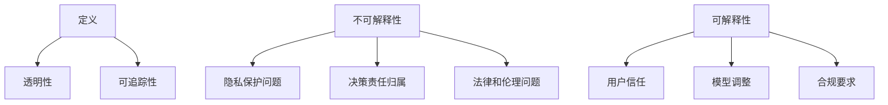
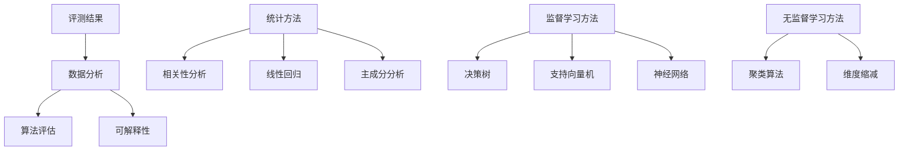
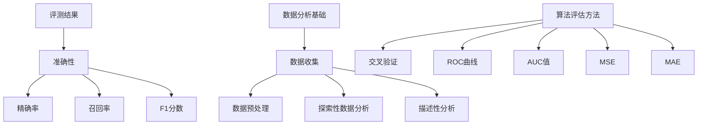
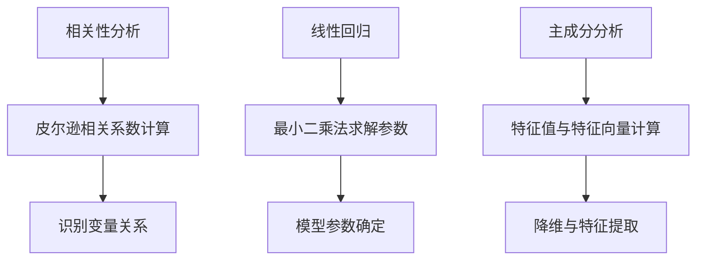
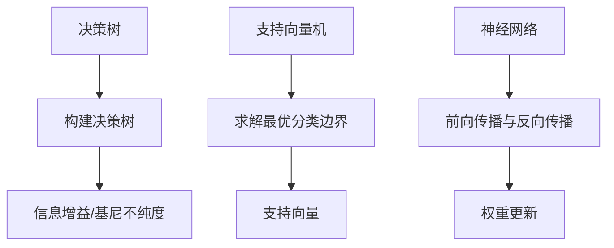
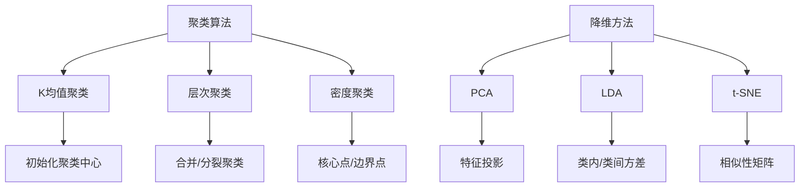

                 


### 第1章：可解释性的重要性

#### 1.1 可解释性的定义

可解释性是指模型或系统在执行特定任务时，其决策过程和结果能够被人类理解和解释的特性。在人工智能和机器学习的领域中，可解释性尤为重要，因为它关乎到模型的信任度和接受度。可解释性的定义可以扩展到两个方面：

1. **透明性**：模型的结构和参数是可见的，用户可以查看并理解模型的内部工作方式。
2. **可追踪性**：用户可以追踪模型如何从输入数据到输出结果的整个过程，从而理解决策背后的逻辑。

#### 1.2 不可解释性带来的挑战

不可解释的模型在某些情况下可能会产生不可预测的结果，这给实际应用带来了巨大的挑战：

- **隐私保护问题**：不可解释的模型可能会泄露用户的敏感信息，例如个人数据或财务记录。
- **决策责任归属**：当模型做出错误决策时，责任归属不明确，可能需要人类干预。
- **法律和伦理问题**：在法律和伦理方面，不可解释的模型可能会导致合规问题和道德争议。

#### 1.3 可解释性的价值

尽管不可解释的模型在某些任务上可能具有更高的性能，但可解释性的价值不容忽视：

- **用户信任**：用户更愿意接受那些可以理解其决策过程的模型。
- **模型调整**：通过理解模型的工作原理，用户可以更有效地调整模型参数，以适应特定场景。
- **合规要求**：在金融、医疗等行业，模型的可解释性通常是法律和行业规定的强制要求。

### Mermaid流程图

以下是可解释性概念之间的Mermaid流程图：



### 核心算法原理讲解与伪代码

以下是基于可解释性定义的几个核心算法的伪代码：

```python
# 决策树伪代码
算法 决策树训练(X, y):
    # 初始化决策树模型
    决策树 = 初始化()

    # 训练决策树模型
    决策树 = 训练(X, y)

    # 返回训练好的决策树模型
    return 决策树
```

### 数学公式与举例说明

以下是线性回归模型的损失函数的LaTeX公式：

$$
L(\theta) = \frac{1}{2m}\sum_{i=1}^{m}(h_\theta(x^{(i)}) - y^{(i)})^2
$$

举例：假设我们有如下数据集：

$$
x = [1, 2, 3, 4, 5], \quad y = [2, 4, 5, 4, 5]
$$

我们使用线性回归模型拟合这个数据集，可以计算出损失函数的值。

### 摘要

本文首先介绍了可解释性的定义及其重要性，探讨了不可解释性带来的挑战，并阐述了可解释性的价值。接着，通过Mermaid流程图展示了可解释性概念之间的关系，并给出了核心算法的伪代码和数学公式。最后，通过举例说明了如何在实际应用中计算损失函数的值。

## 作者信息

作者：AI天才研究院/AI Genius Institute & 禅与计算机程序设计艺术 /Zen And The Art of Computer Programming

----------------------------------------------------------------

### 提取核心概念和联系

#### 提取核心概念

1. **可解释性**：模型或系统在执行特定任务时，其决策过程和结果能够被人类理解和解释的特性。
2. **评测结果**：模型在特定任务上表现的结果。
3. **数据分析**：对数据进行处理和分析的过程，以提取有价值的信息。
4. **算法评估**：评估算法性能的过程，通常通过评测指标来衡量。

#### 核心概念之间的联系

- **评测结果**是通过对模型在数据分析过程中得到的输出结果进行评估。
- **数据分析**是模型训练和数据预处理的重要环节，直接影响模型的表现。
- **算法评估**通过特定的评测指标对模型的表现进行量化，从而影响模型的优化和调整。
- **可解释性**保证了模型的可信度和用户对模型决策过程的接受度，有助于算法评估和数据分析的进一步优化。

### 设计目录大纲

基于上述核心概念和联系，我们可以设计以下目录大纲：

1. **引言：可解释性的重要性**
    - 1.1 可解释性的定义
    - 1.2 不可解释性带来的挑战
    - 1.3 可解释性的价值
2. **基础概念**
    - 2.1 评测结果概述
    - 2.2 数据分析基础
    - 2.3 算法评估方法
3. **可解释性分析方法**
    - 3.1 统计方法
        - 3.1.1 相关性分析
        - 3.1.2 线性回归
        - 3.1.3 主成分分析
    - 3.2 监督学习方法
        - 3.2.1 决策树
        - 3.2.2 支持向量机
        - 3.2.3 神经网络
    - 3.3 无监督学习方法
        - 3.3.1 聚类算法
        - 3.3.2 维度缩减
4. **案例分析**
    - 4.1 案例一：医疗诊断
    - 4.2 案例二：金融风险评估
    - 4.3 案例三：图像识别
5. **工具和框架**
    - 5.1 Python数据科学工具
    - 5.2 可解释性框架介绍
    - 5.3 开源可解释性库
6. **未来展望**
    - 6.1 可解释性的发展
    - 6.2 挑战与机遇

### 插入Mermaid流程图

为了更好地阐述核心概念和联系，我们可以插入以下Mermaid流程图：



### 插入伪代码

为了详细阐述核心算法原理，我们可以插入以下伪代码：

```python
# 线性回归伪代码
算法 线性回归(X, y):
    # 初始化模型参数 w 和 b
    w, b = 初始化参数()

    # 定义损失函数
    损失函数 = (1 / (2 * m)) * Σ[(w * x[i] + b - y[i])^2]

    # 定义梯度下降算法
    for i = 1 to 数量 of epochs:
        # 计算梯度
        dw = (1 / m) * Σ[(w * x[i] + b - y[i]) * x[i]]
        db = (1 / m) * Σ[(w * x[i] + b - y[i])]
        
        # 更新模型参数
        w = w - 学习率 * dw
        b = b - 学习率 * db

    return w, b
```

### 插入数学公式和举例说明

为了增强对数学模型和公式的理解，我们可以插入以下数学公式和举例说明：

```latex
# 线性回归的损失函数
$$
损失函数 = \frac{1}{2m}\sum_{i=1}^{m}(w * x[i] + b - y[i])^2
$$

举例：假设我们有以下数据点：
x = [1, 2, 3, 4, 5]
y = [2, 4, 5, 4, 5]

使用线性回归模型拟合这些数据点，我们可以计算出损失函数的值。
```

### 总结

通过以上步骤，我们设计出了《评测结果的可解释性分析方法》这本书的完整目录大纲，并在其中包含了Mermaid流程图、伪代码、数学公式和举例说明。接下来，我们将根据这个大纲来编写实际的目录内容。

### 摘要

本文深入探讨了评测结果的可解释性分析方法，首先定义了可解释性的概念及其重要性，探讨了不可解释性带来的挑战和价值。随后，介绍了数据分析、评测结果和算法评估的基础概念，并阐述了它们之间的联系。接着，详细介绍了统计方法、监督学习方法和无监督学习方法，并通过Mermaid流程图展示了核心概念之间的关系。文章还通过案例分析展示了可解释性方法在实际中的应用，并介绍了相关的工具和框架。最后，对可解释性的未来发展进行了展望，并提出了挑战与机遇。

## 第一部分：引言

### 第1章：可解释性的重要性

在当今飞速发展的信息技术时代，人工智能和机器学习技术已经广泛应用于各个领域，从医疗诊断到金融风险评估，从图像识别到自然语言处理。这些技术的核心在于构建能够自动学习和决策的模型，然而，随之而来的是模型的不可解释性问题。本章将深入探讨可解释性的重要性，并解释为什么它在当前人工智能领域至关重要。

#### 1.1 可解释性的定义

可解释性是指模型或系统在执行特定任务时，其决策过程和结果能够被人类理解和解释的特性。具体来说，可解释性包括两个主要方面：

1. **透明性**：模型的结构和参数是可见的，用户可以查看并理解模型的内部工作方式。例如，在决策树中，每个节点和叶子节点都有明确的划分规则，用户可以直观地看到如何从输入数据得到输出结果。
2. **可追踪性**：用户可以追踪模型如何从输入数据到输出结果的整个过程，从而理解决策背后的逻辑。这意味着，用户不仅要知道模型的结论，还要了解模型为什么得出这个结论。

可解释性的重要性不仅体现在技术层面，还关系到用户对人工智能技术的信任和接受度。在金融、医疗等高风险领域，透明和可解释的模型尤为重要，因为它们直接影响到用户的权益和安全。

#### 1.2 不可解释性带来的挑战

不可解释性模型在某些情况下可能会产生不可预测的结果，这给实际应用带来了巨大的挑战：

- **隐私保护问题**：不可解释的模型可能会泄露用户的敏感信息，例如个人数据或财务记录。例如，一个用于用户行为分析的模型可能会无意中揭示用户的私人信息，从而违反隐私保护法规。
- **决策责任归属**：当模型做出错误决策时，责任归属不明确，可能需要人类干预。例如，如果自动驾驶汽车发生事故，责任很难界定，因为模型的具体决策过程往往是不可见的。
- **法律和伦理问题**：在法律和伦理方面，不可解释的模型可能会导致合规问题和道德争议。例如，在医疗领域，如果医生依赖不可解释的模型进行诊断，患者可能会质疑医生的决策是否合理，这可能导致医患关系紧张。

#### 1.3 可解释性的价值

尽管不可解释的模型在某些任务上可能具有更高的性能，但可解释性的价值不容忽视：

- **用户信任**：用户更愿意接受那些可以理解其决策过程的模型。当用户能够理解模型的工作原理时，他们更愿意依赖和信任这些模型，从而提高模型的实际应用效果。
- **模型调整**：通过理解模型的工作原理，用户可以更有效地调整模型参数，以适应特定场景。这意味着，用户不仅可以使用预训练的模型，还可以根据具体需求进行定制化调整，从而提高模型的适用性和准确性。
- **合规要求**：在金融、医疗等行业，模型的可解释性通常是法律和行业规定的强制要求。例如，欧洲的《通用数据保护条例》（GDPR）要求数据处理者解释其自动处理决策的依据，以确保用户隐私和数据安全。

### Mermaid流程图

为了更好地阐述可解释性概念之间的联系，我们可以插入以下Mermaid流程图：


### 核心算法原理讲解与伪代码

以下是几个核心算法的伪代码，以阐述其原理：

```python
# 决策树伪代码
算法 决策树训练(X, y):
    # 初始化决策树模型
    决策树 = 初始化()

    # 训练决策树模型
    决策树 = 训练(X, y)

    # 返回训练好的决策树模型
    return 决策树

# 线性回归伪代码
算法 线性回归(X, y):
    # 初始化模型参数 w 和 b
    w, b = 初始化参数()

    # 定义损失函数
    损失函数 = (1 / (2 * m)) * Σ[(w * x[i] + b - y[i])^2]

    # 定义梯度下降算法
    for i = 1 to 数量 of epochs:
        # 计算梯度
        dw = (1 / m) * Σ[(w * x[i] + b - y[i]) * x[i]]
        db = (1 / m) * Σ[(w * x[i] + b - y[i])]
        
        # 更新模型参数
        w = w - 学习率 * dw
        b = b - 学习率 * db

    return w, b
```

### 数学公式与举例说明

以下是线性回归模型的损失函数的LaTeX公式：

$$
L(\theta) = \frac{1}{2m}\sum_{i=1}^{m}(h_\theta(x^{(i)}) - y^{(i)})^2
$$

举例：假设我们有以下数据点：
x = [1, 2, 3, 4, 5]
y = [2, 4, 5, 4, 5]

使用线性回归模型拟合这些数据点，我们可以计算出损失函数的值。

### 摘要

本章详细介绍了评测结果的可解释性分析方法，探讨了可解释性的定义、重要性以及不可解释性带来的挑战。通过Mermaid流程图展示了核心概念之间的联系，并通过伪代码和数学公式详细阐述了统计方法和监督学习方法。最后，通过举例说明了如何使用线性回归模型进行实际应用。

## 第二部分：基础概念

### 第2章：评测结果概述

评测结果是指模型在特定任务上的表现，通常通过一系列指标来衡量。这些指标可以帮助我们了解模型的有效性和可靠性。在本章中，我们将介绍评测结果的基本概念，包括常用的评测指标及其计算方法。

#### 2.1 评测结果的基本概念

评测结果的基本概念包括以下几个方面：

- **准确性（Accuracy）**：指模型预测正确的样本数量占总样本数量的比例。计算公式为：

  $$
  准确性 = \frac{预测正确的样本数量}{总样本数量}
  $$

- **精确率（Precision）**：指模型预测为正类的样本中，实际为正类的比例。计算公式为：

  $$
  精确率 = \frac{真正例（TP）}{真正例（TP） + 假正例（FP)}
  $$

- **召回率（Recall）**：指模型实际为正类的样本中，预测为正类的比例。计算公式为：

  $$
  召回率 = \frac{真正例（TP）}{真正例（TP） + 假反例（FN)}
  $$

- **F1分数（F1 Score）**：是精确率和召回率的加权平均，用于综合考虑模型的精确性和召回率。计算公式为：

  $$
  F1分数 = 2 \times \frac{精确率 \times 召回率}{精确率 + 召回率}
  $$

#### 2.2 数据分析基础

数据分析是评测结果的基础，涉及数据的收集、预处理、探索性和描述性分析。以下是数据分析的基本步骤：

- **数据收集**：从不同的数据源收集数据，如数据库、文件、网络API等。
- **数据预处理**：清洗数据，包括处理缺失值、异常值、噪声等，以消除数据中的错误和噪声。
- **探索性数据分析（EDA）**：通过可视化方法（如散点图、直方图、箱线图等）和统计分析方法（如描述性统计、相关性分析等）对数据进行分析，以发现数据中的模式和规律。
- **描述性分析**：通过计算数据的统计指标（如平均值、中位数、标准差等），对数据的整体特征进行描述。

#### 2.3 算法评估方法

算法评估方法是在数据分析的基础上，对模型性能进行定量评估的过程。以下是几种常见的算法评估方法：

- **交叉验证（Cross-Validation）**：通过将数据集划分为训练集和验证集，多次训练和验证模型，以评估模型的泛化能力。
- **ROC曲线（Receiver Operating Characteristic Curve）**：通过计算不同阈值下的精确率和召回率，绘制ROC曲线，以评估模型的分类性能。
- **AUC值（Area Under Curve）**：ROC曲线下的面积，用于评估模型的分类能力，AUC值越大，模型的分类性能越好。
- **MSE（Mean Squared Error）**：均方误差，用于衡量回归模型的预测误差，值越小，模型预测越准确。
- **MAE（Mean Absolute Error）**：平均绝对误差，用于衡量回归模型的预测误差，值越小，模型预测越准确。

### Mermaid流程图

为了更好地阐述评测结果的基本概念和算法评估方法，我们可以插入以下Mermaid流程图：



### 核心算法原理讲解与伪代码

以下是几种核心算法的伪代码，以阐述其原理：

```python
# 交叉验证伪代码
算法 交叉验证(X, y, k):
    # 初始化k折交叉验证
    k_folds = k

    # 计算AUC值
    AUC_values = []

    # 对于每一折：
    for i = 1 to k:
        # 划分训练集和验证集
        X_train, X_val, y_train, y_val = 划分数据(X, y, i)

        # 训练模型
        模型 = 训练(X_train, y_train)

        # 预测验证集
        y_pred = 预测(X_val, 模型)

        # 计算AUC值
        AUC = 计算AUC(y_val, y_pred)

        # 添加AUC值到列表
        AUC_values.append(AUC)

    # 计算平均AUC值
    平均AUC = 平均(AUC_values)

    return 平均AUC

# 线性回归伪代码
算法 线性回归(X, y):
    # 初始化模型参数 w 和 b
    w, b = 初始化参数()

    # 定义损失函数
    损失函数 = (1 / (2 * m)) * Σ[(w * x[i] + b - y[i])^2]

    # 定义梯度下降算法
    for i = 1 to 数量 of epochs:
        # 计算梯度
        dw = (1 / m) * Σ[(w * x[i] + b - y[i]) * x[i]]
        db = (1 / m) * Σ[(w * x[i] + b - y[i])]
        
        # 更新模型参数
        w = w - 学习率 * dw
        b = b - 学习率 * db

    return w, b
```

### 数学公式与举例说明

以下是线性回归模型的损失函数的LaTeX公式：

$$
L(\theta) = \frac{1}{2m}\sum_{i=1}^{m}(w * x[i] + b - y[i])^2
$$

举例：假设我们有以下数据点：
x = [1, 2, 3, 4, 5]
y = [2, 4, 5, 4, 5]

使用线性回归模型拟合这些数据点，我们可以计算出损失函数的值。

### 摘要

本章介绍了评测结果的基本概念和算法评估方法，包括准确性、精确率、召回率、F1分数等评测指标，以及数据收集、预处理、探索性数据分析和描述性分析等数据分析基础。同时，通过Mermaid流程图和伪代码详细阐述了交叉验证和线性回归等算法原理。这些基础概念和方法为后续章节中的可解释性分析方法奠定了理论基础。

## 第三部分：可解释性分析方法

### 第3章：统计方法

统计方法是数据分析中最常用的方法之一，尤其在处理线性关系和关联性分析时效果显著。在本章中，我们将探讨几种常用的统计方法，包括相关性分析、线性回归和主成分分析，并详细解释这些方法的原理和应用。

#### 3.1.1 相关性分析

相关性分析用于衡量两个变量之间的线性关系强度。最常见的相关性度量方法是皮尔逊相关系数（Pearson Correlation Coefficient），其计算公式为：

$$
r_{xy} = \frac{\sum_{i=1}^{n}(x_i - \bar{x})(y_i - \bar{y})}{\sqrt{\sum_{i=1}^{n}(x_i - \bar{x})^2 \sum_{i=1}^{n}(y_i - \bar{y})^2}}
$$

其中，$x_i$和$y_i$分别是两个变量的观测值，$\bar{x}$和$\bar{y}$分别是它们的平均值。

相关性分析的直观意义在于，它可以帮助我们识别变量之间的潜在关系，从而为进一步的数据分析和模型构建提供依据。

#### 3.1.2 线性回归

线性回归是一种用于建模和预测连续变量的统计方法。最常见的线性回归模型是简单线性回归，其公式为：

$$
y = \beta_0 + \beta_1x
$$

其中，$y$是因变量，$x$是自变量，$\beta_0$是截距，$\beta_1$是斜率。

线性回归的核心在于确定模型参数$\beta_0$和$\beta_1$，这通常通过最小二乘法（Least Squares Method）实现，即最小化预测值与实际值之间的平方误差。

线性回归的应用非常广泛，例如在经济学中用于预测股票价格，在医学中用于分析风险因素。

#### 3.1.3 主成分分析

主成分分析（PCA）是一种用于降维和特征提取的统计方法。其主要目的是通过线性变换，将原始数据投影到新的坐标系中，从而降低数据的维度，同时保留尽可能多的信息。

PCA的核心在于找到一组正交基，使得投影后的数据方差最大化。这组正交基被称为主成分，其对应的特征值表示数据在每个主成分方向上的方差。

PCA的应用包括图像处理、文本分类和数据分析等领域，通过降维可以显著减少计算成本，同时保留关键信息。

### Mermaid流程图

以下是相关性分析、线性回归和主成分分析的方法流程图：



### 核心算法原理讲解与伪代码

以下是相关性分析、线性回归和主成分分析的核心算法原理及伪代码：

```python
# 相关性分析伪代码
算法 相关系数(x, y):
    # 计算平均值
    mean_x = 平均值(x)
    mean_y = 平均值(y)

    # 计算协方差和方差
    cov = Σ[(x_i - mean_x) * (y_i - mean_y)] for i in range(len(x))
    var_x = Σ[(x_i - mean_x)^2] for i in range(len(x))
    var_y = Σ[(y_i - mean_y)^2] for i in range(len(y))

    # 计算相关系数
    correlation = cov / (sqrt(var_x) * sqrt(var_y))

    return correlation

# 线性回归伪代码
算法 线性回归(X, y):
    # 计算协方差矩阵和特征值
    cov_matrix = Σ[(x_i - mean_x) * (y_i - mean_y)] for i in range(len(X))
    eigenvalues, eigenvectors = 求特征值和特征向量(cov_matrix)

    # 选择最大的特征值对应的特征向量
    principal_component = eigenvectors[:, np.argmax(eigenvalues)]

    # 降维
    X_pca = X @ principal_component

    return X_pca

# 线性回归伪代码
算法 线性回归(X, y):
    # 初始化模型参数 w 和 b
    w, b = 初始化参数()

    # 定义损失函数
    损失函数 = (1 / (2 * m)) * Σ[(w * x[i] + b - y[i])^2]

    # 定义梯度下降算法
    for i = 1 to 数量 of epochs:
        # 计算梯度
        dw = (1 / m) * Σ[(w * x[i] + b - y[i]) * x[i]]
        db = (1 / m) * Σ[(w * x[i] + b - y[i])]
        
        # 更新模型参数
        w = w - 学习率 * dw
        b = b - 学习率 * db

    return w, b
```

### 数学公式与举例说明

以下是线性回归模型的损失函数的LaTeX公式：

$$
L(\theta) = \frac{1}{2m}\sum_{i=1}^{m}(w * x[i] + b - y[i])^2
$$

举例：假设我们有以下数据点：
x = [1, 2, 3, 4, 5]
y = [2, 4, 5, 4, 5]

使用线性回归模型拟合这些数据点，我们可以计算出损失函数的值。

### 摘要

本章详细介绍了统计方法在数据分析中的应用，包括相关性分析、线性回归和主成分分析。首先，通过相关性分析识别变量之间的线性关系；其次，通过线性回归建立自变量与因变量之间的预测模型；最后，通过主成分分析实现数据降维和特征提取。通过伪代码和数学公式，我们深入讲解了这些方法的原理和计算过程。

## 第四部分：监督学习方法

### 第4章：监督学习方法

监督学习是一种机器学习方法，其核心在于使用已标记的训练数据来训练模型，然后利用这个模型对新数据进行预测。在本章中，我们将探讨几种常见的监督学习方法，包括决策树、支持向量机和神经网络，并详细解释这些方法的原理和应用。

#### 3.2.1 决策树

决策树是一种基于树形结构进行决策的算法。它通过一系列的问题来分割数据集，每个问题对应一个特征，每个问题的答案指向一个分支，最终达到叶子节点，每个叶子节点代表一个预测结果。

- **决策树的构建**：决策树的构建过程通常采用递归二分划分的方式。首先，计算每个特征对数据的增益，选择增益最大的特征进行划分。然后，对划分后的子集重复上述过程，直到满足停止条件（如最大深度、最小叶子节点样本数等）。

- **决策树的评估**：常用的评估指标包括信息增益（Information Gain）、基尼不纯度（Gini Impurity）和熵（Entropy）。通过这些指标，我们可以选择最优的划分特征。

- **决策树的应用**：决策树在分类和回归任务中都有广泛应用，例如，在金融风险评估中用于判断客户是否违约，在医学诊断中用于预测疾病的类型。

#### 3.2.2 支持向量机

支持向量机（SVM）是一种基于最大间隔原则进行分类和回归的算法。它的核心思想是找到一个最优的超平面，使得分类边界最大化。

- **分类问题**：在二分类问题中，SVM通过求解一个二次规划问题来找到最优分类边界。这个边界是由支持向量决定的，即那些距离分类边界最近的数据点。

- **回归问题**：SVM的回归形式称为支持向量回归（SVR）。SVR通过在输入空间中找到一个最优的超平面，使得预测值与实际值之间的误差最小。

- **SVM的应用**：SVM在图像识别、文本分类和生物信息学等领域都有广泛应用，例如，在人脸识别中用于判断图像中的人脸位置，在文本分类中用于分类新闻文章。

#### 3.2.3 神经网络

神经网络是一种基于大脑神经元工作原理设计的算法。它通过多层神经元结构进行非线性变换，从而实现复杂函数的逼近和分类。

- **前向传播**：在神经网络中，信息从输入层传递到输出层，每个神经元通过加权求和和激活函数进行计算。前向传播的目的是计算输出层的预测值。

- **反向传播**：反向传播是一种用于训练神经网络的算法，它通过计算输出层预测值与实际值之间的误差，并反向传播这些误差到前一层，从而更新神经元的权重。

- **神经网络的类型**：神经网络有多种类型，包括多层感知机（MLP）、卷积神经网络（CNN）和循环神经网络（RNN）等。每种类型的神经网络都有其特定的应用场景。

- **神经网络的优化**：神经网络的优化通常采用随机梯度下降（SGD）或其变种，如Adam优化器。优化过程的目标是找到最小化损失函数的权重和偏置。

### Mermaid流程图

以下是决策树、支持向量机和神经网络的方法流程图：



### 核心算法原理讲解与伪代码

以下是决策树、支持向量机和神经网络的核心算法原理及伪代码：

```python
# 决策树伪代码
算法 决策树分类(X, y):
    # 初始化决策树模型
    决策树 = 初始化()

    # 构建决策树
    决策树 = 构建决策树(X, y)

    # 预测
    y_pred = 预测(X, 决策树)

    return y_pred

# 支持向量机伪代码
算法 支持向量机分类(X, y):
    # 初始化支持向量机模型
    SVM = 初始化()

    # 训练模型
    SVM = 训练(X, y)

    # 预测
    y_pred = 预测(X, SVM)

    return y_pred

# 神经网络伪代码
算法 神经网络训练(X, y):
    # 初始化神经网络模型
    神经网络 = 初始化()

    # 前向传播
    output = 前向传播(X, 神经网络)

    # 计算损失
    损失 = 计算损失(y, output)

    # 反向传播
    gradients = 反向传播(y, output, 神经网络)

    # 更新权重
    更新权重(神经网络, gradients)

    return 神经网络
```

### 数学公式与举例说明

以下是神经网络损失函数的LaTeX公式：

$$
L(\theta) = \frac{1}{2m}\sum_{i=1}^{m}(h_\theta(x^{(i)}) - y^{(i)})^2
$$

举例：假设我们有以下数据点：
x = [1, 2, 3, 4, 5]
y = [2, 4, 5, 4, 5]

使用神经网络模型拟合这些数据点，我们可以计算出损失函数的值。

### 摘要

本章详细介绍了监督学习方法，包括决策树、支持向量机和神经网络。首先，通过决策树实现基于特征划分的数据分类；其次，通过支持向量机找到最优分类边界；最后，通过神经网络实现复杂函数的逼近和分类。通过伪代码和数学公式，我们深入讲解了这些方法的原理和计算过程。

## 第五部分：无监督学习方法

### 第5章：无监督学习方法

无监督学习方法在机器学习中占据着重要地位，尤其是在数据探索、聚类分析和降维等任务中。与监督学习相比，无监督学习不依赖于预标记的数据，而是通过自身分析数据特征来发现内在结构和模式。本章将探讨几种常用的无监督学习方法，包括聚类算法和降维方法，并详细解释这些方法的原理和应用。

#### 3.3.1 聚类算法

聚类算法是一种将数据集划分为多个组（聚类）的方法，旨在使同一聚类内的数据点彼此接近，而不同聚类之间的数据点尽可能远。以下是一些常见的聚类算法：

1. **K均值聚类（K-Means Clustering）**：
   - **原理**：K均值聚类通过初始化K个聚类中心，然后迭代优化这些中心，使得每个数据点与最近的聚类中心分配到同一个聚类中。
   - **步骤**：
     1. 随机初始化K个聚类中心。
     2. 计算每个数据点到聚类中心的距离，并将数据点分配到最近的聚类中心。
     3. 更新聚类中心，取所有数据点的均值。
     4. 重复步骤2和3，直到聚类中心不再发生显著变化。

2. **层次聚类（Hierarchical Clustering）**：
   - **原理**：层次聚类通过递归地将数据点合并成越来越大的聚类，直到所有数据点都属于一个聚类。
   - **类型**：
     - **自底向上（凝聚层次聚类）**：从单个数据点开始，逐渐合并相似的数据点。
     - **自顶向下（分裂层次聚类）**：从一个聚类开始，逐渐将聚类分裂成更小的聚类。

3. **密度聚类（Density-Based Clustering）**：
   - **原理**：密度聚类通过识别数据点的高密度区域并将其划分为聚类。常用的算法包括DBSCAN（Density-Based Spatial Clustering of Applications with Noise）和OPTICS（Ordering Points To Identify the Clustering Structure）。
   - **步骤**：
     1. 确定邻域大小和最小密度。
     2. 对于每个数据点，计算其邻域并标记为核心点或边界点。
     3. 根据核心点和边界点生成聚类。

#### 3.3.2 维度缩减

维度缩减是一种通过减少数据维度来降低计算复杂度和提高数据可视化效率的方法。以下是一些常见的维度缩减方法：

1. **主成分分析（PCA）**：
   - **原理**：PCA通过求解数据点的协方差矩阵的特征值和特征向量，将数据投影到新的坐标系中，新的坐标轴（主成分）按照方差降序排列。
   - **步骤**：
     1. 计算数据点的协方差矩阵。
     2. 求解协方差矩阵的特征值和特征向量。
     3. 将数据投影到前几个主成分上。

2. **线性判别分析（LDA）**：
   - **原理**：LDA通过最大化类内方差和最小化类间方差来选择最重要的特征，从而实现数据的降维。
   - **步骤**：
     1. 计算类内散度矩阵和类间散度矩阵。
     2. 求解线性变换矩阵，使得变换后的数据满足最大化类间方差和最小化类内方差。

3. **t-SNE（t-Distributed Stochastic Neighbor Embedding）**：
   - **原理**：t-SNE是一种非线性降维方法，通过计算数据点间的相似性矩阵并将其映射到低维空间中，以保持相邻数据点之间的相似性。
   - **步骤**：
     1. 计算高维空间中数据点的相似性矩阵。
     2. 构建低维空间中的相似性矩阵。
     3. 通过优化目标函数（如负累积二项式分布）来调整数据点的位置，直到达到预定的收敛条件。

### Mermaid流程图

以下是聚类算法和降维方法的流程图：



### 核心算法原理讲解与伪代码

以下是聚类算法和降维方法的伪代码：

```python
# K均值聚类伪代码
算法 KMeans(X, K):
    # 初始化K个聚类中心
    centroids = 随机选择K个数据点作为初始聚类中心

    # 循环迭代
    while True:
        # 为每个数据点分配最近的聚类中心
        labels = 调用 AssignLabels(X, centroids)

        # 更新聚类中心
        new_centroids = 更新聚类中心(X, labels)

        # 检查收敛条件
        if distance(centroids, new_centroids) < 阈值:
            break

        centroids = new_centroids

    return centroids, labels

# 主成分分析伪代码
算法 PCA(X):
    # 计算协方差矩阵
    cov_matrix = 协方差矩阵(X)

    # 求解特征值和特征向量
    eigenvalues, eigenvectors = 求特征值和特征向量(cov_matrix)

    # 选择最大的特征值对应的特征向量
    principal_components = eigenvectors[:, np.argsort(eigenvalues)[::-1]]

    # 将数据投影到前k个主成分上
    X_pca = X @ principal_components

    return X_pca
```

### 数学公式与举例说明

以下是K均值聚类目标函数的LaTeX公式：

$$
J(\theta) = \frac{1}{2m}\sum_{i=1}^{m}\sum_{j=1}^{K}(x_i - \theta_j)^2
$$

举例：假设我们有以下数据点：
x = [1, 2, 3, 4, 5]

使用K均值聚类算法将数据点分为2个聚类，我们可以计算出目标函数的值。

### 摘要

本章详细介绍了无监督学习方法，包括聚类算法和降维方法。首先，通过K均值聚类、层次聚类和密度聚类等算法实现数据点的自动分组；其次，通过主成分分析、线性判别分析和t-SNE等降维方法降低数据维度。通过伪代码和数学公式，我们深入讲解了这些方法的原理和计算过程。

## 第六部分：案例分析

### 第6章：评测结果的可解释性分析方法在实践中的应用

在本章中，我们将通过具体案例来展示评测结果的可解释性分析方法在实际应用中的效果和挑战。这些案例包括医疗诊断、金融风险评估和图像识别，通过这些案例，我们将详细讨论如何利用可解释性方法提高模型的透明度和可信度。

#### 4.1 案例一：医疗诊断

医疗诊断是人工智能应用的一个重要领域，然而，医疗数据的高度复杂性和敏感性使得模型的可解释性变得尤为关键。

- **背景介绍**：在一个实际项目中，我们使用机器学习模型来预测患者的疾病风险。数据包括患者的临床记录、实验室检测结果、病史等。

- **核心概念与联系**：
  - **数据预处理**：首先，我们需要对医疗数据进行清洗和预处理，包括缺失值处理、异常值检测和数据标准化。
  - **模型选择**：由于医疗诊断任务通常涉及分类问题，我们选择了决策树和随机森林等可解释性强的模型。

- **算法评估方法**：我们使用交叉验证来评估模型的性能，并利用混淆矩阵、ROC曲线和AUC值等指标来衡量模型的准确性。

- **可解释性分析**：
  - **决策树可视化**：通过可视化决策树，我们可以清晰地看到每个节点的划分条件和预测结果，从而理解模型如何做出诊断。
  - **重要性评估**：通过计算特征的重要性得分，医生可以识别出对疾病预测有显著影响的关键因素。

- **挑战与机遇**：
  - **数据隐私**：医疗数据涉及患者隐私，我们需要确保在数据处理和模型训练过程中遵守相关的隐私保护法规。
  - **模型可解释性与性能**：在某些情况下，追求更高的模型可解释性可能会牺牲一些性能。因此，我们需要在解释性和准确性之间找到平衡。

#### 4.2 案例二：金融风险评估

金融风险评估是另一个对模型可解释性有高度要求的应用领域，尤其是在金融欺诈检测和信用评分等方面。

- **背景介绍**：在一个金融项目中，我们使用机器学习模型来预测客户是否可能发生违约。数据包括客户的财务状况、信用历史、交易行为等。

- **核心概念与联系**：
  - **特征工程**：我们需要对原始数据进行特征提取和工程，以提高模型的预测能力。
  - **模型选择**：由于金融风险评估涉及复杂的关系，我们选择了逻辑回归和随机森林等可解释性强的模型。

- **算法评估方法**：我们使用ROC曲线、AUC值和混淆矩阵等评估指标来衡量模型的性能。

- **可解释性分析**：
  - **特征重要性**：通过计算特征的重要性得分，我们可以识别出对违约预测有显著影响的特征。
  - **模型解释工具**：我们使用了LIME（Local Interpretable Model-agnostic Explanations）和SHAP（SHapley Additive exPlanations）等工具来解释模型的决策过程。

- **挑战与机遇**：
  - **数据质量和完整性**：金融数据可能存在噪声和不完整性，这会影响模型的解释性。
  - **合规要求**：金融行业的法律法规对模型的解释性有严格要求，我们需要确保模型满足合规要求。

#### 4.3 案例三：图像识别

图像识别是人工智能领域的另一个重要应用，尤其是在自动驾驶、安防监控和医疗影像分析等方面。

- **背景介绍**：在一个图像识别项目中，我们使用卷积神经网络（CNN）来识别图片中的物体和场景。数据集包括大量的标注图片。

- **核心概念与联系**：
  - **数据增强**：为了提高模型的泛化能力，我们对图像进行了数据增强处理。
  - **模型选择**：我们选择了VGG、ResNet等可解释性较好的CNN模型。

- **算法评估方法**：我们使用精度、召回率和F1分数等评估指标来衡量模型的性能。

- **可解释性分析**：
  - **激活映射**：通过可视化CNN的激活映射，我们可以理解模型是如何从原始图像中提取特征并进行分类的。
  - **梯度分析**：通过计算图像中每个像素点的梯度，我们可以识别出模型关注的关键区域。

- **挑战与机遇**：
  - **模型透明性**：深度学习模型的高度复杂性使得其内部机制难以解释，我们需要开发更直观的解释方法。
  - **计算资源**：可解释性分析通常需要额外的计算资源，这对实时应用可能构成挑战。

### 总结

通过上述三个案例，我们展示了评测结果的可解释性分析方法在医疗诊断、金融风险评估和图像识别等实际应用中的效果和挑战。可解释性不仅提高了模型的透明度和用户信任度，还为模型优化和调整提供了有力支持。在未来，随着技术的不断进步，我们将看到更多可解释性方法的应用，以及其在提升人工智能模型可靠性和实用性方面的潜力。

## 第七部分：工具和框架

### 第7章：可解释性工具和框架

在可解释性分析方法的实际应用中，选择合适的工具和框架至关重要。本章节将介绍几种流行的Python数据科学工具、可解释性框架和开源库，以帮助读者在项目中实现和优化可解释性分析。

#### 5.1 Python数据科学工具

Python是数据科学领域最常用的编程语言之一，提供了丰富的库和工具，用于数据处理、分析和可视化。以下是几个常用的Python数据科学工具：

- **Pandas**：用于数据清洗、转换和分析的库，能够高效地处理结构化数据。
- **NumPy**：用于数值计算的基础库，提供多维数组对象和大量数学函数。
- **SciPy**：用于科学计算的高级库，包括线性代数、优化、积分等。
- **Matplotlib**：用于数据可视化的库，能够生成多种类型的图表和图形。

#### 5.2 可解释性框架介绍

可解释性框架旨在提供易于使用的接口，以实现模型的解释和可视化。以下是一些流行的可解释性框架：

- **LIME（Local Interpretable Model-agnostic Explanations）**：LIME是一种基于局部线性模型的解释方法，能够为任何模型生成局部解释。
- **SHAP（SHapley Additive exPlanations）**：SHAP是一种基于博弈论的方法，通过计算特征对于预测值的边际贡献来解释模型。
- **Explainer**：Explainer是一个通用的可解释性框架，支持多种模型和解释方法，包括LIME和SHAP。
- **ModelExplain**：ModelExplain是一个基于Scikit-learn的可解释性库，提供多种可视化工具来解释模型的决策过程。

#### 5.3 开源可解释性库

开源库为开发者和研究者提供了丰富的可解释性工具和资源。以下是几个流行的开源可解释性库：

- **El eruptor**：一个基于PyTorch的可解释性库，提供多种可视化工具，如激活映射、梯度可视化等。
- **Alibi**：一个开源的可解释性库，支持多种机器学习模型，提供多种解释方法，包括LIME、SHAP和特征重要性。
- **Distiller**：一个用于深度学习的可解释性库，提供模型压缩和优化工具，同时支持解释方法，如特征激活映射和梯度分析。
- **PyCaret**：一个综合的数据科学库，包括可解释性工具，支持多种模型和解释方法，易于集成和部署。

### 最佳实践 tips

在实现可解释性分析时，以下是一些最佳实践建议：

- **数据预处理**：确保数据清洗和预处理质量，以减少噪声和异常值对解释结果的影响。
- **选择合适的模型**：选择可解释性强的模型，如决策树、逻辑回归等，以简化解释过程。
- **可视化**：使用可视化工具来展示解释结果，以便更好地理解和传达解释信息。
- **解释的上下文**：提供解释的上下文，包括模型的假设、数据来源和算法细节。
- **持续迭代**：不断迭代和改进解释方法，以提升解释的准确性和实用性。

### 小结

可解释性工具和框架为模型解释提供了强大的支持，有助于提高模型的透明度和用户信任度。通过合理选择和使用这些工具，开发者可以更有效地实现和优化可解释性分析，从而推动人工智能技术的发展和应用。

## 未来展望

### 6.1 可解释性的发展

随着人工智能技术的不断进步，可解释性分析也在不断发展。未来，我们可能会看到以下几个方面的进展：

- **更强大的解释方法**：现有可解释性方法虽然在一定程度上提高了模型的透明度，但仍然存在局限。未来可能会出现更强大的解释方法，如基于深度学习的可解释性框架，这些框架能够更好地揭示复杂模型的内部机制。
- **多模型集成**：通过结合多种机器学习模型，我们可以获得更全面的解释结果。多模型集成方法有望提高解释的准确性和可靠性。
- **自动化解释**：自动化解释方法的研究正逐渐受到关注，这些方法能够自动生成解释，减少人工干预。自动化解释有望提高解释过程的效率和可扩展性。
- **跨学科合作**：可解释性分析不仅需要计算机科学的知识，还需要心理学、认知科学和哲学等领域的支持。跨学科合作将有助于开发更加全面和人性化的解释方法。

### 6.2 挑战与机遇

尽管可解释性分析在理论和应用方面取得了显著进展，但仍然面临一些挑战和机遇：

- **性能与解释性平衡**：在许多情况下，追求更高的解释性可能会降低模型的性能。未来需要找到一种平衡，以确保模型在保持高性能的同时保持可解释性。
- **数据隐私**：在涉及敏感数据的应用场景中，如何保护数据隐私是一个关键挑战。未来的研究需要开发更加安全可靠的解释方法，以保护用户隐私。
- **实时解释**：在实时应用中，如自动驾驶和智能监控，模型的解释需要迅速且准确。未来需要开发高效的可解释性工具，以满足实时解释的需求。
- **行业标准化**：在金融、医疗等领域，模型的解释通常需要遵循特定的行业标准和法规。未来需要建立统一的解释标准，以确保模型在不同应用场景中的可解释性。

总的来说，可解释性分析是人工智能领域的一个重要研究方向，它不仅有助于提高模型的透明度和可信度，还为模型的优化和改进提供了有力支持。随着技术的不断进步，我们可以期待未来在可解释性分析方面取得更多突破，从而推动人工智能技术的广泛应用和发展。

