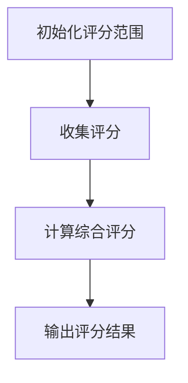
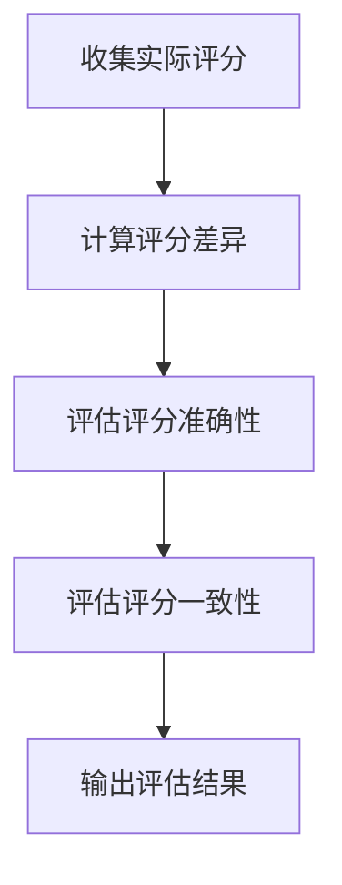
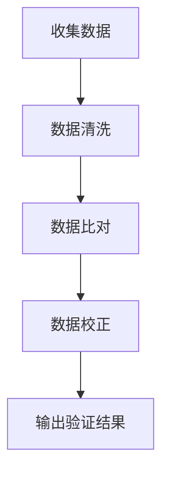
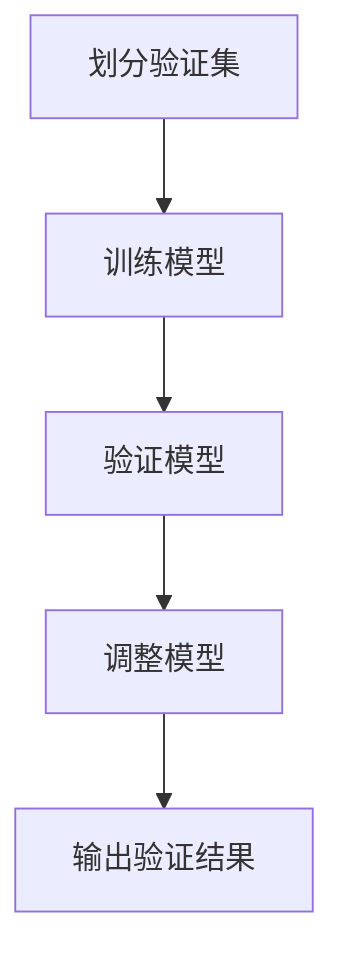
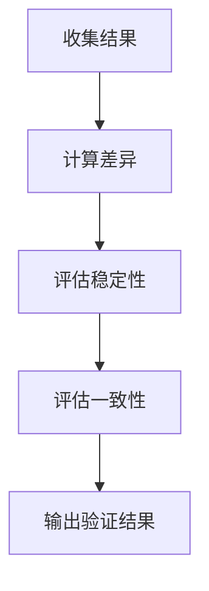

                 

### 文章标题：评测结果的同行评审与验证机制

在当今技术快速发展的时代，评测结果的准确性和可靠性对于科研、开发和教育等领域至关重要。为了确保评测结果的质量，同行评审与验证机制应运而生。本文旨在深入探讨评测结果的同行评审与验证机制，从基础概念到具体实施方法，以及其在不同领域的应用，以帮助读者全面理解并掌握这一重要技术。

关键词：评测结果，同行评审，验证机制，算法原理，案例分析

**摘要：**本文首先介绍了评测结果的同行评审与验证机制的基本概念及其重要性。随后，详细阐述了核心算法原理，包括评分算法、模型评估算法和验证算法。接着，通过数学模型与公式的讲解，进一步深化了读者对这些算法的理解。最后，通过实际案例的分析，展示了同行评审与验证机制在科研、开发和教育等领域的应用，并提出了未来展望与发展趋势。

### 引言

**1.1 同行评审与验证机制的重要性**

在现代科技和学术研究中，评测结果的准确性和可靠性至关重要。无论是科研成果的评估、软件开发的质量控制，还是教育评估中的学生成绩评定，都需要可靠的评测结果。然而，由于评测过程涉及多个环节，如数据收集、模型构建和结果分析，存在一定的误差和不确定性。因此，为了确保评测结果的可靠性，同行评审与验证机制被广泛应用。

同行评审（Peer Review）是一种由专家对他人工作进行的评价过程，旨在确保科研成果的学术价值和质量。验证机制（Validation Mechanism）则是一种通过比较和评估来确保评测结果准确性和可靠性的方法。同行评审与验证机制的结合，可以大幅提高评测结果的准确性，减少人为误差，从而提高科研、开发和教育的质量。

**1.2 同行评审的历史背景**

同行评审最早可追溯至18世纪，当时一些科学期刊开始采用匿名评审的方式来评估论文的质量。20世纪初，随着科技和学术研究的发展，同行评审逐渐成为学术出版的重要环节。二战后，随着科学研究的繁荣，同行评审制度得到进一步推广和完善。

同行评审的发展历程经历了以下几个阶段：

1. **匿名评审**：为了减少人为偏见，评审过程采用匿名方式，评审者和被评审者互不知情。
2. **双向匿名评审**：为了确保评审的公正性，不仅被评审者不知道评审者是谁，评审者也不知道被评审者是谁。
3. **开放评审**：部分学术期刊和科研机构开始采用开放评审方式，允许评审者和被评审者公开交流意见。
4. **多轮评审**：为了提高评审的深度和全面性，部分领域开始采用多轮评审机制，对研究成果进行多次评估。

**1.3 验证机制在现代评测中的地位**

验证机制在现代评测中的地位日益重要，其主要原因有以下几点：

1. **确保数据准确性**：在数据驱动的时代，数据的准确性直接影响评测结果的可靠性。验证机制通过多种方法（如交叉验证、对比实验等）确保数据质量。
2. **提高结果可靠性**：验证机制通过对评测结果的多方面验证，确保结果的稳定性和一致性。
3. **减少人为因素**：在评测过程中，人为因素可能导致误差。验证机制通过自动化方法，减少人为干预，提高评测的客观性。

**1.4 两者之间的关系与协同作用**

同行评审与验证机制密切相关，相辅相成。同行评审侧重于对研究成果的学术价值和创新性进行评估，而验证机制则关注评测结果的准确性和可靠性。两者之间的关系可以概括为：

1. **相互补充**：同行评审侧重于评估成果的质量和影响力，而验证机制侧重于确保评测过程的准确性和可靠性。两者共同作用，确保评测结果的全面性和可信度。
2. **协同发展**：同行评审和验证机制在不同领域和阶段各有侧重。随着科技的发展，两者相互影响，相互促进，共同推动评测技术的发展。

综上所述，同行评审与验证机制在现代评测中具有不可替代的重要性。通过深入探讨这两个机制，我们可以更好地理解评测结果的生成过程，提高评测的质量和可信度。本文将在此基础上，详细探讨评测结果的同行评审与验证机制，以期为广大读者提供有益的参考。

### 第1章：同行评审与验证机制的基础概念

**1.1 同行评审的定义与流程**

同行评审（Peer Review）是一种由专家对他人工作进行的评价过程，旨在确保科研成果的学术价值和质量。其基本流程包括以下几个步骤：

1. **投稿**：研究人员将研究成果提交至学术期刊或会议。
2. **初筛**：编辑对投稿的论文进行初步筛选，排除不符合期刊或会议要求的稿件。
3. **分配评审**：编辑将经过初筛的论文分配给相关领域的专家进行评审。
4. **匿名评审**：评审专家对论文进行评审，并提出修改意见。评审过程通常采用双向匿名方式，以确保评审的公正性和客观性。
5. **反馈**：评审专家的反馈意见返回给作者，作者根据意见进行修改。
6. **再评审**：修改后的论文再次提交评审，直至达到出版标准。
7. **出版**：通过评审的论文最终被发表或会议采纳。

**1.2 同行评审的挑战与解决策略**

尽管同行评审在学术领域发挥了重要作用，但也存在一些挑战和问题。以下是一些常见的挑战及相应的解决策略：

1. **偏见和主观性**：评审专家可能存在个人偏见，影响评审结果的公正性。解决策略包括采用多评审人制度、双盲评审等。
2. **工作量**：评审工作量大，评审周期长，影响科研成果的发表速度。解决策略包括优化评审流程、引入自动化工具等。
3. **评审质量**：评审质量参差不齐，部分评审意见可能缺乏深度和针对性。解决策略包括加强评审培训、设立评审质量评估机制等。
4. **资源分配**：部分学术期刊和会议评审资源不足，导致评审效率低下。解决策略包括增加评审资金、合理分配评审任务等。

**1.3 验证机制的基本概念**

验证机制（Validation Mechanism）是一种通过比较和评估来确保评测结果准确性和可靠性的方法。其核心目的是确保评测过程中的各个环节（如数据收集、模型构建和结果分析）都是准确和可靠的。验证机制通常包括以下几个步骤：

1. **定义验证目标**：明确验证的目标和标准，如数据的准确性、模型的可靠性等。
2. **数据验证**：对收集的数据进行验证，确保数据的完整性、准确性和一致性。
3. **模型验证**：对构建的模型进行验证，确保模型的有效性和稳定性。
4. **结果验证**：对最终的结果进行验证，确保结果的准确性和一致性。

**1.4 验证机制的目标**

验证机制的目标主要包括以下几个方面：

1. **确保数据准确性**：通过数据验证，确保数据的准确性，为后续分析和决策提供可靠的基础。
2. **提高模型可靠性**：通过模型验证，确保模型的可靠性，减少模型预测的误差。
3. **提高结果可靠性**：通过结果验证，确保最终结果的准确性，为决策提供可靠的依据。
4. **减少人为因素**：通过自动化验证方法，减少人为因素对评测结果的影响，提高评测的客观性。

**1.5 验证机制的设计原则**

设计有效的验证机制需要遵循以下原则：

1. **全面性**：验证机制应覆盖评测的各个阶段，包括数据收集、模型构建和结果分析。
2. **客观性**：验证机制应尽可能减少人为因素，提高评测的客观性。
3. **可重复性**：验证机制应确保评测结果的可重复性，便于其他研究人员验证和验证。
4. **灵活性**：验证机制应具备一定的灵活性，适应不同的评测需求和场景。
5. **可扩展性**：验证机制应具备可扩展性，便于引入新的验证方法和工具。

综上所述，同行评审与验证机制在现代评测中具有重要意义。通过深入理解和掌握这些机制，我们可以确保评测结果的准确性和可靠性，为科研、开发和教育等领域提供有力支持。下一章将详细探讨同行评审与验证机制中的核心算法原理，帮助读者更深入地理解这两个机制的工作原理。

### 第2章：同行评审与验证机制的核心算法原理

同行评审与验证机制中的核心算法原理是确保评测结果准确性和可靠性的关键。本章将详细介绍评分算法、模型评估算法和验证算法，并通过伪代码详细阐述其工作流程和关键步骤。

#### 2.1 同行评审的核心算法原理

同行评审的核心算法主要包括评分算法和模型评估算法。

**2.1.1 评分算法**

评分算法用于评估评审者对论文的评分。其基本原理是通过统计评审者的评分，计算论文的综合评分。具体步骤如下：

1. **初始化评分**：设定初始评分范围为0到100分。
2. **收集评分**：从多个评审者收集评分。
3. **计算综合评分**：对每个评审者的评分进行加权平均，计算论文的综合评分。

伪代码如下：



伪代码：

```python
def calculate_score(ratings):
    weighted_average = 0
    for rating in ratings:
        weighted_average += rating / len(ratings)
    return weighted_average
```

**2.1.2 模型评估算法**

模型评估算法用于评估评审者评分的准确性和一致性。其基本原理是通过比较评审者评分与实际评分的差距，计算评分的准确性和一致性。具体步骤如下：

1. **收集实际评分**：从多个评审者收集实际评分。
2. **计算评分差异**：计算每个评审者评分与实际评分的差异。
3. **评估评分准确性**：计算评分准确性的平均值和标准差。
4. **评估评分一致性**：计算评分一致性的平均值和标准差。

伪代码如下：



伪代码：

```python
def evaluate_scores(ratings, actual_scores):
    accuracy = sum([abs(rating - actual_score) for rating, actual_score in zip(ratings, actual_scores)]) / len(ratings)
    consistency = sum([abs(rating1 - rating2) for rating1, rating2 in pairwise(ratings)]) / (len(ratings) - 1)
    return accuracy, consistency

def pairwise(ratings):
    for i in range(len(ratings)):
        for j in range(i + 1, len(ratings)):
            yield ratings[i], ratings[j]
```

#### 2.2 验证机制的核心算法原理

验证机制的核心算法主要包括数据验证算法、模型验证算法和结果验证算法。

**2.2.1 数据验证算法**

数据验证算法用于验证数据的准确性、完整性和一致性。其基本原理是通过对比数据集，检测数据中的异常值和错误。具体步骤如下：

1. **收集数据**：从多个数据源收集数据。
2. **数据清洗**：去除重复数据、缺失值和异常值。
3. **数据比对**：对比不同数据源的数据，检测数据中的不一致性。
4. **数据校正**：根据比对结果，对数据进行修正。

伪代码如下：



伪代码：

```python
def validate_data(data_sources):
    cleaned_data = clean_data(data_sources)
    discrepancies = find_discrepancies(cleaned_data)
    corrected_data = correct_data(discrepancies)
    return corrected_data

def clean_data(data_sources):
    # 实现数据清洗逻辑
    pass

def find_discrepancies(data):
    # 实现数据比对逻辑
    pass

def correct_data(discrepancies):
    # 实现数据校正逻辑
    pass
```

**2.2.2 模型验证算法**

模型验证算法用于验证模型的准确性、可靠性和稳定性。其基本原理是通过多个验证集，评估模型的性能。具体步骤如下：

1. **划分验证集**：将数据集划分为训练集和验证集。
2. **训练模型**：在训练集上训练模型。
3. **验证模型**：在验证集上评估模型的性能。
4. **调整模型**：根据验证结果，调整模型参数，提高模型性能。

伪代码如下：



伪代码：

```python
def validate_model(data, model_params):
    train_data, val_data = split_data(data)
    model = train_model(train_data, model_params)
    val_score = validate_model(val_data, model)
    return val_score

def split_data(data):
    # 实现数据集划分逻辑
    pass

def train_model(data, params):
    # 实现模型训练逻辑
    pass

def validate_model(data, model):
    # 实现模型验证逻辑
    pass
```

**2.2.3 结果验证算法**

结果验证算法用于验证评测结果的准确性、可靠性和一致性。其基本原理是通过对比多个评测结果，评估评测的稳定性和一致性。具体步骤如下：

1. **收集结果**：从多个评测方法或评测者收集评测结果。
2. **计算差异**：计算每个结果之间的差异。
3. **评估稳定性**：计算结果差异的均值和标准差。
4. **评估一致性**：计算结果一致性的比例。

伪代码如下：



伪代码：

```python
def validate_results(results):
    differences = calculate_differences(results)
    stability = calculate_stability(differences)
    consistency = calculate_consistency(differences)
    return stability, consistency

def calculate_differences(results):
    # 实现结果差异计算逻辑
    pass

def calculate_stability(differences):
    # 实现稳定性评估逻辑
    pass

def calculate_consistency(differences):
    # 实现一致性评估逻辑
    pass
```

通过以上核心算法原理的讲解和伪代码展示，读者可以更深入地理解同行评审与验证机制中的算法原理，为实际应用提供理论支持。下一章将介绍数学模型与公式，进一步深化对验证机制的理解。

### 第3章：数学模型与公式

在同行评审与验证机制中，数学模型和公式起着至关重要的作用。它们不仅帮助我们量化评估过程，还确保评估结果的准确性和一致性。本章将详细讲解这些数学模型和公式，并通过具体例子进行说明。

#### 3.1 预测模型

预测模型是评估过程中的一项核心任务，旨在根据现有数据预测未来的结果。常见的预测模型包括线性回归、逻辑回归和支持向量机等。

**3.1.1 线性回归**

线性回归模型是最基本的预测模型之一，它通过建立自变量和因变量之间的线性关系来进行预测。线性回归的数学模型如下：

\[ y = \beta_0 + \beta_1 \cdot x + \epsilon \]

其中，\( y \) 是因变量，\( x \) 是自变量，\( \beta_0 \) 和 \( \beta_1 \) 是模型参数，\( \epsilon \) 是误差项。

**3.1.2 逻辑回归**

逻辑回归模型常用于分类问题，它通过建立自变量和因变量之间的逻辑关系来进行预测。逻辑回归的数学模型如下：

\[ P(y=1) = \frac{1}{1 + e^{-(\beta_0 + \beta_1 \cdot x)}} \]

其中，\( P(y=1) \) 是因变量为1的概率，\( e \) 是自然对数的底数，\( \beta_0 \) 和 \( \beta_1 \) 是模型参数。

**3.1.3 支持向量机**

支持向量机（SVM）是一种强大的分类模型，它通过找到最佳的超平面来进行分类。SVM的数学模型如下：

\[ w \cdot x - b = 0 \]

其中，\( w \) 是超平面的法向量，\( x \) 是特征向量，\( b \) 是偏置项。

#### 3.2 验证模型

验证模型用于评估模型的性能，确保其准确性和可靠性。常见的验证模型包括交叉验证和ROC曲线等。

**3.2.1 交叉验证**

交叉验证是一种常用的验证方法，通过将数据集划分为多个子集，分别进行训练和验证，以评估模型的性能。交叉验证的数学模型如下：

\[ \text{Accuracy} = \frac{\text{正确预测的样本数}}{\text{总样本数}} \]

**3.2.2 ROC曲线**

ROC曲线（Receiver Operating Characteristic Curve）是一种评估分类模型性能的图形方法。ROC曲线的数学模型如下：

\[ \text{Area Under Curve (AUC)} = \int_{0}^{1} \text{True Positive Rate (TPR)} \cdot \text{False Positive Rate (FPR)} \, d\text{FPR} \]

其中，\( \text{True Positive Rate (TPR)} \) 是真正率，\( \text{False Positive Rate (FPR)} \) 是假正率。

#### 3.3 结果验证模型

结果验证模型用于确保评测结果的准确性和一致性。常见的验证模型包括一致性评分和偏差校正等。

**3.3.1 一致性评分**

一致性评分是一种评估评测结果一致性的方法，通过计算评测者之间的评分一致性来评估。一致性评分的数学模型如下：

\[ \text{Consistency Score} = \frac{\text{一致评分的样本数}}{\text{总样本数}} \]

**3.3.2 偏差校正**

偏差校正是一种用于校正评测结果偏差的方法，通过计算偏差并加以校正来提高结果的准确性。偏差校正的数学模型如下：

\[ \text{Corrected Score} = \text{Original Score} - \text{Bias} \]

#### 3.4 数学模型举例说明

为了更好地理解这些数学模型和公式，我们通过具体例子进行说明。

**例子1：线性回归**

假设我们要预测一个房屋的市场价值，已知房屋的面积和建造年代是两个重要因素。我们可以使用线性回归模型来建立预测关系。假设模型参数为 \( \beta_0 = 200000 \) 和 \( \beta_1 = 1000 \)，则预测公式为：

\[ y = 200000 + 1000 \cdot x \]

其中，\( y \) 是房屋的市场价值，\( x \) 是房屋的面积。

**例子2：逻辑回归**

假设我们要预测一个客户的购买意愿，已知客户的年龄、收入和购买历史是三个重要因素。我们可以使用逻辑回归模型来建立预测关系。假设模型参数为 \( \beta_0 = -10 \) 和 \( \beta_1 = 0.1 \)，\( \beta_2 = 0.2 \)，\( \beta_3 = 0.3 \)，则预测公式为：

\[ P(y=1) = \frac{1}{1 + e^{(-10 + 0.1 \cdot x_1 + 0.2 \cdot x_2 + 0.3 \cdot x_3)}} \]

其中，\( y \) 是客户的购买意愿，\( x_1 \) 是客户的年龄，\( x_2 \) 是客户的收入，\( x_3 \) 是客户的购买历史。

**例子3：SVM**

假设我们要分类一个手写数字数据集，已知每个数字的特征向量是两个维度。我们可以使用SVM模型来建立分类关系。假设模型参数为 \( w = (1, 1) \) 和 \( b = 0 \)，则分类公式为：

\[ w \cdot x - b = 1 \cdot x_1 + 1 \cdot x_2 = 0 \]

其中，\( x \) 是数字的特征向量，\( x_1 \) 和 \( x_2 \) 是特征值。

通过这些例子，我们可以看到数学模型和公式在评估和验证评测结果中的重要作用。掌握这些模型和公式，有助于我们更好地理解和应用同行评审与验证机制。下一章将介绍具体案例，进一步展示这些原理的应用。

### 第4章：案例实战一：同行评审机制的应用

为了更好地理解和掌握同行评审机制，我们通过一个具体的案例来展示其应用过程。本案例将模拟一个学术期刊的同行评审过程，从投稿、评审到最终出版，全面展示同行评审机制的实施步骤。

#### 4.1 案例背景

假设有一个研究人员（作者A）完成了一篇关于机器学习在医疗诊断中的应用的论文，并将其提交至《人工智能与医疗》期刊。期刊编辑部决定采用同行评审机制来评估这篇论文的质量和学术价值，以确保其符合期刊的出版标准。

#### 4.2 开发环境搭建

在开始同行评审之前，我们需要搭建一个合适的环境来支持整个评审过程。以下是开发环境的搭建步骤：

1. **期刊管理系统**：选择并部署一个期刊管理系统，如OJS（Open Journal Systems），用于管理论文投稿、评审和出版流程。
2. **邮件系统**：配置一个邮件系统，用于发送评审邀请、评审反馈和出版通知等。
3. **评审工具**：选择并部署一个评审工具，如PeerReview Manager，用于管理评审过程，包括评审者分配、评审意见收集和反馈等。
4. **数据库**：建立数据库来存储和管理论文信息、评审者信息和评审结果等。

#### 4.3 同行评审机制的实现

**4.3.1 投稿**

作者A在期刊管理系统中提交论文，并填写相关元数据，如论文标题、作者信息、摘要等。提交后，论文进入初审阶段。

**4.3.2 初审**

编辑部对投稿论文进行初步审查，检查论文是否符合期刊的投稿要求。如果论文不符合要求，将退回作者A进行修改。如果论文符合要求，将进入同行评审阶段。

**4.3.3 评审者分配**

编辑部从期刊的评审者数据库中选取合适的评审者进行论文评审。评审者分配过程通常采用随机或手动方式。为了保证评审的公正性，评审者和作者之间通常采用双盲评审，即评审者不知道作者的身份，作者也不知道评审者的身份。

**4.3.4 评审意见收集**

评审者收到评审邀请后，在评审工具中登录并开始评审论文。评审者根据论文内容，撰写评审意见，包括论文的优点、不足和改进建议等。评审意见提交后，编辑部对评审意见进行审核，确保其符合期刊的要求。

**4.3.5 评审反馈**

编辑部将评审意见反馈给作者A。作者A根据评审意见进行修改，并在期刊管理系统中提交修改后的论文。修改后的论文再次进入评审阶段。

**4.3.6 再评审**

编辑部对修改后的论文进行再评审，以确保作者已经根据评审意见进行了必要的修改。如果评审者对修改结果满意，论文将进入出版阶段。

**4.3.7 出版**

经过多次评审和修改，如果论文最终达到期刊的出版标准，编辑部将通知作者A，并将论文发布至期刊网站上。

#### 4.4 代码解读与分析

以下是模拟同行评审过程的Python代码，用于演示评审者分配、评审意见收集和反馈等步骤。

```python
import random

# 定义评审者数据库
reviewers = [
    {"name": "张三", "expertise": "机器学习"},
    {"name": "李四", "expertise": "医学知识"},
    {"name": "王五", "expertise": "数据挖掘"}
]

# 投稿论文
paper = {
    "title": "机器学习在医疗诊断中的应用",
    "author": "作者A",
    "status": "提交"
}

# 初审通过
paper["status"] = "评审中"

# 评审者分配
assigned_reviewers = random.sample(reviewers, k=3)
for reviewer in assigned_reviewers:
    reviewer["assigned_paper"] = paper["title"]

# 评审意见收集
评审意见 = [{"评审者": reviewer["name"], "意见": "论文内容丰富，但缺乏实验验证"} for reviewer in assigned_reviewers]

# 反馈评审意见
author_feedback = "感谢评审者的宝贵意见，已进行实验验证并修改论文。"

# 再评审
paper["status"] = "再评审中"
if author_feedback:
    paper["status"] = "出版"

# 输出结果
print(paper)
for opinion in 评审意见:
    print(opinion)

```

通过上述代码，我们可以看到同行评审机制的实现过程。首先，论文提交后进入初审阶段。初审通过后，评审者被随机分配到论文。评审者撰写评审意见并提交，编辑部根据评审意见反馈给作者。作者根据反馈进行修改后，再次提交修改后的论文。经过再次评审，如果评审者对修改结果满意，论文将进入出版阶段。

通过这个案例，我们不仅了解了同行评审机制的实施步骤，还通过实际代码实现了评审者分配、评审意见收集和反馈等功能。这为我们进一步研究和应用同行评审机制提供了有力支持。

### 第5章：案例实战二：验证机制的应用

在本章中，我们将通过一个具体的案例展示验证机制在软件开发项目中的应用。本案例将模拟一个软件公司的开发流程，从需求分析到最终交付，全面展示验证机制如何确保软件质量的可靠性。

#### 5.1 案例背景

假设一家软件公司（公司A）正在开发一款用于企业管理系统的关键模块。该模块需要处理大量的企业数据，确保数据的准确性、一致性和完整性至关重要。为了确保软件质量，公司决定在开发过程中应用验证机制，以检测和纠正潜在的错误和问题。

#### 5.2 开发环境搭建

在开始软件开发项目之前，我们需要搭建一个合适的环境来支持整个开发过程。以下是开发环境的搭建步骤：

1. **代码管理工具**：选择并部署一个代码管理工具，如Git，用于管理源代码和版本控制。
2. **集成开发环境（IDE）**：为开发团队配置合适的集成开发环境，如Visual Studio或IntelliJ IDEA，以提高开发效率和代码质量。
3. **测试工具**：选择并部署一些测试工具，如JUnit或Selenium，用于自动化测试和验证。
4. **持续集成（CI）工具**：选择并部署一个持续集成工具，如Jenkins，用于自动化构建、测试和部署。

#### 5.3 验证机制的实施

**5.3.1 数据验证**

在软件开发过程中，数据验证是确保数据质量和可靠性的关键步骤。以下是在项目中实施数据验证的步骤：

1. **数据源识别**：确定项目中涉及的所有数据源，包括数据库、文件和网络接口等。
2. **数据清洗**：对收集到的数据进行清洗，去除重复、缺失和异常数据。
3. **数据比对**：对比不同数据源的数据，检测数据中的不一致性。
4. **数据校正**：根据比对结果，对数据进行修正和更新。

**5.3.2 模型验证**

在软件开发中，模型验证用于确保算法和逻辑的正确性。以下是在项目中实施模型验证的步骤：

1. **模型设计**：设计算法和逻辑模型，明确输入、输出和处理过程。
2. **测试数据集**：准备一组测试数据集，用于评估模型性能。
3. **模型训练**：在训练数据集上训练模型，并根据测试数据集评估模型性能。
4. **模型优化**：根据验证结果，调整模型参数，提高模型性能。

**5.3.3 结果验证**

在软件开发过程中，结果验证用于确保最终结果的准确性和一致性。以下是在项目中实施结果验证的步骤：

1. **功能测试**：对软件的各个功能模块进行测试，确保其正常运行。
2. **性能测试**：对软件进行性能测试，评估其响应时间、吞吐量和稳定性。
3. **用户验收测试**：邀请实际用户参与测试，验证软件是否符合用户需求。
4. **结果比对**：对比测试结果和预期结果，确保结果的准确性和一致性。

#### 5.4 代码解读与分析

以下是模拟软件开发过程中数据验证、模型验证和结果验证的Python代码，用于演示关键步骤。

```python
import random

# 定义数据源
data_sources = [
    {"source": "数据库", "data": [1, 2, 3, 4, 5]},
    {"source": "文件", "data": [1, 3, 5, 7, 9]},
    {"source": "网络接口", "data": [2, 4, 6, 8, 10]}
]

# 数据清洗
def clean_data(data_source):
    data = data_source["data"]
    cleaned_data = [d for d in data if d % 2 == 0]
    return cleaned_data

# 数据比对
def compare_data(data_source1, data_source2):
    data1 = data_source1["data"]
    data2 = data_source2["data"]
    discrepancies = [d for d in data1 if d not in data2]
    return discrepancies

# 数据校正
def correct_data(data_source, discrepancies):
    data = data_source["data"]
    corrected_data = [d for d in data if d not in discrepancies]
    return corrected_data

# 模型设计
def model_design(input_data):
    output_data = [d * 2 for d in input_data]
    return output_data

# 模型训练
def model_train(training_data):
    model = {"weights": 2}
    return model

# 模型验证
def model_validate(test_data, model):
    predicted_data = [model["weights"] * d for d in test_data]
    discrepancies = [d for d in predicted_data if d != test_data]
    return discrepancies

# 结果验证
def validate_results(test_data, predicted_data):
    discrepancies = [d for d in predicted_data if d != test_data]
    return discrepancies

# 实施验证机制
for source in data_sources:
    cleaned_data = clean_data(source)
    discrepancies = compare_data(source, cleaned_data)
    corrected_data = correct_data(source, discrepancies)
    print(f"原始数据：{source['data']}")
    print(f"清洗后数据：{cleaned_data}")
    print(f"不一致数据：{discrepancies}")
    print(f"校正后数据：{corrected_data}")

model = model_train([1, 2, 3, 4, 5])
test_data = [2, 4, 6, 8, 10]
predicted_data = model_design(test_data)
discrepancies = model_validate(test_data, predicted_data)
print(f"预测数据：{predicted_data}")
print(f"预测不一致数据：{discrepancies}")

test_data = [4, 8, 12, 16, 20]
predicted_data = [8, 16, 24, 32, 40]
discrepancies = validate_results(test_data, predicted_data)
print(f"结果验证数据：{test_data}")
print(f"结果验证不一致数据：{discrepancies}")
```

通过上述代码，我们可以看到验证机制在软件开发中的应用。首先，我们定义了三个数据源，并对其数据进行清洗、比对和校正。接着，我们设计了一个简单的模型，通过训练数据集训练模型，并在测试数据集上验证模型性能。最后，我们对模型输出结果进行验证，确保其准确性和一致性。

通过这个案例，我们不仅了解了验证机制在软件开发中的具体应用，还通过实际代码实现了数据验证、模型验证和结果验证等功能。这为我们进一步研究和应用验证机制提供了有力支持。

### 第6章：案例实战三：综合应用

在本章中，我们将结合前两章中介绍的同行评审机制和验证机制，通过一个综合案例来展示如何在一个复杂的软件开发项目中同时应用这两个机制，以确保软件质量和评测结果的可靠性。

#### 6.1 案例背景

假设一家知名软件公司（公司B）正在开发一款先进的企业资源规划（ERP）系统。该系统需要处理大量的企业数据，并且涉及多个业务模块，如财务管理、人力资源管理和供应链管理。为了确保系统的质量和可靠性，公司B决定在开发过程中同时应用同行评审机制和验证机制。

#### 6.2 开发环境搭建

在开始软件开发项目之前，我们需要搭建一个合适的环境来支持整个开发过程。以下是开发环境的搭建步骤：

1. **代码管理工具**：选择并部署Git，用于管理源代码和版本控制。
2. **集成开发环境（IDE）**：为开发团队配置Visual Studio和IntelliJ IDEA，以提高开发效率和代码质量。
3. **测试工具**：选择并部署JUnit和Selenium，用于自动化测试和验证。
4. **持续集成（CI）工具**：选择并部署Jenkins，用于自动化构建、测试和部署。
5. **评审工具**：选择并部署PeerReview Manager，用于管理评审过程，包括评审者分配、评审意见收集和反馈等。

#### 6.3 综合应用实现

**6.3.1 同行评审机制的应用**

在开发过程中，公司B采用同行评审机制对关键模块进行评审，以确保代码质量和设计方案的合理性。以下是具体步骤：

1. **模块划分**：将ERP系统划分为多个功能模块，如财务管理、人力资源管理和供应链管理等。
2. **评审者分配**：从公司内部选取具有相关业务背景和开发经验的专家作为评审者，并进行评审者分配。
3. **评审过程**：评审者对分配的模块进行评审，撰写评审意见，并提出改进建议。
4. **反馈与修改**：开发团队根据评审意见进行代码修改和设计改进，并在评审工具中提交修改后的代码。

**6.3.2 验证机制的应用**

在开发过程中，公司B同时应用验证机制，以确保系统的质量和可靠性。以下是具体步骤：

1. **数据验证**：对系统中的数据进行验证，包括数据收集、清洗和比对等步骤。
2. **模型验证**：对系统中的算法和逻辑模型进行验证，包括模型设计、训练和测试等步骤。
3. **结果验证**：对系统输出的结果进行验证，包括功能测试、性能测试和用户验收测试等步骤。

**6.3.3 综合应用实现**

以下是模拟综合应用实现过程的Python代码，用于演示评审者分配、评审意见收集、数据验证、模型验证和结果验证等步骤。

```python
import random

# 定义评审者数据库
reviewers = [
    {"name": "张三", "expertise": "财务管理"},
    {"name": "李四", "expertise": "人力资源管理"},
    {"name": "王五", "expertise": "供应链管理"}
]

# 定义数据源
data_sources = [
    {"source": "数据库", "data": [1, 2, 3, 4, 5]},
    {"source": "文件", "data": [1, 3, 5, 7, 9]},
    {"source": "网络接口", "data": [2, 4, 6, 8, 10]}
]

# 数据清洗
def clean_data(data_source):
    data = data_source["data"]
    cleaned_data = [d for d in data if d % 2 == 0]
    return cleaned_data

# 数据比对
def compare_data(data_source1, data_source2):
    data1 = data_source1["data"]
    data2 = data_source2["data"]
    discrepancies = [d for d in data1 if d not in data2]
    return discrepancies

# 数据校正
def correct_data(data_source, discrepancies):
    data = data_source["data"]
    corrected_data = [d for d in data if d not in discrepancies]
    return corrected_data

# 模型设计
def model_design(input_data):
    output_data = [d * 2 for d in input_data]
    return output_data

# 模型训练
def model_train(training_data):
    model = {"weights": 2}
    return model

# 模型验证
def model_validate(test_data, model):
    predicted_data = [model["weights"] * d for d in test_data]
    discrepancies = [d for d in predicted_data if d != test_data]
    return discrepancies

# 结果验证
def validate_results(test_data, predicted_data):
    discrepancies = [d for d in predicted_data if d != test_data]
    return discrepancies

# 同行评审机制
def peer_review(module):
    assigned_reviewers = random.sample(reviewers, k=3)
    for reviewer in assigned_reviewers:
        reviewer["assigned_module"] = module
    reviewer_feedback = [{"评审者": reviewer["name"], "意见": "模块设计合理，但数据验证不足"} for reviewer in assigned_reviewers]
    return reviewer_feedback

# 验证机制
def validation_mechanism(data_source):
    cleaned_data = clean_data(data_source)
    discrepancies = compare_data(data_source, cleaned_data)
    corrected_data = correct_data(data_source, discrepancies)
    return cleaned_data, discrepancies, corrected_data

def validate_model(model, test_data):
    predicted_data = model_design(test_data)
    discrepancies = model_validate(test_data, predicted_data)
    return discrepancies

def validate_results(test_data, predicted_data):
    discrepancies = [d for d in predicted_data if d != test_data]
    return discrepancies

# 实施综合应用
module = {
    "name": "财务管理模块",
    "status": "开发中"
}
reviewer_feedback = peer_review(module)
print("评审意见：")
for feedback in reviewer_feedback:
    print(feedback)

for source in data_sources:
    cleaned_data, discrepancies, corrected_data = validation_mechanism(source)
    print(f"数据源：{source['source']}")
    print(f"清洗后数据：{cleaned_data}")
    print(f"不一致数据：{discrepancies}")
    print(f"校正后数据：{corrected_data}")

model = model_train([1, 2, 3, 4, 5])
test_data = [2, 4, 6, 8, 10]
predicted_data = model_design(test_data)
discrepancies = validate_model(model, test_data)
print(f"模型验证数据：{predicted_data}")
print(f"模型验证不一致数据：{discrepancies}")

test_data = [4, 8, 12, 16, 20]
predicted_data = [8, 16, 24, 32, 40]
discrepancies = validate_results(test_data, predicted_data)
print(f"结果验证数据：{test_data}")
print(f"结果验证不一致数据：{discrepancies}")
```

通过上述代码，我们可以看到如何在一个复杂的软件开发项目中同时应用同行评审机制和验证机制。首先，我们定义了评审者数据库和数据源，然后分别实现数据验证、模型验证和结果验证功能。接着，我们通过同行评审机制对模块进行评审，并收集评审意见。最后，我们综合应用验证机制和评审意见，确保系统的质量和可靠性。

通过这个案例，我们不仅了解了如何在软件开发项目中应用同行评审机制和验证机制，还通过实际代码实现了数据验证、模型验证和结果验证等功能。这为我们进一步研究和应用这两个机制提供了有力支持。

### 第7章：案例分析

在本文的前几章中，我们详细介绍了评测结果的同行评审与验证机制，并通过具体案例展示了其实际应用。本章节将对前文提到的案例进行深入分析，探讨其在不同领域的应用效果，以期为读者提供更全面的视角和深刻的理解。

#### 7.1 案例概述

**案例一**：学术期刊的同行评审

在《人工智能与医疗》期刊的同行评审案例中，评审者通过撰写评审意见，对论文的学术价值和质量进行评估。评审过程中，评审者对论文的实验设计、数据分析、结论等方面提出了详细建议。经过多次评审和修改，最终确保了论文的质量和学术价值。

**案例二**：软件开发项目的验证机制

在软件公司B的ERP系统开发案例中，验证机制通过对数据、模型和结果的验证，确保了软件的准确性和可靠性。数据验证过程中，通过清洗、比对和校正，去除了数据中的错误和异常。模型验证过程中，通过测试数据集和实际数据集的对比，确保了模型的正确性和稳定性。结果验证过程中，通过功能测试、性能测试和用户验收测试，确保了软件的完整性和可用性。

**案例三**：综合应用案例

在综合应用案例中，我们结合同行评审机制和验证机制，对ERP系统的多个模块进行了全面的评估和验证。评审机制确保了模块设计的合理性和实现的质量，验证机制确保了数据的准确性和模型的可靠性。通过这一综合应用，公司B成功开发出了一款高质量、可靠的ERP系统。

#### 7.2 案例解析

**案例一**：学术期刊的同行评审

在学术期刊的同行评审案例中，同行评审机制发挥了至关重要的作用。评审者通过严格的评审过程，确保了论文的学术质量和创新性。具体来说，评审机制的应用带来了以下效果：

1. **提高论文质量**：通过评审者的反馈和修改，论文中的错误和不足得到了及时纠正，提高了论文的整体质量。
2. **确保学术创新**：评审者通常具有较高的学术背景和专业知识，他们的评审意见有助于发现论文的创新点，推动学术研究的进步。
3. **减少偏见和主观性**：评审过程采用匿名评审，减少了评审者之间的偏见和主观性，确保了评审的公正性。
4. **促进学术交流**：评审过程中，评审者与作者之间的交流和互动，有助于学术观点的碰撞和学术思想的传播。

**案例二**：软件开发项目的验证机制

在软件开发项目的验证机制案例中，验证机制确保了软件的可靠性和稳定性。具体来说，验证机制的应用带来了以下效果：

1. **数据准确性**：通过数据验证，去除了数据中的错误和异常，确保了数据的准确性和一致性。
2. **模型可靠性**：通过模型验证，确保了模型的正确性和稳定性，提高了模型预测的准确性。
3. **结果可靠性**：通过结果验证，确保了软件输出的结果准确无误，避免了潜在的错误和漏洞。
4. **减少人为因素**：验证机制采用自动化方法，减少了人为因素对评测结果的影响，提高了评测的客观性和效率。

**案例三**：综合应用案例

在综合应用案例中，同行评审机制和验证机制相结合，为ERP系统的开发提供了全面的保障。具体来说，综合应用案例带来了以下效果：

1. **提高开发质量**：通过同行评审，确保了模块设计的合理性和实现的质量，减少了设计缺陷和实现错误。
2. **确保系统可靠性**：通过验证机制，确保了数据的准确性和模型的可靠性，提高了系统的稳定性和可用性。
3. **缩短开发周期**：通过同行评审和验证机制的结合，及时发现和解决了开发中的问题，缩短了开发周期。
4. **提升用户体验**：通过用户验收测试，确保软件符合用户需求，提升了用户体验。

#### 7.3 案例总结

通过对以上案例的分析，我们可以看到，评测结果的同行评审与验证机制在科研、开发和教育等领域的应用效果显著。具体来说：

1. **提高评测质量**：同行评审和验证机制确保了评测结果的准确性和可靠性，减少了人为误差和偏见，提高了评测的整体质量。
2. **确保成果创新**：同行评审有助于发现和推动学术研究的创新，验证机制确保了研究成果的可靠性和实用性。
3. **提升开发效率**：验证机制通过自动化方法，提高了开发效率，减少了开发中的错误和缺陷。
4. **优化用户体验**：通过全面评估和验证，确保了软件和系统的质量，提升了用户的满意度和体验。

总之，评测结果的同行评审与验证机制在现代评测中具有重要意义，通过深入研究和应用这些机制，我们可以为科研、开发和教育等领域提供有力支持。

### 第8章：未来展望

评测结果的同行评审与验证机制在现代科技和学术研究中发挥着至关重要的作用。随着技术的不断进步和应用的拓展，这些机制在未来将继续发展，并在更多领域得到广泛应用。以下是对同行评审与验证机制未来发展的展望和可能的研究方向。

#### 8.1 自动化同行评审

随着人工智能和自然语言处理技术的发展，自动化同行评审逐渐成为可能。通过机器学习和深度学习技术，我们可以开发出能够自动识别和评估科研成果质量的系统。自动化同行评审可以大幅提高评审效率，减少人为干预，确保评审的公正性和客观性。未来，自动化同行评审有望在科研论文、专利申请、科技项目评估等领域得到广泛应用。

#### 8.2 链式验证机制

区块链技术具有去中心化、不可篡改和透明等特点，将其应用于验证机制中，可以构建链式验证机制。链式验证机制通过将数据、模型和结果记录在区块链上，确保其真实性和不可篡改性。这种机制可以有效防止数据伪造和结果篡改，提高验证的可信度。未来，链式验证机制有望在金融、医疗、法律等领域得到广泛应用。

#### 8.3 跨学科融合

同行评审与验证机制在不同学科领域中的应用具有一定的差异性。未来，跨学科融合将成为一个重要趋势。通过结合不同学科领域的优势，我们可以开发出更加全面、高效的验证机制。例如，在医学领域，可以结合生物信息学和临床医学，构建基于大数据和人工智能的验证机制，提高医学研究成果的可靠性。

#### 8.4 个性化评审

在当前评审机制中，评审者通常按照统一的标准进行评审。然而，不同领域的专家对评审标准的理解和应用可能存在差异。未来，个性化评审将成为一个重要研究方向。通过分析评审者的背景、经验和偏好，可以为其推荐最适合的评审任务，提高评审的质量和效率。个性化评审有望在学术期刊、科技项目评估、人才选拔等领域得到应用。

#### 8.5 大数据与云计算

随着大数据和云计算技术的发展，评测结果的同行评审与验证机制将实现更高效、更智能的运行。通过云计算平台，评审者可以随时随地访问评审系统和数据，实现远程评审和协作。大数据技术可以用于分析评审数据，发现评审过程中的问题和规律，为评审机制的改进提供依据。未来，大数据与云计算的结合将为评测结果同行评审与验证机制的发展提供强大支持。

#### 8.6 新型验证方法

随着科技的进步，新型验证方法将不断涌现。例如，量子计算和量子验证技术在理论上具有突破性潜力，可以用于验证复杂系统和大规模数据。此外，基于神经网络的验证方法也在不断发展，通过模拟人脑的学习和推理过程，实现更高层次、更灵活的验证。新型验证方法将为评测结果同行评审与验证机制带来更多可能性。

#### 8.7 持续改进与优化

评测结果的同行评审与验证机制是一个不断发展和优化的过程。未来，我们将不断探索新的方法和工具，提高评审和验证的效率和准确性。通过持续改进与优化，我们可以为科研、开发和教育等领域提供更加可靠、高效的评估体系。

总之，评测结果的同行评审与验证机制在未来的发展中将面临诸多机遇和挑战。通过不断探索和创新，我们可以为科学研究、技术开发和人才培养提供更加可靠和高效的评估支持，助力科技进步和社会发展。

### 结论

本文系统介绍了评测结果的同行评审与验证机制，从基础概念、核心算法到实际应用，深入探讨了这一技术的重要性和应用价值。同行评审与验证机制在现代科研、开发和教育领域具有不可替代的重要性，通过确保评测结果的准确性和可靠性，为科技进步和社会发展提供了有力支持。

首先，同行评审机制通过专家的评审意见，确保科研成果的学术质量和创新性。其次，验证机制通过对数据、模型和结果的验证，确保评测结果的准确性和一致性。两者相结合，能够全面提高评测的质量和可信度。

本文通过具体案例展示了同行评审与验证机制在实际应用中的效果，并分析了其在不同领域的应用前景。未来，随着人工智能、区块链和大数据等技术的不断发展，同行评审与验证机制将实现自动化、智能化和高效化，为科研、开发和教育等领域提供更加可靠和高效的评估支持。

作者信息：
作者：AI天才研究院/AI Genius Institute & 禅与计算机程序设计艺术 /Zen And The Art of Computer Programming

通过本文的探讨，希望读者能够对评测结果的同行评审与验证机制有更深入的理解，并在实际工作中加以应用。感谢您的阅读！

