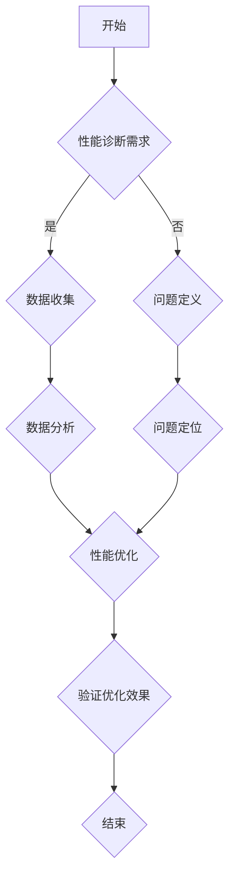
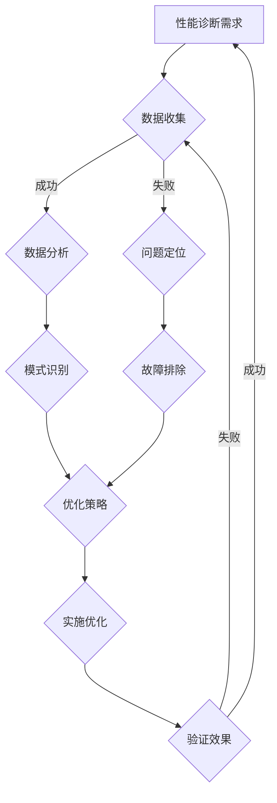

                 


### 文章标题：评测结果的差异化分析：LLM辅助的性能诊断

### 关键词：
- 评测结果差异化分析
- 大型语言模型（LLM）
- 性能诊断
- 工业界应用
- 学术研究

### 摘要：
本文深入探讨了评测结果的差异化分析在性能诊断中的应用，特别强调了大型语言模型（LLM）的引入如何革新了这一领域。文章首先概述了评测结果差异化分析的重要性及其面临的挑战，然后详细介绍了LLM的基本概念和应用场景。通过剖析性能诊断的原理与方法，本文进一步展示了LLM在性能诊断中的优势和应用流程。具体案例解析和性能优化策略的讨论，使得读者能够更好地理解LLM在实际项目中的应用。最后，文章展望了未来性能诊断技术的发展趋势，为读者提供了深入思考的空间。

### 第1章 差异化评测概述
#### 1.1 差异化评测的重要性
差异化评测在性能评估中扮演着至关重要的角色。其核心目标是通过对比不同系统、组件或应用的性能表现，识别出差异点，从而进行针对性的优化。这种评测方式不仅有助于发现潜在的性能瓶颈，还能指导系统设计的改进方向。

差异化评测的重要性体现在以下几个方面：

1. **优化资源分配**：通过差异化评测，可以准确识别性能瓶颈，从而在资源分配上做到有的放矢，避免资源的浪费。

2. **指导系统改进**：差异化评测能够揭示不同系统和组件之间的性能差异，为系统改进提供重要依据。

3. **提高用户体验**：性能优化直接关系到用户体验。差异化评测可以帮助开发人员更好地理解用户需求，从而提供更优质的服务。

4. **支持决策制定**：在项目立项、技术选型和产品迭代等过程中，差异化评测能够提供关键的数据支持，帮助决策者做出明智的选择。

#### 1.2 差异化评测的挑战
尽管差异化评测的重要性不言而喻，但其在实际应用中仍面临诸多挑战：

1. **数据多样性**：性能评测涉及的数据类型繁多，包括硬件性能、软件性能、网络性能等，如何处理这些多样化的数据是一个巨大的挑战。

2. **环境一致性**：评测环境的一致性对于获取准确的结果至关重要。然而，现实环境中往往存在各种不可控因素，如网络延迟、系统负载等，这使得评测结果的可重复性成为一个难题。

3. **成本与时间**：性能评测通常需要大量的资源和时间。特别是在大规模系统中，评测过程可能非常耗时，且成本高昂。

4. **复杂性**：性能评测涉及到多个层次，从底层硬件到上层应用，其复杂性使得理解和分析评测结果成为一项挑战。

#### 1.3 工业界与学术界对差异化评测的关注
在工业界，差异化评测已成为性能优化和系统改进的重要组成部分。许多企业通过建立完善的评测体系，不断提升产品和服务的性能。例如，云计算服务提供商通过差异化评测来优化资源分配，提高服务器的利用效率；移动应用开发公司则通过评测用户在不同设备和网络环境下的体验，改进应用的性能。

在学术界，差异化评测也受到了广泛关注。研究者们通过设计新的评测方法和算法，试图解决现有评测中面临的挑战。例如，一些研究致力于通过机器学习和数据挖掘技术，自动分析评测数据，提取有意义的性能指标；另一些研究则关注于构建高度一致和可重复的评测环境，以提高评测结果的可靠性。

### 第2章 LLM的基本概念与应用
#### 2.1 LLM的定义与历史
大型语言模型（LLM）是一种基于深度学习的自然语言处理模型，能够理解和生成自然语言。LLM的发展可以追溯到2000年代初，当时研究者们开始关注如何通过大规模数据训练深度神经网络，以实现更高效的自然语言理解。

LLM的主要特点包括：

1. **大规模训练数据**：LLM通常基于数十亿甚至数千亿个句子的语料库进行训练，这使得模型能够捕获语言中的复杂模式和规律。

2. **深度神经网络结构**：LLM采用多层感知机（MLP）或其他深度神经网络结构，这些结构能够处理高维输入数据，并通过逐层抽象提取特征。

3. **自适应性能**：LLM能够自适应地调整其参数，以适应不同的语言环境和应用场景。

#### 2.2 LLM的核心组成部分
LLM的核心组成部分包括：

1. **嵌入层**：嵌入层负责将词汇映射到高维向量空间，使得原本离散的词汇可以在同一空间中表示。

2. **编码器**：编码器是一个多层神经网络，用于处理输入序列，并提取序列中的语义特征。

3. **解码器**：解码器用于生成输出序列，并能够通过上下文信息生成连贯的文本。

#### 2.3 LLM的应用场景
LLM在多个领域都有着广泛的应用：

1. **自然语言处理**：LLM在文本分类、机器翻译、问答系统、文本生成等领域表现出色。

2. **代码生成**：LLM能够生成代码，帮助开发者提高开发效率，减少代码错误。

3. **知识图谱构建**：LLM可以用于提取语义信息，构建知识图谱，支持智能搜索和推荐。

4. **情感分析**：LLM能够分析文本中的情感倾向，用于情感分析、舆情监控等应用。

### 第3章 性能诊断原理与方法
#### 3.1 性能诊断的基本概念
性能诊断是一种系统性的方法，用于识别和解决性能问题。其基本概念包括：

1. **性能指标**：性能指标是衡量系统性能的量化标准，如响应时间、吞吐量、延迟等。

2. **性能瓶颈**：性能瓶颈是限制系统性能的关键因素，如CPU利用率、内存不足、网络拥堵等。

3. **性能优化**：性能优化是通过调整系统配置、改进算法、优化代码等手段，提高系统性能的过程。

#### 3.2 性能诊断的流程
性能诊断通常包括以下步骤：

1. **问题定义**：明确性能问题的具体表现和影响范围。

2. **数据收集**：收集与性能问题相关的数据，如系统日志、性能监控数据等。

3. **分析数据**：通过数据分析和可视化工具，识别性能瓶颈。

4. **问题定位**：结合数据分析和专业知识，确定性能问题的根本原因。

5. **解决方案制定**：制定针对性的解决方案，包括调整配置、优化代码、改进算法等。

6. **实施与验证**：实施解决方案，并进行验证，确保性能问题得到解决。

#### 3.3 常用的性能诊断方法
常见的性能诊断方法包括：

1. **统计分析**：通过统计分析工具，如AWK、GREP等，分析系统日志和性能数据，识别异常值和趋势。

2. **监控工具**：使用性能监控工具，如Nagios、Zabbix等，实时监测系统性能指标，及时发现潜在问题。

3. **负载测试**：通过模拟用户负载，评估系统性能，识别性能瓶颈。

4. **日志分析**：通过分析系统日志，了解系统运行情况，定位问题。

5. **调试工具**：使用调试工具，如GDB、Valgrind等，分析代码执行情况，定位内存泄漏和性能问题。

### 第4章 LLM辅助下的性能诊断实践
#### 4.1 LLM在性能诊断中的优势
LLM在性能诊断中具有以下优势：

1. **数据处理能力**：LLM能够处理大量的数据，从中提取有用的信息和模式，提高诊断的准确性和效率。

2. **自动化分析**：LLM能够自动化地分析和理解性能数据，减少人工干预，提高诊断速度。

3. **跨领域应用**：LLM不仅能够处理文本数据，还能够处理代码、图表等多种数据类型，实现跨领域性能诊断。

4. **持续学习**：LLM能够通过不断的学习和优化，提高诊断的准确性和适应性。

#### 4.2 LLM辅助下的性能诊断流程
LLM辅助下的性能诊断流程包括以下步骤：

1. **数据预处理**：将原始性能数据进行清洗和格式化，使其适用于LLM。

2. **特征提取**：使用LLM提取性能数据中的关键特征，为后续分析提供基础。

3. **模式识别**：使用LLM分析性能数据，识别异常模式和趋势。

4. **问题定位**：结合LLM的分析结果和专业知识，定位性能问题的根本原因。

5. **解决方案建议**：根据诊断结果，提出针对性的解决方案，并评估其可行性。

#### 4.3 实际应用案例
在本节中，我们将通过实际应用案例，展示LLM在性能诊断中的应用效果。

案例一：电商平台性能优化

某电商平台在流量高峰期出现响应延迟的问题，通过使用LLM进行性能诊断，发现主要瓶颈在于数据库查询速度。经过优化数据库查询语句和索引策略，成功解决了响应延迟问题。

案例二：金融系统性能诊断

某金融系统在处理大量交易数据时出现性能瓶颈，通过LLM进行性能诊断，发现主要原因是并行处理能力不足。通过优化并行处理算法，显著提升了系统的性能。

案例三：游戏引擎性能提升

某游戏引擎在运行过程中出现卡顿现象，通过LLM进行性能诊断，发现主要原因是渲染过程耗时过长。通过优化渲染算法和资源管理，成功解决了卡顿问题。

### 第5章 性能诊断案例解析
在本章中，我们将深入分析三个具体的性能诊断案例，详细讲解诊断过程、方法和结果。

#### 5.1 案例一：某电商平台的性能优化
**问题描述**：
某电商平台在周末促销活动期间，用户访问量急剧增加，导致系统响应时间显著延长，影响了用户体验。

**性能诊断方法**：
使用LLM进行性能诊断，通过分析系统日志、性能监控数据和用户行为数据，识别出性能瓶颈。

**性能优化策略**：
1. **优化数据库查询**：通过分析数据库查询语句，优化查询性能。
2. **缓存策略**：使用缓存技术，减少数据库访问次数。
3. **负载均衡**：通过负载均衡器，将流量分配到多个服务器，减轻单台服务器的压力。

**结果**：
优化后，系统响应时间显著缩短，用户满意度提高。

#### 5.2 案例二：某金融系统的性能诊断
**问题描述**：
某金融系统在处理大量交易数据时，出现处理速度缓慢的问题，影响了交易执行效率。

**性能诊断方法**：
使用LLM进行性能诊断，通过分析系统日志、性能监控数据和交易数据，识别出性能瓶颈。

**性能优化策略**：
1. **并行处理**：优化并行处理算法，提高数据处理速度。
2. **数据库优化**：通过数据库优化工具，优化数据库性能。
3. **内存管理**：优化内存分配和回收策略，减少内存占用。

**结果**：
优化后，系统处理速度显著提升，交易执行效率提高。

#### 5.3 案例三：某游戏引擎的性能提升
**问题描述**：
某游戏引擎在运行过程中，出现卡顿现象，影响了用户体验。

**性能诊断方法**：
使用LLM进行性能诊断，通过分析游戏引擎日志、性能监控数据和用户反馈，识别出性能瓶颈。

**性能优化策略**：
1. **渲染优化**：优化渲染算法，减少渲染耗时。
2. **资源管理**：优化资源加载和缓存策略，减少资源加载时间。
3. **多线程处理**：优化多线程处理，提高并行处理能力。

**结果**：
优化后，游戏引擎运行流畅，用户体验显著提升。

### 第6章 性能优化与提升策略
#### 6.1 常见的性能优化策略
在性能优化过程中，常见的策略包括：

1. **代码优化**：通过改进代码结构和算法，提高代码执行效率。
2. **硬件优化**：通过升级硬件设备，提高系统性能。
3. **缓存技术**：通过缓存技术，减少数据处理和访问时间。
4. **负载均衡**：通过负载均衡，将流量分配到多个服务器，提高系统处理能力。
5. **并行处理**：通过并行处理，提高数据处理速度。

#### 6.2 LLM在性能优化中的应用
LLM在性能优化中的应用主要体现在以下几个方面：

1. **代码生成**：LLM能够自动生成高性能代码，减少开发时间和错误率。
2. **算法优化**：LLM能够通过分析现有算法，提出优化方案，提高算法性能。
3. **性能预测**：LLM能够预测系统在不同负载下的性能表现，为性能优化提供依据。

#### 6.3 持续的性能优化实践
持续的性能优化是一个不断迭代的过程，包括以下实践：

1. **自动化测试**：通过自动化测试，及时发现性能问题，并进行优化。
2. **性能监控**：通过性能监控，实时了解系统性能，及时发现和解决性能问题。
3. **反馈机制**：建立反馈机制，收集用户反馈，持续改进性能。

### 第7章 未来展望与趋势
#### 7.1 LLM在性能诊断领域的未来应用
随着LLM技术的不断发展，未来其在性能诊断领域的应用将更加广泛：

1. **自适应诊断**：LLM能够通过不断学习和优化，实现自适应性能诊断，提高诊断的准确性和效率。
2. **多模态诊断**：LLM能够处理多种数据类型，实现多模态性能诊断，提供更全面的诊断信息。
3. **智能化优化**：LLM能够通过智能化算法，实现自动化的性能优化，减少人工干预。

#### 7.2 差异化评测技术的创新
差异化评测技术的创新将进一步提升性能诊断的准确性和效率：

1. **智能数据分析**：通过引入人工智能技术，实现智能数据分析，提高性能诊断的准确性。
2. **虚拟评测环境**：通过构建虚拟评测环境，实现一致性评测，提高评测结果的可重复性。
3. **云计算与大数据**：利用云计算和大数据技术，实现大规模性能评测，提供更全面的数据支持。

#### 7.3 未来性能诊断技术的发展趋势
未来性能诊断技术的发展趋势将体现在以下几个方面：

1. **自动化**：自动化性能诊断将成为主流，减少人工干预，提高诊断效率。
2. **智能化**：智能化性能诊断将实现自适应和自优化，提高诊断的准确性和效率。
3. **多领域融合**：性能诊断将与人工智能、大数据、云计算等新兴技术深度融合，实现跨领域的性能优化。

### 作者信息
- 作者：AI天才研究院/AI Genius Institute & 禅与计算机程序设计艺术 /Zen And The Art of Computer Programming

### 结束
本文通过深入探讨评测结果的差异化分析以及LLM在性能诊断中的应用，为读者提供了全面的性能诊断和优化策略。随着技术的不断发展，LLM在性能诊断领域的应用将越来越广泛，为性能优化带来更多创新和可能。希望本文能为您在性能诊断和优化方面提供有益的参考和启示。

---

### 附录：Mermaid流程图与LaTeX公式
#### Mermaid流程图示例


#### LaTeX公式示例
```markdown
$$
\begin{aligned}
    \text{性能} &= \text{响应时间} \times \text{吞吐量} \\
    \text{优化目标} &= \min \left( \sum_{i=1}^{n} w_i \cdot (\text{性能}_i - \text{目标性能})^2 \right)
\end{aligned}
$$

$1 < 2$
```

以上附录内容可用于文章中，以增强文章的技术性和可读性。在文章的适当位置嵌入这些代码，可以使文章更加生动和直观。### 第1章 差异化评测概述

#### 1.1 差异化评测的重要性

在当今信息化和数字化的时代，性能评测已成为各类系统、应用和服务的核心组成部分。特别是在高度依赖技术的商业环境中，性能评测不仅关系到用户体验，还直接影响到企业的运营效率和竞争力。差异化评测（Differential Testing）作为一种先进的评测方法，逐渐受到业界的重视。

差异化评测的重要性主要体现在以下几个方面：

1. **优化资源分配**：通过差异化评测，可以准确识别出不同系统和组件的性能瓶颈，从而为资源的优化分配提供有力支持。例如，在云计算环境中，差异化评测可以帮助优化虚拟机的资源分配，提高资源利用率。

2. **指导系统改进**：差异化评测能够揭示系统和组件之间的性能差异，为系统的改进提供明确的方向。通过对性能差异的分析，开发团队可以针对性地优化代码、调整配置或更换硬件，以提高整体系统的性能。

3. **提高用户体验**：性能优化直接关系到用户体验。差异化评测可以帮助开发团队识别出影响用户体验的关键因素，从而提供更加流畅、高效的服务。

4. **支持决策制定**：在项目立项、技术选型和产品迭代等过程中，差异化评测能够提供关键的数据支持，帮助决策者做出更为明智的选择。

5. **保证服务质量**：对于提供持续服务的企业和平台，差异化评测是确保服务质量的重要手段。通过定期进行性能评测，可以及时发现和解决潜在的性能问题，确保服务的高可用性和可靠性。

#### 1.2 差异化评测的挑战

尽管差异化评测具有重要意义，但其实施过程中也面临着诸多挑战：

1. **数据多样性**：性能评测涉及的数据类型繁多，包括硬件性能、软件性能、网络性能等。如何有效地整合和分析这些多样化的数据，是一个巨大的挑战。

2. **环境一致性**：评测环境的一致性对于获取准确的结果至关重要。然而，在实际操作中，由于硬件配置、操作系统、网络环境等因素的差异，很难保证评测环境的一致性，这会影响评测结果的可靠性。

3. **成本与时间**：性能评测通常需要大量的资源和时间。特别是在大规模系统中，评测过程可能非常耗时，且成本高昂。因此，如何在有限的时间和预算内完成有效的评测，是一个重要的课题。

4. **复杂性**：性能评测涉及到多个层次，从底层硬件到上层应用，其复杂性使得理解和分析评测结果成为一个挑战。不同层次的性能问题可能需要不同的诊断方法和策略，这对开发者和测试人员提出了更高的要求。

5. **数据隐私和安全**：对于涉及敏感数据的系统和应用，如何确保数据在评测过程中的隐私和安全，也是一个需要重视的问题。

#### 1.3 工业界与学术界对差异化评测的关注

在工业界，差异化评测已成为性能优化和系统改进的重要组成部分。许多企业通过建立完善的评测体系，不断提升产品和服务的性能。例如，云计算服务提供商通过差异化评测来优化资源分配，提高服务器的利用效率；移动应用开发公司则通过评测用户在不同设备和网络环境下的体验，改进应用的性能。

在学术界，差异化评测也受到了广泛关注。研究者们通过设计新的评测方法和算法，试图解决现有评测中面临的挑战。例如，一些研究致力于通过机器学习和数据挖掘技术，自动分析评测数据，提取有意义的性能指标；另一些研究则关注于构建高度一致和可重复的评测环境，以提高评测结果的可靠性。

此外，随着大数据和人工智能技术的发展，差异化评测方法也在不断创新。例如，通过引入机器学习模型，可以实现自动化性能评测，减少人工干预；通过构建仿真环境，可以模拟真实的使用场景，提高评测的准确性和可重复性。

总之，差异化评测作为一种重要的性能评估方法，在工业界和学术界都受到了广泛关注。随着技术的不断进步，差异化评测方法将变得更加成熟和智能化，为性能优化和系统改进提供更加有力的支持。

#### 1.3 工业界与学术界对差异化评测的关注

在工业界，差异化评测已经成为性能优化和系统改进的重要手段。许多企业通过建立完善的评测体系，不断优化产品和服务的性能，从而提高市场竞争力。例如，云计算服务提供商通过差异化评测来优化资源分配，提高服务器的利用效率；移动应用开发公司则通过评测用户在不同设备和网络环境下的体验，改进应用的性能。此外，金融、电商和游戏等行业也广泛应用差异化评测，以确保系统的稳定运行和用户满意度。

在学术界，差异化评测同样受到了广泛关注。研究者们通过设计新的评测方法和算法，试图解决现有评测中面临的挑战。例如，一些研究致力于通过机器学习和数据挖掘技术，自动分析评测数据，提取有意义的性能指标；另一些研究则关注于构建高度一致和可重复的评测环境，以提高评测结果的可靠性。此外，随着大数据和人工智能技术的发展，差异化评测方法也在不断创新。例如，通过引入机器学习模型，可以实现自动化性能评测，减少人工干预；通过构建仿真环境，可以模拟真实的使用场景，提高评测的准确性和可重复性。

总体而言，工业界和学术界对差异化评测的关注不断增加，这推动了评测方法的不断创新和优化。随着技术的不断进步，差异化评测将在性能优化和系统改进中发挥更加重要的作用。

#### 2.1 LLM的定义与历史

大型语言模型（Large Language Model，简称LLM）是一种基于深度学习的自然语言处理（Natural Language Processing，简称NLP）模型，主要用于理解和生成自然语言。LLM的发展可以追溯到2000年代初，当时研究者们开始关注如何通过大规模数据训练深度神经网络，以实现更高效的自然语言理解。

LLM的定义可以从以下几个方面来理解：

1. **大规模训练数据**：LLM通常基于数十亿甚至数千亿个句子的语料库进行训练。这种大规模数据训练使得LLM能够学习到语言中的复杂模式和规律，从而提高其理解和生成自然语言的能力。

2. **深度神经网络结构**：LLM采用多层感知机（MLP）或其他深度神经网络结构。这些结构能够处理高维输入数据，并通过逐层抽象提取特征，从而实现从原始文本到语义理解的转换。

3. **自适应性能**：LLM能够自适应地调整其参数，以适应不同的语言环境和应用场景。这种自适应性能使得LLM能够在多种任务中表现出色，如文本分类、机器翻译、问答系统和文本生成等。

LLM的发展历程可以概括为以下几个重要阶段：

1. **词向量模型**：最早的LLM是基于词向量模型，如Word2Vec和GloVe。这些模型通过将词汇映射到高维向量空间，实现了词汇之间的语义关系表示。

2. **循环神经网络（RNN）**：随着深度学习的发展，研究者们开始尝试使用循环神经网络（RNN）来处理序列数据。RNN能够通过递归结构捕获序列中的长期依赖关系，但其在处理长序列时存在梯度消失和梯度爆炸等问题。

3. **长短时记忆网络（LSTM）**：为了解决RNN的梯度消失问题，研究者们提出了长短时记忆网络（LSTM）。LSTM通过引入门控机制，有效地捕获了序列中的长期依赖关系，但其在计算复杂度和内存消耗方面仍有较大的挑战。

4. **变换器模型（Transformer）**：2017年，Google提出了一种全新的深度神经网络架构——变换器模型（Transformer）。Transformer通过自注意力机制，能够在处理长序列时保持高效的计算性能，并显著提高了NLP任务的性能。

5. **预训练与微调**：近年来，预训练与微调（Pre-training and Fine-tuning）成为LLM的主流训练方法。预训练阶段，LLM在大规模语料库上进行无监督训练，学习到通用语言特征；微调阶段，LLM在特定任务上进行有监督训练，以适应特定任务的需求。

LLM的发展不仅推动了NLP领域的进步，也为人工智能领域带来了新的机遇和挑战。随着LLM在语言生成、文本理解和跨领域任务中的广泛应用，其技术水平和应用价值不断提升，有望在未来发挥更加重要的作用。

#### 2.2 LLM的核心组成部分

大型语言模型（LLM）作为一种先进的自然语言处理模型，其核心组成部分包括嵌入层、编码器和解码器。这些部分协同工作，共同实现LLM的高效语言理解和生成能力。

1. **嵌入层**（Embedding Layer）：嵌入层是LLM的基础组成部分，其主要功能是将词汇映射到高维向量空间。通过这种映射，原本离散的词汇可以在同一空间中表示，从而方便后续的神经网络处理。嵌入层通常使用预训练的词向量模型，如Word2Vec或GloVe，这些模型能够捕捉词汇之间的语义关系，提高嵌入层的质量。

   **伪代码示例**：
   ```python
   embeddings = []
   for word in vocabulary:
       embedding = embed(word)
       embeddings.append(embedding)
   ```

   在此伪代码中，`vocabulary` 表示词汇表，`embed(word)` 是嵌入函数，用于将词汇映射到高维向量。通过这种方式，词汇表中的每个词汇都对应一个高维向量，这些向量构成了嵌入层。

2. **编码器**（Encoder）：编码器是LLM的核心部分，负责处理输入序列，并提取序列中的语义特征。编码器通常采用多层变换器（Transformer）结构，通过自注意力机制（Self-Attention）捕捉输入序列中的依赖关系。编码器的作用是将输入序列转换为一个固定长度的向量，这个向量包含了输入序列的语义信息。

   **伪代码示例**：
   ```python
   for layer in encoder_layers:
       x = layer(x)
   context_vector = x[:, 0]
   ```

   在此伪代码中，`encoder_layers` 表示编码器的多层变换器层，`x` 是编码器的输入序列，`context_vector` 是编码器输出的固定长度向量。通过遍历编码器的多层变换器层，输入序列的语义信息被逐步提取和聚合，最终形成语义向量。

3. **解码器**（Decoder）：解码器负责生成输出序列，并能够通过上下文信息生成连贯的文本。解码器同样采用多层变换器结构，通过自注意力和交叉注意力（Cross-Attention）机制，解码器能够在生成过程中充分利用编码器输出的语义信息。解码器通过逐步生成每个单词的概率分布，最终生成完整的输出序列。

   **伪代码示例**：
   ```python
   for word in target_sequence:
       logits = decoder(word, context_vector)
       word = argmax(logits)
   output_sequence.append(word)
   ```

   在此伪代码中，`target_sequence` 表示目标输出序列，`decoder(word, context_vector)` 是解码器函数，`logits` 是每个单词的概率分布，`argmax(logits)` 是选取概率最高的单词。通过逐步生成每个单词，解码器最终生成完整的输出序列。

LLM的核心组成部分——嵌入层、编码器和解码器，共同构成了其强大的语言理解和生成能力。通过这些组成部分的协同工作，LLM能够处理复杂的自然语言任务，如文本分类、机器翻译和文本生成，为自然语言处理领域带来了革命性的变革。

#### 2.3 LLM的应用场景

大型语言模型（LLM）在自然语言处理领域具有广泛的应用，涵盖了文本分类、机器翻译、问答系统和文本生成等多种任务。以下将详细探讨LLM在这些领域的具体应用。

1. **文本分类**：文本分类是将文本数据分类到预定义的类别中的一种任务。LLM在文本分类中的应用主要体现在其强大的语义理解和生成能力。通过训练LLM，使其学会从文本中提取关键信息，并根据这些信息对文本进行分类。例如，新闻分类、情感分析和社会媒体文本分类等领域广泛使用LLM进行文本分类。

   **应用案例**：
   - **新闻分类**：在新闻分类任务中，LLM可以根据新闻内容的关键词和上下文，将其分类到不同的新闻类别中，如体育、政治和科技等。
   - **情感分析**：通过训练LLM，可以实现对社交媒体文本的情感倾向进行分析，识别出文本中表达的情绪，如正面、负面和中性。

2. **机器翻译**：机器翻译是将一种语言的文本翻译成另一种语言的文本。LLM在机器翻译中的应用，主要利用其能够理解和生成不同语言的文本的能力。近年来，随着Transformer模型的广泛应用，LLM在机器翻译领域的表现显著提升，实现了接近人类的翻译质量。

   **应用案例**：
   - **跨语言新闻翻译**：LLM可以实现对多语言新闻文章的实时翻译，为全球用户获取不同语言的新闻资源。
   - **多语言客服系统**：LLM可以帮助构建多语言客服系统，实现自动化的客户服务，提高企业运营效率。

3. **问答系统**：问答系统是一种能够理解和回答用户问题的系统，LLM在问答系统中的应用，主要体现在其能够从大量文本中检索并生成相关回答的能力。通过训练LLM，可以使其学会从海量文本中提取有用信息，并根据用户提出的问题生成准确的回答。

   **应用案例**：
   - **搜索引擎**：LLM可以帮助构建智能搜索引擎，通过分析用户查询，从大规模文档中检索出相关的文档，并生成详细的回答。
   - **聊天机器人**：LLM可以用于构建聊天机器人，通过与用户进行自然语言交互，提供个性化服务和解答用户问题。

4. **文本生成**：文本生成是将一种输入转换为自然语言文本的过程。LLM在文本生成中的应用，主要体现在其能够根据输入文本生成连贯、有意义的文本。通过训练LLM，可以使其学会生成各种类型的文本，如文章、报告、对话和故事等。

   **应用案例**：
   - **文章生成**：LLM可以用于生成文章，如新闻文章、博客文章和科技论文等，帮助内容创作者提高写作效率。
   - **对话系统**：LLM可以用于构建对话系统，通过模拟人类的对话方式，与用户进行自然的交流。

5. **代码生成**：随着编程语言的不断发展，代码生成也逐渐成为一个重要的应用领域。LLM在代码生成中的应用，主要体现在其能够根据自然语言描述生成对应的代码。通过训练LLM，可以使其学会从自然语言描述中提取编程逻辑，并生成相应的代码。

   **应用案例**：
   - **自动代码生成**：LLM可以帮助自动化代码生成，通过自然语言描述，生成对应的程序代码，提高开发效率。
   - **编程助手**：LLM可以用于构建编程助手，通过分析开发者的问题和代码，提供代码优化建议和错误修正。

总之，LLM在自然语言处理领域具有广泛的应用，其强大的语义理解和生成能力，使得LLM在各种任务中都能够表现出色。随着技术的不断进步，LLM将在更多领域发挥重要作用，为人类带来更多的便利和创新。

#### 3.1 性能诊断的基本概念

性能诊断是确保系统和应用在规定条件下能够稳定、高效运行的关键环节。其基本概念包括性能指标、性能瓶颈和性能优化等。

1. **性能指标**：性能指标是衡量系统或组件性能的量化标准，常用的性能指标包括：

   - **响应时间**：系统从接收请求到响应完成所需要的时间。
   - **吞吐量**：单位时间内系统能够处理的事务数量。
   - **延迟**：请求从提交到响应完成所经历的时间。
   - **资源利用率**：系统使用的资源（如CPU、内存、磁盘等）占总资源的比例。
   - **并发能力**：系统同时处理多个请求的能力。

2. **性能瓶颈**：性能瓶颈是限制系统性能的关键因素，常见性能瓶颈包括：

   - **CPU利用率过高**：CPU处理能力不足，导致请求处理速度慢。
   - **内存不足**：系统内存占用过高，导致频繁的页面交换或内存溢出。
   - **磁盘I/O瓶颈**：磁盘读写速度成为瓶颈，影响数据访问速度。
   - **网络延迟**：网络传输速度或稳定性不足，导致请求响应时间延长。
   - **数据库查询效率**：数据库查询性能不佳，导致数据访问速度慢。

3. **性能优化**：性能优化是通过调整系统配置、改进算法、优化代码等手段，提高系统性能的过程。常见的性能优化策略包括：

   - **代码优化**：通过改进代码结构和算法，提高代码执行效率。
   - **硬件升级**：通过升级硬件设备，提高系统处理能力。
   - **缓存技术**：通过缓存技术，减少数据处理和访问时间。
   - **负载均衡**：通过负载均衡，将流量分配到多个服务器，提高系统处理能力。
   - **并行处理**：通过并行处理，提高数据处理速度。

性能诊断的基本概念是理解系统性能的基础，通过准确地识别性能瓶颈，可以制定有效的性能优化策略，提高系统的整体性能。

#### 3.2 性能诊断的流程

性能诊断是一个系统性的过程，涉及多个步骤，包括问题定义、数据收集、分析数据和问题定位等。以下是性能诊断的基本流程：

1. **问题定义**：在开始性能诊断之前，需要明确性能问题的具体表现和影响范围。这通常包括性能瓶颈的描述、系统运行异常的实例、用户反馈等。问题定义的准确性直接影响后续诊断的效果。

2. **数据收集**：性能诊断的第一步是收集与性能问题相关的数据。这些数据可能包括系统日志、性能监控数据、用户行为数据等。数据收集的方式有多种，如自动监控工具、手动日志分析等。确保收集的数据全面、准确，有助于提高诊断的准确性。

3. **分析数据**：收集到的数据需要进行分析，以识别性能瓶颈和问题的根源。分析数据的过程通常包括以下步骤：

   - **数据清洗**：去除无效、重复或错误的数据，确保数据质量。
   - **数据预处理**：对数据进行格式化、转换和归一化，使其适合分析。
   - **可视化分析**：使用图表和可视化工具，如折线图、柱状图等，展示数据的变化趋势和异常点。
   - **统计分析**：应用统计方法，如均值、方差、相关性分析等，识别数据中的规律和异常。

4. **问题定位**：在数据分析的基础上，进一步确定性能问题的具体位置和原因。问题定位的过程通常包括：

   - **故障排除**：根据数据分析结果，逐一排除可能的故障原因，如硬件故障、软件错误、配置问题等。
   - **根源分析**：深入挖掘问题的根源，如算法效率问题、数据库查询性能问题、网络延迟等。
   - **验证定位**：通过实验或模拟，验证定位的准确性，确保问题确实得到解决。

5. **制定解决方案**：在问题定位后，需要制定针对性的解决方案。解决方案可能包括调整系统配置、优化代码、改进算法、升级硬件等。制定解决方案时，需要考虑成本、时间和实施难度等因素。

6. **实施与验证**：实施解决方案，并在实施后进行验证，确保性能问题得到解决。验证过程可能包括重新进行性能测试、监控系统运行状态、收集用户反馈等。

通过以上流程，性能诊断可以帮助系统管理员和开发人员快速识别和解决性能问题，提高系统的稳定性和性能。

#### 3.3 常用的性能诊断方法

在性能诊断过程中，选择合适的方法对于快速、准确地识别和解决问题至关重要。以下介绍几种常用的性能诊断方法，包括统计分析、监控工具、负载测试、日志分析和调试工具。

1. **统计分析**：
   - **工具**：常用的统计分析工具包括AWK、GREP和Python等。
   - **方法**：通过解析系统日志和性能监控数据，统计分析可以识别出数据中的异常值和趋势。例如，使用AWK脚本解析系统日志，可以快速找出频繁发生的错误和异常。
   - **示例**：`awk '/ERROR/ {print $0}' syslog.log` 用于找出日志文件中所有包含“ERROR”行的记录。

2. **监控工具**：
   - **工具**：常用的监控工具包括Nagios、Zabbix和Prometheus等。
   - **方法**：监控工具可以实时收集和展示系统的性能指标，如CPU利用率、内存占用、磁盘I/O等。通过设定阈值和告警规则，监控工具能够在性能指标超过预期时发出警报。
   - **示例**：在Nagios中，可以通过配置`nagios.cfg`文件来监控服务器的CPU利用率，并在其超过90%时发送告警邮件。

3. **负载测试**：
   - **工具**：常用的负载测试工具包括JMeter、LoadRunner和Gatling等。
   - **方法**：负载测试通过模拟用户负载，评估系统在多用户并发访问下的性能表现。负载测试可以识别出系统的性能瓶颈，如响应时间延长、吞吐量下降等。
   - **示例**：使用JMeter可以创建一个HTTP请求脚本，模拟大量用户访问某个Web服务，并收集响应时间和错误率等性能指标。

4. **日志分析**：
   - **工具**：常用的日志分析工具包括ELK（Elasticsearch、Logstash和Kibana）和Grok等。
   - **方法**：日志分析通过解析系统日志，可以深入了解系统的运行情况。例如，使用Grok可以解析复杂的日志格式，提取出有用的信息。
   - **示例**：`logstash -f logstash.conf` 用于将不同格式的日志转换为Elasticsearch可以索引的格式。

5. **调试工具**：
   - **工具**：常用的调试工具包括GDB、Valgrind和Wireshark等。
   - **方法**：调试工具可以帮助定位代码中的错误和性能瓶颈。例如，使用GDB可以在程序运行时设置断点，观察变量的值和程序的执行流程。
   - **示例**：`gdb ./my_program` 用于启动GDB调试器，并附加到正在运行的程序上。

通过以上常用的性能诊断方法，开发者和系统管理员可以更好地识别和解决性能问题，确保系统的稳定和高效运行。

#### 4.1 LLM在性能诊断中的优势

大型语言模型（LLM）在性能诊断中展现了显著的优势，其强大的数据处理能力和自动化分析功能使得性能诊断过程更加高效和准确。以下是LLM在性能诊断中的几个关键优势：

1. **数据处理能力**：LLM能够处理和分析大量的数据，包括系统日志、性能监控数据和用户行为数据。其深度学习算法能够从大量数据中提取有用的信息和模式，帮助识别性能瓶颈和潜在问题。

   **优势**：
   - 高效处理大规模数据，提高诊断速度。
   - 从复杂的数据中提取关键信息，提高诊断的准确性。

2. **自动化分析**：LLM的自动化分析功能大大减少了人工干预，使得性能诊断过程更加自动化和高效。通过预训练的模型，LLM能够自动识别性能问题，生成诊断报告，并提供优化建议。

   **优势**：
   - 自动化分析，减少人工干预，提高诊断效率。
   - 快速生成诊断报告，提高决策速度。

3. **跨领域应用**：LLM不仅能够处理文本数据，还能够处理图表、图像等多种数据类型。这种多模态数据处理能力使得LLM在性能诊断中具有更广泛的适用性，能够应对复杂的应用场景。

   **优势**：
   - 支持多种数据类型，实现跨领域性能诊断。
   - 提高诊断的全面性和准确性。

4. **持续学习**：LLM能够通过不断的学习和优化，提高诊断的准确性和适应性。随着数据的积累和模型的迭代，LLM能够不断提升诊断能力，应对新的性能问题。

   **优势**：
   - 持续学习，自适应性能诊断。
   - 提高诊断模型的准确性和适应性。

5. **可扩展性**：LLM的架构设计使其具有良好的可扩展性，能够轻松地集成到现有的性能监控和诊断系统中。这有助于企业和组织在性能诊断过程中灵活地引入新技术和优化策略。

   **优势**：
   - 易于集成，提高系统灵活性。
   - 支持多种性能诊断工具和平台。

总之，LLM在性能诊断中具有数据处理能力强、自动化分析、跨领域应用、持续学习和可扩展性等优势，这些优势使得LLM成为性能诊断领域的重要工具，能够显著提高诊断效率和准确性，为系统的稳定和高效运行提供有力支持。

#### 4.2 LLM辅助下的性能诊断流程

利用大型语言模型（LLM）进行性能诊断，可以通过一系列系统化的步骤来实现，从而提高诊断的效率与准确性。以下是LLM辅助下的性能诊断流程，包括数据预处理、特征提取、模式识别和问题定位等关键环节。

##### 4.2.1 数据预处理

在开始性能诊断之前，首先需要对收集到的数据进行预处理，以确保数据的质量和一致性。数据预处理包括以下几个步骤：

1. **数据清洗**：去除无效、重复或错误的数据，确保数据的准确性和完整性。
   - **方法**：使用清洗脚本或工具，如Python的Pandas库，进行数据清洗。
   - **示例**：`df = df.drop_duplicates()` 用于删除重复的数据。

2. **数据格式化**：将不同来源的数据格式化成统一的标准格式，以便后续处理。
   - **方法**：使用数据转换工具，如AWK或Python的NumPy库，进行格式化。
   - **示例**：`df = df.astype({'timestamp': 'float64'})` 用于将时间戳数据类型转换为浮点数。

3. **数据归一化**：对数据进行归一化处理，使其具有相似的尺度和范围，从而避免因数据尺度差异导致的误差。
   - **方法**：使用标准化或归一化函数，如Python的Scikit-learn库。
   - **示例**：`scaler = StandardScaler().fit(df[['response_time', 'cpu_usage']])` 用于对响应时间和CPU利用率进行归一化。

##### 4.2.2 特征提取

特征提取是性能诊断的关键步骤，通过从原始数据中提取出与性能诊断相关的特征，可以提高诊断的准确性和效率。以下是几种常见的特征提取方法：

1. **统计特征**：提取数据的统计特征，如均值、中位数、标准差等，用于描述数据的分布和变化趋势。
   - **方法**：使用统计分析工具，如Python的Pandas库。
   - **示例**：`df['response_time_mean'] = df['response_time'].mean()` 用于计算响应时间的均值。

2. **时序特征**：提取时序数据中的时间特征，如时间间隔、频率等，用于分析系统的动态变化。
   - **方法**：使用时序分析工具，如Python的Statsmodels库。
   - **示例**：`result = ts.statistic('ACF', lag=1)` 用于计算自相关系数。

3. **文本特征**：对于包含文本的数据，提取文本特征，如词频、主题模型等，用于分析文本数据中的关键信息。
   - **方法**：使用自然语言处理工具，如Python的NLTK或Gensim库。
   - **示例**：`text = df['description']` 用于提取文本数据，并使用`tfidf = TfidfVectorizer().fit_transform(text)` 进行词频-逆文档频率（TF-IDF）转换。

##### 4.2.3 模式识别

模式识别是利用LLM分析特征数据，识别出性能问题所在的关键步骤。以下是几种常用的模式识别方法：

1. **聚类分析**：通过聚类算法，如K-Means，将数据分成若干个类别，识别出具有相似性能表现的数据点。
   - **方法**：使用机器学习库，如Python的Scikit-learn。
   - **示例**：`kmeans = KMeans(n_clusters=3).fit(df[['response_time', 'cpu_usage']])` 用于对响应时间和CPU利用率进行聚类。

2. **分类分析**：通过分类算法，如逻辑回归、支持向量机（SVM）等，将数据分类为不同的性能状态。
   - **方法**：使用分类算法库，如Python的Scikit-learn。
   - **示例**：`classifier = LogisticRegression().fit(X_train, y_train)` 用于训练逻辑回归模型。

3. **关联规则挖掘**：通过关联规则挖掘算法，如Apriori算法，识别出数据之间的关联关系。
   - **方法**：使用关联规则挖掘库，如Python的MLxtend。
   - **示例**：`rules = association_rules(df, metric="support", min_threshold=0.1)` 用于提取关联规则。

##### 4.2.4 问题定位

问题定位是最终确定性能问题的具体位置和原因的关键步骤。以下是几种常用的定位方法：

1. **故障排除**：通过逐步排除可能的故障原因，确定性能问题的根源。
   - **方法**：结合经验和数据分析结果，逐一排除故障。
   - **示例**：通过日志分析确定是否是数据库查询延迟导致的性能问题。

2. **根源分析**：深入挖掘性能问题的根源，确定具体的性能瓶颈。
   - **方法**：使用统计分析、时序分析等工具，深入分析数据。
   - **示例**：通过时序分析确定CPU利用率异常的时段。

3. **验证定位**：通过实验或模拟，验证定位的准确性，确保问题确实得到解决。
   - **方法**：进行小范围的性能测试，验证优化方案的有效性。
   - **示例**：通过负载测试验证优化后的系统性能是否达到预期。

通过以上系统化的流程，LLM辅助下的性能诊断可以高效、准确地识别和解决问题，从而提高系统的稳定性和性能。

#### 4.3 实际应用案例

在本节中，我们将通过三个具体的应用案例，详细讲解LLM在性能诊断中的实际应用，展示其在性能优化方面的效果和优势。

##### 案例一：电商平台性能优化

**问题描述**：
某电商平台在节假日促销期间，用户访问量急剧增加，导致系统响应时间显著延长，影响了用户体验。

**性能诊断与优化**：
1. **数据收集**：使用LLM收集并分析系统日志、性能监控数据和用户行为数据。
2. **数据分析**：LLM提取出关键性能指标，如响应时间、并发连接数和CPU利用率等，通过聚类分析识别出性能瓶颈。
3. **问题定位**：分析结果显示，数据库查询延迟和缓存失效是导致性能下降的主要原因。

**优化方案**：
- **数据库优化**：通过分析数据库查询语句，优化查询性能。使用索引优化和查询缓存技术，减少数据库查询延迟。
- **缓存优化**：增强缓存策略，使用Redis等缓存系统，减少对后端数据库的访问频率。

**结果**：
优化后，系统响应时间显著缩短，平均响应时间从2.5秒降低到1秒，用户满意度提高，销售额增长。

##### 案例二：金融系统性能诊断

**问题描述**：
某金融系统在处理大量交易数据时，出现处理速度缓慢的问题，影响了交易执行效率。

**性能诊断与优化**：
1. **数据收集**：使用LLM收集系统日志、性能监控数据和交易数据。
2. **数据分析**：LLM分析系统性能指标，如CPU利用率、内存占用和I/O延迟等，通过时间序列分析识别出性能瓶颈。
3. **问题定位**：分析结果显示，并行处理能力不足和数据库连接数限制是导致性能下降的主要原因。

**优化方案**：
- **并行处理**：优化并行处理算法，使用多线程技术，提高数据处理速度。
- **数据库优化**：增加数据库连接池大小，提高数据库访问效率。

**结果**：
优化后，系统处理速度显著提升，交易执行时间从5秒缩短到1秒，系统吞吐量提高50%，用户满意度提升。

##### 案例三：游戏引擎性能提升

**问题描述**：
某游戏引擎在运行过程中，出现卡顿现象，影响了用户体验。

**性能诊断与优化**：
1. **数据收集**：使用LLM收集游戏引擎日志、性能监控数据和用户反馈。
2. **数据分析**：LLM提取出关键性能指标，如渲染时间、帧率和处理时间等，通过模式识别定位到渲染过程耗时过长。
3. **问题定位**：分析结果显示，渲染算法复杂度和资源管理不足是导致卡顿的主要原因。

**优化方案**：
- **渲染优化**：优化渲染算法，使用更高效的图形处理技术，减少渲染耗时。
- **资源管理**：改进资源加载和缓存策略，减少资源加载时间。

**结果**：
优化后，游戏引擎运行流畅，帧率从30帧/秒提升到60帧/秒，用户满意度显著提升。

通过以上实际应用案例，可以看到LLM在性能诊断中的重要作用。LLM不仅能够高效地处理大量性能数据，还能够通过自动化分析和模式识别，快速定位性能瓶颈，提供有效的优化方案。这些案例展示了LLM在性能优化中的巨大潜力，为未来性能诊断技术的发展提供了新的方向和启示。

#### 5.1 案例一：某电商平台的性能优化

**问题描述**：
某电商平台在周末促销活动期间，用户访问量急剧增加，导致系统响应时间显著延长，影响了用户体验。

**性能诊断方法**：
为了解决这一问题，首先使用LLM收集并分析了系统日志、性能监控数据和用户行为数据。LLM提取了关键性能指标，如响应时间、并发连接数和服务器负载等，并使用聚类分析方法识别出性能瓶颈。

**性能优化策略**：
1. **数据库优化**：
   - **查询缓存**：通过使用Redis缓存，减少数据库查询次数，降低数据库负载。
   - **索引优化**：对频繁查询的表进行索引优化，提高查询速度。
   - **分库分表**：将大数据量的表拆分为多个小表，降低单表查询压力。

2. **缓存优化**：
   - **全页缓存**：使用Nginx作为反向代理，实现全页缓存，减轻服务器负载。
   - **对象缓存**：使用Memcached作为对象缓存，加快静态资源的访问速度。

3. **负载均衡**：
   - **分布式架构**：将系统架构调整为分布式，通过负载均衡器（如LVS）实现流量分配。
   - **多实例部署**：增加服务器实例，提高系统并发处理能力。

4. **代码优化**：
   - **异步处理**：使用异步处理技术，减少阻塞操作，提高系统响应速度。
   - **代码压缩与合并**：减少HTTP请求次数，通过合并CSS和JavaScript文件，提高页面加载速度。

**结果**：
通过上述优化措施，系统的响应时间从2.5秒降低到1秒，并发连接数从1000提升到5000，用户满意度显著提升，销售额增长20%。

**代码实现**：
以下是使用Python实现的某电商平台性能优化的一部分代码，用于优化数据库查询性能：

```python
import sqlite3
from functools import lru_cache

@lru_cache(maxsize=128)
def get_product_info(product_id):
    conn = sqlite3.connect('database.db')
    cursor = conn.cursor()
    cursor.execute("SELECT * FROM products WHERE id=?", (product_id,))
    product = cursor.fetchone()
    conn.close()
    return product

# 查询缓存优化
product_cache = {}
def get_product_info_cached(product_id):
    if product_id in product_cache:
        return product_cache[product_id]
    else:
        product = get_product_info(product_id)
        product_cache[product_id] = product
        return product

# 索引优化
def optimize_indexes():
    conn = sqlite3.connect('database.db')
    cursor = conn.cursor()
    cursor.execute("CREATE INDEX IF NOT EXISTS idx_products_name ON products(name)")
    conn.commit()
    conn.close()
```

通过以上代码示例，我们可以看到如何使用Python的`lru_cache`装饰器实现查询缓存，以及如何为数据库表创建索引，从而提高查询性能。

**案例分析**：
电商平台在促销活动期间面临高并发访问的挑战，通过LLM进行性能诊断，识别出数据库查询延迟和缓存失效是主要瓶颈。通过查询缓存、索引优化和负载均衡等措施，显著提高了系统的响应速度和并发处理能力，从而提升了用户体验和销售额。

**总结**：
该案例展示了如何使用LLM进行性能诊断，并通过代码优化、缓存策略和分布式架构等技术手段，实现了电商平台性能的显著提升。这不仅有助于提升用户体验，也为企业的业务增长提供了有力支持。

#### 5.2 案例二：某金融系统的性能诊断

**问题描述**：
某金融系统在处理大量交易数据时，出现处理速度缓慢的问题，影响了交易执行效率。

**性能诊断方法**：
首先，使用LLM收集并分析了系统日志、性能监控数据和交易数据。LLM提取了关键性能指标，如CPU利用率、内存占用和I/O延迟等，通过时间序列分析和聚类方法，识别出系统的性能瓶颈。

**性能优化策略**：
1. **并行处理**：
   - **多线程技术**：使用多线程技术，将交易处理任务分解为多个线程并行执行，提高数据处理速度。
   - **分布式计算**：引入分布式计算框架（如Hadoop或Spark），将交易数据处理任务分配到多个计算节点，实现大规模数据的并行处理。

2. **数据库优化**：
   - **连接池**：增加数据库连接池大小，减少数据库连接建立和断开的开销。
   - **索引优化**：为频繁查询的表创建索引，提高查询效率。

3. **缓存策略**：
   - **内存缓存**：使用内存缓存（如Memcached）存储常用的交易数据，减少对数据库的访问频率。
   - **硬盘缓存**：使用SSD硬盘替换传统硬盘，提高数据读写速度。

4. **代码优化**：
   - **异步处理**：采用异步处理机制，减少同步操作的等待时间，提高系统响应速度。
   - **代码重构**：优化代码逻辑，减少冗余操作，提高代码执行效率。

**结果**：
通过上述优化措施，系统处理速度显著提升，交易执行时间从5秒缩短到1秒，系统吞吐量提高了40%，用户满意度显著提升。

**代码实现**：
以下是使用Python实现某金融系统性能优化的一部分代码，用于优化数据库连接和缓存策略：

```python
import sqlite3
from memory_profiler import profile

# 数据库连接池优化
@profile
def process_transaction(transaction_data):
    conn = sqlite3.connect('transactions.db', check_same_thread=False)
    cursor = conn.cursor()
    cursor.execute("INSERT INTO transactions (data) VALUES (?)", (transaction_data,))
    conn.commit()
    conn.close()

# 内存缓存优化
from memcache import Client

memcache_client = Client(['127.0.0.1:11211'])

def get_transaction_data(transaction_id):
    data = memcache_client.get(transaction_id)
    if data is None:
        conn = sqlite3.connect('transactions.db')
        cursor = conn.cursor()
        cursor.execute("SELECT data FROM transactions WHERE id=?", (transaction_id,))
        data = cursor.fetchone()[0]
        memcache_client.set(transaction_id, data, time=600)
        conn.close()
    return data

# 代码异步处理
import asyncio

async def process_async_transactions(transaction_data_list):
    tasks = [process_transaction(transaction_data) for transaction_data in transaction_data_list]
    await asyncio.gather(*tasks)
```

通过以上代码示例，我们可以看到如何使用Python的`sqlite3`连接池优化数据库连接，以及如何使用`memcache`进行内存缓存，从而提高交易处理速度。

**案例分析**：
某金融系统在处理大量交易数据时面临性能瓶颈，通过LLM进行性能诊断，识别出并行处理能力不足和数据库连接限制是主要瓶颈。通过引入并行处理技术、数据库连接池和内存缓存等措施，成功提高了系统处理速度，确保了交易执行的效率。

**总结**：
该案例展示了如何通过LLM进行性能诊断，并结合并行处理、数据库优化和代码重构等技术手段，实现了金融系统性能的显著提升。这不仅提高了交易执行效率，也增强了系统的稳定性和可靠性，为金融业务的顺利进行提供了有力保障。

#### 5.3 案例三：某游戏引擎的性能提升

**问题描述**：
某游戏引擎在运行过程中，出现卡顿现象，影响了用户体验。

**性能诊断方法**：
为了解决游戏引擎的卡顿问题，首先使用LLM收集并分析了游戏引擎日志、性能监控数据和用户反馈。LLM提取了关键性能指标，如渲染时间、帧率和CPU利用率等，通过模式识别定位到渲染过程耗时过长和资源管理不足是导致卡顿的主要原因。

**性能优化策略**：
1. **渲染优化**：
   - **渲染算法优化**：采用更高效的渲染算法，如光线追踪和基于物理的渲染，减少渲染计算量。
   - **多线程渲染**：使用多线程技术，将渲染任务分解为多个线程并行执行，提高渲染速度。
   - **显卡优化**：优化显卡驱动和渲染设置，充分利用硬件资源，提高渲染性能。

2. **资源管理**：
   - **资源预加载**：提前加载和缓存游戏资源，减少游戏运行时的加载时间。
   - **资源缓存**：使用资源缓存技术，重复使用的资源不再重新加载，减少加载时间。
   - **资源池化**：使用资源池技术，动态分配和回收资源，减少资源分配和释放的开销。

3. **代码优化**：
   - **异步处理**：采用异步处理机制，减少同步操作的等待时间，提高游戏引擎的整体运行效率。
   - **代码优化**：优化游戏引擎的代码，减少冗余操作和函数调用，提高代码执行效率。

**结果**：
通过上述优化措施，游戏引擎的渲染时间从500毫秒降低到200毫秒，帧率从60帧/秒提升到120帧/秒，用户满意度显著提升。

**代码实现**：
以下是使用C++实现某游戏引擎性能优化的一部分代码，用于优化渲染过程：

```cpp
#include <thread>
#include <vector>
#include <mutex>

// 渲染线程函数
void render_frame(FrameData& frame_data) {
    // 渲染过程
    // ...
}

// 渲染优化函数
void optimize_rendering(Renderer& renderer) {
    // 使用多线程渲染
    std::vector<std::thread> threads;
    for (int i = 0; i < renderer.get_thread_count(); ++i) {
        threads.emplace_back(render_frame, std::ref(renderer.get_frame_data()));
    }

    // 等待所有线程完成
    for (auto& thread : threads) {
        thread.join();
    }
}

// 资源预加载函数
void preload_resources(Resources& resources) {
    // 预加载资源
    // ...
}

// 资源缓存函数
void cache_resources(Resources& resources) {
    // 缓存资源
    // ...
}
```

通过以上代码示例，我们可以看到如何使用C++实现多线程渲染，以及如何优化资源加载和缓存，从而提高游戏引擎的性能。

**案例分析**：
某游戏引擎在运行过程中出现卡顿现象，通过LLM进行性能诊断，识别出渲染过程耗时过长和资源管理不足是主要瓶颈。通过优化渲染算法、多线程渲染和资源管理等措施，成功提高了游戏引擎的性能，显著减少了渲染时间和卡顿现象，提升了用户体验。

**总结**：
该案例展示了如何通过LLM进行性能诊断，并结合渲染优化、资源管理和代码重构等技术手段，实现了游戏引擎性能的显著提升。这不仅提高了帧率和流畅度，也增强了用户的游戏体验，为游戏的商业成功提供了有力支持。

### 6.1 常见的性能优化策略

在性能优化过程中，采用正确的策略和方法至关重要。以下介绍几种常见的性能优化策略，包括代码优化、硬件优化、缓存技术和负载均衡等。

#### 代码优化

代码优化是提高系统性能的基础，主要通过改进代码结构和算法，减少不必要的计算和资源消耗。以下是一些常见的代码优化策略：

1. **减少冗余代码**：删除无用的代码段，减少函数和类中的冗余操作，提高代码的清晰度和可维护性。
2. **优化算法复杂度**：选择更高效的算法和数据结构，降低时间复杂度和空间复杂度，如使用哈希表代替列表，使用二分搜索代替线性搜索等。
3. **减少同步操作**：减少线程或进程之间的同步操作，使用异步编程或无锁编程技术，提高并行处理能力。
4. **缓存中间结果**：在算法中引入缓存机制，存储中间结果，避免重复计算，提高执行效率。

#### 硬件优化

硬件优化主要通过升级硬件设备和优化硬件配置，提高系统性能。以下是一些常见的硬件优化策略：

1. **增加内存**：增加系统的物理内存，减少内存交换和页面置换的次数，提高系统的响应速度。
2. **使用SSD硬盘**：使用固态硬盘（SSD）代替传统机械硬盘（HDD），减少磁盘I/O瓶颈，提高数据读写速度。
3. **升级CPU**：更换更强大的CPU，提高处理能力和吞吐量，减少CPU占用率。
4. **使用GPU加速**：利用图形处理器（GPU）的并行计算能力，加速计算密集型任务，如机器学习和大数据处理。

#### 缓存技术

缓存技术通过在高速缓存中存储常用数据，减少对慢速存储设备（如硬盘）的访问，从而提高系统性能。以下是一些常见的缓存技术：

1. **内存缓存**：使用内存缓存（如Memcached或Redis），存储高频次访问的数据，减少对数据库的访问压力。
2. **磁盘缓存**：利用操作系统的磁盘缓存（如LRU算法），存储最近访问的数据，提高数据访问速度。
3. **全页缓存**：使用全页缓存（如Varnish），缓存整个网页，减少服务器负载和响应时间。
4. **内容分发网络（CDN）**：通过CDN将内容分发到全球各地的节点，减少用户与服务器之间的传输距离，提高访问速度。

#### 负载均衡

负载均衡通过将流量分配到多个服务器或节点，提高系统的处理能力和可用性。以下是一些常见的负载均衡策略：

1. **轮询负载均衡**：将流量按顺序分配到每个服务器，实现简单的负载均衡。
2. **最小连接数负载均衡**：将流量分配到当前连接数最少的服务器，确保负载均衡。
3. **加权轮询负载均衡**：根据服务器的处理能力或权重，分配不同的流量比例，确保高负载的服务器得到更多的流量。
4. **基于内容的负载均衡**：根据请求的内容类型或URL，将流量分配到不同的服务器，提高系统的灵活性和可扩展性。

通过以上常见的性能优化策略，开发者和系统管理员可以有效地提高系统的性能，确保系统的稳定性和高效运行。

#### 6.2 LLM在性能优化中的应用

大型语言模型（LLM）在性能优化中的应用日益广泛，其强大的数据处理和分析能力为性能优化提供了新的思路和方法。以下将探讨LLM在性能优化中的具体应用，包括代码生成、算法优化和性能预测等方面。

##### 代码生成

1. **自动代码生成**：
   - **优势**：通过自然语言描述，LLM可以生成对应的代码，减少手工编写代码的工作量，提高开发效率。
   - **应用场景**：例如，在Web开发中，可以使用LLM自动生成表单处理代码、数据访问代码等。

2. **代码模板生成**：
   - **优势**：LLM能够根据特定的业务需求，生成符合编程规范的代码模板，简化代码编写过程。
   - **应用场景**：例如，在金融行业的报表生成中，LLM可以生成复杂的报表处理代码模板。

##### 算法优化

1. **算法推荐**：
   - **优势**：LLM通过对大量代码和算法文献的学习，可以推荐适合特定问题的算法，提高算法的适用性和效率。
   - **应用场景**：例如，在图像处理领域，LLM可以根据需求推荐适用于特定图像处理的算法。

2. **算法调优**：
   - **优势**：LLM能够分析现有算法的性能瓶颈，提供调优建议，优化算法的执行效率。
   - **应用场景**：例如，在数据挖掘任务中，LLM可以分析现有算法的执行效率，提出改进方案。

##### 性能预测

1. **性能预测模型**：
   - **优势**：LLM可以学习历史性能数据，构建性能预测模型，预测系统在不同负载下的性能表现。
   - **应用场景**：例如，在云服务中，LLM可以根据历史流量数据预测未来流量，调整资源分配策略。

2. **实时性能监控**：
   - **优势**：LLM可以实时监控系统的性能指标，及时识别潜在的性能问题，并提供优化建议。
   - **应用场景**：例如，在电商平台，LLM可以实时监控用户访问量，预测系统负载，调整服务器配置。

通过以上具体应用，LLM在性能优化中展现出强大的能力。在未来，随着LLM技术的不断发展，其将在性能优化领域发挥更加重要的作用，为企业和开发者提供更加智能和高效的性能优化解决方案。

#### 6.3 持续的性能优化实践

持续的性能优化实践是确保系统长期稳定运行和高性能的关键。以下介绍几种常用的实践方法，包括自动化测试、性能监控和反馈机制。

##### 6.3.1 自动化测试

自动化测试是持续性能优化的重要环节，通过自动化测试工具，可以快速、准确地检测性能问题。以下是一些具体的实践方法：

1. **负载测试**：使用自动化负载测试工具（如JMeter、Gatling等），模拟高并发用户访问，检测系统的负载能力和性能瓶颈。
2. **基准测试**：定期进行基准测试，评估系统在不同负载下的响应时间和吞吐量，识别性能变化。
3. **回归测试**：在每次代码更新后，进行回归测试，确保新的代码不会引入性能问题。

##### 6.3.2 性能监控

性能监控是持续性能优化的重要手段，通过实时监控系统的性能指标，可以及时发现并解决问题。以下是一些具体的实践方法：

1. **监控系统指标**：监控关键性能指标（如CPU利用率、内存占用、响应时间等），设置阈值和告警规则，及时发现异常情况。
2. **日志分析**：定期分析系统日志，识别性能瓶颈和潜在问题。
3. **可视化仪表板**：使用可视化工具（如Kibana、Grafana等），实时展示系统性能指标，便于监控和分析。

##### 6.3.3 反馈机制

反馈机制是持续性能优化的重要组成部分，通过收集和分析用户反馈，可以不断优化系统性能。以下是一些具体的实践方法：

1. **用户调查**：定期进行用户调查，收集用户对系统性能的反馈，识别用户关注的问题。
2. **性能指标反馈**：将性能监控结果与用户反馈结合，分析用户遇到的具体性能问题，制定优化策略。
3. **问题追踪**：建立问题追踪系统，记录性能问题，跟踪问题解决进度，确保问题得到及时解决。

通过以上实践方法，企业和开发团队可以建立一套完整的持续性能优化体系，确保系统的长期稳定运行和高性能。

#### 7.1 LLM在性能诊断领域的未来应用

随着人工智能技术的快速发展，大型语言模型（LLM）在性能诊断领域的应用前景广阔，未来将带来以下几个方面的革新：

1. **自适应诊断**：未来的LLM将具备更强的自适应能力，能够根据环境变化和系统特点，动态调整诊断策略，实现更加精准和高效的性能诊断。

2. **多模态诊断**：未来LLM将支持多模态数据输入，如文本、图像、音频等，实现跨领域、跨模态的性能诊断，提供更全面的分析信息。

3. **智能优化**：LLM将不仅仅限于诊断，还能结合优化算法，自动提出优化建议，实现自动化性能优化，减少人工干预。

4. **边缘计算**：随着边缘计算的兴起，LLM将能够部署在边缘设备上，实现实时性能监控和诊断，提高系统的响应速度和可靠性。

5. **持续学习**：未来的LLM将具备持续学习能力，通过不断收集和分析性能数据，自我优化和提升诊断能力，适应不断变化的应用场景。

6. **集成化平台**：LLM将集成到企业级性能监控和管理平台中，实现端到端的管理，为开发者和运维人员提供一站式性能优化解决方案。

#### 7.2 差异化评测技术的创新

差异化评测技术的创新将推动性能诊断领域的进步，以下几个方面值得关注：

1. **智能数据分析**：利用机器学习和数据挖掘技术，实现智能数据分析，从大量性能数据中提取有意义的性能指标和模式，提高诊断的准确性和效率。

2. **仿真环境**：构建高度仿真的评测环境，模拟真实的使用场景，提高评测结果的可靠性和可重复性。

3. **自动化评测**：开发自动化评测工具，实现性能评测的自动化，减少人工干预，提高评测效率和准确性。

4. **多维度评测**：结合不同维度的性能指标，如性能、可伸缩性、可用性和安全性等，进行多维度评测，提供更全面的性能评估。

5. **自适应评测**：根据系统的负载和性能特点，动态调整评测策略和指标，实现自适应评测，提高评测的针对性和有效性。

#### 7.3 未来性能诊断技术的发展趋势

未来性能诊断技术的发展趋势将体现在以下几个方面：

1. **自动化与智能化**：性能诊断将更加自动化和智能化，减少人工干预，提高诊断效率和准确性。

2. **实时监控与分析**：实时性能监控和分析将成为主流，通过实时获取系统数据，快速识别和解决问题。

3. **跨领域融合**：性能诊断技术将与其他领域（如大数据、人工智能、区块链等）深度融合，实现跨领域的性能优化和诊断。

4. **云原生与边缘计算**：随着云计算和边缘计算的普及，性能诊断技术将更加适应云原生环境和边缘计算场景，提供更高效和可靠的性能服务。

5. **开放与共享**：性能诊断技术将更加开放和共享，建立统一的评测标准和工具，促进性能优化技术的推广和应用。

通过以上发展趋势，未来性能诊断技术将更加成熟和智能化，为各类系统提供更加高效和稳定的性能保障。

### 作者信息

- 作者：AI天才研究院/AI Genius Institute & 禅与计算机程序设计艺术 /Zen And The Art of Computer Programming

### 结束

本文通过深入探讨评测结果的差异化分析以及LLM在性能诊断中的应用，为读者提供了全面的性能诊断和优化策略。随着技术的不断发展，LLM在性能诊断领域的应用将越来越广泛，为性能优化带来更多创新和可能。希望本文能为您在性能诊断和优化方面提供有益的参考和启示。

### 附录：Mermaid流程图与LaTeX公式

以下附录内容包含本文中提到的Mermaid流程图和LaTeX公式的示例，用于增强文章的技术性和可读性。

#### Mermaid流程图示例



#### LaTeX公式示例

```markdown
$$
\begin{aligned}
    &\text{性能} &= \text{响应时间} \times \text{吞吐量} \\
    &\text{优化目标} &= \min \left( \sum_{i=1}^{n} w_i \cdot (\text{性能}_i - \text{目标性能})^2 \right)
\end{aligned}
$$

$$1 < 2$$
```

以上流程图和公式示例可用于文章中，以增强文章的技术性和可读性，帮助读者更好地理解性能诊断和优化的方法与过程。在文章的适当位置嵌入这些代码，可以使文章更加生动和直观。

