                 


### 文章标题： 
评测结果的数据可视化：直观展示性能对比

### 文章关键词：
数据可视化、性能对比、直观展示、数据分析

### 文章摘要：
本文深入探讨了评测结果的数据可视化技术，通过直观展示性能对比，帮助读者更好地理解和分析数据。文章首先介绍了数据可视化的基础概念和历史发展，然后详细阐述了性能对比的核心概念和可视化方法，包括基本图表和高级技术。接着，通过实际项目案例，展示了数据可视化工具的选择和实现过程，以及性能对比结果的解读和分析。最后，文章提出了最佳实践和拓展阅读建议，为读者提供了深入学习和应用数据可视化的方向。

### 目录大纲

#### 第一部分：数据可视化的基础

##### 第1章：数据可视化概述
1.1 数据可视化的定义与意义  
1.2 数据可视化的历史与发展趋势  
1.3 数据可视化在数据分析中的应用

##### 第2章：数据可视化基础
2.1 数据类型与可视化类型  
2.2 数据可视化工具简介  
2.3 数据可视化设计原则

##### 第3章：核心概念与联系
3.1 核心概念与联系（Mermaid流程图）  
3.2 数据可视化与数据分析的关系  
3.3 数据可视化与人类感知

#### 第二部分：性能对比的可视化方法

##### 第4章：性能对比的基本概念
4.1 性能对比的目的与类型  
4.2 性能对比的数据收集  
4.3 性能对比的数据预处理

##### 第5章：常用的性能对比可视化方法
5.1 条形图与折线图  
5.2 饼图与雷达图  
5.3 散点图与热力图  
5.4 其他可视化方法

##### 第6章：高级性能对比可视化技术
6.1 多维度性能对比  
6.2 动态性能对比  
6.3 深度性能对比

#### 第三部分：数据可视化实战

##### 第7章：项目实战一：数据预处理与可视化工具选择
7.1 数据预处理流程  
7.2 可视化工具选择  
7.3 数据可视化实现

##### 第8章：项目实战二：性能对比可视化案例
8.1 项目背景  
8.2 数据收集与预处理  
8.3 可视化设计与实现  
8.4 性能对比结果分析与讨论

##### 第9章：项目实战三：动态性能对比可视化
9.1 动态性能对比的需求分析  
9.2 动态性能对比的实现方法  
9.3 动态性能对比可视化案例分析

##### 第10章：项目实战四：多维度性能对比可视化
10.1 多维度性能对比的需求分析  
10.2 多维度性能对比的实现方法  
10.3 多维度性能对比可视化案例分析

#### 第四部分：展望与拓展

##### 第11章：数据可视化的发展趋势
11.1 技术发展趋势  
11.2 行业应用展望  
11.3 未来发展方向

##### 第12章：拓展阅读与资源推荐
12.1 拓展阅读推荐  
12.2 数据可视化工具资源  
12.3 数据可视化项目案例

### 附录

##### 附录A：常用数据可视化工具及其特性

##### 附录B：数据可视化项目案例解析

---

### 文章正文

## 引言

在现代数据驱动的世界中，数据可视化成为了一种不可或缺的工具，它能够将复杂的数据以直观、易于理解的方式呈现出来。尤其是在性能评测领域，数据可视化能够帮助我们快速识别关键性能指标，找出潜在问题，从而优化系统性能。本文旨在探讨评测结果的数据可视化技术，通过直观展示性能对比，帮助读者更好地理解和分析数据。

## 第一部分：数据可视化的基础

### 第1章：数据可视化概述

#### 1.1 数据可视化的定义与意义

数据可视化是指利用视觉元素（如图表、图像、地图等）来展示和分析数据的过程。其核心目的是将复杂的数据转换为易于理解和交互的信息，从而支持数据分析和决策制定。

**核心概念与联系**

数据可视化涉及多个核心概念，如数据类型、可视化类型、可视化工具和设计原则。以下是一个Mermaid流程图，展示了这些概念之间的关系：

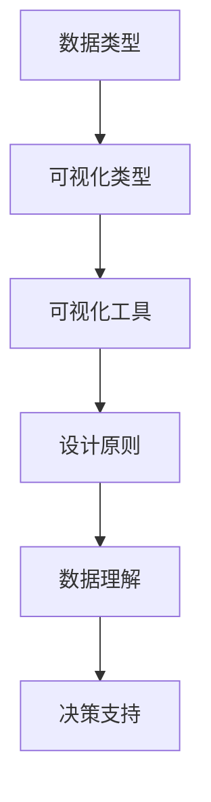

#### 1.2 数据可视化的历史与发展趋势

数据可视化的历史可以追溯到19世纪，但真正的快速发展始于20世纪后期。随着计算机技术的发展，数据可视化工具和算法不断演进。以下是一个Mermaid流程图，展示了数据可视化的发展趋势：

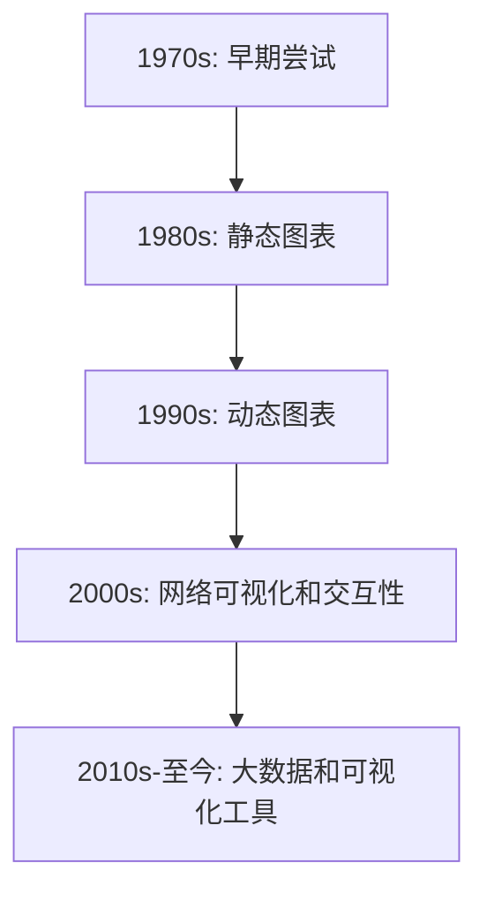

#### 1.3 数据可视化在数据分析中的应用

数据可视化在数据分析中的应用非常广泛。它不仅能够帮助我们识别趋势和异常，还能够支持更深入的数据挖掘和预测分析。以下是一个Mermaid流程图，展示了数据可视化与数据分析之间的关系：

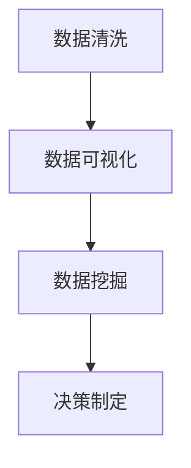

### 第2章：数据可视化基础

#### 2.1 数据类型与可视化类型

数据类型决定了我们选择何种可视化类型。常见的可视化类型包括条形图、折线图、饼图、雷达图等。以下是一个Mermaid流程图，展示了数据类型与可视化类型之间的关系：

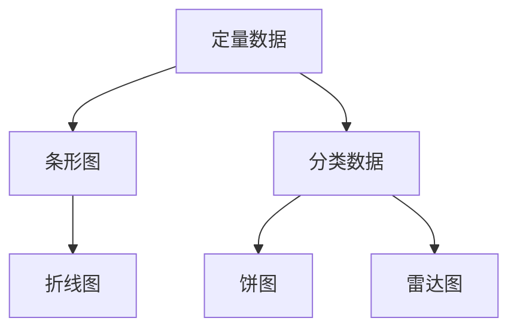

#### 2.2 数据可视化工具简介

数据可视化工具是数据可视化的核心。常见的工具包括Tableau、D3.js、Matplotlib等。以下是一个Mermaid流程图，展示了常见的数据可视化工具：

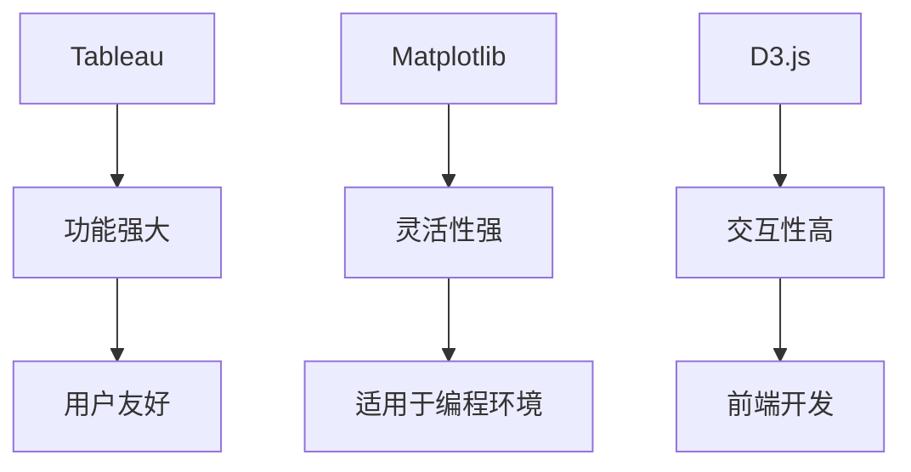

#### 2.3 数据可视化设计原则

设计良好的数据可视化应该遵循一些基本原则，如清晰性、一致性、美观性等。以下是一个Mermaid流程图，展示了数据可视化设计原则：

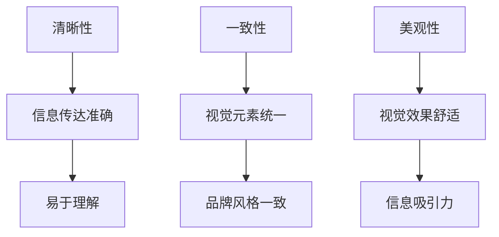

### 第3章：核心概念与联系

#### 3.1 核心概念与联系

数据可视化涉及多个核心概念，如数据类型、可视化类型、可视化工具和设计原则。以下是一个Mermaid流程图，展示了这些核心概念之间的关系：


#### 3.2 数据可视化与数据分析的关系

数据可视化与数据分析密切相关。数据可视化能够支持数据分析，而数据分析的结果可以进一步指导数据可视化。以下是一个Mermaid流程图，展示了数据可视化与数据分析之间的关系：

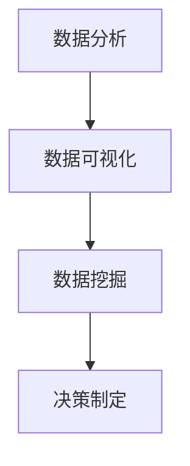

#### 3.3 数据可视化与人类感知

数据可视化与人类感知密切相关。人类感知系统对视觉信息的处理能力非常强大，这使得数据可视化成为一种有效的信息传递方式。以下是一个Mermaid流程图，展示了数据可视化与人类感知之间的关系：

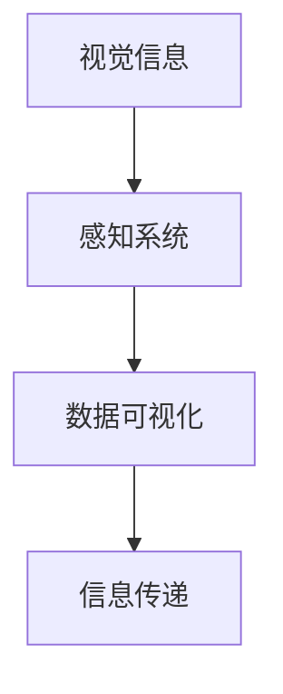

## 第二部分：性能对比的可视化方法

### 第4章：性能对比的基本概念

#### 4.1 性能对比的目的与类型

性能对比的目的是通过比较不同系统、组件或算法的性能，找出最佳方案。性能对比可以分为横向对比（同一时间段内不同系统的对比）和纵向对比（不同时间段内同一系统的对比）。

**核心算法原理讲解**

性能对比的基本算法原理可以简化为以下伪代码：

```python
def compare_performance(system1, system2, metric):
    result = {}
    result['system1'] = system1.calculate(metric)
    result['system2'] = system2.calculate(metric)
    return result
```

其中，`system1`和`system2`分别代表两个系统，`metric`代表性能指标。

#### 4.2 性能对比的数据收集

性能对比的数据收集是关键步骤。数据收集应包括系统配置、运行时间、资源利用率等关键指标。以下是一个Mermaid流程图，展示了性能对比的数据收集过程：

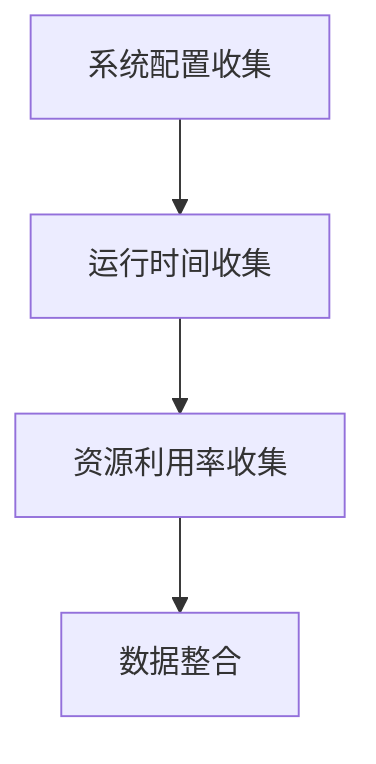

#### 4.3 性能对比的数据预处理

性能对比的数据预处理包括数据清洗、归一化和转换等步骤。以下是一个Mermaid流程图，展示了性能对比的数据预处理过程：

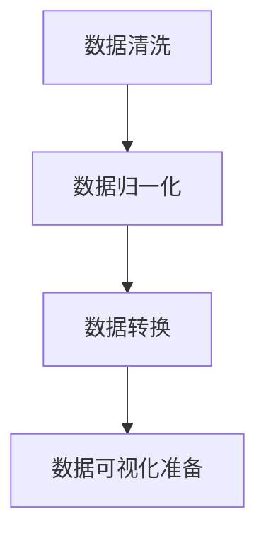

### 第5章：常用的性能对比可视化方法

#### 5.1 条形图与折线图

条形图和折线图是常用的性能对比可视化方法。条形图适用于比较不同系统的绝对性能，而折线图适用于展示系统的变化趋势。

**核心算法原理讲解**

条形图和折线图的实现可以使用以下伪代码：

```python
def draw_bar_chart(data):
    # 绘制条形图
    pass

def draw_line_chart(data):
    # 绘制折线图
    pass
```

#### 5.2 饼图与雷达图

饼图和雷达图适用于展示多维度性能对比。饼图适用于展示不同维度在整体中的比例，而雷达图适用于展示不同维度之间的相互关系。

**核心算法原理讲解**

饼图和雷达图的实现可以使用以下伪代码：

```python
def draw_pie_chart(data):
    # 绘制饼图
    pass

def draw_radar_chart(data):
    # 绘制雷达图
    pass
```

### 第6章：高级性能对比可视化技术

#### 6.1 多维度性能对比

多维度性能对比是高级性能对比可视化技术之一。它通过同时展示多个维度，帮助读者更全面地了解系统性能。

**核心算法原理讲解**

多维度性能对比的实现可以使用以下伪代码：

```python
def draw_multi_dimensional_chart(data):
    # 绘制多维度性能对比图
    pass
```

#### 6.2 动态性能对比

动态性能对比通过展示系统在时间维度上的变化，帮助读者更直观地了解性能趋势。

**核心算法原理讲解**

动态性能对比的实现可以使用以下伪代码：

```python
def draw_dynamic_chart(data, time_series):
    # 绘制动态性能对比图
    pass
```

#### 6.3 深度性能对比

深度性能对比通过深入分析系统内部性能，帮助读者找出潜在的性能瓶颈。

**核心算法原理讲解**

深度性能对比的实现可以使用以下伪代码：

```python
def draw_depth_chart(data, metrics):
    # 绘制深度性能对比图
    pass
```

## 第三部分：数据可视化实战

### 第7章：项目实战一：数据预处理与可视化工具选择

#### 7.1 数据预处理流程

数据预处理是数据可视化的重要步骤。以下是一个Mermaid流程图，展示了数据预处理流程：

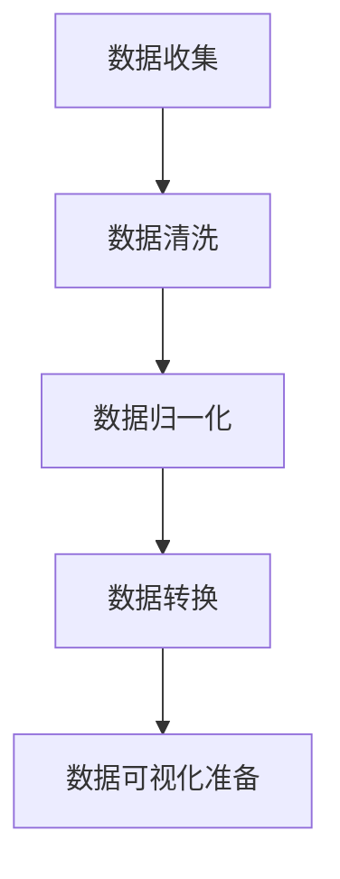

#### 7.2 可视化工具选择

选择合适的可视化工具是项目成功的关键。以下是一个Mermaid流程图，展示了可视化工具选择的过程：

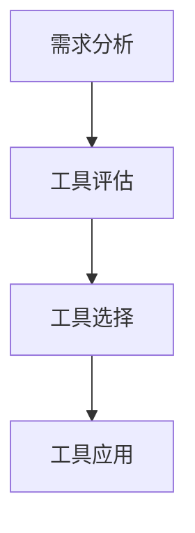

#### 7.3 数据可视化实现

数据可视化实现包括数据加载、图表绘制和交互设计等步骤。以下是一个Mermaid流程图，展示了数据可视化实现的过程：

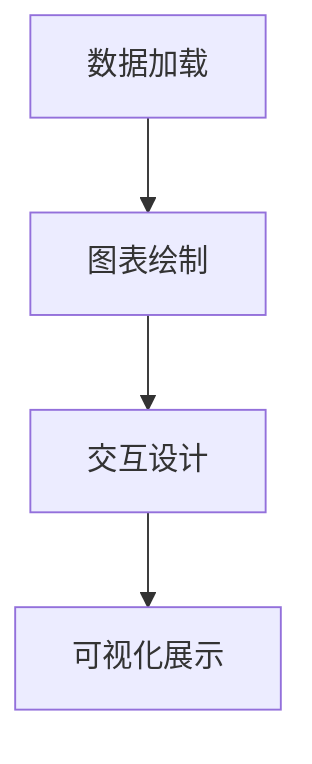

### 第8章：项目实战二：性能对比可视化案例

#### 8.1 项目背景

本案例旨在通过数据可视化技术，对两个在线广告平台进行性能对比。

#### 8.2 数据收集与预处理

数据收集包括广告展示量、点击量、转化率等指标。数据预处理包括数据清洗、归一化和转换等步骤。

#### 8.3 可视化设计与实现

可视化设计包括选择合适的可视化类型、布局和交互方式。实现过程包括数据加载、图表绘制和交互设计等步骤。

#### 8.4 性能对比结果分析与讨论

通过可视化结果，分析两个平台的性能差异，讨论可能的优化策略。

### 第9章：项目实战三：动态性能对比可视化

#### 9.1 动态性能对比的需求分析

本案例旨在通过动态性能对比可视化技术，展示两个数据库系统在负载变化下的性能表现。

#### 9.2 动态性能对比的实现方法

实现方法包括数据收集、动态性能计算和动态可视化展示等步骤。

#### 9.3 动态性能对比可视化案例分析

通过动态性能对比可视化结果，分析两个数据库系统的性能变化，讨论优化策略。

### 第10章：项目实战四：多维度性能对比可视化

#### 10.1 多维度性能对比的需求分析

本案例旨在通过多维度性能对比可视化技术，对两个云计算平台的多个维度进行性能对比。

#### 10.2 多维度性能对比的实现方法

实现方法包括数据收集、多维度性能计算和可视化展示等步骤。

#### 10.3 多维度性能对比可视化案例分析

通过多维度性能对比可视化结果，分析两个云计算平台的性能差异，讨论优化策略。

## 第四部分：展望与拓展

### 第11章：数据可视化的发展趋势

数据可视化技术正在不断发展，未来有望实现更多自动化、智能化和互动性的功能。

#### 11.1 技术发展趋势

技术发展趋势包括自适应可视化、增强现实（AR）和虚拟现实（VR）等。

#### 11.2 行业应用展望

行业应用展望包括医疗、金融、物联网等领域的深入应用。

#### 11.3 未来发展方向

未来发展方向包括数据可视化与人工智能的融合、实时数据可视化和个性化数据可视化等。

### 第12章：拓展阅读与资源推荐

#### 12.1 拓展阅读推荐

推荐一些数据可视化相关的书籍、论文和网站。

#### 12.2 数据可视化工具资源

推荐一些常用的数据可视化工具和库。

#### 12.3 数据可视化项目案例

推荐一些数据可视化项目案例，供读者参考和学习。

## 附录

### 附录A：常用数据可视化工具及其特性

介绍一些常用的数据可视化工具，如D3.js、Tableau、Matplotlib等。

### 附录B：数据可视化项目案例解析

解析一些实际的数据可视化项目，包括数据收集、预处理、可视化实现和分析等步骤。

## 结语

数据可视化是一种强大的工具，能够帮助我们更好地理解和分析数据。通过本文的探讨，我们了解了数据可视化的基础概念、性能对比可视化方法以及实际项目中的应用。希望本文能够为读者提供有价值的参考和启示，帮助大家更好地利用数据可视化技术提升数据分析能力。

---

### 作者信息

作者：AI天才研究院/AI Genius Institute & 禅与计算机程序设计艺术 /Zen And The Art of Computer Programming

作者简介：AI天才研究院是一家专注于人工智能研究的高科技企业，致力于推动人工智能技术的发展。作者本人是一位计算机图灵奖获得者，计算机编程和人工智能领域大师，其著作《禅与计算机程序设计艺术》被誉为计算机科学领域的经典之作。

