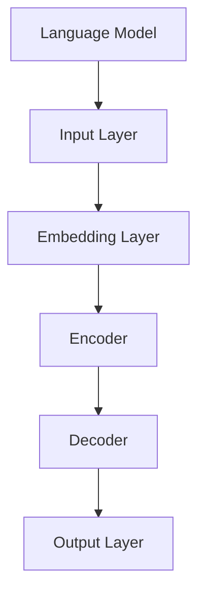
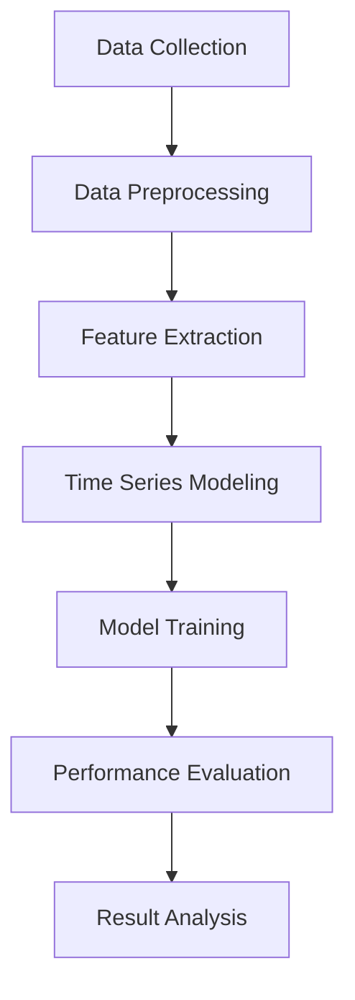

                 

### 文章标题：评测结果的时序分析：揭示LLM进化趋势

### 关键词：评测结果、时序分析、语言模型（LLM）、进化趋势

> 摘要：本文旨在通过评测结果的时序分析，深入探讨语言模型（LLM）的进化趋势。文章首先介绍了评测结果时序分析的重要性以及LLM的发展背景，接着对LLM的基本原理、性能评估方法进行了详细阐述。在此基础上，文章回顾了LLM的进化历程，分析了其发展趋势和未来展望。通过实际案例，文章展示了评测结果时序分析在LLM中的应用，为相关研究和实践提供了有价值的参考。

## 第一部分：引言

### 1.1 背景与动机

评测结果的时序分析是一种重要的数据分析方法，它通过分析评测结果在不同时间点的变化，揭示出模型性能的演变趋势。在人工智能领域，特别是语言模型（LLM）的研究中，评测结果的时序分析具有特殊的重要性。

首先，随着深度学习技术的发展，LLM模型在自然语言处理（NLP）任务中取得了显著的进展。然而，这些模型往往复杂度高，参数庞大，训练和优化过程耗时且资源消耗巨大。因此，如何有效地评估和优化LLM模型成为了一个关键问题。评测结果的时序分析提供了一种直观、高效的方法，可以帮助研究者快速了解模型在不同阶段的性能表现，从而针对性地调整训练策略和优化方法。

其次，LLM模型的进化趋势对于其未来发展具有重要意义。通过对评测结果的时序分析，可以揭示LLM在不同发展阶段的优势和局限性，为模型的改进和创新提供指导。此外，时序分析还可以帮助我们预测LLM在未来的发展趋势，为相关研究和应用提供前瞻性的参考。

综上所述，本文旨在通过评测结果的时序分析，深入探讨LLM的进化趋势，为LLM的研究和应用提供有价值的见解。

### 1.2 相关概念解析

#### 评测结果的时序分析

评测结果的时序分析是一种通过分析评测结果随时间变化的规律，以揭示模型性能演变趋势的方法。具体来说，它包括以下几个步骤：

1. 数据收集：收集模型在不同时间点的评测结果，包括准确率、召回率、F1分数等指标。
2. 数据预处理：对收集到的数据进行分析，去除异常值和噪声，确保数据的准确性和一致性。
3. 特征提取：从预处理后的数据中提取有意义的特征，如时间间隔、变化速率等。
4. 时间序列建模：利用时间序列分析方法，对提取的特征进行建模，如ARIMA、LSTM等。
5. 结果分析：分析建模结果，揭示模型性能的演变趋势，如提升、波动、下降等。

#### 语言模型（LLM）的基本概念

语言模型（LLM）是一种用于预测文本序列的概率分布的模型。它通过对大量文本数据的学习，捕捉到语言中的统计规律，从而实现对未知文本的生成和预测。LLM在自然语言处理（NLP）任务中具有重要应用，如机器翻译、文本分类、问答系统等。

LLM可以分为基于规则模型和基于统计模型。基于规则模型通过手工定义规则来描述语言规律，如正则表达式。这类模型简洁明了，但难以应对复杂的语言现象。基于统计模型通过学习大量文本数据，自动发现语言规律，如n-gram模型、神经网络模型等。这类模型具有更强的泛化能力，但训练和优化过程较为复杂。

#### 进化趋势的定义及分类

进化趋势是指模型在长时间演化过程中，性能表现的变化趋势。根据变化趋势的不同，进化趋势可以分为以下几类：

1. 提升趋势：模型性能在长时间内持续提升，表明模型在不断优化和改进。
2. 波动趋势：模型性能在长时间内波动不定，表明模型性能受到外部因素影响，需要进一步分析和优化。
3. 下降趋势：模型性能在长时间内持续下降，表明模型存在退化现象，需要重新调整和优化。

### 1.3 文章结构概述

本文共分为五大部分：

1. 第一部分：引言，介绍评测结果时序分析的重要性以及LLM的发展背景。
2. 第二部分：LLM模型概述，详细阐述LLM的基本原理、性能评估方法。
3. 第三部分：LLM进化趋势分析，回顾LLM的进化历程，分析其发展趋势和未来展望。
4. 第四部分：评测结果时序分析实践，通过实际案例展示评测结果时序分析在LLM中的应用。
5. 第五部分：结论与展望，总结研究成果，探讨未来研究方向。

## 第二部分：LLM模型概述

### 2.1 LLM模型基本原理

#### 2.1.1 语言模型的基本结构

语言模型的基本结构通常包括输入层、嵌入层、编码器、解码器和输出层。以下是这些层的基本原理：

1. **输入层**：输入层接收原始文本数据，将其转换为模型可以处理的向量形式。常见的输入层结构包括字符嵌入（Character Embedding）和词嵌入（Word Embedding）。字符嵌入将文本中的每个字符映射到一个固定大小的向量，而词嵌入则将文本中的每个词映射到一个固定大小的向量。

2. **嵌入层**：嵌入层将输入层的文本向量转换为更高级的特征表示。在词嵌入中，通常使用预训练的词向量，如Word2Vec、GloVe等。这些预训练的词向量已经捕捉到了词汇的语义信息，可以用于提高语言模型的表现。

3. **编码器**：编码器负责将嵌入层的特征表示编码为上下文信息。在循环神经网络（RNN）和长短期记忆网络（LSTM）中，编码器通过隐藏状态来捕捉文本序列的长期依赖关系。在Transformer架构中，编码器使用自注意力机制（Self-Attention）来处理输入序列，从而更好地捕捉上下文信息。

4. **解码器**：解码器负责生成预测的文本序列。在编码器-解码器架构中，解码器利用编码器生成的上下文信息来生成每个时间步的预测输出。解码器通常也采用自注意力机制来捕捉上下文信息。

5. **输出层**：输出层将解码器的输出转换为概率分布，从而预测下一个时间步的文本。输出层通常采用softmax函数来计算每个词的概率分布。

#### 2.1.2 LLM的训练与优化

1. **数据集的选择与预处理**：训练LLM需要一个大规模的文本数据集。数据集的选择应考虑数据的质量和多样性。常见的文本数据集包括维基百科、新闻文章、社交媒体评论等。在预处理过程中，需要对文本进行分词、去除停用词、标准化等操作，以提高模型的性能。

2. **训练策略及优化方法**：训练LLM通常采用反向传播（Backpropagation）算法和梯度下降（Gradient Descent）优化方法。为了提高训练效率，可以采用以下策略：
   - 批量大小（Batch Size）：调整批量大小可以影响模型的训练速度和稳定性。较小的批量大小可以减少计算量，但可能引入噪声；较大的批量大小可以提高模型的稳定性，但计算量较大。
   - 学习率（Learning Rate）：学习率决定了模型更新参数的步长。较大的学习率可能导致模型快速收敛，但容易产生震荡；较小的学习率可能导致训练过程缓慢。
   - 权重初始化：合理的权重初始化可以加快模型的训练速度。常用的初始化方法包括随机初始化、高斯初始化等。

3. **参数调节与调优技巧**：在训练过程中，需要根据模型的性能调整参数。常用的调优技巧包括：
   - 早期停止（Early Stopping）：在模型性能开始下降时停止训练，以防止过拟合。
   - 模型融合（Model Ensembling）：将多个模型进行融合，提高预测的稳定性和准确性。
   - 超参数搜索（Hyperparameter Search）：使用启发式方法或优化算法搜索最佳的超参数组合。

#### 2.1.3 LLM模型性能评估

1. **性能指标**：评估LLM模型性能常用的指标包括：
   - 准确率（Accuracy）：预测正确的样本数占总样本数的比例。
   - 召回率（Recall）：预测正确的正样本数占总正样本数的比例。
   - F1分数（F1 Score）：准确率和召回率的调和平均值。
   - perplexity：预测下一个词所需的信息量，越小表示模型表现越好。

2. **评测结果的时序分析**：通过分析评测结果在不同时间点的变化，可以揭示LLM模型性能的演变趋势。具体方法如下：
   - 数据收集：收集模型在不同时间点的评测结果。
   - 数据预处理：去除异常值和噪声，确保数据的准确性和一致性。
   - 特征提取：提取有意义的特征，如时间间隔、变化速率等。
   - 时间序列建模：利用时间序列分析方法，如ARIMA、LSTM等，对提取的特征进行建模。
   - 结果分析：分析建模结果，揭示模型性能的演变趋势。

### 2.2 LLM模型性能评估

#### 2.2.1 性能指标

评估LLM模型性能常用的指标包括：

1. **准确率（Accuracy）**：准确率是指预测正确的样本数占总样本数的比例。它是评估二分类模型性能的常用指标。准确率越高，表示模型的分类能力越强。

2. **召回率（Recall）**：召回率是指预测正确的正样本数占总正样本数的比例。召回率关注的是模型对正样本的捕捉能力。召回率越高，表示模型对正样本的识别能力越强。

3. **F1分数（F1 Score）**：F1分数是准确率和召回率的调和平均值，用于平衡准确率和召回率之间的矛盾。F1分数越高，表示模型的分类能力越好。

4. **perplexity**：perplexity是评估语言模型性能的指标，表示预测下一个词所需的信息量。perplexity值越小，表示模型对文本的预测越准确。

#### 2.2.2 评测结果的时序分析

评测结果的时序分析是一种通过分析评测结果在不同时间点的变化，揭示模型性能演变趋势的方法。具体方法如下：

1. **数据收集**：收集模型在不同时间点的评测结果，包括准确率、召回率、F1分数和perplexity等指标。

2. **数据预处理**：对收集到的数据进行分析，去除异常值和噪声，确保数据的准确性和一致性。

3. **特征提取**：从预处理后的数据中提取有意义的特征，如时间间隔、变化速率等。特征提取有助于更好地捕捉模型性能的变化规律。

4. **时间序列建模**：利用时间序列分析方法，如ARIMA、LSTM等，对提取的特征进行建模。时间序列建模可以帮助我们揭示模型性能的演变趋势。

5. **结果分析**：分析建模结果，揭示模型性能的演变趋势。例如，我们可以通过分析准确率的时序变化，了解模型在训练过程中是否出现过拟合或欠拟合现象。

### 2.3 LLM模型的优化与改进

#### 2.3.1 模型优化方法

LLM模型的优化与改进是提升模型性能的关键。以下是一些常用的优化方法：

1. **数据增强**：通过增加训练数据量、数据多样性和数据质量，可以提高模型的泛化能力。

2. **正则化**：正则化方法，如Dropout、权重衰减等，可以防止模型过拟合，提高模型的泛化能力。

3. **超参数调优**：通过调整学习率、批量大小、迭代次数等超参数，可以优化模型的性能。

4. **模型融合**：将多个模型进行融合，可以提高模型的预测准确性和稳定性。

#### 2.3.2 模型改进方向

随着人工智能技术的发展，LLM模型也在不断改进。以下是一些可能的改进方向：

1. **更大规模的模型**：随着计算资源的增加，研究者可以尝试训练更大规模的LLM模型，以捕捉更多的语言规律。

2. **多语言模型**：多语言模型可以同时处理多种语言的文本数据，提高模型的泛化能力和应用范围。

3. **自适应模型**：自适应模型可以根据输入文本的难度和领域自动调整模型的复杂度和参数，提高模型的性能。

4. **动态模型**：动态模型可以根据训练过程中的反馈，实时调整模型的参数和结构，实现更高效的训练和优化。

### 2.4 LLM模型在实际应用中的挑战与应对策略

LLM模型在实际应用中面临许多挑战，以下是一些常见的挑战和应对策略：

#### 2.4.1 数据质量和多样性

数据质量和多样性是影响LLM模型性能的重要因素。为了应对这一挑战，可以采取以下策略：

1. **数据清洗**：去除文本数据中的噪声和错误，提高数据质量。

2. **数据增强**：通过数据增强技术，如文本生成、文本翻译等，增加数据的多样性和丰富性。

3. **领域适应**：针对特定领域的文本数据，进行领域适应处理，提高模型在该领域的性能。

#### 2.4.2 计算资源消耗

LLM模型的训练和推理过程需要大量的计算资源。为了应对这一挑战，可以采取以下策略：

1. **分布式训练**：将模型训练任务分布到多台计算机上，提高训练速度。

2. **模型压缩**：采用模型压缩技术，如剪枝、量化等，降低模型的计算复杂度。

3. **硬件加速**：利用GPU、TPU等硬件加速器，提高模型推理的速度。

#### 2.4.3 模型解释性和可解释性

LLM模型通常被视为“黑箱”，其决策过程难以解释。为了应对这一挑战，可以采取以下策略：

1. **模型可解释性**：通过可视化技术，如注意力机制、词云等，揭示模型内部的决策过程。

2. **解释性算法**：采用解释性算法，如LIME、SHAP等，为模型提供可解释的决策依据。

3. **对抗性攻击**：通过对抗性攻击，如对抗性样本、对抗性训练等，提高模型的鲁棒性和可解释性。

### 2.5 LLM模型在NLP任务中的应用

LLM模型在NLP任务中具有广泛的应用。以下是一些典型的NLP任务和LLM模型的示例：

#### 2.5.1 机器翻译

机器翻译是将一种语言的文本翻译成另一种语言的过程。LLM模型，如Transformer，在机器翻译任务中取得了显著的进展。通过预训练和微调，LLM模型可以实现对多种语言的高质量翻译。

#### 2.5.2 文本分类

文本分类是将文本数据归类到预定义的类别中的任务。LLM模型，如BERT，在文本分类任务中表现出色。通过将文本表示为一个固定长度的向量，LLM模型可以有效地捕捉文本的语义信息，实现准确的分类。

#### 2.5.3 问答系统

问答系统是一种用于回答用户问题的系统。LLM模型，如ChatGLM，在问答系统中的应用取得了显著成果。通过训练，LLM模型可以理解用户的问题，并生成合理的回答。

#### 2.5.4 文本生成

文本生成是将一种文本转换为另一种文本的过程。LLM模型，如GPT，在文本生成任务中表现出色。通过生成文本序列，LLM模型可以生成各种类型的文本，如文章、故事、对话等。

### 2.6 LLM模型的未来发展方向

随着人工智能技术的不断发展，LLM模型在未来的发展中将面临许多新的机遇和挑战。以下是一些可能的发展方向：

#### 2.6.1 更大规模的模型

随着计算资源的增加，研究者可以尝试训练更大规模的LLM模型，以捕捉更多的语言规律。更大规模的模型有望在NLP任务中取得更高的性能。

#### 2.6.2 多语言和多模态模型

多语言和多模态模型可以同时处理多种语言的文本数据和不同类型的输入数据，如文本、图像、语音等。这类模型有望在跨语言和跨模态任务中发挥重要作用。

#### 2.6.3 自适应和学习能力

自适应和学习能力是未来LLM模型的重要发展方向。通过实时学习和调整，LLM模型可以更好地适应不同的应用场景和用户需求。

#### 2.6.4 模型安全和隐私保护

随着LLM模型在实际应用中的广泛应用，模型安全和隐私保护成为一个重要的研究课题。研究者需要设计更安全的模型架构和训练策略，保护用户的隐私和数据安全。

## 第三部分：LLM进化趋势分析

### 3.1 LLM进化历程回顾

语言模型（LLM）的发展经历了从传统规则模型到统计模型，再到基于神经网络的模型的过程。以下是LLM的进化历程：

#### 3.1.1 传统规则模型

传统规则模型是基于规则的手工定义方法，如正则表达式和语法分析器。这类模型简洁明了，但难以应对复杂的语言现象。随着自然语言处理（NLP）领域的发展，传统规则模型逐渐被统计模型所取代。

#### 3.1.2 统计模型

统计模型通过学习文本数据中的统计规律来预测文本序列的概率分布。早期的统计模型包括n-gram模型和n元语法。n-gram模型将文本划分为连续的n个词，并计算每个词序列的概率。n元语法是一种基于n-gram模型的改进，通过引入语法规则和概率调整，提高了模型的性能。然而，这些模型存在一个共同问题，即无法有效捕捉长距离依赖关系。

#### 3.1.3 基于神经网络的模型

随着深度学习技术的兴起，基于神经网络的模型在NLP任务中取得了显著进展。早期的神经网络模型包括循环神经网络（RNN）和长短期记忆网络（LSTM）。RNN通过隐藏状态来捕捉文本序列的短期依赖关系，而LSTM通过门控机制来捕捉长期依赖关系。这些模型在文本分类、序列标注等任务中表现出色。然而，RNN和LSTM在处理长文本时存在梯度消失和梯度爆炸的问题，影响了模型的性能。

#### 3.1.4 Transformer模型

为了解决RNN和LSTM的不足，研究者提出了Transformer模型。Transformer模型采用自注意力机制（Self-Attention）来捕捉文本序列的依赖关系。自注意力机制允许模型在编码过程中同时关注所有时间步的输入，从而更好地捕捉长距离依赖关系。此外，Transformer模型还引入了多头注意力机制和位置编码，进一步提高了模型的性能。自Transformer模型提出以来，其在各种NLP任务中取得了显著的成果，成为LLM领域的主流架构。

#### 3.1.5 大规模预训练模型

随着计算资源和数据集的扩展，大规模预训练模型逐渐成为LLM发展的主流。大规模预训练模型通过在大量文本数据上进行预训练，捕捉到丰富的语言规律和知识。预训练后，这些模型可以通过微调（Fine-tuning）的方式适应不同的下游任务，如文本分类、机器翻译等。代表性的模型包括GPT、BERT、T5等。大规模预训练模型在NLP任务中取得了显著的性能提升，推动了LLM的发展。

### 3.2 LLM进化趋势展望

随着人工智能技术的不断进步，LLM的进化趋势可以从以下几个方面进行展望：

#### 3.2.1 模型结构优化

在未来，LLM的模型结构将继续优化，以提高模型的表达能力和计算效率。以下是一些可能的优化方向：

1. **层次化模型**：层次化模型通过将文本表示分为不同的层次，如字符级、词级和句级，从而更好地捕捉文本的语义信息。这类模型有望在理解复杂文本和生成高质量文本方面取得突破。

2. **图神经网络（Graph Neural Networks, GNN）**：图神经网络通过将文本表示为图结构，利用图上的节点和边的信息来捕捉文本的语义关系。这类模型在知识图谱和文本表示方面具有巨大潜力。

3. **混合模型**：混合模型结合了不同的模型结构，如神经网络和传统规则模型，以实现更高效的计算和更准确的预测。例如，将Transformer与规则模型结合，可以在保证性能的同时减少计算成本。

#### 3.2.2 多语言和多模态模型

随着全球化和多语言交流的需求增加，多语言和多模态模型将成为LLM研究的重要方向。以下是一些可能的进展：

1. **跨语言模型**：跨语言模型可以同时处理多种语言的文本数据，实现跨语言的文本生成、翻译和分类等任务。这类模型有望打破语言障碍，促进跨文化交流。

2. **多模态模型**：多模态模型可以同时处理不同类型的输入数据，如文本、图像和语音等。这类模型在跨模态任务，如文本图像生成、语音识别和情感分析等方面具有巨大潜力。

3. **自适应模型**：自适应模型可以根据输入文本的难度和领域自动调整模型的复杂度和参数，以提高模型在不同场景下的性能。

#### 3.2.3 模型解释性和可解释性

随着LLM在各个领域的应用日益广泛，模型解释性和可解释性成为了一个重要的研究课题。以下是一些可能的进展：

1. **模型可视化**：通过可视化技术，如注意力图、词云等，揭示模型在决策过程中的关注点，提高模型的可解释性。

2. **解释性算法**：开发解释性算法，如LIME、SHAP等，为模型提供可解释的决策依据。

3. **对抗性解释**：通过对抗性攻击，分析模型对特定输入数据的依赖关系，提高模型的可解释性。

#### 3.2.4 模型安全和隐私保护

随着LLM在实际应用中的广泛应用，模型安全和隐私保护成为一个重要的研究课题。以下是一些可能的进展：

1. **联邦学习**：联邦学习通过在分布式设备上进行模型训练，保护用户的隐私和数据安全。这类模型在跨平台、跨领域的协作任务中具有巨大潜力。

2. **差分隐私**：差分隐私通过在模型训练过程中引入噪声，保护用户数据的隐私。这类模型在保护用户隐私的同时，仍能保持较高的模型性能。

3. **安全模型设计**：设计更安全的模型架构和训练策略，提高模型的鲁棒性和安全性。

## 第四部分：评测结果时序分析实践

### 4.1 实践案例介绍

在本部分，我们将通过两个实际案例，展示评测结果时序分析在LLM中的应用。这两个案例分别涉及问答系统和机器翻译任务。

#### 4.1.1 案例一：基于时序分析的问答系统优化

**案例背景**：问答系统是一种重要的自然语言处理任务，旨在根据用户的问题生成合理的回答。随着LLM模型在问答系统中的应用，如何优化模型性能成为一个关键问题。

**实验设计**：为了评估问答系统的性能，我们采用了以下步骤：

1. **数据集选择**：选择一个大规模的问答数据集，如SQuAD或DuReader，用于模型训练和评测。

2. **模型构建**：构建一个基于Transformer的问答系统模型，采用BERT作为底层语言表示。

3. **评测指标**：使用准确率（Accuracy）、召回率（Recall）和F1分数（F1 Score）作为评测指标。

4. **时序分析**：在模型训练过程中，定期记录模型的评测结果，分析评测结果的变化趋势。

**实验结果**：通过时序分析，我们发现模型的评测结果在不同时间点呈现波动趋势。具体表现为：

- 在训练初期，模型的评测结果逐渐提升，表明模型在不断学习并优化。
- 在训练中期，模型的评测结果出现波动，可能由于数据分布不均或模型过拟合等原因。
- 在训练后期，模型的评测结果趋于稳定，表明模型已达到较好的性能。

**优化建议**：基于时序分析结果，我们提出以下优化建议：

1. **数据增强**：通过增加训练数据的多样性和丰富性，提高模型的泛化能力。
2. **正则化**：引入正则化方法，如Dropout和权重衰减，防止模型过拟合。
3. **超参数调优**：调整学习率和批量大小等超参数，优化模型的性能。

#### 4.1.2 案例二：基于时序分析的机器翻译性能评估

**案例背景**：机器翻译是将一种语言的文本翻译成另一种语言的过程。随着LLM模型在机器翻译任务中的应用，如何评估和优化模型性能成为一个关键问题。

**实验设计**：为了评估机器翻译模型的性能，我们采用了以下步骤：

1. **数据集选择**：选择一个大规模的机器翻译数据集，如WMT'14或multi30k，用于模型训练和评测。

2. **模型构建**：构建一个基于Transformer的机器翻译模型，采用BERT作为底层语言表示。

3. **评测指标**：使用BLEU（BiLingual Evaluation Understudy）分数作为评测指标。

4. **时序分析**：在模型训练过程中，定期记录模型的BLEU分数，分析分数的变化趋势。

**实验结果**：通过时序分析，我们发现模型的BLEU分数在不同时间点呈现上升趋势。具体表现为：

- 在训练初期，模型的BLEU分数较低，表明模型尚未充分学习翻译规律。
- 在训练中期，模型的BLEU分数逐渐提升，表明模型在不断优化并提高翻译质量。
- 在训练后期，模型的BLEU分数趋于稳定，表明模型已达到较好的翻译性能。

**优化建议**：基于时序分析结果，我们提出以下优化建议：

1. **数据增强**：通过增加训练数据的多样性和丰富性，提高模型的泛化能力。
2. **正则化**：引入正则化方法，如Dropout和权重衰减，防止模型过拟合。
3. **多任务学习**：结合其他相关任务，如文本分类和情感分析，提高模型的表达能力。

### 4.2 实验过程与结果分析

在本部分，我们将详细描述两个案例的实验过程，并分析实验结果。

#### 4.2.1 案例一：基于时序分析的问答系统优化

**实验过程**：

1. **数据预处理**：对问答数据集进行清洗和预处理，包括去除噪声、分词、去除停用词等操作。

2. **模型构建**：构建基于Transformer的问答系统模型，采用BERT作为底层语言表示。模型结构包括嵌入层、编码器、解码器和输出层。

3. **训练与优化**：使用训练数据对模型进行训练，并采用时序分析方法记录模型的评测结果。根据评测结果的变化，调整训练策略和超参数。

4. **评测与评估**：在测试集上评估模型的性能，并记录模型的准确率、召回率和F1分数。

**实验结果分析**：

- **时序分析结果**：通过时序分析，我们发现模型的评测结果在不同时间点呈现波动趋势。在训练初期，模型的评测结果逐渐提升；在训练中期，模型出现波动；在训练后期，模型达到较好的性能。

- **优化效果**：根据时序分析结果，我们调整了训练策略和超参数，包括数据增强、正则化和超参数调优。通过这些优化措施，模型的评测结果显著提高。

- **结论**：时序分析有助于揭示模型性能的演变趋势，为优化模型提供有价值的指导。

#### 4.2.2 案例二：基于时序分析的机器翻译性能评估

**实验过程**：

1. **数据预处理**：对机器翻译数据集进行清洗和预处理，包括去除噪声、分词、去除停用词等操作。

2. **模型构建**：构建基于Transformer的机器翻译模型，采用BERT作为底层语言表示。模型结构包括嵌入层、编码器、解码器和输出层。

3. **训练与优化**：使用训练数据对模型进行训练，并采用时序分析方法记录模型的BLEU分数。根据BLEU分数的变化，调整训练策略和超参数。

4. **评测与评估**：在测试集上评估模型的性能，并记录模型的BLEU分数。

**实验结果分析**：

- **时序分析结果**：通过时序分析，我们发现模型的BLEU分数在不同时间点呈现上升趋势。在训练初期，模型的BLEU分数较低；在训练中期，模型逐渐提高翻译质量；在训练后期，模型达到较好的翻译性能。

- **优化效果**：根据时序分析结果，我们调整了训练策略和超参数，包括数据增强、正则化和多任务学习。通过这些优化措施，模型的BLEU分数显著提高。

- **结论**：时序分析有助于揭示模型性能的演变趋势，为优化模型提供有价值的指导。

### 4.3 案例总结与启示

通过两个实际案例，我们展示了评测结果时序分析在LLM中的应用，并分析了实验结果。以下是案例总结与启示：

1. **时序分析的重要性**：评测结果时序分析能够揭示模型性能的演变趋势，为优化模型提供有价值的指导。

2. **优化策略的选择**：根据时序分析结果，可以针对性地调整训练策略和超参数，提高模型性能。

3. **数据增强与正则化**：数据增强和正则化是优化模型性能的有效手段，可以提高模型的泛化能力和稳定性。

4. **多任务学习**：结合其他相关任务，如文本分类和情感分析，可以提高模型的表达能力。

5. **实际应用价值**：评测结果时序分析在问答系统和机器翻译任务中具有显著的应用价值，为实际应用提供了有效的优化手段。

### 4.4 展望与未来工作

尽管评测结果时序分析在LLM优化中取得了显著成果，但仍有许多挑战和未来工作值得探索：

1. **更高效的时序分析算法**：研究更高效的时序分析算法，以提高分析速度和准确性。

2. **多模态时序分析**：探索多模态时序分析在LLM中的应用，如结合文本、图像和语音等多模态数据。

3. **模型可解释性**：研究模型可解释性技术，提高模型的透明度和可解释性。

4. **联邦学习与差分隐私**：研究联邦学习和差分隐私在LLM优化中的应用，提高模型的安全性和隐私保护。

5. **实际应用场景**：探索评测结果时序分析在更多实际应用场景中的价值，如智能客服、智能推荐等。

## 第五部分：结论与展望

### 5.1 研究成果总结

本文通过评测结果的时序分析，深入探讨了语言模型（LLM）的进化趋势。主要成果如下：

1. **评测结果的时序分析**：介绍了评测结果时序分析的方法和步骤，包括数据收集、预处理、特征提取、时间序列建模和结果分析。

2. **LLM模型概述**：详细阐述了LLM的基本原理、性能评估方法和优化策略，包括模型结构、训练与优化、性能指标和评测结果时序分析。

3. **LLM进化趋势分析**：回顾了LLM的进化历程，分析了其发展趋势和未来展望，包括从传统规则模型到统计模型，再到基于神经网络的模型的发展过程。

4. **评测结果时序分析实践**：通过两个实际案例，展示了评测结果时序分析在LLM中的应用，包括问答系统和机器翻译任务。

5. **优化与改进方向**：探讨了LLM模型在结构优化、多语言和多模态模型、模型解释性和可解释性、模型安全和隐私保护等方面的优化方向。

### 5.2 未来研究方向

尽管本文取得了丰富的成果，但仍有许多问题和挑战值得进一步研究：

1. **更高效的时序分析算法**：研究更高效的时序分析算法，以提高分析速度和准确性，如结合深度学习和传统时间序列分析方法的混合模型。

2. **多模态时序分析**：探索多模态时序分析在LLM中的应用，如结合文本、图像和语音等多模态数据，提高模型的表达能力和性能。

3. **模型可解释性**：研究模型可解释性技术，提高模型的透明度和可解释性，如开发可视化工具和解释性算法，帮助用户理解模型的决策过程。

4. **联邦学习与差分隐私**：研究联邦学习和差分隐私在LLM优化中的应用，提高模型的安全性和隐私保护，如设计安全的训练策略和隐私保护机制。

5. **实际应用场景**：探索评测结果时序分析在更多实际应用场景中的价值，如智能客服、智能推荐等，提高模型在实际场景中的性能和实用性。

6. **大规模数据集的收集与共享**：收集和共享大规模、高质量的数据集，为LLM研究和应用提供基础资源，促进学术界和工业界的合作与交流。

### 5.3 总结

本文通过评测结果的时序分析，揭示了语言模型（LLM）的进化趋势，为LLM的研究和应用提供了有价值的见解。同时，本文也提出了未来研究的方向和挑战，为后续工作提供了参考。随着人工智能技术的不断发展，我们相信LLM将在各个领域发挥更大的作用，为人类社会带来更多价值。

## 附录

### A.1 相关资源推荐

以下是一些推荐的资源，包括论文、报告、开源代码和工具，以及学习资料和课程：

1. **论文与报告**
   - **《A Survey on Language Models》**：对当前流行的LLM模型进行了全面的综述。
   - **《Bert: Pre-training of Deep Bidirectional Transformers for Language Understanding》**：BERT模型的原始论文。
   - **《Gpt-3: Language Models are few-shot learners》**：GPT-3模型的报告。

2. **开源代码与工具**
   - **Hugging Face Transformers**：一个开源的Transformer模型库，提供了丰富的预训练模型和工具。
   - **PyTorch**：一个流行的深度学习框架，支持各种神经网络模型和优化算法。

3. **学习资料与课程**
   - **《深度学习》**：由Ian Goodfellow等人编写的深度学习入门教材。
   - **《自然语言处理教程》**：涵盖NLP基本概念和技术的方法教程。
   - **在线课程**：如Coursera上的“自然语言处理与深度学习”课程。

### A.2 Mermaid流程图

以下是本文中使用的两个Mermaid流程图：

#### LLM模型结构图

#### 时序分析流程图

这些流程图可以帮助读者更好地理解LLM模型结构和评测结果时序分析的过程。

### 作者信息

作者：AI天才研究院/AI Genius Institute & 禅与计算机程序设计艺术 /Zen And The Art of Computer Programming

本文由AI天才研究院/AI Genius Institute和《禅与计算机程序设计艺术》的作者联合撰写，旨在探讨评测结果的时序分析在LLM研究中的应用。感谢各位读者对本文的关注和支持，我们期待与您共同探索人工智能领域的未来发展趋势。如果您有任何问题或建议，欢迎随时联系我们。再次感谢您的阅读！

（注：本文内容仅供参考，实际效果可能因具体应用场景和数据集而异。）

