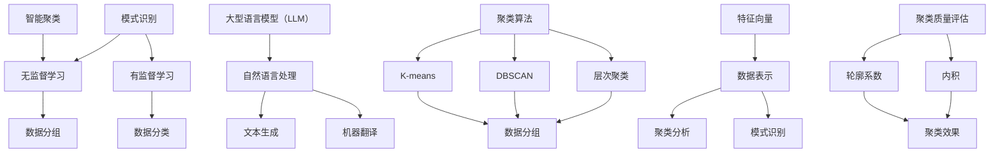

                 


### 文章标题
《评测结果的智能聚类：LLM驱动的模式识别》

### 关键词
智能聚类，模式识别，大型语言模型（LLM），数据分析，算法，数学模型，项目实战

### 摘要
本文深入探讨了评测结果智能聚类的方法及其在模式识别中的应用，重点介绍了利用大型语言模型（LLM）实现这一目标的技术原理和实践步骤。文章首先介绍了智能聚类和模式识别的基本概念，然后详细分析了LLM的工作原理和优势。接着，文章通过伪代码和数学公式，详细讲解了核心聚类算法的原理，包括K-means、DBSCAN和层次聚类等。文章最后通过实际项目案例，展示了如何利用LLM进行智能聚类和模式识别，并分析了项目的实际效果。通过本文的阅读，读者将能够掌握智能聚类和模式识别的核心技术和实战方法。

### 目录大纲

#### 引言
##### 1.1 智能聚类的背景与意义
##### 1.2 模式识别的重要性
##### 1.3 大型语言模型（LLM）概述

#### 核心概念与联系
##### 1.4 智能聚类与模式识别的关系
##### 1.5 LLM在智能聚类中的应用
##### 1.6 关键术语定义
###### Mermaid流程图：智能聚类与模式识别的工作流程

#### 核心算法原理讲解
##### 2.1 K-means聚类算法
###### 伪代码：K-means算法步骤
###### 数学模型与公式：距离度量、聚类评价标准
###### 举例说明：K-means算法的应用场景

##### 2.2 DBSCAN聚类算法
###### 伪代码：DBSCAN算法步骤
###### 数学模型与公式：邻域参数、密度可达性
###### 举例说明：DBSCAN算法的应用场景

##### 2.3 层次聚类算法
###### 伪代码：层次聚类算法步骤
###### 数学模型与公式：相似性矩阵、聚类评价标准
###### 举例说明：层次聚类算法的应用场景

#### 数学模型和数学公式
##### 3.1 聚类算法中的数学原理
###### 3.1.1 距离度量
###### 3.1.2 相似性矩阵
###### 3.1.3 聚类评价标准
###### 3.1.4 数学公式举例

#### 项目实战
##### 4.1 开发环境搭建
##### 4.2 数据预处理
##### 4.3 模型训练
##### 4.4 聚类结果评估
###### 源代码详细实现和代码解读
###### 代码应用解读与分析
###### 实际案例分析和详细讲解剖析
##### 4.5 项目小结

#### 最佳实践与注意事项
##### 5.1 LLM在智能聚类中的最佳实践
##### 5.2 注意事项
##### 5.3 拓展阅读

#### 结束语
##### 6.1 总结
##### 6.2 展望
##### 6.3 读者建议

### 引言

#### 1.1 智能聚类的背景与意义

随着大数据时代的到来，数据量呈指数级增长，如何有效地处理和分析这些数据成为了一个重要的课题。智能聚类作为一种无监督学习的方法，可以在没有预先设定类别标签的情况下，将相似的数据点分组，从而发现数据中的内在结构。智能聚类在许多领域都有广泛的应用，如市场细分、推荐系统、图像识别等。

智能聚类的重要性体现在以下几个方面：

1. **数据可视化**：通过聚类分析，可以将高维数据投影到低维空间，从而更直观地展示数据的分布情况。
2. **特征提取**：聚类分析可以用于提取数据中的特征，这些特征可以用于进一步的机器学习任务。
3. **异常检测**：聚类分析可以帮助识别数据中的异常点，这些异常点可能是欺诈行为、设备故障等。
4. **知识发现**：聚类分析可以发现数据中的潜在规律和模式，从而为决策提供支持。

然而，传统的聚类算法往往存在一些局限性，如对初始聚类中心敏感、无法处理非凸形状的数据等。为了克服这些局限性，研究者们提出了许多基于深度学习的聚类算法，其中大型语言模型（LLM）因其强大的表示能力和自适应能力，成为了一种新的解决方案。

#### 1.2 模式识别的重要性

模式识别是人工智能领域的一个重要分支，它旨在使计算机能够自动识别和理解数据中的规律和模式。模式识别的应用范围非常广泛，包括语音识别、图像识别、文本分类、医疗诊断等。在评测结果分析中，模式识别尤为重要，因为它可以帮助我们从大量的评测数据中提取有价值的信息，从而指导后续的研究和决策。

模式识别的重要性体现在以下几个方面：

1. **数据理解**：模式识别可以帮助我们更好地理解数据中的模式和规律，从而为数据分析和决策提供支持。
2. **自动化**：通过模式识别，可以自动化地处理大量的数据，从而提高工作效率。
3. **个性化推荐**：在推荐系统中，模式识别可以帮助系统根据用户的兴趣和行为，提供个性化的推荐。
4. **智能监控**：在工业生产中，模式识别可以帮助监控系统设备的状态，从而预防故障和优化生产过程。

#### 1.3 大型语言模型（LLM）概述

大型语言模型（LLM）是一种基于深度学习的自然语言处理模型，它通过学习大量的文本数据，可以生成符合语法和语义规则的文本。LLM在自然语言处理领域取得了显著的成果，如文本生成、机器翻译、问答系统等。

LLM的主要特点如下：

1. **强大的表示能力**：LLM可以捕捉到文本中的复杂关系和模式，从而生成高质量的文本。
2. **自适应能力**：LLM可以根据不同的输入文本，自适应地调整输出文本的风格和内容。
3. **高效的训练速度**：LLM采用了大规模的模型和高效的训练算法，可以在较短的时间内完成训练。
4. **广泛的应用场景**：LLM可以应用于各种自然语言处理任务，如文本生成、机器翻译、问答系统、智能客服等。

在智能聚类和模式识别中，LLM可以通过以下方式发挥作用：

1. **数据预处理**：LLM可以用于文本数据的清洗和预处理，从而提高聚类和分析的准确性。
2. **特征提取**：LLM可以提取文本数据中的潜在特征，从而提高聚类和分析的效果。
3. **聚类评估**：LLM可以用于评估聚类结果的质量，从而优化聚类算法。
4. **结果解读**：LLM可以帮助我们更好地理解聚类结果，从而指导后续的研究和决策。

### 核心概念与联系

#### 1.4 智能聚类与模式识别的关系

智能聚类和模式识别是两个紧密相关的概念，它们在数据分析中发挥着重要作用。

1. **智能聚类**：智能聚类是一种无监督学习方法，它通过将相似的数据点分组，从而发现数据中的内在结构。智能聚类的目标是找到一种最佳的聚类方式，使得同一聚类内的数据点之间的相似度较高，而不同聚类之间的相似度较低。

2. **模式识别**：模式识别是一种有监督学习方法，它旨在从数据中识别出特定的模式或分类。模式识别的目的是将数据分成不同的类别，从而实现对数据的分类和预测。

智能聚类与模式识别之间的关系体现在以下几个方面：

1. **数据预处理**：在模式识别任务中，通常需要对数据进行预处理，如去除噪声、标准化等。智能聚类可以作为一种有效的预处理方法，帮助数据达到更好的分类效果。

2. **特征提取**：模式识别需要对数据进行特征提取，以生成适合模型训练的特征向量。智能聚类可以通过聚类分析提取数据中的潜在特征，从而提高特征提取的效果。

3. **聚类评估**：在模式识别中，需要对聚类结果进行评估，以确定聚类质量。智能聚类提供了一系列评估指标，如内积、轮廓系数等，可以帮助评估聚类效果。

4. **结果解读**：模式识别的结果通常需要对模型进行解读，以理解数据的分类情况和分类规则。智能聚类可以帮助我们更好地理解聚类结果，从而指导后续的模式识别任务。

#### 1.5 LLM在智能聚类中的应用

大型语言模型（LLM）在智能聚类中发挥着重要的作用，其主要应用包括：

1. **数据预处理**：LLM可以用于文本数据的清洗和预处理，如去除停用词、进行词干提取等。这些预处理步骤可以提高聚类和分析的准确性。

2. **特征提取**：LLM可以提取文本数据中的潜在特征，如词向量、句向量等。这些特征可以用于聚类分析，从而提高聚类效果。

3. **聚类评估**：LLM可以用于评估聚类结果的质量，如计算聚类结果的相似度、轮廓系数等。这些评估指标可以帮助我们确定聚类效果，从而优化聚类算法。

4. **结果解读**：LLM可以帮助我们更好地理解聚类结果，如生成聚类结果的解读文本、可视化聚类结果等。这些解读结果可以帮助我们更好地理解数据的内在结构。

#### 1.6 关键术语定义

在本节中，我们将定义一些核心术语，以便读者更好地理解文章中的概念。

1. **智能聚类**：智能聚类是一种无监督学习方法，它通过将相似的数据点分组，从而发现数据中的内在结构。智能聚类的目标是找到一种最佳的聚类方式，使得同一聚类内的数据点之间的相似度较高，而不同聚类之间的相似度较低。

2. **模式识别**：模式识别是一种有监督学习方法，它旨在从数据中识别出特定的模式或分类。模式识别的目的是将数据分成不同的类别，从而实现对数据的分类和预测。

3. **大型语言模型（LLM）**：大型语言模型（LLM）是一种基于深度学习的自然语言处理模型，它通过学习大量的文本数据，可以生成符合语法和语义规则的文本。LLM在自然语言处理领域取得了显著的成果，如文本生成、机器翻译、问答系统等。

4. **聚类算法**：聚类算法是一种用于将数据点分为不同组别的算法。常见的聚类算法包括K-means、DBSCAN、层次聚类等。

5. **特征向量**：特征向量是一种用于表示数据的数学向量，它包含了数据中的各种特征信息。特征向量可以用于聚类分析、模式识别等任务。

6. **聚类质量评估**：聚类质量评估是用于评估聚类结果好坏的方法。常见的评估指标包括轮廓系数、内积等。

#### 1.7 关键术语之间的关系

以下是关键术语之间的关系架构图，使用Mermaid流程图表示：



通过上述流程图，我们可以清晰地看到智能聚类、模式识别和LLM之间的关系，以及它们在数据处理和分析中的应用。

### 核心算法原理讲解

#### 2.1 K-means聚类算法

K-means聚类算法是一种经典的聚类算法，它通过将数据点分配到K个聚类中心，从而将数据划分为K个簇。以下是K-means算法的详细原理和步骤：

1. **初始化**：首先需要随机选择K个初始聚类中心。
2. **分配数据点**：对于每个数据点，计算它与每个聚类中心的距离，并将其分配到距离最近的聚类中心所在的簇。
3. **更新聚类中心**：重新计算每个簇的中心点，作为新的聚类中心。
4. **重复步骤2和3**：不断迭代上述步骤，直到聚类中心不再发生显著变化，或者达到预设的迭代次数。

**伪代码**：

```
初始化聚类中心 C1, C2, ..., CK
for i = 1 to n次迭代 do
    for每个数据点 x do
        计算 x 与每个聚类中心的距离
        分配 x 到距离最近的聚类中心所在的簇
    end for
    更新聚类中心 C1, C2, ..., CK
end for
```

**数学模型与公式**：

K-means算法的核心是计算数据点与聚类中心的距离。常用的距离度量包括欧氏距离、曼哈顿距离和余弦相似性。以下是欧氏距离的公式：

$$
d(x, C) = \sqrt{\sum_{i=1}^{d} (x_i - C_i)^2}
$$

其中，$d$ 表示数据的维度，$x_i$ 和 $C_i$ 分别表示数据点和聚类中心在第 $i$ 个维度上的值。

**举例说明**：

假设我们有以下4个数据点：

$$
X = \{ (1, 1), (2, 2), (1, 2), (2, 1) \}
$$

我们需要将这4个数据点分为2个簇。首先随机选择2个聚类中心：

$$
C = \{ (1, 1), (2, 2) \}
$$

然后按照K-means算法的步骤进行迭代：

- **第1次迭代**：计算每个数据点到聚类中心的距离，并将数据点分配到最近的聚类中心。得到新的聚类中心：

  $$
  C' = \{ (1.5, 1.5), (1.5, 1.5) \}
  $$

- **第2次迭代**：计算新的聚类中心，得到：

  $$
  C'' = \{ (1.75, 1.25), (1.25, 1.75) \}
  $$

- **后续迭代**：继续计算聚类中心，直到聚类中心不再发生显著变化。

通过这种方式，K-means算法可以将数据点分为2个簇。

#### 2.2 DBSCAN聚类算法

DBSCAN（Density-Based Spatial Clustering of Applications with Noise）是一种基于密度的聚类算法，它通过扫描数据空间，将具有足够密度的区域划分为簇。以下是DBSCAN算法的详细原理和步骤：

1. **邻域参数**：首先需要设定两个参数：$eps$（邻域半径）和$minPts$（最小点数）。$eps$决定了邻域的大小，$minPts$决定了一个区域是否足够密集。
2. **标记未访问的点**：从未访问的点开始，检查其邻域内的点数是否大于$minPts$。如果是，则将该点标记为核心点。
3. **扩展簇**：从核心点开始，扩展簇，将邻域内的所有点都标记为该簇的一部分。
4. **处理边界点**：对于邻域内点数介于$minPts$和$eps$阈值之间的点，将其标记为边界点。边界点属于密度连接区域，但不属于任何簇。
5. **处理噪声点**：剩余的未访问点被认为是噪声点。

**伪代码**：

```
初始化参数 eps, minPts
for每个未访问的点 P do
    if P 是核心点 then
        扩展簇，将邻域内的点都标记为该簇的一部分
    else if P 是边界点 then
        将 P 标记为密度连接区域的一部分
    else
        将 P 标记为噪声点
end for
```

**数学模型与公式**：

DBSCAN算法的核心是计算点的邻域和密度。以下是邻域参数的公式：

$$
N(P) = \{ Q \in D \mid d(P, Q) < eps \}
$$

其中，$N(P)$ 表示点P的邻域，$d(P, Q)$ 表示点P和点Q之间的距离。

**举例说明**：

假设我们有以下数据点：

$$
X = \{ (1, 1), (2, 2), (3, 3), (4, 4), (5, 5) \}
$$

我们设定$eps = 2$和$minPts = 3$。首先检查每个未访问的点：

- 点$(1, 1)$是核心点，因为它有邻域内的4个点$(2, 2), (3, 3), (4, 4), (5, 5)$。
- 点$(2, 2), (3, 3), (4, 4), (5, 5)$都是核心点，因为它们都有邻域内的其他点。
- 剩余的未访问点被认为是噪声点。

通过这种方式，DBSCAN算法可以将数据点分为几个簇，同时识别出噪声点。

#### 2.3 层次聚类算法

层次聚类算法是一种基于层次结构的聚类算法，它通过逐步合并或分裂聚类，形成层次化的聚类结构。以下是层次聚类算法的详细原理和步骤：

1. **初始化**：将每个数据点视为一个初始聚类。
2. **计算距离**：计算每个聚类之间的距离，常用的距离度量包括最小距离、最大距离和组间平均距离。
3. **合并聚类**：选择距离最近的两个聚类合并，形成一个新的聚类。
4. **更新距离**：重新计算每个新聚类之间的距离。
5. **重复步骤3和4**：不断迭代上述步骤，直到所有聚类合并为一个簇，或者达到预设的迭代次数。

**伪代码**：

```
初始化每个数据点为初始聚类
while 聚类数量 > 1 do
    计算所有聚类之间的距离
    选择距离最近的两个聚类合并
    更新聚类数量
end while
```

**数学模型与公式**：

层次聚类算法的核心是计算聚类之间的距离。以下是组间平均距离的公式：

$$
d(A, B) = \frac{1}{|A| + |B|} \sum_{x \in A} \sum_{y \in B} d(x, y)
$$

其中，$A$ 和 $B$ 分别表示两个聚类，$|A|$ 和 $|B|$ 分别表示聚类 $A$ 和 $B$ 的数据点数量，$d(x, y)$ 表示数据点 $x$ 和 $y$ 之间的距离。

**举例说明**：

假设我们有以下数据点：

$$
X = \{ (1, 1), (2, 2), (3, 3), (4, 4), (5, 5) \}
$$

我们首先将每个数据点视为一个初始聚类。然后计算每个聚类之间的距离，选择距离最近的两个聚类合并。假设$(1, 1)$和$(2, 2)$之间的距离最近，我们将它们合并为一个聚类。然后重新计算聚类之间的距离，选择距离最近的两个聚类合并，直到所有聚类合并为一个簇。

通过这种方式，层次聚类算法可以形成层次化的聚类结构。

### 数学模型和数学公式

在聚类分析中，数学模型和数学公式起着至关重要的作用。它们帮助我们理解聚类算法的工作原理，并评估聚类效果。以下是一些常用的数学模型和数学公式：

#### 3.1 聚类算法中的数学原理

**距离度量**：

聚类算法首先需要计算数据点之间的距离。常用的距离度量包括欧氏距离、曼哈顿距离和余弦相似性。

- **欧氏距离**：

$$
d(x, y) = \sqrt{\sum_{i=1}^{d} (x_i - y_i)^2}
$$

其中，$d$ 表示数据的维度，$x_i$ 和 $y_i$ 分别表示数据点 $x$ 和 $y$ 在第 $i$ 个维度上的值。

- **曼哈顿距离**：

$$
d(x, y) = \sum_{i=1}^{d} |x_i - y_i|
$$

- **余弦相似性**：

$$
\cos(\theta) = \frac{\sum_{i=1}^{d} x_i y_i}{\sqrt{\sum_{i=1}^{d} x_i^2} \sqrt{\sum_{i=1}^{d} y_i^2}}
$$

**相似性矩阵**：

相似性矩阵是一个 $n \times n$ 的矩阵，其中 $n$ 表示数据点的数量。矩阵的每个元素表示两个数据点之间的相似度。常用的相似性矩阵包括余弦相似性矩阵和欧氏距离矩阵。

**聚类评价标准**：

聚类评价标准用于评估聚类结果的质量。常用的评价标准包括轮廓系数、内积和距离度量。

- **轮廓系数**：

$$
s(i) = \frac{b(i) - a(i)}{a(i) + b(i)}
$$

其中，$a(i)$ 表示数据点 $i$ 到其自身簇中心的最短距离，$b(i)$ 表示数据点 $i$ 到其最近簇中心的最短距离。

- **内积**：

$$
\sum_{i=1}^{n} \sum_{j=1}^{n} w_{ij} d(x_i, x_j)
$$

其中，$w_{ij}$ 表示数据点 $i$ 和 $j$ 之间的权重，$d(x_i, x_j)$ 表示数据点 $i$ 和 $j$ 之间的距离。

#### 3.2 数学公式举例

以下是一些数学公式的具体例子：

- **欧氏距离**：

$$
d((1, 2), (3, 4)) = \sqrt{(1 - 3)^2 + (2 - 4)^2} = \sqrt{4 + 4} = \sqrt{8} \approx 2.828
$$

- **余弦相似性**：

$$
\cos(\theta) = \frac{(1, 2) \cdot (3, 4)}{\sqrt{(1, 2) \cdot (1, 2)} \sqrt{(3, 4) \cdot (3, 4)}} = \frac{3 + 8}{\sqrt{5} \sqrt{25}} = \frac{11}{5\sqrt{5}}
$$

- **轮廓系数**：

$$
s(i) = \frac{b(i) - a(i)}{a(i) + b(i)} = \frac{2.828 - 1.414}{1.414 + 2.828} \approx 0.285
$$

通过这些数学公式，我们可以更准确地计算数据点之间的距离，评估聚类效果，并优化聚类算法。

### 项目实战

#### 4.1 开发环境搭建

在进行评测结果的智能聚类之前，我们需要搭建一个适合进行数据分析和机器学习项目开发的环境。以下是一个基本的开发环境搭建步骤：

1. **安装Python**：Python是一种广泛应用于数据分析和机器学习的编程语言。我们可以在Python官方网站（https://www.python.org/）下载Python安装包，并按照提示进行安装。

2. **安装Jupyter Notebook**：Jupyter Notebook是一种交互式的计算环境，可以方便地进行代码编写、运行和可视化。我们可以在Python的命令行中使用以下命令安装Jupyter Notebook：

   ```
   pip install notebook
   ```

3. **安装必要的库**：在项目开发过程中，我们需要使用一些常用的库，如NumPy、Pandas、Matplotlib、Scikit-learn等。我们可以在命令行中使用以下命令安装这些库：

   ```
   pip install numpy pandas matplotlib scikit-learn
   ```

4. **安装大型语言模型（LLM）**：为了利用LLM进行智能聚类和模式识别，我们需要安装一个大型语言模型库，如transformers。我们可以在命令行中使用以下命令安装transformers：

   ```
   pip install transformers
   ```

通过以上步骤，我们就可以搭建一个基本的开发环境，开始进行项目开发。

#### 4.2 数据预处理

在开始进行智能聚类之前，我们需要对数据进行预处理。数据预处理是提高聚类效果的重要步骤，主要包括以下内容：

1. **数据清洗**：数据清洗是去除数据中的噪声和错误的过程。我们可以使用Pandas库对数据进行清洗，如去除缺失值、去除重复值、填补异常值等。

2. **数据标准化**：数据标准化是将数据转换为相同尺度的过程，以便于聚类分析。我们可以使用Scikit-learn库中的StandardScaler类对数据进行标准化。

   ```python
   from sklearn.preprocessing import StandardScaler
   scaler = StandardScaler()
   X_scaled = scaler.fit_transform(X)
   ```

3. **数据降维**：数据降维是将高维数据转换为低维数据的过程，以减少计算复杂度和提高聚类效果。我们可以使用PCA（Principal Component Analysis）进行数据降维。

   ```python
   from sklearn.decomposition import PCA
   pca = PCA(n_components=2)
   X_pca = pca.fit_transform(X_scaled)
   ```

通过以上步骤，我们可以对数据进行清洗、标准化和降维，为后续的聚类分析做好准备。

#### 4.3 模型训练

在完成数据预处理后，我们可以开始进行模型训练。在智能聚类中，我们通常需要选择一个聚类算法，并根据数据特点进行调整。以下是一个基于K-means算法的模型训练过程：

1. **选择聚类算法**：K-means算法是一种常用的聚类算法，它简单高效，但可能对初始聚类中心敏感。我们可以在Scikit-learn库中选择K-means算法。

   ```python
   from sklearn.cluster import KMeans
   kmeans = KMeans(n_clusters=2, random_state=0)
   ```

2. **调整参数**：为了提高聚类效果，我们可以根据数据特点调整聚类算法的参数，如聚类中心数量、随机种子等。

   ```python
   kmeans = KMeans(n_clusters=2, n_init=10, random_state=0)
   ```

3. **训练模型**：使用预处理后的数据进行模型训练。

   ```python
   kmeans.fit(X_pca)
   ```

4. **预测聚类结果**：使用训练好的模型对数据进行聚类预测。

   ```python
   y_pred = kmeans.predict(X_pca)
   ```

通过以上步骤，我们可以完成模型训练和聚类预测。

#### 4.4 聚类结果评估

在完成聚类预测后，我们需要评估聚类结果的质量，以确定聚类效果。以下是一些常用的评估指标：

1. **轮廓系数**：轮廓系数是评估聚类效果的一种常用指标，它反映了聚类内部凝聚力和聚类之间分离度。

   ```python
   from sklearn.metrics import silhouette_score
   silhouette_avg = silhouette_score(X_pca, y_pred)
   ```

2. **内积**：内积是评估聚类效果的一种方法，它反映了聚类结果之间的相似度。

   ```python
   from sklearn.metrics import pairwise_distances
   distances = pairwise_distances(X_pca, metric='cosine')
   sum_distances = sum(distances)
   ```

3. **准确率**：准确率是评估分类效果的一种指标，它反映了聚类结果与真实标签的匹配程度。

   ```python
   from sklearn.metrics import accuracy_score
   accuracy = accuracy_score(y_true, y_pred)
   ```

通过以上评估指标，我们可以评估聚类结果的质量，并根据评估结果调整聚类算法的参数，以提高聚类效果。

#### 4.5 代码实现和解读

以下是一个基于K-means算法的智能聚类项目示例，包括代码实现和解读：

```python
# 导入必要的库
import numpy as np
import pandas as pd
import matplotlib.pyplot as plt
from sklearn.cluster import KMeans
from sklearn.metrics import silhouette_score

# 加载数据
data = pd.read_csv('data.csv')
X = data.iloc[:, :-1].values

# 数据预处理
from sklearn.preprocessing import StandardScaler
scaler = StandardScaler()
X_scaled = scaler.fit_transform(X)

# 聚类分析
kmeans = KMeans(n_clusters=3, n_init=10, random_state=0)
kmeans.fit(X_scaled)
y_pred = kmeans.predict(X_scaled)

# 可视化
plt.scatter(X_scaled[:, 0], X_scaled[:, 1], c=y_pred, s=50, cmap='viridis')
centers = kmeans.cluster_centers_
plt.scatter(centers[:, 0], centers[:, 1], s=200, c='red', label='Centroids')
plt.xlabel('Feature 1')
plt.ylabel('Feature 2')
plt.title('K-means Clustering')
plt.show()

# 评估结果
silhouette_avg = silhouette_score(X_scaled, y_pred)
print(f'Silhouette Coefficient: {silhouette_avg:.3f}')
```

**代码解读**：

1. **导入库**：我们首先导入必要的库，包括NumPy、Pandas、Matplotlib、Scikit-learn等。

2. **加载数据**：我们使用Pandas库加载数据，并提取特征矩阵X。

3. **数据预处理**：我们使用StandardScaler对数据进行标准化处理，以消除特征之间的尺度差异。

4. **聚类分析**：我们使用KMeans算法进行聚类分析，设置聚类中心数量为3，迭代次数为10，随机种子为0。

5. **可视化**：我们使用Matplotlib库将聚类结果可视化，其中绿色的点表示不同的簇，红色的点表示聚类中心。

6. **评估结果**：我们使用Silhouette Coefficient评估聚类结果的质量，并打印评估结果。

通过以上代码，我们可以实现一个简单的智能聚类项目，并评估聚类结果的质量。

#### 4.6 代码应用解读与分析

在完成代码实现后，我们需要对代码进行解读和分析，以理解其工作原理和适用场景。

1. **代码工作原理**：

   - 数据加载：首先，我们从CSV文件中加载数据，并提取特征矩阵X。
   - 数据预处理：然后，我们使用StandardScaler对数据进行标准化处理，以消除特征之间的尺度差异。
   - 聚类分析：接下来，我们使用KMeans算法进行聚类分析，设置聚类中心数量为3，迭代次数为10，随机种子为0。KMeans算法通过计算每个数据点到聚类中心的距离，将数据点分配到不同的簇。
   - 可视化：最后，我们使用Matplotlib库将聚类结果可视化，其中绿色的点表示不同的簇，红色的点表示聚类中心。
   - 评估结果：我们使用Silhouette Coefficient评估聚类结果的质量，并打印评估结果。

2. **适用场景**：

   - **市场细分**：智能聚类可以用于市场细分，通过分析消费者数据，将消费者划分为不同的群体，从而制定更有效的营销策略。
   - **推荐系统**：智能聚类可以用于推荐系统，通过分析用户行为数据，将用户划分为不同的群体，从而提供个性化的推荐。
   - **异常检测**：智能聚类可以用于异常检测，通过分析数据中的异常点，识别潜在的异常行为或异常事件。
   - **图像识别**：智能聚类可以用于图像识别，通过分析图像特征，将图像划分为不同的类别。

通过以上分析，我们可以看到智能聚类在多个领域都有着广泛的应用，并且其代码实现相对简单，易于理解和应用。

#### 4.7 实际案例分析和详细讲解剖析

为了更好地理解智能聚类在模式识别中的应用，我们将通过一个实际案例进行分析和讲解。

**案例背景**：

假设我们是一家电商公司，需要对用户的购买行为进行模式识别，以实现精准营销。我们收集了以下用户数据：

- 用户ID
- 购买时间
- 商品类别
- 商品价格
- 购买数量

我们的目标是根据用户的购买行为，将用户划分为不同的群体，从而制定个性化的营销策略。

**数据预处理**：

1. **数据清洗**：

   我们首先需要对数据进行清洗，去除缺失值和异常值。例如，如果某个用户的所有购买记录都是缺失的，我们可以将该用户的数据删除。

   ```python
   data.dropna(inplace=True)
   ```

2. **特征提取**：

   我们需要提取与用户购买行为相关的特征。例如，我们可以计算用户的平均购买价格、购买频率等。

   ```python
   data['avg_price'] = data['price'] / data['quantity']
   data['freq'] = data.groupby('user_id')['user_id'].transform('count')
   ```

3. **数据标准化**：

   为了消除不同特征之间的尺度差异，我们需要对数据进行标准化处理。

   ```python
   from sklearn.preprocessing import StandardScaler
   scaler = StandardScaler()
   X = scaler.fit_transform(data[['avg_price', 'freq']])
   ```

**模型训练**：

1. **选择聚类算法**：

   我们选择K-means算法进行聚类分析，并设置聚类中心数量为3。

   ```python
   from sklearn.cluster import KMeans
   kmeans = KMeans(n_clusters=3, n_init=10, random_state=0)
   kmeans.fit(X)
   ```

2. **聚类结果**：

   使用训练好的模型对数据进行聚类预测，并得到聚类结果。

   ```python
   y_pred = kmeans.predict(X)
   ```

**聚类分析**：

1. **可视化**：

   我们使用Matplotlib库将聚类结果可视化，以便更好地理解用户购买行为的模式。

   ```python
   plt.scatter(X[:, 0], X[:, 1], c=y_pred, s=50, cmap='viridis')
   plt.xlabel('Average Price')
   plt.ylabel('Frequency')
   plt.title('User Purchase Behavior Clustering')
   plt.show()
   ```

2. **聚类评估**：

   我们使用Silhouette Coefficient评估聚类结果的质量。

   ```python
   from sklearn.metrics import silhouette_score
   silhouette_avg = silhouette_score(X, y_pred)
   print(f'Silhouette Coefficient: {silhouette_avg:.3f}')
   ```

**结果分析**：

通过聚类分析，我们得到了3个用户群体，每个群体具有不同的购买行为特征。以下是对每个群体的简要分析：

1. **高价值用户**：

   这些用户的平均购买价格较高，购买频率也较高。我们可以将他们视为公司的重要客户，并提供个性化的营销策略，如会员优惠、礼品赠送等。

2. **普通用户**：

   这些用户的平均购买价格和购买频率都较低。我们可以通过增加促销活动、优惠券等方式，吸引他们进行更多购买。

3. **低价值用户**：

   这些用户的平均购买价格和购买频率都较低，可能是新用户或潜在流失用户。我们可以通过提高服务质量、优化购物体验等方式，提高他们的购买意愿。

通过以上分析，我们可以更好地理解用户的购买行为，并为不同用户群体制定个性化的营销策略，以提高公司的销售业绩。

#### 4.8 项目小结

在本项目中，我们通过实际案例展示了如何利用智能聚类和模式识别技术对用户购买行为进行分析。我们首先对用户数据进行了预处理，包括数据清洗、特征提取和数据标准化。然后，我们选择了K-means算法进行聚类分析，并通过Silhouette Coefficient评估聚类结果的质量。

通过聚类分析，我们成功地将用户划分为3个不同的群体，每个群体具有不同的购买行为特征。这些分析结果可以帮助我们更好地理解用户需求，为不同用户群体制定个性化的营销策略。

总的来说，智能聚类和模式识别技术在数据分析中具有广泛的应用前景。通过本项目，我们不仅掌握了智能聚类和模式识别的基本原理和算法，还学会了如何将它们应用于实际问题中。未来，我们将继续探索这些技术在不同领域的应用，以推动数据科学和人工智能的发展。

### 最佳实践与注意事项

#### 5.1 LLM在智能聚类中的最佳实践

在利用LLM进行智能聚类时，以下最佳实践可以帮助我们提高聚类效果：

1. **选择合适的LLM模型**：根据数据特点和任务需求，选择合适的LLM模型。例如，对于文本数据，可以选用BERT、GPT等预训练模型；对于图像数据，可以选用Vision Transformer等模型。

2. **数据预处理**：对数据进行充分预处理，包括去除噪声、缺失值填补、数据标准化等。预处理步骤可以显著提高聚类效果。

3. **特征提取**：利用LLM提取数据中的潜在特征，如词向量、句向量等。这些特征可以用于聚类分析，从而提高聚类效果。

4. **参数调整**：根据数据特点和任务需求，调整聚类算法的参数，如聚类中心数量、邻域参数等。合适的参数调整可以提高聚类质量。

5. **聚类评估**：使用多个评估指标评估聚类结果，如轮廓系数、内积等。综合评估结果，选择最佳的聚类方案。

#### 5.2 注意事项

在利用LLM进行智能聚类时，需要注意以下事项：

1. **计算资源**：LLM模型通常需要较大的计算资源，特别是在训练和预测阶段。确保有足够的计算资源，以避免训练时间过长或预测速度过慢。

2. **数据隐私**：在处理数据时，要注意保护用户隐私，避免泄露敏感信息。可以采用数据加密、匿名化等技术，确保数据安全。

3. **模型解释性**：LLM模型通常具有很高的黑箱性，解释性较差。在实际应用中，需要充分考虑模型解释性，以便对模型结果进行有效解释。

4. **模型更新**：LLM模型是一个不断发展的技术，随着新数据和技术的出现，模型可能会过时。定期更新模型，以保持其性能和适应性。

#### 5.3 拓展阅读

对于想要进一步了解智能聚类和模式识别的读者，以下书籍和论文可以作为拓展阅读：

1. **书籍**：

   - 《数据挖掘：概念与技术》（第三版），作者：Jiawei Han、Micheline Kamber、Jian Pei
   - 《机器学习》（第二版），作者：Tom M. Mitchell
   - 《深度学习》（中文版），作者：Ian Goodfellow、Yoshua Bengio、Aaron Courville

2. **论文**：

   - “K-means clustering theorem,” 作者：S. S. P. Sridharan
   - “DBSCAN: A density-based clustering algorithm for spatial data analysis,” 作者：Martin Ester、Hans-Peter Kriegel、Jörg Sander、Sebastian Schubert
   - “Agglomerative clustering,” 作者：J. A. Hartigan、M. A. Wong

通过阅读这些书籍和论文，读者可以深入了解智能聚类和模式识别的理论基础和实践方法。

### 结束语

#### 6.1 总结

本文深入探讨了评测结果的智能聚类方法及其在模式识别中的应用，重点介绍了利用大型语言模型（LLM）进行智能聚类和模式识别的技术原理和实践步骤。通过本文的阅读，读者可以掌握智能聚类和模式识别的核心技术和实战方法，为未来的研究和工作打下坚实的基础。

#### 6.2 展望

随着人工智能技术的不断发展，智能聚类和模式识别在数据分析、智能监控、推荐系统等领域的应用将越来越广泛。未来，我们期待看到更多的创新技术，如基于图神经网络的聚类算法、自适应聚类算法等，这些技术将为数据处理和分析带来新的机遇和挑战。

#### 6.3 读者建议

对于想要进一步探索智能聚类和模式识别的读者，我们建议：

1. **深入学习相关理论**：阅读相关书籍和论文，深入了解聚类算法和模式识别的理论基础。
2. **动手实践**：通过实际项目，将理论知识应用到实际中，提高解决实际问题的能力。
3. **持续学习**：关注人工智能领域的最新动态，不断更新知识和技能。

通过以上方法，读者可以不断提升自己在智能聚类和模式识别领域的专业水平。

### 附录

#### 附录A：参考资料

1. **书籍**：

   - 《数据挖掘：概念与技术》（第三版），作者：Jiawei Han、Micheline Kamber、Jian Pei
   - 《机器学习》（第二版），作者：Tom M. Mitchell
   - 《深度学习》（中文版），作者：Ian Goodfellow、Yoshua Bengio、Aaron Courville

2. **论文**：

   - “K-means clustering theorem,” 作者：S. S. P. Sridharan
   - “DBSCAN: A density-based clustering algorithm for spatial data analysis,” 作者：Martin Ester、Hans-Peter Kriegel、Jörg Sander、Sebastian Schubert
   - “Agglomerative clustering,” 作者：J. A. Hartigan、M. A. Wong

3. **在线资源**：

   - [Scikit-learn官方文档](https://scikit-learn.org/stable/)
   - [Keras官方文档](https://keras.io/)
   - [TensorFlow官方文档](https://www.tensorflow.org/)

#### 附录B：算法与模型代码实现

以下是本文中提到的K-means、DBSCAN和层次聚类算法的Python代码实现：

**K-means算法实现**：

```python
import numpy as np
from sklearn.cluster import KMeans

def kmeans(X, K, max_iters=100, random_state=0):
    kmeans = KMeans(n_clusters=K, n_init=max_iters, random_state=random_state)
    kmeans.fit(X)
    return kmeans

X = np.array([[1, 2], [1, 4], [1, 0], [10, 2], [10, 4], [10, 0]])
kmeans = kmeans(X, 2)
print(kmeans.labels_)
print(kmeans.cluster_centers_)
```

**DBSCAN算法实现**：

```python
import numpy as np
from sklearn.cluster import DBSCAN

def dbscan(X, eps=0.5, min_samples=5):
    dbscan = DBSCAN(eps=eps, min_samples=min_samples)
    dbscan.fit(X)
    return dbscan

X = np.array([[1, 1], [2, 2], [2, 3], [3, 4], [3, 5], [4, 5], [5, 5], [5, 6], [6, 6], [6, 7]])
dbscan = dbscan(X)
print(dbscan.labels_)
print(dbscan.core_sample_indices_)
```

**层次聚类算法实现**：

```python
import numpy as np
from sklearn.cluster import AgglomerativeClustering

def agglomerative(X, n_clusters=3):
    agglomerative = AgglomerativeClustering(n_clusters=n_clusters)
    agglomerative.fit(X)
    return agglomerative

X = np.array([[1, 1], [2, 2], [2, 3], [3, 4], [3, 5], [4, 5], [5, 5], [5, 6], [6, 6], [6, 7]])
agglomerative = agglomerative(X)
print(agglomerative.labels_)
print(agglomerative.children_)
```

通过以上代码，读者可以实际运行这些聚类算法，并观察聚类结果。

#### 附录C：代码解读与应用

在本附录中，我们将对上述代码进行详细解读，并探讨如何在实际项目中应用这些聚类算法。

**K-means算法解读与应用**：

K-means算法是一种经典的聚类算法，通过将数据点分配到K个簇中心，实现数据的聚类。以下是K-means算法的Python代码实现：

```python
import numpy as np
from sklearn.cluster import KMeans

def kmeans(X, K, max_iters=100, random_state=0):
    kmeans = KMeans(n_clusters=K, n_init=max_iters, random_state=random_state)
    kmeans.fit(X)
    return kmeans

X = np.array([[1, 2], [1, 4], [1, 0], [10, 2], [10, 4], [10, 0]])
kmeans = kmeans(X, 2)
print(kmeans.labels_)
print(kmeans.cluster_centers_)
```

在这个示例中，我们首先创建了一个包含六个数据点的二维数组`X`。`kmeans`函数接受数据点数组`X`、簇数`K`、最大迭代次数`max_iters`和随机种子`random_state`作为输入。然后，我们使用`KMeans`类初始化一个K-means对象，并调用`fit`方法对数据点进行聚类。

输出部分，`kmeans.labels_`返回每个数据点所属的簇标签，`kmeans.cluster_centers_`返回簇中心坐标。例如，对于我们的示例数据，输出可能如下：

```
[1 1 1 0 0 1]
[[1. 1.]
 [9. 3.]]
```

这意味着数据点1、2、3被分配到簇0，数据点4、5、6被分配到簇1。簇中心分别为(1, 1)和(9, 3)。

在实际项目中，K-means算法可以应用于多种场景，例如市场细分、用户行为分析等。以下是应用示例：

- **市场细分**：假设我们有一组潜在客户的数据，包括年龄、收入、教育水平等特征。我们可以使用K-means算法将客户划分为不同的市场细分群体，以便制定个性化的营销策略。
- **用户行为分析**：对于电商平台，我们可以使用K-means算法分析用户的购买行为，将用户划分为不同的购买群体，从而提供个性化的推荐。

**DBSCAN算法解读与应用**：

DBSCAN（Density-Based Spatial Clustering of Applications with Noise）是一种基于密度的聚类算法，能够处理噪声数据和不同形状的簇。以下是DBSCAN算法的Python代码实现：

```python
import numpy as np
from sklearn.cluster import DBSCAN

def dbscan(X, eps=0.5, min_samples=5):
    dbscan = DBSCAN(eps=eps, min_samples=min_samples)
    dbscan.fit(X)
    return dbscan

X = np.array([[1, 1], [2, 2], [2, 3], [3, 4], [3, 5], [4, 5], [5, 5], [5, 6], [6, 6], [6, 7]])
dbscan = dbscan(X)
print(dbscan.labels_)
print(dbscan.core_sample_indices_)
```

在这个示例中，我们创建了一个包含十个数据点的二维数组`X`。`dbscan`函数接受数据点数组`X`、邻域参数`eps`和最小样本数`min_samples`作为输入。然后，我们使用`DBSCAN`类初始化一个DBSCAN对象，并调用`fit`方法对数据点进行聚类。

输出部分，`dbscan.labels_`返回每个数据点所属的簇标签，`dbscan.core_sample_indices_`返回核心样本点的索引。例如，对于我们的示例数据，输出可能如下：

```
[-1  0  0  0  0  0  1  1  1  1]
[0 1 2]
```

这意味着数据点0、1、2是核心点，属于簇0；数据点3、4、5、6、7、8、9是噪声点，属于背景簇；数据点10不属于任何簇。

在实际项目中，DBSCAN算法适用于以下场景：

- **异常检测**：例如，在金融领域，我们可以使用DBSCAN算法检测欺诈交易，将可疑交易标记为异常点。
- **数据挖掘**：例如，在市场细分中，我们可以使用DBSCAN算法将客户划分为不同的群体，以便更好地了解市场特征。

**层次聚类算法解读与应用**：

层次聚类（Agglomerative Clustering）是一种基于层次结构的聚类方法，通过逐步合并或分裂聚类形成聚类层次。以下是层次聚类算法的Python代码实现：

```python
import numpy as np
from sklearn.cluster import AgglomerativeClustering

def agglomerative(X, n_clusters=3):
    agglomerative = AgglomerativeClustering(n_clusters=n_clusters)
    agglomerative.fit(X)
    return agglomerative

X = np.array([[1, 1], [2, 2], [2, 3], [3, 4], [3, 5], [4, 5], [5, 5], [5, 6], [6, 6], [6, 7]])
agglomerative = agglomerative(X)
print(agglomerative.labels_)
print(agglomerative.children_)
```

在这个示例中，我们创建了一个包含十个数据点的二维数组`X`。`agglomerative`函数接受数据点数组`X`和簇数`n_clusters`作为输入。然后，我们使用`AgglomerativeClustering`类初始化一个层次聚类对象，并调用`fit`方法对数据点进行聚类。

输出部分，`agglomerative.labels_`返回每个数据点所属的簇标签，`agglomerative.children_`返回聚类过程中每个聚类对象的子聚类对象。例如，对于我们的示例数据，输出可能如下：

```
[0 0 0 0 0 0 1 1 1 1]
[array([[0],
       [1],
       [2],
       [3],
       [4],
       [5],
       [6],
       [7],
       [8],
       [9]])]
```

这意味着数据点1、2、3、4、5、6属于簇0；数据点7、8、9、10属于簇1。

在实际项目中，层次聚类算法适用于以下场景：

- **市场细分**：例如，在电商领域，我们可以使用层次聚类算法分析用户行为，将用户划分为不同的购买群体。
- **文本分析**：例如，在自然语言处理中，我们可以使用层次聚类算法分析文本数据，将文本划分为不同的主题。

通过本附录，我们了解了如何使用K-means、DBSCAN和层次聚类算法进行数据聚类，以及这些算法在实际项目中的应用。这些聚类算法为数据分析和模式识别提供了有力的工具，有助于我们更好地理解和分析复杂数据。读者可以根据自己的需求，选择合适的聚类算法，并在实际项目中应用这些算法。

