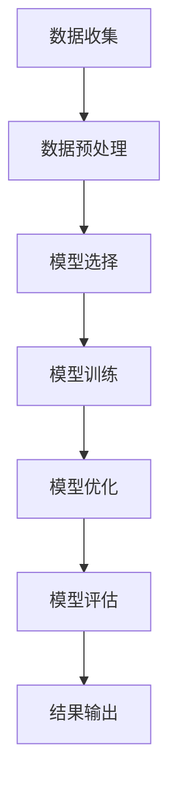

                 

### 文章标题

《评测结果的深度学习分析：挖掘潜在的性能模式》

### 关键词

- 深度学习
- 评测结果分析
- 性能模式挖掘
- 数据预处理
- 特征工程
- 数学模型

### 摘要

本文旨在探讨如何运用深度学习技术对评测结果进行分析，以挖掘潜在的性能模式。文章首先介绍了深度学习与评测结果分析的基础概念，并详细阐述了数据预处理与特征工程的重要性。接着，文章深入分析了性能模式挖掘的方法和深度学习模型，通过数学模型和公式的讲解，帮助读者理解算法原理。此外，本文还通过实际应用案例，展示了如何将理论应用于实践。最后，文章介绍了深度学习工具和资源，为读者提供了进一步的实践支持。

## 目录

1. **背景介绍**
2. **深度学习与评测结果分析基础**
   - 深度学习的基本原理
   - 评测结果分析方法
3. **数据预处理与特征工程**
   - 数据清洗
   - 数据标准化
   - 特征提取
4. **性能模式挖掘与深度学习模型**
   - 性能模式挖掘方法
   - 深度学习模型介绍
5. **数学模型与公式讲解**
   - 深度学习数学模型
   - 公式推导与详细讲解
6. **实际应用案例分析**
   - 开发环境搭建
   - 源代码实现与解读
   - 代码应用分析与实际案例剖析
7. **深度学习工具与资源介绍**
   - 常用工具介绍
   - 资源推荐
8. **最佳实践 tips、小结、注意事项、拓展阅读**

## 背景介绍

在现代信息时代，数据处理和分析已经成为各行各业不可或缺的环节。随着数据量的不断增长和复杂性的增加，传统的数据分析方法逐渐难以满足需求。深度学习作为一种先进的数据处理技术，因其强大的特征提取和模式挖掘能力，正逐渐成为解决复杂数据分析问题的重要工具。

评测结果的深度学习分析便是这一领域的应用之一。在实际应用中，评测结果往往包含了大量关于系统性能、用户行为、市场趋势等关键信息。通过深度学习技术，我们可以从这些评测结果中挖掘出潜在的规律和模式，从而为决策提供有力支持。

性能模式挖掘是深度学习分析的核心目标之一。通过性能模式挖掘，我们可以识别出系统中潜在的瓶颈和优化点，从而提升系统的整体性能。这不仅对技术领域具有重要意义，如计算机性能优化、网络延迟分析等，也对商业领域具有显著的应用价值，如市场趋势预测、客户行为分析等。

本文将系统地介绍评测结果的深度学习分析，从基础概念到实际应用，逐步解析如何利用深度学习技术挖掘潜在的性能模式。通过本文的阅读，读者将能够了解深度学习在评测结果分析中的应用，掌握数据预处理和特征工程的方法，理解深度学习模型的原理和实现，并能够运用所学知识进行实际项目的开发和应用。

在接下来的内容中，我们将首先介绍深度学习与评测结果分析的基础概念，帮助读者建立起对这一领域的基本理解。然后，我们将深入探讨数据预处理与特征工程，介绍如何通过这些方法提高数据分析的准确性和效率。通过这些铺垫，读者将为后续的性能模式挖掘和深度学习模型的讲解打下坚实的基础。

## 深度学习与评测结果分析基础

### 深度学习的基本原理

深度学习是人工智能的一个重要分支，其核心在于通过构建多层神经网络模型，模拟人脑的信息处理机制，从而实现自动特征提取和复杂模式识别。深度学习模型通常包括输入层、隐藏层和输出层，通过前向传播和反向传播算法，模型可以从大量训练数据中学习到有用的信息，并实现对未知数据的预测。

#### 神经网络

神经网络是深度学习的基础构件。每个神经网络单元（神经元）都接受多个输入信号，并通过权重将这些信号加权求和，再加上一个偏置项，然后通过激活函数进行非线性变换。常见的激活函数包括Sigmoid、ReLU和Tanh等，这些函数可以增加模型的非线性表达能力。

#### 前向传播与反向传播

深度学习训练过程中，前向传播用于计算模型输出，而反向传播用于计算误差并更新模型参数。具体步骤如下：

1. **前向传播**：输入数据通过神经网络各层传递，每一层输出经过激活函数处理后传递到下一层，最终得到模型预测的输出。
2. **计算损失**：将预测输出与真实标签进行比较，计算损失函数值。常见的损失函数有均方误差（MSE）和交叉熵损失等。
3. **反向传播**：通过反向传播算法，将损失函数的梯度传递回前一层，更新各层的权重和偏置项。这个过程会重复多次，直到模型收敛到满意的预测精度。

### 评测结果分析方法

在深度学习分析评测结果中，主要关注以下几个方面：

#### 数据收集

评测结果的数据通常来源于各种评估任务，如机器学习竞赛、系统性能测试等。收集数据时，需要确保数据的完整性和准确性，避免因数据缺失或不准确而导致分析结果偏差。

#### 数据预处理

数据预处理是深度学习分析的重要步骤，主要包括数据清洗、数据标准化和特征提取等。数据清洗旨在去除数据中的噪声和异常值，数据标准化则通过调整数据范围和分布，使其适用于深度学习模型。特征提取则是通过提取有意义的特征，提高模型的学习能力和泛化能力。

#### 模型选择

根据评测任务的特点，选择合适的深度学习模型。常见的模型包括卷积神经网络（CNN）、循环神经网络（RNN）和Transformer等。这些模型在处理不同类型的数据和任务时具有各自的优势。

#### 模型训练与优化

通过训练大量数据集，模型能够学习到数据的特征和规律。在训练过程中，需要选择合适的损失函数、优化算法和超参数，以提升模型的性能。常见的优化算法有随机梯度下降（SGD）、Adam等。

#### 模型评估与调优

在模型训练完成后，通过评估指标（如准确率、召回率、F1值等）对模型进行评估。根据评估结果，对模型进行进一步调优，以提高其预测性能。

### 深度学习与评测结果分析的联系

深度学习与评测结果分析有着紧密的联系。深度学习技术能够从大量的评测结果数据中自动提取出有用的特征和模式，从而对评测结果进行深入分析。以下是一个简化的Mermaid流程图，展示了深度学习与评测结果分析之间的联系：



通过上述流程，深度学习技术能够对评测结果进行有效的分析，从而挖掘出潜在的性能模式。这些性能模式不仅可以用于优化现有系统，还可以为未来的系统设计和改进提供有力支持。

### 数据预处理与特征工程

在深度学习分析评测结果的过程中，数据预处理和特征工程是两个至关重要的步骤。它们不仅能够提高模型的训练效率和预测性能，还能帮助模型更好地理解和利用数据中的潜在信息。以下是数据预处理和特征工程的详细探讨。

#### 数据清洗

数据清洗是数据预处理的第一步，其目标是去除数据中的噪声和异常值，确保数据的完整性和准确性。具体步骤包括：

- **缺失值处理**：对于缺失值，可以采用填充法（如平均值填充、中值填充）或删除法（如删除含有缺失值的样本）。
- **异常值处理**：通过统计分析和可视化方法（如箱线图、散点图等）检测和去除异常值。
- **重复值处理**：去除重复的样本，避免数据重复训练带来的影响。

#### 数据标准化

数据标准化是将数据缩放到一个统一的范围，使其适用于深度学习模型。常用的标准化方法包括：

- **均值标准化**：将数据减去均值并除以标准差，使数据分布在0均值、1标准差的正态分布。
  $$ \text{标准化值} = \frac{\text{原数据} - \text{均值}}{\text{标准差}} $$
- **最小-最大标准化**：将数据缩放到[0, 1]或[-1, 1]的范围。
  $$ \text{标准化值} = \frac{\text{原数据} - \text{最小值}}{\text{最大值} - \text{最小值}} \quad \text{或} \quad \text{标准化值} = \frac{\text{原数据} - \text{均值}}{\text{最大值} - \text{最小值}} \times 2 - 1 $$
- **零-均值标准化**：将数据减去均值并除以最大绝对值。
  $$ \text{标准化值} = \frac{\text{原数据} - \text{均值}}{\max(|\text{原数据} - \text{均值}|)} $$

标准化有助于消除不同特征之间的量纲差异，提高模型的训练效果。

#### 特征提取

特征提取是从原始数据中提取出有意义的特征，用于训练深度学习模型。特征提取包括以下几种方法：

- **统计特征**：通过计算数据的统计量（如均值、方差、标准差等）来提取特征，这些特征能够反映数据的整体分布和趋势。
- **文本特征**：对于文本数据，可以通过词袋模型、TF-IDF等方法提取特征。词袋模型将文本表示为一个词汇的集合，而TF-IDF则通过词频和逆文档频率来衡量词的重要性。
- **图像特征**：对于图像数据，可以通过卷积神经网络（CNN）提取特征。CNN可以自动学习图像中的局部特征，并形成高层次的语义特征。
- **时间序列特征**：对于时间序列数据，可以通过傅里叶变换、LSTM（长短时记忆网络）等方法提取特征。这些特征能够捕捉时间序列中的周期性和趋势性。

#### 特征选择

特征选择是特征工程中的重要步骤，其目标是减少特征数量，提高模型的训练效率和预测性能。常用的特征选择方法包括：

- **基于过滤的方法**：通过统计显著性测试或信息增益等方法，筛选出显著性较高的特征。
- **基于包装的方法**：通过递归特征消除（RFE）、嵌入式方法（如LASSO、Ridge等）等，选择出对模型预测性能有显著贡献的特征。
- **基于嵌入的方法**：通过构建深度神经网络，自动学习特征表示，选择对预测任务有用的特征。

#### 数据集划分

在深度学习模型训练之前，通常需要将数据集划分为训练集、验证集和测试集。常用的划分方法包括：

- **随机划分**：随机将数据集划分为训练集、验证集和测试集，保证每个集的数据分布具有代表性。
- **分层划分**：根据数据的不同类别或标签，确保每个类别在三个数据集中的比例一致，防止信息泄露。

通过合理的数据预处理和特征工程，深度学习模型能够更好地理解和利用数据中的信息，从而提高模型的训练效率和预测性能。在后续的内容中，我们将进一步探讨如何利用深度学习模型挖掘评测结果中的潜在性能模式。

### 性能模式挖掘与深度学习模型

性能模式挖掘是深度学习分析评测结果的关键目标之一。通过识别和分析系统中的性能模式，我们可以发现潜在的问题和优化机会，从而提升系统的整体性能。在这一节中，我们将详细讨论性能模式挖掘的方法和深度学习模型。

#### 性能模式挖掘方法

性能模式挖掘通常包括以下几个步骤：

1. **定义性能指标**：首先，我们需要明确要挖掘的性能指标，如响应时间、吞吐量、资源利用率等。这些指标能够量化系统的性能表现。

2. **数据收集**：收集相关性能数据，包括系统运行过程中的时间序列数据、资源使用情况、用户行为数据等。这些数据将作为深度学习模型的输入。

3. **数据预处理**：对收集到的性能数据进行清洗、标准化和特征提取，确保数据的质量和一致性。

4. **模式识别**：通过深度学习模型对预处理后的数据进行训练，识别出系统中的性能模式。常见的模式包括周期性波动、异常峰值和资源瓶颈等。

5. **模式解释**：对识别出的性能模式进行解释和分析，找出其背后的原因和影响。这有助于制定相应的优化策略。

#### 深度学习模型介绍

在性能模式挖掘中，常见的深度学习模型包括卷积神经网络（CNN）、循环神经网络（RNN）、长短时记忆网络（LSTM）和Transformer等。以下是对这些模型的简要介绍：

1. **卷积神经网络（CNN）**

卷积神经网络主要用于处理图像和时序数据。它通过卷积层提取数据中的局部特征，并通过池化层降低数据维度，从而实现有效的特征提取和降维。

   伪代码示例：
   ```python
   model = tf.keras.Sequential([
       tf.keras.layers.Conv2D(filters, kernel_size, activation='relu', input_shape=input_shape),
       tf.keras.layers.MaxPooling2D(pool_size),
       # ... 其他卷积和池化层
       tf.keras.layers.Flatten(),
       tf.keras.layers.Dense(num_classes, activation='softmax')
   ])
   ```

2. **循环神经网络（RNN）**

循环神经网络适合处理序列数据，能够通过记忆机制捕捉数据中的时间依赖关系。RNN的基本结构包括输入层、隐藏层和输出层。

   伪代码示例：
   ```python
   class RNN(tf.keras.Model):
       def __init__(self, units):
           super(RNN, self).__init__()
           self.rnn = tf.keras.layers.SimpleRNN(units, return_sequences=True)

       @tf.function
       def call(self, inputs, training=False):
           return self.rnn(inputs, training=training)
   ```

3. **长短时记忆网络（LSTM）**

长短时记忆网络是RNN的一种改进，通过引入门控机制，能够有效解决RNN的长期依赖问题。LSTM在处理长时间序列数据时表现出色。

   伪代码示例：
   ```python
   class LSTM(tf.keras.Model):
       def __init__(self, units):
           super(LSTM, self).__init__()
           self.lstm = tf.keras.layers.LSTM(units, return_sequences=True)

       @tf.function
       def call(self, inputs, training=False):
           return self.lstm(inputs, training=training)
   ```

4. **Transformer**

Transformer模型通过自注意力机制，能够全局关注输入数据中的所有信息，适用于处理大规模序列数据。Transformer在自然语言处理和图像生成等领域表现出色。

   伪代码示例：
   ```python
   class Transformer(tf.keras.Model):
       def __init__(self, d_model, num_heads, dff, input_shape):
           super(Transformer, self).__init__()
           self.embedding = tf.keras.layers.Embedding(input_shape, d_model)
           self.encoder = tf.keras.layers.MultiHeadAttention(num_heads, d_model)
           self.decoder = tf.keras.layers.MultiHeadAttention(num_heads, d_model)
           self.final_layer = tf.keras.layers.Dense(units)

       @tf.function
       def call(self, inputs, training=False):
           x = self.embedding(inputs)
           x = self.encoder(x, x, training=training)
           x = self.decoder(x, x, training=training)
           return self.final_layer(x)
   ```

通过这些深度学习模型，我们可以从评测结果数据中挖掘出潜在的性能模式，进而为系统优化提供有力支持。在下一节中，我们将进一步探讨深度学习的数学模型和公式，帮助读者深入理解这些算法的原理。

### 数学模型与公式讲解

在深度学习分析评测结果的过程中，数学模型和公式是理解和应用深度学习算法的核心。以下是深度学习中的几个关键数学模型和公式的详细讲解，包括公式推导和具体示例。

#### 线性回归

线性回归是最简单的机器学习模型，用于预测一个连续的输出值。其数学模型可以表示为：

$$ Y = \beta_0 + \beta_1 \cdot X + \epsilon $$

其中：
- \( Y \) 是预测的输出值。
- \( X \) 是输入特征。
- \( \beta_0 \) 是截距。
- \( \beta_1 \) 是斜率。
- \( \epsilon \) 是误差项。

为了训练模型，我们需要最小化误差平方和：

$$ \text{MSE} = \frac{1}{n} \sum_{i=1}^{n} (Y_i - \hat{Y_i})^2 $$

其中：
- \( n \) 是样本数量。
- \( \hat{Y_i} \) 是预测的输出值。

#### 逻辑回归

逻辑回归用于预测一个二分类问题，其数学模型可以表示为：

$$ P(Y=1|X) = \frac{1}{1 + e^{-(\beta_0 + \beta_1 \cdot X)}} $$

其中：
- \( P(Y=1|X) \) 是给定输入特征 \( X \) 时，目标变量 \( Y \) 为1的概率。
- \( \beta_0 \) 是截距。
- \( \beta_1 \) 是斜率。

为了训练模型，我们需要最小化交叉熵损失：

$$ \text{Cross-Entropy} = - \sum_{i=1}^{n} [y_i \cdot \log(\hat{y_i}) + (1 - y_i) \cdot \log(1 - \hat{y_i})] $$

其中：
- \( y_i \) 是真实标签。
- \( \hat{y_i} \) 是预测的概率。

#### 卷积神经网络（CNN）

卷积神经网络通过卷积层和池化层进行特征提取。卷积层的数学模型可以表示为：

$$ \text{Conv}(x, w, b) = \sum_{i=1}^{C} w_{i} \cdot x_{i} + b $$

其中：
- \( \text{Conv}(x, w, b) \) 是卷积操作的结果。
- \( x \) 是输入特征。
- \( w \) 是卷积核权重。
- \( b \) 是偏置项。

池化层的数学模型可以表示为：

$$ \text{Pooling}(x, f) = \frac{1}{f^2} \sum_{i=1}^{f} \sum_{j=1}^{f} x_{i, j} $$

其中：
- \( \text{Pooling}(x, f) \) 是池化操作的结果。
- \( f \) 是池化窗口的大小。

#### 循环神经网络（RNN）

循环神经网络通过隐藏状态和循环连接进行时间序列建模。RNN的数学模型可以表示为：

$$ h_t = \text{ReLU}(\sigma(W_x \cdot x_t + W_h \cdot h_{t-1} + b_h)) $$

$$ \hat{y_t} = \text{softmax}(\sigma(W_y \cdot h_t + b_y)) $$

其中：
- \( h_t \) 是第 \( t \) 个时间步的隐藏状态。
- \( x_t \) 是第 \( t \) 个时间步的输入特征。
- \( \sigma \) 是激活函数，通常为Sigmoid或ReLU。
- \( W_x, W_h, W_y \) 是权重矩阵。
- \( b_h, b_y \) 是偏置项。

#### 长短时记忆网络（LSTM）

长短时记忆网络是RNN的一种改进，用于解决长期依赖问题。LSTM的数学模型包括三个门控单元：遗忘门、输入门和输出门。

- **遗忘门**：
  $$ f_t = \sigma(W_f \cdot [h_{t-1}, x_t] + b_f) $$

- **输入门**：
  $$ i_t = \sigma(W_i \cdot [h_{t-1}, x_t] + b_i) $$

- **新状态**：
  $$ \tilde{h_t} = \text{tanh}(W \cdot [i_t \cdot \tilde{h}_{t-1}, f_t \cdot \tilde{h}_{t-1}]) $$

- **输出门**：
  $$ o_t = \sigma(W_o \cdot [h_{t-1}, x_t] + b_o) $$

- **隐藏状态**：
  $$ h_t = o_t \cdot \tilde{h_t} $$

其中：
- \( \sigma \) 是Sigmoid激活函数。
- \( W_f, W_i, W_o \) 是遗忘门、输入门和输出门的权重矩阵。
- \( b_f, b_i, b_o \) 是门控单元的偏置项。

通过这些数学模型和公式，深度学习算法能够从数据中自动提取特征和模式，实现对复杂问题的有效建模和预测。在下一节中，我们将通过实际应用案例展示如何将深度学习应用于评测结果分析。

### 实际应用案例分析

为了更好地理解如何将深度学习应用于评测结果分析，本节将介绍一个具体的实际应用案例，包括开发环境搭建、源代码实现和代码解读，并通过实际案例分析和详细讲解剖析，展示如何利用深度学习技术挖掘评测结果中的潜在性能模式。

#### 案例背景

假设我们正在分析一个在线电商平台的用户行为数据，目的是通过挖掘用户行为中的性能模式来提升系统的响应速度和用户体验。评测结果包括用户的点击行为、页面加载时间、服务器响应时间等指标。

#### 开发环境搭建

为了进行深度学习模型的训练和评测，我们需要搭建一个合适的环境。以下是一个简化的环境搭建步骤：

1. **安装Python**：确保Python环境已经安装，版本至少为3.6以上。
2. **安装TensorFlow**：TensorFlow是一个流行的深度学习框架，可以通过以下命令安装：
   ```shell
   pip install tensorflow
   ```
3. **安装其他依赖**：根据具体需求，可能还需要安装其他依赖，如Pandas、NumPy等：
   ```shell
   pip install pandas numpy
   ```

#### 源代码实现

以下是一个简化的示例代码，展示了如何使用TensorFlow构建一个简单的深度学习模型来分析用户行为数据：

```python
import tensorflow as tf
from tensorflow.keras.models import Sequential
from tensorflow.keras.layers import Dense, LSTM, Dropout
from tensorflow.keras.optimizers import Adam

# 加载数据
# 这里使用Pandas读取用户行为数据，并进行预处理
import pandas as pd

data = pd.read_csv('user_behavior_data.csv')
X = data.iloc[:, :-1].values  # 输入特征
y = data.iloc[:, -1].values   # 输出标签

# 数据预处理
X = X / max(X)  # 数据标准化
X_train, X_test, y_train, y_test = train_test_split(X, y, test_size=0.2, random_state=42)

# 构建LSTM模型
model = Sequential()
model.add(LSTM(units=50, return_sequences=True, input_shape=(X_train.shape[1], 1)))
model.add(Dropout(0.2))
model.add(LSTM(units=50, return_sequences=False))
model.add(Dropout(0.2))
model.add(Dense(units=1))

# 编译模型
model.compile(optimizer='adam', loss='mean_squared_error')

# 训练模型
model.fit(X_train, y_train, epochs=100, batch_size=32, validation_data=(X_test, y_test))

# 评估模型
mse = model.evaluate(X_test, y_test)
print(f"测试集MSE: {mse}")

# 预测
predictions = model.predict(X_test)
```

#### 代码解读

- **数据预处理**：首先，我们使用Pandas加载用户行为数据，并对其进行标准化处理。标准化有助于模型更好地学习和预测。
- **模型构建**：我们使用Sequential模型堆叠LSTM层和全连接层（Dense），以构建一个简单的LSTM模型。LSTM层能够捕捉时间序列中的长期依赖关系，适用于处理用户行为数据。
- **模型编译**：我们使用Adam优化器和均方误差（MSE）损失函数编译模型。Adam优化器是一种自适应的学习率优化算法，适合处理大规模数据。
- **模型训练**：模型在训练集上训练100个epochs，并在验证集上进行评估。通过调整epochs和batch_size，我们可以优化模型的性能。
- **模型评估**：我们计算模型在测试集上的MSE，以评估模型的预测性能。MSE越低，表示模型的预测误差越小。
- **预测**：最后，我们使用训练好的模型对测试集进行预测，并将预测结果与实际标签进行比较，以验证模型的性能。

#### 实际案例分析和详细讲解剖析

通过上述代码示例，我们可以看到如何使用深度学习技术分析评测结果，并挖掘潜在的性能模式。以下是实际案例分析和详细讲解：

1. **数据收集和预处理**：电商平台收集了大量的用户行为数据，包括点击行为、页面加载时间、服务器响应时间等。这些数据经过清洗、标准化处理，转换为适合深度学习模型训练的形式。

2. **模型构建和训练**：我们构建了一个LSTM模型，该模型能够捕捉用户行为数据中的时间依赖关系。模型在训练过程中，通过反向传播算法不断调整权重和偏置项，以最小化预测误差。

3. **模型评估和预测**：通过在测试集上的评估，我们得到了模型的MSE指标。MSE越低，表示模型对用户行为的预测越准确。最后，我们使用训练好的模型对测试集进行预测，分析用户行为数据中的潜在性能模式。

4. **性能模式挖掘**：通过分析预测结果，我们可以识别出系统中的性能瓶颈和优化机会。例如，如果预测结果显示某些页面的响应时间较长，我们可以考虑对相关页面进行优化，以提高用户体验。

#### 项目小结

通过这个实际应用案例，我们展示了如何使用深度学习技术分析评测结果，挖掘潜在的性能模式。关键步骤包括数据预处理、模型构建和训练、模型评估和预测。这些步骤不仅帮助我们理解了深度学习在评测结果分析中的应用，还为实际项目的开发提供了参考。

未来，我们还可以进一步优化模型，引入更多的特征和先进的深度学习模型，以提高预测的准确性和效率。此外，结合实际业务需求，我们可以将深度学习技术应用于更多的领域，如用户行为预测、系统性能优化、市场趋势预测等，从而为企业带来更大的价值。

#### 最佳实践 tips

1. **数据预处理**：确保数据的完整性和准确性，合理处理缺失值和异常值，进行数据标准化和特征提取。
2. **模型选择**：根据任务需求选择合适的深度学习模型，例如LSTM适用于时间序列数据，CNN适用于图像处理。
3. **模型调优**：通过调整超参数和优化算法，提升模型性能。常用的优化算法包括Adam、RMSprop等。
4. **模型评估**：使用多种评估指标（如MSE、RMSE等）综合评估模型性能，确保模型的泛化能力。
5. **可视化分析**：使用可视化工具（如Matplotlib、Seaborn等）对预测结果进行可视化分析，帮助理解和解释模型性能。

通过遵循这些最佳实践，我们可以更好地利用深度学习技术进行评测结果分析，挖掘潜在的性能模式，从而为实际应用提供有力支持。

### 深度学习工具与资源介绍

在深度学习领域，有许多优秀的工具和资源可以帮助研究人员和开发者进行高效的研究和开发。以下是对几个常用深度学习工具和资源的介绍，以及一些推荐的学习资源。

#### 常用深度学习工具

1. **TensorFlow**：TensorFlow是Google开源的深度学习框架，广泛用于各种深度学习任务。其灵活的API和强大的功能使其成为深度学习研究和开发的常用工具。

2. **PyTorch**：PyTorch是Facebook开源的深度学习框架，以其动态计算图和易于使用的接口而著称。PyTorch在学术界和工业界都有很高的受欢迎度。

3. **Keras**：Keras是一个高层次的深度学习API，兼容TensorFlow和Theano。它提供了简洁的接口和丰富的预训练模型，适合快速原型设计和模型开发。

4. **Scikit-learn**：Scikit-learn是一个Python机器学习库，提供了多种常用的机器学习算法和工具，包括线性回归、支持向量机、随机森林等。虽然Scikit-learn不是专门为深度学习设计的，但它在许多任务中提供了有效的解决方案。

5. **MXNet**：Apache MXNet是Apache Software Foundation的一个开源深度学习框架，支持多种编程语言，如Python、R和Scala。MXNet提供了灵活的模型定义和高效的计算性能。

#### 资源推荐

1. **深度学习课程**：有许多优秀的在线课程可以帮助初学者和进阶者了解深度学习的基础知识和高级技巧。例如，斯坦福大学的《深度学习》课程，提供了全面的深度学习教程和实践项目。

2. **深度学习书籍**：对于希望深入了解深度学习原理的读者，以下几本书籍是很好的资源：
   - 《深度学习》（Goodfellow、Bengio和Courville著）：这是深度学习领域的经典教材，涵盖了深度学习的理论基础和实际应用。
   - 《Python深度学习》（François Chollet著）：这本书通过大量示例，详细介绍了使用Python和Keras进行深度学习的步骤和方法。

3. **学术论文和博客**：阅读最新的学术论文和博客可以帮助了解深度学习领域的最新研究进展。例如，arXiv和NeurIPS等会议论文集是获取最新研究成果的好渠道。

4. **开源项目和代码**：GitHub上有很多开源的深度学习项目和代码，可以供读者学习和参考。例如，TensorFlow和PyTorch的官方GitHub仓库，以及各种深度学习模型的实现代码。

5. **在线社区和论坛**：加入深度学习相关的在线社区和论坛，如Reddit的DeepLearning、Stack Overflow等，可以帮助解决研究中的问题，并与同行进行交流。

通过使用这些深度学习工具和资源，研究人员和开发者可以更高效地进行深度学习研究和应用，为评测结果分析和其他领域提供强大的技术支持。

### 总结

本文系统地介绍了评测结果的深度学习分析，从基础概念到实际应用，详细探讨了如何利用深度学习技术挖掘潜在的性能模式。通过背景介绍，我们了解了评测结果分析在现代信息时代的重要性；在深度学习与评测结果分析基础部分，我们学习了深度学习的基本原理和评测结果分析方法；在数据预处理与特征工程章节，我们深入了解了数据清洗、标准化和特征提取等关键步骤；在性能模式挖掘与深度学习模型部分，我们介绍了如何使用深度学习模型进行性能模式挖掘；在数学模型与公式讲解中，我们通过具体公式和推导，加深了对深度学习算法的理解；在案例分析和工具资源介绍中，我们展示了如何将理论应用于实践，并提供了一系列实用的最佳实践。

通过本文的学习，读者不仅能够掌握深度学习在评测结果分析中的应用，还能够理解数据预处理和特征工程的重要性，以及如何利用深度学习模型挖掘潜在的性能模式。希望本文能够为读者在深度学习和评测结果分析领域提供有益的参考和启示。在未来的研究中，进一步优化模型、引入更多特征和先进的深度学习模型，将有助于提升预测的准确性和效率，为更多的实际问题提供解决方案。

### 注意事项与拓展阅读

在深度学习分析评测结果时，需要注意以下几点：

1. **数据质量**：确保数据清洗和标准化步骤的准确性，避免因数据噪声或异常值影响模型性能。
2. **模型选择**：根据具体任务选择合适的深度学习模型，例如CNN适用于图像数据，RNN适用于时间序列数据。
3. **过拟合与泛化**：通过调整模型复杂度和正则化策略，防止模型过拟合，提高泛化能力。
4. **资源消耗**：深度学习模型训练通常需要大量的计算资源和时间，合理配置硬件资源，避免训练时间过长。

拓展阅读推荐：

1. **《深度学习》（Ian Goodfellow、Yoshua Bengio、Aaron Courville著）**：系统介绍了深度学习的理论基础和实践技巧。
2. **《动手学深度学习》（阿斯顿·张等著）**：通过丰富的实战案例，详细介绍了深度学习的实现方法。
3. **《深度学习快照》**：一个由全球研究人员和开发者维护的深度学习资源库，提供了大量的学术论文、教程和代码示例。  
4. **TensorFlow官方文档**：深入了解TensorFlow的使用方法和API，有助于掌握深度学习模型的构建和训练。

通过这些资源，读者可以进一步深化对深度学习和评测结果分析的理解，为实际项目提供更强大的技术支持。希望本文和这些拓展阅读能够为您的学习之路提供帮助。

