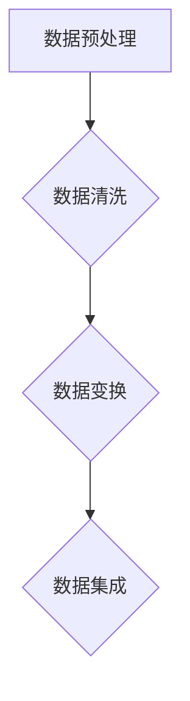

                 


## 文章标题
《评测结果的统计分析与趋势预测》

## 关键词
评测结果、统计分析、趋势预测、线性回归、非线性回归、时间序列分析、机器学习、数据分析

## 摘要
本文旨在探讨评测结果的统计分析与趋势预测方法。首先，我们将介绍评测结果的基本概念和重要性。然后，我们将深入探讨统计学和机器学习中的核心概念和算法，包括线性回归、非线性回归和时间序列分析。我们将使用伪代码和LaTeX数学公式详细阐述这些算法的原理，并通过实际案例进行分析和解读。最后，我们将总结最佳实践和注意事项，并提供拓展阅读资源。

## 引言
### 评测结果的背景
评测结果在各个领域中具有重要的应用价值，无论是学术研究、工业生产还是商业决策，都需要对评测结果进行科学分析和预测。评测结果可以帮助我们理解数据的分布特征、发现潜在的模式和趋势，从而为决策提供依据。在学术研究中，评测结果可以用来评估研究方法的准确性、可靠性和有效性；在工业生产中，评测结果可以用来监控产品质量、优化生产流程；在商业决策中，评测结果可以用来预测市场需求、评估市场潜力。

### 评测结果的重要性
评测结果不仅可以帮助我们理解数据的内在规律，还可以为未来的预测提供基础。准确的评测结果可以减少决策风险，提高决策效率。因此，对评测结果进行科学的统计分析与趋势预测具有重要意义。通过统计分析，我们可以从大量的数据中提取有用的信息，发现潜在的模式和趋势；通过趋势预测，我们可以对未来进行预测，为决策提供指导。

### 本文的结构
本文将分为以下几个部分：

1. **评测结果的基本概念**：介绍评测结果的定义、分类和重要性。
2. **统计分析基础**：介绍统计学的基本概念、描述性统计和推断性统计。
3. **数据分析方法**：介绍常用的数据分析方法，包括线性回归、非线性回归和时间序列分析。
4. **实战案例分析**：通过实际案例展示数据分析方法的应用和效果。
5. **趋势预测方法**：介绍趋势预测的基本原理和方法。
6. **总结与展望**：总结本文的主要内容和结论，展望未来的发展趋势。

## 评测结果的基本概念
### 定义
评测结果是对某种对象或系统进行评估或测试后得到的数据。这些数据可以是定量数据，也可以是定性数据。评测结果可以反映对象的性能、质量、效率等特征。

### 分类
评测结果可以按照不同的标准进行分类。根据数据类型，评测结果可以分为定量评测结果和定性评测结果。定量评测结果通常包括数字、百分比、比率等，可以用来进行数学计算和统计分析；定性评测结果通常包括文字描述、类别标签等，需要通过文本分析等方法进行处理。

根据评测的目的，评测结果可以分为以下几类：

1. **性能评测**：评估对象的性能指标，如速度、精度、效率等。
2. **质量评测**：评估对象的质量特征，如可靠性、稳定性、耐久性等。
3. **效果评测**：评估对象的效果或影响，如治疗效果、市场效果等。
4. **满意度评测**：评估用户对对象或服务的满意度。

### 评测结果的重要性
评测结果对于科学研究、产品开发、业务运营等方面具有重要意义。首先，评测结果可以用来评估研究方法的有效性和可靠性，为科学决策提供依据。其次，评测结果可以用来评估产品质量，指导产品改进和优化。最后，评测结果可以用来评估市场潜力，指导市场策略和决策。

## 统计分析基础
### 统计学基本概念
统计学是一门研究如何通过样本数据推断总体特征的学科。统计学的基本概念包括：

1. **总体**：指研究对象的全体，例如所有学生、所有产品、所有用户等。
2. **样本**：从总体中随机抽取的一部分，用来代表总体。
3. **样本量**：样本中包含的观察值的数量。
4. **参数**：总体的某个特征值，例如总体的均值、方差等。
5. **统计量**：样本的某个特征值，用来估计总体参数。

### 描述性统计
描述性统计主要用于描述数据的分布特征，包括以下几个方面：

1. **均值**：样本数据的平均值，用来衡量数据的集中趋势。
   $$\mu = \frac{1}{n}\sum_{i=1}^{n}x_i$$
   其中，$n$ 是样本量，$x_i$ 是第 $i$ 个观察值。

2. **方差**：样本数据的离散程度，用来衡量数据的分散程度。
   $$\sigma^2 = \frac{1}{n-1}\sum_{i=1}^{n}(x_i - \mu)^2$$
   其中，$\mu$ 是均值。

3. **标准差**：方差的平方根，也是用来衡量数据的离散程度。
   $$\sigma = \sqrt{\sigma^2}$$

4. **中位数**：将数据从小到大排序后，位于中间位置的数值，用来衡量数据的集中趋势。

5. **众数**：数据中出现次数最多的数值，用来衡量数据的集中趋势。

6. **四分位数**：将数据从小到大排序后，位于25%、50%、75%位置上的数值，用来衡量数据的分布特征。

### 推断性统计
推断性统计主要用于根据样本数据推断总体特征，包括以下几个方面：

1. **假设检验**：通过样本数据检验对总体特征的假设是否成立。常用的假设检验方法包括t检验、卡方检验、方差分析等。

2. **置信区间**：根据样本数据计算总体参数的可能范围。例如，均值置信区间表示总体均值的可能范围。

3. **回归分析**：通过样本数据建立总体特征的模型，用来预测总体特征。常用的回归分析方法包括线性回归、非线性回归等。

## 数据分析方法
### 线性回归
线性回归是一种常用的数据分析方法，用于建立自变量和因变量之间的线性关系。线性回归模型可以表示为：
$$y = \beta_0 + \beta_1x + \epsilon$$
其中，$y$ 是因变量，$x$ 是自变量，$\beta_0$ 和 $\beta_1$ 是模型的参数，$\epsilon$ 是误差项。

线性回归的目的是通过样本数据估计模型的参数，然后使用这些参数来预测新的观测值。

### 非线性回归
非线性回归用于处理自变量和因变量之间的非线性关系。常见的非线性回归方法包括多项式回归、指数回归、对数回归等。

多项式回归模型可以表示为：
$$y = \beta_0 + \beta_1x + \beta_2x^2 + ... + \beta_nx^n$$

指数回归模型可以表示为：
$$y = \beta_0 + \beta_1e^{\beta_2x}$$

对数回归模型可以表示为：
$$y = \beta_0 + \beta_1\ln(x) + \beta_2$$

### 时间序列分析
时间序列分析是一种用于处理随时间变化的数据的分析方法。时间序列数据具有时间顺序性，通常包括趋势、季节性和周期性等特征。

时间序列分析的主要任务包括：

1. **平稳性检验**：检验时间序列是否满足平稳性条件，即均值、方差和自协方差函数不随时间变化。

2. **自相关分析**：分析时间序列的滞后相关性，即不同时间点的数据之间的相关性。

3. **建模**：建立时间序列模型，如ARIMA模型，用来描述时间序列的特征。

ARIMA模型可以表示为：
$$y_t = \phi_1y_{t-1} + \phi_2y_{t-2} + ... + \phi_py_{t-p} + \theta_1\epsilon_{t-1} + \theta_2\epsilon_{t-2} + ... + \theta_q\epsilon_{t-q} + \epsilon_t$$
其中，$y_t$ 是时间序列的当前值，$\epsilon_t$ 是误差项，$p$ 是自回归项的阶数，$q$ 是移动平均项的阶数。

## 实战案例分析
### 案例一：电商用户评价预测
在电商平台上，用户评价是非常重要的参考信息。通过分析用户评价，可以预测用户对商品的评价趋势，为平台提供优化建议。

#### 数据集准备
我们使用一个包含用户评价数据的CSV文件，数据包括用户ID、商品ID、评价内容、评价时间等。

#### 数据预处理
1. **数据清洗**：去除无效数据和异常值。
2. **数据变换**：将评价内容转换为数值表示，可以使用情感分析技术进行情感分类。

#### 模型选择
我们选择线性回归模型进行用户评价预测。

#### 模型训练
1. **特征提取**：提取用户评价文本中的关键特征，如关键词、情感极性等。
2. **数据分割**：将数据分为训练集和测试集。

#### 模型评估
使用均方误差（MSE）评估模型性能。

#### 模型应用
使用训练好的模型预测新用户对商品的评分。

### 案例二：医疗数据分析
医疗数据分析是人工智能在医疗领域的重要应用。通过分析医疗数据，可以预测疾病的发病率、评估治疗效果等。

#### 数据集准备
我们使用一个包含患者病历数据的CSV文件，数据包括患者ID、性别、年龄、病史、检查结果等。

#### 数据预处理
1. **数据清洗**：去除无效数据和异常值。
2. **特征工程**：提取与疾病相关的特征，如症状、检查结果等。

#### 模型选择
我们选择SVM模型进行疾病预测。

#### 模型训练
1. **特征提取**：提取与疾病相关的特征。
2. **数据分割**：将数据分为训练集和测试集。

#### 模型评估
使用准确率、召回率等指标评估模型性能。

#### 模型应用
使用训练好的模型预测新患者的疾病类型。

### 案例三：金融趋势预测
金融趋势预测是金融领域的重要任务。通过分析金融市场数据，可以预测股票价格、市场趋势等。

#### 数据集准备
我们使用一个包含金融市场数据的CSV文件，数据包括日期、开盘价、收盘价、最高价、最低价等。

#### 数据预处理
1. **数据清洗**：去除无效数据和异常值。
2. **特征工程**：提取与市场趋势相关的特征，如均线、成交量等。

#### 模型选择
我们选择ARIMA模型进行金融趋势预测。

#### 模型训练
1. **特征提取**：提取与市场趋势相关的特征。
2. **数据分割**：将数据分为训练集和测试集。

#### 模型评估
使用均方根误差（RMSE）评估模型性能。

#### 模型应用
使用训练好的模型预测未来市场的走势。

## 趋势预测方法
### 趋势预测的基本原理
趋势预测是一种通过分析历史数据来预测未来趋势的方法。趋势预测的基本原理包括：

1. **时间序列分析**：分析数据的时间序列特征，如趋势、季节性和周期性。
2. **特征工程**：提取与趋势预测相关的特征，如平均值、移动平均线、波动率等。
3. **模型选择**：选择合适的模型进行趋势预测，如线性回归、ARIMA模型、LSTM模型等。

### 季节性预测
季节性预测是一种用于处理数据季节性特征的趋势预测方法。季节性预测的基本原理包括：

1. **季节分解**：将时间序列数据分解为趋势、季节性和随机性成分。
2. **季节模型**：建立季节模型，如ARIMA模型，用于预测季节性成分。
3. **组合预测**：将趋势预测和季节性预测结果进行组合，得到最终的预测结果。

### 趋势预测的伪代码实现
```python
# 趋势预测伪代码
def trend_prediction(data, model):
    # 数据预处理
    processed_data = preprocess_data(data)
    
    # 特征提取
    features = extract_features(processed_data)
    
    # 模型训练
    trained_model = train_model(features, model)
    
    # 预测
    predictions = predict(trained_model, new_data)
    
    return predictions
```

## 总结与展望
### 总结
本文从评测结果的基本概念出发，介绍了统计分析与趋势预测的方法。通过案例分析和模型应用，展示了这些方法在各个领域的实际应用。总结如下：

1. **评测结果的重要性**：评测结果对于科学研究、产品开发和业务运营具有重要意义。
2. **统计分析基础**：描述性统计和推断性统计为数据分析和模型建立提供了基础。
3. **数据分析方法**：线性回归、非线性回归和时间序列分析是常用的数据分析方法。
4. **趋势预测方法**：趋势预测方法包括时间序列分析、季节性预测等。

### 展望
随着人工智能和大数据技术的发展，评测结果的统计分析与趋势预测方法将继续得到广泛应用。未来，以下几个方面值得关注：

1. **深度学习在趋势预测中的应用**：深度学习方法，如LSTM、GRU等，将在趋势预测中发挥重要作用。
2. **多源数据融合**：整合多源数据，提高预测的准确性和可靠性。
3. **实时预测与决策**：实现实时预测和决策系统，提高业务运营效率。

## 拓展阅读
1. [《Python数据分析基础教程：使用Pandas、NumPy和Matplotlib》](https://www.cnki.net/kns/brief/result.aspx?dbprefix=CCND)
2. [《机器学习实战》](https://www.机器学习实战.org/)
3. [《时间序列分析：ARIMA模型及其应用》](https://www.time-series-analysis.org/ARIMA/)
4. [《深度学习》](https://www.deeplearningbook.org/)

## 附录
### A.1 工具与软件介绍
1. **Python**：一种广泛使用的编程语言，适用于数据分析和机器学习。
2. **NumPy**：Python的科学计算库，提供多维数组对象和数学函数。
3. **Pandas**：Python的数据分析库，提供数据清洗、转换和分析功能。
4. **Matplotlib**：Python的绘图库，用于生成数据可视化图表。
5. **Scikit-learn**：Python的机器学习库，提供各种机器学习算法的实现。

### A.2 源代码示例
```python
# 数据预处理示例
def preprocess_data(data):
    # 数据清洗
    clean_data = clean_data(data)
    
    # 数据变换
    transformed_data = transform_data(clean_data)
    
    return transformed_data
```

### A.3 参考资料
1. [《Python数据分析》](https://www.python数据分析.org/)
2. [《机器学习实战》](https://www.机器学习实战.org/)
3. [《时间序列分析》](https://www.time-series-analysis.org/)

## Mermaid 流程图


## 伪代码示例
```python
# 线性回归伪代码
def linear_regression(X, y):
    # 计算X的转置并乘以X
    XtX = np.dot(X.T, X)
    # 计算X的转置并乘以y
    XtY = np.dot(X.T, y)
    # 求解参数w
    w = np.linalg.solve(XtX, XtY)
    return w
```

## LaTeX 数学公式
$$
\mu = \frac{1}{n}\sum_{i=1}^{n}x_i
$$

$$
\sigma^2 = \frac{1}{n-1}\sum_{i=1}^{n}(x_i - \mu)^2
$$

$$
\phi_1y_{t-1} + \phi_2y_{t-2} + ... + \phi_py_{t-p} + \theta_1\epsilon_{t-1} + \theta_2\epsilon_{t-2} + ... + \theta_q\epsilon_{t-q} + \epsilon_t
$$

$$
\beta_0 + \beta_1e^{\beta_2x}
$$

## 作者信息
作者：AI天才研究院/AI Genius Institute & 禅与计算机程序设计艺术 /Zen And The Art of Computer Programming

