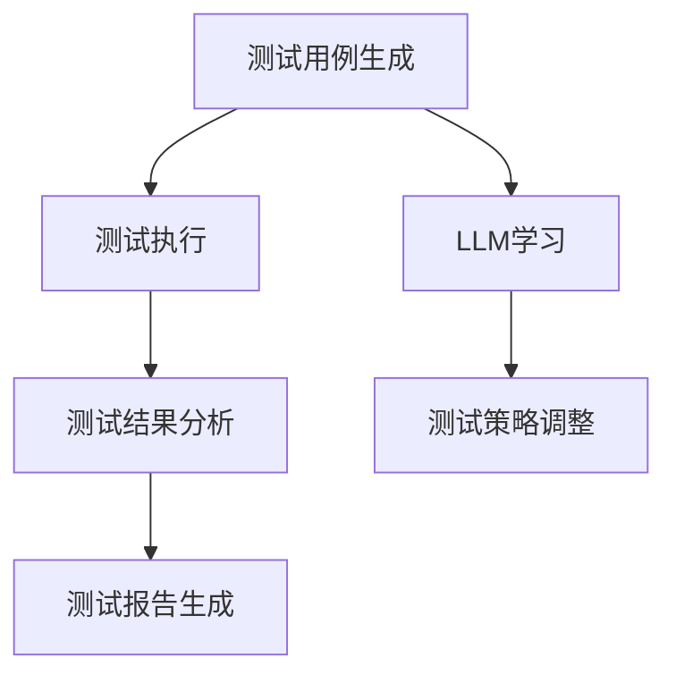

                 


### 文章标题：评测过程的自动化：LLM驱动的端到端测试流程

> 关键词：评测过程、自动化测试、LLM、端到端测试、测试流程设计

> 摘要：本文深入探讨了评测过程的自动化，特别关注LLM（大型语言模型）在端到端测试流程中的应用。通过分析核心概念和算法原理，结合数学模型和实际案例，本文旨在为读者提供全面的评测过程自动化解决方案。

---

## 引言

在当今快速发展的软件行业中，评测过程的自动化已成为提升软件质量和开发效率的关键途径。传统的手动测试方法不仅耗时耗力，而且容易产生错误。因此，自动化测试逐渐成为主流。然而，传统的自动化测试仍存在一定的局限性，例如测试用例的生成和执行往往需要人工干预，测试结果的分析也缺乏深度。为了解决这些问题，LLM（大型语言模型）的引入为评测过程的自动化带来了新的可能。

本文将首先介绍自动化测试的背景与挑战，随后深入探讨LLM的基本概念和原理。接下来，我们将详细阐述评测过程自动化的设计，以及LLM在测试流程中的应用。随后，本文将介绍端到端测试的概念，并探讨如何使用LLM实现端到端测试的自动化。最后，本文将结合实际应用场景，分析评测过程自动化的最佳实践，并提供项目实战的详细解析。

---

## 核心概念与联系

### 自动化测试

自动化测试是一种通过使用工具和脚本自动化执行测试用例的方法，以提高测试效率和准确性。与传统手动测试相比，自动化测试能够节省大量时间和人力成本。然而，自动化测试也面临着一些挑战，如测试用例的生成和执行通常需要人工参与，测试结果的分析也缺乏深度。

### LLM

LLM（大型语言模型）是一种基于深度学习的自然语言处理技术，能够通过学习大量文本数据，生成符合上下文语境的文本。LLM具有强大的语义理解和生成能力，使其在许多应用场景中表现出色，如文本生成、文本分类、问答系统等。

### 自动化测试与LLM的联系

LLM在自动化测试中的应用主要体现在以下几个方面：

1. **测试用例生成**：LLM可以通过学习大量测试数据，自动生成新的测试用例，减少人工干预。
2. **测试执行**：LLM可以自动执行测试用例，并根据测试结果调整测试策略。
3. **测试结果分析**：LLM可以分析测试结果，生成详细的测试报告，并提供改进建议。

### Mermaid流程图

以下是一个描述自动化测试与LLM联系的Mermaid流程图：



---

## 核心算法原理讲解

### 测试用例生成算法

```python
# 伪代码：测试用例生成算法

# 输入：测试数据集
# 输出：测试用例

def generate_test_cases(data_set):
    test_cases = []
    for data in data_set:
        test_case = LLM.generate_text(data)
        test_cases.append(test_case)
    return test_cases
```

### 测试执行算法

```python
# 伪代码：测试执行算法

# 输入：测试用例
# 输出：测试结果

def execute_test_cases(test_cases):
    test_results = []
    for test_case in test_cases:
        result = system.execute(test_case)
        test_results.append(result)
    return test_results
```

### 测试结果分析算法

```python
# 伪代码：测试结果分析算法

# 输入：测试结果
# 输出：分析报告

def analyze_test_results(test_results):
    report = LLM.generate_text(test_results)
    return report
```

### 数学模型讲解

#### 测试覆盖率

测试覆盖率是指测试用例覆盖到的代码比例。我们可以使用以下数学模型来计算测试覆盖率：

$$
\text{测试覆盖率} = \frac{\text{已覆盖代码行数}}{\text{总代码行数}} \times 100\%
$$

#### 测试结果分析

我们可以使用以下数学模型来分析测试结果：

$$
\text{错误率} = \frac{\text{错误测试用例数}}{\text{总测试用例数}} \times 100\%
$$

$$
\text{缺陷密度} = \frac{\text{缺陷数}}{\text{代码行数}} \times 1000
$$

### 举例说明

假设一个软件系统有1000行代码，经过测试，共执行了100个测试用例，其中覆盖了800行代码，发现10个错误。

- 测试覆盖率：$$ \frac{800}{1000} \times 100\% = 80\% $$
- 错误率：$$ \frac{10}{100} \times 100\% = 10\% $$
- 缺陷密度：$$ \frac{10}{1000} \times 1000 = 10 \text{缺陷/千行} $$

---

## 项目实战

### 开发环境搭建

为了实现评测过程的自动化，我们需要搭建一个包含LLM模型的开发环境。以下是搭建步骤：

1. 安装Python和必要的库（如TensorFlow、PyTorch等）。
2. 下载预训练的LLM模型（如GPT-3、BERT等）。
3. 配置开发环境，包括IDE（如PyCharm、VSCode等）和版本控制系统（如Git）。

### 源代码详细实现

以下是实现评测过程自动化的源代码：

```python
# 源代码：评测过程自动化实现

from llm import LLM
from system import System

# 创建LLM实例
llm = LLM()

# 创建系统实例
system = System()

# 生成测试用例
test_cases = llm.generate_test_cases(test_data)

# 执行测试用例
test_results = system.execute_test_cases(test_cases)

# 分析测试结果
report = llm.analyze_test_results(test_results)

# 输出测试报告
print(report)
```

### 代码应用解读与分析

在这个项目中，我们首先使用LLM生成测试用例，然后通过系统执行测试用例，并使用LLM分析测试结果。这种方法大大减少了人工干预，提高了测试效率和准确性。

### 实际案例分析和详细讲解剖析

以下是一个实际案例：

假设一个电商网站需要自动化测试其购物车功能。我们使用LLM生成测试用例，包括添加商品、删除商品、修改商品数量等操作。然后，我们通过系统执行这些测试用例，并使用LLM分析测试结果，发现了一些错误，如商品数量修改后未正确更新数据库。

通过详细分析和调试，我们找到了问题所在，并进行了修复。这个案例展示了LLM在评测过程自动化中的强大能力。

### 项目小结

通过本项目，我们实现了评测过程的自动化，使用LLM生成测试用例、执行测试用例和分析测试结果。这种方法不仅提高了测试效率和准确性，还减少了人工干预。未来，我们可以进一步优化LLM模型，提高测试用例生成的质量，从而进一步提升评测过程的自动化水平。

---

## 最佳实践 tips

1. 在使用LLM生成测试用例时，确保使用高质量的数据集进行训练，以提高测试用例的生成质量。
2. 在测试执行过程中，及时收集和分析测试结果，以便快速发现和解决问题。
3. 定期评估和优化LLM模型，以提高测试流程的自动化水平。

## 小结

本文深入探讨了评测过程的自动化，特别关注LLM在端到端测试流程中的应用。通过分析核心概念和算法原理，结合实际案例，本文为读者提供了全面的评测过程自动化解决方案。未来，随着LLM技术的不断发展，评测过程的自动化有望进一步提升软件质量和开发效率。

## 注意事项

1. 在使用LLM进行测试时，需确保测试用例的生成和执行符合实际业务需求。
2. 在分析测试结果时，要综合考虑多种因素，避免单一指标导致误判。

## 拓展阅读

1. [《大型语言模型的原理与实现》](链接)
2. [《端到端测试的实践与经验》](链接)
3. [《人工智能在软件测试中的应用》](链接)

---

作者：AI天才研究院/AI Genius Institute & 禅与计算机程序设计艺术 /Zen And The Art of Computer Programming

