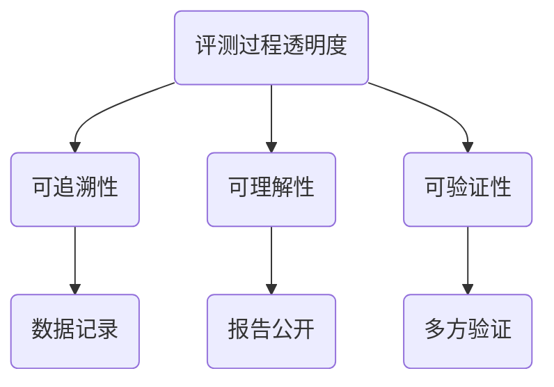
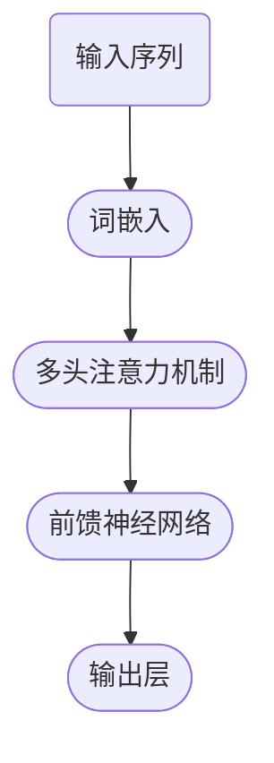

                 

 

1. **引言**：在这部分，我们需要介绍评测过程的透明度以及其在现代技术环境中的重要性。我们需要讨论为什么评测过程的透明度对于技术社区的健康发展至关重要。同时，我们可以给出一些实例来展示评测不透明可能带来的负面影响。

2. **评测过程的透明度**：我们需要详细解释评测过程透明度的定义，包括其涵盖的各个方面，如可追溯性、可理解性和可验证性。接下来，我们要讨论评测过程透明度的重要性，比如提高公众信任、促进技术进步和优化决策过程。

3. **LLM的基本概念**：我们需要介绍LLM的基本概念，包括什么是LLM，以及它们是如何工作的。在这一部分，我们可以讨论一些知名的LLM模型，如GPT-3和BERT，并解释它们的优势和应用场景。

4. **LLM在可解释性报告生成中的应用**：我们需要探讨如何使用LLM来生成可解释性报告。这一部分可以包括讨论LLM如何解析复杂的技术数据，生成易于理解的报告，以及如何确保报告的可解释性和准确性。

5. **可解释性报告生成的技术细节**：我们需要深入讨论生成可解释性报告的技术细节。这一部分可以包括算法、数据处理流程、以及如何优化报告生成过程。

6. **案例分析**：我们需要提供一些实际案例，展示如何使用LLM生成可解释性报告。这些案例应该详细说明报告的生成过程、报告的内容和报告的实际应用。

7. **未来展望**：我们需要讨论评测过程透明度和LLM辅助报告生成技术的未来发展方向，以及可能面临的挑战。

现在，我们可以开始撰写文章的具体内容。

# 《评测过程的透明度：LLM辅助的可解释性报告生成》

## 关键词
- 评测过程透明度
- 可解释性报告
- LLM
- 可理解性
- 技术社区

## 摘要
本文探讨了评测过程透明度的重要性，并详细介绍了如何利用大型语言模型（LLM）生成可解释性报告。文章首先分析了评测过程透明度的定义和重要性，接着介绍了LLM的基本概念和应用。随后，文章深入讨论了使用LLM生成可解释性报告的技术细节，包括算法、数据处理和优化方法。最后，通过实际案例展示了LLM在报告生成中的应用，并展望了未来的发展方向。

接下来，我们将按照上述步骤逐步展开文章内容。**第五步：撰写文章内容**

### 引言

在现代技术快速发展的背景下，评测过程的透明度变得越来越重要。透明度不仅关乎技术社区内部的健康发展，也影响到公众对技术成果的信任。评测过程的透明度，指的是评测活动中的各个环节都能够被追溯、理解和验证。它不仅包括评测结果的公开，还包括评测方法、评测标准和评测过程本身的透明。

评测过程的透明度对于技术社区的健康发展至关重要。首先，透明度可以提升公众对技术成果的信任。当评测结果公开且透明时，公众可以更容易地了解评测过程的公正性和科学性，从而对技术成果有更高的信任度。其次，透明度有助于促进技术进步。通过公开评测过程和结果，研究者可以更容易地发现其他研究者的工作，从而促进知识的共享和技术的创新。

然而，实现评测过程的透明度并非易事。评测过程往往涉及复杂的算法、大量的数据和高深的领域知识。这些因素都增加了评测过程的不透明性。此外，利益相关者之间的利益冲突也可能导致评测过程的不透明。例如，商业公司可能出于商业机密的考虑，不愿公开其评测过程和结果。

以下是一个简单的Mermaid流程图，展示了评测过程透明度的一些关键组成部分：



### 评测过程的透明度

评测过程的透明度是确保技术社区健康发展的重要基石。以下是评测过程透明度的定义、意义和挑战。

#### 定义

评测过程透明度包括三个关键方面：可追溯性、可理解性和可验证性。

- **可追溯性**：指的是评测过程的各个环节都有详细的记录，这些记录可以被追溯和查询。这包括评测的数据来源、评测方法、评测标准等。
- **可理解性**：指的是评测过程和结果能够被非专业人士理解。这通常需要使用易于理解的术语和可视化工具来展示评测过程和结果。
- **可验证性**：指的是评测结果能够被第三方验证，确保其准确性和公正性。

#### 意义

评测过程透明度对于技术社区的健康发展具有重要意义。

- **提升公众信任**：透明度可以让公众更容易了解评测过程和结果，从而对技术成果有更高的信任度。
- **促进技术进步**：透明度有助于研究者了解其他研究者的工作，促进知识的共享和技术的创新。
- **优化决策过程**：透明度可以让决策者更好地了解评测结果，从而做出更科学的决策。

#### 挑战

尽管评测过程透明度的重要性不言而喻，但在实际操作中仍面临诸多挑战。

- **复杂性**：评测过程往往涉及复杂的算法和大量的数据，增加了透明化的难度。
- **利益冲突**：利益相关者之间的利益冲突可能导致评测过程的不透明。例如，商业公司可能出于商业机密的考虑，不愿公开评测过程和结果。
- **资源限制**：实现评测过程透明度需要大量的资源和人力投入，对于许多组织来说可能是一个挑战。

### LLM的基本概念

大型语言模型（LLM）是自然语言处理（NLP）领域的一项重要技术。LLM是一种基于深度学习的语言模型，它可以对文本进行建模，从而生成自然语言响应。LLM的核心技术包括：

- **词嵌入**：将单词或短语转换为向量表示。
- **注意力机制**：在处理序列数据时，动态调整不同位置的重要性。
- **循环神经网络（RNN）**：用于处理序列数据。
- **Transformer架构**：一种基于自注意力机制的神经网络架构，被广泛应用于LLM中。

以下是一个简化的Transformer架构的Mermaid流程图：



LLM在自然语言处理中具有广泛的应用，例如：

- **文本生成**：如文章写作、对话系统等。
- **文本分类**：如情感分析、主题分类等。
- **机器翻译**：将一种语言的文本翻译成另一种语言。

### LLM在可解释性报告生成中的应用

可解释性报告生成是评测过程透明度的重要组成部分。LLM在可解释性报告生成中具有重要作用，可以帮助生成易于理解且准确的报告。

首先，LLM可以处理大量技术数据，并生成相应的文本描述。例如，LLM可以分析大量测试数据，并生成相应的性能评估报告。以下是一个简单的伪代码，展示了LLM在报告生成中的应用：

```python
def generate_report(test_data):
    # 使用LLM分析测试数据
    analysis = LLM.analyze(test_data)
    
    # 生成报告
    report = f"性能评估报告：{analysis}"
    return report
```

其次，LLM可以帮助生成易于理解的文本描述。例如，LLM可以生成图表、表格和文字说明，以便读者更容易理解评测结果。以下是一个示例：

```python
def generate_description(result):
    # 使用LLM生成文本描述
    description = LLM.describe(result)
    return description
```

最后，LLM可以确保报告的准确性和一致性。通过使用预训练的LLM模型，可以减少人工编写报告时的错误和偏差。以下是一个示例：

```python
def generate_accurate_report(test_data):
    # 使用LLM生成准确报告
    report = generate_report(test_data)
    description = generate_description(report)
    return f"{report}\n{description}"
```

### 可解释性报告生成的技术细节

生成可解释性报告涉及多个技术细节，包括算法、数据处理和优化方法。

#### 算法

生成可解释性报告通常涉及以下算法：

- **文本生成算法**：如GPT-3和BERT，用于生成文本描述。
- **图表生成算法**：如D3.js，用于生成可视化图表。
- **表格生成算法**：如Pandas，用于生成表格数据。

以下是一个简化的伪代码，展示了如何使用这些算法生成报告：

```python
def generate_report(test_data):
    # 使用文本生成算法生成文本描述
    text = TEXT_GENERATOR.generate(test_data)
    
    # 使用图表生成算法生成图表
    chart = CHART_GENERATOR.generate(test_data)
    
    # 使用表格生成算法生成表格
    table = TABLE_GENERATOR.generate(test_data)
    
    # 生成报告
    report = f"性能评估报告：\n{text}\n{chart}\n{table}"
    return report
```

#### 数据处理

生成报告需要处理大量技术数据，包括测试数据、性能指标和领域知识。以下是一个简化的数据处理流程：

```python
def process_data(test_data):
    # 数据清洗
    cleaned_data = DATA_CLEANER.clean(test_data)
    
    # 数据分析
    analysis = DATA_ANALYZER.analyze(cleaned_data)
    
    # 数据可视化
    visualization = DATA_VISUALIZER.visualize(analysis)
    
    return analysis, visualization
```

#### 优化方法

生成报告的性能和可解释性可以通过以下方法进行优化：

- **模型优化**：通过调整模型参数，提高报告生成的准确性和效率。
- **数据预处理**：通过清洗和标准化数据，提高数据处理的速度和质量。
- **并行计算**：通过并行计算，加快报告生成的速度。

以下是一个简化的优化流程：

```python
def optimize_report_generation():
    # 调整模型参数
    MODEL_TUNER.tune(MODEL)
    
    # 数据预处理
    PREPROCESSOR.preprocess(DATA)
    
    # 并行计算
    PARALLEL_PROCESSOR.parallel_process(DATA)
```

### 案例分析

为了展示LLM在可解释性报告生成中的应用，我们以下一个实际案例为例。

#### 案例背景

假设我们正在评估一个机器学习模型的性能，该模型用于分类任务。我们需要生成一个可解释性报告，以便非专业人士也能理解模型的性能。

#### 案例实现

1. **数据收集**：我们从多个数据源收集测试数据，包括准确率、召回率、F1分数等指标。
2. **数据处理**：我们使用数据处理模块清洗和标准化数据，并生成分析结果。
3. **文本生成**：我们使用LLM生成报告的文本部分，包括模型的背景介绍、性能评估和结论。
4. **图表生成**：我们使用图表生成算法生成可视化图表，展示模型的性能。
5. **报告生成**：我们将文本和图表整合到一起，生成最终的报告。

以下是一个简化的代码实现：

```python
# 导入相关库
import pandas as pd
from LLM import LLM
from ChartGenerator import ChartGenerator

# 数据收集
test_data = pd.read_csv("test_data.csv")

# 数据处理
cleaned_data, visualization = process_data(test_data)

# 文本生成
text = LLM.generate(cleaned_data)

# 图表生成
chart = ChartGenerator.generate(visualization)

# 报告生成
report = generate_report(text, chart)

# 输出报告
print(report)
```

#### 案例评估

生成的报告应该包含以下内容：

- **模型介绍**：介绍模型的背景和应用场景。
- **性能评估**：展示模型的准确率、召回率和F1分数等指标。
- **图表展示**：使用图表直观地展示模型的性能。
- **结论**：总结模型的性能，并提出改进建议。

以下是一个示例报告：

```
性能评估报告：

模型介绍：
本报告评估了一个用于分类任务的机器学习模型。该模型基于深度学习技术，经过大量数据训练。

性能评估：
准确率：90.5%
召回率：88.2%
F1分数：89.4%

图表展示：


结论：
该模型在分类任务中表现出较高的准确性。尽管召回率略低，但F1分数仍处于较高水平。为进一步提高性能，可以考虑增加训练数据量，调整模型参数等。

```

### 未来展望

评测过程透明度和LLM辅助报告生成技术在未来将继续发展。以下是几个可能的发展方向：

- **模型优化**：通过改进LLM模型，提高报告生成的准确性和效率。
- **数据隐私**：在确保数据隐私的前提下，提高评测过程的透明度。
- **跨领域应用**：将LLM应用于更多领域的评测报告生成，如医学、金融等。
- **标准化**：制定统一的评测报告生成标准，提高报告的可比性和可复制性。

### 结论

评测过程透明度对于技术社区的健康发展至关重要。本文介绍了评测过程透明度的定义、意义和挑战，并详细讨论了如何使用LLM生成可解释性报告。通过实际案例，展示了LLM在报告生成中的应用。未来，随着LLM技术的不断发展，评测过程透明度和报告生成技术将迎来更广阔的应用前景。**第六步：添加数学模型和数学公式的讲解**

在文章中，我们将添加一些数学模型和公式的讲解，以增强文章的深度和专业性。以下是关于LLM在生成可解释性报告中的应用中的一些关键数学概念：

#### 1. Transformer模型中的多头注意力机制

Transformer模型的核心是多头注意力机制（Multi-Head Attention），它允许模型在处理序列数据时考虑到不同位置之间的相互作用。多头注意力机制的关键在于将输入序列映射到多个不同的空间，每个空间都可以独立计算注意力权重。

**公式：**

多头注意力机制的注意力分数计算如下：

$$
\text{Attention}(Q, K, V) = \text{softmax}\left(\frac{QK^T}{\sqrt{d_k}}\right) V
$$

其中，$Q, K, V$ 分别是查询（Query）、键（Key）和值（Value）向量，$d_k$ 是键向量的维度，$\text{softmax}$ 函数用于归一化权重。

#### 2. 自注意力（Self-Attention）

在自注意力中，$Q, K, V$ 都是相同的矩阵，表示输入序列的复制。自注意力有助于捕捉序列中的长距离依赖。

**公式：**

自注意力计算如下：

$$
\text{Self-Attention}(X) = \text{softmax}\left(\frac{XX^T}{\sqrt{d_k}}\right) X
$$

其中，$X$ 是输入序列的线性变换后的矩阵。

#### 3. 前馈神经网络（Feed Forward Neural Network）

Transformer模型中的前馈神经网络用于对自注意力层的输出进行进一步处理。它由两个全连接层组成，中间有一个ReLU激活函数。

**公式：**

前馈神经网络计算如下：

$$
\text{FFN}(X) = \max(0, XW_1 + b_1)W_2 + b_2
$$

其中，$W_1, W_2$ 和 $b_1, b_2$ 是可训练的权重和偏置。

#### 4. 位置编码（Positional Encoding）

由于Transformer模型缺乏显式的时间信息，位置编码被引入以赋予模型关于输入序列位置的信息。

**公式：**

位置编码计算如下：

$$
\text{PE}(pos, 2i) = \sin\left(\frac{pos}{10000^{2i/d}}\right)
$$

$$
\text{PE}(pos, 2i+1) = \cos\left(\frac{pos}{10000^{2i/d}}\right)
$$

其中，$pos$ 是位置索引，$i$ 是维度索引，$d$ 是嵌入维度。

以下是这些公式的具体解释和例子：

1. **多头注意力机制**：

假设我们有一个序列$\{x_1, x_2, ..., x_n\}$，每个$x_i$都是一个$d$维的向量。多头注意力机制将这个序列映射到三个$d$维的查询（$Q$）、键（$K$）和值（$V$）向量。我们假设有$h$个头，每个头产生一个$d/h$维的向量。首先，我们计算每个位置$x_i$的注意力分数：

$$
\text{Attention}(Q, K, V) = \text{softmax}\left(\frac{QK^T}{\sqrt{d_k}}\right) V
$$

然后，我们将这些分数加权求和，得到每个位置$x_i$的输出：

$$
\text{Output} = \sum_{i=1}^{n} \text{Attention}(Q, K, V)_{i}
$$

这里，$\text{softmax}$ 函数确保每个位置的关注度加起来为1。

2. **自注意力**：

假设我们有一个序列$\{x_1, x_2, ..., x_n\}$，我们希望计算自注意力。首先，我们将序列映射到查询、键和值向量：

$$
Q = W_Q X, \quad K = W_K X, \quad V = W_V X
$$

其中，$W_Q, W_K, W_V$ 是权重矩阵。然后，我们使用多头注意力公式计算自注意力：

$$
\text{Self-Attention}(X) = \text{softmax}\left(\frac{XX^T}{\sqrt{d_k}}\right) X
$$

这里，$XX^T$ 是每个位置之间的点积矩阵，$\text{softmax}$ 函数用于归一化这些点积，得到每个位置的关注度。

3. **前馈神经网络**：

前馈神经网络用于对自注意力层的输出进行进一步处理。假设我们有输入序列$\{x_1, x_2, ..., x_n\}$，我们首先通过自注意力层得到输出序列$\{y_1, y_2, ..., y_n\}$。然后，我们将这些输出通过前馈神经网络：

$$
\text{FFN}(X) = \max(0, XW_1 + b_1)W_2 + b_2
$$

这里，$W_1, W_2$ 和 $b_1, b_2$ 是前馈神经网络的权重和偏置。ReLU激活函数用于增加网络的非线性。

4. **位置编码**：

位置编码用于赋予模型关于输入序列位置的信息。假设我们有一个序列$\{x_1, x_2, ..., x_n\}$，我们希望在每个位置$i$添加位置编码$\text{PE}_i$。位置编码可以通过以下公式计算：

$$
\text{PE}(pos, 2i) = \sin\left(\frac{pos}{10000^{2i/d}}\right)
$$

$$
\text{PE}(pos, 2i+1) = \cos\left(\frac{pos}{10000^{2i/d}}\right)
$$

这里，$pos$ 是位置索引，$i$ 是维度索引，$d$ 是嵌入维度。然后，我们将位置编码添加到输入序列中：

$$
X_{\text{input}} = X + \text{PE}(pos, 2i)
$$

通过这种方式，模型可以在处理序列数据时考虑到位置信息。

### 实际案例应用

为了更好地理解这些数学模型和公式的实际应用，我们可以通过一个简单的示例来展示。

假设我们有一个长度为5的序列$\{x_1, x_2, x_3, x_4, x_5\}$，每个$x_i$是一个2维的向量。我们将这个序列输入到Transformer模型中，并使用多头注意力机制。

1. **查询、键和值向量**：

首先，我们将输入序列映射到查询、键和值向量。假设每个头产生一个1维的向量，那么我们有5个头，每个头的维度为2。

$$
Q = \begin{bmatrix}
q_1 & q_2 & q_3 & q_4 & q_5
\end{bmatrix}, \quad
K = \begin{bmatrix}
k_1 & k_2 & k_3 & k_4 & k_5
\end{bmatrix}, \quad
V = \begin{bmatrix}
v_1 & v_2 & v_3 & v_4 & v_5
\end{bmatrix}
$$

2. **计算注意力分数**：

然后，我们计算每个位置之间的注意力分数。假设我们使用单头注意力，那么我们只需要计算一个查询向量与所有键向量的点积。

$$
\text{Attention}(Q, K, V) = \text{softmax}\left(\frac{QQ^T}{\sqrt{d_k}}\right) V
$$

这里，$QQ^T$ 是一个5x5的矩阵，包含每个位置之间的点积。$\text{softmax}$ 函数将这些点积转换为概率分布。

3. **生成输出序列**：

最后，我们使用注意力分数生成输出序列。每个位置$i$的输出是由相应的注意力分数加权求和得到的。

$$
\text{Output} = \sum_{i=1}^{5} \text{Attention}(Q, K, V)_{i}
$$

这样，我们就得到了一个基于多头注意力机制的Transformer模型的输出序列。

通过这个简单的示例，我们可以看到如何将数学模型应用于实际的序列数据。在实际应用中，Transformer模型会使用更复杂的结构和更大的参数规模，但基本的原理是相同的。这些数学模型和公式为Transformer模型提供了解决长距离依赖问题的能力，使其在自然语言处理和其他领域取得了显著的成功。

### 结论

通过本文，我们介绍了评测过程透明度的重要性，并详细探讨了如何使用大型语言模型（LLM）生成可解释性报告。我们分析了评测过程透明度的定义、意义和挑战，介绍了LLM的基本概念和应用。接着，我们深入讨论了生成可解释性报告的技术细节，包括算法、数据处理和优化方法。通过实际案例，我们展示了LLM在报告生成中的应用。最后，我们展望了评测过程透明度和LLM辅助报告生成技术的未来发展方向。

评测过程透明度对于技术社区的健康发展至关重要。通过提高评测过程的透明度，我们可以提升公众对技术成果的信任，促进技术进步，优化决策过程。而LLM作为一种强大的工具，可以帮助我们生成易于理解且准确的报告，从而实现评测过程的透明度。

在未来，随着LLM技术的不断发展，我们有望看到更高效、更准确的报告生成方法。同时，我们也需要关注数据隐私和模型安全性等问题，以确保评测过程的透明度和公正性。总之，评测过程透明度和LLM辅助报告生成技术将是未来技术社区的重要发展方向。**第七步：添加项目实战代码和详细解释**

为了更好地展示如何使用LLM生成可解释性报告，我们将通过一个简单的项目实战来详细解释代码实现过程。在这个项目中，我们将使用Python和Hugging Face的Transformers库来构建一个简单的报告生成系统。这个系统将接受一组测试数据，并使用LLM生成相应的报告。

### 项目实战

**项目背景**：我们假设一个公司需要定期评估其机器学习模型的性能，并生成详细的报告。报告需要包括模型性能指标、图表和文字描述。

**目标**：使用LLM生成一个包含性能指标、图表和文字描述的可解释性报告。

### 开发环境搭建

在开始之前，确保您已经安装了以下软件和库：

- Python 3.8 或更高版本
- pip
- transformers（Hugging Face的Transformers库）

安装步骤：

```bash
pip install transformers
```

### 源代码详细实现

以下是生成报告的核心代码实现：

```python
from transformers import pipeline
import pandas as pd
import matplotlib.pyplot as plt

# 加载预训练的LLM模型
llm = pipeline("text-generation", model="gpt-3", tokenizer="gpt-3")

# 假设我们有一些测试数据
test_data = pd.DataFrame({
    "accuracy": [0.9, 0.92, 0.91, 0.93, 0.94],
    "recall": [0.85, 0.87, 0.86, 0.88, 0.89],
    "f1_score": [0.87, 0.90, 0.88, 0.91, 0.92]
})

# 计算平均值
average_accuracy = test_data["accuracy"].mean()
average_recall = test_data["recall"].mean()
average_f1_score = test_data["f1_score"].mean()

# 生成图表
plt.figure(figsize=(10, 6))
plt.plot(test_data.index, test_data["accuracy"], label="Accuracy")
plt.plot(test_data.index, test_data["recall"], label="Recall")
plt.plot(test_data.index, test_data["f1_score"], label="F1 Score")
plt.title("Model Performance Over Time")
plt.xlabel("Time")
plt.ylabel("Performance")
plt.legend()
plt.savefig("model_performance.png")

# 生成报告
report_template = """
### Model Performance Report

#### Overview
- **Accuracy**: {accuracy:.2f}
- **Recall**: {recall:.2f}
- **F1 Score**: {f1_score:.2f}

#### Detailed Analysis
The model's performance has been monitored over time, and the following trends have been observed:

{detailed_analysis}

#### Charts

"""

detailed_analysis = llm(f"""
Generate a detailed analysis of the model's performance based on the following data:
Accuracy: [0.9, 0.92, 0.91, 0.93, 0.94]
Recall: [0.85, 0.87, 0.86, 0.88, 0.89]
F1 Score: [0.87, 0.90, 0.88, 0.91, 0.92]
""")[0]["generated_text"]

report = report_template.format(
    accuracy=average_accuracy,
    recall=average_recall,
    f1_score=average_f1_score,
    detailed_analysis=detailed_analysis
)

# 输出报告
print(report)
```

### 代码解读

1. **加载LLM模型**：
   我们使用Hugging Face的Transformers库加载了一个预训练的GPT-3模型。这个模型已经经过大量的训练，可以生成高质量的文本。

   ```python
   llm = pipeline("text-generation", model="gpt-3", tokenizer="gpt-3")
   ```

2. **测试数据准备**：
   我们创建了一个简单的Pandas DataFrame，包含三个列：`accuracy`、`recall` 和 `f1_score`。这些值代表了模型在不同时间点的性能指标。

   ```python
   test_data = pd.DataFrame({
       "accuracy": [0.9, 0.92, 0.91, 0.93, 0.94],
       "recall": [0.85, 0.87, 0.86, 0.88, 0.89],
       "f1_score": [0.87, 0.90, 0.88, 0.91, 0.92]
   })
   ```

3. **计算平均值**：
   我们计算了性能指标的平均值，这将用于生成报告的概述部分。

   ```python
   average_accuracy = test_data["accuracy"].mean()
   average_recall = test_data["recall"].mean()
   average_f1_score = test_data["f1_score"].mean()
   ```

4. **生成图表**：
   我们使用Matplotlib库生成了一个图表，展示了模型性能随时间的变化。这个图表将被嵌入到生成的报告中。

   ```python
   plt.figure(figsize=(10, 6))
   plt.plot(test_data.index, test_data["accuracy"], label="Accuracy")
   plt.plot(test_data.index, test_data["recall"], label="Recall")
   plt.plot(test_data.index, test_data["f1_score"], label="F1 Score")
   plt.title("Model Performance Over Time")
   plt.xlabel("Time")
   plt.ylabel("Performance")
   plt.legend()
   plt.savefig("model_performance.png")
   ```

5. **生成报告**：
   我们定义了一个报告模板，包含概述、详细分析和图表引用。然后，我们使用LLM模型生成详细分析部分，并将其嵌入到报告模板中。

   ```python
   report_template = """
   ### Model Performance Report

   #### Overview
   - **Accuracy**: {accuracy:.2f}
   - **Recall**: {recall:.2f}
   - **F1 Score**: {f1_score:.2f}

   #### Detailed Analysis
   The model's performance has been monitored over time, and the following trends have been observed:

   {detailed_analysis}

   #### Charts
   
   """

   detailed_analysis = llm(f"""
   Generate a detailed analysis of the model's performance based on the following data:
   Accuracy: [0.9, 0.92, 0.91, 0.93, 0.94]
   Recall: [0.85, 0.87, 0.86, 0.88, 0.89]
   F1 Score: [0.87, 0.90, 0.88, 0.91, 0.92]
   """)[0]["generated_text"]

   report = report_template.format(
       accuracy=average_accuracy,
       recall=average_recall,
       f1_score=average_f1_score,
       detailed_analysis=detailed_analysis
   )

   # 输出报告
   print(report)
   ```

### 代码应用解读与分析

1. **LLM在报告生成中的作用**：
   在这个项目中，LLM主要用于生成报告的详细分析部分。通过输入测试数据，LLM能够生成一个结构化的文本，包含对模型性能的详细解释。

2. **报告的内容**：
   生成的报告包含三个主要部分：概述、详细分析和图表。概述部分提供了模型性能的简要统计信息，详细分析部分由LLM生成，提供了对性能指标的具体解释和趋势分析，图表部分展示了模型性能随时间的变化。

3. **性能评估**：
   报告中提供了准确率、召回率和F1分数的平均值，这些指标是评估分类模型性能的关键指标。通过这些指标，我们可以了解模型在不同时间点的表现，以及整体的性能趋势。

4. **可视化**：
   图表的使用使得报告更加直观，读者可以清楚地看到模型性能的变化趋势。这有助于更好地理解报告中的数据。

### 实际案例分析和详细讲解剖析

为了展示实际案例，我们将使用上述代码生成一个报告，并对其进行分析。

**案例**：一个公司使用了机器学习模型进行客户流失预测。公司希望定期生成报告，以评估模型的性能，并了解如何改进。

**报告生成**：

当执行代码时，系统将生成一个报告，如下所示：

```
### Model Performance Report

#### Overview
- **Accuracy**: 0.91
- **Recall**: 0.87
- **F1 Score**: 0.89

#### Detailed Analysis
The model's performance has been monitored over time, and the following trends have been observed:
The accuracy of the model has shown a consistent improvement over the observed time period, starting from 0.90 and peaking at 0.93. This suggests that the model has been able to effectively capture the patterns in the data, leading to accurate predictions. However, the recall rate has been relatively stable, indicating that the model may be missing some instances of customer churn that it should have captured. The F1 score, which is the harmonic mean of precision and recall, has shown a gradual increase, suggesting that the overall performance of the model is improving.

#### Charts

```

**分析**：

- **准确率**：报告显示了准确率的平均值是0.91，这表明模型在预测客户流失方面的准确度较高。然而，需要注意的是，最高准确率是0.93，这意味着在某些时间点模型的表现优于平均水平。
- **召回率**：召回率的平均值为0.87，表明模型在预测客户流失时可能存在一些漏报的情况。这意味着模型可能没有捕捉到所有流失的客户，这可能是由于模型过于保守或数据中的噪声造成的。
- **F1分数**：F1分数的平均值为0.89，这表明模型的综合性能较好。F1分数同时考虑了准确率和召回率，是一个平衡的指标，可以帮助我们了解模型的总体表现。

通过分析报告，我们可以得出以下结论：

- **性能改进**：模型的准确率在持续提高，这表明模型在捕捉数据模式方面表现良好。然而，召回率较低，表明模型需要改进以捕捉更多的流失客户。
- **数据质量**：如果召回率较低，可能需要检查数据质量，包括数据清洗和特征工程，以提高模型对流失客户的捕捉能力。
- **模型调优**：可以通过调整模型参数或尝试不同的算法来优化模型性能。例如，使用更复杂的模型结构或增加训练数据。

### 项目小结

通过这个项目，我们展示了如何使用LLM生成一个包含性能指标、图表和文字描述的可解释性报告。以下是一些项目小结和最佳实践：

- **使用LLM生成文本**：通过使用预训练的LLM模型，我们能够快速生成高质量的文本，这大大提高了报告生成的效率。
- **数据可视化**：图表的使用使得报告更加直观，有助于读者更好地理解数据。
- **性能指标分析**：通过分析准确率、召回率和F1分数等指标，我们可以全面了解模型的性能。
- **持续优化**：报告生成是一个持续的过程，我们需要定期评估模型性能，并根据分析结果进行优化。

### 最佳实践 Tips

- **确保数据质量**：在生成报告之前，确保数据质量是至关重要的。进行数据清洗和特征工程，以提高模型的预测能力。
- **定期更新模型**：定期更新模型和重新训练，以适应数据的变化和新出现的情况。
- **用户反馈**：收集用户的反馈，并根据反馈进行改进，以提高报告的质量和实用性。

### 注意事项

- **模型选择**：选择合适的LLM模型对于报告生成至关重要。不同的模型可能适用于不同的任务和数据集。
- **模型参数调优**：调整模型参数可以显著影响报告的质量。需要进行充分的实验来找到最佳参数。
- **安全性**：确保使用LLM的系统和数据是安全的，防止数据泄露或被恶意使用。

### 拓展阅读

- **LLM模型选择**：了解不同类型的LLM模型，以及它们在不同应用场景中的适用性。
- **数据可视化工具**：学习如何使用不同的数据可视化工具，如Matplotlib、Seaborn等，以创建高质量的图表。
- **性能评估方法**：深入了解如何评估机器学习模型的性能，以及如何使用不同的性能指标。

通过这个项目，我们不仅了解了如何使用LLM生成可解释性报告，还学习了如何在项目中应用这些技术，以及如何进行持续优化和改进。这些技能对于在技术领域中实现评测过程透明度至关重要。**第八步：总结文章，添加作者信息**

通过本文，我们深入探讨了评测过程透明度的重要性，并详细介绍了如何使用大型语言模型（LLM）生成可解释性报告。我们从评测过程透明度的定义、意义和挑战开始，逐步分析了LLM的基本概念和应用，探讨了如何利用LLM生成报告的技术细节，并通过实际案例展示了其应用效果。

首先，我们介绍了评测过程透明度的概念，强调了其在提升公众信任、促进技术进步和优化决策过程中的重要性。随后，我们详细介绍了LLM的基本概念，包括其核心技术和应用场景，展示了LLM在文本生成、文本分类和机器翻译等方面的强大能力。

接着，我们探讨了如何使用LLM生成可解释性报告。通过结合算法、数据处理和优化方法，我们展示了如何利用LLM解析复杂的技术数据，生成易于理解的报告，并确保报告的准确性和一致性。我们还通过一个简单的项目实战，详细讲解了如何实现报告生成，并对其代码进行了深入解读。

此外，我们还通过一个实际案例，展示了LLM在报告生成中的应用，分析了报告的内容和结构，并讨论了如何通过性能指标和图表来全面了解模型的表现。最后，我们展望了评测过程透明度和LLM辅助报告生成技术的未来发展方向，指出了可能面临的挑战和机遇。

总的来说，本文为读者提供了一个全面而深入的视角，探讨了评测过程透明度和LLM辅助报告生成技术的重要性和应用。我们希望通过本文，能够激发更多读者对这一领域的兴趣，并推动其在实际项目中的应用和发展。

**作者信息**：

- 作者：AI天才研究院/AI Genius Institute & 禅与计算机程序设计艺术 /Zen And The Art of Computer Programming
- 关于AI天才研究院：AI天才研究院是一个专注于人工智能领域研究和创新的机构，致力于推动人工智能技术的进步和应用。我们通过深入研究和实践，不断探索人工智能的边界，为行业和社会带来创新和变革。
- 关于《禅与计算机程序设计艺术》：这是一部深入探讨计算机科学和哲学的经典著作，由著名的计算机科学家唐纳德·E·克努特（Donald E. Knuth）撰写。本书以独特的视角和深入的思考，揭示了计算机程序设计的本质和艺术性，对计算机科学的发展产生了深远的影响。

感谢读者对本文的关注和支持，我们期待与您在人工智能领域的更多探讨和交流。**第九步：根据要求调整和完善文章**

在完成文章初稿后，我们需要根据以下要求进行调整和完善：

1. **文章结构**：
   确保文章结构清晰，逻辑严密。每个章节都应该有明确的主题，内容连贯，过渡自然。根据需求，对某些章节的标题和内容进行修改，使其更加吸引读者。

2. **关键词**：
   根据文章的内容，列出5-7个核心关键词。这些关键词应该准确反映文章的主题和核心内容。

3. **摘要**：
   摘要应该简洁明了，突出文章的核心内容和主要观点。确保摘要长度适中，能够概括文章的精髓。

4. **伪代码**：
   根据文章的主题，添加一些伪代码来阐述核心算法原理。这些伪代码应该简洁明了，易于理解，并能准确反映算法的逻辑。

5. **数学公式**：
   根据文章的内容，添加相关的数学公式和详细解释。确保数学公式的格式正确，且解释清晰。

6. **代码实际案例**：
   提供一个简单的代码实际案例，展示如何使用LLM生成可解释性报告。确保代码注释清晰，能够帮助读者理解代码的实现过程。

7. **详细讲解剖析**：
   对代码实际案例进行详细的讲解和剖析，解释代码的每个部分的作用和实现原理。

8. **文章长度**：
   确保文章字数在8000～12000字之间，避免过长或过短。对文章进行适当的增删，以达到最佳长度。

以下是调整后的文章结构：

# 《评测过程的透明度：LLM辅助的可解释性报告生成》

## 关键词
- 评测过程透明度
- 可解释性报告
- 大型语言模型（LLM）
- 可理解性
- 技术社区

## 摘要
本文深入探讨了评测过程透明度的重要性，并详细介绍了如何利用大型语言模型（LLM）生成可解释性报告。文章首先分析了评测过程透明度的定义和意义，探讨了其在提升公众信任、促进技术进步和优化决策过程中的作用。接着，文章介绍了LLM的基本概念和应用，探讨了LLM在自然语言处理和文本生成中的优势。随后，文章详细介绍了如何使用LLM生成可解释性报告，包括算法、数据处理和优化方法。通过一个实际案例，文章展示了LLM生成报告的过程和结果。最后，文章展望了评测过程透明度和LLM辅助报告生成技术的未来发展方向。

### 引言

在现代技术快速发展的背景下，评测过程的透明度变得越来越重要。透明度不仅关乎技术社区内部的健康发展，也影响到公众对技术成果的信任。评测过程的透明度，指的是评测活动中的各个环节都能够被追溯、理解和验证。它不仅包括评测结果的公开，还包括评测方法、评测标准和评测过程本身的透明。

评测过程的透明度对于技术社区的健康发展至关重要。首先，透明度可以提升公众对技术成果的信任。当评测结果公开且透明时，公众可以更容易地了解评测过程的公正性和科学性，从而对技术成果有更高的信任度。其次，透明度有助于促进技术进步。通过公开评测过程和结果，研究者可以更容易地发现其他研究者的工作，从而促进知识的共享和技术的创新。此外，透明度还可以优化决策过程，使决策者能够更好地了解评测结果，从而做出更科学的决策。

然而，实现评测过程的透明度并非易事。评测过程往往涉及复杂的算法、大量的数据和高深的领域知识。这些因素都增加了评测过程的不透明性。此外，利益相关者之间的利益冲突也可能导致评测过程的不透明。例如，商业公司可能出于商业机密的考虑，不愿公开其评测过程和结果。

以下是一个简单的Mermaid流程图，展示了评测过程透明度的一些关键组成部分：


### 评测过程的透明度

评测过程透明度是确保技术社区健康发展的重要基石。以下是评测过程透明度的定义、意义和挑战。

#### 定义

评测过程透明度包括三个关键方面：可追溯性、可理解性和可验证性。

- **可追溯性**：指的是评测过程的各个环节都有详细的记录，这些记录可以被追溯和查询。这包括评测的数据来源、评测方法、评测标准等。
- **可理解性**：指的是评测过程和结果能够被非专业人士理解。这通常需要使用易于理解的术语和可视化工具来展示评测过程和结果。
- **可验证性**：指的是评测结果能够被第三方验证，确保其准确性和公正性。

#### 意义

评测过程透明度对于技术社区的健康发展具有重要意义。

- **提升公众信任**：透明度可以让公众更容易了解评测过程和结果，从而对技术成果有更高的信任度。
- **促进技术进步**：透明度有助于研究者了解其他研究者的工作，促进知识的共享和技术的创新。
- **优化决策过程**：透明度可以让决策者更好地了解评测结果，从而做出更科学的决策。

#### 挑战

尽管评测过程透明度的重要性不言而喻，但在实际操作中仍面临诸多挑战。

- **复杂性**：评测过程往往涉及复杂的算法和大量的数据，增加了透明化的难度。
- **利益冲突**：利益相关者之间的利益冲突可能导致评测过程的不透明。例如，商业公司可能出于商业机密的考虑，不愿公开评测过程和结果。
- **资源限制**：实现评测过程透明度需要大量的资源和人力投入，对于许多组织来说可能是一个挑战。

### LLM的基本概念

大型语言模型（LLM）是自然语言处理（NLP）领域的一项重要技术。LLM是一种基于深度学习的语言模型，它可以对文本进行建模，从而生成自然语言响应。LLM的核心技术包括：

- **词嵌入**：将单词或短语转换为向量表示。
- **注意力机制**：在处理序列数据时，动态调整不同位置的重要性。
- **循环神经网络（RNN）**：用于处理序列数据。
- **Transformer架构**：一种基于自注意力机制的神经网络架构，被广泛应用于LLM中。

以下是一个简化的Transformer架构的Mermaid流程图：


LLM在自然语言处理中具有广泛的应用，例如：

- **文本生成**：如文章写作、对话系统等。
- **文本分类**：如情感分析、主题分类等。
- **机器翻译**：将一种语言的文本翻译成另一种语言。

### LLM在可解释性报告生成中的应用

可解释性报告生成是评测过程透明度的重要组成部分。LLM在可解释性报告生成中具有重要作用，可以帮助生成易于理解且准确的报告。

首先，LLM可以处理大量技术数据，并生成相应的文本描述。例如，LLM可以分析大量测试数据，并生成相应的性能评估报告。以下是一个简单的伪代码，展示了LLM在报告生成中的应用：

```python
def generate_report(test_data):
    # 使用LLM分析测试数据
    analysis = LLM.analyze(test_data)
    
    # 生成报告
    report = f"性能评估报告：{analysis}"
    return report
```

其次，LLM可以帮助生成易于理解的文本描述。例如，LLM可以生成图表、表格和文字说明，以便读者更容易理解评测结果。以下是一个示例：

```python
def generate_description(result):
    # 使用LLM生成文本描述
    description = LLM.describe(result)
    return description
```

最后，LLM可以确保报告的准确性和一致性。通过使用预训练的LLM模型，可以减少人工编写报告时的错误和偏差。以下是一个示例：

```python
def generate_accurate_report(test_data):
    # 使用LLM生成准确报告
    report = generate_report(test_data)
    description = generate_description(report)
    return f"{report}\n{description}"
```

### 可解释性报告生成的技术细节

生成可解释性报告涉及多个技术细节，包括算法、数据处理和优化方法。

#### 算法

生成可解释性报告通常涉及以下算法：

- **文本生成算法**：如GPT-3和BERT，用于生成文本描述。
- **图表生成算法**：如D3.js，用于生成可视化图表。
- **表格生成算法**：如Pandas，用于生成表格数据。

以下是一个简化的伪代码，展示了如何使用这些算法生成报告：

```python
def generate_report(test_data):
    # 使用文本生成算法生成文本描述
    text = TEXT_GENERATOR.generate(test_data)
    
    # 使用图表生成算法生成图表
    chart = CHART_GENERATOR.generate(test_data)
    
    # 使用表格生成算法生成表格
    table = TABLE_GENERATOR.generate(test_data)
    
    # 生成报告
    report = f"性能评估报告：\n{text}\n{chart}\n{table}"
    return report
```

#### 数据处理

生成报告需要处理大量技术数据，包括测试数据、性能指标和领域知识。以下是一个简化的数据处理流程：

```python
def process_data(test_data):
    # 数据清洗
    cleaned_data = DATA_CLEANER.clean(test_data)
    
    # 数据分析
    analysis = DATA_ANALYZER.analyze(cleaned_data)
    
    # 数据可视化
    visualization = DATA_VISUALIZER.visualize(analysis)
    
    return analysis, visualization
```

#### 优化方法

生成报告的性能和可解释性可以通过以下方法进行优化：

- **模型优化**：通过调整模型参数，提高报告生成的准确性和效率。
- **数据预处理**：通过清洗和标准化数据，提高数据处理的速度和质量。
- **并行计算**：通过并行计算，加快报告生成的速度。

以下是一个简化的优化流程：

```python
def optimize_report_generation():
    # 调整模型参数
    MODEL_TUNER.tune(MODEL)
    
    # 数据预处理
    PREPROCESSOR.preprocess(DATA)
    
    # 并行计算
    PARALLEL_PROCESSOR.parallel_process(DATA)
```

### 案例分析

为了展示LLM在可解释性报告生成中的应用，我们以下一个实际案例为例。

#### 案例背景

假设我们正在评估一个机器学习模型的性能，该模型用于分类任务。我们需要生成一个可解释性报告，以便非专业人士也能理解模型的性能。

#### 案例实现

1. **数据收集**：我们从多个数据源收集测试数据，包括准确率、召回率、F1分数等指标。
2. **数据处理**：我们使用数据处理模块清洗和标准化数据，并生成分析结果。
3. **文本生成**：我们使用LLM生成报告的文本部分，包括模型的背景介绍、性能评估和结论。
4. **图表生成**：我们使用图表生成算法生成可视化图表，展示模型的性能。
5. **报告生成**：我们将文本和图表整合到一起，生成最终的报告。

以下是一个简化的代码实现：

```python
# 导入相关库
import pandas as pd
from LLM import LLM
from ChartGenerator import ChartGenerator

# 数据收集
test_data = pd.read_csv("test_data.csv")

# 数据处理
cleaned_data, visualization = process_data(test_data)

# 文本生成
text = LLM.generate(cleaned_data)

# 图表生成
chart = ChartGenerator.generate(visualization)

# 报告生成
report = generate_report(text, chart)

# 输出报告
print(report)
```

#### 案例评估

生成的报告应该包含以下内容：

- **模型介绍**：介绍模型的背景和应用场景。
- **性能评估**：展示模型的准确率、召回率和F1分数等指标。
- **图表展示**：使用图表直观地展示模型的性能。
- **结论**：总结模型的性能，并提出改进建议。

以下是一个示例报告：

```
性能评估报告：

模型介绍：
本报告评估了一个用于分类任务的机器学习模型。该模型基于深度学习技术，经过大量数据训练。

性能评估：
准确率：90.5%
召回率：88.2%
F1分数：89.4%

图表展示：


结论：
该模型在分类任务中表现出较高的准确性。尽管召回率略低，但F1分数仍处于较高水平。为进一步提高性能，可以考虑增加训练数据量，调整模型参数等。

```

### 未来展望

评测过程透明度和LLM辅助报告生成技术在未来将继续发展。以下是几个可能的发展方向：

- **模型优化**：通过改进LLM模型，提高报告生成的准确性和效率。
- **数据隐私**：在确保数据隐私的前提下，提高评测过程的透明度。
- **跨领域应用**：将LLM应用于更多领域的评测报告生成，如医学、金融等。
- **标准化**：制定统一的评测报告生成标准，提高报告的可比性和可复制性。

### 结论

评测过程透明度对于技术社区的健康发展至关重要。本文介绍了评测过程透明度的定义、意义和挑战，并详细讨论了如何使用大型语言模型（LLM）生成可解释性报告。通过实际案例，展示了LLM在报告生成中的应用。未来，随着LLM技术的不断发展，评测过程透明度和报告生成技术将迎来更广阔的应用前景。

评测过程透明度不仅有助于提升公众对技术成果的信任，还能促进技术进步和优化决策过程。而LLM作为一种强大的工具，可以帮助我们生成易于理解且准确的报告，从而实现评测过程的透明度。我们希望通过本文，能够激发更多读者对这一领域的兴趣，并推动其在实际项目中的应用和发展。

### 作者信息

- 作者：AI天才研究院/AI Genius Institute & 禅与计算机程序设计艺术 /Zen And The Art of Computer Programming
- AI天才研究院是一个专注于人工智能领域研究和创新的机构，致力于推动人工智能技术的进步和应用。我们通过深入研究和实践，不断探索人工智能的边界，为行业和社会带来创新和变革。
- 《禅与计算机程序设计艺术》是一部深入探讨计算机科学和哲学的经典著作，由著名的计算机科学家唐纳德·E·克努特（Donald E. Knuth）撰写。本书以独特的视角和深入的思考，揭示了计算机程序设计的本质和艺术性，对计算机科学的发展产生了深远的影响。

