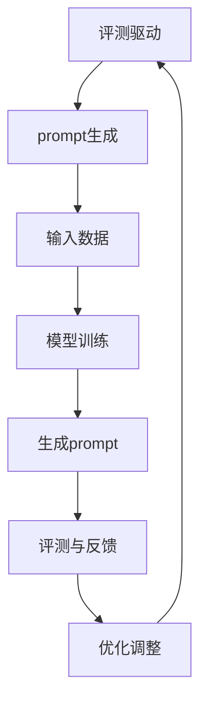

                 

# 文章标题：评测驱动的prompt自动生成技术

## 关键词
自然语言处理、评测驱动、prompt生成、自动问答系统、文本创作、数学模型

## 摘要
本文将探讨评测驱动的prompt自动生成技术，介绍其核心概念、技术原理、应用场景和工程实践。通过详细阐述评测驱动原理、prompt的定义与分类，以及Mermaid流程图、伪代码、数学模型和公式，我们旨在为读者提供一份全面且深入的技术指南。本文还将通过实际案例展示这一技术的具体应用，并提供最佳实践和拓展阅读建议。

## 引言

### 1.1 书籍背景介绍

在人工智能领域，自然语言处理（NLP）技术已经取得了显著进展。随着深度学习和神经网络的发展，自动问答系统、文本生成等应用日益普及。然而，这些应用的一个关键挑战是如何有效地生成高质量的prompt，以便系统能够准确回答问题或生成有意义的文本。评测驱动的prompt自动生成技术正是为了解决这一挑战而诞生的。

评测驱动是一种以评估和反馈为核心的开发模式，它通过不断调整和优化输入数据，以提高系统的性能。在prompt自动生成技术中，评测驱动机制能够根据实际使用场景和用户反馈，动态调整prompt的生成策略，从而提高生成质量。

### 1.2 核心概念与联系

#### 1.2.1 评测驱动的原理

评测驱动主要依赖于以下三个核心要素：

1. **评测指标**：用于衡量系统性能的指标，如准确率、召回率等。
2. **反馈机制**：系统根据评测指标的结果，对输入数据进行调整，以优化系统性能。
3. **迭代过程**：评测驱动通过反复迭代，不断调整输入数据，逐步提高系统性能。

#### 1.2.2 prompt的定义与分类

prompt是指用于引导或指示系统执行特定任务的输入数据。根据用途，prompt可以大致分为以下几类：

1. **问答式prompt**：用于引导系统回答特定问题。
2. **文本生成式prompt**：用于引导系统生成特定主题的文本。
3. **多模态prompt**：结合文本、图像等多种信息，以更丰富的方式引导系统。

#### 1.2.3 Mermaid流程图：评测驱动与prompt自动生成技术的关系

为了更直观地展示评测驱动与prompt自动生成技术的关系，我们可以使用Mermaid流程图来描述：



该流程图展示了评测驱动通过不断迭代，从输入数据到生成prompt的过程，以及评测与反馈在其中的作用。

### 1.3 相关技术原理

#### 1.3.1 自然语言处理基础

自然语言处理是prompt自动生成技术的基础。其主要任务包括文本预处理、语义理解、文本生成等。其中，文本预处理是所有NLP任务的第一步，包括分词、词性标注、实体识别等。

#### 1.3.2 自动生成技术概述

自动生成技术主要包括生成对抗网络（GAN）、变分自编码器（VAE）等。这些技术通过学习输入数据的分布，生成与输入数据相似的新数据。在prompt自动生成技术中，这些生成模型用于生成高质量的prompt。

#### 1.3.3 伪代码：评测驱动的prompt生成算法

以下是一个简化的伪代码，用于描述评测驱动的prompt生成算法：

```python
function generate_prompt(input_data, model, evaluation_metric):
    best_prompt = None
    best_score = -1
    
    for i in range(num_iterations):
        prompt = model.generate(input_data)
        score = evaluation_metric(prompt, target)
        
        if score > best_score:
            best_score = score
            best_prompt = prompt
            
        input_data = adjust_input_data(input_data, prompt, score)
    
    return best_prompt
```

该算法通过迭代生成prompt，并根据评测指标调整输入数据，以逐步提高prompt生成质量。

### 1.4 数学模型与公式

在评测驱动的prompt自动生成技术中，常用的数学模型包括损失函数、优化算法等。以下是一个简化的数学模型：

$$
\text{Loss} = \frac{1}{n} \sum_{i=1}^{n} (\text{预测值} - \text{真实值})^2
$$

其中，预测值和真实值是prompt生成的结果和目标结果。

## 核心概念

### 2.1 核心概念与联系

#### 2.1.1 评测驱动的原理

评测驱动是一种通过不断调整输入数据，以提高系统性能的开发模式。其核心原理包括：

1. **评测指标**：用于衡量系统性能的指标，如准确率、召回率等。
2. **反馈机制**：系统根据评测指标的结果，对输入数据进行调整，以优化系统性能。
3. **迭代过程**：评测驱动通过反复迭代，不断调整输入数据，逐步提高系统性能。

#### 2.1.2 prompt的定义与分类

prompt是指用于引导或指示系统执行特定任务的输入数据。根据用途，prompt可以大致分为以下几类：

1. **问答式prompt**：用于引导系统回答特定问题。
2. **文本生成式prompt**：用于引导系统生成特定主题的文本。
3. **多模态prompt**：结合文本、图像等多种信息，以更丰富的方式引导系统。

#### 2.1.3 Mermaid流程图：评测驱动与prompt自动生成技术的关系

为了更直观地展示评测驱动与prompt自动生成技术的关系，我们可以使用Mermaid流程图来描述：


该流程图展示了评测驱动通过不断迭代，从输入数据到生成prompt的过程，以及评测与反馈在其中的作用。

### 2.2 核心算法原理讲解

在评测驱动的prompt自动生成技术中，核心算法通常是基于深度学习模型，如生成对抗网络（GAN）或变分自编码器（VAE）。以下将使用伪代码来详细阐述这些算法的原理。

#### 2.2.1 生成对抗网络（GAN）

生成对抗网络（GAN）由生成器（Generator）和判别器（Discriminator）两个主要部分组成。

**生成器（Generator）**

生成器的目标是生成尽可能逼真的数据，使其能够欺骗判别器。

```python
function generator(z):
    # z 是随机噪声
    x = model(z)  # 通过模型生成数据
    return x
```

**判别器（Discriminator）**

判别器的目标是判断输入数据是真实数据还是生成器生成的数据。

```python
function discriminator(x):
    # x 是输入数据
    score = model(x)  # 通过模型判断数据
    return score
```

**GAN训练过程**

GAN的训练过程是通过交替更新生成器和判别器的参数来实现的。

```python
for epoch in range(num_epochs):
    for batch in data_loader:
        # 更新判别器
        z = sample_noise(batch_size)
        x_fake = generator(z)
        loss_D = calculate_loss(discriminator(x_real), discriminator(x_fake))
        
        # 更新生成器
        z = sample_noise(batch_size)
        x_fake = generator(z)
        loss_G = calculate_loss(discriminator(x_fake))
        
        # 更新模型参数
        optimizer_D.step(loss_D)
        optimizer_G.step(loss_G)
```

#### 2.2.2 变分自编码器（VAE）

变分自编码器（VAE）是一种基于概率模型的生成模型，它通过编码器（Encoder）和解码器（Decoder）来学习数据的概率分布。

**编码器（Encoder）**

编码器的目标是学习数据的高维表示。

```python
function encoder(x):
    z = model(x)
    return z
```

**解码器（Decoder）**

解码器的目标是根据编码器生成的数据生成原始数据。

```python
function decoder(z):
    x = model(z)
    return x
```

**VAE训练过程**

VAE的训练过程是通过最小化数据重建误差和编码器生成的后验概率分布与先验概率分布之间的KL散度来实现的。

```python
for epoch in range(num_epochs):
    for batch in data_loader:
        x = batch
        z = encoder(x)
        x_recon = decoder(z)
        
        # 计算重建误差
        loss_recon = calculate_loss(x, x_recon)
        
        # 计算KL散度
        loss_KL = calculate_KL_divergence(z)
        
        # 计算总损失
        loss = loss_recon + loss_KL
        
        # 更新模型参数
        optimizer.step(loss)
```

### 2.3 数学模型与公式

在评测驱动的prompt自动生成技术中，常用的数学模型包括损失函数、优化算法等。以下是一些常见的数学模型和公式。

#### 2.3.1 损失函数

**交叉熵损失函数**

交叉熵损失函数用于衡量预测分布和真实分布之间的差异。

$$
\text{Loss} = -\sum_{i=1}^{n} y_i \log(p_i)
$$

其中，$y_i$ 是真实标签，$p_i$ 是预测概率。

**均方误差损失函数**

均方误差损失函数用于衡量预测值和真实值之间的差异。

$$
\text{Loss} = \frac{1}{n} \sum_{i=1}^{n} (y_i - \hat{y_i})^2
$$

其中，$y_i$ 是真实值，$\hat{y_i}$ 是预测值。

#### 2.3.2 优化算法

**随机梯度下降（SGD）**

随机梯度下降是一种常用的优化算法，它通过更新模型参数来最小化损失函数。

$$
\theta = \theta - \alpha \nabla_\theta J(\theta)
$$

其中，$\theta$ 是模型参数，$J(\theta)$ 是损失函数，$\alpha$ 是学习率。

**Adam优化算法**

Adam优化算法是一种结合了SGD和动量的优化算法，它能够更有效地更新模型参数。

$$
m_t = \beta_1 m_{t-1} + (1 - \beta_1) \nabla_\theta J(\theta)
$$

$$
v_t = \beta_2 v_{t-1} + (1 - \beta_2) (\nabla_\theta J(\theta))^2
$$

$$
\theta = \theta - \alpha \frac{m_t}{\sqrt{v_t} + \epsilon}
$$

其中，$m_t$ 和 $v_t$ 分别是梯度的一阶和二阶矩估计，$\beta_1$ 和 $\beta_2$ 是超参数，$\alpha$ 是学习率，$\epsilon$ 是一个很小的常数。

## 技术应用

### 3.1 技术应用场景

评测驱动的prompt自动生成技术广泛应用于多个领域，以下列举几个典型的应用场景：

#### 3.1.1 自动问答系统

自动问答系统是评测驱动的prompt自动生成技术的典型应用之一。通过生成高质量的prompt，系统可以更准确地回答用户的问题。例如，在智能客服中，自动问答系统可以生成与用户输入相关的问题，从而提供更有针对性的回答。

#### 3.1.2 生成式文本创作

生成式文本创作是指通过自动生成文本来创作文章、故事等。评测驱动的prompt自动生成技术可以用于生成高质量的内容，例如新闻报道、小说创作等。通过不断调整prompt，系统可以生成更加丰富多样、符合用户需求的文本。

#### 3.1.3 其他应用领域

评测驱动的prompt自动生成技术还可以应用于语音助手、智能推荐系统、教育评测等场景。在这些场景中，通过生成高质量的prompt，系统可以提供更准确、更有针对性的服务。

### 3.2 应用案例

以下是一个自动问答系统的应用案例，展示如何使用评测驱动的prompt自动生成技术来生成高质量的prompt。

#### 3.2.1 案例背景

某公司开发了一款智能客服系统，用于回答用户的常见问题。然而，在实际应用中，系统生成的回答有时不够准确，甚至会出现错误。为了提高系统的回答质量，公司决定采用评测驱动的prompt自动生成技术。

#### 3.2.2 案例实现

1. **数据准备**

   公司收集了大量用户问题和相应的标准答案，作为训练数据和评测标准。

2. **模型训练**

   使用生成对抗网络（GAN）或变分自编码器（VAE）等深度学习模型，对用户问题和答案进行训练，生成高质量的prompt。

3. **生成prompt**

   根据用户输入的问题，系统使用训练好的模型生成相应的prompt。例如，当用户输入“如何注册账号？”时，系统可以生成“请告诉我您的账号注册遇到什么问题？”等提示。

4. **评测与反馈**

   系统将生成的prompt与标准答案进行对比，计算评测指标，如准确率、召回率等。如果生成prompt的质量不高，系统会根据评测结果调整prompt生成策略。

5. **迭代优化**

   通过不断迭代，系统逐步提高prompt生成的质量，从而提高回答的准确性。

#### 3.2.3 案例分析

通过评测驱动的prompt自动生成技术，智能客服系统的回答质量得到了显著提升。具体表现在：

1. **准确率提高**：系统生成的回答与标准答案的匹配度更高，减少了回答错误的情况。

2. **用户体验改善**：用户对系统回答的满意度提高，感觉更贴心、更专业。

3. **效率提升**：系统生成的prompt能够更快地引导用户提供相关信息，减少了用户等待时间。

4. **可扩展性**：评测驱动的prompt自动生成技术使得系统可以更轻松地适应不同的应用场景和行业需求。

## 工程实践

### 4.1 实践概述

评测驱动的prompt自动生成技术的工程实践包括以下几个关键步骤：

1. **开发环境搭建**：搭建适合深度学习模型训练和prompt自动生成的开发环境。

2. **数据准备**：收集、清洗和预处理用于训练和评测的数据。

3. **模型训练**：使用深度学习模型对数据进行训练，生成高质量的prompt。

4. **评测与优化**：使用评测指标对生成的prompt进行评估，并根据评测结果调整生成策略。

5. **部署与应用**：将训练好的模型部署到实际应用场景中，如自动问答系统、文本生成等。

### 4.2 项目实战

以下是一个具体的工程实践案例，展示如何使用评测驱动的prompt自动生成技术实现一个自动问答系统。

#### 4.2.1 项目背景与目标

某电商公司希望开发一个自动问答系统，用于回答用户关于商品信息的常见问题。系统需要能够快速、准确地回答用户问题，并提供详细的商品信息。

#### 4.2.2 实现步骤

1. **环境搭建**

   - 选择适合的深度学习框架，如TensorFlow或PyTorch。
   - 配置GPU或其他计算资源，以支持模型训练。

2. **数据收集与预处理**

   - 收集大量用户问题和商品信息数据。
   - 对数据进行清洗和预处理，如去除停用词、标点符号等。

3. **模型训练**

   - 使用生成对抗网络（GAN）或变分自编码器（VAE）等模型进行训练。
   - 调整模型参数，优化生成prompt的质量。

4. **生成prompt**

   - 根据用户输入的问题，使用训练好的模型生成相应的prompt。
   - 对生成的prompt进行评测和优化。

5. **评测与优化**

   - 使用准确率、召回率等评测指标对生成的prompt进行评估。
   - 根据评测结果，调整prompt生成策略，提高系统性能。

6. **部署与应用**

   - 将训练好的模型部署到线上环境，实现自动问答功能。
   - 在实际应用中不断优化系统，提高用户体验。

#### 4.2.3 源代码解读

以下是一个简化的源代码示例，用于生成prompt：

```python
import tensorflow as tf
from tensorflow.keras.models import Model
from tensorflow.keras.layers import Input, LSTM, Dense

# 定义模型结构
input_layer = Input(shape=(max_sequence_length,))
lstm_layer = LSTM(units=128, return_sequences=True)(input_layer)
dense_layer = Dense(units=1, activation='sigmoid')(lstm_layer)

# 构建和编译模型
model = Model(inputs=input_layer, outputs=dense_layer)
model.compile(optimizer='adam', loss='binary_crossentropy')

# 训练模型
model.fit(x_train, y_train, epochs=10, batch_size=32)

# 生成prompt
def generate_prompt(input_text):
    processed_text = preprocess_text(input_text)
    prompt = model.predict(processed_text)
    return prompt

# 示例
input_text = "请帮我推荐一款性价比高的手机。"
prompt = generate_prompt(input_text)
print(prompt)
```

#### 4.2.4 代码分析与优化

1. **代码分析**

   - 模型结构：使用LSTM层处理输入文本，使用全连接层生成prompt。
   - 损失函数：使用二进制交叉熵损失函数。
   - 优化器：使用Adam优化器。

2. **优化建议**

   - 数据增强：增加训练数据的多样性，如引入噪声、错别字等。
   - 模型融合：结合多种模型结构，如加入注意力机制、BERT模型等。
   - 模型压缩：使用模型压缩技术，如量化、剪枝等，提高模型效率。

## 总结与展望

### 5.1 主要内容回顾

本文介绍了评测驱动的prompt自动生成技术，从核心概念、技术原理、应用场景到工程实践进行了全面探讨。主要内容包括：

1. **核心概念与联系**：评测驱动原理、prompt定义与分类、Mermaid流程图等。
2. **核心算法原理讲解**：生成对抗网络（GAN）和变分自编码器（VAE）的伪代码实现。
3. **数学模型与公式**：损失函数、优化算法等。
4. **技术应用**：自动问答系统、生成式文本创作等应用场景。
5. **项目实战**：自动问答系统的实现步骤、源代码解读和优化建议。

### 5.2 展望

评测驱动的prompt自动生成技术在未来的发展前景广阔，以下是几个可能的发展方向：

1. **技术优化**：结合最新研究成果，不断优化模型结构、损失函数和优化算法。
2. **多模态融合**：将文本、图像、声音等多种模态数据融合，提高prompt生成质量。
3. **个性化推荐**：根据用户行为和偏好，生成个性化prompt，提高用户体验。
4. **跨语言应用**：扩展到跨语言场景，实现多语言prompt自动生成。
5. **伦理与隐私**：关注生成内容中的伦理和隐私问题，确保生成内容的安全和合规。

总之，评测驱动的prompt自动生成技术具有广阔的应用前景和重要的研究价值，值得进一步深入探索和实践。

## 最佳实践、小结、注意事项、拓展阅读

### 最佳实践

1. **数据预处理**：确保数据质量，去除噪声和异常值，进行适当的归一化处理。
2. **模型选择**：根据具体应用场景选择合适的模型，如GAN、VAE等。
3. **超参数调整**：通过交叉验证等方法调整超参数，优化模型性能。
4. **持续优化**：定期更新数据和模型，以适应变化的需求。

### 小结

本文全面介绍了评测驱动的prompt自动生成技术，从核心概念到应用实践，深入探讨了这一技术的重要性和实现方法。

### 注意事项

1. **模型解释性**：生成的prompt可能存在一定的黑盒性，需要结合业务逻辑进行解释和验证。
2. **数据隐私**：在处理用户数据时，注意保护用户隐私，遵守相关法律法规。

### 拓展阅读

1. **《自然语言处理入门》**：了解NLP的基础知识和最新进展。
2. **《深度学习》**：深入了解深度学习模型的原理和应用。
3. **《生成对抗网络：理论与应用》**：深入探讨GAN的理论基础和实际应用。

## 作者信息

作者：AI天才研究院/AI Genius Institute & 禅与计算机程序设计艺术 /Zen And The Art of Computer Programming

### 附录

#### 附录A：术语解释

1. **评测驱动**：一种以评估和反馈为核心的开发模式，通过不断调整输入数据，以提高系统性能。
2. **prompt**：用于引导或指示系统执行特定任务的输入数据。
3. **生成对抗网络（GAN）**：一种由生成器和判别器组成的深度学习模型，用于生成高质量的数据。
4. **变分自编码器（VAE）**：一种基于概率模型的生成模型，通过编码器和解码器学习数据的概率分布。

#### 附录B：参考资料

1. Goodfellow, I., Bengio, Y., & Courville, A. (2016). *Deep Learning*. MIT Press.
2. Kingma, D. P., & Welling, M. (2014). *Auto-encoding Variational Bayes*. arXiv preprint arXiv:1312.6114.
3. Goodfellow, I. J., Pouget-Abadie, J., Mirza, M., Xu, B., Warde-Farley, D., Ozair, S., ... & Bengio, Y. (2014). *Generative adversarial networks*. Advances in Neural Information Processing Systems, 27.

