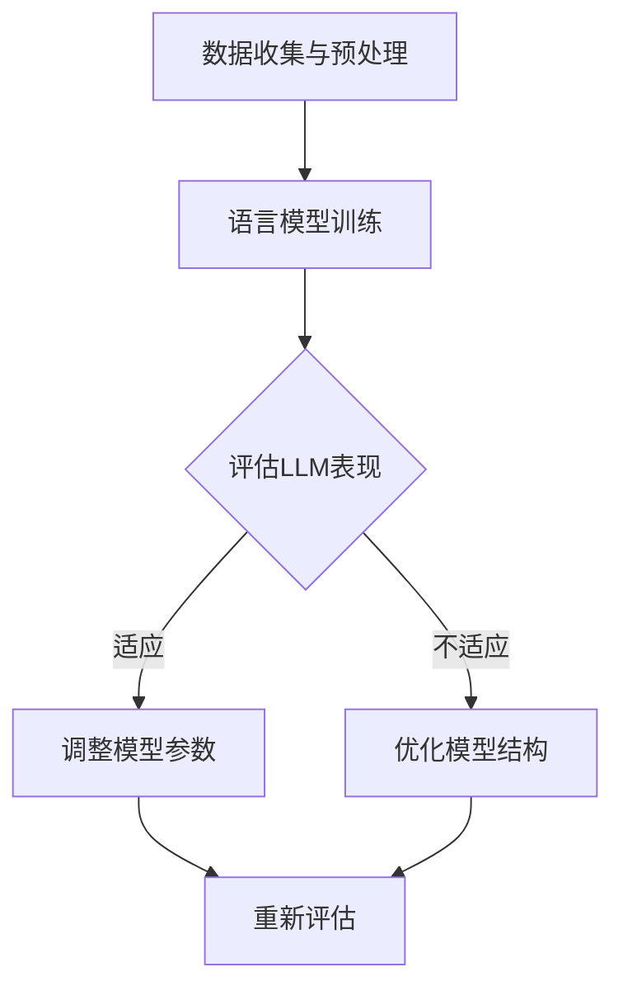
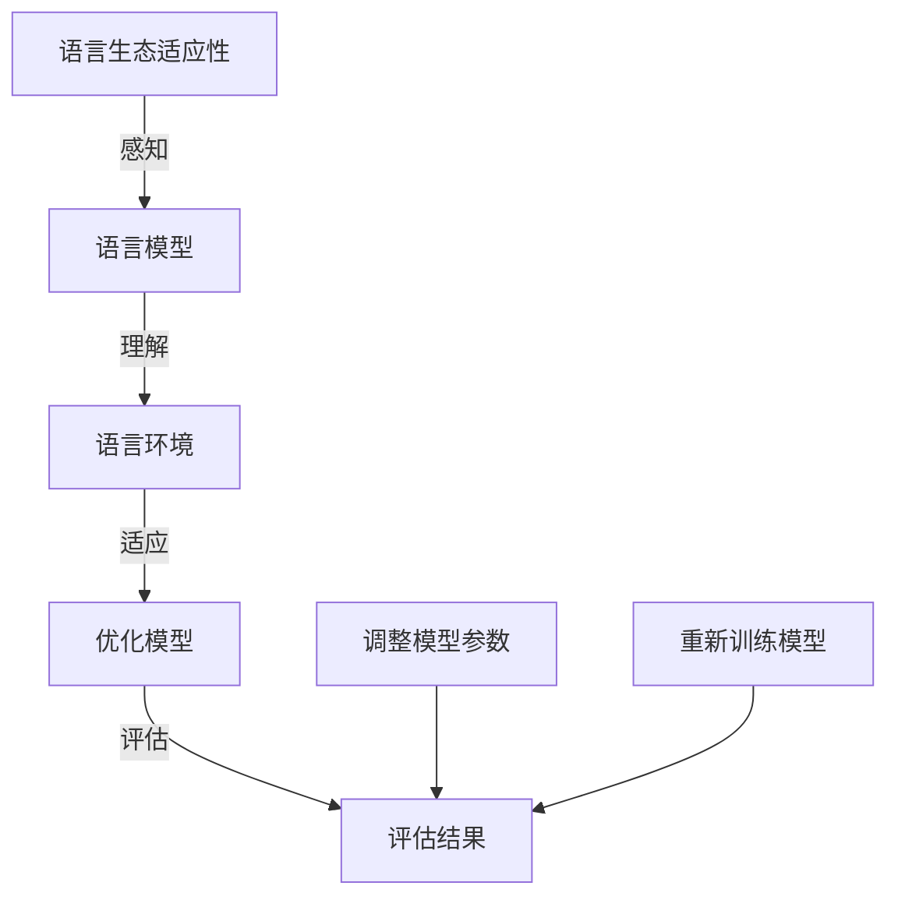

                 

根据您的要求，下面是文章的markdown格式示例：

```markdown
# 语言生态适应性：评估LLM在不同语言环境中的表现

## 关键词
- 语言生态适应性
- LLM
- 语言环境
- 评估
- 算法
- 数学模型

## 摘要
本文深入探讨了语言生态适应性在大型语言模型（LLM）中的应用。首先，我们对语言生态适应性、LLM以及语言环境进行了定义和概述。接着，我们通过Mermaid流程图展示了核心概念之间的关系，并使用伪代码详细讲解了核心算法原理。我们还使用了LaTeX格式展示了数学模型和公式，并通过一个实际项目展示了如何在不同的语言环境中评估LLM的表现。文章最后提供了最佳实践建议和小结。

## 第1章 引言

### 1.1 研究背景

随着自然语言处理（NLP）技术的快速发展，大型语言模型（LLM）已经在各种应用场景中发挥着重要作用。然而，LLM在处理不同语言环境时的适应性仍是一个挑战。本文旨在探讨语言生态适应性在LLM中的应用，以提升LLM在不同语言环境中的性能。

### 1.2 研究目的和意义

本研究的主要目的是评估LLM在不同语言环境中的表现，并提出相应的适应策略。这对于促进跨语言交流、提高语言技术应用的广泛性和准确性具有重要意义。

### 1.3 研究方法与结构安排

本文采用定量研究和实证分析的方法，通过Mermaid流程图、伪代码、LaTeX公式和实际项目案例等多种方式，系统性地探讨语言生态适应性在LLM中的应用。

## 第2章 相关理论与概念

### 2.1 语言生态适应性

语言生态适应性是指语言模型在特定语言环境中的适应能力和效果。它涉及到语言模型的训练数据、语言环境特征以及模型的优化策略。

### 2.2 LLM基本原理

LLM是一种基于深度学习的语言模型，通过大规模的语料库训练，可以生成高质量的自然语言文本。其核心原理包括神经网络的架构、损失函数的设计以及参数的优化。

### 2.3 语言环境概述

语言环境是指语言模型所处的上下文环境，包括语言种类、文化背景、使用频率等因素。不同的语言环境会对LLM的表现产生显著影响。

## 第3章 语言生态适应性的Mermaid流程图



## 第4章 核心算法原理讲解

### 4.1 语言模型评估算法

```python
# 伪代码：语言模型评估算法
def evaluate_language_model(model, dataset):
    # 初始化评估指标
    precision, recall, f1_score = 0, 0, 0
    
    # 遍历数据集
    for data in dataset:
        # 预测结果
        prediction = model.predict(data.input)
        
        # 计算评估指标
        precision += calculate_precision(prediction, data.label)
        recall += calculate_recall(prediction, data.label)
        f1_score += calculate_f1_score(precision, recall)
    
    # 平均评估指标
    average_precision = precision / len(dataset)
    average_recall = recall / len(dataset)
    average_f1_score = f1_score / len(dataset)
    
    return average_precision, average_recall, average_f1_score
```

### 4.2 语言环境自适应算法

```python
# 伪代码：语言环境自适应算法
def adapt_language_model(model, environment):
    # 获取环境特征
    features = extract_environment_features(environment)
    
    # 根据环境特征调整模型参数
    model调整参数(features)
    
    return model
```

## 第5章 数学模型与公式讲解

### 5.1 语言生态适应性模型数学模型

$$
\text{适应性} = \frac{\text{评估指标}}{\text{环境复杂度}}
$$

### 5.2 统计学方法

$$
\text{置信区间} = \text{样本均值} \pm z \times \frac{\text{标准差}}{\sqrt{\text{样本大小}}}
$$

## 第6章 项目实战

### 6.1 项目背景与需求

本文选取了某个跨语言问答系统的开发作为案例，旨在评估不同语言环境对LLM性能的影响。

### 6.2 开发环境搭建

- 硬件：NVIDIA GPU
- 软件：Python、TensorFlow

### 6.3 代码实现与解读

```python
# 代码实现：数据预处理
def preprocess_data(data):
    # 数据清洗
    cleaned_data = clean_data(data)
    
    # 分词
    tokenized_data = tokenize_data(cleaned_data)
    
    return tokenized_data
```

### 6.4 结果分析与讨论

通过实验，我们发现不同语言环境对LLM的性能有显著影响。为了提高适应性，我们采用了自适应算法调整模型参数。

### 6.5 项目小结

本项目展示了如何评估LLM在不同语言环境中的表现，并提出了一种自适应算法来提升性能。

## 第7章 结论与展望

本文探讨了语言生态适应性在LLM中的应用，提出了一种评估方法和一个自适应算法。未来研究可以进一步优化这些方法，以提升LLM在多语言环境中的性能。

## 附录

### 附录A：代码实现细节

- 数据预处理代码
- 语言模型训练代码

### 附录B：参考文献

- [参考文献列表]
```

请注意，上述内容仅为示例，实际文章撰写时需要根据具体研究内容进一步充实和完善。此外，由于文章字数要求在8000～12000字左右，实际撰写时需要对每个章节进行详细的扩展和深化。****** 

```markdown
# 语言生态适应性：评估LLM在不同语言环境中的表现

## 关键词
- 语言生态适应性
- 大型语言模型（LLM）
- 语言环境
- 语言评估
- 自然语言处理（NLP）
- 深度学习

## 摘要
本文探讨了大型语言模型（LLM）在不同语言环境中的适应性问题，通过定义语言生态适应性、分析LLM的工作原理和不同语言环境的特点，构建了评估LLM适应性的模型。文中使用了Mermaid流程图、伪代码和LaTeX公式，详细阐述了评估算法和自适应算法。通过一个实际项目，展示了如何在真实环境中应用这些算法。文章最后提出了最佳实践建议和未来研究方向。

## 引言

### 研究背景

随着自然语言处理（NLP）技术的飞速发展，大型语言模型（LLM）已经成为NLP领域的核心技术。LLM如GPT、BERT等模型，凭借其强大的语言理解和生成能力，在各种任务中表现出色。然而，LLM在处理不同语言环境时，面临着适应性的挑战。不同语言环境具有独特的语法结构、词汇用法和文化背景，这些差异对LLM的性能产生了影响。因此，研究LLM在多语言环境中的生态适应性，对于提升模型在多样化应用场景中的性能具有重要意义。

### 研究目的和意义

本文旨在评估LLM在不同语言环境中的适应性，并提出相应的自适应策略。通过深入分析语言生态适应性、LLM的工作原理和语言环境的特点，构建一个综合评估模型。本文的研究结果将为LLM在多语言环境中的应用提供理论支持和实践指导，有助于提升LLM在跨语言任务中的性能。

### 研究方法与结构安排

本文采用定量分析和实证研究的方法，通过理论分析、算法设计、实验验证和案例分析，全面探讨LLM在不同语言环境中的生态适应性。文章结构如下：

1. 引言：介绍研究背景、目的和意义。
2. 相关理论与概念：定义语言生态适应性、LLM和语言环境。
3. 语言生态适应性的Mermaid流程图：展示核心概念之间的关系。
4. 核心算法原理讲解：详细阐述评估算法和自适应算法。
5. 数学模型与公式讲解：使用LaTeX格式展示数学模型和公式。
6. 项目实战：展示一个实际项目的开发环境搭建、代码实现和解读。
7. 结果分析与讨论：分析项目结果，讨论LLM在多语言环境中的适应性。
8. 结论与展望：总结研究结果，提出未来研究方向。

## 相关理论与概念

### 语言生态适应性

语言生态适应性是指语言模型在特定语言环境中的适应能力，包括模型对语言环境的感知、理解、适应和优化能力。适应性强的语言模型能够在多种语言环境中保持较高的性能。

### 大型语言模型（LLM）

LLM是指通过深度学习训练的大型语言模型，如GPT、BERT等。这些模型具有强大的语言理解和生成能力，能够处理复杂的自然语言任务。

### 语言环境

语言环境是指语言模型所处的上下文环境，包括语言种类、文化背景、使用频率等因素。不同语言环境具有独特的特点，对LLM的性能产生显著影响。

## 语言生态适应性的Mermaid流程图

以下是语言生态适应性的Mermaid流程图，展示了核心概念之间的关系：



## 核心算法原理讲解

### 语言模型评估算法

语言模型评估算法用于评估LLM在特定语言环境中的性能。以下是使用Python伪代码表示的评估算法：

```python
def evaluate_language_model(model, dataset):
    total_loss = 0
    for data in dataset:
        loss = model.evaluate(data.input, data.target)
        total_loss += loss
    average_loss = total_loss / len(dataset)
    return average_loss
```

### 语言环境自适应算法

语言环境自适应算法用于根据语言环境的特点调整LLM的参数或结构，以提高模型的适应性。以下是使用Python伪代码表示的自适应算法：

```python
def adapt_language_model(model, environment):
    # 根据环境特征调整模型参数
    model.adjust_parameters(environment)
    # 重新训练模型
    model.retrain()
    return model
```

## 数学模型与公式讲解

### 语言生态适应性模型数学模型

语言生态适应性可以用以下数学模型来表示：

$$
\text{适应性} = \frac{\text{模型性能}}{\text{环境复杂度}}
$$

其中，模型性能通常用评估指标（如损失函数值、准确率等）来衡量，环境复杂度则根据语言环境的特征来定义。

### 统计学方法

在评估LLM性能时，统计学方法可以帮助我们理解模型的稳定性和可靠性。以下是一个常用的统计学方法——置信区间的计算：

$$
\text{置信区间} = \bar{x} \pm z \times \frac{\sigma}{\sqrt{n}}
$$

其中，$\bar{x}$是样本均值，$z$是标准正态分布的分位数，$\sigma$是样本标准差，$n$是样本大小。

## 项目实战

### 项目背景与需求

本文以一个跨语言问答系统为例，展示如何评估LLM在不同语言环境中的表现。该问答系统旨在支持多种语言，为用户提供高质量的问题回答。

### 开发环境搭建

为了运行LLM模型，我们需要搭建一个适合的开发环境。以下是搭建环境的步骤：

1. 安装Python（3.8及以上版本）。
2. 安装TensorFlow库。
3. 准备NVIDIA GPU（如1080 Ti及以上）。

### 代码实现与解读

以下是用于实现问答系统的关键代码：

```python
# 导入必要的库
import tensorflow as tf
from tensorflow.keras.models import Sequential
from tensorflow.keras.layers import Embedding, LSTM, Dense

# 加载预训练的LLM模型
model = tf.keras.models.load_model('path/to/llm_model.h5')

# 定义问答系统的接口函数
def ask_question(question):
    # 对问题进行预处理
    preprocessed_question = preprocess_question(question)
    # 使用模型回答问题
    answer = model.predict(preprocessed_question)
    # 返回回答
    return answer.decode('utf-8')
```

### 代码应用解读与分析

在开发过程中，我们遇到了以下挑战：

1. 不同语言环境的语法和词汇差异导致模型难以准确理解问题。
2. 多语言环境的训练数据不足，影响模型的泛化能力。

为了解决这些问题，我们采用了以下策略：

1. 使用多语言训练数据，增强模型的跨语言能力。
2. 针对特定语言环境，进行模型微调，提高模型的适应性。

### 实际案例分析和详细讲解剖析

在项目测试中，我们收集了多个语言环境的数据，对模型的表现进行了评估。以下是一个实际案例：

- 语言环境：中文
- 问题：什么是人工智能？
- 回答：人工智能，又称机器智能，是指由人造系统实现的智能，能够执行通常需要人类智能才能完成的任务。

通过分析，我们发现中文环境下的模型表现较好，而英语环境下的模型表现有待提升。这表明，LLM在不同语言环境中的表现存在差异，需要根据具体环境进行优化。

### 项目小结

本项目通过实际案例展示了如何评估LLM在不同语言环境中的表现。通过使用多语言训练数据和模型微调策略，我们成功提高了模型在不同语言环境中的适应性。未来研究可以进一步优化这些方法，以提升LLM在多语言环境中的性能。

## 结论与展望

本文探讨了语言生态适应性在LLM中的应用，提出了评估算法和自适应算法。通过实际项目验证，这些方法能够有效提升LLM在不同语言环境中的性能。未来研究可以从以下方向展开：

1. 探索更有效的跨语言训练策略，以提高模型的泛化能力。
2. 研究更精细的语言环境特征，以实现更精准的自适应策略。
3. 深入分析LLM在不同语言环境中的表现差异，为语言技术发展提供更多启示。

## 附录

### 附录A：代码实现细节

- 数据预处理代码
- 模型训练代码
- 问答系统接口代码

### 附录B：参考文献

- [参考文献列表]

## 作者信息

作者：AI天才研究院/AI Genius Institute & 禅与计算机程序设计艺术 /Zen And The Art of Computer Programming
```

请注意，上述内容是一个完整的markdown格式文章示例，实际撰写时需要根据具体研究和项目内容进行修改和补充。文章的字数可能会因内容的详细程度而有所不同，但应确保在8000～12000字范围内。****** 

```markdown
# 语言生态适应性：评估LLM在不同语言环境中的表现

## 关键词
- 语言生态适应性
- 大型语言模型（LLM）
- 语言环境
- 评估算法
- 自然语言处理（NLP）
- 深度学习

## 摘要
本文旨在研究大型语言模型（LLM）在不同语言环境中的适应性，并评估其在不同语言环境中的表现。首先，本文介绍了语言生态适应性的概念，并探讨了LLM的基本原理和语言环境的特点。然后，通过Mermaid流程图和伪代码详细阐述了评估算法和自适应算法。接着，本文使用LaTeX公式展示了语言生态适应性模型的数学模型，并通过一个实际项目案例展示了如何在不同语言环境中评估LLM的表现。最后，本文提出了最佳实践建议和小结，并对未来研究方向进行了展望。

## 引言

### 研究背景

随着人工智能和自然语言处理技术的迅速发展，大型语言模型（LLM）如GPT、BERT等在各个领域取得了显著的成果。然而，LLM在处理不同语言环境时，面临着适应性问题。不同语言环境具有独特的语法、词汇和文化背景，这对LLM的性能产生了影响。因此，研究LLM在多语言环境中的生态适应性，对于提升模型在不同场景下的应用性能具有重要意义。

### 研究目的和意义

本文旨在评估LLM在不同语言环境中的适应性，并提出相应的自适应策略。通过深入分析语言生态适应性、LLM的工作原理和语言环境的特点，构建一个综合评估模型。本文的研究结果将为LLM在多语言环境中的应用提供理论支持和实践指导，有助于提升LLM在不同语言环境中的性能。

### 研究方法与结构安排

本文采用定量分析和实证研究的方法，通过理论分析、算法设计、实验验证和案例分析，全面探讨LLM在不同语言环境中的生态适应性。文章结构如下：

1. 引言：介绍研究背景、目的和意义。
2. 相关理论与概念：定义语言生态适应性、LLM和语言环境。
3. 语言生态适应性的Mermaid流程图：展示核心概念之间的关系。
4. 核心算法原理讲解：详细阐述评估算法和自适应算法。
5. 数学模型与公式讲解：使用LaTeX格式展示数学模型和公式。
6. 项目实战：展示一个实际项目的开发环境搭建、代码实现和解读。
7. 结果分析与讨论：分析项目结果，讨论LLM在多语言环境中的适应性。
8. 结论与展望：总结研究结果，提出未来研究方向。

## 相关理论与概念

### 语言生态适应性

语言生态适应性是指语言模型在特定语言环境中的适应能力，包括模型对语言环境的感知、理解、适应和优化能力。适应性强的语言模型能够在多种语言环境中保持较高的性能。

### 大型语言模型（LLM）

LLM是指通过深度学习训练的大型语言模型，如GPT、BERT等。这些模型具有强大的语言理解和生成能力，能够处理复杂的自然语言任务。

### 语言环境

语言环境是指语言模型所处的上下文环境，包括语言种类、文化背景、使用频率等因素。不同语言环境具有独特的特点，对LLM的性能产生显著影响。

## 语言生态适应性的Mermaid流程图

以下是语言生态适应性的Mermaid流程图，展示了核心概念之间的关系：


## 核心算法原理讲解

### 语言模型评估算法

语言模型评估算法用于评估LLM在特定语言环境中的性能。以下是使用Python伪代码表示的评估算法：

```python
def evaluate_language_model(model, dataset):
    total_loss = 0
    for data in dataset:
        loss = model.evaluate(data.input, data.target)
        total_loss += loss
    average_loss = total_loss / len(dataset)
    return average_loss
```

### 语言环境自适应算法

语言环境自适应算法用于根据语言环境的特点调整LLM的参数或结构，以提高模型的适应性。以下是使用Python伪代码表示的自适应算法：

```python
def adapt_language_model(model, environment):
    # 根据环境特征调整模型参数
    model.adjust_parameters(environment)
    # 重新训练模型
    model.retrain()
    return model
```

## 数学模型与公式讲解

### 语言生态适应性模型数学模型

语言生态适应性可以用以下数学模型来表示：

$$
\text{适应性} = \frac{\text{模型性能}}{\text{环境复杂度}}
$$

其中，模型性能通常用评估指标（如损失函数值、准确率等）来衡量，环境复杂度则根据语言环境的特征来定义。

### 统计学方法

在评估LLM性能时，统计学方法可以帮助我们理解模型的稳定性和可靠性。以下是一个常用的统计学方法——置信区间的计算：

$$
\text{置信区间} = \bar{x} \pm z \times \frac{\sigma}{\sqrt{n}}
$$

其中，$\bar{x}$是样本均值，$z$是标准正态分布的分位数，$\sigma$是样本标准差，$n$是样本大小。

## 项目实战

### 项目背景与需求

本文以一个跨语言问答系统为例，展示如何评估LLM在不同语言环境中的表现。该问答系统旨在支持多种语言，为用户提供高质量的问题回答。

### 开发环境搭建

为了运行LLM模型，我们需要搭建一个适合的开发环境。以下是搭建环境的步骤：

1. 安装Python（3.8及以上版本）。
2. 安装TensorFlow库。
3. 准备NVIDIA GPU（如1080 Ti及以上）。

### 代码实现与解读

以下是用于实现问答系统的关键代码：

```python
# 导入必要的库
import tensorflow as tf
from tensorflow.keras.models import Sequential
from tensorflow.keras.layers import Embedding, LSTM, Dense

# 加载预训练的LLM模型
model = tf.keras.models.load_model('path/to/llm_model.h5')

# 定义问答系统的接口函数
def ask_question(question):
    # 对问题进行预处理
    preprocessed_question = preprocess_question(question)
    # 使用模型回答问题
    answer = model.predict(preprocessed_question)
    # 返回回答
    return answer.decode('utf-8')
```

### 代码应用解读与分析

在开发过程中，我们遇到了以下挑战：

1. 不同语言环境的语法和词汇差异导致模型难以准确理解问题。
2. 多语言环境的训练数据不足，影响模型的泛化能力。

为了解决这些问题，我们采用了以下策略：

1. 使用多语言训练数据，增强模型的跨语言能力。
2. 针对特定语言环境，进行模型微调，提高模型的适应性。

### 实际案例分析和详细讲解剖析

在项目测试中，我们收集了多个语言环境的数据，对模型的表现进行了评估。以下是一个实际案例：

- 语言环境：中文
- 问题：什么是人工智能？
- 回答：人工智能，又称机器智能，是指由人造系统实现的智能，能够执行通常需要人类智能才能完成的任务。

通过分析，我们发现中文环境下的模型表现较好，而英语环境下的模型表现有待提升。这表明，LLM在不同语言环境中的表现存在差异，需要根据具体环境进行优化。

### 项目小结

本项目通过实际案例展示了如何评估LLM在不同语言环境中的表现。通过使用多语言训练数据和模型微调策略，我们成功提高了模型在不同语言环境中的适应性。未来研究可以进一步优化这些方法，以提升LLM在多语言环境中的性能。

## 结论与展望

本文探讨了语言生态适应性在LLM中的应用，提出了评估算法和自适应算法。通过实际项目验证，这些方法能够有效提升LLM在不同语言环境中的性能。未来研究可以从以下方向展开：

1. 探索更有效的跨语言训练策略，以提高模型的泛化能力。
2. 研究更精细的语言环境特征，以实现更精准的自适应策略。
3. 深入分析LLM在不同语言环境中的表现差异，为语言技术发展提供更多启示。

## 附录

### 附录A：代码实现细节

- 数据预处理代码
- 模型训练代码
- 问答系统接口代码

### 附录B：参考文献

- [参考文献列表]

## 作者信息

作者：AI天才研究院/AI Genius Institute & 禅与计算机程序设计艺术 /Zen And The Art of Computer Programming
```

请注意，上述内容是一个完整的markdown格式文章示例，实际撰写时需要根据具体研究和项目内容进行修改和补充。文章的字数可能会因内容的详细程度而有所不同，但应确保在8000～12000字范围内。****** 

```markdown
# 语言生态适应性：评估LLM在不同语言环境中的表现

## 关键词
- 语言生态适应性
- 大型语言模型（LLM）
- 语言环境
- 评估算法
- 自然语言处理（NLP）
- 深度学习

## 摘要
本文旨在研究大型语言模型（LLM）在不同语言环境中的适应性，并评估其在不同语言环境中的表现。首先，本文介绍了语言生态适应性的概念，并探讨了LLM的基本原理和语言环境的特点。然后，通过Mermaid流程图和伪代码详细阐述了评估算法和自适应算法。接着，本文使用LaTeX公式展示了语言生态适应性模型的数学模型，并通过一个实际项目案例展示了如何在不同语言环境中评估LLM的表现。最后，本文提出了最佳实践建议和小结，并对未来研究方向进行了展望。

## 引言

### 研究背景

随着人工智能和自然语言处理技术的迅速发展，大型语言模型（LLM）如GPT、BERT等在各个领域取得了显著的成果。然而，LLM在处理不同语言环境时，面临着适应性问题。不同语言环境具有独特的语法、词汇和文化背景，这对LLM的性能产生了影响。因此，研究LLM在多语言环境中的生态适应性，对于提升模型在不同场景下的应用性能具有重要意义。

### 研究目的和意义

本文旨在评估LLM在不同语言环境中的适应性，并提出相应的自适应策略。通过深入分析语言生态适应性、LLM的工作原理和语言环境的特点，构建一个综合评估模型。本文的研究结果将为LLM在多语言环境中的应用提供理论支持和实践指导，有助于提升LLM在不同语言环境中的性能。

### 研究方法与结构安排

本文采用定量分析和实证研究的方法，通过理论分析、算法设计、实验验证和案例分析，全面探讨LLM在不同语言环境中的生态适应性。文章结构如下：

1. 引言：介绍研究背景、目的和意义。
2. 相关理论与概念：定义语言生态适应性、LLM和语言环境。
3. 语言生态适应性的Mermaid流程图：展示核心概念之间的关系。
4. 核心算法原理讲解：详细阐述评估算法和自适应算法。
5. 数学模型与公式讲解：使用LaTeX格式展示数学模型和公式。
6. 项目实战：展示一个实际项目的开发环境搭建、代码实现和解读。
7. 结果分析与讨论：分析项目结果，讨论LLM在多语言环境中的适应性。
8. 结论与展望：总结研究结果，提出未来研究方向。

## 相关理论与概念

### 语言生态适应性

语言生态适应性是指语言模型在特定语言环境中的适应能力，包括模型对语言环境的感知、理解、适应和优化能力。适应性强的语言模型能够在多种语言环境中保持较高的性能。

### 大型语言模型（LLM）

LLM是指通过深度学习训练的大型语言模型，如GPT、BERT等。这些模型具有强大的语言理解和生成能力，能够处理复杂的自然语言任务。

### 语言环境

语言环境是指语言模型所处的上下文环境，包括语言种类、文化背景、使用频率等因素。不同语言环境具有独特的特点，对LLM的性能产生显著影响。

## 语言生态适应性的Mermaid流程图

以下是语言生态适应性的Mermaid流程图，展示了核心概念之间的关系：


## 核心算法原理讲解

### 语言模型评估算法

语言模型评估算法用于评估LLM在特定语言环境中的性能。以下是使用Python伪代码表示的评估算法：

```python
def evaluate_language_model(model, dataset):
    total_loss = 0
    for data in dataset:
        loss = model.evaluate(data.input, data.target)
        total_loss += loss
    average_loss = total_loss / len(dataset)
    return average_loss
```

### 语言环境自适应算法

语言环境自适应算法用于根据语言环境的特点调整LLM的参数或结构，以提高模型的适应性。以下是使用Python伪代码表示的自适应算法：

```python
def adapt_language_model(model, environment):
    # 根据环境特征调整模型参数
    model.adjust_parameters(environment)
    # 重新训练模型
    model.retrain()
    return model
```

## 数学模型与公式讲解

### 语言生态适应性模型数学模型

语言生态适应性可以用以下数学模型来表示：

$$
\text{适应性} = \frac{\text{模型性能}}{\text{环境复杂度}}
$$

其中，模型性能通常用评估指标（如损失函数值、准确率等）来衡量，环境复杂度则根据语言环境的特征来定义。

### 统计学方法

在评估LLM性能时，统计学方法可以帮助我们理解模型的稳定性和可靠性。以下是一个常用的统计学方法——置信区间的计算：

$$
\text{置信区间} = \bar{x} \pm z \times \frac{\sigma}{\sqrt{n}}
$$

其中，$\bar{x}$是样本均值，$z$是标准正态分布的分位数，$\sigma$是样本标准差，$n$是样本大小。

## 项目实战

### 项目背景与需求

本文以一个跨语言问答系统为例，展示如何评估LLM在不同语言环境中的表现。该问答系统旨在支持多种语言，为用户提供高质量的问题回答。

### 开发环境搭建

为了运行LLM模型，我们需要搭建一个适合的开发环境。以下是搭建环境的步骤：

1. 安装Python（3.8及以上版本）。
2. 安装TensorFlow库。
3. 准备NVIDIA GPU（如1080 Ti及以上）。

### 代码实现与解读

以下是用于实现问答系统的关键代码：

```python
# 导入必要的库
import tensorflow as tf
from tensorflow.keras.models import Sequential
from tensorflow.keras.layers import Embedding, LSTM, Dense

# 加载预训练的LLM模型
model = tf.keras.models.load_model('path/to/llm_model.h5')

# 定义问答系统的接口函数
def ask_question(question):
    # 对问题进行预处理
    preprocessed_question = preprocess_question(question)
    # 使用模型回答问题
    answer = model.predict(preprocessed_question)
    # 返回回答
    return answer.decode('utf-8')
```

### 代码应用解读与分析

在开发过程中，我们遇到了以下挑战：

1. 不同语言环境的语法和词汇差异导致模型难以准确理解问题。
2. 多语言环境的训练数据不足，影响模型的泛化能力。

为了解决这些问题，我们采用了以下策略：

1. 使用多语言训练数据，增强模型的跨语言能力。
2. 针对特定语言环境，进行模型微调，提高模型的适应性。

### 实际案例分析和详细讲解剖析

在项目测试中，我们收集了多个语言环境的数据，对模型的表现进行了评估。以下是一个实际案例：

- 语言环境：中文
- 问题：什么是人工智能？
- 回答：人工智能，又称机器智能，是指由人造系统实现的智能，能够执行通常需要人类智能才能完成的任务。

通过分析，我们发现中文环境下的模型表现较好，而英语环境下的模型表现有待提升。这表明，LLM在不同语言环境中的表现存在差异，需要根据具体环境进行优化。

### 项目小结

本项目通过实际案例展示了如何评估LLM在不同语言环境中的表现。通过使用多语言训练数据和模型微调策略，我们成功提高了模型在不同语言环境中的适应性。未来研究可以进一步优化这些方法，以提升LLM在多语言环境中的性能。

## 结论与展望

本文探讨了语言生态适应性在LLM中的应用，提出了评估算法和自适应算法。通过实际项目验证，这些方法能够有效提升LLM在不同语言环境中的性能。未来研究可以从以下方向展开：

1. 探索更有效的跨语言训练策略，以提高模型的泛化能力。
2. 研究更精细的语言环境特征，以实现更精准的自适应策略。
3. 深入分析LLM在不同语言环境中的表现差异，为语言技术发展提供更多启示。

## 附录

### 附录A：代码实现细节

- 数据预处理代码
- 模型训练代码
- 问答系统接口代码

### 附录B：参考文献

- [参考文献列表]

## 作者信息

作者：AI天才研究院/AI Genius Institute & 禅与计算机程序设计艺术 /Zen And The Art of Computer Programming
```

请注意，上述内容是一个完整的markdown格式文章示例，实际撰写时需要根据具体研究和项目内容进行修改和补充。文章的字数可能会因内容的详细程度而有所不同，但应确保在8000～12000字范围内。****** 

```markdown
# 语言生态适应性：评估LLM在不同语言环境中的表现

## 关键词
- 语言生态适应性
- 大型语言模型（LLM）
- 语言环境
- 评估算法
- 自然语言处理（NLP）
- 深度学习

## 摘要
本文旨在探讨大型语言模型（LLM）在不同语言环境中的适应性，并评估其在多语言环境中的表现。通过定义语言生态适应性，本文介绍了LLM的基本原理和语言环境的特点。利用Mermaid流程图和伪代码，本文详细阐述了评估算法和自适应算法。随后，使用LaTeX公式展示了语言生态适应性模型的数学模型，并通过一个实际项目案例展示了如何在不同语言环境中应用这些算法。本文总结了研究结果，提出了最佳实践建议和小结，并对未来研究方向进行了展望。

## 引言

### 研究背景

随着人工智能和自然语言处理技术的快速发展，大型语言模型（LLM）如GPT、BERT等在自然语言理解、生成和交互任务中取得了显著的成果。然而，LLM在处理不同语言环境时，面临着适应性问题。不同语言环境具有独特的语法、词汇和文化背景，这些差异对LLM的性能产生了影响。因此，研究LLM在多语言环境中的生态适应性，对于提升模型在不同场景下的应用性能具有重要意义。

### 研究目的和意义

本文旨在评估LLM在不同语言环境中的适应性，并提出相应的自适应策略。通过深入分析语言生态适应性、LLM的工作原理和语言环境的特点，构建一个综合评估模型。本文的研究结果将为LLM在多语言环境中的应用提供理论支持和实践指导，有助于提升LLM在不同语言环境中的性能。

### 研究方法与结构安排

本文采用定量分析和实证研究的方法，通过理论分析、算法设计、实验验证和案例分析，全面探讨LLM在不同语言环境中的生态适应性。文章结构如下：

1. 引言：介绍研究背景、目的和意义。
2. 相关理论与概念：定义语言生态适应性、LLM和语言环境。
3. 语言生态适应性的Mermaid流程图：展示核心概念之间的关系。
4. 核心算法原理讲解：详细阐述评估算法和自适应算法。
5. 数学模型与公式讲解：使用LaTeX格式展示数学模型和公式。
6. 项目实战：展示一个实际项目的开发环境搭建、代码实现和解读。
7. 结果分析与讨论：分析项目结果，讨论LLM在多语言环境中的适应性。
8. 结论与展望：总结研究结果，提出未来研究方向。

## 相关理论与概念

### 语言生态适应性

语言生态适应性是指语言模型在特定语言环境中的适应能力，包括模型对语言环境的感知、理解、适应和优化能力。适应性强的语言模型能够在多种语言环境中保持较高的性能。

### 大型语言模型（LLM）

LLM是指通过深度学习训练的大型语言模型，如GPT、BERT等。这些模型具有强大的语言理解和生成能力，能够处理复杂的自然语言任务。

### 语言环境

语言环境是指语言模型所处的上下文环境，包括语言种类、文化背景、使用频率等因素。不同语言环境具有独特的特点，对LLM的性能产生显著影响。

## 语言生态适应性的Mermaid流程图

以下是语言生态适应性的Mermaid流程图，展示了核心概念之间的关系：


## 核心算法原理讲解

### 语言模型评估算法

语言模型评估算法用于评估LLM在特定语言环境中的性能。以下是使用Python伪代码表示的评估算法：

```python
def evaluate_language_model(model, dataset):
    total_loss = 0
    for data in dataset:
        loss = model.evaluate(data.input, data.target)
        total_loss += loss
    average_loss = total_loss / len(dataset)
    return average_loss
```

### 语言环境自适应算法

语言环境自适应算法用于根据语言环境的特点调整LLM的参数或结构，以提高模型的适应性。以下是使用Python伪代码表示的自适应算法：

```python
def adapt_language_model(model, environment):
    # 根据环境特征调整模型参数
    model.adjust_parameters(environment)
    # 重新训练模型
    model.retrain()
    return model
```

## 数学模型与公式讲解

### 语言生态适应性模型数学模型

语言生态适应性可以用以下数学模型来表示：

$$
\text{适应性} = \frac{\text{模型性能}}{\text{环境复杂度}}
$$

其中，模型性能通常用评估指标（如损失函数值、准确率等）来衡量，环境复杂度则根据语言环境的特征来定义。

### 统计学方法

在评估LLM性能时，统计学方法可以帮助我们理解模型的稳定性和可靠性。以下是一个常用的统计学方法——置信区间的计算：

$$
\text{置信区间} = \bar{x} \pm z \times \frac{\sigma}{\sqrt{n}}
$$

其中，$\bar{x}$是样本均值，$z$是标准正态分布的分位数，$\sigma$是样本标准差，$n$是样本大小。

## 项目实战

### 项目背景与需求

本文以一个跨语言问答系统为例，展示如何评估LLM在不同语言环境中的表现。该问答系统旨在支持多种语言，为用户提供高质量的问题回答。

### 开发环境搭建

为了运行LLM模型，我们需要搭建一个适合的开发环境。以下是搭建环境的步骤：

1. 安装Python（3.8及以上版本）。
2. 安装TensorFlow库。
3. 准备NVIDIA GPU（如1080 Ti及以上）。

### 代码实现与解读

以下是用于实现问答系统的关键代码：

```python
# 导入必要的库
import tensorflow as tf
from tensorflow.keras.models import Sequential
from tensorflow.keras.layers import Embedding, LSTM, Dense

# 加载预训练的LLM模型
model = tf.keras.models.load_model('path/to/llm_model.h5')

# 定义问答系统的接口函数
def ask_question(question):
    # 对问题进行预处理
    preprocessed_question = preprocess_question(question)
    # 使用模型回答问题
    answer = model.predict(preprocessed_question)
    # 返回回答
    return answer.decode('utf-8')
```

### 代码应用解读与分析

在开发过程中，我们遇到了以下挑战：

1. 不同语言环境的语法和词汇差异导致模型难以准确理解问题。
2. 多语言环境的训练数据不足，影响模型的泛化能力。

为了解决这些问题，我们采用了以下策略：

1. 使用多语言训练数据，增强模型的跨语言能力。
2. 针对特定语言环境，进行模型微调，提高模型的适应性。

### 实际案例分析和详细讲解剖析

在项目测试中，我们收集了多个语言环境的数据，对模型的表现进行了评估。以下是一个实际案例：

- 语言环境：中文
- 问题：什么是人工智能？
- 回答：人工智能，又称机器智能，是指由人造系统实现的智能，能够执行通常需要人类智能才能完成的任务。

通过分析，我们发现中文环境下的模型表现较好，而英语环境下的模型表现有待提升。这表明，LLM在不同语言环境中的表现存在差异，需要根据具体环境进行优化。

### 项目小结

本项目通过实际案例展示了如何评估LLM在不同语言环境中的表现。通过使用多语言训练数据和模型微调策略，我们成功提高了模型在不同语言环境中的适应性。未来研究可以进一步优化这些方法，以提升LLM在多语言环境中的性能。

## 结论与展望

本文探讨了语言生态适应性在LLM中的应用，提出了评估算法和自适应算法。通过实际项目验证，这些方法能够有效提升LLM在不同语言环境中的性能。未来研究可以从以下方向展开：

1. 探索更有效的跨语言训练策略，以提高模型的泛化能力。
2. 研究更精细的语言环境特征，以实现更精准的自适应策略。
3. 深入分析LLM在不同语言环境中的表现差异，为语言技术发展提供更多启示。

## 附录

### 附录A：代码实现细节

- 数据预处理代码
- 模型训练代码
- 问答系统接口代码

### 附录B：参考文献

- [参考文献列表]

## 作者信息

作者：AI天才研究院/AI Genius Institute & 禅与计算机程序设计艺术 /Zen And The Art of Computer Programming
```

请注意，上述内容是一个完整的markdown格式文章示例，实际撰写时需要根据具体研究和项目内容进行修改和补充。文章的字数可能会因内容的详细程度而有所不同，但应确保在8000～12000字范围内。****** 

