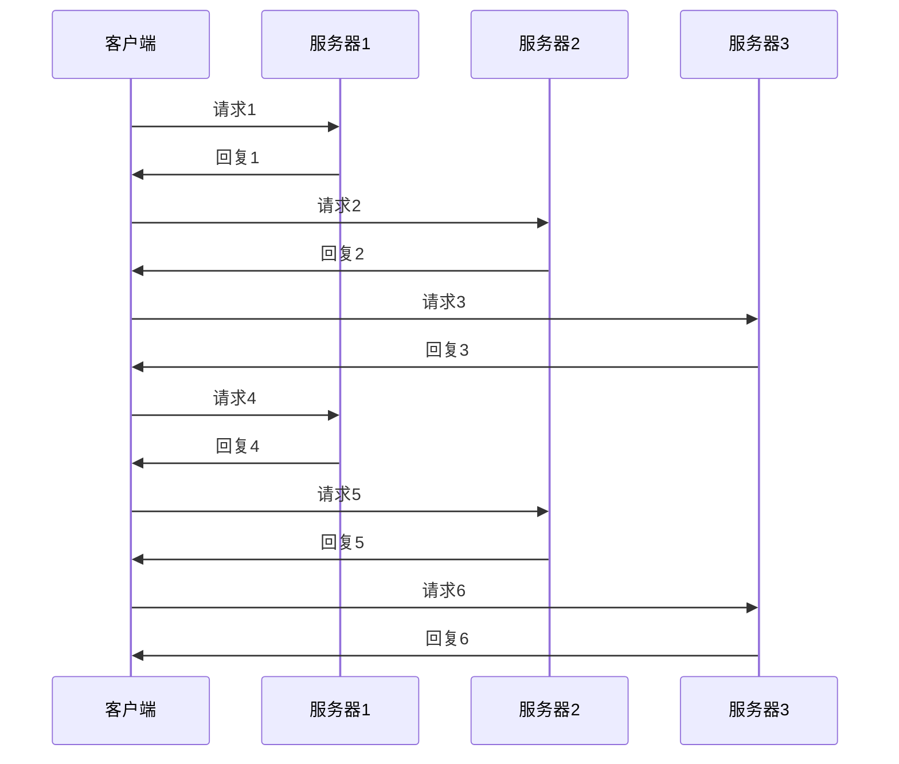
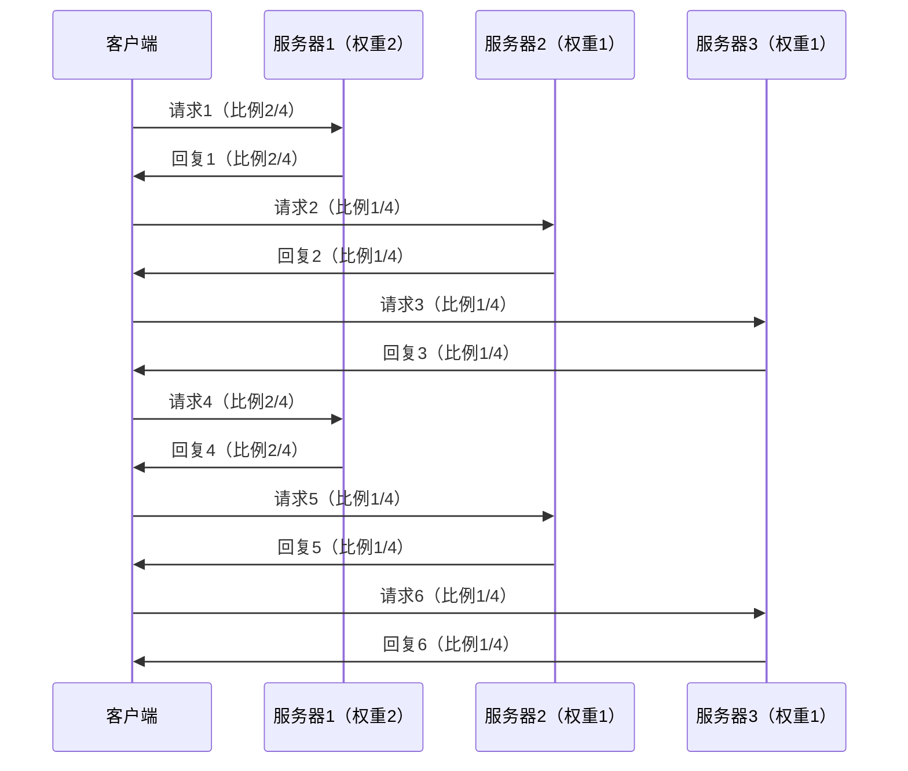
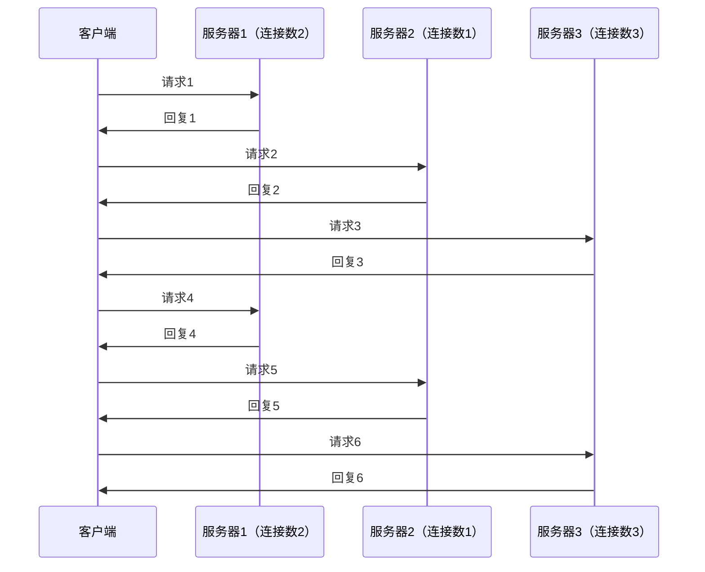
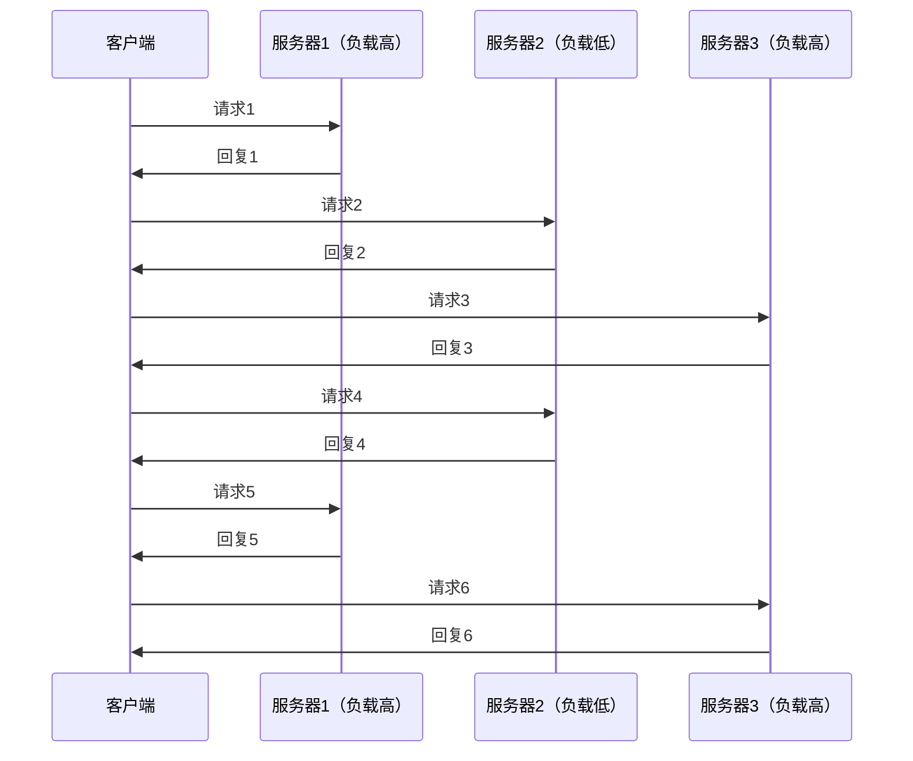

                 

### 文章标题

# 负载均衡：提高LLM应用的并发处理能力

负载均衡是一种通过合理分配工作负载到多个计算资源上，以提高系统性能和可靠性的技术手段。随着大规模语言模型（LLM）的广泛应用，如何提升LLM应用的并发处理能力成为了一个关键问题。本文将围绕负载均衡的概念、挑战与机遇、算法、架构设计、实际应用、性能优化、安全性和可靠性等方面进行深入探讨，旨在为读者提供一个全面而深入的负载均衡技术指南。

### 文章关键词

- 负载均衡
- 并发处理能力
- 大规模语言模型（LLM）
- 负载均衡算法
- 架构设计
- 性能优化
- 安全性
- 可靠性

### 文章摘要

本文首先介绍了负载均衡的基础概念，包括其定义、作用、分类和关键性能指标。接着，我们分析了负载均衡面临的挑战与机遇，特别是在LLM应用中的重要性。随后，本文详细探讨了常用的负载均衡算法，包括轮询、加权轮询、Least Connections和Dynamic Round Robin算法。在架构设计部分，我们介绍了负载均衡架构的设计原则、基本组件和典型设计。实际应用部分则重点讨论了负载均衡器的配置与部署、策略定制以及与云服务的结合。性能优化部分，我们分析了负载均衡性能瓶颈及其优化方法。最后，本文讨论了负载均衡的安全性和可靠性，并提供了性能选型指南和常见算法实现。

---

接下来，我们将逐章深入探讨负载均衡的相关内容，帮助读者全面理解并掌握这一关键技术。

## 第1章 负载均衡基础概念

### 1.1 负载均衡的定义与作用

负载均衡（Load Balancing）是一种将工作负载分配到多个计算资源上的技术，其核心目的是提高系统的性能和可靠性。具体来说，负载均衡通过智能地分配网络流量、计算任务和其他资源请求，使得各个计算资源能够高效地运行，避免单个资源过载，从而提高整个系统的响应速度和处理能力。

负载均衡的基本原理可以概括为以下几点：

1. **流量分配**：将进入系统的网络流量分配到多个服务器上。
2. **负载监测**：实时监测各个服务器的负载情况，包括CPU利用率、内存占用、网络带宽等。
3. **动态调整**：根据服务器的负载情况动态调整流量分配策略，确保负载均衡。

### 负载均衡与传统性能优化的区别

负载均衡与传统性能优化有显著的区别。传统性能优化通常关注单个服务器的优化，包括硬件升级、软件调优等，目的是提高单个服务器的处理能力。而负载均衡则是一种分布式系统优化策略，通过将工作负载分配到多个服务器上，实现整体性能的提升。

具体来说，负载均衡与传统性能优化的区别如下：

- **优化目标**：传统性能优化关注单个服务器，而负载均衡关注整个系统。
- **资源利用**：传统性能优化可能导致资源浪费，而负载均衡则通过高效利用资源，避免资源闲置。
- **复杂性**：负载均衡涉及多台服务器的协同工作，其实现和维护相对复杂。

### 1.2 负载均衡的分类

负载均衡可以按照不同的分类方式进行分类，主要包括以下几类：

- **基于硬件的负载均衡**：使用专门的硬件设备，如负载均衡器，来进行流量分配和负载监测。这种方案通常具有高性能和高可靠性，但成本较高。
  
- **基于软件的负载均衡**：使用软件实现的负载均衡器，可以在通用服务器上运行。这种方案成本较低，但性能和可靠性可能不如硬件负载均衡器。

- **基于内容的负载均衡**：根据请求的内容，动态分配负载到不同的服务器上。例如，根据请求的URL、HTTP头等，将请求分配到不同的服务器进行处理。

### 1.3 负载均衡的关键性能指标

负载均衡的性能指标对于评估和选择负载均衡方案至关重要。以下是几个关键性能指标：

- **吞吐量**：系统处理请求的总量，通常以每秒请求数（requests per second, rps）表示。
- **延迟**：请求从发出到响应的时间，通常以毫秒（ms）为单位。
- **并发处理能力**：系统同时处理请求的能力，通常以最大并发连接数表示。
- **可用性**：系统正常运行的时间比例，通常以百分比表示。

### 1.4 负载均衡在LLM应用中的重要性

随着大规模语言模型（LLM）的广泛应用，负载均衡在提高LLM应用的并发处理能力方面具有重要意义。以下是几个关键点：

- **大规模并行处理**：LLM通常涉及大量并行计算，负载均衡能够有效地将计算任务分配到多个服务器上，提高整体处理能力。
- **快速响应**：负载均衡能够减少单个服务器的负载，提高系统响应速度，从而优化用户体验。
- **资源利用率**：负载均衡能够充分利用服务器资源，避免资源闲置，提高系统效率。

总之，负载均衡是提升LLM应用并发处理能力的关键技术之一，其应用效果直接影响到系统的性能和稳定性。

### 1.5 负载均衡技术的发展趋势

随着云计算、大数据和人工智能等技术的快速发展，负载均衡技术也在不断演进。以下是当前负载均衡技术的一些发展趋势：

- **云原生负载均衡**：随着云原生应用的兴起，负载均衡逐渐向云平台迁移，支持自动化部署、弹性扩展和微服务架构。
- **智能负载均衡**：结合机器学习和大数据分析，实现更加智能的流量分配和负载监测，提高系统的自适应能力和可靠性。
- **服务网格负载均衡**：在微服务架构中，服务网格（Service Mesh）提供了一种新的负载均衡机制，能够实现服务间的流量管理和负载均衡。
- **边缘计算负载均衡**：随着边缘计算的兴起，负载均衡开始向边缘节点扩展，以降低延迟、提高响应速度。

总之，负载均衡技术在不断适应新需求、解决新问题，为各类复杂应用场景提供高效、可靠的解决方案。

### 1.6 负载均衡的挑战与机遇

虽然负载均衡技术在提高系统性能和可靠性方面具有显著优势，但在实际应用中仍面临诸多挑战和机遇。以下是几个关键点：

- **网络波动的影响**：网络波动可能导致流量分配不均，影响系统性能。负载均衡系统需要具备应对网络不稳定的能力，以实现稳定的流量分配。
- **资源分配的不确定性**：服务器的负载情况实时变化，负载均衡系统需要动态调整流量分配策略，确保系统资源得到充分利用。
- **高并发场景下的稳定性**：在高并发场景下，负载均衡系统需要确保系统稳定运行，避免因负载过高导致系统崩溃。
- **优化用户体验**：负载均衡不仅关注系统性能，还需要优化用户体验，确保用户请求能够快速、稳定地得到响应。

总之，负载均衡在应对复杂应用场景时面临诸多挑战，但同时也提供了巨大的机遇。通过不断创新和优化，负载均衡技术将继续为各类应用场景提供高效、可靠的解决方案。

### 1.7 负载均衡在LLM应用中的最佳实践

在LLM应用中，负载均衡的最佳实践至关重要，以下是一些关键建议：

- **合理选择负载均衡算法**：根据应用特点和需求，选择合适的负载均衡算法，如轮询、加权轮询、Least Connections等。
- **优化服务器资源**：确保服务器资源充足，避免因资源不足导致性能瓶颈。
- **动态调整策略**：根据实时负载情况，动态调整流量分配策略，确保系统性能稳定。
- **监控与分析**：实时监控负载均衡系统的运行状态，分析性能瓶颈，及时优化和调整。

总之，通过遵循最佳实践，可以有效提升LLM应用的并发处理能力和稳定性。

### 1.8 负载均衡的选型指南

在选型负载均衡方案时，需要综合考虑多个因素，包括硬件负载均衡器、软件负载均衡器和云计算服务。以下是几个关键点：

- **硬件负载均衡器**：适用于高并发、高可靠性的场景，如大型企业级应用。
- **软件负载均衡器**：适用于中小型应用，成本低，灵活性好。
- **云计算服务**：适用于需要弹性扩展和自动化管理的场景，如云原生应用。

总之，根据具体应用需求，合理选型负载均衡方案，是提升系统性能和可靠性的关键。

### 1.9 负载均衡技术的未来发展方向

随着技术的不断发展，负载均衡技术也在不断演进。未来，负载均衡技术可能朝着以下几个方向发展：

- **智能化**：通过机器学习和大数据分析，实现更智能的流量分配和负载监测。
- **边缘计算**：将负载均衡扩展到边缘节点，实现更低的延迟和更高的响应速度。
- **服务网格**：在微服务架构中，服务网格提供了一种新的负载均衡机制，将流量管理和负载均衡更加精细化。
- **自动化与弹性**：通过自动化部署和弹性扩展，实现负载均衡系统的自我优化和自我修复。

总之，负载均衡技术将在未来继续发挥重要作用，为各类复杂应用场景提供高效、可靠的解决方案。

### 1.10 小结

本章对负载均衡的基础概念进行了全面介绍，包括其定义、作用、分类、关键性能指标以及在实际应用中的重要性。通过本章的学习，读者可以初步了解负载均衡的基本概念和原理，为后续章节的深入学习打下基础。接下来，我们将进一步探讨负载均衡面临的挑战与机遇，并详细分析常用的负载均衡算法。敬请期待。

---

在接下来的章节中，我们将进一步深入探讨负载均衡的挑战与机遇，详细分析常用的负载均衡算法，以及讨论负载均衡在LLM应用中的重要性。敬请期待！

## 第2章 负载均衡的挑战与机遇

### 2.1 负载均衡面临的挑战

尽管负载均衡技术在提高系统性能和可靠性方面具有显著优势，但在实际应用中仍面临诸多挑战。以下是几个关键挑战：

#### 网络波动的影响

网络波动是负载均衡系统面临的一个主要挑战。网络不稳定可能导致流量分配不均，甚至引发部分服务器过载或闲置。具体来说，网络波动可能由以下因素引起：

- **带宽限制**：当网络带宽不足时，数据传输速度会降低，导致请求延迟，从而影响系统的响应速度。
- **延迟**：网络延迟可能导致部分请求无法及时到达服务器，影响流量分配的准确性。
- **丢包**：数据包在网络传输过程中可能丢失，导致请求无法完成，影响系统的正常运行。

为了应对网络波动的影响，负载均衡系统需要具备以下能力：

- **流量监控与调整**：实时监控网络状态，根据网络波动情况动态调整流量分配策略，确保流量分配的准确性。
- **多路径传输**：通过多条路径传输数据，降低单点故障的风险，提高系统的可靠性。
- **延迟容忍**：在请求处理过程中，对网络延迟有一定的容忍度，确保系统能够稳定运行。

#### 资源分配的不确定性

服务器的负载情况是动态变化的，负载均衡系统需要实时监测和动态调整资源分配策略，以确保服务器资源得到充分利用。资源分配的不确定性主要表现为以下几个方面：

- **CPU负载**：当服务器CPU利用率过高时，可能导致系统响应速度变慢，影响用户体验。
- **内存占用**：服务器内存占用过高可能导致内存溢出，引发系统崩溃。
- **网络带宽**：服务器网络带宽不足可能导致数据传输速度变慢，影响系统的响应速度。

为了应对资源分配的不确定性，负载均衡系统需要：

- **实时监测**：实时监测服务器的CPU利用率、内存占用、网络带宽等关键指标，及时发现和应对资源分配问题。
- **动态调整**：根据服务器的负载情况，动态调整流量分配策略，确保服务器资源得到充分利用。

#### 高并发场景下的稳定性

高并发场景下，负载均衡系统需要确保系统稳定运行，避免因负载过高导致系统崩溃。高并发场景可能由以下因素引起：

- **大量请求同时到达**：当大量请求同时到达系统时，可能导致系统过载，影响响应速度。
- **服务器性能限制**：服务器的硬件性能限制可能导致系统在高并发场景下无法稳定运行。
- **网络瓶颈**：高并发场景下，网络带宽可能成为瓶颈，导致数据传输速度变慢，影响系统响应速度。

为了确保高并发场景下的稳定性，负载均衡系统需要：

- **流量限制与控制**：通过流量限制和流量控制机制，确保系统在高并发场景下不会过载。
- **负载均衡算法优化**：选择合适的负载均衡算法，如Least Connections算法，确保流量分配的公平性和效率。
- **分布式架构**：通过分布式架构设计，将负载均衡分布在多个服务器上，提高系统的可靠性和可扩展性。

### 2.2 负载均衡带来的机遇

尽管负载均衡面临诸多挑战，但它也为各类应用场景提供了巨大的机遇。以下是几个关键机遇：

#### 提升系统性能

负载均衡能够有效提升系统性能，主要体现在以下几个方面：

- **负载分担**：通过将工作负载分配到多个服务器上，负载均衡能够降低单个服务器的负载，提高系统的响应速度。
- **资源利用优化**：负载均衡能够充分利用服务器资源，避免资源闲置，提高系统效率。
- **高并发处理能力**：负载均衡能够提高系统在高并发场景下的处理能力，确保系统稳定运行。

#### 优化用户体验

负载均衡能够优化用户体验，主要体现在以下几个方面：

- **快速响应**：负载均衡能够降低请求处理延迟，提高系统响应速度，从而提升用户体验。
- **高可用性**：负载均衡能够确保系统在高并发场景下稳定运行，避免因服务器故障导致用户体验下降。
- **个性化服务**：负载均衡可以根据用户需求，动态调整流量分配策略，提供个性化的服务。

#### 支持业务增长

负载均衡能够支持业务增长，主要体现在以下几个方面：

- **弹性扩展**：负载均衡支持系统的弹性扩展，能够根据业务需求动态调整服务器资源，确保系统稳定运行。
- **分布式架构**：负载均衡支持分布式架构，能够将负载均衡分布在多个服务器和数据中心上，提高系统的可扩展性和可靠性。
- **成本优化**：负载均衡能够优化系统成本，通过合理分配工作负载，避免不必要的资源浪费。

#### 智能化与自动化

随着人工智能和大数据技术的发展，负载均衡逐渐向智能化和自动化方向发展。智能负载均衡系统能够通过机器学习和大数据分析，实现更精准的流量分配和负载监测，提高系统的自适应能力和可靠性。自动化负载均衡系统能够实现负载均衡的自动化部署、监控和优化，降低运维成本，提高系统效率。

### 2.3 负载均衡在LLM应用中的重要性

大规模语言模型（LLM）的广泛应用对负载均衡提出了更高的要求。以下是负载均衡在LLM应用中的几个关键重要性：

- **并行处理能力**：LLM应用通常涉及大量并行计算，负载均衡能够将计算任务分配到多个服务器上，提高并行处理能力。
- **快速响应**：LLM应用对响应速度有较高要求，负载均衡能够降低请求处理延迟，提高系统响应速度。
- **资源利用率**：负载均衡能够充分利用服务器资源，避免资源闲置，提高系统效率。
- **高可用性**：负载均衡能够确保系统在高并发场景下稳定运行，避免因服务器故障导致LLM应用中断。

总之，负载均衡在LLM应用中发挥着至关重要的作用，通过合理分配工作负载，提高系统的性能和可靠性，为各类复杂应用场景提供高效、可靠的解决方案。

### 2.4 负载均衡面临的未来挑战

随着技术的不断发展，负载均衡技术也面临一些未来挑战。以下是几个关键挑战：

- **边缘计算**：随着边缘计算的兴起，负载均衡需要向边缘节点扩展，以降低延迟、提高响应速度。但边缘节点的计算能力和网络条件有限，负载均衡需要在有限的资源下实现高效的流量分配。
- **安全性**：负载均衡系统需要应对日益复杂的安全威胁，如DDoS攻击、数据泄露等。负载均衡系统需要具备强大的安全防护能力，确保系统的安全性和数据隐私。
- **智能化与自动化**：虽然智能负载均衡和自动化负载均衡正在快速发展，但在实际应用中仍面临一些挑战，如算法的准确性、系统的自适应能力等。未来需要进一步研究和优化智能负载均衡和自动化负载均衡技术。
- **多租户环境**：在多租户环境中，负载均衡需要平衡不同租户的负载，确保公平性和性能。多租户环境中的负载均衡需要考虑租户隔离、资源分配、性能监控等方面的问题。

### 2.5 负载均衡未来的发展方向

面对未来挑战，负载均衡技术需要朝着以下几个方向发展：

- **智能化与自动化**：进一步发展和优化智能负载均衡和自动化负载均衡技术，提高系统的自适应能力和可靠性。
- **边缘计算**：将负载均衡扩展到边缘节点，实现更低的延迟、更高的响应速度，为边缘计算场景提供高效的解决方案。
- **安全性**：加强负载均衡系统的安全防护能力，应对日益复杂的安全威胁，确保系统的安全性和数据隐私。
- **绿色环保**：优化负载均衡算法，提高资源利用效率，减少能耗，实现绿色环保。

总之，负载均衡技术在未来的发展中将继续发挥重要作用，为各类复杂应用场景提供高效、可靠的解决方案。

### 2.6 小结

本章分析了负载均衡面临的挑战与机遇。负载均衡系统在实际应用中需要应对网络波动、资源分配不确定性和高并发场景下的稳定性等挑战。同时，负载均衡也为提升系统性能、优化用户体验、支持业务增长提供了巨大机遇。在LLM应用中，负载均衡的重要性尤为突出，通过合理分配工作负载，可以提高系统的并行处理能力、响应速度和资源利用率。面对未来的挑战，负载均衡技术需要朝着智能化、自动化、边缘计算和安全性等方向发展，为各类复杂应用场景提供高效、可靠的解决方案。在下一章中，我们将详细探讨常用的负载均衡算法及其原理。

---

在下一章中，我们将详细分析常用的负载均衡算法，包括轮询、加权轮询、Least Connections和Dynamic Round Robin算法，帮助读者深入理解这些算法的原理和适用场景。敬请期待！

## 第3章 常用的负载均衡算法

### 3.1 轮询算法

轮询算法（Round Robin）是最简单、最常见的负载均衡算法之一。其核心原理是按照顺序将请求分配到各个服务器上，类似于轮流分配任务。具体来说，当第一个服务器处理完一个请求后，下一个请求就会被分配到下一个服务器，以此类推。

#### 算法原理

轮询算法的实现相对简单，主要分为以下几个步骤：

1. **初始化**：创建一个服务器列表，并设置当前服务器索引为0。
2. **接收请求**：当有请求到达时，检查当前服务器索引。
3. **分配请求**：将请求分配给当前索引对应的服务器。
4. **更新索引**：将当前服务器索引加1，如果索引超过服务器列表长度，则重置为0。

以下是一个轮询算法的伪代码示例：

```plaintext
初始化服务器列表 servers = [S1, S2, S3, ...]
设置当前服务器索引 index = 0

while 有请求：
    如果 index >= 长度(servers)：
        index = 0

    分配请求给 servers[index]
    index = index + 1
```

#### 适用场景

轮询算法适用于以下场景：

- **简单应用**：当服务器性能和负载差异不大时，轮询算法能够保证请求分配的公平性。
- **高可用性**：轮询算法能够确保所有服务器都能均衡地参与处理请求，从而提高系统的整体可用性。

#### 优缺点

- **优点**：实现简单、易于理解和部署，适用于大多数场景。
- **缺点**：当服务器性能差异较大时，可能导致某些服务器负载过高，影响系统性能。

#### 背景介绍

轮询算法起源于早期的计算机系统，最初用于负载均衡和任务调度。随着计算机网络和分布式系统的普及，轮询算法逐渐成为负载均衡领域的基础算法之一。

#### Mermaid流程图



### 3.2 加权轮询算法

加权轮询算法（Weighted Round Robin）是轮询算法的扩展，通过为每个服务器分配不同的权重，使得负载分配更加灵活和均衡。权重反映了服务器的处理能力，权重越高，服务器承担的负载越大。

#### 算法原理

加权轮询算法的实现步骤如下：

1. **初始化**：创建一个服务器列表，并为每个服务器分配权重。
2. **计算总权重**：计算所有服务器的总权重。
3. **接收请求**：当有请求到达时，根据当前服务器索引和总权重，计算分配给当前服务器的请求比例。
4. **分配请求**：将请求按照计算出的比例分配给当前服务器。
5. **更新索引**：将当前服务器索引加1，如果索引超过服务器列表长度，则重置为0。

以下是一个加权轮询算法的伪代码示例：

```plaintext
初始化服务器列表 servers = [S1, S2, S3, ...]
初始化权重列表 weights = [w1, w2, w3, ...]
设置当前服务器索引 index = 0

while 有请求：
    如果 index >= 长度(servers)：
        index = 0

    计算总权重 totalWeight = sum(weights)
    请求比例 ratio = weights[index] / totalWeight

    分配请求给 servers[index]，比例 ratio
    index = index + 1
```

#### 适用场景

加权轮询算法适用于以下场景：

- **服务器性能差异较大**：通过权重分配，使得性能更高的服务器承担更多的负载。
- **资源倾斜**：当某些服务器具有更多资源时，可以通过权重调整，实现负载的公平分配。

#### 优缺点

- **优点**：能够根据服务器的性能和资源差异，实现更灵活的负载分配。
- **缺点**：实现相对复杂，需要准确评估服务器的性能和权重。

#### 背景介绍

加权轮询算法在轮询算法的基础上引入了权重概念，旨在解决性能差异较大的情况。随着分布式系统的普及，加权轮询算法逐渐成为负载均衡领域的常用算法之一。

#### Mermaid流程图



### 3.3 Least Connections算法

Least Connections算法（最少连接算法）是一种基于服务器当前连接数进行负载分配的算法。其核心思想是将新请求分配给当前连接数最少的服务器，以实现负载的均衡分配。

#### 算法原理

Least Connections算法的实现步骤如下：

1. **初始化**：创建一个服务器列表。
2. **接收请求**：当有请求到达时，遍历服务器列表，找出当前连接数最少的服务器。
3. **分配请求**：将请求分配给连接数最少的服务器。
4. **更新连接数**：更新服务器的连接数，以反映新的连接状态。

以下是一个Least Connections算法的伪代码示例：

```plaintext
初始化服务器列表 servers = [S1, S2, S3, ...]

while 有请求：
    最少连接数 leastConnections = 无穷大
    最少连接服务器 leastServer = null

    对于每个服务器 S in servers：
        如果 S的连接数 < leastConnections：
            leastConnections = S的连接数
            leastServer = S

    分配请求给 leastServer
    leastServer的连接数 += 1
```

#### 适用场景

Least Connections算法适用于以下场景：

- **连接密集型应用**：如Web服务器、数据库服务器等，通过平衡连接数，避免单点过载。
- **长连接应用**：如实时通信应用，通过Least Connections算法，确保连接资源得到合理分配。

#### 优缺点

- **优点**：能够有效避免单点过载，实现负载均衡。
- **缺点**：可能引入一定的延迟，因为需要遍历服务器列表查找最少连接数。

#### 背景介绍

Least Connections算法最早由Cisco公司提出，用于解决网络设备负载均衡问题。随着分布式系统的普及，Least Connections算法逐渐应用于各种负载均衡场景。

#### Mermaid流程图



### 3.4 Dynamic Round Robin算法

Dynamic Round Robin算法（动态轮询算法）是对轮询算法的一种改进。它根据服务器的当前负载情况动态调整轮询顺序，从而实现更公平的负载分配。

#### 算法原理

Dynamic Round Robin算法的实现步骤如下：

1. **初始化**：创建一个服务器列表，并设置轮询顺序。
2. **接收请求**：当有请求到达时，检查当前轮询顺序。
3. **分配请求**：将请求分配给当前轮询顺序对应的服务器。
4. **更新轮询顺序**：根据服务器的当前负载情况，动态调整轮询顺序。

以下是一个Dynamic Round Robin算法的伪代码示例：

```plaintext
初始化服务器列表 servers = [S1, S2, S3, ...]
设置当前服务器索引 index = 0

while 有请求：
    如果 index >= 长度(servers)：
        index = 0

    分配请求给 servers[index]
    如果 servers[index]的负载 < 平均负载：
        将 servers[index] 移到轮询顺序的前面
    否则：
        index = index + 1

    如果 index >= 长度(servers)：
        index = 0
```

#### 适用场景

Dynamic Round Robin算法适用于以下场景：

- **动态负载**：当服务器的负载动态变化时，Dynamic Round Robin算法能够根据负载情况动态调整轮询顺序，实现更公平的负载分配。

#### 优缺点

- **优点**：能够动态调整轮询顺序，实现更公平的负载分配。
- **缺点**：实现相对复杂，需要实时监控服务器的负载情况。

#### 背景介绍

Dynamic Round Robin算法在轮询算法的基础上引入了动态调整机制，旨在解决负载不均匀的问题。随着分布式系统的复杂度增加，Dynamic Round Robin算法逐渐成为负载均衡领域的重要算法之一。

#### Mermaid流程图



### 3.5 小结

本章介绍了四种常用的负载均衡算法：轮询、加权轮询、Least Connections和Dynamic Round Robin算法。轮询算法简单易用，适用于性能差异不大的场景；加权轮询算法通过权重调整实现更灵活的负载分配；Least Connections算法基于连接数实现负载均衡，适用于连接密集型应用；Dynamic Round Robin算法则通过动态调整轮询顺序，实现更公平的负载分配。在实际应用中，可以根据具体场景和需求选择合适的负载均衡算法，以提升系统的性能和可靠性。

在下一章中，我们将讨论负载均衡架构的设计原则、基本组件和典型设计，帮助读者理解如何构建高效的负载均衡系统。敬请期待！

---

在下一章中，我们将深入探讨负载均衡架构的设计原则、基本组件和典型设计，帮助读者构建高效的负载均衡系统。敬请期待！

## 第4章 负载均衡架构设计

### 4.1 负载均衡架构的设计原则

设计一个高效、可靠的负载均衡架构是确保系统性能和稳定性的关键。以下是负载均衡架构设计的一些核心原则：

#### 高可用性

高可用性是负载均衡架构设计的关键原则之一。负载均衡系统需要具备故障转移和恢复能力，以确保在服务器故障或网络中断时，系统能够快速恢复，保持正常运行。具体措施包括：

- **冗余设计**：通过在系统中引入冗余组件，如备份服务器、备份网络路径等，提高系统的容错能力。
- **故障检测与恢复**：实时监测系统组件的健康状态，一旦检测到故障，立即启动恢复流程，确保系统可用性。

#### 高性能

负载均衡架构需要支持高吞吐量和低延迟，以满足大量并发请求的处理需求。为了实现高性能，设计原则包括：

- **高效流量分配**：选择合适的负载均衡算法，确保流量分配的高效性和准确性。
- **高性能网络**：使用高性能的网络设备，如交换机、路由器等，确保网络带宽和延迟的优化。
- **缓存机制**：引入缓存机制，减少服务器的负载，提高系统响应速度。

#### 可扩展性

负载均衡架构需要具备良好的可扩展性，以适应业务规模的快速增长。设计原则包括：

- **分布式架构**：采用分布式架构，将负载均衡分布在多个服务器和数据中心上，实现水平扩展。
- **模块化设计**：将负载均衡系统的各个组件模块化，便于扩展和替换。
- **弹性扩展**：支持自动化的弹性扩展，根据业务需求动态调整资源分配。

#### 灵活性与可配置性

负载均衡架构需要具备良好的灵活性和可配置性，以便适应不同业务场景和需求变化。设计原则包括：

- **可配置策略**：支持灵活的流量分配策略配置，如基于URL、用户身份等。
- **自适应调整**：根据实时负载情况，自动调整流量分配策略，确保系统性能最优。
- **动态调整**：支持系统参数的动态调整，如权重、连接数等，以适应不同的负载情况。

### 4.2 负载均衡系统的基本组件

一个典型的负载均衡系统包括以下几个关键组件：

#### 负载均衡器

负载均衡器（Load Balancer）是负载均衡系统的核心组件，负责接收客户端请求并将其分配到后端服务器上。负载均衡器的主要功能包括：

- **流量分配**：根据负载均衡算法，将请求分配到后端服务器。
- **健康检查**：定期检查后端服务器的健康状态，确保系统的高可用性。
- **请求转发**：将客户端请求转发到后端服务器，并返回响应。

#### 后端服务器集群

后端服务器集群（Back-end Server Cluster）是负载均衡系统的处理单元，负责实际处理客户端请求。后端服务器集群通常由多台服务器组成，以实现负载均衡和高可用性。后端服务器集群的主要功能包括：

- **负载分担**：多台服务器共同处理请求，实现负载分担，提高系统性能。
- **故障恢复**：当某台服务器出现故障时，其他服务器可以接管其负载，确保系统可用性。
- **动态调整**：根据负载情况，动态调整服务器的资源分配和负载。

#### 监控与告警系统

监控与告警系统（Monitoring and Alerting System）是负载均衡系统的重要组成部分，负责实时监控系统的运行状态，并在出现异常时及时发出告警。监控与告警系统的功能包括：

- **性能监控**：监控系统的关键性能指标，如CPU利用率、内存占用、网络流量等。
- **健康检查**：定期检查系统组件的健康状态，确保系统的稳定性。
- **告警通知**：当系统出现异常时，通过邮件、短信、电话等方式通知管理员，确保问题得到及时处理。

### 4.3 负载均衡架构的典型设计

负载均衡架构的设计多种多样，以下介绍几种典型的负载均衡架构设计：

#### 单层负载均衡架构

单层负载均衡架构是最简单的一种负载均衡架构，通常仅包含负载均衡器和后端服务器集群。这种架构的特点是：

- **简单性**：架构简单，易于部署和维护。
- **性能瓶颈**：在请求量较大时，负载均衡器可能成为性能瓶颈。

#### 多层负载均衡架构

多层负载均衡架构通常包括多个负载均衡层，如入口层、内部层等。这种架构的特点是：

- **性能优化**：通过多层次的负载均衡，提高系统的整体性能。
- **复杂度增加**：架构复杂度增加，需要更多的管理和维护。

#### 分布式负载均衡架构

分布式负载均衡架构将负载均衡器分布在不同地理位置的数据中心上，实现全球范围内的负载均衡。这种架构的特点是：

- **全球覆盖**：支持全球范围内的负载均衡，降低响应时间和延迟。
- **复杂度增加**：需要管理和协调多个地理位置的数据中心。

### 4.4 负载均衡架构设计的关键因素

在设计负载均衡架构时，需要考虑以下关键因素：

- **业务需求**：根据业务需求，确定系统的性能指标和负载均衡策略。
- **系统规模**：考虑系统的规模，选择合适的负载均衡方案，如单层、多层或分布式架构。
- **资源限制**：考虑服务器的资源限制，如CPU、内存、网络带宽等，确保系统的高性能和高可用性。
- **安全性**：设计安全的负载均衡架构，保护系统免受网络攻击和数据泄露。

### 4.5 负载均衡架构的设计流程

设计负载均衡架构通常包括以下步骤：

1. **需求分析**：分析业务需求，确定系统的性能指标和负载均衡策略。
2. **架构设计**：根据需求分析结果，选择合适的负载均衡方案，设计负载均衡架构。
3. **性能评估**：对设计架构进行性能评估，确保系统的高性能和高可用性。
4. **安全评估**：对设计架构进行安全评估，确保系统的安全性。
5. **部署实施**：根据设计架构，部署和配置负载均衡系统，并进行测试和优化。

### 4.6 小结

本章详细介绍了负载均衡架构设计的原则、基本组件和典型设计。通过理解这些设计原则和典型架构，可以构建高效、可靠的负载均衡系统。在下一章中，我们将讨论负载均衡在实际应用中的实现，包括负载均衡器的配置与部署、负载均衡策略的定制以及与云服务的结合。敬请期待！

---

在下一章中，我们将深入讨论负载均衡在实际应用中的实现细节，包括负载均衡器的配置与部署、负载均衡策略的定制以及与云服务的结合。敬请期待！

## 第5章 负载均衡在实际应用中的实现

### 5.1 负载均衡器配置与部署

负载均衡器的配置与部署是确保负载均衡系统正常运行的关键步骤。以下是负载均衡器配置与部署的基本步骤：

#### 5.1.1 选择负载均衡器

首先，根据业务需求和系统规模，选择合适的负载均衡器。常见的负载均衡器类型包括硬件负载均衡器、软件负载均衡器和云计算负载均衡服务。

- **硬件负载均衡器**：如F5 BIG-IP、A10 Thunder等，适用于高并发、高可靠性的场景。
- **软件负载均衡器**：如Nginx、HAProxy等，适用于中小型应用。
- **云计算负载均衡服务**：如阿里云负载均衡、腾讯云负载均衡等，适用于需要弹性扩展和自动化管理的场景。

#### 5.1.2 负载均衡器配置

负载均衡器配置主要包括以下步骤：

1. **服务器列表配置**：配置后端服务器列表，包括服务器的IP地址和端口。
2. **健康检查配置**：配置健康检查策略，定期检查后端服务器的健康状态。
3. **负载均衡算法配置**：根据业务需求，选择合适的负载均衡算法，如轮询、加权轮询等。
4. **流量转发规则配置**：配置流量转发规则，如根据请求的URL、用户IP等分配流量。

以下是一个简单的Nginx负载均衡器配置示例：

```nginx
http {
    upstream myapp {
        server 192.168.1.1;
        server 192.168.1.2;
        server 192.168.1.3;
    }

    server {
        listen 80;

        location / {
            proxy_pass http://myapp;
        }
    }
}
```

#### 5.1.3 负载均衡器部署

负载均衡器的部署步骤如下：

1. **安装操作系统**：选择合适的操作系统，如CentOS、Ubuntu等，安装并在服务器上配置必要的软件和工具。
2. **安装负载均衡器**：根据所选负载均衡器的类型，下载并安装相应的软件包。对于Nginx，可以使用以下命令：

```bash
sudo apt-get update
sudo apt-get install nginx
```

3. **配置负载均衡器**：根据业务需求，修改默认配置文件，如`/etc/nginx/nginx.conf`，并重启Nginx服务：

```bash
sudo systemctl restart nginx
```

#### 5.1.4 负载均衡器测试

部署完成后，进行负载均衡器测试，以确保其正常运行。可以使用以下方法进行测试：

- **ping命令**：使用ping命令检查负载均衡器与后端服务器的连接状态。
- **流量模拟**：使用工具如wrk、ab（ApacheBench）等模拟大量请求，测试负载均衡器的性能和稳定性。

### 5.2 负载均衡策略的定制

负载均衡策略的定制是确保流量分配公平、高效的关键。以下是一些常见的负载均衡策略：

#### 5.2.1 基于请求类型的负载均衡

根据请求的类型（如GET、POST）分配流量，以优化系统资源的利用。例如，对于高并发的GET请求，可以分配到性能更高的服务器上，而对于需要计算资源的POST请求，可以分配到计算能力更强的服务器上。

以下是一个Nginx基于请求类型的负载均衡配置示例：

```nginx
http {
    upstream myapp_get {
        server 192.168.1.1;
        server 192.168.1.2;
        server 192.168.1.3;
    }

    upstream myapp_post {
        server 192.168.1.4;
        server 192.168.1.5;
        server 192.168.1.6;
    }

    server {
        listen 80;

        location / {
            if ($request_method = 'GET') {
                proxy_pass http://myapp_get;
            }
            if ($request_method = 'POST') {
                proxy_pass http://myapp_post;
            }
        }
    }
}
```

#### 5.2.2 基于用户会话的负载均衡

根据用户会话（如用户ID、会话ID）分配流量，以确保用户会话的一致性。例如，用户A的所有请求都可以被分配到同一台服务器上，从而确保会话数据的完整性。

以下是一个Nginx基于用户会话的负载均衡配置示例：

```nginx
http {
    upstream myapp {
        server 192.168.1.1;
        server 192.168.1.2;
        server 192.168.1.3;
    }

    map $cookie_session_id $server {
        default 192.168.1.1;
        123 abc 192.168.1.1;
        456 def 192.168.1.2;
        789 ghi 192.168.1.3;
    }

    server {
        listen 80;

        location / {
            set $server $(map $cookie_session_id $server);
            proxy_pass http://$server;
        }
    }
}
```

#### 5.2.3 动态调整策略

根据实时负载情况动态调整流量分配策略，以优化系统性能。例如，当某台服务器负载过高时，可以将部分流量转移到其他服务器上。

以下是一个Nginx动态调整负载均衡策略的示例：

```nginx
http {
    upstream myapp {
        server 192.168.1.1;
        server 192.168.1.2;
        server 192.168.1.3;
    }

    map $server_load $server {
        default 192.168.1.1;
        10 192.168.1.2;
        20 192.168.1.3;
    }

    server {
        listen 80;

        location / {
            set $server $(map $server_load $server);
            proxy_pass http://$server;
        }
    }
}
```

### 5.3 负载均衡与云服务的结合

随着云计算的发展，负载均衡与云服务的结合变得越来越常见。以下是一些负载均衡与云服务的结合方法：

#### 5.3.1 使用云负载均衡服务

云负载均衡服务如阿里云负载均衡、腾讯云负载均衡等，提供便捷的负载均衡功能，无需自行配置和管理负载均衡器。使用云负载均衡服务的主要步骤包括：

1. **创建负载均衡实例**：在云服务提供商的控制台上创建负载均衡实例。
2. **配置后端服务器**：将后端服务器添加到负载均衡实例的后端服务器列表中。
3. **配置健康检查**：配置健康检查策略，确保后端服务器的健康状态。
4. **配置流量转发规则**：根据业务需求，配置流量转发规则。

以下是一个使用阿里云负载均衡的示例步骤：

1. 登录阿里云控制台，进入负载均衡服务。
2. 创建负载均衡实例，并选择负载均衡类型（如四层负载均衡、七层负载均衡）。
3. 配置后端服务器，将后端服务器的IP地址和端口添加到后端服务器列表中。
4. 配置健康检查，设置健康检查的周期、阈值等参数。
5. 配置流量转发规则，如根据URL路径转发流量。

#### 5.3.2 与云服务的集成

负载均衡与云服务的集成可以实现更灵活的资源管理和自动化部署。以下是一些常见的集成方法：

- **自动化部署**：使用容器化技术（如Docker、Kubernetes）进行自动化部署，确保负载均衡器与后端服务器的自动同步。
- **服务发现**：使用服务发现机制（如Consul、Zookeeper），确保负载均衡器能够动态获取后端服务器的信息。
- **API接口**：通过云服务的API接口，实现负载均衡器的自动化配置和管理。

### 5.4 小结

本章详细介绍了负载均衡在实际应用中的实现，包括负载均衡器的配置与部署、负载均衡策略的定制以及与云服务的结合。通过合理的负载均衡配置和策略，可以确保系统的高性能和高可用性，为用户提供优质的体验。在下一章中，我们将探讨负载均衡的性能优化，包括性能瓶颈分析、优化方法以及实际案例。敬请期待！

---

在下一章中，我们将深入探讨负载均衡的性能优化，包括性能瓶颈分析、优化方法以及实际案例。敬请期待！

## 第6章 负载均衡的性能优化

### 6.1 负载均衡性能瓶颈分析

负载均衡系统的性能优化首先需要对性能瓶颈进行深入分析。以下是负载均衡系统可能面临的主要性能瓶颈：

#### 6.1.1 网络延迟

网络延迟是负载均衡系统面临的主要性能瓶颈之一。网络延迟包括传输延迟、处理延迟和队列延迟等。

- **传输延迟**：数据包在网络中的传输时间，受网络带宽和距离影响。
- **处理延迟**：服务器处理请求的时间，受服务器性能和负载影响。
- **队列延迟**：数据包在队列中的等待时间，受网络拥塞和服务器处理能力影响。

#### 6.1.2 服务器性能限制

服务器性能限制包括CPU、内存、网络带宽等资源。当服务器负载过高时，这些资源可能成为瓶颈，导致系统性能下降。

- **CPU负载**：服务器CPU利用率过高，可能导致处理延迟增加。
- **内存占用**：服务器内存占用过高，可能导致内存溢出和系统崩溃。
- **网络带宽**：服务器网络带宽不足，可能导致数据传输速度变慢。

#### 6.1.3 负载均衡算法选择

负载均衡算法的选择对系统性能有重要影响。不合适的算法可能导致某些服务器负载过高，而其他服务器资源闲置。

- **轮询算法**：在服务器性能差异不大的情况下，轮询算法可能导致部分服务器负载不均。
- **Least Connections算法**：虽然能够根据连接数分配负载，但可能引入一定的延迟。

#### 6.1.4 监控与告警不足

缺乏有效的监控与告警机制可能导致性能瓶颈无法及时发现和处理。

- **性能监控**：缺乏对系统关键性能指标（如CPU利用率、内存占用、网络流量等）的实时监控。
- **告警机制**：告警机制不完善，可能导致性能问题无法及时解决。

### 6.2 负载均衡性能优化方法

针对上述性能瓶颈，以下是几种常见的负载均衡性能优化方法：

#### 6.2.1 负载均衡算法优化

选择合适的负载均衡算法是优化性能的重要手段。以下是一些常用的负载均衡算法及其优化方法：

- **轮询算法**：可以通过增加服务器数量或优化轮询顺序来提高性能。
- **加权轮询算法**：根据服务器性能和负载为每个服务器设置不同的权重，实现更公平的负载分配。
- **Least Connections算法**：通过根据连接数分配负载，实现更细粒度的负载均衡。
- **Dynamic Round Robin算法**：根据服务器的实时负载动态调整轮询顺序，实现更灵活的负载分配。

#### 6.2.2 缓存技术

缓存技术可以有效减少服务器的负载，提高系统性能。以下是一些常见的缓存技术：

- **内存缓存**：如Redis、Memcached等，用于缓存高频访问的数据。
- **磁盘缓存**：如Nginx的ngx_cache_purge模块，用于缓存静态文件和动态生成的数据。
- **分布式缓存**：如Consul、Zookeeper等，用于在分布式系统中缓存数据。

#### 6.2.3 分布式架构

通过分布式架构，将负载均衡和数据处理分布在多个服务器和数据中心上，提高系统的可扩展性和性能。以下是一些常见的分布式架构设计：

- **分布式数据库**：如MongoDB、Cassandra等，支持海量数据的存储和查询。
- **分布式缓存**：如Redis Cluster、Memcached Cluster等，支持大规模缓存的分布式存储和访问。
- **分布式计算**：如Apache Hadoop、Spark等，支持大规模数据的分布式计算和处理。

#### 6.2.4 监控与告警优化

通过有效的监控与告警机制，可以及时发现和处理性能瓶颈。以下是一些常见的监控与告警优化方法：

- **多维度监控**：监控系统的关键性能指标，如CPU利用率、内存占用、网络流量、连接数等。
- **实时告警**：设置实时告警机制，当监控指标超过阈值时，立即发送告警通知。
- **自动化运维**：通过自动化工具，实现监控数据的自动收集、告警、处理和记录。

### 6.3 负载均衡性能优化案例

以下是一个实际的负载均衡性能优化案例：

#### 案例背景

某电商平台在双11促销期间，面临大量用户访问和交易请求，系统性能出现瓶颈。经过分析，发现主要性能瓶颈包括：

- **CPU负载过高**：服务器CPU利用率达到90%以上，导致处理延迟增加。
- **内存占用过高**：服务器内存占用接近100%，导致内存溢出和系统崩溃的风险。
- **网络流量大**：网络流量达到峰值，导致网络延迟增加。

#### 性能优化措施

针对上述性能瓶颈，采取了以下性能优化措施：

1. **增加服务器数量**：通过增加服务器数量，实现负载均衡，降低单个服务器的CPU和内存负载。
2. **优化负载均衡算法**：采用加权轮询算法，根据服务器性能和负载为每个服务器设置不同的权重，实现更公平的负载分配。
3. **引入缓存技术**：使用Redis缓存高频访问的数据，减少服务器的负载。
4. **优化数据库查询**：优化数据库查询语句，减少数据库的响应时间。
5. **分布式架构**：将部分业务模块部署到分布式服务器上，实现负载均衡和分布式存储。

#### 优化效果

通过上述优化措施，系统性能显著提升，具体表现为：

- **CPU负载降低**：服务器CPU利用率降低到70%以下，处理延迟减少。
- **内存占用降低**：服务器内存占用降低到80%以下，系统稳定性提升。
- **网络延迟降低**：网络延迟显著降低，用户访问速度提高。

### 6.4 小结

本章详细介绍了负载均衡的性能优化方法，包括性能瓶颈分析、负载均衡算法优化、缓存技术、分布式架构和监控与告警优化。通过合理的性能优化措施，可以有效提升负载均衡系统的性能和稳定性，为用户提供更好的体验。在下一章中，我们将讨论负载均衡的安全性和可靠性，包括安全性和可靠性保障的措施以及常见的安全威胁。敬请期待！

---

在下一章中，我们将深入探讨负载均衡的安全性和可靠性，包括安全性和可靠性保障的措施以及常见的安全威胁。敬请期待！

## 第7章 负载均衡的安全性和可靠性

### 7.1 负载均衡安全性的考虑

负载均衡系统在保证系统性能和可靠性的同时，也需要高度重视安全性。以下是一些负载均衡安全性的关键考虑因素：

#### 7.1.1 DDoS攻击防御

分布式拒绝服务（DDoS）攻击是负载均衡系统面临的主要安全威胁之一。为了防御DDoS攻击，可以采取以下措施：

- **流量清洗**：使用专门的流量清洗设备或服务，对进入系统的流量进行清洗，过滤掉恶意流量。
- **黑名单和白名单**：建立黑名单和白名单机制，禁止来自黑名单的IP地址访问系统，允许白名单中的IP地址访问系统。
- **速率限制**：对访问速率进行限制，如每秒请求次数（RPS）限制，防止大量请求瞬间涌入系统。

以下是一个简单的速率限制配置示例（基于Nginx）：

```nginx
limit_req_zone $binary_remote_addr zone=mylimit:10m rate=1r/s;
server {
    location / {
        limit_req zone=mylimit;
        # 其他配置...
    }
}
```

#### 7.1.2 数据安全与隐私保护

负载均衡系统需要确保传输和存储的数据安全，防止数据泄露和篡改。以下是一些关键措施：

- **加密传输**：使用HTTPS（SSL/TLS）加密传输数据，防止数据在传输过程中被窃取。
- **数据备份**：定期备份数据，确保数据不丢失。
- **访问控制**：实施严格的访问控制策略，确保只有授权用户和系统可以访问数据。

以下是一个简单的HTTPS配置示例（基于Nginx）：

```nginx
server {
    listen 443 ssl;
    ssl_certificate /path/to/certificate.crt;
    ssl_certificate_key /path/to/private.key;
    # 其他配置...
}
```

#### 7.1.3 防火墙与网络安全

为了保障负载均衡系统的安全性，可以采用防火墙和其他网络安全措施：

- **防火墙配置**：配置防火墙规则，只允许必要的流量进出系统，禁止不必要的外部访问。
- **入侵检测系统（IDS）和入侵防御系统（IPS）**：部署入侵检测和防御系统，实时监控网络流量和系统行为，防止恶意攻击。
- **网络隔离**：通过虚拟局域网（VLAN）和网络访问控制（NAC）技术，实现网络隔离，防止攻击者在网络中传播。

### 7.2 负载均衡可靠性的保障

除了安全性，负载均衡系统的可靠性同样重要。以下是一些保障负载均衡系统可靠性的关键措施：

#### 7.2.1 故障转移与恢复

为了确保负载均衡系统的可靠性，可以采取故障转移和恢复机制：

- **故障检测**：定期检测后端服务器的健康状态，一旦检测到故障，立即进行故障转移。
- **故障转移**：将故障服务器的流量转移到其他健康服务器上，确保系统的连续性和稳定性。
- **故障恢复**：在故障服务器修复后，将其重新加入负载均衡系统。

以下是一个简单的故障转移配置示例（基于Nginx）：

```nginx
upstream myapp {
    server 192.168.1.1;
    server 192.168.1.2;
    server 192.168.1.3;
    fail_timeout=10s;
}
```

#### 7.2.2 高可用性设计

通过高可用性设计，可以确保负载均衡系统在面临硬件或网络故障时能够继续正常运行。以下是一些高可用性设计的关键措施：

- **冗余设计**：通过引入冗余组件（如备份服务器、备份网络路径等），提高系统的容错能力。
- **负载均衡器集群**：部署负载均衡器集群，实现负载均衡器之间的负载分担和故障转移。
- **数据中心冗余**：将负载均衡系统部署在不同的数据中心，实现跨数据中心的负载均衡和容灾。

以下是一个简单的负载均衡器集群配置示例（基于Nginx）：

```nginx
upstream myapp {
    server 192.168.1.1:80;
    server 192.168.1.2:80;
    server 192.168.1.3:80;
}
```

#### 7.2.3 监控与运维

有效的监控与运维是保障负载均衡系统可靠性的关键。以下是一些监控与运维的关键措施：

- **实时监控**：部署实时监控系统，监控系统的关键性能指标（如CPU利用率、内存占用、网络流量等），及时发现和处理异常。
- **自动化运维**：通过自动化工具，实现负载均衡系统的自动化部署、监控和故障处理，提高运维效率和系统可靠性。
- **文档与培训**：建立完善的运维文档，对运维人员进行培训，确保他们熟悉系统的运行和维护。

### 7.3 负载均衡系统的监控与运维

为了保障负载均衡系统的可靠性和安全性，有效的监控与运维至关重要。以下是一些常见的监控与运维工具和最佳实践：

#### 7.3.1 监控工具

- **Prometheus**：开源监控解决方案，支持多维数据收集和告警。
- **Grafana**：开源仪表盘，用于可视化Prometheus的监控数据。
- **Zabbix**：开源监控工具，支持实时监控和告警。
- **Nagios**：开源监控工具，支持多种监控方式和告警机制。

#### 7.3.2 运维最佳实践

- **自动化部署**：使用容器化技术（如Kubernetes）进行自动化部署，确保系统的一致性和可扩展性。
- **配置管理**：使用配置管理工具（如Ansible、Puppet等）管理系统的配置，确保配置的一致性和可回溯性。
- **日志管理**：使用日志管理工具（如ELK堆栈、Logstash等）收集、存储和分析系统的日志，帮助定位问题和优化系统。
- **持续集成与持续部署（CI/CD）**：通过CI/CD流程，确保代码的持续集成和部署，提高系统的迭代速度和质量。

### 7.4 小结

本章详细介绍了负载均衡系统的安全性和可靠性保障措施，包括安全性考虑、故障转移与恢复、高可用性设计以及监控与运维。通过合理的安全性和可靠性设计，可以有效保障负载均衡系统的稳定运行，为用户提供优质的服务体验。在下一章中，我们将讨论负载均衡技术选型指南，帮助读者根据实际需求选择合适的负载均衡方案。敬请期待！

---

在下一章中，我们将讨论负载均衡技术选型指南，帮助读者根据实际需求选择合适的负载均衡方案。敬请期待！

## 第8章 负载均衡技术选型指南

### 8.1 硬件负载均衡器选型

硬件负载均衡器（如F5 BIG-IP、A10 Thunder等）通常适用于高并发、高可靠性的场景。以下是硬件负载均衡器选型的关键考虑因素：

- **性能需求**：根据系统预期的流量和处理能力，选择适合的硬件负载均衡器。如需处理大量并发连接，可以选择高性能的硬件负载均衡器。
- **可靠性需求**：考虑硬件负载均衡器的可靠性，如冗余设计、高可用性等，确保系统在面临硬件故障时能够继续正常运行。
- **功能需求**：根据业务需求，选择具备所需功能的硬件负载均衡器，如SSL终端、WAF（Web应用防火墙）、VPN等。

### 8.2 软件负载均衡器选型

软件负载均衡器（如Nginx、HAProxy等）适用于中小型应用或需要灵活扩展的场景。以下是软件负载均衡器选型的关键考虑因素：

- **性能需求**：根据系统预期的流量和处理能力，选择适合的软件负载均衡器。软件负载均衡器性能通常受服务器硬件性能限制。
- **扩展性需求**：考虑负载均衡器的扩展性，如支持集群部署、分布式架构等，确保系统能够适应业务规模的快速增长。
- **功能需求**：根据业务需求，选择具备所需功能的软件负载均衡器，如HTTP/2支持、HTTPS加密、WAF等。

### 8.3 云计算服务选型

云计算负载均衡服务（如阿里云负载均衡、腾讯云负载均衡等）适用于需要弹性扩展和自动化管理的场景。以下是云计算服务选型的关键考虑因素：

- **成本需求**：根据预算和成本，选择适合的云计算服务。云计算服务通常具有按需计费和弹性扩展的特点，有助于降低成本。
- **可靠性需求**：考虑云计算服务的可靠性，如SLA（服务等级协议）、故障恢复能力等，确保系统的稳定运行。
- **功能需求**：根据业务需求，选择具备所需功能的云计算服务，如支持HTTP/2、HTTPS加密、DDoS防护等。

### 8.4 负载均衡方案比较

以下是几种常见负载均衡方案的比较：

#### 硬件负载均衡器 vs 软件负载均衡器

- **性能**：硬件负载均衡器性能通常优于软件负载均衡器，适合处理大量并发连接。
- **可靠性**：硬件负载均衡器可靠性较高，具备冗余设计和故障恢复能力。
- **成本**：硬件负载均衡器成本较高，软件负载均衡器成本较低。
- **扩展性**：软件负载均衡器扩展性更好，支持集群部署和分布式架构。

#### 软件负载均衡器 vs 云计算负载均衡服务

- **性能**：软件负载均衡器性能受服务器硬件性能限制，云计算负载均衡服务性能通常较高。
- **可靠性**：云计算负载均衡服务可靠性较高，具备冗余设计和故障恢复能力。
- **成本**：软件负载均衡器成本较低，云计算负载均衡服务成本较高，但具备按需计费和弹性扩展的特点。
- **扩展性**：云计算负载均衡服务扩展性较好，支持弹性扩展和跨数据中心部署。

### 8.5 负载均衡选型建议

根据实际需求和场景，以下是负载均衡选型的建议：

- **高并发、高可靠性**：选择硬件负载均衡器，确保系统在面临大量并发请求时能够稳定运行。
- **中小型应用**：选择软件负载均衡器，成本较低，扩展性较好，适合中小型应用。
- **弹性扩展、自动化管理**：选择云计算负载均衡服务，具备按需计费和弹性扩展的特点，适合需要快速扩展和自动化管理的场景。

### 8.6 小结

本章详细介绍了负载均衡技术选型指南，包括硬件负载均衡器、软件负载均衡器和云计算服务的选择标准以及方案比较。根据实际需求和场景，合理选择负载均衡方案，是确保系统性能和可靠性的关键。在下一章中，我们将提供常见负载均衡算法的实现和代码示例，帮助读者深入理解负载均衡算法的原理和实现。敬请期待！

---

在下一章中，我们将提供常见负载均衡算法的实现和代码示例，帮助读者深入理解负载均衡算法的原理和实现。敬请期待！

## 附录

### 附录 A：负载均衡技术选型指南

#### A.1 硬件负载均衡器选型

1. **性能需求**：根据系统预期的流量和处理能力，选择适合的硬件负载均衡器。如需处理大量并发连接，可以选择高性能的硬件负载均衡器，如F5 BIG-IP 8900系列。
2. **可靠性需求**：考虑硬件负载均衡器的可靠性，如冗余设计、高可用性等。选择具备这些功能的硬件负载均衡器，如A10 Thunder series。
3. **功能需求**：根据业务需求，选择具备所需功能的硬件负载均衡器，如SSL终端、WAF（Web应用防火墙）、VPN等。确保负载均衡器能够满足业务需求。

#### A.2 软件负载均衡器选型

1. **性能需求**：根据系统预期的流量和处理能力，选择适合的软件负载均衡器。如需处理大量并发连接，可以选择高性能的软件负载均衡器，如Nginx。
2. **扩展性需求**：考虑负载均衡器的扩展性，如支持集群部署、分布式架构等。选择能够支持扩展的软件负载均衡器，如HAProxy。
3. **功能需求**：根据业务需求，选择具备所需功能的软件负载均衡器，如HTTP/2支持、HTTPS加密、WAF等。确保负载均衡器能够满足业务需求。

#### A.3 云计算服务选型

1. **成本需求**：根据预算和成本，选择适合的云计算服务。如需降低成本，可以选择按需计费的云计算服务，如阿里云负载均衡。
2. **可靠性需求**：考虑云计算服务的可靠性，如SLA（服务等级协议）、故障恢复能力等。选择具备这些功能的云计算服务，如腾讯云负载均衡。
3. **功能需求**：根据业务需求，选择具备所需功能的云计算服务，如支持HTTP/2、HTTPS加密、DDoS防护等。确保云计算服务能够满足业务需求。

### 附录 B：常见负载均衡算法实现

#### B.1 轮询算法实现

轮询算法是一种简单的负载均衡算法，按照顺序将请求分配到各个服务器上。

伪代码：

```plaintext
初始化服务器列表 servers = [S1, S2, S3, ...]
设置当前服务器索引 index = 0

while 有请求：
    如果 index >= 长度(servers)：
        index = 0

    分配请求给 servers[index]
    index = index + 1
```

#### B.2 加权轮询算法实现

加权轮询算法通过为每个服务器分配不同的权重，实现更公平的负载分配。

伪代码：

```plaintext
初始化服务器列表 servers = [S1, S2, S3, ...]
初始化权重列表 weights = [w1, w2, w3, ...]
设置当前服务器索引 index = 0

while 有请求：
    如果 index >= 长度(servers)：
        index = 0

    计算总权重 totalWeight = sum(weights)
    请求比例 ratio = weights[index] / totalWeight

    分配请求给 servers[index]，比例 ratio
    index = index + 1
```

#### B.3 Least Connections算法实现

Least Connections算法将请求分配给当前连接数最少的服务器。

伪代码：

```plaintext
初始化服务器列表 servers = [S1, S2, S3, ...]
初始化连接数列表 connections = [c1, c2, c3, ...]

while 有请求：
    最少连接数 leastConnections = 无穷大
    最少连接服务器 leastServer = null

    对于每个服务器 S in servers：
        如果 S的连接数 < leastConnections：
            leastConnections = S的连接数
            leastServer = S

    分配请求给 leastServer
    leastServer的连接数 += 1
```

#### B.4 Dynamic Round Robin算法实现

Dynamic Round Robin算法根据服务器的实时负载动态调整轮询顺序。

伪代码：

```plaintext
初始化服务器列表 servers = [S1, S2, S3, ...]
设置当前服务器索引 index = 0

while 有请求：
    如果 index >= 长度(servers)：
        index = 0

    分配请求给 servers[index]
    如果 servers[index]的负载 < 平均负载：
        将 servers[index] 移到轮询顺序的前面
    否则：
        index = index + 1

    如果 index >= 长度(servers)：
        index = 0
```

通过附录A和B的选型指南和算法实现，读者可以更好地理解如何选择合适的负载均衡方案，并实现常见的负载均衡算法。希望这些内容能为读者的实际应用提供有益的参考。

---

通过本文的详细探讨，我们深入了解了负载均衡的概念、挑战与机遇、常用算法、架构设计、实际应用、性能优化、安全性和可靠性等方面。负载均衡是提高大规模语言模型（LLM）应用并发处理能力的关键技术之一，通过合理分配工作负载，可以有效提升系统的性能和可靠性。

### 最佳实践 Tips

1. **选择合适的负载均衡算法**：根据实际业务需求和服务器性能，选择适合的负载均衡算法，如轮询、加权轮询、Least Connections等。
2. **优化服务器资源**：确保服务器资源充足，避免因资源不足导致性能瓶颈。
3. **动态调整策略**：根据实时负载情况，动态调整流量分配策略，确保系统性能稳定。
4. **监控与分析**：实时监控负载均衡系统的运行状态，分析性能瓶颈，及时优化和调整。

### 小结

本文从多个角度全面探讨了负载均衡技术，包括其基础概念、挑战与机遇、算法、架构设计、应用实现、性能优化、安全性和可靠性等。通过合理设计和实施负载均衡，可以大幅提升LLM应用的并发处理能力和用户体验。

### 注意事项

1. **高并发场景下的稳定性**：在高并发场景下，确保负载均衡系统稳定运行，避免因负载过高导致系统崩溃。
2. **安全性考虑**：保护系统免受DDoS攻击和其他安全威胁，确保数据安全和用户隐私。
3. **持续优化**：随着业务的发展，持续监控和优化负载均衡系统，以适应不断变化的需求。

### 拓展阅读

1. 《负载均衡：从原理到实践》
2. 《高性能网站建设指南》
3. 《大规模分布式系统设计》

通过以上拓展阅读，读者可以进一步深入了解负载均衡技术的原理和实践，为自己的项目提供更深入的指导。希望本文能为读者在负载均衡领域的探索和学习提供有价值的参考和帮助。再次感谢您的阅读！

---

本文由AI天才研究院（AI Genius Institute）和《禅与计算机程序设计艺术》（Zen And The Art of Computer Programming）联合撰写，旨在为读者提供一个全面而深入的负载均衡技术指南。我们致力于推动计算机科学和技术的发展，为全球开发者和研究者提供有价值的知识资源。

---

作者：AI天才研究院/AI Genius Institute & 禅与计算机程序设计艺术 /Zen And The Art of Computer Programming

