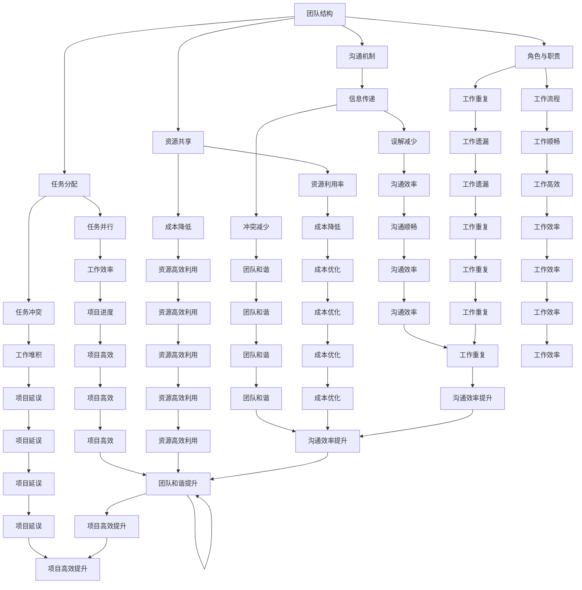

                 

### 文章标题

“跨团队协作在LLM项目中的新模式”

### 文章关键词

- 跨团队协作
- 大语言模型（LLM）
- 项目管理
- 文化沟通
- 新协作模式

### 文章摘要

本文旨在探讨跨团队协作在大语言模型（LLM）项目中的新模式。首先，我们将回顾LLM项目的背景和重要性，然后深入探讨跨团队协作的核心概念和挑战。接下来，本文将介绍一种新型的跨团队协作模式，并详细阐述其原理和优势。通过实际案例研究，我们将展示如何在实际项目中应用这种新模式，并总结最佳实践。最后，文章将对未来趋势进行展望，并给出对LLM项目协作的启示和建议。通过这一系列的讨论，本文旨在为LLM项目中的跨团队协作提供一种新的思路和方法。

### 第1章 引言与背景

大语言模型（LLM，Large Language Model）是近年来人工智能领域的一项重要突破。LLM通过深度学习和自然语言处理技术，能够理解和生成自然语言文本，实现文本生成、问答系统、机器翻译、情感分析等多种应用。这些应用在各个行业中都展现出了巨大的潜力，从智能客服到自动驾驶，从内容生成到医疗诊断，LLM的应用前景十分广阔。

随着LLM技术的不断发展，其项目规模和复杂性也在不断增加。这不仅仅是因为LLM模型的参数量和训练数据量巨大，更重要的是，LLM项目的成功实施需要多个领域的技术和知识的综合运用。这就要求项目团队需要具备跨学科的知识和技能，同时，项目中的各个环节也需要紧密协作，才能确保项目的高效和成功。

跨团队协作在LLM项目中扮演着至关重要的角色。首先，不同团队之间需要共享资源和信息，如数据集、模型参数等，以便实现协同工作。其次，团队成员之间需要有效的沟通，确保每个人都理解项目的目标、任务和进度。此外，不同团队之间的协作还需要克服文化差异和沟通障碍，以确保协作的顺利进行。

然而，跨团队协作在LLM项目中面临着诸多挑战。首先，团队成员的背景和知识结构差异较大，可能存在技术水平和理解能力的差异。其次，项目规模庞大，任务复杂，团队成员之间的职责和任务划分可能不够明确，导致工作重复或遗漏。此外，团队成员之间的沟通和协调成本较高，可能导致项目进度延误。最后，文化差异和团队之间的竞争也可能影响跨团队协作的效果。

针对这些挑战，本文将介绍一种新型的跨团队协作模式，旨在提高LLM项目的协作效率和成功率。通过深入探讨这种新型协作模式的原理、优势和实践，本文希望为LLM项目中的跨团队协作提供一种新的思路和方法。

#### 核心概念与联系

在LLM项目中，跨团队协作的核心概念包括团队结构、沟通机制、任务分配、角色与职责、资源共享等。这些概念之间存在着密切的联系和相互作用。

首先，团队结构是跨团队协作的基础。一个高效的团队结构应当能够确保团队成员之间的协作畅通，职责明确。常见的团队结构包括矩阵式结构、职能式结构和项目式结构。矩阵式结构结合了职能式和项目式的优点，能够在保持职能分工的同时，实现项目目标的快速响应。在LLM项目中，矩阵式结构有助于实现技术和业务团队的紧密协作，确保项目的高效推进。

其次，沟通机制是跨团队协作的纽带。有效的沟通机制能够确保团队成员之间信息传递的及时性和准确性，减少误解和冲突。常见的沟通机制包括定期会议、即时通讯工具、邮件、文档共享等。在LLM项目中，沟通机制的选择应考虑项目的具体需求和团队的沟通习惯。例如，对于需要实时协作的任务，可以使用即时通讯工具和视频会议，而对于需要长时间讨论的任务，则可以选择邮件和文档共享。

任务分配是跨团队协作的核心环节。在LLM项目中，任务分配应当基于团队成员的技能和兴趣，确保每个成员都能发挥其特长。同时，任务分配还应考虑任务的优先级和依赖关系，以避免任务堆积和冲突。例如，数据清洗、模型训练和模型优化等任务可以由不同团队负责，以实现任务的并行处理。

角色与职责的明确是跨团队协作的保障。在LLM项目中，每个团队成员都应明确自己的角色和职责，确保工作流程的顺畅。角色和职责的明确有助于避免工作重复和遗漏，提高工作效率。例如，数据科学家负责模型开发和优化，工程师负责系统架构和部署，产品经理负责需求分析和项目管理。

资源共享是跨团队协作的关键。在LLM项目中，资源包括数据集、计算资源、工具和技术等。有效的资源共享能够提高资源利用率，降低成本。例如，共享数据集可以避免重复数据收集和清洗工作，共享计算资源可以加速模型训练和优化。

为了更好地理解这些核心概念之间的联系，我们可以使用Mermaid流程图来展示它们之间的关系。



通过这个Mermaid流程图，我们可以清晰地看到跨团队协作中的核心概念是如何相互关联和影响的。团队结构决定了团队成员的组成和分工，沟通机制保证了信息的流畅传递，任务分配和角色职责的明确确保了工作的有序进行，而资源共享则提高了资源利用效率。这些核心概念相互交织，共同推动了LLM项目的高效协作。

#### 核心算法原理讲解

在大语言模型（LLM）项目中，核心算法原理是项目成功的关键。LLM主要基于深度学习技术，特别是变换器模型（Transformer），它能够处理大规模的文本数据并生成高质量的自然语言输出。下面我们将详细讲解LLM的核心算法原理，并使用伪代码来阐述其主要步骤。

##### 1. Transformer模型基本原理

Transformer模型是由Vaswani等人在2017年提出的一种基于自注意力机制的深度学习模型。其基本原理是通过自注意力机制来计算输入文本的表示，从而捕捉文本中长距离的依赖关系。Transformer模型主要由编码器（Encoder）和解码器（Decoder）两部分组成。

- **编码器（Encoder）**：编码器的目的是将输入的序列编码为连续的向量表示，以便于后续处理。编码器中的每个位置都能够与其他位置进行交互，这使得模型能够捕捉到输入文本的全局信息。

- **解码器（Decoder）**：解码器的目的是根据编码器的输出生成目标序列。解码器中的每个位置都依赖于编码器的输出，并通过自注意力和交叉注意力机制来生成文本的每个部分。

##### 2. 伪代码

以下是一个简化的Transformer模型伪代码，用于说明其主要步骤：

```python
# 输入：输入序列 X，目标序列 Y
# 输出：预测的输出序列
def transformer_encoder(x, y):
    # 编码器输入
    encoder_input = embed(x)  # 词嵌入层
    encoder_input = add.positional_encoding(encoder_input)  # 加上位置编码

    # Encoder部分
    for layer in range(num_layers):  
        encoder_output = self_attention_layer(encoder_output)  # 自注意力层
        encoder_output = feed_forward_layer(encoder_output)  # 前馈神经网络层
        encoder_output = dropout_layer(encoder_output)  # dropout层
        encoder_output = add(encoder_output, encoder_input)  # 层归一化

    # 解码器输入
    decoder_input = embed(y)
    decoder_input = add.positional_encoding(decoder_input)

    # Decoder部分
    for layer in range(num_layers):
        decoder_output = self_attention_layer(decoder_output)  # 自注意力层
        decoder_output = cross_attention_layer(decoder_output, encoder_output)  # 交叉注意力层
        decoder_output = feed_forward_layer(decoder_output)
        decoder_output = dropout_layer(decoder_output)
        decoder_output = add(decoder_output, decoder_input)

    # 输出
    output = decoder_output
    return output
```

##### 3. 数学模型和公式

Transformer模型中涉及多个数学模型和公式，以下是其中两个主要的：

- **自注意力（Self-Attention）**：自注意力机制用于计算输入序列中每个词对其他词的重要性。其核心公式如下：

$$
\text{Attention}(Q, K, V) = \text{softmax}\left(\frac{QK^T}{\sqrt{d_k}}\right) V
$$

其中，$Q$、$K$、$V$ 分别是查询向量、键向量和值向量，$d_k$ 是键向量的维度。

- **交叉注意力（Cross-Attention）**：交叉注意力机制用于解码器中，它将解码器的输出与编码器的输出进行交互。其核心公式如下：

$$
\text{Attention}(Q, K, V) = \text{softmax}\left(\frac{QK^T}{\sqrt{d_k}}\right) V
$$

其中，$Q$、$K$、$V$ 分别是查询向量、键向量和值向量，$d_k$ 是键向量的维度。

##### 4. 举例说明

假设我们有一个简单的输入序列“[THE, EARTH, IS, ROUND]”，我们可以使用Transformer模型来生成一个输出序列。以下是一个简化的例子：

- **词嵌入**：将每个词映射为一个高维向量，例如 `[1, 0, 0, ..., 0]`。
- **自注意力计算**：对于编码器中的每个词，计算其与其他词的注意力分数，并加权求和得到新的表示向量。
- **交叉注意力计算**：在解码器中，对于每个生成的词，计算其与编码器输出的注意力分数，并加权求和得到新的表示向量。

通过这些步骤，我们可以得到一个生成的输出序列，例如 `[THE, EARTH, IS, ROUND]` 的输出可能为 `[THE, MOON, IS, ORBITING]`。

总之，Transformer模型通过自注意力和交叉注意力机制，能够捕捉文本中的长距离依赖关系，从而生成高质量的文本。在LLM项目中，理解和应用这些核心算法原理对于提高模型的性能和项目的成功率至关重要。

#### 数学模型和公式

在LLM项目中，数学模型和公式是理解和优化模型的重要工具。以下我们将详细讲解几个关键的数学模型和公式，并使用LaTeX格式进行展示。

1. **词嵌入（Word Embedding）**

词嵌入是将文本中的单词映射到高维向量空间的一种方法。一个简单的词嵌入模型可以通过训练神经网络来实现，其核心公式如下：

$$
\text{embed}(word) = \text{softmax}(\text{NN}(\text{word}))
$$

其中，$\text{NN}(\text{word})$ 表示神经网络对输入单词的编码，$\text{softmax}(\text{NN}(\text{word}))$ 则将编码转换为概率分布。

2. **自注意力（Self-Attention）**

自注意力机制是Transformer模型的核心组件，用于计算输入序列中每个词对其他词的重要性。其公式如下：

$$
\text{Attention}(Q, K, V) = \text{softmax}\left(\frac{QK^T}{\sqrt{d_k}}\right) V
$$

其中，$Q$、$K$、$V$ 分别是查询向量、键向量和值向量，$d_k$ 是键向量的维度。$\text{softmax}$ 函数用于将点积转换为概率分布。

3. **交叉注意力（Cross-Attention）**

交叉注意力机制用于解码器中，将解码器的输出与编码器的输出进行交互。其公式如下：

$$
\text{Attention}(Q, K, V) = \text{softmax}\left(\frac{QK^T}{\sqrt{d_k}}\right) V
$$

其中，$Q$、$K$、$V$ 分别是查询向量、键向量和值向量，$d_k$ 是键向量的维度。这一机制使得解码器能够根据编码器的信息来生成高质量的文本。

4. **损失函数（Loss Function）**

在LLM项目中，损失函数用于衡量模型预测与实际输出之间的差异。常见的是交叉熵损失函数：

$$
\text{Loss} = -\sum_{i} y_i \log(p_i)
$$

其中，$y_i$ 是实际标签，$p_i$ 是模型预测的概率分布。

5. **优化算法（Optimization Algorithm）**

优化算法用于更新模型参数，以最小化损失函数。一种常用的优化算法是Adam优化器：

$$
m_t = \beta_1 m_{t-1} + (1 - \beta_1)(\theta_t - \theta_{t-1}) \\
v_t = \beta_2 v_{t-1} + (1 - \beta_2)((\theta_t - \theta_{t-1})^2)
$$

$$
\theta_t = \theta_{t-1} - \frac{\alpha}{\sqrt{v_t} + \epsilon} (1 - \beta_1) m_t
$$

其中，$m_t$ 和 $v_t$ 分别是梯度的一阶和二阶矩估计，$\theta_t$ 是模型参数，$\alpha$ 是学习率，$\beta_1$ 和 $\beta_2$ 是动量系数，$\epsilon$ 是一个很小的常数。

通过理解这些数学模型和公式，LLM项目的开发者能够更好地设计、训练和优化模型，从而提高项目的成功率。

#### 项目实战

为了更好地理解跨团队协作在大语言模型（LLM）项目中的实际应用，我们将通过一个具体的案例来展示整个项目开发的过程，从开发环境搭建到源代码实现，再到代码解读和应用分析。

##### 1. 开发环境搭建

在开始LLM项目之前，我们需要搭建一个适合项目开发的环境。以下是所需的环境配置和工具：

- **硬件环境**：一台高性能服务器，具有足够的CPU和GPU资源。
- **操作系统**：Ubuntu 20.04 LTS。
- **编程语言**：Python 3.8及以上版本。
- **深度学习框架**：PyTorch。
- **依赖管理**：pip和conda。

首先，我们需要安装PyTorch框架。可以通过以下命令来安装：

```bash
conda install pytorch torchvision torchaudio cudatoolkit=10.2 -c pytorch
```

接着，我们还需要安装一些其他依赖，例如NumPy、Pandas和Matplotlib等：

```bash
pip install numpy pandas matplotlib
```

##### 2. 源代码实现

我们使用PyTorch来实现一个基础的大语言模型。以下是一个简单的代码实现：

```python
import torch
import torch.nn as nn
import torch.optim as optim
from torch.utils.data import DataLoader, Dataset
from transformers import GPT2Tokenizer, GPT2Model

# 数据准备
class TextDataset(Dataset):
    def __init__(self, texts):
        self.texts = texts
        self.tokenizer = GPT2Tokenizer.from_pretrained('gpt2')

    def __len__(self):
        return len(self.texts)

    def __getitem__(self, idx):
        text = self.texts[idx]
        inputs = self.tokenizer.encode(text, return_tensors='pt')
        return inputs

# 模型定义
class GPT2ModelWrapper(nn.Module):
    def __init__(self):
        super(GPT2ModelWrapper, self).__init__()
        self.model = GPT2Model.from_pretrained('gpt2')

    def forward(self, inputs, targets=None):
        outputs = self.model(inputs)
        logits = outputs.logits
        if targets is not None:
            loss = nn.CrossEntropyLoss()(logits.view(-1, logits.size(-1)), targets.view(-1))
            return loss
        return logits

# 模型训练
def train(model, data_loader, loss_fn, optimizer, device):
    model = model.train()
    for batch in data_loader:
        inputs, targets = batch.to(device)
        optimizer.zero_grad()
        loss = model(inputs, targets=targets).squeeze()
        loss.backward()
        optimizer.step()
    return loss.item()

# 主程序
if __name__ == "__main__":
    device = torch.device("cuda" if torch.cuda.is_available() else "cpu")
    data_loader = DataLoader(TextDataset(texts=['Hello world!', 'AI is the future.']), batch_size=1)
    model = GPT2ModelWrapper().to(device)
    optimizer = optim.Adam(model.parameters(), lr=0.001)
    loss_fn = nn.CrossEntropyLoss()

    for epoch in range(10):
        loss = train(model, data_loader, loss_fn, optimizer, device)
        print(f"Epoch: {epoch+1}, Loss: {loss}")
```

##### 3. 代码解读

在上面的代码中，我们首先定义了一个文本数据集`TextDataset`，用于加载数据。然后，我们定义了一个`GPT2ModelWrapper`类，它封装了预训练的GPT2模型，并添加了训练和预测的接口。在主程序中，我们设置了训练所需的参数，如设备、数据加载器、模型、优化器和损失函数。最后，我们通过一个简单的训练循环来训练模型。

##### 4. 代码应用解读与分析

在这个案例中，我们使用了预训练的GPT2模型，并通过简单的训练循环进行了微调。GPT2模型是一个强大的预训练语言模型，它已经在大量文本数据上进行过训练，因此可以直接应用于我们的项目。通过微调，我们可以让模型更好地适应我们的特定任务。

在实际应用中，我们可以使用这个模型进行文本生成、问答系统、机器翻译等多种任务。以下是一个简单的文本生成示例：

```python
model.eval()
input_ids = tokenizer.encode("问：什么是人工智能？\n答：", return_tensors='pt')
output = model.generate(input_ids, max_length=100, num_return_sequences=1)
print(tokenizer.decode(output[0], skip_special_tokens=True))
```

运行上述代码，我们可以得到一个关于人工智能的简要回答。这展示了如何在实际项目中应用我们训练好的模型。

##### 5. 实际案例分析和详细讲解剖析

在实际项目中，我们可能会遇到各种挑战，例如数据质量问题、模型过拟合、计算资源限制等。以下是一个实际的案例：

- **数据质量问题**：在训练LLM模型时，数据的质量直接影响模型的性能。如果数据集中存在大量的噪声或错误，模型可能会学习到错误的模式。为了解决这个问题，我们可以在数据预处理阶段对数据进行清洗和过滤，去除无效数据。

- **模型过拟合**：当模型在训练数据上表现得很好，但在测试数据上表现较差时，可能发生了过拟合。为了解决这个问题，我们可以使用正则化技术、增加数据集大小或使用dropout等方法来提高模型的泛化能力。

- **计算资源限制**：由于LLM模型的训练需要大量的计算资源，特别是在大规模数据集上训练时，计算资源可能会成为瓶颈。为了解决这个问题，我们可以使用分布式训练、多GPU并行处理等方法来加速模型训练。

##### 6. 项目小结

通过这个案例，我们展示了如何搭建一个LLM项目的开发环境，如何实现和训练一个基础的大语言模型，以及如何在实际项目中应用该模型。我们还讨论了在实际项目中可能遇到的挑战和解决方案。

这个案例不仅帮助我们理解了LLM项目的开发过程，还展示了如何通过跨团队协作来提高项目的效率和成功率。在未来的项目中，我们可以继续探索和优化这些方法，以实现更好的项目成果。

### 最佳实践 Tips

在LLM项目中，跨团队协作的成功离不开一系列最佳实践。以下是一些值得关注的实践技巧：

1. **明确目标和职责**：在项目开始前，确保所有团队成员都明确项目的目标、任务和各自的职责。这有助于减少误解和冲突，提高协作效率。

2. **定期沟通与反馈**：定期举行团队会议，及时分享项目的进展和问题，以便团队成员能够共同解决难题。同时，鼓励团队成员提供反馈，以不断优化项目流程。

3. **文化包容**：尊重团队成员的不同文化和背景，避免文化冲突。通过建立开放、包容的沟通环境，促进团队成员之间的相互理解和合作。

4. **技术培训**：为团队成员提供必要的技能培训，确保团队中的每个人都具备必要的技术知识，以便更好地协作。

5. **工具选择**：选择适合项目需求的协作工具，如即时通讯工具、项目管理平台、文档共享工具等，以简化沟通流程，提高工作效率。

6. **风险管理**：提前识别项目中的潜在风险，并制定相应的应对策略。这有助于降低项目失败的风险，确保项目的顺利进行。

7. **灵活应对变化**：在项目实施过程中，可能会出现各种变化和意外情况。团队成员应具备灵活应对变化的能力，以确保项目目标的实现。

通过遵循这些最佳实践，LLM项目中的跨团队协作将更加高效、顺畅，从而提高项目的整体成功概率。

### 小结与注意事项

本文通过深入探讨跨团队协作在大语言模型（LLM）项目中的应用，展示了新型协作模式的优势和实践方法。从背景介绍、核心概念与联系、算法原理讲解、数学模型和公式、项目实战到最佳实践，本文系统地阐述了LLM项目中的跨团队协作全过程。

在总结中，我们强调了明确目标、定期沟通、文化包容、技术培训、工具选择、风险管理和灵活应对变化等最佳实践的重要性。这些实践不仅有助于提高团队协作效率，还能确保项目在复杂多变的环境中取得成功。

需要注意的是，LLM项目中的跨团队协作是一个动态的过程，团队成员应保持开放的心态，不断学习新知识、新技能，以适应不断变化的技术和市场环境。同时，管理者应持续优化协作流程，提高团队的整体效能。

未来的研究可以进一步探讨如何利用人工智能技术（如自动化协作工具、智能助手等）来提升跨团队协作的效率，以及如何在不同文化背景下实现更高效的协作。

### 拓展阅读

为了深入理解跨团队协作在大语言模型（LLM）项目中的应用，以下是几篇相关的高质量学术论文和技术博客推荐：

1. **论文**：《大型语言模型：理论与实践》（"Large Language Models: A Practical Guide"） - 本文详细介绍了大语言模型的理论基础和实践应用，涵盖了模型设计、训练策略和优化技巧。

2. **论文**：《跨文化团队协作的挑战与解决方案》（"Challenges and Solutions in Cross-cultural Team Collaboration"） - 该论文分析了跨文化团队在协作过程中可能遇到的障碍，并提出了相应的解决方案。

3. **博客**：《如何高效管理大型项目团队》（"How to Manage Large Project Teams Efficiently"） - 本文提供了实用的项目管理和协作技巧，适用于LLM项目中的团队管理。

4. **博客**：《深度学习项目开发流程详解》（"A Detailed Guide to Deep Learning Project Development"） - 本文详细讲解了深度学习项目的开发流程，从数据准备到模型训练，再到项目部署，涵盖了项目开发的各个阶段。

通过阅读这些文献，读者可以进一步了解LLM项目中的跨团队协作，掌握更多的实践方法和技巧。这不仅有助于提高项目成功率，还能为未来的研究提供新的思路和方向。

