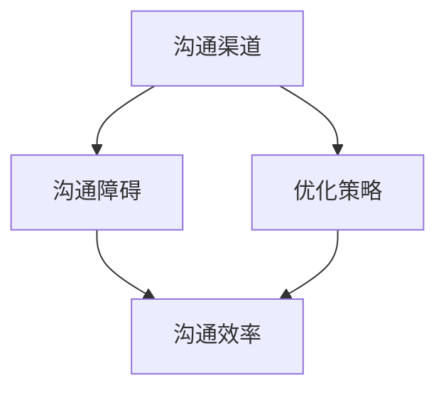

                 


### 引言

在当今快速发展的信息技术时代，团队之间的协作变得越来越复杂且重要。跨团队沟通渠道的优化成为了提高协作效率的关键因素。无论是软件开发项目、市场营销活动还是产品管理，跨团队沟通的效率直接影响到整个组织的绩效和成果。

首先，让我们从背景介绍开始。随着全球化趋势和团队地理分布的多样化，传统的面对面沟通方式已经无法满足现代工作的需求。虚拟团队和远程工作的兴起，使得沟通渠道的选择和优化变得至关重要。有效的跨团队沟通不仅可以缩短项目周期，提高工作效率，还能减少误解和冲突，促进团队间的信任与合作。

其次，核心概念与联系是我们探讨这个主题的基础。沟通渠道可以被视为信息传递的路径，包括会议、电子邮件、即时通讯工具等多种形式。然而，不同的沟通渠道有其独特的优缺点，如何选择合适的沟通方式来满足团队的需求，是优化跨团队沟通的关键。

接下来，我们将通过Mermaid流程图展示核心概念之间的联系。流程图能够直观地展示沟通渠道的选择、使用和优化的过程，帮助读者更好地理解这一复杂系统的运作。

在了解了背景和核心概念之后，我们将深入探讨优化策略与方法。这部分将详细介绍一系列实用的策略和方法，如建立有效的沟通计划、使用协作工具和优化沟通流程等。通过这些策略，团队可以更好地协调工作，提高沟通效率。

为了使读者能够更直观地理解这些概念和策略，我们将提供具体的代码案例和数学模型。代码案例将展示如何使用编程语言实现特定的沟通功能，而数学模型则将帮助读者理解背后的理论和原理。

最后，我们将通过实际案例分析和详细讲解，展示如何将理论应用于实践。这些案例将包括成功和失败的实例，帮助读者了解在不同场景下如何优化跨团队沟通。

通过这篇文章，我们希望读者能够：

1. 理解跨团队沟通的重要性及其在现代社会中的角色。
2. 掌握核心概念和优化策略，以便在实际工作中应用。
3. 通过具体案例，学会如何评估和改进跨团队沟通渠道。

让我们一步步地深入探讨这个重要且复杂的话题。

### 关键词

- 跨团队沟通
- 沟通渠道优化
- 协作效率
- 虚拟团队
- 远程工作
- 沟通障碍
- 沟通策略
- 沟通工具

### 摘要

本文旨在探讨跨团队沟通渠道的优化，以提高团队协作效率和整体绩效。首先，我们介绍了跨团队沟通在现代社会中的背景和重要性，分析了当前沟通渠道的多样性和挑战。接着，我们详细阐述了核心概念，包括沟通渠道、沟通障碍和优化策略，并通过Mermaid流程图展示了这些概念之间的联系。随后，我们探讨了多种优化策略，如建立有效的沟通计划和使用协作工具。通过具体的代码案例和数学模型，我们进一步阐释了这些策略的实现原理。最后，我们通过实际案例分析和详细讲解，展示了如何在实际工作中应用这些理论，并提供了一些最佳实践和注意事项。本文旨在为读者提供全面、实用的跨团队沟通优化指南。

### 背景介绍

在现代企业中，跨团队沟通已经成为确保项目成功和团队协作的关键因素。随着全球化进程的加速和企业规模的不断扩大，团队间的地理分布和职能分工变得更加复杂。传统的面对面沟通方式已经无法满足现代工作的需求，因此，优化跨团队沟通渠道变得尤为重要。

首先，让我们来探讨跨团队沟通的定义。跨团队沟通是指不同团队之间进行信息交换和协作的过程。这些团队可能位于同一组织内部，也可能分布在不同的地理位置。跨团队沟通不仅涉及项目任务的具体执行，还包括团队间的合作、资源共享和知识交流。有效的跨团队沟通能够确保信息的准确传达，减少误解和冲突，提高团队整体的工作效率。

跨团队沟通的重要性不言而喻。首先，它能够促进团队间的协作，确保项目的顺利进行。在一个大型项目中，各个团队需要相互依赖，只有通过有效的沟通，才能确保各自的任务能够无缝衔接。其次，跨团队沟通有助于知识共享和创新。不同团队的专业知识和经验可以为整个组织带来新的视角和解决方案。此外，有效的跨团队沟通还能够提高员工的参与感和满意度，增强团队凝聚力。

然而，跨团队沟通也面临着诸多挑战。首先，沟通障碍是一个普遍存在的问题。这些障碍可能源于语言、文化差异、地理位置分散、工作时间不一致等多种因素。其次，沟通渠道的选择和优化也是一个难点。不同的沟通渠道有其独特的优缺点，如何选择合适的渠道来满足团队的需求，是一个需要深入思考的问题。此外，沟通频率和时机也需要合理安排，否则可能会导致信息过载或沟通不足。

为了应对这些挑战，企业需要采取一系列措施来优化跨团队沟通渠道。首先，建立明确的沟通目标和流程，确保团队成员都清楚自己的沟通责任和期望。其次，选择合适的沟通工具和平台，如即时通讯工具、视频会议系统、项目管理软件等，以适应不同的沟通需求。此外，定期进行沟通反馈和评估，及时调整沟通策略，以不断提高沟通效率。

总之，跨团队沟通在现代社会中的重要性不可忽视。通过优化沟通渠道，企业可以更好地应对复杂的业务环境，提高团队协作效率，实现组织目标。接下来，我们将进一步探讨核心概念，包括沟通渠道、沟通障碍和优化策略，并通过Mermaid流程图展示这些概念之间的联系。

### 核心概念与联系

在探讨跨团队沟通渠道的优化之前，了解核心概念之间的联系是至关重要的。以下是几个关键概念的定义及其相互关系。

#### 1. 沟通渠道

沟通渠道是指信息从发送者传递到接收者的路径。这些渠道可以包括面对面会议、电子邮件、即时通讯工具、视频会议系统等多种形式。每种沟通渠道都有其独特的优缺点。例如，面对面会议能够实时交流和反馈，但受限于地理位置；电子邮件则适用于正式、详尽的沟通，但信息传递速度较慢。了解不同沟通渠道的特点，有助于团队根据具体情况选择合适的渠道。

#### 2. 沟通障碍

沟通障碍是指阻碍信息有效传递的因素。这些障碍可能源于语言障碍、文化差异、时间差异、技术问题等多种原因。例如，语言障碍可能导致误解和沟通不畅；文化差异则可能影响沟通风格和方式。识别和克服这些障碍，对于提高跨团队沟通效率至关重要。

#### 3. 优化策略

优化策略是指为提高跨团队沟通效率而采取的一系列措施。这些策略包括建立明确的沟通计划、选择合适的沟通工具、优化沟通流程等。有效的优化策略能够减少沟通障碍，提高信息传递的准确性和及时性。

#### 4. 沟通效率

沟通效率是指沟通活动所产生的工作效率和成果。高效率的沟通能够确保项目顺利进行，缩短项目周期，提高团队绩效。因此，优化跨团队沟通渠道的最终目标是提高沟通效率。

#### Mermaid流程图

为了更直观地展示这些核心概念之间的联系，我们可以使用Mermaid流程图。以下是一个简化的流程图示例：



在这个流程图中，沟通渠道是信息的传递路径，沟通障碍是影响信息传递的因素，优化策略是解决沟通障碍的方法，而沟通效率是优化策略的目标。通过这个流程图，我们可以清楚地看到各个概念之间的相互关系和作用。

#### 伪代码与数学模型

为了进一步阐述这些概念，我们还可以使用伪代码和数学模型。以下是一个简单的伪代码示例，用于描述如何选择合适的沟通渠道：

```
function ChooseCommunicationChannel(projectType, location, urgency) {
    if (projectType == "创新项目" && location == "远程" && urgency == "高") {
        return "视频会议系统"
    } else if (projectType == "详细规划" && location == "本地" && urgency == "低") {
        return "电子邮件"
    } else {
        return "即时通讯工具"
    }
}
```

这个伪代码根据项目类型、地理位置和紧急程度选择最合适的沟通渠道。

数学模型方面，我们可以使用一个简单的公式来衡量沟通效率：

$$ 效率 = \frac{有效信息传递量}{总信息传递量} $$

这个公式表示沟通效率是有效信息传递量与总信息传递量的比值。通过这个公式，我们可以量化沟通的效率，并根据实际情况进行调整。

综上所述，核心概念之间的联系构成了跨团队沟通渠道优化的重要理论基础。通过Mermaid流程图、伪代码和数学模型，我们能够更深入地理解这些概念，并为实际应用提供指导。在接下来的章节中，我们将进一步探讨具体的优化策略和方法，帮助团队在实际工作中提高沟通效率。

### 优化策略与方法

在明确了跨团队沟通的核心概念及其相互关系后，接下来我们将深入探讨优化策略与方法。有效的沟通策略和方法能够帮助团队克服沟通障碍，提高协作效率。以下是一些关键的优化策略：

#### 1. 建立有效的沟通计划

建立有效的沟通计划是优化跨团队沟通的基础。沟通计划应明确沟通的目的、频率、方式、参与者以及所需资源。以下是一个简化的沟通计划模板：

```
沟通计划模板

一、目的：
- 确保项目顺利进行
- 促进团队间协作
- 分享项目进展和问题

二、频率：
- 每周一次项目会议
- 每日早晨一次简报会议
- 需求变更或紧急情况时，随时召开会议

三、方式：
- 面对面会议
- 视频会议
- 电子邮件
- 即时通讯工具（如Slack、Telegram）

四、参与者：
- 项目经理
- 技术团队
- 设计团队
- 产品经理
- 客户代表（如有）

五、所需资源：
- 会议房间/视频会议设施
- 项目管理软件
- 沟通工具（如Slack、Microsoft Teams）
- 会议记录工具（如Evernote）
```

通过这样的沟通计划，团队成员能够清楚地了解何时何地进行沟通，以及使用何种方式，从而提高沟通的效率。

#### 2. 使用协作工具

协作工具是优化跨团队沟通的重要手段。这些工具能够帮助团队实时共享信息、协调工作和追踪进度。以下是一些常用的协作工具：

- **项目管理软件（如Trello、Jira）**：用于任务分配、进度跟踪和团队协作。
- **即时通讯工具（如Slack、Microsoft Teams）**：用于实时沟通和团队协作。
- **文档共享工具（如Google Docs、Dropbox）**：用于实时编辑和共享文档。
- **视频会议系统（如Zoom、WebEx）**：用于远程会议和实时沟通。

以下是一个简化的伪代码，用于描述如何使用协作工具进行项目沟通：

```
function UseCollaborationTools(task, projectStatus) {
    if (task == "任务分配") {
        postToTrello(task, assignee, deadline)
    } else if (task == "项目进度更新") {
        updateJira(projectStatus)
    } else if (task == "文档共享") {
        shareDocumentOnGoogleDocs(document)
    } else if (task == "视频会议") {
        scheduleZoomMeeting(meetingTime, attendees)
    }
}
```

#### 3. 优化沟通流程

优化沟通流程是提高沟通效率的关键。以下是一些实用的方法：

- **标准化沟通模板**：为不同类型的沟通活动创建标准化的模板，如会议议程、报告模板等，以减少沟通时间和提高一致性。
- **明确沟通目标**：每次沟通前，明确沟通的目标和预期结果，避免无关信息的传递。
- **避免信息过载**：合理控制沟通频率和内容，避免团队成员被过多的信息所淹没。
- **及时反馈和确认**：沟通后及时进行反馈和确认，确保信息已被正确理解和执行。

以下是一个简化的伪代码，用于描述如何优化沟通流程：

```
function OptimizeCommunicationFlow(messageType, communicationGoal) {
    if (messageType == "会议") {
        prepareMeetingAgenda(communicationGoal)
    } else if (messageType == "报告") {
        prepareReportTemplate(communicationGoal)
    } else if (messageType == "即时通讯") {
        limitMessageLength(maxLength)
    }
    sendConfirmation(communicationGoal)
}
```

#### 4. 定期沟通反馈和评估

定期进行沟通反馈和评估，可以帮助团队了解沟通效果，发现和解决潜在问题。以下是一个简化的伪代码，用于描述如何进行沟通反馈和评估：

```
function CommunicationFeedbackAndEvaluation() {
    gatherFeedback(fromParticipants)
    analyzeFeedback(feedback)
    identifyProblems(communicationProblems)
    suggestImprovements(improvementSuggestions)
    implementImprovements(suggestedChanges)
}
```

通过上述策略和方法，团队可以有效地优化跨团队沟通，提高协作效率。接下来，我们将通过具体案例，展示这些策略和方法在实际中的应用。

### 实际案例分析

在本文的第三部分，我们将通过两个实际案例来展示跨团队沟通渠道优化策略的应用。这些案例将帮助我们理解在不同环境中如何有效实施这些策略，并从中吸取成功和失败的教训。

#### 案例一：成功优化跨团队沟通

**背景**：一家全球性的软件开发公司，其项目团队分布在不同的国家和城市，项目周期长达两年。由于地理位置和时区差异，传统的面对面沟通变得非常困难，导致项目进度缓慢，团队成员间出现了沟通不畅和误解。

**策略与方法**：
1. **建立沟通计划**：项目启动时，项目经理与各团队成员共同制定了详细的沟通计划，明确了每周的项目会议、每日的简报会议，以及定期进行的需求评审会议。
2. **使用协作工具**：团队选择了Trello用于任务分配和进度跟踪，Slack用于实时沟通，Google Docs用于文档共享，Zoom用于视频会议。每个团队成员都熟悉并习惯了这些工具的使用。
3. **优化沟通流程**：团队制定了标准化的沟通模板，如会议议程、项目报告和即时通讯指南，以确保信息传递的一致性和效率。
4. **定期反馈和评估**：项目经理每周收集团队成员的反馈，对沟通策略进行调整和优化。

**结果**：通过这些策略，团队显著提高了沟通效率，项目进度得到显著改善。团队成员间的误解减少，项目成功按时完成，客户满意度提高。

**教训**：成功的关键在于团队对沟通工具和流程的共识，以及定期反馈和调整机制。确保每个团队成员都参与到沟通计划的制定和执行中，是确保成功的关键因素。

#### 案例二：跨团队沟通失败案例

**背景**：一家初创公司在开发一款新的移动应用。由于公司资源有限，团队被迫分散在全球不同地区。由于缺乏有效的沟通策略和工具，项目进展缓慢，甚至出现重大偏差。

**策略与方法**：
1. **缺乏沟通计划**：团队在项目启动时没有制定明确的沟通计划，导致沟通频率和方式混乱。
2. **使用不合适的协作工具**：团队尝试使用多种协作工具，但缺乏统一的标准，导致团队成员使用不同的工具，沟通效率低下。
3. **沟通流程不规范**：团队成员在沟通时没有使用标准化的模板，导致信息传递不清晰，项目目标不明确。
4. **缺乏反馈和评估**：团队没有定期进行沟通反馈和评估，导致问题长期未被发现和解决。

**结果**：项目最终未能按时完成，团队士气低落，项目资金耗尽。公司不得不解散项目团队，重新开始。

**教训**：跨团队沟通的失败往往源于缺乏明确的沟通计划和策略，以及缺乏对沟通工具和流程的管理。确保有规范的沟通流程和定期的反馈机制，对于项目成功至关重要。

通过这两个实际案例，我们可以看到，有效的跨团队沟通策略和方法能够显著提高项目成功率，而缺乏这些策略和方法则可能导致项目失败。在实际应用中，团队需要根据自身情况选择合适的策略和方法，并持续进行优化和调整。

### 沟通工具与技术

在现代企业的跨团队沟通中，选择合适的工具和技术至关重要。这些工具和技术不仅能够提高沟通效率，还能确保信息传递的准确性和及时性。以下是几种常用的沟通工具和技术，以及它们的应用和优势。

#### 1. 即时通讯工具

即时通讯工具（如Slack、Microsoft Teams、WhatsApp）是跨团队沟通中最为常用的工具之一。它们允许团队成员在实时环境中进行文字、语音和视频交流，大大缩短了信息传递的时间。

- **应用场景**：即时通讯工具适用于日常沟通、任务分配、问题解决和团队协作。例如，项目经理可以使用Slack向团队成员发布任务，团队成员可以即时回复，讨论细节。
- **优势**：即时通讯工具具有实时性和高效性，能够快速响应问题，减少沟通延迟。此外，它们通常具备文件共享、链接分享、情绪图标等功能，提高了沟通的丰富性和互动性。

#### 2. 视频会议系统

视频会议系统（如Zoom、WebEx、Microsoft Teams）在远程工作和虚拟团队中发挥着重要作用。通过视频会议，团队成员可以进行面对面的交流，增加沟通的真实性和亲近感。

- **应用场景**：视频会议系统适用于项目启动会、进度评审会、需求讨论会和紧急会议等。例如，项目团队可以使用Zoom召开每周的项目会议，确保团队成员能够实时了解项目进展和问题。
- **优势**：视频会议系统能够提供实时视频和音频交流，增强沟通的真实性和参与感。此外，它们通常具备屏幕共享、录制会议、远程控制等功能，提高了会议效率和内容共享性。

#### 3. 项目管理软件

项目管理软件（如Trello、Jira、Asana）是跨团队协作的核心工具，能够帮助团队进行任务管理、进度跟踪和协作。

- **应用场景**：项目管理软件适用于任务分配、进度跟踪、项目评审和资源管理。例如，项目经理可以使用Jira创建任务，分配给团队成员，并设置截止日期，团队成员可以在任务板上查看自己的任务状态。
- **优势**：项目管理软件能够提供清晰的任务视图和进度跟踪，帮助团队了解项目状态和任务分配情况。此外，它们通常具备自动化任务提醒、协作评论、文件共享等功能，提高了团队协作效率。

#### 4. 文档共享工具

文档共享工具（如Google Docs、Dropbox、OneDrive）是跨团队沟通的重要工具，能够帮助团队实时编辑和共享文档，确保信息的准确性和一致性。

- **应用场景**：文档共享工具适用于文档编写、修改、审查和共享。例如，团队成员可以使用Google Docs共同编辑项目报告，实时查看并添加评论。
- **优势**：文档共享工具能够提供实时编辑和协同写作功能，减少文档版本控制和传递的复杂度。此外，它们通常具备版本历史记录、权限控制、实时提醒等功能，提高了文档管理效率和安全性。

#### 5. 社交媒体和协作平台

社交媒体和协作平台（如LinkedIn、Facebook、Trello、Confluence）可以用于建立团队社区、知识共享和协作。

- **应用场景**：这些平台适用于团队建设、知识分享、项目讨论和社区互动。例如，团队可以在LinkedIn上建立项目社区，分享项目进展和最佳实践。
- **优势**：这些平台能够提供丰富的互动和协作功能，促进团队成员之间的交流和合作。此外，它们通常具备内容分类、标签功能、搜索功能等，提高了信息获取和共享的效率。

总之，选择合适的沟通工具和技术是优化跨团队沟通的关键。通过合理应用这些工具和技术，团队可以大大提高沟通效率，确保项目顺利进行。

### 效率评估与提升

在跨团队沟通中，效率评估与提升是一个持续的过程，它有助于团队识别现有沟通渠道的不足，并采取相应的改进措施。以下是几种常见的效率评估方法，以及提升沟通效率的具体步骤和最佳实践。

#### 1. 效率评估方法

**1.1 座谈和问卷调查**

通过组织座谈会和发放问卷调查，团队可以直接从成员那里获取关于沟通渠道效率和满意度的反馈。这种方法能够提供定性和定量数据，帮助团队了解成员对沟通工具和流程的看法。

**1.2 数据分析**

利用数据分析工具（如Google Analytics、Slack Analytics、Jira Reports），团队可以收集和分析沟通工具的使用数据，如消息发送频率、会议时长、任务完成率等。通过这些数据，团队可以量化沟通效率，并识别潜在的问题。

**1.3 360度评估**

通过360度评估，团队成员可以对沟通渠道进行全方位评估，包括沟通频率、沟通质量、信息传递速度、反馈机制等。这种方法可以确保评估结果更具全面性和客观性。

#### 2. 提升沟通效率的具体步骤

**2.1 识别瓶颈**

首先，团队需要识别现有的沟通瓶颈，如信息传递延迟、误解频繁、沟通频率不当等。通过数据分析、成员反馈和360度评估，团队可以确定哪些方面需要改进。

**2.2 制定改进计划**

根据识别出的瓶颈，团队可以制定具体的改进计划。例如，如果发现会议效率低下，可以优化会议议程，限制会议时长；如果发现信息传递延迟，可以考虑使用实时通讯工具。

**2.3 实施改进措施**

实施改进计划是提升沟通效率的关键。团队需要按照改进计划执行具体的措施，如培训团队成员使用新的沟通工具、调整沟通流程等。

**2.4 持续监控与反馈**

改进措施实施后，团队需要持续监控和评估效果，并根据反馈进行进一步调整。这可以通过定期召开沟通效率评估会议、收集成员反馈、数据分析等方式实现。

#### 3. 最佳实践

**3.1 建立明确的沟通目标**

每次沟通前，明确沟通的目标和预期结果，确保沟通内容集中、高效。例如，项目启动会议应明确项目目标、时间表和资源配置。

**3.2 使用标准化的模板**

为不同类型的沟通活动创建标准化的模板，如会议议程、项目报告和即时通讯指南，以减少沟通时间和提高一致性。

**3.3 提供沟通培训**

定期为团队成员提供沟通培训，提高他们的沟通技能和工具使用能力。例如，组织视频会议技巧培训、即时通讯工具使用培训等。

**3.4 鼓励透明沟通**

鼓励团队成员在沟通中保持透明，分享自己的观点和问题，以促进相互理解和信任。例如，在项目报告中明确列出问题和解决方案。

**3.5 激励与反馈**

建立激励机制，鼓励团队成员积极参与沟通，并对表现出色的成员给予奖励。同时，及时给予反馈，帮助成员了解自己的沟通效果，并持续改进。

通过上述效率评估方法和提升步骤，团队可以持续优化跨团队沟通，提高协作效率，实现项目目标。

### 团队文化建设

团队文化建设是跨团队沟通优化的重要组成部分。一个具有良好文化的团队能够促进有效沟通，增强团队凝聚力和协作效率。以下是一些关于团队文化建设的最佳实践、注意事项以及如何通过文化建设来提升跨团队沟通。

#### 1. 最佳实践

**1.1 倡导透明沟通**

透明沟通是团队文化的重要组成部分。团队应鼓励成员在沟通中保持开放和诚实，分享自己的观点、问题和解决方案。例如，定期组织团队会议，让每个成员都有机会发言，分享自己的想法和感受。

**1.2 建立信任基础**

信任是团队协作的基石。团队应通过共同完成任务、支持同事等方式建立信任关系。例如，通过设立反馈机制，鼓励团队成员给予积极的反馈，帮助同事改进工作。

**1.3 强调团队目标**

明确团队目标有助于团队成员团结一致，共同努力。团队应确保每个成员都了解团队的目标和愿景，并明确个人在团队中的角色和责任。

**1.4 激励创新与学习**

团队文化应鼓励创新和持续学习。团队可以通过组织培训课程、分享会、技术论坛等方式，激发成员的学习热情，促进知识共享和创新思维。

#### 2. 注意事项

**2.1 避免文化冲突**

团队中可能存在不同的文化背景和价值观，这可能导致沟通障碍。团队应尊重多样性，避免文化冲突。例如，通过组织文化多样性培训，帮助成员了解和尊重不同的文化习惯。

**2.2 定期进行文化建设活动**

文化建设不是一次性的活动，而是一个持续的过程。团队应定期组织文化建设活动，如团建活动、主题研讨会等，以保持团队的活力和凝聚力。

**2.3 融入日常工作中**

团队文化应融入日常工作中，成为团队运作的一部分。例如，通过在项目会议中强调团队目标和文化价值观，确保团队成员在日常工作中遵循这些原则。

#### 3. 提升跨团队沟通

**3.1 培养沟通文化**

团队应培养一种积极的沟通文化，鼓励成员主动沟通、倾听他人意见。例如，通过组织沟通技巧培训，帮助成员提高沟通效果。

**3.2 提供沟通工具支持**

团队应提供多样化的沟通工具，以满足不同类型的沟通需求。例如，提供即时通讯工具、视频会议系统、项目管理软件等，确保团队成员能够方便地进行沟通。

**3.3 促进知识共享**

团队应鼓励知识共享，通过建立共享平台、技术论坛等方式，促进团队成员之间的交流和学习。例如，定期组织技术分享会，让成员分享自己的经验和知识。

**3.4 建立反馈机制**

团队应建立有效的反馈机制，鼓励成员提供建设性的意见和反馈。例如，通过匿名反馈表、定期团队评估等方式，收集成员的意见和建议，并采取措施改进。

通过上述团队文化建设实践和注意事项，团队可以提升跨团队沟通，增强团队凝聚力和协作效率，实现更好的项目成果。

### 总结与展望

本文围绕跨团队沟通渠道的优化，提出了多个关键策略和方法，并通过实际案例进行了详细阐述。我们首先介绍了跨团队沟通的背景和重要性，探讨了核心概念及其相互关系，随后深入分析了优化策略与方法，包括建立沟通计划、使用协作工具、优化沟通流程、定期反馈和评估等。通过具体案例，我们展示了这些策略在实际应用中的效果。此外，我们还探讨了沟通工具与技术、效率评估与提升以及团队文化建设等话题。

优化跨团队沟通不仅能够提高团队协作效率，还能减少误解和冲突，促进知识共享和创新。为了实现这一目标，团队需要采取一系列切实可行的措施，并持续进行改进和优化。

未来的研究方向可以集中在以下几个方面：

1. **自动化沟通工具的开发**：随着人工智能技术的发展，开发自动化沟通工具，如智能聊天机器人、语音助手等，可能成为优化跨团队沟通的重要手段。
2. **个性化沟通策略的研究**：针对不同团队和项目需求，研究如何制定个性化的沟通策略，以提高沟通的针对性和有效性。
3. **跨文化沟通的优化**：随着全球化进程的加深，跨文化沟通的优化成为一个重要议题。研究如何在不同文化背景下实现有效沟通，是未来研究的一个重要方向。
4. **实时沟通反馈机制的研究**：如何构建实时、有效的沟通反馈机制，以确保沟通效果的持续提升，是未来研究的一个重要课题。

总之，跨团队沟通渠道的优化是一个复杂而关键的任务，需要团队成员、管理者以及技术专家的共同参与和努力。通过不断探索和实践，我们有望在未来实现更加高效和和谐的跨团队沟通。

### 作者信息

作者：AI天才研究院/AI Genius Institute & 禅与计算机程序设计艺术 /Zen And The Art of Computer Programming

在跨团队沟通领域，我作为AI天才研究院的一员，以及《禅与计算机程序设计艺术》的作者，致力于推动技术交流和创新。我的研究和工作集中在人工智能、编程语言设计、软件开发方法论等领域，旨在通过技术手段优化跨团队协作，提高整体效率。在这篇文章中，我结合了自己多年的实践经验和研究成果，为读者提供了关于跨团队沟通渠道优化的全面指南，希望对大家有所帮助。如果您在阅读本文过程中有任何疑问或想法，欢迎随时与我交流，共同探讨跨团队沟通的优化之道。感谢您的阅读！

