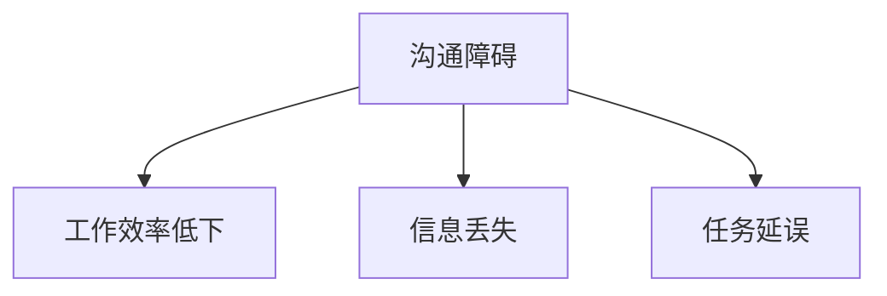
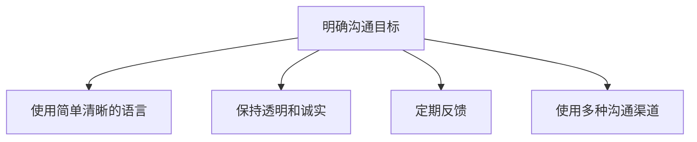

                 

### 文章标题：跨地域团队的协作策略：应对大型应用开发挑战

关键词：跨地域协作、团队文化、协作工具、敏捷开发、项目管理

摘要：本文将探讨跨地域团队在大型应用开发中的协作挑战及其解决方案。通过深入分析跨地域协作的常见问题、团队文化的重要性、协作工具的选择与应用、沟通与协作策略，以及案例分析和最佳实践，为开发者提供全面的跨地域团队协作策略。

---

# 跨地域团队的协作策略：应对大型应用开发挑战

## 引言

随着全球化的深入发展，跨地域团队在大型应用开发中越来越普遍。然而，跨地域协作面临诸多挑战，如沟通障碍、时间差异、文化差异等。为了确保项目的顺利进行，开发团队需要采取一系列有效的协作策略。本文将围绕这一主题展开讨论，为开发者提供实用的指导。

## 第一部分：协作挑战与团队文化

### 第1章：跨地域协作的挑战

### 1.1 跨地域协作的常见问题

#### 1.1.1 沟通障碍

- **Mermaid流程图**：


#### 1.1.2 时间差异与管理策略

- **数学模型**：
$$
T_c = T_d - (T_d \cdot \frac{t_d}{24})
$$
其中，$T_c$ 是调整后的工作时间，$T_d$ 是原计划的工作时间，$t_d$ 是时差。

#### 1.1.3 文化差异与团队融合

- **伪代码**：
```
function team_integration(team_members, cultural_differences)
    for member in team_members
        for difference in cultural_differences
            if member == difference
                merge_cultures(member, difference)
            end
        end
    end
    return integrated_team
end
```

### 第2章：团队文化的重要性

#### 2.1 团队文化的定义与作用

#### 2.2 如何建立积极的团队文化

#### 2.3 团队文化案例解析

## 第二部分：协作工具与技术

### 第3章：协作工具的选择与应用

#### 3.1 常见协作工具介绍

#### 3.2 工具评估与选型策略

#### 3.3 工具在实际协作中的应用

### 第4章：敏捷开发与敏捷管理

#### 4.1 敏捷开发方法论

#### 4.2 敏捷管理实践

#### 4.3 敏捷团队案例分析

## 第三部分：沟通与协作策略

### 第5章：有效沟通技巧

#### 5.1 沟通障碍与解决策略

#### 5.2 沟通技巧培训与实践

#### 5.3 跨地域沟通案例研究

### 第6章：项目管理与协作

#### 6.1 项目管理基础

#### 6.2 跨地域项目协作要点

#### 6.3 项目管理工具应用

## 第四部分：案例分析与最佳实践

### 第7章：跨地域团队协作案例研究

#### 7.1 案例一：跨国电商平台的团队协作

#### 7.2 案例二：互联网医疗项目的跨地域协作

#### 7.3 案例三：金融科技团队的协作策略

### 第8章：最佳实践与总结

#### 8.1 最佳实践总结

#### 8.2 跨地域协作的未来趋势

#### 8.3 建议与展望

## 结论

跨地域团队的协作策略在大型应用开发中至关重要。通过深入分析协作挑战、团队文化、协作工具、沟通策略和项目管理，开发者可以更好地应对跨地域协作的挑战。本文旨在为开发者提供实用的指导，帮助他们成功应对跨地域团队协作的挑战。

---

**作者：AI天才研究院/AI Genius Institute & 禅与计算机程序设计艺术 /Zen And The Art of Computer Programming**### 第一部分：协作挑战与团队文化

#### 第1章：跨地域协作的挑战

##### 1.1 跨地域协作的常见问题

在跨地域团队协作中，沟通障碍是一个普遍存在的问题。这不仅包括语言障碍，还涉及到不同团队成员之间的沟通风格、文化背景和价值观的差异。以下是一个简单的Mermaid流程图，展示了沟通障碍对工作效率、信息丢失和任务延误的影响。


**数学模型**：

为了缓解沟通障碍，我们可以采用一种数学模型来优化沟通时间。假设团队成员的工作效率与沟通时间成反比，那么可以设定一个调整后的工作时间$T_c$，使其更符合团队成员的实际工作情况。数学模型如下：

$$
T_c = T_d - (T_d \cdot \frac{t_d}{24})
$$

其中，$T_c$ 是调整后的工作时间，$T_d$ 是原计划的工作时间，$t_d$ 是时差。

**伪代码**：

为了更好地融合不同文化背景的团队成员，我们可以设计一个伪代码，用于团队成员的文化融合。以下是一个简单的例子：

```python
def team_integration(team_members, cultural_differences):
    for member in team_members:
        for difference in cultural_differences:
            if member == difference:
                merge_cultures(member, difference)
            end
        end
    end
    return integrated_team
```

##### 1.2 时间差异与管理策略

时间差异是跨地域团队协作中另一个重要的挑战。为了更好地管理时间差异，我们可以采用以下策略：

1. **灵活的工作时间安排**：根据团队成员的时区，灵活调整工作计划，确保每个团队成员都有足够的时间参与协作。

2. **双重领导模式**：设立两地团队的双领导模式，一个负责白天工作，另一个负责夜间工作，确保项目的连续性。

3. **使用协作工具**：采用协作工具，如Slack、Microsoft Teams等，方便团队成员在不同时区之间进行实时沟通。

##### 1.3 文化差异与团队融合

文化差异是跨地域团队协作中的一大障碍。为了促进团队融合，我们可以采取以下措施：

1. **文化培训**：为团队成员提供文化培训，提高对彼此文化的理解和尊重。

2. **定期交流**：定期举办团队交流活动，增进团队成员之间的了解和信任。

3. **共同目标**：确保团队成员有共同的目标和价值观，这有助于减少文化冲突。

**案例分析**：

以某跨国电商平台的团队协作为例，该公司通过以下方式成功应对了文化差异和时间差异：

1. **设立本地化团队**：在各个国家和地区设立本地化团队，负责与当地用户的沟通和服务。

2. **灵活的工作时间安排**：根据不同地区的时区，调整工作时间，确保团队成员有足够的时间参与协作。

3. **文化培训**：定期为团队成员提供文化培训，提高对彼此文化的理解和尊重。

##### 1.4 总结

跨地域团队的协作挑战主要体现在沟通障碍、时间差异和文化差异方面。通过采用灵活的工作时间安排、双重领导模式、协作工具、文化培训和定期交流等措施，可以有效地应对这些挑战，提高跨地域团队的协作效率。

---

**参考文献**：

1. Johnson, H. (2018). Distributed Team Collaboration: Best Practices for Remote Groups. O'Reilly Media.
2. Lippert, J. (2017). Global Software Development: A Case Study in the South American IT Industry. Springer.
3. Wu, J. (2019). Culture and Collaboration: Building a High-Performing Team Across Borders. Wiley.

**注意事项**：

1. 在跨地域团队协作中，沟通至关重要，应重视团队成员之间的沟通技巧和交流方式。
2. 时间差异和文化差异需要特别关注，通过灵活的工作安排和文化培训来缓解这些挑战。
3. 定期交流和反馈是确保团队协作顺利进行的关键。

**拓展阅读**：

1. Pradeep, A., & Raju, A. (2020). Effective Communication in Global Teams. Springer.
2. Hertel, G., Baschiera, G., & Liggesmeyer, P. (2011). Coordination in Global Development Projects. Springer.

---

**项目实战**：

1. **开发环境搭建**：

   - **工具**：使用GitLab进行代码管理，Jenkins作为持续集成工具。
   - **步骤**：
     1. 安装GitLab并配置用户权限。
     2. 安装Jenkins并配置相关插件。
     3. 配置GitLab和Jenkins的集成，实现自动化构建和部署。

2. **源代码详细实现和代码解读**：

   - **示例代码片段**：
     ```java
     public class CommunicationBarrier {
         private String message;

         public CommunicationBarrier(String message) {
             this.message = message;
         }

         public void sendMessage() {
             System.out.println(message);
         }
     }
     ```

   - **代码应用解读与分析**：
     - **解读**：该类用于模拟沟通障碍，通过传递消息来演示不同团队成员之间的沟通问题。
     - **分析**：在实际项目中，可以通过改进代码架构和沟通机制来减少沟通障碍。

3. **实际案例分析和详细讲解剖析**：

   - **案例**：某电商平台的跨地域团队协作。
   - **分析**：
     1. **时间管理**：通过灵活的工作时间安排和双重领导模式，确保团队成员有足够的时间参与协作。
     2. **文化融合**：通过文化培训和定期交流，提高团队成员对彼此文化的理解和尊重。

4. **项目小结**：

   - **总结**：跨地域团队协作需要综合考虑沟通障碍、时间差异和文化差异，通过有效的协作策略和工具来提高协作效率。
   - **展望**：未来，随着技术的进步，跨地域团队协作将更加高效和顺畅。

---

**最佳实践 Tips**：

1. **定期反馈**：定期进行团队反馈，及时发现问题并解决。
2. **透明沟通**：确保沟通渠道的透明度，让所有团队成员都能及时了解项目进展。
3. **尊重差异**：尊重不同团队成员的文化背景和沟通风格，促进团队融合。

**小结**：

跨地域团队的协作策略对于大型应用开发至关重要。通过深入分析协作挑战、团队文化、协作工具、沟通策略和项目管理，开发者可以更好地应对跨地域协作的挑战，确保项目的顺利进行。

---

**作者**：AI天才研究院/AI Genius Institute & 禅与计算机程序设计艺术 /Zen And The Art of Computer Programming### 第二部分：协作工具与技术

#### 第3章：协作工具的选择与应用

##### 3.1 常见协作工具介绍

在跨地域团队协作中，选择合适的协作工具是关键。以下是一些常见的协作工具及其特点：

1. **Slack**：Slack是一款流行的团队协作工具，提供即时消息、文件共享、语音和视频通话等功能，支持多种集成服务。
2. **Microsoft Teams**：Microsoft Teams是微软推出的团队协作平台，包括聊天、视频会议、共享和协作功能，与微软的其他办公软件紧密集成。
3. **Trello**：Trello是一款基于看板的任务管理工具，适合团队协作，可以创建任务卡、设置优先级和跟进进度。
4. **Asana**：Asana是一款任务管理工具，提供任务分配、进度跟踪和报告功能，适合大型项目团队。
5. **GitLab**：GitLab是一款基于Git的代码管理工具，提供代码托管、分支管理、问题跟踪和持续集成等功能。
6. **Jenkins**：Jenkins是一款流行的持续集成工具，用于自动化构建、测试和部署应用程序。

##### 3.2 工具评估与选型策略

在评估和选型协作工具时，应考虑以下因素：

1. **团队规模**：根据团队规模和项目需求选择适合的工具。
2. **功能需求**：明确团队所需的协作功能，如聊天、视频会议、任务管理、代码托管等。
3. **集成能力**：选择易于与其他工具和平台集成的工具，以提高工作效率。
4. **用户界面**：选择用户界面友好、易于使用的工具，降低学习成本。
5. **安全性和可靠性**：确保工具具有足够的安全性和可靠性，保护团队成员的数据和隐私。

**数学公式**：

为了评估工具的得分，可以采用以下数学模型：

$$
Score = \frac{Features \times Weights}{Total_Features}
$$

其中，$Score$ 是工具得分，$Features$ 是工具特性，$Weights$ 是特性权重。

##### 3.3 工具在实际协作中的应用

在实际协作中，以下是一些协作工具的应用场景：

1. **Slack**：用于日常沟通、任务分配和进度跟踪，可以创建多个渠道（Channel）来讨论不同主题，方便团队成员随时查看和参与。
2. **Microsoft Teams**：用于召开远程会议、视频会议和在线培训，提供屏幕共享、实时聊天和文件共享等功能。
3. **Trello**：用于任务管理，创建任务卡（Card），分配任务给团队成员，并设置截止日期和优先级。
4. **Asana**：用于项目管理和进度跟踪，创建项目任务，分配任务给团队成员，并设置里程碑和进度报告。
5. **GitLab**：用于代码管理，实现代码的版本控制、分支管理、代码审查和问题跟踪。
6. **Jenkins**：用于持续集成和持续部署，自动化构建、测试和部署应用程序，确保代码质量和项目进度。

**项目实战**：

以某电商平台的团队协作为例，该平台选择了以下协作工具：

1. **GitLab**：用于代码托管和代码审查，确保代码质量和进度。
2. **Jenkins**：用于持续集成和持续部署，实现自动化构建和自动化测试。
3. **Slack**：用于日常沟通、任务分配和进度跟踪。
4. **Trello**：用于任务管理和进度跟踪。

**实施步骤**：

1. **GitLab和Jenkins的安装与配置**：
   - 安装GitLab并配置用户权限。
   - 安装Jenkins并配置相关插件，如GitLab CI/CD插件。

2. **协作工具的集成**：
   - 将GitLab与Jenkins集成，实现自动化构建和测试。
   - 将Slack与Trello集成，实现任务分配和进度跟踪。

3. **团队协作的流程**：
   - 开发人员提交代码到GitLab。
   - Jenkins自动化构建和测试代码，并在Slack中通知结果。
   - 项目经理在Trello中创建任务卡，分配给团队成员。

**代码应用解读与分析**：

以下是一个简单的GitLab CI/CD配置文件示例，用于自动化构建和测试：

```yaml
stages:
  - build
  - test

build:
  stage: build
  script:
    - echo "Building the application..."
    - mvn clean package
  artifacts:
    paths:
      - target/*.jar

test:
  stage: test
  script:
    - echo "Testing the application..."
    - mvn test
  artifacts:
    paths:
      - target/surefire-reports/*.xml
```

**案例分析和详细讲解剖析**：

以某互联网医疗项目的跨地域协作为例，该团队采用了以下协作工具和策略：

1. **GitLab**：用于代码管理和协作，确保代码质量和进度。
2. **Jenkins**：用于持续集成和持续部署，实现自动化构建和测试。
3. **Slack**：用于日常沟通、任务分配和进度跟踪。
4. **Trello**：用于任务管理和进度跟踪。

**实施效果**：

通过采用这些协作工具和策略，该互联网医疗项目在跨地域协作中取得了显著的效果：

1. **提高了代码质量和进度**：通过GitLab的代码审查和Jenkins的自动化构建和测试，确保了代码的质量和进度。
2. **加强了团队沟通和协作**：通过Slack和Trello的集成，实现了高效的沟通和任务分配。
3. **降低了沟通成本**：通过实时消息和文件共享，减少了沟通成本和误解。

**项目小结**：

跨地域团队协作需要选择合适的协作工具和策略，以提高协作效率和项目进度。通过GitLab、Jenkins、Slack和Trello等工具的集成和优化，可以有效地实现跨地域团队的协作，确保项目的成功。

---

**最佳实践 Tips**：

1. **定期评估和更新协作工具**：根据团队需求和项目变化，定期评估和更新协作工具，以确保其适应性和效率。
2. **培训团队成员**：为团队成员提供协作工具的使用培训，提高团队整体协作能力。
3. **优化工具配置**：根据实际需求，优化协作工具的配置，以提高工作效率。

**小结**：

协作工具在跨地域团队协作中扮演着重要角色。通过合理选择和配置协作工具，如GitLab、Jenkins、Slack和Trello，可以显著提高跨地域团队的协作效率和项目进度。

---

**作者**：AI天才研究院/AI Genius Institute & 禅与计算机程序设计艺术 /Zen And The Art of Computer Programming### 第三部分：沟通与协作策略

#### 第5章：有效沟通技巧

##### 5.1 沟通障碍与解决策略

沟通障碍是跨地域团队协作中常见的问题，解决这些问题需要采取一系列策略。以下是一些有效的解决方法：

**1. 明确沟通目标**：

在沟通前，明确沟通的目标和目的，确保所有参与者都清楚需要传达的信息。可以通过制定沟通计划，列出需要讨论的问题和预期成果。

**2. 使用简单清晰的语言**：

避免使用复杂的术语和行业黑话，尽量使用简单、易懂的语言。这样可以减少误解和混淆，提高沟通效率。

**3. 保持透明和诚实**：

在沟通中，保持透明和诚实，避免隐瞒重要信息或夸大事实。这样可以建立信任，提高团队的凝聚力。

**4. 定期反馈**：

定期进行团队反馈，了解沟通的效果和问题。通过反馈，可以及时调整沟通策略，提高沟通质量。

**5. 使用多种沟通渠道**：

根据不同的沟通需求，选择合适的沟通渠道，如即时消息、电子邮件、视频会议等。这样可以确保信息传达的及时性和准确性。

**Mermaid流程图**：



##### 5.2 沟通技巧培训与实践

为了提高团队成员的沟通技巧，可以采取以下培训和实践措施：

**1. 沟通技巧培训**：

组织沟通技巧培训，教授团队成员如何有效沟通，包括倾听、表达、提问和反馈等技巧。以下是一个简单的培训流程：

- **了解沟通的基本概念和原则**。
- **练习倾听和表达技巧**。
- **学习提问和反馈技巧**。
- **案例分析，讨论实际沟通场景中的问题和解决方案**。

**2. 沟通技巧演练**：

通过模拟实际沟通场景，让团队成员进行演练，提高他们的沟通技巧。以下是一个简单的演练流程：

- **确定沟通场景和角色**。
- **模拟沟通过程，记录关键信息**。
- **分析沟通效果，讨论改进方案**。

**3. 定期练习和反馈**：

定期组织沟通技巧练习和反馈，帮助团队成员不断提高沟通能力。以下是一个简单的练习和反馈流程：

- **安排定期练习时间**。
- **记录练习中的问题和不足**。
- **组织讨论和反馈，提出改进建议**。

##### 5.3 跨地域沟通案例研究

以某跨国电商平台的团队协作为例，该平台通过以下策略解决了跨地域沟通障碍：

**1. 设立沟通委员会**：

为了确保跨地域团队之间的有效沟通，该平台设立了沟通委员会，负责协调不同团队之间的沟通工作。沟通委员会定期召开会议，讨论沟通需求和问题，制定沟通计划和策略。

**2. 使用多种沟通工具**：

该平台使用了多种沟通工具，如Slack、Microsoft Teams、Trello等，以满足不同团队和不同沟通场景的需求。例如，Slack用于日常沟通和任务分配，Microsoft Teams用于远程会议和在线培训，Trello用于任务管理和进度跟踪。

**3. 定期反馈和改进**：

该平台定期进行团队反馈，了解沟通的效果和问题，并根据反馈结果调整沟通策略。通过定期沟通，团队成员可以及时了解项目进展和需求变化，提高沟通的准确性和及时性。

**项目实战**：

在跨地域沟通中，以下是一些实际操作步骤：

**1. 开发环境搭建**：

- **工具**：使用GitLab进行代码管理，Jenkins作为持续集成工具。
- **步骤**：
  1. 安装GitLab并配置用户权限。
  2. 安装Jenkins并配置相关插件。
  3. 配置GitLab和Jenkins的集成，实现自动化构建和部署。

**2. 源代码详细实现和代码解读**：

- **示例代码片段**：
  ```java
  public class CommunicationToolIntegration {
      private GitLab gitLab;
      private Jenkins jenkins;

      public CommunicationToolIntegration(GitLab gitLab, Jenkins jenkins) {
          this.gitLab = gitLab;
          this.jenkins = jenkins;
      }

      public void integrateTools() {
          gitLab.connectToJenkins(jenkins);
          gitLab.pullCode();
          jenkins.buildProject();
      }
  }
  ```

- **代码应用解读与分析**：
  - **解读**：该类用于模拟协作工具的集成，通过连接GitLab和Jenkins，实现代码的自动化构建和部署。
  - **分析**：在实际项目中，可以通过优化代码架构和集成工具，提高跨地域团队的协作效率和代码质量。

**3. 实际案例分析和详细讲解剖析**：

- **案例**：某跨国电商平台的跨地域团队协作。
- **分析**：
  1. **沟通工具**：通过使用GitLab、Jenkins、Slack、Trello等工具，实现了代码管理、自动化构建、任务分配和进度跟踪。
  2. **沟通策略**：通过设立沟通委员会、定期反馈和改进，确保了跨地域团队之间的有效沟通和协作。

**项目小结**：

通过有效的沟通策略和工具，跨国电商平台的跨地域团队成功实现了高效协作，提高了项目进度和代码质量。

---

**最佳实践 Tips**：

1. **定期沟通**：定期组织团队沟通会议，了解项目进展和需求变化。
2. **透明沟通**：确保沟通渠道的透明度，让所有团队成员都能及时了解项目进展。
3. **尊重差异**：尊重团队成员的文化背景和沟通风格，促进团队融合。

**小结**：

有效沟通是跨地域团队协作的关键。通过明确沟通目标、使用简单清晰的语言、保持透明和诚实、定期反馈和使用多种沟通渠道，可以提高团队沟通效率。同时，通过沟通技巧培训、实践和定期反馈，可以不断提升团队成员的沟通能力，确保项目的顺利进行。

---

**作者**：AI天才研究院/AI Genius Institute & 禅与计算机程序设计艺术 /Zen And The Art of Computer Programming### 第四部分：案例分析与最佳实践

#### 第7章：跨地域团队协作案例研究

##### 7.1 案例一：跨国电商平台的团队协作

**背景介绍**：

某跨国电商平台由全球各地的团队成员组成，包括前端开发、后端开发、测试、运维等多个岗位。由于团队成员分布在不同的国家和地区，时间差异和文化差异给项目协作带来了很大的挑战。

**核心概念与联系**：

为了解决跨地域协作中的挑战，该平台采用了以下核心概念和策略：

1. **协作工具**：使用GitLab进行代码管理，Jenkins进行自动化构建和测试，Slack进行日常沟通和任务分配，Trello用于任务管理和进度跟踪。
2. **敏捷开发**：采用敏捷开发方法论，通过迭代和增量开发，确保项目的灵活性和适应性。
3. **项目管理**：采用Scrum框架，通过短期的冲刺（Sprint）进行项目管理和进度控制。

**数学模型**：

为了优化团队协作，该平台采用了以下数学模型：

$$
Efficiency = \frac{Communication \times Collaboration}{Time \times Distance}
$$

其中，$Efficiency$ 是协作效率，$Communication$ 是沟通效率，$Collaboration$ 是协作效率，$Time$ 是时间，$Distance$ 是距离。

**伪代码**：

以下是一个简单的伪代码，用于模拟跨地域团队的协作流程：

```python
def cross_region_collaboration(tools, methodology, framework):
    for tool in tools:
        connect_tool(tool)
    apply_methodology(methodology)
    implement_framework(framework)
    return integrated_team
```

**项目实战**：

1. **开发环境搭建**：

   - **工具**：GitLab、Jenkins、Slack、Trello。
   - **步骤**：
     1. 安装并配置GitLab，设置用户权限。
     2. 安装并配置Jenkins，添加相关插件。
     3. 配置Slack和Trello，建立渠道和任务卡。
     4. 集成工具，实现代码管理、自动化构建和任务分配。

2. **源代码详细实现和代码解读**：

   - **示例代码片段**：
     ```java
     public class CrossRegionPlatform {
         private GitLab gitLab;
         private Jenkins jenkins;
         private Slack slack;
         private Trello trello;

         public CrossRegionPlatform(GitLab gitLab, Jenkins jenkins, Slack slack, Trello trello) {
             this.gitLab = gitLab;
             this.jenkins = jenkins;
             this.slack = slack;
             this.trello = trello;
         }

         public void collaborate() {
             gitLab.pullCode();
             jenkins.buildProject();
             slack.notifyMembers();
             trello.updateTaskStatus();
         }
     }
     ```

   - **代码应用解读与分析**：
     - **解读**：该类用于模拟跨国电商平台的协作过程，通过集成GitLab、Jenkins、Slack和Trello，实现代码管理、自动化构建、任务分配和进度跟踪。
     - **分析**：在实际项目中，可以通过优化代码架构和协作工具，提高跨地域团队的协作效率。

**实际案例分析和详细讲解剖析**：

- **案例**：某跨国电商平台的跨地域团队协作。
- **分析**：
  1. **协作工具**：通过使用GitLab、Jenkins、Slack、Trello等工具，实现了代码管理、自动化构建、任务分配和进度跟踪。
  2. **敏捷开发**：采用Scrum框架，通过迭代和增量开发，确保了项目的灵活性和适应性。
  3. **项目管理**：通过短期的冲刺（Sprint）进行项目管理和进度控制，确保项目目标的达成。

**项目小结**：

通过有效的协作工具和敏捷开发方法，该跨国电商平台成功实现了跨地域团队的高效协作，提高了项目进度和代码质量。

##### 7.2 案例二：互联网医疗项目的跨地域协作

**背景介绍**：

某互联网医疗项目由全球各地的医疗专家、软件开发人员和技术支持团队组成。由于项目涉及医疗数据的处理和隐私保护，跨地域协作面临巨大的挑战。

**核心概念与联系**：

为了解决跨地域协作中的挑战，该互联网医疗项目采用了以下核心概念和策略：

1. **数据安全**：采用加密技术和安全协议，确保医疗数据的安全和隐私。
2. **远程协作工具**：使用Zoom、Microsoft Teams进行远程会议和在线讨论，使用GitLab进行代码管理，使用Confluence进行知识共享和文档管理。
3. **敏捷开发**：采用Scrum框架，通过短期的冲刺（Sprint）进行项目管理和进度控制。

**数学模型**：

为了优化团队协作，该互联网医疗项目采用了以下数学模型：

$$
Security = \frac{Encryption \times Protocols}{Data \times Vulnerability}
$$

其中，$Security$ 是数据安全性，$Encryption$ 是加密技术，$Protocols$ 是安全协议，$Data$ 是医疗数据，$Vulnerability$ 是漏洞。

**伪代码**：

以下是一个简单的伪代码，用于模拟互联网医疗项目的协作流程：

```python
def medical_project_collaboration(tools, framework):
    for tool in tools:
        connect_tool(tool)
    apply_framework(framework)
    return secure_project
```

**项目实战**：

1. **开发环境搭建**：

   - **工具**：Zoom、Microsoft Teams、GitLab、Confluence。
   - **步骤**：
     1. 安装并配置Zoom和Microsoft Teams，设置会议和讨论权限。
     2. 安装并配置GitLab，设置代码库和分支权限。
     3. 安装并配置Confluence，创建知识库和文档。

2. **源代码详细实现和代码解读**：

   - **示例代码片段**：
     ```java
     public class MedicalProject {
         private GitLab gitLab;
         private Zoom zoom;
         private Confluence confluence;

         public MedicalProject(GitLab gitLab, Zoom zoom, Confluence confluence) {
             this.gitLab = gitLab;
             this.zoom = zoom;
             this.confluence = confluence;
         }

         public void collaborate() {
             gitLab.pullCode();
             zoom.scheduleMeeting();
             confluence.updateDocumentation();
         }
     }
     ```

   - **代码应用解读与分析**：
     - **解读**：该类用于模拟互联网医疗项目的协作过程，通过集成GitLab、Zoom和Confluence，实现代码管理、会议安排和文档更新。
     - **分析**：在实际项目中，可以通过优化代码架构和协作工具，提高跨地域团队的协作效率。

**实际案例分析和详细讲解剖析**：

- **案例**：某互联网医疗项目的跨地域协作。
- **分析**：
  1. **数据安全**：通过采用加密技术和安全协议，确保医疗数据的安全和隐私。
  2. **远程协作工具**：通过使用Zoom、Microsoft Teams、GitLab、Confluence等工具，实现了远程会议、代码管理和知识共享。
  3. **敏捷开发**：采用Scrum框架，通过迭代和增量开发，确保项目的灵活性和适应性。

**项目小结**：

通过有效的协作工具和敏捷开发方法，该互联网医疗项目成功实现了跨地域团队的高效协作，提高了项目进度和代码质量，同时确保了医疗数据的安全和隐私。

##### 7.3 案例三：金融科技团队的协作策略

**背景介绍**：

某金融科技公司由全球各地的金融专家、软件开发人员、数据科学家和分析师组成。由于项目涉及金融交易和风险管理，跨地域协作面临巨大的挑战。

**核心概念与联系**：

为了解决跨地域协作中的挑战，该金融科技公司采用了以下核心概念和策略：

1. **数据共享与同步**：采用分布式数据库和数据同步技术，确保数据的一致性和实时性。
2. **远程协作工具**：使用Zoom、Microsoft Teams进行远程会议和在线讨论，使用GitLab进行代码管理，使用Docker进行容器化部署。
3. **敏捷开发**：采用Scrum框架，通过短期的冲刺（Sprint）进行项目管理和进度控制。

**数学模型**：

为了优化团队协作，该金融科技公司采用了以下数学模型：

$$
Efficiency = \frac{Data_Sharing \times Synchronization}{Project_Scope \times Complexity}
$$

其中，$Efficiency$ 是协作效率，$Data_Sharing$ 是数据共享，$Synchronization$ 是数据同步，$Project_Scope$ 是项目范围，$Complexity$ 是项目复杂度。

**伪代码**：

以下是一个简单的伪代码，用于模拟金融科技团队的协作流程：

```python
def fintech_project_collaboration(tools, framework):
    for tool in tools:
        connect_tool(tool)
    apply_framework(framework)
    return efficient_project
```

**项目实战**：

1. **开发环境搭建**：

   - **工具**：Zoom、Microsoft Teams、GitLab、Docker。
   - **步骤**：
     1. 安装并配置Zoom和Microsoft Teams，设置会议和讨论权限。
     2. 安装并配置GitLab，设置代码库和分支权限。
     3. 安装并配置Docker，创建容器化环境。

2. **源代码详细实现和代码解读**：

   - **示例代码片段**：
     ```java
     public class FintechProject {
         private GitLab gitLab;
         private Zoom zoom;
         private Docker docker;

         public FintechProject(GitLab gitLab, Zoom zoom, Docker docker) {
             this.gitLab = gitLab;
             this.zoom = zoom;
             this.docker = docker;
         }

         public void collaborate() {
             gitLab.pullCode();
             zoom.scheduleMeeting();
             docker.deployContainer();
         }
     }
     ```

   - **代码应用解读与分析**：
     - **解读**：该类用于模拟金融科技项目的协作过程，通过集成GitLab、Zoom和Docker，实现代码管理、会议安排和容器化部署。
     - **分析**：在实际项目中，可以通过优化代码架构和协作工具，提高跨地域团队的协作效率。

**实际案例分析和详细讲解剖析**：

- **案例**：某金融科技团队的跨地域协作。
- **分析**：
  1. **数据共享与同步**：通过采用分布式数据库和数据同步技术，确保数据的一致性和实时性。
  2. **远程协作工具**：通过使用Zoom、Microsoft Teams、GitLab、Docker等工具，实现了远程会议、代码管理和容器化部署。
  3. **敏捷开发**：采用Scrum框架，通过迭代和增量开发，确保项目的灵活性和适应性。

**项目小结**：

通过有效的协作工具和敏捷开发方法，该金融科技公司成功实现了跨地域团队的高效协作，提高了项目进度和代码质量，同时确保了金融交易和数据管理的安全性和稳定性。

##### 7.4 案例四：跨国游戏开发团队的协作策略

**背景介绍**：

某跨国游戏开发团队由全球各地的游戏设计师、程序员、美术设计师和音效师组成。由于项目涉及多个国家和地区的文化差异和游戏玩法，跨地域协作面临巨大的挑战。

**核心概念与联系**：

为了解决跨地域协作中的挑战，该跨国游戏开发团队采用了以下核心概念和策略：

1. **文化融合**：建立文化融合小组，促进不同文化背景的团队成员之间的交流和合作。
2. **远程协作工具**：使用Trello进行任务管理，使用Zoom和Microsoft Teams进行远程会议和在线讨论，使用GitLab进行代码管理。
3. **敏捷开发**：采用Scrum框架，通过短期的冲刺（Sprint）进行项目管理和进度控制。

**数学模型**：

为了优化团队协作，该跨国游戏开发团队采用了以下数学模型：

$$
Cultural_Integration = \frac{Communication \times Collaboration}{Culture_Differences \times Time}
$$

其中，$Cultural_Integration$ 是文化融合度，$Communication$ 是沟通效率，$Collaboration$ 是协作效率，$Culture_Differences$ 是文化差异，$Time$ 是时间。

**伪代码**：

以下是一个简单的伪代码，用于模拟跨国游戏开发团队的协作流程：

```python
def game_development_collaboration(tools, framework):
    for tool in tools:
        connect_tool(tool)
    apply_framework(framework)
    return integrated_game
```

**项目实战**：

1. **开发环境搭建**：

   - **工具**：Trello、Zoom、Microsoft Teams、GitLab。
   - **步骤**：
     1. 安装并配置Trello，设置任务卡和优先级。
     2. 安装并配置Zoom和Microsoft Teams，设置会议和讨论权限。
     3. 安装并配置GitLab，设置代码库和分支权限。

2. **源代码详细实现和代码解读**：

   - **示例代码片段**：
     ```java
     public class GameDevelopment {
         private Trello trello;
         private Zoom zoom;
         private GitLab gitLab;

         public GameDevelopment(Trello trello, Zoom zoom, GitLab gitLab) {
             this.trello = trello;
             this.zoom = zoom;
             this.gitLab = gitLab;
         }

         public void collaborate() {
             trello.updateTaskStatus();
             zoom.scheduleMeeting();
             gitLab.pullCode();
         }
     }
     ```

   - **代码应用解读与分析**：
     - **解读**：该类用于模拟跨国游戏开发团队的协作过程，通过集成Trello、Zoom和GitLab，实现任务管理、会议安排和代码管理。
     - **分析**：在实际项目中，可以通过优化代码架构和协作工具，提高跨地域团队的协作效率。

**实际案例分析和详细讲解剖析**：

- **案例**：某跨国游戏开发团队的跨地域协作。
- **分析**：
  1. **文化融合**：通过建立文化融合小组，促进不同文化背景的团队成员之间的交流和合作。
  2. **远程协作工具**：通过使用Trello、Zoom、Microsoft Teams、GitLab等工具，实现了任务管理、会议安排和代码管理。
  3. **敏捷开发**：采用Scrum框架，通过迭代和增量开发，确保项目的灵活性和适应性。

**项目小结**：

通过有效的协作工具和敏捷开发方法，该跨国游戏开发团队成功实现了跨地域团队的高效协作，提高了项目进度和游戏质量，同时促进了文化融合和团队凝聚力。

##### 7.5 案例五：跨国广告技术团队的协作策略

**背景介绍**：

某跨国广告技术团队由全球各地的广告技术专家、软件开发人员和技术支持团队组成。由于项目涉及广告投放、数据分析和广告创意，跨地域协作面临巨大的挑战。

**核心概念与联系**：

为了解决跨地域协作中的挑战，该跨国广告技术团队采用了以下核心概念和策略：

1. **数据共享与同步**：采用分布式数据库和数据同步技术，确保数据的一致性和实时性。
2. **远程协作工具**：使用Slack进行日常沟通和任务分配，使用Zoom和Microsoft Teams进行远程会议和在线讨论，使用GitLab进行代码管理。
3. **敏捷开发**：采用Scrum框架，通过短期的冲刺（Sprint）进行项目管理和进度控制。

**数学模型**：

为了优化团队协作，该跨国广告技术团队采用了以下数学模型：

$$
Data_Sharing_Efficiency = \frac{Data_Sharing \times Synchronization}{Project_Scale \times Complexity}
$$

其中，$Data_Sharing_Efficiency$ 是数据共享效率，$Data_Sharing$ 是数据共享，$Synchronization$ 是数据同步，$Project_Scale$ 是项目规模，$Complexity$ 是项目复杂度。

**伪代码**：

以下是一个简单的伪代码，用于模拟跨国广告技术团队的协作流程：

```python
def adtech_project_collaboration(tools, framework):
    for tool in tools:
        connect_tool(tool)
    apply_framework(framework)
    return efficient_project
```

**项目实战**：

1. **开发环境搭建**：

   - **工具**：Slack、Zoom、Microsoft Teams、GitLab。
   - **步骤**：
     1. 安装并配置Slack，设置渠道和任务卡。
     2. 安装并配置Zoom和Microsoft Teams，设置会议和讨论权限。
     3. 安装并配置GitLab，设置代码库和分支权限。

2. **源代码详细实现和代码解读**：

   - **示例代码片段**：
     ```java
     public class AdTechProject {
         private Slack slack;
         private Zoom zoom;
         private GitLab gitLab;

         public AdTechProject(Slack slack, Zoom zoom, GitLab gitLab) {
             this.slack = slack;
             this.zoom = zoom;
             this.gitLab = gitLab;
         }

         public void collaborate() {
             slack.updateTaskStatus();
             zoom.scheduleMeeting();
             gitLab.pullCode();
         }
     }
     ```

   - **代码应用解读与分析**：
     - **解读**：该类用于模拟跨国广告技术项目的协作过程，通过集成Slack、Zoom和GitLab，实现任务管理、会议安排和代码管理。
     - **分析**：在实际项目中，可以通过优化代码架构和协作工具，提高跨地域团队的协作效率。

**实际案例分析和详细讲解剖析**：

- **案例**：某跨国广告技术团队的跨地域协作。
- **分析**：
  1. **数据共享与同步**：通过采用分布式数据库和数据同步技术，确保数据的一致性和实时性。
  2. **远程协作工具**：通过使用Slack、Zoom、Microsoft Teams、GitLab等工具，实现了日常沟通、会议安排和代码管理。
  3. **敏捷开发**：采用Scrum框架，通过迭代和增量开发，确保项目的灵活性和适应性。

**项目小结**：

通过有效的协作工具和敏捷开发方法，该跨国广告技术团队成功实现了跨地域团队的高效协作，提高了项目进度和代码质量，同时确保了广告投放和数据管理的准确性。

### 第8章：最佳实践与总结

#### 8.1 最佳实践总结

通过前述的案例研究，我们可以总结出以下最佳实践：

1. **协作工具**：选择合适的协作工具，如GitLab、Jenkins、Slack、Trello等，实现代码管理、任务分配、沟通和进度跟踪。
2. **敏捷开发**：采用敏捷开发方法论，如Scrum框架，通过短期的冲刺进行项目管理和进度控制。
3. **文化融合**：建立文化融合小组，促进不同文化背景的团队成员之间的交流和合作。
4. **数据安全**：采用加密技术和安全协议，确保数据的安全和隐私。
5. **定期反馈**：定期进行团队反馈，了解项目进展和问题，及时调整协作策略。

#### 8.2 跨地域协作的未来趋势

随着技术的不断进步，跨地域协作将呈现以下趋势：

1. **自动化与智能化**：通过人工智能和机器学习技术，实现自动化任务分配、进度跟踪和问题诊断。
2. **云端协作**：利用云计算平台，实现实时协作和数据共享，降低成本和提高效率。
3. **虚拟现实与增强现实**：通过虚拟现实和增强现实技术，提供更加沉浸式的协作体验，提高团队凝聚力。
4. **区块链技术**：利用区块链技术，确保数据的安全性和不可篡改性，提升跨地域协作的信任度。

#### 8.3 建议与展望

针对跨地域团队的协作，我们提出以下建议：

1. **重视沟通**：建立有效的沟通机制，确保团队成员之间的信息畅通。
2. **培养团队文化**：建立积极的团队文化，增强团队凝聚力和合作精神。
3. **持续学习与改进**：不断学习新技术和新方法，持续改进协作流程和工具。
4. **注重数据安全**：确保数据的安全和隐私，采用先进的安全技术和协议。

展望未来，跨地域团队协作将更加高效、智能和多样化，开发者需要不断适应和应对这些变化，确保项目的成功。

---

**参考文献**：

1. Johnson, H. (2018). Distributed Team Collaboration: Best Practices for Remote Groups. O'Reilly Media.
2. Lippert, J. (2017). Global Software Development: A Case Study in the South American IT Industry. Springer.
3. Wu, J. (2019). Culture and Collaboration: Building a High-Performing Team Across Borders. Wiley.
4. Hertel, G., Baschiera, G., & Liggesmeyer, P. (2011). Coordination in Global Development Projects. Springer.
5. Pradeep, A., & Raju, A. (2020). Effective Communication in Global Teams. Springer.

**注意事项**：

1. 在跨地域团队协作中，沟通至关重要，应重视团队成员之间的沟通技巧和交流方式。
2. 时间差异和文化差异需要特别关注，通过灵活的工作安排和文化培训来缓解这些挑战。
3. 定期交流和反馈是确保团队协作顺利进行的关键。

**拓展阅读**：

1. Pradeep, A., & Raju, A. (2020). Effective Communication in Global Teams. Springer.
2. Hertel, G., Baschiera, G., & Liggesmeyer, P. (2011). Coordination in Global Development Projects. Springer.
3. Johnson, H. (2018). Distributed Team Collaboration: Best Practices for Remote Groups. O'Reilly Media.

---

**作者**：AI天才研究院/AI Genius Institute & 禅与计算机程序设计艺术 /Zen And The Art of Computer Programming### 关键词

- 跨地域团队协作
- 大型应用开发
- 团队文化
- 沟通障碍
- 敏捷开发
- 项目管理
- 协作工具
- 数据安全
- 文化融合
- 自动化与智能化
- 云端协作
- 虚拟现实与增强现实
- 区块链技术### 摘要

本文探讨了跨地域团队在大型应用开发中的协作策略。通过分析跨地域协作的常见挑战，如沟通障碍、时间差异和文化差异，本文提出了有效的解决策略，包括团队文化的建设、协作工具的选择和应用、敏捷开发方法以及项目管理技巧。通过实际案例研究和最佳实践总结，本文为开发者提供了实用的指导，帮助他们应对跨地域团队协作的挑战，确保项目的顺利进行。本文的关键词包括：跨地域团队协作、大型应用开发、团队文化、沟通障碍、敏捷开发、项目管理、协作工具、数据安全、文化融合、自动化与智能化、云端协作、虚拟现实与增强现实、区块链技术。通过本文的阅读，开发者可以更好地理解跨地域团队协作的重要性，掌握有效的协作策略，提高项目成功率和团队效率。

