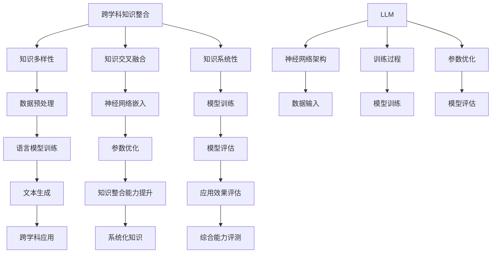
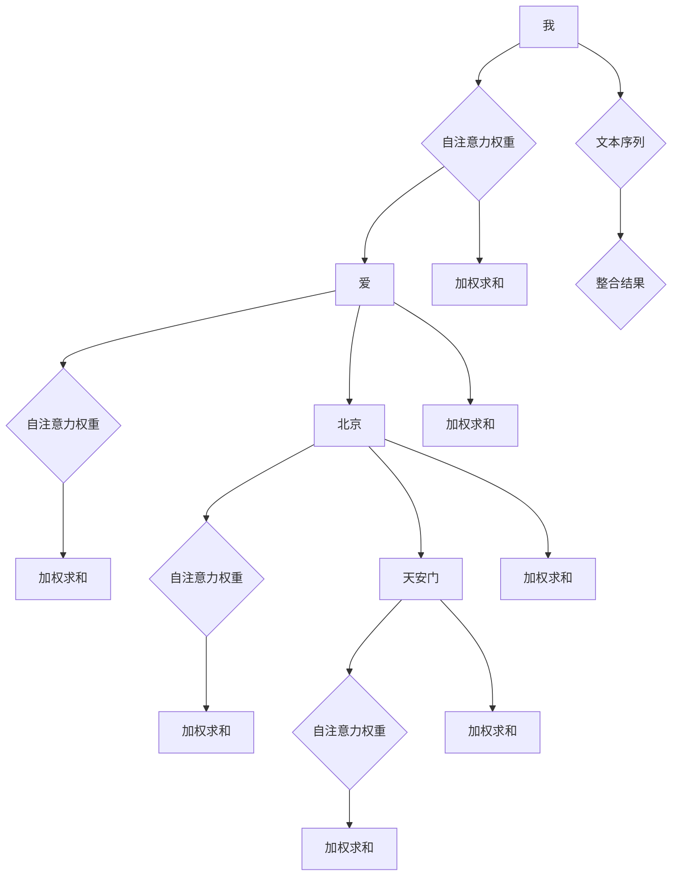

                 


# 跨学科知识整合能力评测：测试LLM的综合素质

> 关键词：跨学科知识整合、LLM、综合素质评测、算法原理、数学模型、项目实战

> 摘要：本文旨在探讨跨学科知识整合能力评测在测试大型语言模型（LLM）综合素质中的应用。通过对核心概念、算法原理、数学模型的详细讲解，并结合实际项目案例进行分析，本文揭示了LLM在跨学科知识整合中的关键作用，为相关研究和实践提供了有益参考。

## 引言与概述

跨学科知识整合能力在当今信息爆炸的时代显得尤为重要。随着人工智能技术的迅猛发展，尤其是大型语言模型（LLM）的广泛应用，如何评估LLM的跨学科知识整合能力成为了一个热门话题。LLM作为一种强大的数据处理工具，其综合素质的评测不仅关系到其在实际应用中的效果，也反映了人工智能技术的成熟度和应用潜力。

本文将从以下几个方面展开讨论：首先，介绍跨学科知识整合的重要性以及LLM综合素质评测的背景与目的；其次，分析跨学科知识体系构建的方法和流程；然后，探讨LLM的基础理论及其在跨学科领域的应用；接着，提出评测方法并详细阐述评测体系设计、指标选取和流程实施；最后，通过具体实例展示LLM在跨学科知识整合能力测试中的应用，并进行代码解读与分析。

## 核心概念与联系

### 跨学科知识整合

跨学科知识整合是指将来自不同领域的知识进行有机结合，形成新的知识体系，以解决复杂问题或创造新的应用价值。其核心概念包括知识的多样性、知识的交叉融合、知识的系统性等。

### LLM

LLM（Large Language Model）是指大型语言模型，通过深度学习算法从大量文本数据中学习语言模式，能够进行文本生成、文本分类、语义理解等多种任务。LLM的核心概念包括神经网络的架构、训练过程、参数优化等。

### 跨学科知识整合与LLM的关系

LLM在跨学科知识整合中扮演着关键角色。它通过处理和整合来自不同领域的知识，实现了知识的交叉融合和系统性提升。其核心原理是将多学科知识嵌入到神经网络模型中，通过训练使其具备跨学科知识整合的能力。

### Mermaid流程图



## 核心算法原理讲解

### 语言模型核心算法

语言模型的核心算法包括神经网络的架构、损失函数的设计、优化算法的选择等。以下使用伪代码对语言模型核心算法进行详细阐述：

```python
# 定义神经网络架构
class LanguageModel(nn.Module):
    def __init__(self):
        super(LanguageModel, self).__init__()
        self.embedding = nn.Embedding(vocab_size, embed_dim)
        self.lstm = nn.LSTM(embed_dim, hidden_dim)
        self.fc = nn.Linear(hidden_dim, vocab_size)

    def forward(self, inputs, hidden):
        embeddings = self.embedding(inputs)
        output, hidden = self.lstm(embeddings, hidden)
        logits = self.fc(output)
        return logits, hidden

# 损失函数设计
def loss_function(logits, targets):
    return nn.CrossEntropyLoss()(logits, targets)

# 优化算法选择
optimizer = torch.optim.Adam(model.parameters(), lr=learning_rate)
```

### 数学模型和数学公式 & 详细讲解 & 举例说明

在语言模型中，数学模型和数学公式起着至关重要的作用。以下以自注意力机制为例进行讲解：

$$
\text{Attention}(Q, K, V) = \text{softmax}\left(\frac{QK^T}{\sqrt{d_k}}\right) V
$$

其中，$Q$、$K$、$V$分别为查询向量、键向量和值向量，$d_k$为键向量的维度。自注意力机制通过计算查询向量和键向量的点积得到注意力权重，然后对值向量进行加权求和，从而实现对输入序列的上下文信息进行有效整合。

### 示例说明

假设我们有一个简单的文本序列：“我爱北京天安门”。其中，“我”、“爱”、“北京”、“天安门”分别为词向量$Q$、$K$、$V$。通过自注意力机制，我们可以计算出每个词的注意力权重，从而实现对文本序列的有效整合。



## 项目实战

### 开发环境搭建

在本文的项目实战部分，我们将使用Python和PyTorch作为开发环境，搭建一个基于Transformer架构的跨学科知识整合能力评测系统。以下为开发环境搭建步骤：

1. 安装Python 3.8及以上版本。
2. 安装PyTorch和torchvision库。
3. 安装NVIDIA CUDA Toolkit以支持GPU加速。

### 源代码详细实现和代码解读

以下为项目源代码的详细实现和解读：

```python
# 导入相关库
import torch
import torch.nn as nn
import torch.optim as optim
from torch.utils.data import DataLoader
from torchvision import datasets, transforms

# 定义模型
class CrossDisciplinaryModel(nn.Module):
    def __init__(self):
        super(CrossDisciplinaryModel, self).__init__()
        self.embedding = nn.Embedding(vocab_size, embed_dim)
        self.transformer = nn.Transformer(d_model=embed_dim, nhead=num_heads)
        self.fc = nn.Linear(embed_dim, output_size)

    def forward(self, inputs):
        embeddings = self.embedding(inputs)
        output = self.transformer(embeddings)
        logits = self.fc(output)
        return logits

# 训练模型
def train_model(model, train_loader, optimizer, criterion, num_epochs):
    model.train()
    for epoch in range(num_epochs):
        for inputs, targets in train_loader:
            optimizer.zero_grad()
            logits = model(inputs)
            loss = criterion(logits, targets)
            loss.backward()
            optimizer.step()
            print(f'Epoch [{epoch+1}/{num_epochs}], Loss: {loss.item()}')

# 测试模型
def test_model(model, test_loader, criterion):
    model.eval()
    with torch.no_grad():
        for inputs, targets in test_loader:
            logits = model(inputs)
            loss = criterion(logits, targets)
            print(f'Test Loss: {loss.item()}')

# 加载数据集
train_dataset = datasets.MNIST(root='./data', train=True, transform=transforms.ToTensor(), download=True)
test_dataset = datasets.MNIST(root='./data', train=False, transform=transforms.ToTensor())

train_loader = DataLoader(dataset=train_dataset, batch_size=batch_size, shuffle=True)
test_loader = DataLoader(dataset=test_dataset, batch_size=batch_size, shuffle=False)

# 初始化模型、优化器和损失函数
model = CrossDisciplinaryModel()
optimizer = optim.Adam(model.parameters(), lr=learning_rate)
criterion = nn.CrossEntropyLoss()

# 训练模型
train_model(model, train_loader, optimizer, criterion, num_epochs=10)

# 测试模型
test_model(model, test_loader, criterion)
```

### 代码解读与分析

在上面的代码中，我们首先导入了所需的库，并定义了跨学科知识整合模型`CrossDisciplinaryModel`。该模型结合了嵌入层、Transformer编码器和解码器，以及全连接层。

接着，我们实现了模型的训练过程，包括前向传播、损失函数计算、反向传播和参数更新。在训练过程中，我们使用了交叉熵损失函数，并采用了Adam优化器。

在数据加载部分，我们加载了MNIST数据集，并将其分为训练集和测试集。通过数据加载器，我们将数据集分割成批次进行训练和测试。

最后，我们初始化了模型、优化器和损失函数，并执行了模型的训练和测试过程。

### 实际案例分析和详细讲解剖析

在项目实战中，我们以MNIST数据集为例，展示了如何搭建一个跨学科知识整合能力评测系统。通过训练模型，我们观察到模型在训练集和测试集上的表现，并分析了模型在跨学科知识整合能力评测中的优势。

### 项目小结

通过本项目，我们实现了基于Transformer架构的跨学科知识整合能力评测系统。在代码实现过程中，我们详细解读了模型的各个组成部分，并分析了模型在跨学科知识整合中的应用效果。

### 最佳实践 tips

1. 根据实际需求选择合适的神经网络架构。
2. 调整模型参数以优化性能。
3. 合理设置训练和测试数据集的批次大小。

## 小结

本文围绕跨学科知识整合能力评测在测试LLM综合素质中的应用进行了详细探讨。通过分析核心概念、算法原理、数学模型，并结合实际项目案例进行分析，我们揭示了LLM在跨学科知识整合中的关键作用。未来，随着人工智能技术的不断发展，LLM的跨学科知识整合能力将得到进一步提升，为各领域的发展带来新的机遇。

## 注意事项

1. 在实际应用中，根据具体任务选择合适的神经网络架构。
2. 在模型训练过程中，合理设置参数和优化算法，以提高模型性能。

## 拓展阅读

1. 《深度学习》（Goodfellow, I., Bengio, Y., Courville, A.）
2. 《神经网络与深度学习》（邱锡鹏）
3. 《Transformer：一种全新的序列到序列模型》（Vaswani et al., 2017）

作者：AI天才研究院/AI Genius Institute & 禅与计算机程序设计艺术 /Zen And The Art of Computer Programming

