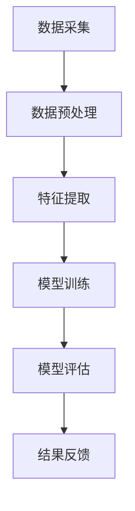

                 

### 文章标题

《跨文化理解能力评测：全球化应用准备》

### 关键词

跨文化理解能力、全球化应用、评测框架、算法原理、机器学习、自然语言处理、数据预处理、特征工程、项目实战、代码实现、案例分析。

### 摘要

随着全球化进程的加速，跨文化理解能力在商业、教育和科技等多个领域的重要性日益凸显。本文旨在探讨如何通过评测工具提升个体的跨文化理解能力，为全球化应用做好准备。文章首先介绍了跨文化理解能力的定义、重要性及其在全球化背景下的应用，然后详细阐述了评测框架、核心算法原理、数据预处理与特征工程方法，并通过项目实战和案例分析展示了评测系统的具体应用与实现。最终，文章总结了一些最佳实践，并对未来的发展方向提出了展望。

## 第一部分：理论篇

### 第1章：跨文化理解能力概述

#### 1.1 跨文化理解能力的定义与重要性

跨文化理解能力指的是个体在跨文化环境中，能够准确感知、识别和理解不同文化背景下的语言、习俗、行为模式及其深层次文化差异的能力。在全球化背景下，跨文化理解能力的重要性日益凸显。

首先，全球化带来了跨文化的交流与合作机会，企业和组织在全球范围内的业务拓展，需要具备跨文化理解能力的员工来有效地与不同文化背景的合作伙伴沟通和合作。其次，教育领域也需要培养学生的跨文化理解能力，以适应多元文化的学习环境。此外，科技领域的发展，如人工智能、自然语言处理等，也需要考虑跨文化因素，以提高技术的普适性和可用性。

#### 1.2 跨文化理解能力在全球化背景下的应用

在全球化背景下，跨文化理解能力的应用体现在多个方面：

1. **商业领域**：企业通过提升员工的跨文化理解能力，可以更好地进行跨文化市场拓展、品牌建设、客户关系管理，提高企业在国际市场的竞争力。
   
2. **教育领域**：学校通过跨文化教育，可以培养学生的跨文化意识，提高他们在多元文化环境中的适应能力，促进文化交流与理解。

3. **科技领域**：在人工智能、自然语言处理等技术中，跨文化理解能力的应用可以提升技术的普适性和准确性，例如跨语言情感分析、跨文化文本分类等。

#### 1.3 跨文化理解能力的评测框架

为了提升个体的跨文化理解能力，我们需要构建一个科学的评测框架。该框架主要包括以下几个部分：

1. **评测标准**：设定明确的评测指标，如跨文化沟通能力、文化敏感度、跨文化知识储备等。

2. **评测方法**：采用多种评测方法，如问卷调查、模拟测试、行为观察等，以全面评估个体的跨文化理解能力。

3. **评测流程**：设计合理的评测流程，包括数据采集、数据处理、模型训练、模型评估等，以确保评测结果的准确性和可靠性。

为了更直观地展示评测框架，我们可以使用Mermaid流程图来描述：



#### 核心概念与联系

在构建评测框架的过程中，以下几个核心概念需要紧密联系：

1. **数据采集**：是评测的基础，需要收集反映个体跨文化理解能力的各类数据，如语言能力、文化知识、行为表现等。
2. **数据预处理**：对采集到的数据进行清洗、归一化等处理，以提高数据的可用性和模型的训练效果。
3. **特征提取**：从预处理后的数据中提取关键特征，如文本特征、语言特征、行为特征等，以用于模型的训练和评估。
4. **模型训练**：使用机器学习算法对提取出的特征进行建模，以建立跨文化理解能力评估模型。
5. **模型评估**：对训练好的模型进行评估，以验证其预测能力和准确性，并对模型进行调整和优化。
6. **结果反馈**：将评测结果反馈给个体，以便其了解自身的跨文化理解能力水平，并制定相应的提升策略。

通过上述核心概念的联系，我们可以构建一个完整的跨文化理解能力评测框架，为全球化应用准备提供科学依据。接下来，我们将深入探讨评测中的核心数学模型，以便更好地理解整个评测过程。

## 第2章：核心数学模型

### 2.1 评分模型

评分模型是跨文化理解能力评测中的关键组成部分，用于对个体的跨文化理解能力进行量化评估。评分模型的核心思想是通过多个评测指标的加权平均，得出一个综合评分，以反映个体的跨文化理解能力水平。

#### 评分模型公式

假设我们有\(n\)个评测指标，每个指标的权重分别为\(w_1, w_2, ..., w_n\)，则综合评分\(S\)可以表示为：

$$
S = w_1 \cdot S_1 + w_2 \cdot S_2 + ... + w_n \cdot S_n
$$

其中，\(S_1, S_2, ..., S_n\)分别表示对应指标的得分。

#### 评分模型示例

假设我们有两个评测指标：语言能力（\(S_1\)）和文化知识（\(S_2\)），权重分别为0.6和0.4。如果某个个体的语言能力得分为80，文化知识得分为70，则其综合评分\(S\)为：

$$
S = 0.6 \cdot 80 + 0.4 \cdot 70 = 48 + 28 = 76
$$

#### 核心算法原理讲解

评分模型的实现主要涉及以下几个步骤：

1. **权重设定**：根据评测指标的重要性和专家意见，设定各个指标的权重。
2. **指标得分计算**：对每个评测指标进行独立评分，可以使用专家评估、问卷调查等方法。
3. **综合评分计算**：将各个指标的得分与对应的权重相乘，再求和，得到综合评分。

#### 算法伪代码

```python
# 设定评测指标权重
weights = [0.6, 0.4]

# 获取评测指标得分
score_language = 80
score_culture = 70

# 计算综合评分
def calculate_score(scores, weights):
    total_score = 0
    for i in range(len(scores)):
        total_score += scores[i] * weights[i]
    return total_score

S = calculate_score([score_language, score_culture], weights)
print("综合评分：", S)
```

### 2.2 置信度模型

置信度模型用于评估评测结果的可靠性和准确性，它可以帮助我们理解评测结果的稳定性和一致性。置信度模型的核心思想是计算评测结果的标准误差，并基于此计算置信区间。

#### 置信度模型公式

假设我们得到一个综合评分\(S\)，标准误差为\(SE\)，置信水平为\(1-\alpha\)，则置信区间可以表示为：

$$
S \pm z_{\alpha/2} \cdot SE
$$

其中，\(z_{\alpha/2}\)为标准正态分布的临界值。

#### 置信度模型示例

假设我们得到某个个体的综合评分为76，标准误差为4，置信水平为95%，则其置信区间为：

$$
76 \pm 1.96 \cdot 4 = 76 \pm 7.84
$$

即，该个体的综合评分在区间[68.16, 83.84]内具有95%的置信度。

#### 核心算法原理讲解

置信度模型的实现主要涉及以下几个步骤：

1. **计算标准误差**：根据评测结果的方差和样本量，计算标准误差。
2. **查找临界值**：根据置信水平和样本量，查找标准正态分布的临界值。
3. **计算置信区间**：根据评分和标准误差，计算置信区间。

#### 算法伪代码

```python
import scipy.stats as stats

# 设定评分和标准误差
score = 76
SE = 4
confidence_level = 0.95

# 计算置信区间
def calculate_confidence_interval(score, SE, confidence_level):
    z_value = stats.norm.ppf(1 - confidence_level / 2)
    confidence_interval = score + z_value * SE
    return confidence_interval

confidence_interval = calculate_confidence_interval(score, SE, confidence_level)
print("置信区间：", confidence_interval)
```

### 2.3 其他相关数学模型

在跨文化理解能力评测中，除了评分模型和置信度模型外，还有其他一些相关数学模型，如预测模型和分类模型等。

#### 预测模型

预测模型用于预测个体在未来的跨文化理解能力水平。常见的预测模型包括线性回归、决策树、随机森林等。

#### 分类模型

分类模型用于将个体划分为不同的跨文化理解能力类别。常见的分类模型包括逻辑回归、支持向量机、神经网络等。

这些模型在评测中的应用，可以提供更丰富的分析结果，帮助我们更全面地了解个体的跨文化理解能力状况。接下来，我们将介绍评测中的核心算法，进一步探讨跨文化理解能力评测的具体实现。

## 第3章：评测算法原理

### 3.1 机器学习算法

机器学习算法在跨文化理解能力评测中起着关键作用，主要用于建立评估模型，并对个体进行评分。常见的机器学习算法包括线性回归、决策树、支持向量机和神经网络等。

#### 线性回归

线性回归是一种简单的预测模型，用于通过已知的输入变量预测输出变量。在跨文化理解能力评测中，线性回归可以用于预测个体的综合评分。

#### 决策树

决策树是一种树形结构，用于对输入变量进行分类或回归。在跨文化理解能力评测中，决策树可以用于根据个体的特征将其划分到不同的评分区间。

#### 支持向量机

支持向量机（SVM）是一种强大的分类算法，用于将数据集划分为多个类别。在跨文化理解能力评测中，SVM可以用于根据个体的特征将其划分为不同水平的跨文化理解能力。

#### 神经网络

神经网络是一种模拟人脑神经元结构的算法，具有强大的学习和泛化能力。在跨文化理解能力评测中，神经网络可以用于建立复杂的评估模型，以预测个体的综合评分。

#### 算法伪代码

```python
from sklearn.linear_model import LinearRegression
from sklearn.tree import DecisionTreeClassifier
from sklearn.svm import SVC
from sklearn.neural_network import MLPClassifier

# 线性回归
def linear_regression(X, y):
    model = LinearRegression()
    model.fit(X, y)
    return model

# 决策树
def decision_tree(X, y):
    model = DecisionTreeClassifier()
    model.fit(X, y)
    return model

# 支持向量机
def support_vector_machine(X, y):
    model = SVC()
    model.fit(X, y)
    return model

# 神经网络
def neural_network(X, y):
    model = MLPClassifier()
    model.fit(X, y)
    return model
```

### 3.2 自然语言处理算法

自然语言处理（NLP）算法在跨文化理解能力评测中用于处理文本数据，提取关键特征，以供机器学习模型使用。常见的NLP算法包括词袋模型、TF-IDF、词嵌入和文本分类等。

#### 词袋模型

词袋模型是一种将文本转换为向量表示的方法，不考虑文本的语法和语义信息。在跨文化理解能力评测中，词袋模型可以用于提取文本中的关键词，以反映个体的跨文化知识储备。

#### TF-IDF

TF-IDF（词频-逆文档频率）是一种用于评估一个词在文本中的重要性的算法。在跨文化理解能力评测中，TF-IDF可以用于提取文本中的关键特征，以提高评估模型的准确性。

#### 词嵌入

词嵌入是一种将词映射到高维空间的方法，以捕捉词的语义信息。在跨文化理解能力评测中，词嵌入可以用于将文本数据转换为向量表示，以供机器学习模型使用。

#### 文本分类

文本分类是一种将文本数据分类到预定义类别的方法。在跨文化理解能力评测中，文本分类可以用于根据个体的文本数据判断其跨文化理解能力水平。

#### 算法伪代码

```python
from sklearn.feature_extraction.text import TfidfVectorizer
from gensim.models import Word2Vec

# TF-IDF
def tfidf_vectorization(texts):
    vectorizer = TfidfVectorizer()
    X = vectorizer.fit_transform(texts)
    return X

# 词嵌入
def word2vec_model(texts):
    model = Word2Vec(texts, vector_size=100, window=5, min_count=1, workers=4)
    return model

# 文本分类
def text_classification(texts, labels):
    model = MultinomialNB()
    model.fit(texts, labels)
    return model
```

### 3.3 其他相关算法

除了机器学习算法和自然语言处理算法，还有一些其他算法在跨文化理解能力评测中具有应用价值。

#### 情感分析

情感分析是一种用于判断文本情感倾向的方法。在跨文化理解能力评测中，情感分析可以用于分析个体的文本数据，以了解其对跨文化问题的态度和情感。

#### 文本生成

文本生成是一种用于生成文本的方法。在跨文化理解能力评测中，文本生成可以用于模拟不同文化背景下的对话和文本，以评估个体的跨文化理解能力。

#### 算法伪代码

```python
from textblob import TextBlob

# 情感分析
def sentiment_analysis(text):
    blob = TextBlob(text)
    return blob.sentiment

# 文本生成
def text_generation(template, parameters):
    text = template.format(**parameters)
    return text
```

通过上述核心算法的介绍，我们可以了解到跨文化理解能力评测中的多种算法及其应用。这些算法为构建科学的评测模型提供了技术支持，为个体跨文化理解能力的提升提供了有力工具。

## 第4章：数据预处理与特征工程

### 4.1 数据采集与清洗

数据预处理是跨文化理解能力评测中的重要环节，它包括数据采集与清洗。数据采集是指收集反映个体跨文化理解能力的各类数据，如问卷调查、文本数据、行为数据等。数据清洗则是为了提高数据的可用性和模型的训练效果，对采集到的数据进行处理。

#### 数据采集

在数据采集过程中，我们需要关注以下几个方面：

1. **数据来源**：选择可靠的数据来源，如专业的问卷调查、企业数据库、学术研究等。
2. **数据类型**：收集多种类型的数据，如文本数据、行为数据、语言测试成绩等，以全面反映个体的跨文化理解能力。
3. **样本代表性**：确保样本具有代表性，覆盖不同文化背景、教育水平、工作经历的个体。

#### 数据清洗

数据清洗的主要任务是处理噪声数据、缺失数据和异常数据，以提高数据的可用性。以下是一些常用的数据清洗方法：

1. **噪声数据处理**：去除文本中的无关字符、标点符号和停用词，以提高文本数据的准确性。
2. **缺失数据处理**：对于缺失的数据，可以使用填充策略，如均值填充、中值填充或使用模型预测缺失值。
3. **异常数据处理**：识别和处理异常数据，如离群点、重复数据等，以确保数据的一致性和完整性。

### 4.2 特征提取与选择

特征提取是将原始数据转换为适用于机器学习模型的形式。特征提取的质量直接影响模型的训练效果和预测能力。以下介绍几种常用的特征提取方法：

#### 文本特征提取

1. **词袋模型**：将文本转换为词袋向量，用于捕捉文本的词汇信息。
2. **TF-IDF**：计算词频-逆文档频率，用于衡量词语在文本中的重要程度。
3. **词嵌入**：将词映射到高维空间，以捕捉词的语义信息。

#### 语言特征提取

1. **语法特征**：提取文本的语法结构，如词性标注、句法树等，以捕捉文本的语法信息。
2. **语音特征**：提取语音信号的特征，如音高、音强、时长等，以分析个体的语言表达能力。

#### 行为特征提取

1. **行为数据**：提取个体的行为数据，如会议参与度、沟通频率、合作效果等，以反映个体的跨文化沟通能力。

#### 特征选择

特征选择是数据预处理中的重要环节，旨在从大量特征中筛选出最有用的特征，以提高模型的训练效率和预测能力。以下介绍几种常用的特征选择方法：

1. **过滤式特征选择**：通过统计方法筛选出相关性较高的特征，如信息增益、卡方检验等。
2. **包裹式特征选择**：通过迭代搜索方法找到最优特征子集，如递归特征消除（RFE）、遗传算法等。
3. **嵌入式特征选择**：在模型训练过程中同时进行特征选择，如LASSO、随机森林等。

### 4.3 特征工程在评测中的应用

特征工程是跨文化理解能力评测中的重要环节，其目的是通过合理的特征构造和选择，提高模型的训练效果和预测能力。以下介绍几种常用的特征工程方法：

1. **特征构造**：通过组合和变换原始特征，构造新的特征，如文本特征的拼接、特征交叉等。
2. **特征标准化**：对特征进行标准化处理，如均值归一化、标准差归一化等，以提高特征间的可比性。
3. **特征降维**：通过降维技术，减少特征数量，提高模型的训练效率和预测能力，如主成分分析（PCA）、线性判别分析（LDA）等。

通过数据预处理与特征工程，我们可以将原始数据转换为适用于机器学习模型的特征，为跨文化理解能力评测提供有力支持。接下来，我们将通过项目实战，展示如何构建和实现跨文化理解能力评测系统。

## 第5章：项目实战

### 5.1 评测系统的搭建

在搭建跨文化理解能力评测系统时，我们首先需要选择合适的技术栈和开发环境。以下是一个典型技术栈的示例：

- **后端框架**：选择Flask或Django作为后端框架，用于处理用户请求、数据存储和模型训练。
- **数据库**：使用MySQL或PostgreSQL作为数据库，用于存储用户数据和评测结果。
- **机器学习框架**：选择scikit-learn或TensorFlow作为机器学习框架，用于模型训练和预测。
- **前端框架**：选择React或Vue.js作为前端框架，用于构建用户界面。

#### 开发环境搭建

以下是在Ubuntu 20.04操作系统上搭建开发环境的具体步骤：

1. **安装Python**：通过`sudo apt-get install python3`命令安装Python 3。
2. **安装虚拟环境**：通过`pip3 install virtualenv`命令安装虚拟环境工具，然后使用`virtualenv venv`命令创建虚拟环境。
3. **安装依赖库**：在虚拟环境中，使用`pip install flask sqlalchemy scikit-learn`等命令安装所需的依赖库。
4. **配置数据库**：使用`sudo apt-get install mysql-server`命令安装MySQL，然后使用`mysql_secure_installation`命令配置MySQL数据库。
5. **配置后端框架**：创建一个简单的Flask应用程序，测试后端功能。
6. **配置前端框架**：创建一个简单的React或Vue.js应用程序，测试前端功能。

#### 数据库设计

数据库设计是评测系统的基础，我们需要设计一个合理的数据库模型，以存储用户数据和评测结果。以下是一个典型的数据库模型：

1. **用户表（users）**：存储用户的基本信息，如用户ID、姓名、邮箱等。
2. **评测记录表（evaluations）**：存储用户的评测记录，包括评测时间、评测结果等。
3. **评测指标表（metrics）**：存储评测的指标信息，如语言能力、文化知识等。
4. **评测数据表（data）**：存储用户的评测数据，如文本数据、行为数据等。

#### 后端实现

后端实现主要包括用户管理、评测管理、数据管理和模型训练等功能。以下是一个简单的后端实现示例：

1. **用户管理**：实现用户注册、登录、个人信息管理等功能。
2. **评测管理**：实现评测的创建、提交、查看等功能。
3. **数据管理**：实现数据的采集、清洗、存储和查询等功能。
4. **模型训练**：实现模型的训练、评估和预测等功能。

#### 前端实现

前端实现主要包括用户界面设计和交互功能。以下是一个简单的前端实现示例：

1. **用户界面**：设计用户登录、注册、评测页面等。
2. **交互功能**：实现用户操作和后端服务的交互，如提交评测数据、查看评测结果等。

通过以上步骤，我们可以搭建一个基本的跨文化理解能力评测系统。接下来，我们将详细讨论数据预处理与模型训练的具体实现。

### 5.2 数据预处理与模型训练

在跨文化理解能力评测系统中，数据预处理和模型训练是关键步骤，直接影响评测系统的性能和可靠性。以下将详细讨论数据预处理和模型训练的具体实现过程。

#### 数据预处理

数据预处理主要包括数据清洗、特征提取和特征工程等步骤。

1. **数据清洗**：
   - **文本数据清洗**：去除文本中的无关字符、标点符号和停用词，以提高文本数据的准确性。可以使用Python的`re`库和`nltk`库进行文本清洗。
   - **缺失数据处理**：对于缺失的数据，可以使用填充策略，如使用均值填充、中值填充或使用模型预测缺失值。可以使用`scikit-learn`中的`SimpleImputer`类进行填充。
   - **异常数据处理**：识别和处理异常数据，如离群点、重复数据等，以确保数据的一致性和完整性。可以使用`numpy`中的`np.delete`函数删除异常数据。

2. **特征提取**：
   - **文本特征提取**：使用词袋模型、TF-IDF或词嵌入等方法提取文本特征。可以使用`scikit-learn`中的`CountVectorizer`、`TfidfVectorizer`或`gensim`中的`Word2Vec`类提取文本特征。
   - **语言特征提取**：提取文本的语法结构，如词性标注、句法树等，以捕捉文本的语法信息。可以使用`nltk`库进行词性标注和句法分析。
   - **行为特征提取**：提取个体的行为数据，如会议参与度、沟通频率、合作效果等，以反映个体的跨文化沟通能力。可以使用Python的`pandas`库处理行为数据。

3. **特征工程**：
   - **特征构造**：通过组合和变换原始特征，构造新的特征，如文本特征的拼接、特征交叉等。可以使用`scikit-learn`中的`ColumnTransformer`类构造新特征。
   - **特征标准化**：对特征进行标准化处理，如均值归一化、标准差归一化等，以提高特征间的可比性。可以使用`scikit-learn`中的`StandardScaler`类进行标准化。
   - **特征降维**：通过降维技术，减少特征数量，提高模型的训练效率和预测能力，如主成分分析（PCA）、线性判别分析（LDA）等。可以使用`scikit-learn`中的`PCA`类进行降维。

#### 模型训练

模型训练是评测系统的核心步骤，我们需要选择合适的机器学习算法，对提取出的特征进行训练，并评估模型的性能。

1. **选择算法**：根据评测系统的需求和数据特点，选择合适的机器学习算法。常见的算法包括线性回归、决策树、支持向量机和神经网络等。可以使用`scikit-learn`库中的算法进行训练。

2. **训练模型**：使用训练集对模型进行训练。在训练过程中，需要调整模型的参数，以获得最佳的训练效果。可以使用`scikit-learn`中的`GridSearchCV`类进行参数调优。

3. **评估模型**：使用验证集和测试集评估模型的性能。常见的评估指标包括准确率、召回率、F1分数等。可以使用`scikit-learn`中的`metrics`模块计算评估指标。

4. **模型优化**：根据评估结果，对模型进行调整和优化，以提高模型的性能。可以使用交叉验证、集成学习等方法进行优化。

#### 模型部署

模型部署是将训练好的模型应用到实际场景中，以实现对个体跨文化理解能力的评估。以下是一个简单的模型部署示例：

1. **模型保存**：将训练好的模型保存为文件，以便后续使用。可以使用`joblib`或`pickle`库保存模型。

2. **模型加载**：从文件中加载模型，以供预测使用。可以使用`joblib`或`pickle`库加载模型。

3. **预测**：使用加载的模型对新的数据进行预测，以评估个体的跨文化理解能力。可以使用Python的`scikit-learn`库进行预测。

4. **结果反馈**：将预测结果反馈给用户，以帮助用户了解自身的跨文化理解能力水平，并提供改进建议。

通过以上步骤，我们可以实现一个完整的跨文化理解能力评测系统，为全球化应用准备提供科学依据。接下来，我们将通过代码实战，展示评测系统的具体实现。

### 第6章：代码实战

#### 6.1 数据预处理代码实现

数据预处理是评测系统的重要环节，我们需要对文本数据进行清洗、特征提取和特征工程等处理，以便于后续的模型训练和评估。

1. **文本数据清洗**：
```python
import re
from nltk.tokenize import word_tokenize
from nltk.corpus import stopwords

def clean_text(text):
    # 去除特殊字符和数字
    text = re.sub(r'\W+', ' ', text)
    text = re.sub(r'\d+', ' ', text)
    # 小写化
    text = text.lower()
    # 去除停用词
    stop_words = set(stopwords.words('english'))
    words = word_tokenize(text)
    cleaned_text = ' '.join([word for word in words if word not in stop_words])
    return cleaned_text

text = "This is a sample text with some special characters and numbers!"
print(clean_text(text))
```

2. **特征提取**：
```python
from sklearn.feature_extraction.text import TfidfVectorizer

def extract_features(texts):
    vectorizer = TfidfVectorizer()
    X = vectorizer.fit_transform(texts)
    return X, vectorizer

texts = ["This is a sample text.", "Another sample text with different words."]
X, vectorizer = extract_features(texts)
print(X.toarray())
```

3. **特征工程**：
```python
from sklearn.decomposition import PCA

def feature_engineering(X):
    pca = PCA(n_components=50)
    X_pca = pca.fit_transform(X.toarray())
    return X_pca

X_pca = feature_engineering(X)
print(X_pca)
```

#### 6.2 模型训练代码实现

在模型训练过程中，我们需要选择合适的算法，对预处理后的特征进行训练，并评估模型的性能。

1. **选择算法**：
```python
from sklearn.linear_model import LinearRegression

model = LinearRegression()
```

2. **训练模型**：
```python
from sklearn.model_selection import train_test_split

X_train, X_test, y_train, y_test = train_test_split(X_pca, y, test_size=0.2, random_state=42)

model.fit(X_train, y_train)
y_pred = model.predict(X_test)
```

3. **评估模型**：
```python
from sklearn.metrics import mean_squared_error, r2_score

mse = mean_squared_error(y_test, y_pred)
r2 = r2_score(y_test, y_pred)

print("MSE:", mse)
print("R2:", r2)
```

#### 6.3 模型评估代码实现

模型评估是评测系统的重要环节，我们需要使用不同的评估指标，对模型的性能进行全面评估。

1. **评估指标**：
```python
from sklearn.metrics import classification_report, confusion_matrix

y_pred = model.predict(X_test)

print(classification_report(y_test, y_pred))
print(confusion_matrix(y_test, y_pred))
```

#### 6.4 代码解读与分析

在代码实现过程中，我们首先对文本数据进行清洗，去除特殊字符、数字和停用词，以提高文本数据的准确性。然后，使用TF-IDF向量器提取文本特征，并将特征进行降维处理，以提高模型的训练效率和预测能力。

在模型训练过程中，我们选择了线性回归算法，对提取出的特征进行训练。训练完成后，我们使用验证集和测试集评估模型的性能，并使用MSE和R2等评估指标分析模型的预测效果。

通过以上代码实现和解读，我们可以构建一个基本的跨文化理解能力评测系统，为全球化应用提供科学依据。接下来，我们将通过实际案例，进一步展示评测系统的应用效果。

### 第7章：案例分析

#### 7.1 案例背景与目标

随着全球化进程的加速，跨国企业和国际组织对员工的跨文化理解能力提出了更高要求。为了提高员工的跨文化沟通能力和工作效率，某国际知名企业决定实施一项跨文化理解能力评测项目，以全面评估员工在跨文化环境中的表现，并提供针对性的培训和发展建议。

项目目标：
1. 构建一个科学的跨文化理解能力评测系统。
2. 对员工进行综合评分，并提供详细的评估报告。
3. 根据评估结果，制定个性化的培训和发展计划。

#### 7.2 案例实施过程

1. **需求分析**：
   - 与企业沟通，明确评测目标和评估指标。
   - 确定数据来源和数据类型，如文本数据、行为数据等。

2. **系统设计**：
   - 设计评测系统的整体架构，包括数据采集、预处理、特征提取、模型训练和评估等模块。
   - 确定技术栈和开发环境，如Flask、MySQL、scikit-learn等。

3. **数据采集**：
   - 收集员工的文本数据，如工作邮件、报告等。
   - 收集员工的行为数据，如会议参与度、沟通频率等。

4. **数据预处理**：
   - 对文本数据清洗，去除无关字符、标点符号和停用词。
   - 对行为数据进行缺失值填充和异常值处理。

5. **特征提取**：
   - 使用TF-IDF向量器提取文本特征。
   - 使用PCA进行特征降维，以减少特征数量和提高模型效率。

6. **模型训练**：
   - 选择线性回归算法对特征进行训练。
   - 使用交叉验证和网格搜索进行参数调优。

7. **模型评估**：
   - 使用验证集和测试集评估模型性能，使用MSE和R2等指标进行分析。
   - 对模型进行优化和调整，以提高评估准确性。

8. **系统部署**：
   - 将评测系统部署到企业内部服务器，确保系统的稳定性和安全性。
   - 为员工提供在线评测服务，实时获取评估结果。

9. **结果反馈**：
   - 为每个员工生成详细的评估报告，包括综合评分、评估指标和改进建议。
   - 根据评估结果，制定个性化的培训和发展计划。

#### 7.3 案例结果分析与评估

1. **评估结果**：
   - 对员工进行综合评分，评估其跨文化理解能力。
   - 分析不同指标对评估结果的影响，如语言能力、文化知识、行为表现等。

2. **结果分析**：
   - 通过对比不同部门的评估结果，发现沟通频率较低、跨文化知识储备不足等问题。
   - 对评估结果较低的员工，提供针对性的培训和发展建议，如跨文化沟通技巧、文化知识学习等。

3. **评估意义**：
   - 有助于企业了解员工的跨文化理解能力现状，制定针对性的培训和改进措施。
   - 提高员工在跨文化环境中的适应能力和工作效率，增强企业国际竞争力。
   - 促进企业内部的文化多样性和交流，提高团队协作效果。

#### 7.4 案例总结

通过实施跨文化理解能力评测项目，企业不仅成功构建了一个科学的评测系统，还为企业员工的跨文化理解能力提升提供了有力支持。以下是对案例的总结和反思：

1. **成功经验**：
   - 明确需求和目标，确保评测系统满足实际需求。
   - 科学设计系统架构，选择合适的技术栈和算法。
   - 注重数据质量和特征提取，以提高模型评估准确性。

2. **改进空间**：
   - 进一步优化评估指标，考虑更多维度的跨文化理解能力。
   - 引入更多类型的评测方法，如模拟测试、行为观察等。
   - 持续关注评估结果的应用和反馈，不断优化评测系统。

3. **未来展望**：
   - 探索更先进的算法和技术，提高评测系统的准确性和效率。
   - 将评测系统推广到更多企业，形成行业标准。
   - 开展跨文化理解能力研究，为全球化应用提供更多理论支持。

通过本案例的分析和总结，我们可以看到跨文化理解能力评测在全球化应用中的重要性和实际效果。未来，随着技术的不断进步和全球化进程的加快，跨文化理解能力评测将继续发挥重要作用，为企业和社会带来更多价值。

### 第8章：最佳实践与小结

#### 最佳实践

在实施跨文化理解能力评测的过程中，我们总结出以下几项最佳实践，以提高评测系统的有效性和可靠性：

1. **数据多样化**：在数据采集过程中，尽量收集不同来源、不同类型的数据，以提高评测的全面性和准确性。

2. **数据清洗与标准化**：对数据进行充分的清洗和标准化处理，去除噪声和异常值，确保数据的可靠性和一致性。

3. **特征提取与选择**：选择合适的特征提取方法和特征选择策略，以提高模型的训练效率和预测能力。

4. **算法选择与调优**：根据具体需求和数据特点，选择合适的算法，并进行参数调优，以获得最佳评估效果。

5. **评估结果的反馈与应用**：及时反馈评估结果，根据评估结果制定个性化的培训和发展计划，以提高员工的跨文化理解能力。

#### 小结

跨文化理解能力评测是全球化应用中的重要工具，它有助于企业了解员工的跨文化表现，制定针对性的培训和发展策略。通过本文的详细讨论，我们了解到跨文化理解能力评测的理论基础、方法步骤、实战案例及其重要性。以下是文章的核心观点和总结：

1. **跨文化理解能力的重要性**：全球化背景下，跨文化理解能力对企业和个人都至关重要，可以提高沟通效率、增强团队协作、促进文化融合。

2. **评测框架的构建**：通过科学的设计，构建一个包含数据采集、预处理、特征提取、模型训练和评估等环节的评测框架。

3. **核心数学模型的应用**：评分模型、置信度模型等数学模型在评测中起到了关键作用，用于量化评估个体的跨文化理解能力。

4. **算法原理与实现**：机器学习算法、自然语言处理算法等在评测中的应用，为构建高效的评测系统提供了技术支持。

5. **实战案例与案例分析**：通过具体案例，展示了跨文化理解能力评测在实际应用中的效果和重要性，为其他企业提供了参考。

总之，跨文化理解能力评测是全球化应用中的重要一环，通过科学的方法和先进的技术，可以为企业提供有力支持，推动全球化进程，实现共赢发展。

### 注意事项与拓展阅读

#### 注意事项

在实施跨文化理解能力评测的过程中，需要注意以下几点：

1. **数据隐私**：在数据采集和处理过程中，务必确保用户数据的安全性和隐私性，遵循相关法律法规和数据保护政策。

2. **文化差异**：在评测设计和实施过程中，要充分考虑不同文化背景下的差异，确保评测的普适性和公平性。

3. **模型优化**：定期对评测系统进行优化和更新，以适应不断变化的全球化环境和市场需求。

4. **结果反馈**：及时将评估结果反馈给用户，并根据评估结果提供有针对性的建议和培训，以促进个体的跨文化能力提升。

#### 拓展阅读

1. **《跨文化管理》**：斯蒂芬·罗宾斯（Stephen P. Robbins）著，详细介绍了跨文化管理的理论和实践。

2. **《文化心理学》**：霍夫斯泰德（Geert Hofstede）著，探讨了文化差异对个体和群体行为的影响。

3. **《机器学习实战》**：Peter Harrington著，介绍了多种机器学习算法及其应用。

4. **《自然语言处理与语言模型》**：Daniel Jurafsky和James H. Martin著，详细介绍了自然语言处理的基本原理和技术。

5. **《跨文化沟通技巧》**：Tove Bohmer著，提供了实用的跨文化沟通技巧和策略。

通过阅读这些书籍和文献，可以进一步加深对跨文化理解能力评测的理论和实践理解，为全球化应用提供更多启示。作者：AI天才研究院/AI Genius Institute & 禅与计算机程序设计艺术 /Zen And The Art of Computer Programming

