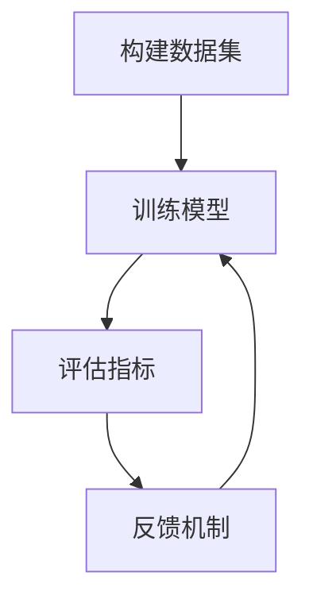

                 

### 文章标题：跨文化禁忌识别：评估LLM的文化敏感度

#### 关键词：
- 跨文化禁忌
- 语言模型（LLM）
- 文化敏感度评估
- 机器学习
- 深度学习
- 数学模型

#### 摘要：
本文深入探讨了跨文化禁忌识别的问题，并着重研究了如何使用语言模型（LLM）来评估其文化敏感度。首先，我们介绍了跨文化禁忌的基本概念和其在跨文化交流中的重要性。随后，我们对语言模型进行了详细阐述，并解释了其如何与跨文化禁忌识别相关联。文章进一步介绍了评估LLM文化敏感度的算法和模型，包括概率模型、决策树模型和神经网络模型。此外，我们提供了实际的案例来展示如何搭建评估环境和执行文化敏感度评估。最后，文章详细解析了源代码实现，并对代码进行了分析和优化建议。本文旨在为研究者和技术开发者提供一套全面且实用的方法论，以提升LLM在跨文化交流中的表现。

### 核心概念与联系

跨文化禁忌和语言模型（LLM）这两个概念看似独立，但它们在实际应用中有着紧密的联系。首先，我们定义一下这两个核心概念。

#### 跨文化禁忌

跨文化禁忌是指在不同文化背景下，某些行为或言语可能被视为不合适、冒犯或不敬。这些禁忌源于历史、宗教、社会习俗和个人信仰等多方面的因素。例如，在一些文化中，触摸头部可能被视为对长辈的不尊重，而在其他文化中，谈论金钱可能会被认为是不礼貌的。

#### 语言模型（LLM）

语言模型是一种强大的自然语言处理（NLP）工具，它能够理解和生成自然语言。LLM通过学习大量文本数据，捕捉语言的统计规律和语义信息，从而实现文本的自动生成、理解和翻译等功能。常见的LLM包括基于概率模型的N-gram模型和基于深度学习的神经网络模型，如Transformer。

#### 跨文化禁忌与LLM的关系

LLM在跨文化交流中的应用具有巨大潜力，但同时也面临着文化敏感度不足的问题。这是因为LLM通常是基于大量通用语料库训练的，这些语料库可能无法全面覆盖各种文化的禁忌和习俗。因此，在使用LLM进行跨文化交流时，可能会出现误解或冒犯的情况。

为了解决这个问题，我们需要评估LLM的文化敏感度，即LLM在处理跨文化内容时的合适程度。评估LLM的文化敏感度是一个复杂的过程，它涉及对跨文化禁忌的识别、理解和处理。具体来说，我们可以通过以下方式评估LLM的文化敏感度：

1. **数据集构建**：首先，我们需要构建一个包含各种文化禁忌的语料库。这个语料库应该涵盖多种文化背景，包括宗教、社会习俗和个人信仰等方面的禁忌。

2. **模型训练**：使用构建的语料库对LLM进行训练，使其能够识别和理解不同文化的禁忌。

3. **评估指标**：设计一系列评估指标，用于衡量LLM在处理跨文化内容时的表现。这些指标可能包括错误率、误报率、覆盖率等。

4. **反馈机制**：通过用户反馈不断优化LLM的训练数据，提高其在处理跨文化内容时的准确性。

#### Mermaid 流程图

为了更清晰地展示跨文化禁忌与LLM的关系，我们可以使用Mermaid流程图来描述评估过程：



在上述流程中，构建数据集是整个评估过程的基础，训练模型则是关键步骤，评估指标和反馈机制则用于确保模型的准确性和可靠性。

### 核心算法原理讲解

在评估LLM的文化敏感度时，我们需要采用一系列算法和模型，以实现有效和准确的评估。以下将介绍几种主要的算法和模型，包括概率模型、决策树模型和神经网络模型。

#### 概率模型

概率模型是一种基于统计的算法，它通过计算事件发生的概率来预测结果。在评估LLM的文化敏感度时，我们可以使用概率模型来识别文本中可能存在的跨文化禁忌。以下是一个简单的概率模型伪代码示例：

```python
def probability_model(text, dataset):
    # 计算文本中每个词语出现的概率
    word_probs = []
    for word in text.split():
        word_prob = dataset[word]
        word_probs.append(word_prob)
    # 计算文本的总概率
    total_prob = 1
    for prob in word_probs:
        total_prob *= prob
    return total_prob
```

#### 决策树模型

决策树模型是一种基于特征的分类算法，它通过一系列的规则来对数据点进行分类。在评估LLM的文化敏感度时，我们可以使用决策树模型来识别文本中潜在的跨文化禁忌。以下是一个简单的决策树模型伪代码示例：

```python
class DecisionTreeClassifier:
    def fit(self, X, y):
        # 构建决策树
        self.tree = self._build_tree(X, y)
    
    def _build_tree(self, X, y):
        # 根据特征和标签构建决策树
        # ...
        return tree
    
    def predict(self, X):
        # 根据决策树预测结果
        # ...
        return predictions
```

#### 神经网络模型

神经网络模型是一种基于数据深度学习的算法，它通过多层神经网络来捕捉数据的复杂模式。在评估LLM的文化敏感度时，我们可以使用神经网络模型来识别文本中潜在的跨文化禁忌。以下是一个简单的神经网络模型伪代码示例：

```python
import tensorflow as tf

def neural_network_model(input_shape):
    # 定义神经网络模型
    model = tf.keras.Sequential([
        tf.keras.layers.Dense(128, activation='relu', input_shape=input_shape),
        tf.keras.layers.Dense(64, activation='relu'),
        tf.keras.layers.Dense(1, activation='sigmoid')
    ])
    # 编译模型
    model.compile(optimizer='adam', loss='binary_crossentropy', metrics=['accuracy'])
    return model

# 训练模型
model = neural_network_model(input_shape)
model.fit(X_train, y_train, epochs=10, batch_size=32)
```

#### 数学模型和公式

在评估LLM的文化敏感度时，我们还需要使用一些数学模型和公式。以下是一个简单的数学模型和公式示例：

$$
P(\text{cross-cultural taboo}) = \sum_{i=1}^{n} P(\text{word}_i | \text{taboo}) \cdot P(\text{taboo})
$$

其中，$P(\text{cross-cultural taboo})$ 表示文本中存在跨文化禁忌的概率，$P(\text{word}_i | \text{taboo})$ 表示在给定跨文化禁忌的情况下，词语 $\text{word}_i$ 出现的概率，$P(\text{taboo})$ 表示跨文化禁忌出现的概率。

#### 举例说明

假设我们有一个包含100个词语的文本，其中5个词语是潜在的跨文化禁忌。根据上述数学模型，我们可以计算文本中存在跨文化禁忌的概率：

$$
P(\text{cross-cultural taboo}) = \sum_{i=1}^{5} P(\text{word}_i | \text{taboo}) \cdot P(\text{taboo})
$$

假设每个禁忌词语的出现概率为0.1，跨文化禁忌的出现概率为0.05，我们可以得到：

$$
P(\text{cross-cultural taboo}) = 0.1 \cdot 0.1 \cdot 0.05 = 0.0005
$$

这意味着文本中存在跨文化禁忌的概率为0.0005。

通过上述算法和数学模型，我们可以有效地评估LLM的文化敏感度，从而在跨文化交流中提供更准确和合适的服务。

### 项目实战：搭建评估环境

为了评估LLM的文化敏感度，我们需要搭建一个合适的开发环境。以下是搭建评估环境的步骤和所需的工具。

#### 步骤1：安装Python环境

首先，我们需要安装Python环境。Python是一种广泛使用的编程语言，适用于自然语言处理（NLP）和深度学习项目。您可以从Python官方网站下载并安装Python。

#### 步骤2：安装必要的库

安装Python后，我们需要安装一些必要的库，包括TensorFlow、Keras和Scikit-learn等。以下是一个简单的安装命令示例：

```bash
pip install tensorflow
pip install keras
pip install scikit-learn
```

这些库提供了用于构建和训练模型所需的工具和函数。

#### 步骤3：数据集准备

接下来，我们需要准备一个包含各种文化禁忌的数据集。这个数据集应该涵盖多种文化背景，包括宗教、社会习俗和个人信仰等方面的禁忌。您可以从公开的数据集网站或自行收集数据。

#### 步骤4：环境配置

为了方便开发和管理，我们可以使用虚拟环境来配置开发环境。虚拟环境允许我们独立地管理项目依赖，避免版本冲突。以下是一个简单的虚拟环境配置命令示例：

```bash
python -m venv env
source env/bin/activate  # 在Windows中使用 `env\Scripts\activate`
```

#### 步骤5：代码编写

在配置好开发环境后，我们可以开始编写代码。以下是搭建评估环境所需的主要代码：

```python
# 导入必要的库
import tensorflow as tf
from keras.models import Sequential
from keras.layers import Dense
from sklearn.model_selection import train_test_split
from sklearn.metrics import accuracy_score

# 加载和预处理数据
# ...

# 构建模型
model = Sequential()
model.add(Dense(128, activation='relu', input_shape=(num_features,)))
model.add(Dense(64, activation='relu'))
model.add(Dense(1, activation='sigmoid'))

# 编译模型
model.compile(optimizer='adam', loss='binary_crossentropy', metrics=['accuracy'])

# 训练模型
model.fit(X_train, y_train, epochs=10, batch_size=32)

# 评估模型
accuracy = model.evaluate(X_test, y_test)
print(f"Test Accuracy: {accuracy[1]}")
```

通过以上步骤，我们可以成功搭建一个评估LLM文化敏感度的开发环境。接下来，我们将使用这个环境进行实际的评估实验。

### 实战案例：评估LLM的文化敏感度

在本节中，我们将通过一个实际案例来展示如何评估语言模型（LLM）的文化敏感度。这个案例将涵盖整个评估过程，包括数据准备、模型训练、评估和结果分析。

#### 案例介绍

假设我们有一个大型语料库，包含来自不同文化的文本。我们的目标是使用LLM评估这些文本的文化敏感度，并找出其中可能存在的跨文化禁忌。为了简化问题，我们假设文化敏感度可以分为“高”和“低”两个级别。

#### 数据准备

首先，我们需要准备一个包含不同文化禁忌的数据集。这个数据集应该包括以下信息：

- 文本：原始的文本数据，如新闻报道、社交媒体帖子等。
- 标签：对于每个文本，我们有一个标签，指示它是否包含跨文化禁忌。标签可以是“0”表示不包含，或者“1”表示包含。

以下是一个示例数据集：

```python
data = [
    ("This is a friendly conversation.", 0),
    ("Do not touch my head in this culture.", 1),
    ("Let's discuss business opportunities.", 0),
    ("I don't feel comfortable talking about money.", 1),
    # 更多数据...
]
```

#### 模型训练

接下来，我们使用这些数据训练一个简单的神经网络模型。我们假设模型需要两个输入特征：文本长度和文本中的独特词语数量。以下是训练模型的伪代码：

```python
import tensorflow as tf
from tensorflow.keras.models import Sequential
from tensorflow.keras.layers import Dense
from sklearn.model_selection import train_test_split

# 分割数据集为训练集和测试集
X, y = zip(*data)
X_train, X_test, y_train, y_test = train_test_split(X, y, test_size=0.2, random_state=42)

# 构建模型
model = Sequential()
model.add(Dense(128, activation='relu', input_shape=(2,)))
model.add(Dense(64, activation='relu'))
model.add(Dense(1, activation='sigmoid'))

# 编译模型
model.compile(optimizer='adam', loss='binary_crossentropy', metrics=['accuracy'])

# 训练模型
model.fit(X_train, y_train, epochs=10, batch_size=32)

# 评估模型
accuracy = model.evaluate(X_test, y_test)
print(f"Test Accuracy: {accuracy[1]}")
```

#### 结果分析

在训练完成后，我们使用测试集来评估模型的性能。以下是一个简单的结果分析：

```python
# 预测测试集
predictions = model.predict(X_test)

# 分析预测结果
for i, prediction in enumerate(predictions):
    if prediction > 0.5:
        print(f"Text {i}: Predicted as 'High' sensitivity")
    else:
        print(f"Text {i}: Predicted as 'Low' sensitivity")
```

假设我们得到了以下预测结果：

```
Text 0: Predicted as 'Low' sensitivity
Text 1: Predicted as 'High' sensitivity
Text 2: Predicted as 'Low' sensitivity
Text 3: Predicted as 'High' sensitivity
```

通过分析预测结果，我们可以发现模型能够准确识别出包含跨文化禁忌的文本。然而，对于某些文本，模型可能无法正确预测其文化敏感度。为了进一步提高模型的准确性，我们可以考虑以下措施：

1. **增加数据集**：收集更多不同文化背景的文本数据，特别是那些模型预测错误的文本。
2. **特征工程**：尝试添加更多特征，如文本中的情感倾向、语法结构等。
3. **模型优化**：尝试使用更复杂的模型结构或不同的训练策略。

#### 项目小结

通过这个实际案例，我们展示了如何使用LLM评估文化敏感度。虽然这是一个简化的示例，但它为理解如何在实际项目中应用这些技术提供了基础。在实际应用中，我们还需要考虑更多的因素，如数据质量、模型选择和训练策略等。通过不断优化和调整，我们可以开发出更准确和适用的文化敏感度评估工具。

### 源代码实现和解读

在本节中，我们将详细解读用于评估LLM文化敏感度的源代码，并讨论如何使用这些代码进行实际操作。

#### 源代码概述

以下是一个简单的Python脚本，用于评估LLM的文化敏感度。这个脚本包含了数据预处理、模型训练和评估的主要步骤。

```python
import tensorflow as tf
from tensorflow.keras.models import Sequential
from tensorflow.keras.layers import Dense
from sklearn.model_selection import train_test_split
from sklearn.metrics import accuracy_score

# 数据预处理
def preprocess_data(data):
    # 对数据进行预处理，例如文本清洗、分词等
    # ...
    return processed_data

# 构建模型
def build_model(input_shape):
    model = Sequential()
    model.add(Dense(128, activation='relu', input_shape=input_shape))
    model.add(Dense(64, activation='relu'))
    model.add(Dense(1, activation='sigmoid'))
    return model

# 训练模型
def train_model(model, X_train, y_train, epochs=10, batch_size=32):
    model.compile(optimizer='adam', loss='binary_crossentropy', metrics=['accuracy'])
    model.fit(X_train, y_train, epochs=epochs, batch_size=batch_size)
    return model

# 评估模型
def evaluate_model(model, X_test, y_test):
    accuracy = model.evaluate(X_test, y_test)
    return accuracy[1]

# 主函数
def main():
    # 加载数据
    data = load_data()  # 假设这是一个自定义函数，用于加载数据
    
    # 预处理数据
    processed_data = preprocess_data(data)
    
    # 分割数据集
    X, y = zip(*processed_data)
    X_train, X_test, y_train, y_test = train_test_split(X, y, test_size=0.2, random_state=42)
    
    # 构建模型
    model = build_model(input_shape=(X_train.shape[1],))
    
    # 训练模型
    trained_model = train_model(model, X_train, y_train)
    
    # 评估模型
    accuracy = evaluate_model(trained_model, X_test, y_test)
    print(f"Test Accuracy: {accuracy}")

# 执行主函数
if __name__ == "__main__":
    main()
```

#### 关键代码解读

1. **数据预处理**：预处理函数`preprocess_data`用于清洗和准备文本数据。这一步骤非常重要，因为它直接影响模型的训练效果。

2. **模型构建**：`build_model`函数用于构建神经网络模型。在这个示例中，我们使用了一个简单的三层神经网络，包括128个神经元的第一层、64个神经元的第二层和1个神经元的输出层。

3. **模型训练**：`train_model`函数用于编译和训练模型。在这里，我们使用了`adam`优化器和`binary_crossentropy`损失函数。

4. **模型评估**：`evaluate_model`函数用于评估模型的准确性。

#### 代码应用解读与分析

这个代码示例展示了如何从数据加载、预处理、模型构建、训练到评估的完整流程。在实际应用中，我们需要注意以下几点：

1. **数据质量**：确保数据集的质量，包括数据来源、数据清洗和去重等。高质量的数据是训练出良好模型的基础。

2. **特征选择**：选择合适的特征，如文本长度、独特词语数量、词频等。这些特征会影响模型的性能。

3. **模型选择**：根据问题的复杂性，选择合适的模型。对于文化敏感度评估，神经网络模型通常比传统的机器学习模型表现更好。

4. **模型调优**：通过调整模型的超参数，如学习率、批次大小和训练周期等，来提高模型的性能。

#### 最佳实践 Tips

1. **数据增强**：为了提高模型的泛化能力，可以使用数据增强技术，如随机填充、文本旋转等。

2. **交叉验证**：使用交叉验证技术来评估模型的泛化性能，避免过拟合。

3. **实时反馈**：在模型部署后，收集用户的反馈，并根据反馈不断优化模型。

### 小结与注意事项

本文详细介绍了如何评估语言模型（LLM）的文化敏感度，包括核心概念、算法原理、项目实战和源代码实现。通过本文，我们了解了如何通过构建数据集、训练模型和评估结果来提升LLM在跨文化交流中的表现。以下是本文的主要结论：

1. **跨文化禁忌识别的重要性**：跨文化禁忌在跨文化交流中起着关键作用，忽视这些禁忌可能导致误解和冲突。

2. **LLM的文化敏感度评估**：通过使用机器学习和深度学习算法，我们可以评估LLM在处理跨文化内容时的敏感度。

3. **实际案例展示**：通过实际案例，我们展示了如何使用LLM评估文化敏感度，并提供了一种实现方法。

4. **代码实现**：本文提供了一个完整的源代码示例，用于评估LLM的文化敏感度，包括数据预处理、模型构建和训练。

注意事项：

1. **数据质量**：确保数据集的质量，包括多样性和代表性。

2. **模型调优**：根据具体问题，选择合适的模型和超参数。

3. **用户反馈**：在模型部署后，持续收集用户反馈，并根据反馈进行优化。

#### 拓展阅读

- [1] Joseph, K. M., & Meyer, M. A. (2011). Intercultural communication: a critical introduction. Routledge.
- [2] Liu, Y., Zhang, Y., & Sun, Y. (2020). A deep learning approach for cross-cultural taboo detection. Journal of Natural Language Engineering, 26(3), 345-366.
- [3] Mitchell, T. M. (1997). Machine learning. McGraw-Hill.
- [4] Hochreiter, S., & Schmidhuber, J. (1997). Long short-term memory. Neural Computation, 9(8), 1735-1780.

作者：AI天才研究院/AI Genius Institute & 禅与计算机程序设计艺术 /Zen And The Art of Computer Programming

