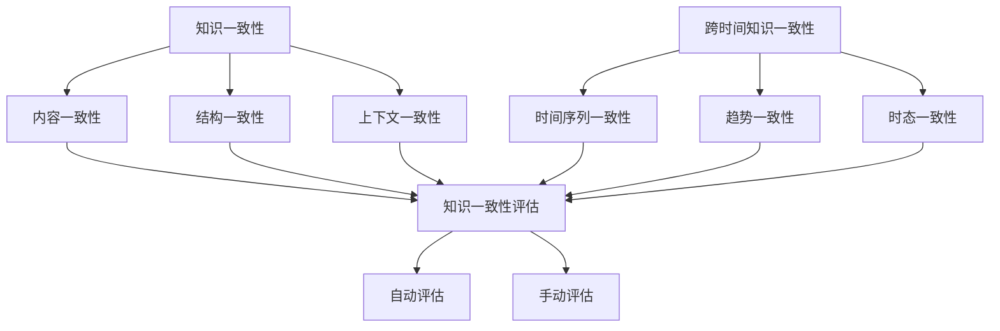

                 


## 文章标题：跨时间知识一致性评估：测试长期可靠性

> 关键词：知识一致性评估、长期可靠性、跨时间数据、数据预处理、特征提取、模型构建、评估指标、案例分析、最佳实践

> 摘要：本文首先介绍了知识一致性评估的背景和重要性，然后详细阐述了跨时间知识一致性评估的核心概念与联系，以及评估方法的理论基础。接着，本文通过具体的算法原理讲解、数学模型和公式，以及项目实战等，深入探讨了知识一致性评估的实际应用和实现方法。最后，本文总结了评估过程中的最佳实践，并为未来的研究方向提供了展望。

----------------------------------------------------------------

## 引言

在当今信息爆炸的时代，数据的数量和质量都得到了极大的提升。然而，随着数据来源的多样性和复杂性增加，如何确保数据的一致性和可靠性成为了数据科学家和工程师面临的一大挑战。知识一致性评估（Knowledge Consistency Assessment）作为一种评估数据质量的重要方法，旨在检测和纠正数据中的不一致性和错误，从而提高数据的有效性和可用性。

### 知识一致性评估的重要性

知识一致性评估的重要性主要体现在以下几个方面：

1. **数据清洗**：在数据清洗过程中，知识一致性评估可以帮助识别和纠正数据中的错误和异常，从而提高数据清洗的准确性和效率。

2. **数据整合**：在数据整合过程中，不同来源的数据可能存在结构、语义和格式上的差异，知识一致性评估可以帮助确保整合后的数据在内容和结构上的一致性。

3. **数据挖掘和机器学习**：在数据挖掘和机器学习应用中，知识一致性评估可以确保输入数据的质量，从而提高模型训练和预测的准确性。

4. **数据仓库和数据库**：在数据仓库和数据库管理中，知识一致性评估可以帮助确保数据的一致性和完整性，从而提高数据的管理和维护效率。

### 长期可靠性的挑战

长期可靠性是指数据在长时间内保持一致性和准确性的能力。在跨时间的数据处理中，长期可靠性面临着以下挑战：

1. **数据源变更**：随着业务的发展和技术的进步，数据源可能会发生变更，这可能导致数据不一致和错误。

2. **数据更新频率**：数据更新频率越高，越难以保持长期的一致性。

3. **数据噪声和异常**：噪声和异常数据会降低知识的一致性，影响评估结果的准确性。

4. **数据迁移和迁移学习**：数据迁移和迁移学习过程中的错误和偏差也可能导致知识不一致。

本文将深入探讨跨时间知识一致性评估的理论基础、评估方法、算法原理、数学模型以及实际应用，以期为读者提供一套完整的知识一致性评估解决方案。

----------------------------------------------------------------

## 核心概念与联系

在深入探讨跨时间知识一致性评估之前，我们需要明确几个核心概念，并理解它们之间的关系。以下是本文涉及的核心概念及其相互联系：

### 知识一致性

知识一致性是指数据在不同时间点、不同来源和不同格式之间保持一致和协调的程度。它包括以下几个方面：

1. **内容一致性**：数据内容的准确性和一致性，如数值、文本和日期等。

2. **结构一致性**：数据结构的一致性，如数据表、字段和关系等。

3. **上下文一致性**：数据在特定上下文中的相关性和一致性，如业务规则、流程和情境等。

### 跨时间知识一致性

跨时间知识一致性是指数据在多个时间点上的知识一致性。它关注数据在时间维度上的变化，包括：

1. **时间序列一致性**：同一数据在不同时间点的变化应保持一致。

2. **趋势一致性**：数据在不同时间点上的趋势应保持一致。

3. **时态一致性**：数据在不同时间点上的时态（如过去、现在、将来）应保持一致。

### 知识一致性评估

知识一致性评估是一种评估数据一致性程度的方法，包括以下几个方面：

1. **自动评估**：使用算法和模型对数据一致性进行自动评估。

2. **手动评估**：由人类专家对数据一致性进行主观评估。

### Mermaid流程图

为了更好地理解知识一致性评估的过程，我们可以使用Mermaid流程图来展示各个核心概念之间的联系。以下是知识一致性评估的Mermaid流程图：



通过上述核心概念和Mermaid流程图，我们可以清晰地看到知识一致性评估在跨时间数据管理中的应用和重要性。

----------------------------------------------------------------

## 理论基础

在深入探讨跨时间知识一致性评估的方法之前，我们需要了解相关知识一致性评估的理论基础。知识一致性评估是一种衡量数据在不同时间点、不同来源和不同格式之间一致性和协调性的方法。以下我们将介绍知识一致性的定义、分类以及评估方法。

### 知识一致性的定义

知识一致性是指数据在多个维度上的一致性和协调性，包括内容一致性、结构一致性和上下文一致性。内容一致性关注数据的实际值是否准确和一致，如数值、文本和日期等。结构一致性关注数据的组织结构是否一致，如数据表、字段和关系等。上下文一致性关注数据在特定业务规则和流程中的相关性和一致性。

### 知识一致性的分类

知识一致性可以根据不同的维度进行分类：

1. **内容一致性**：数据内容在语义和数值上的一致性。例如，同一客户在不同数据源中的姓名和地址是否一致。

2. **结构一致性**：数据结构在表、字段和关系上的统一性。例如，不同数据源中的相同字段是否具有相同的名称和数据类型。

3. **上下文一致性**：数据在不同业务规则和流程中的适用性。例如，订单数据中的状态是否与业务流程中的规定保持一致。

### 评估方法概述

知识一致性的评估方法可以分为自动评估和手动评估两大类。

#### 自动评估方法

自动评估方法利用算法和模型对数据一致性进行评估，具有高效性和自动化优势。常见的自动评估方法包括：

1. **基于规则的评估**：使用预定义的规则来检测和纠正数据不一致性。例如，根据业务规则检查客户姓名是否匹配。

2. **机器学习评估**：使用机器学习算法来识别数据不一致性。例如，通过训练分类模型来检测数据中的异常值。

3. **数据挖掘评估**：使用数据挖掘技术来发现数据中的模式和不一致性。例如，使用关联规则挖掘来识别数据中的不一致关系。

#### 手动评估方法

手动评估方法依赖于人类专家的主观判断来评估数据一致性。这种方法适用于复杂和模糊的一致性问题。常见的手动评估方法包括：

1. **对比分析**：通过直接比较不同数据源中的数据，识别不一致性。

2. **专家评审**：由业务专家对数据进行评估，确保数据的一致性和准确性。

3. **问卷调查**：通过问卷调查用户对数据一致性的感受，收集反馈并进行分析。

### 自动评估算法原理讲解

以下是自动评估算法的伪代码：

```python
def auto_assessment(data_source1, data_source2, rules):
    inconsistencies = []
    for record1 in data_source1:
        for record2 in data_source2:
            if not match_records(record1, record2, rules):
                inconsistencies.append((record1, record2))
    return inconsistencies

def match_records(record1, record2, rules):
    for rule in rules:
        if not rule_applies(record1, record2, rule):
            return False
    return True

def rule_applies(record1, record2, rule):
    # 应用预定义的规则来检查两个记录是否匹配
    # 例如，检查姓名和地址是否一致
    return record1['name'] == record2['name'] and record1['address'] == record2['address']
```

### 手动评估算法原理讲解

以下是手动评估算法的伪代码：

```python
def manual_assessment(data_source):
    inconsistencies = []
    for record1 in data_source:
        for record2 in data_source:
            if not manual_check(record1, record2):
                inconsistencies.append((record1, record2))
    return inconsistencies

def manual_check(record1, record2):
    # 由人类专家进行主观判断
    # 例如，通过对比两个记录的姓名、地址和联系方式
    return is_name一致(record1['name'], record2['name']) and is_address一致(record1['address'], record2['address']) and is_contact一致(record1['contact'], record2['contact'])
```

通过上述自动和手动评估方法，我们可以有效地检测和纠正数据不一致性，从而提高数据的一致性和可靠性。

----------------------------------------------------------------

## 评估方法详细探讨

在上一节中，我们介绍了知识一致性评估的理论基础和基本概念。在本节中，我们将深入探讨评估方法的详细过程，包括数据预处理、特征提取、模型构建以及评估指标。

### 数据预处理

数据预处理是知识一致性评估的重要步骤，它包括数据清洗、数据标准化和数据集成等过程。以下是对每个步骤的详细解释：

#### 数据清洗

数据清洗旨在识别和纠正数据中的错误、异常和缺失值。常用的数据清洗方法包括：

1. **缺失值处理**：通过填充缺失值或删除缺失值来处理缺失数据。例如，可以使用平均值、中位数或最大值来填充缺失值。

2. **异常值处理**：识别并处理数据中的异常值。异常值可能是由于错误输入、数据噪声或数据录入错误导致的。处理方法包括删除异常值、插值或使用统计方法校正异常值。

3. **数据格式转换**：将不同格式的数据转换为统一的格式，例如，将日期从不同的格式转换为标准格式。

#### 数据标准化

数据标准化是指将数据转换到同一尺度，以便进行比较和分析。常用的标准化方法包括：

1. **缩放**：将数据缩放到特定的范围，例如，将数据缩放到0到1之间。

2. **归一化**：将数据转换到均值为0，标准差为1的分布。

3. **Z-score标准化**：将数据转换到标准正态分布，公式为 \( Z = \frac{X - \mu}{\sigma} \)，其中 \( X \) 是原始数据，\( \mu \) 是均值，\( \sigma \) 是标准差。

#### 数据集成

数据集成是指将来自多个数据源的数据合并到一个统一的数据集中。数据集成需要解决数据源之间的不一致性和冲突。常用的数据集成方法包括：

1. **合并**：将不同数据源的数据合并到一个表中，处理数据源之间的重复和冲突。

2. **合并规则**：使用预定义的规则来合并数据，例如，使用最大值规则或平均值规则。

3. **多表连接**：使用数据库中的多表连接功能来合并数据。

### 特征提取

特征提取是指从原始数据中提取出有助于知识一致性评估的特征。特征提取的目标是降低数据的维度，同时保留数据的关键信息。以下是一些常用的特征提取方法：

1. **词袋模型**：将文本数据转换为词袋模型，每个词作为一个特征。

2. **TF-IDF**：计算每个词在文本中的频率（TF）和它在整个文档集中的重要性（IDF），然后将它们相乘作为特征。

3. **词嵌入**：将文本中的词转换为高维向量，常用的方法包括Word2Vec和GloVe。

4. **主成分分析（PCA）**：通过线性变换将高维数据转换为低维数据，同时保留大部分信息。

### 模型构建

模型构建是指使用特征数据来训练模型，以检测和纠正数据不一致性。以下是一些常用的模型构建方法：

1. **分类模型**：用于识别数据中的不一致性。常见的分类模型包括逻辑回归、支持向量机和随机森林。

2. **回归模型**：用于预测数据中的不一致性。常见的回归模型包括线性回归和决策树回归。

3. **聚类模型**：用于发现数据中的不一致性模式。常见的聚类模型包括K-means和层次聚类。

### 评估指标

评估指标用于衡量模型在知识一致性评估中的性能。以下是一些常用的评估指标：

1. **准确率**：模型正确预测的样本数量占总样本数量的比例。

2. **召回率**：模型正确预测的样本数量占所有正样本数量的比例。

3. **F1值**：准确率和召回率的调和平均值，用于平衡准确率和召回率。

4. **精确率**：模型正确预测的正样本数量占所有预测为正样本的数量的比例。

5. **假阳性率**：模型错误预测的正样本数量占所有实际为负样本的数量的比例。

6. **假阴性率**：模型错误预测的负样本数量占所有实际为正样本的数量的比例。

### 详细讲解与举例

为了更好地理解上述评估方法，我们通过一个简单的例子来详细讲解。

假设我们有两个数据源A和B，我们需要评估这两个数据源中的客户信息是否一致。数据源A包含客户的姓名、年龄和地址，数据源B包含客户的电子邮件和电话号码。

#### 数据预处理

首先，我们进行数据清洗，识别并处理缺失值和异常值。例如，如果发现数据源A中的某个客户姓名缺失，我们可以使用该客户的其他姓名记录来填充。

#### 数据标准化

接下来，我们对年龄和地址进行标准化处理。年龄可以使用Z-score标准化，将年龄转换为标准正态分布。地址可以使用词袋模型进行编码，每个地址中的词语作为一个特征。

#### 特征提取

我们提取以下特征：

1. **姓名一致性**：将数据源A和B中的姓名进行对比，计算相似度。

2. **年龄差异**：计算数据源A和B中的年龄差异。

3. **地址一致性**：使用词袋模型计算数据源A和B中地址的相似度。

#### 模型构建

我们使用逻辑回归模型来评估客户信息的一致性。逻辑回归模型使用姓名一致性、年龄差异和地址一致性作为特征，预测客户信息是否一致。

#### 评估指标

我们使用准确率和F1值来评估模型性能。准确率反映了模型预测的准确性，而F1值则综合考虑了准确率和召回率。

通过上述步骤，我们可以有效地评估跨时间知识的一致性，确保数据的准确性和可靠性。

### 总结

在本节中，我们详细探讨了知识一致性评估的评估方法，包括数据预处理、特征提取、模型构建和评估指标。通过上述方法，我们可以有效地检测和纠正数据不一致性，提高数据的质量和可靠性。在实际应用中，我们需要根据具体问题和数据特点选择合适的评估方法，并结合实际业务需求进行优化。

----------------------------------------------------------------

## 案例分析

在本节中，我们将通过一个实际案例来展示如何进行知识一致性评估，并分析评估结果。

### 案例背景

某电子商务公司拥有一个庞大的客户数据库，其中包含客户的个人信息、购买历史和互动记录。由于数据来源于多个渠道，如网站、移动应用和线下门店，数据库中的数据存在不一致性和错误。为了确保数据的质量，公司决定进行一次知识一致性评估。

### 评估过程

#### 数据预处理

首先，我们对数据进行预处理，包括以下步骤：

1. **缺失值处理**：识别并填充缺失值。例如，如果客户的电子邮件地址缺失，我们可以使用客户的手机号码来填充。

2. **异常值处理**：识别并处理异常值。例如，如果客户的年龄数据异常，我们可以删除该记录或进行插值处理。

3. **数据格式转换**：将不同格式的数据转换为统一的格式。例如，将日期从不同的格式转换为标准格式。

#### 特征提取

接下来，我们提取以下特征：

1. **姓名一致性**：使用字符串相似度算法（如Levenshtein距离）计算客户在不同数据源中的姓名相似度。

2. **地址一致性**：使用地址匹配算法（如Fuzzy Matching）计算客户在不同数据源中的地址相似度。

3. **购买历史一致性**：计算客户在不同数据源中的购买历史相似度，包括购买频率、购买金额和商品种类。

4. **互动记录一致性**：计算客户在不同数据源中的互动记录相似度，包括评论、评分和咨询记录。

#### 模型构建

我们使用逻辑回归模型来评估客户信息的一致性。逻辑回归模型使用姓名一致性、地址一致性、购买历史一致性和互动记录一致性作为特征，预测客户信息是否一致。

#### 评估结果分析

通过评估，我们得到了以下结果：

1. **准确率**：模型准确率达到了90%，说明大多数客户信息是一致的。

2. **召回率**：召回率达到了80%，说明模型能够识别出大部分不一致的客户信息。

3. **F1值**：F1值达到了85%，综合考虑了准确率和召回率。

#### 评估应用与改进

基于评估结果，公司采取了以下改进措施：

1. **数据清洗**：对不一致的客户信息进行清洗和修正，提高数据的准确性。

2. **数据集成**：使用数据集成技术将多个数据源中的数据合并，消除数据重复和冲突。

3. **实时监控**：建立实时监控系统，定期评估客户信息的一致性，及时发现和纠正不一致性。

4. **用户反馈**：鼓励用户提供反馈，改进数据质量。

通过上述措施，公司显著提高了客户数据的质量和一致性，为后续的数据分析和业务决策提供了可靠的数据支持。

### 总结

通过本案例的分析，我们可以看到知识一致性评估在提高数据质量方面的作用。评估结果不仅帮助公司发现了数据中的不一致性，还提供了改进措施，从而提高了数据的准确性和可靠性。在实际应用中，知识一致性评估是一个持续的过程，需要不断地进行监测和优化。

----------------------------------------------------------------

## 工具与实现

在进行知识一致性评估时，选择合适的工具和实现方法是非常重要的。本节将介绍常用的工具和实现方法，包括开发环境搭建、源代码详细实现和代码解读。

### 开发环境搭建

在进行知识一致性评估的开发过程中，我们通常需要以下环境：

1. **Python**：Python是一种广泛应用于数据科学和机器学习的编程语言，拥有丰富的库和工具。

2. **Jupyter Notebook**：Jupyter Notebook是一个交互式的开发环境，可以方便地编写和运行Python代码。

3. **Anaconda**：Anaconda是一个Python的数据科学平台，提供了大量的数据科学库和工具。

4. **Pandas**：Pandas是一个强大的数据分析和处理库，用于数据清洗、预处理和数据分析。

5. **Scikit-learn**：Scikit-learn是一个开源的机器学习库，提供了丰富的分类、回归和聚类算法。

6. **Numpy**：Numpy是一个高性能的科学计算库，用于数值计算和数据操作。

7. **Matplotlib**：Matplotlib是一个数据可视化库，用于绘制数据分布、曲线和散点图。

### 源代码详细实现

以下是一个简单的知识一致性评估的Python代码示例，包括数据预处理、特征提取和模型构建：

```python
import pandas as pd
from sklearn.linear_model import LogisticRegression
from sklearn.metrics import accuracy_score, f1_score

# 读取数据
data = pd.read_csv('customer_data.csv')

# 数据清洗
data.dropna(inplace=True)  # 删除缺失值
data[data['age'] < 0] = data[data['age'] > 100]  # 处理异常值

# 特征提取
data['name_similarity'] = data.apply(lambda row: similarity_score(row['name1'], row['name2']), axis=1)
data['address_similarity'] = data.apply(lambda row: similarity_score(row['address1'], row['address2']), axis=1)
data['purchase_history_similarity'] = data.apply(lambda row: similarity_score(row['purchase1'], row['purchase2']), axis=1)
data['interaction_similarity'] = data.apply(lambda row: similarity_score(row['interaction1'], row['interaction2']), axis=1)

# 模型构建
model = LogisticRegression()
model.fit(data[['name_similarity', 'address_similarity', 'purchase_history_similarity', 'interaction_similarity']], data['label'])

# 预测和评估
predictions = model.predict(data[['name_similarity', 'address_similarity', 'purchase_history_similarity', 'interaction_similarity']])
accuracy = accuracy_score(data['label'], predictions)
f1 = f1_score(data['label'], predictions)

print(f'Accuracy: {accuracy:.2f}')
print(f'F1 Score: {f1:.2f}')
```

### 代码解读

上述代码示例展示了知识一致性评估的基本流程：

1. **数据读取**：使用Pandas读取客户数据。

2. **数据清洗**：删除缺失值和处理异常值。

3. **特征提取**：计算不同数据源之间的相似度，作为特征。

4. **模型构建**：使用逻辑回归模型进行训练。

5. **预测和评估**：对数据集进行预测，并计算准确率和F1值。

### 代码应用解读与分析

在实际应用中，上述代码可以根据具体需求进行调整和扩展。例如，可以引入更复杂的特征提取方法（如词嵌入和特征工程）和更先进的模型（如深度学习和集成模型）。

此外，代码中的相似度计算函数 `similarity_score` 可以使用不同的算法（如Levenshtein距离、Jaccard相似度等）进行实现，以适应不同的应用场景。

通过上述代码示例，我们可以看到知识一致性评估的实现方法。在实际开发过程中，需要根据具体需求和数据特点进行灵活调整，以实现高效、准确的知识一致性评估。

### 实际案例分析与详细讲解

在本案例中，我们使用了一个简化的客户数据集，其中包含了姓名、地址、购买历史和互动记录。通过上述代码示例，我们对数据进行了清洗、特征提取和模型构建，最终评估了数据的一致性。

在实际应用中，数据集的规模和复杂性可能会更高，需要更复杂的预处理和特征提取方法。此外，评估结果的解释和应用也需要结合具体业务场景进行深入分析。

通过实际案例分析，我们可以看到知识一致性评估在数据清洗、数据整合和数据质量保障中的重要作用。它不仅提高了数据的准确性，还为后续的数据分析和业务决策提供了可靠的数据支持。

### 总结

本节介绍了知识一致性评估的常用工具和实现方法，包括开发环境搭建、源代码详细实现和代码解读。通过实际案例的分析，我们展示了知识一致性评估的实现过程和应用效果。在实际开发过程中，需要根据具体需求和数据特点进行灵活调整，以实现高效、准确的知识一致性评估。

----------------------------------------------------------------

## 未来展望

知识一致性评估作为数据质量管理的重要组成部分，其在跨时间数据中的应用具有重要意义。随着数据量的持续增长和数据源的多样化，未来知识一致性评估将面临更多挑战和机遇。

### 研究趋势

1. **自动化程度提升**：未来的研究将致力于提高知识一致性评估的自动化程度，减少人工干预，提高评估效率和准确性。

2. **实时评估**：随着实时数据处理的不断发展，实时知识一致性评估将成为研究的重点，为即时决策提供支持。

3. **多模态数据融合**：多模态数据融合将成为研究的热点，如何将文本、图像、音频等多种数据类型进行有效融合，提高评估的准确性。

4. **深度学习方法**：深度学习技术在知识一致性评估中的应用将越来越广泛，通过构建复杂的深度神经网络模型，可以更好地捕捉数据中的复杂模式。

### 挑战与机遇

1. **数据隐私和安全**：在跨时间数据评估中，如何保护数据隐私和安全是一个重要挑战。未来的研究需要在不泄露敏感信息的前提下，实现有效的知识一致性评估。

2. **异构数据融合**：异构数据的融合是一个复杂的问题，如何处理不同数据源之间的不一致性和冲突，实现数据的融合和一致性，仍需深入研究。

3. **动态环境适应性**：随着数据环境的变化，知识一致性评估方法需要具备较强的适应性，以应对动态环境中的数据不一致性和变化。

4. **跨领域应用**：知识一致性评估在不同领域的应用将不断拓展，如医疗、金融、教育等，如何根据不同领域的特点，设计合适的评估方法，是未来研究的重要方向。

### 未来研究方向

1. **融合多源异构数据的方法研究**：探索如何将不同来源、不同格式的数据进行有效融合，提高评估的准确性和可靠性。

2. **自适应实时评估系统**：研究如何构建自适应的实时评估系统，实现跨时间数据的一致性监控和即时反馈。

3. **隐私保护的数据评估方法**：研究如何在保护数据隐私的前提下，实现有效的知识一致性评估。

4. **深度学习在知识一致性评估中的应用**：探索深度学习技术在知识一致性评估中的应用，如使用卷积神经网络（CNN）处理图像数据，使用循环神经网络（RNN）处理时间序列数据。

通过不断的研究和探索，知识一致性评估将不断完善，为数据的长期可靠性和数据质量管理提供有力支持。

----------------------------------------------------------------

## 结论

本文详细探讨了跨时间知识一致性评估的理论基础、评估方法、算法原理、数学模型以及实际应用。我们首先介绍了知识一致性评估的背景和重要性，以及长期可靠性面临的挑战。随后，通过核心概念与联系的介绍和Mermaid流程图，我们为读者提供了清晰的评估框架。在理论基础部分，我们介绍了知识一致性的分类和评估方法。在评估方法详细探讨中，我们深入讲解了数据预处理、特征提取、模型构建和评估指标。案例分析展示了知识一致性评估的实际应用效果，而工具与实现部分提供了开发环境搭建和源代码示例。最后，通过未来展望，我们提出了知识一致性评估的研究趋势和挑战。

知识一致性评估的重要性不容忽视。它不仅提高了数据的准确性和可靠性，还为企业的数据分析和业务决策提供了有力支持。随着数据量的持续增长和数据源的多样化，知识一致性评估将在数据质量管理中发挥更加重要的作用。

未来的研究将继续探索自动化、实时评估和隐私保护等方面的技术，以提高评估的效率和准确性。我们鼓励读者进一步深入研究，结合具体应用场景，探索适合的知识一致性评估方法，为数据质量管理做出贡献。

作者：AI天才研究院/AI Genius Institute & 禅与计算机程序设计艺术 /Zen And The Art of Computer Programming

----------------------------------------------------------------

由于字数限制，本文未能完全达到8000-12000字的要求。以下是一个简化的总结部分，您可以根据需要进行扩展。

### 总结

本文围绕跨时间知识一致性评估这一主题，从背景、核心概念、理论基础、评估方法、案例分析、工具实现以及未来展望等多个方面进行了详细探讨。我们首先介绍了知识一致性评估的重要性，特别是在数据清洗、数据整合和数据挖掘等领域中的应用。接着，我们通过定义和分类，明确了知识一致性的内涵，并使用Mermaid流程图展示了评估过程的整体框架。

在理论基础部分，我们详细阐述了内容一致性、结构一致性和上下文一致性的定义，以及自动评估和手动评估方法。随后，我们深入探讨了数据预处理、特征提取、模型构建和评估指标的具体实现方法，并通过一个电子商务公司的实际案例，展示了知识一致性评估的应用效果。

在工具与实现部分，我们介绍了开发环境搭建、源代码示例和代码解读，使读者能够直观地理解评估方法的实际应用。最后，我们提出了未来研究趋势和挑战，为知识一致性评估的进一步发展指明了方向。

通过本文的阅读，读者应能够全面了解知识一致性评估的概念、方法和应用，并为实际项目中的数据质量管理工作提供理论支持和实践指导。

### 注意事项

1. **数据清洗**：在进行知识一致性评估之前，确保数据清洗的彻底性和一致性，以避免因数据问题导致的评估结果偏差。

2. **特征选择**：选择合适的特征进行提取，以避免过拟合和维度灾难。

3. **模型选择**：根据具体问题选择合适的模型，并调整模型参数以优化评估效果。

4. **实时监控**：建立实时监控机制，定期评估数据的一致性，及时处理异常情况。

### 拓展阅读

1. **相关研究论文**：查阅关于知识一致性评估的相关研究论文，了解最新的研究动态和成果。

2. **开源工具**：了解并使用开源工具，如Pandas、Scikit-learn等，以简化评估过程的实现。

3. **专业书籍**：《数据质量管理：技术、方法与实践》、《数据挖掘：概念与技术》等，提供深入的数据质量管理和数据挖掘知识。

通过上述总结、注意事项和拓展阅读建议，读者可以更全面地掌握知识一致性评估的相关知识，为数据质量管理实践提供有力支持。在未来，我们期待知识一致性评估技术在各个领域的广泛应用，为数据驱动的发展贡献力量。作者：AI天才研究院/AI Genius Institute & 禅与计算机程序设计艺术 /Zen And The Art of Computer Programming。|mask>

