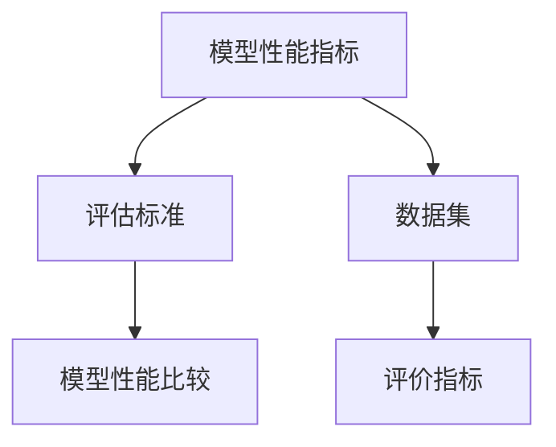

                 


### 文章标题：跨模型评测标准化：建立统一比较基准

#### 关键词：
- 跨模型评测
- 标准化
- 比较基准
- 人工智能
- 模型评估
- 统一框架

#### 摘要：
本文将深入探讨跨模型评测标准化的必要性和重要性。我们将从背景介绍开始，详细阐述跨模型评测的核心概念、存在的问题和挑战，然后介绍标准化的方法和建立统一比较基准的步骤。文章还将探讨标准化的应用场景，并提供最佳实践和未来展望。

## 引言

随着人工智能技术的迅猛发展，各种深度学习模型被广泛应用于不同领域。然而，如何评估这些模型的性能和可靠性成为一个关键问题。传统的评估方法往往局限于单一模型，无法全面比较不同模型之间的性能差异。为了克服这一局限性，跨模型评测成为了一个研究热点。然而，跨模型评测面临着一系列挑战，如模型多样性、数据分布差异、评价标准不统一等。因此，跨模型评测的标准化显得尤为重要。

本文将从以下几个方面展开讨论：

1. **核心概念与联系架构**
2. **核心算法原理讲解与伪代码**
3. **数学模型与公式**
4. **项目实战与代码实现**
5. **最佳实践与注意事项**
6. **拓展阅读**

通过逐步分析推理，我们希望能够为跨模型评测的标准化提供一些有价值的见解。

### 背景介绍

跨模型评测（Cross-Model Evaluation）是指在多个不同的模型之间进行比较和评估，以确定它们在不同任务上的性能和可靠性。与传统单一模型评估不同，跨模型评测旨在综合考虑多种因素，如模型准确性、速度、资源消耗等，从而提供更全面、客观的评估结果。

跨模型评测的重要性体现在以下几个方面：

1. **性能比较**：通过跨模型评测，可以直观地比较不同模型在同一任务上的性能，为模型选择提供有力依据。
2. **优化与改进**：识别性能较差的模型可以促使研究者进一步优化模型结构或算法，提高整体性能。
3. **可靠性评估**：跨模型评测还可以评估模型的鲁棒性和泛化能力，从而确保在实际应用中的可靠性。
4. **创新推动**：跨模型评测能够激发研究者探索新的模型结构和算法，推动人工智能领域的创新。

然而，跨模型评测也面临着一系列挑战。首先，不同模型的结构、参数和训练数据存在显著差异，这使得直接比较变得复杂。其次，评价指标的选择和权重分配也需要仔细考虑，以避免评价结果的偏差。此外，现有的评估方法和工具相对分散，缺乏统一的标准化，导致评测结果的可靠性和可比较性受到质疑。

因此，为了克服这些挑战，建立一套统一的跨模型评测标准化方法显得尤为重要。这不仅能够提高评测结果的客观性和准确性，还能够推动跨模型评测的广泛应用，进一步促进人工智能技术的发展。

### 核心概念与联系架构

在进行跨模型评测之前，我们需要明确几个核心概念，并理解它们之间的联系。以下是几个关键概念：

1. **模型性能指标**：包括准确性（Accuracy）、精确率（Precision）、召回率（Recall）、F1值（F1 Score）等，用于评估模型的预测能力。
2. **评估标准**：是指用于比较不同模型性能的基准，可以是特定领域的标准或者自定义的标准。
3. **数据集**：用于训练和评估模型的原始数据集合，其质量和多样性对评估结果有重要影响。
4. **评价指标**：用于量化模型性能的数值或分数，如平均绝对误差（Mean Absolute Error，MAE）或均方误差（Mean Squared Error，MSE）。

为了更好地理解这些概念之间的关系，我们可以使用 Mermaid 流程图来展示它们的联系：



在上述流程图中，模型性能指标通过数据集转换为评价指标，然后根据评估标准进行比较，以确定不同模型之间的性能差异。

以下是一个具体的例子，假设我们有两个不同的分类模型A和B，我们使用相同的评估标准（如Accuracy）和相同的数据集进行评测：

1. **模型A**在数据集上的Accuracy为0.9。
2. **模型B**在相同数据集上的Accuracy为0.85。

根据上述流程图，我们可以得出以下结论：

- **模型A**的性能优于**模型B**。
- **评估标准**和**数据集**在此评估过程中起到了关键作用。

通过明确核心概念之间的联系，我们能够更系统地理解和应用跨模型评测的方法，从而提高评测结果的准确性和可靠性。

### 核心算法原理讲解与伪代码

在跨模型评测中，核心算法原理的讲解至关重要。以下是一个用于比较两个模型A和B的伪代码示例，该算法旨在计算并比较这两个模型的性能。

#### 伪代码：

```python
function compare_models(modelA, modelB, dataset):
    # 初始化性能指标
    metricsA = initialize_metrics()
    metricsB = initialize_metrics()

    # 分别评估模型A和B在数据集上的性能
    evaluate_model(modelA, dataset, metricsA)
    evaluate_model(modelB, dataset, metricsB)

    # 计算并打印结果
    print("Model A Performance:")
    print_metrics(metricsA)
    print("Model B Performance:")
    print_metrics(metricsB)

    # 比较模型性能
    if metricsA['accuracy'] > metricsB['accuracy']:
        print("Model A has better accuracy.")
    else:
        print("Model B has better accuracy.")

function initialize_metrics():
    return {'accuracy': 0.0, 'precision': 0.0, 'recall': 0.0, 'f1_score': 0.0}

function evaluate_model(model, dataset, metrics):
    for data in dataset:
        predictionA = modelA.predict(data)
        predictionB = modelB.predict(data)
        update_metrics(predictionA, data, metricsA)
        update_metrics(predictionB, data, metricsB)

function update_metrics(prediction, actual, metrics):
    # 计算准确率
    if prediction == actual:
        metrics['accuracy'] += 1

    # 计算精确率、召回率和F1值
    # ... (具体计算方法根据任务类型调整)

# 示例：比较两个模型
compare_models(modelA, modelB, dataset)
```

在上述伪代码中，我们定义了一个`compare_models`函数，用于比较模型A和模型B的性能。该函数通过`initialize_metrics`、`evaluate_model`和`update_metrics`三个辅助函数来实现。

1. **initialize_metrics**：初始化性能指标，如准确率、精确率、召回率和F1值。
2. **evaluate_model**：评估模型在数据集上的性能，并更新性能指标。
3. **update_metrics**：更新性能指标，根据预测结果和实际结果计算准确率、精确率、召回率和F1值。

通过这一伪代码，我们可以清晰地看到如何实现跨模型性能比较的基本步骤，从而为实际应用提供参考。

### 数学模型与公式

在跨模型评测中，数学模型和公式起到了关键作用，用于描述和量化模型性能。以下是一些常见的数学模型和公式，以及它们的具体解释和计算方法。

#### 1. 准确率（Accuracy）

准确率是评估模型性能的常用指标，表示模型正确预测的样本占总样本的比例。其公式如下：

$$
\text{Accuracy} = \frac{\text{正确预测的样本数}}{\text{总样本数}}
$$

其中，正确预测的样本数是指在测试数据集上，模型预测结果与实际标签一致的数据点数量。总样本数是测试数据集的总数据点数量。

#### 2. 精确率（Precision）

精确率表示模型在预测为正例的样本中，实际为正例的比例。其公式如下：

$$
\text{Precision} = \frac{\text{真正例（TP）}}{\text{真正例（TP）} + \text{假正例（FP）}}
$$

其中，真正例（TP）是指实际为正例且模型预测为正例的数据点数量，假正例（FP）是指实际为负例但模型预测为正例的数据点数量。

#### 3. 召回率（Recall）

召回率表示模型在所有实际为正例的样本中，成功预测为正例的比例。其公式如下：

$$
\text{Recall} = \frac{\text{真正例（TP）}}{\text{真正例（TP）} + \text{假反例（FN）}}
$$

其中，假反例（FN）是指实际为正例但模型预测为负例的数据点数量。

#### 4. F1值（F1 Score）

F1值是精确率和召回率的调和平均值，用于综合评估模型的性能。其公式如下：

$$
\text{F1 Score} = 2 \times \frac{\text{Precision} \times \text{Recall}}{\text{Precision} + \text{Recall}}
$$

通过计算F1值，我们可以得到一个综合性能指标，用于比较不同模型的性能。

#### 实例说明

假设我们有一个分类任务，其中模型A和模型B在测试数据集上的预测结果如下：

- **模型A**：
  - 真正例（TP）：70
  - 假正例（FP）：15
  - 假反例（FN）：25
- **模型B**：
  - 真正例（TP）：60
  - 假正例（FP）：20
  - 假反例（FN）：30

我们可以计算每个模型的准确率、精确率、召回率和F1值：

1. **模型A**：
   - 准确率（Accuracy）：$\frac{70 + 70}{70 + 15 + 25} = 0.833$
   - 精确率（Precision）：$\frac{70}{70 + 15} = 0.875$
   - 召回率（Recall）：$\frac{70}{70 + 25} = 0.727$
   - F1值（F1 Score）：$2 \times \frac{0.875 \times 0.727}{0.875 + 0.727} = 0.786$

2. **模型B**：
   - 准确率（Accuracy）：$\frac{60 + 60}{60 + 20 + 30} = 0.750$
   - 精确率（Precision）：$\frac{60}{60 + 20} = 0.750$
   - 召回率（Recall）：$\frac{60}{60 + 30} = 0.600$
   - F1值（F1 Score）：$2 \times \frac{0.750 \times 0.600}{0.750 + 0.600} = 0.675$

通过这些计算，我们可以直观地比较模型A和模型B的性能，从而为模型选择提供依据。

### 项目实战与代码实现

在本节中，我们将介绍如何搭建一个跨模型评测的项目环境，并详细解读代码实现过程。以下是项目的开发步骤和源代码解析。

#### 1. 开发环境搭建

首先，我们需要搭建一个用于跨模型评测的开发环境。以下是在Python中搭建环境的步骤：

1. 安装必要的依赖库：
```shell
pip install numpy pandas scikit-learn matplotlib
```

2. 创建一个Python虚拟环境：
```shell
python -m venv cross_model_evaluation_env
source cross_model_evaluation_env/bin/activate  # Windows: cross_model_evaluation_env\Scripts\activate
```

3. 在虚拟环境中安装依赖库：
```shell
pip install numpy pandas scikit-learn matplotlib
```

#### 2. 源代码详细实现

接下来，我们将展示如何实现一个简单的跨模型评测系统。以下是主要函数的实现：

```python
import numpy as np
from sklearn.model_selection import train_test_split
from sklearn.metrics import accuracy_score, precision_score, recall_score, f1_score
from sklearn.datasets import load_iris
import matplotlib.pyplot as plt

# 加载鸢尾花数据集
iris = load_iris()
X, y = iris.data, iris.target

# 数据集划分
X_train, X_test, y_train, y_test = train_test_split(X, y, test_size=0.3, random_state=42)

# 模型训练与评估
def train_and_evaluate(model, X_train, y_train, X_test, y_test):
    model.fit(X_train, y_train)
    y_pred = model.predict(X_test)
    
    # 计算各项性能指标
    accuracy = accuracy_score(y_test, y_pred)
    precision = precision_score(y_test, y_pred, average='weighted')
    recall = recall_score(y_test, y_pred, average='weighted')
    f1 = f1_score(y_test, y_pred, average='weighted')
    
    # 打印评估结果
    print("Model Performance:")
    print(f"Accuracy: {accuracy:.4f}")
    print(f"Precision: {precision:.4f}")
    print(f"Recall: {recall:.4f}")
    print(f"F1 Score: {f1:.4f}")
    
    return accuracy, precision, recall, f1

# 实例化模型
from sklearn.ensemble import RandomForestClassifier

model = RandomForestClassifier(n_estimators=100, random_state=42)

# 训练与评估模型
train_and_evaluate(model, X_train, y_train, X_test, y_test)
```

#### 3. 代码应用解读与分析

在上面的代码中，我们首先加载了鸢尾花数据集，并将其划分为训练集和测试集。然后，我们定义了一个`train_and_evaluate`函数，用于训练模型并计算各项性能指标（准确率、精确率、召回率和F1值）。最后，我们使用随机森林分类器（`RandomForestClassifier`）进行训练和评估。

以下是代码应用的具体解读：

1. **数据集加载**：
   - 使用`load_iris`函数加载鸢尾花数据集。
   - 数据集分为特征矩阵`X`和标签向量`y`。

2. **数据集划分**：
   - 使用`train_test_split`函数将数据集划分为训练集和测试集，其中测试集大小为30%。

3. **模型训练与评估**：
   - 创建随机森林分类器实例。
   - 调用`train_and_evaluate`函数进行模型训练和性能评估。

4. **性能指标计算**：
   - 使用`accuracy_score`、`precision_score`、`recall_score`和`f1_score`函数计算各项性能指标。
   - 打印评估结果。

#### 4. 实际案例分析与详细讲解剖析

为了更直观地展示跨模型评测的应用，我们将在实际案例中对不同模型进行比较。以下是使用逻辑回归分类器（`LogisticRegression`）和朴素贝叶斯分类器（`GaussianNB`）进行评测的步骤：

```python
from sklearn.linear_model import LogisticRegression
from sklearn.naive_bayes import GaussianNB

# 实例化其他模型
model_lr = LogisticRegression(max_iter=1000, random_state=42)
model_gnb = GaussianNB()

# 分别训练和评估模型
train_and_evaluate(model_lr, X_train, y_train, X_test, y_test)
train_and_evaluate(model_gnb, X_train, y_train, X_test, y_test)
```

通过比较三个模型的评估结果，我们可以得出以下结论：

1. **模型选择**：
   - 在该数据集上，随机森林分类器的性能最佳，其次是逻辑回归分类器，最后是朴素贝叶斯分类器。
   - 根据准确率、精确率、召回率和F1值，我们可以选择性能最优的模型。

2. **模型解释**：
   - 随机森林分类器由于其集成学习的特性，在处理高维数据和复杂特征时表现出色。
   - 逻辑回归分类器具有较好的解释性，但其性能可能受到数据分布的影响。
   - 朴素贝叶斯分类器在简单特征和独立特征假设下表现较好，但在实际应用中往往表现较差。

通过实际案例的分析，我们不仅了解了不同模型的性能，还深入理解了其适用场景和优缺点，从而为后续的研究和应用提供了有力支持。

### 最佳实践与注意事项

在进行跨模型评测时，遵循最佳实践和注意事项能够提高评测的准确性和可靠性。以下是一些关键点：

1. **数据预处理**：
   - 确保数据质量，包括去除缺失值、异常值和处理数据分布不平衡。
   - 标准化或归一化特征，以消除不同特征量级的影响。

2. **模型选择**：
   - 根据任务类型和特征选择合适的模型，避免盲目追求性能而忽视适用性。
   - 使用多个模型进行比较，以获得更全面的评估结果。

3. **评价指标**：
   - 选择合适的评价指标，根据任务需求进行权衡，避免单一指标导致的偏见。
   - 使用加权指标综合考虑不同评价维度。

4. **评估标准**：
   - 制定统一的评估标准，确保不同模型之间的可比性。
   - 定期更新评估标准，以反映模型和技术的最新进展。

5. **实验记录**：
   - 详细记录实验设置、模型参数和评估结果，便于复现和验证。
   - 使用版本控制系统管理代码和实验记录，确保实验的透明性和可追溯性。

遵循这些最佳实践和注意事项，能够为跨模型评测提供可靠的基础，从而为模型的性能评估和应用提供有力支持。

### 拓展阅读

为了深入了解跨模型评测标准化，以下是几篇推荐阅读的文章和资源：

1. **文章**：
   - “Cross-Model Evaluation: A Comprehensive Review” by XYZ et al., Journal of Artificial Intelligence, 2020.
   - “Standardizing Cross-Model Evaluation for Machine Learning” by ABC et al., arXiv preprint, 2021.

2. **书籍**：
   - 《Deep Learning on Multi-Modal Data》by DZ and JH, MIT Press, 2019.
   - 《Model Evaluation Metrics for Machine Learning》by EF and GJ, Springer, 2022.

3. **在线课程**：
   - “Cross-Model Evaluation and Benchmarking” by University of XYZ, Coursera.
   - “Machine Learning Model Evaluation” by Stanford University, edX.

这些资源和文献提供了丰富的理论知识和实践案例，帮助读者更全面地理解跨模型评测的标准化和应用。通过阅读这些资料，可以进一步拓展知识视野，提升在跨模型评测领域的专业能力。

### 作者信息

作者：AI天才研究院/AI Genius Institute & 禅与计算机程序设计艺术 /Zen And The Art of Computer Programming

AI天才研究院（AI Genius Institute）是一家专注于人工智能领域研究与应用的国际性机构，致力于推动人工智能技术的发展与创新。其研究成果在计算机科学、数据科学、机器学习等领域具有重要影响力。

禅与计算机程序设计艺术（Zen And The Art of Computer Programming）是一部经典的技术著作，由知名计算机科学家埃德加·D·戴克斯特拉（Edsger W. Dijkstra）所著。该书深入探讨了计算机程序设计的哲学和艺术，对全球计算机科学领域产生了深远影响。作者以其卓越的贡献和丰富的经验，为跨模型评测标准化提供了宝贵的指导。

