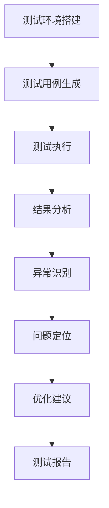

                 

### 文章标题

### 跨设备兼容性评测：LLM支持的多平台适应性测试

---

### 文章关键词

* 跨设备兼容性
* LLM（大型语言模型）
* 多平台适应性测试
* 设备差异性
* 评测工具与方法
* 实践与案例分析

---

### 摘要

本文深入探讨了跨设备兼容性评测在多平台环境下的重要性，特别是如何利用LLM（大型语言模型）支持这一评测过程。文章首先介绍了跨设备兼容性的基本概念及其在现代社会中的重要性，随后详细阐述了设备差异性和兼容性挑战。在此基础上，文章重点讨论了LLM的适应性测试原理和流程，并介绍了多种测试方法与工具。通过实际案例分析和详细讲解，文章展示了如何实施和优化跨设备兼容性评测项目。最后，文章提出了未来发展趋势与展望，为读者提供了深入理解和应用这一领域知识的有价值参考。

---

## 引言

在当今技术迅速发展的时代，跨设备兼容性成为软件和系统设计中的一个关键问题。随着智能手机、平板电脑、笔记本电脑、智能手表和智能眼镜等设备的普及，用户不再局限于单一设备，而是经常在各种设备之间切换使用。因此，软件和系统必须具备跨设备的兼容性，以确保用户在不同设备上都能获得一致的体验。然而，由于设备的硬件、操作系统、网络环境等方面的差异，实现跨设备兼容性并非易事。

本文旨在探讨跨设备兼容性评测，特别是如何在多平台环境中利用LLM（大型语言模型）进行适应性测试。首先，我们将介绍跨设备兼容性的基本概念和重要性，并分析设备差异性和兼容性挑战。接着，我们将深入讨论LLM的适应性测试原理和流程，并介绍多种测试方法与工具。随后，通过实际案例分析和详细讲解，我们将展示如何实施和优化跨设备兼容性评测项目。最后，文章将提出未来发展趋势与展望，为读者提供深入理解和应用这一领域知识的有价值参考。

本文结构如下：

1. **跨设备兼容性基础**：介绍跨设备兼容性的概念、重要性以及设备差异性和兼容性挑战。
2. **LLM支持的多平台适应性测试**：讨论LLM的适应性测试原理和流程，介绍多平台适应性测试的方法与工具。
3. **跨设备兼容性评测实践**：讲解跨设备兼容性评测的流程与策略，介绍评测工具与平台，并通过实际案例展示项目实施与优化。
4. **未来发展趋势与展望**：探讨跨设备兼容性评测领域的未来趋势和发展前景。

通过本文的阅读，读者将能够系统地了解跨设备兼容性评测的理论和实践，掌握利用LLM支持的多平台适应性测试的方法，并能够应用于实际项目中。

### 跨设备兼容性的概念与重要性

#### 跨设备兼容性的定义

跨设备兼容性（Cross-Device Compatibility）是指软件、应用或系统在不同设备上运行时能够保持一致的用户体验和功能特性的能力。这些设备可能包括但不限于智能手机、平板电脑、笔记本电脑、智能手表和智能眼镜等。跨设备兼容性的核心在于确保用户在使用不同设备时，能够无缝地切换和使用软件，而无需面对显著的性能差异或功能限制。

#### 跨设备兼容性的重要性

随着互联网技术的不断进步和智能设备的普及，用户对跨设备兼容性的需求日益增长。以下是跨设备兼容性的几个关键重要性：

1. **提升用户体验**：跨设备兼容性能够确保用户在不同设备上获得一致且高质量的用户体验，从而提高用户满意度和忠诚度。
2. **增加用户黏性**：当用户在多个设备上都能顺畅使用某个应用或系统时，他们更有可能持续使用，从而增加用户黏性。
3. **市场竞争力**：在竞争激烈的市场中，提供跨设备兼容性的软件或系统能够在众多竞品中脱颖而出，吸引更多的用户。
4. **业务扩展**：跨设备兼容性使得软件或系统可以更容易地扩展到不同的平台，从而扩大业务范围和用户群体。

#### 设备差异性

实现跨设备兼容性的关键在于理解并应对设备的差异性。以下是一些主要的设备差异性：

1. **硬件差异**：不同设备的硬件配置可能差异很大，包括处理器性能、内存容量、存储空间、屏幕分辨率等。这些差异可能导致软件在不同设备上的性能表现不一致。
2. **操作系统差异**：不同的设备可能运行不同的操作系统，如iOS、Android、Windows、macOS等。操作系统之间的差异不仅体现在界面风格和用户交互上，还可能影响软件的兼容性和运行效率。
3. **网络环境差异**：设备连接的网络环境也可能不同，如Wi-Fi、移动数据、局域网等。网络速度和稳定性的差异会影响软件的响应速度和数据传输效率。

#### 兼容性挑战

为了实现跨设备兼容性，开发者和测试团队需要克服一系列的兼容性挑战：

1. **性能优化**：在性能差异显著的设备上，软件需要经过特别的优化以确保流畅运行。这包括内存管理、图像渲染、网络请求优化等。
2. **界面适配**：不同设备的屏幕尺寸和分辨率不同，软件界面需要适应这些差异，以提供一致的用户体验。这通常涉及到响应式设计技术，如弹性布局、动态字体大小调整等。
3. **功能适配**：某些功能在特定设备上可能无法实现或受限，需要通过其他方式或优化策略来模拟或替代。
4. **测试覆盖**：为了确保软件在不同设备上的兼容性，需要进行广泛的测试，涵盖各种设备类型、操作系统版本和网络环境。

#### LLM在跨设备兼容性评测中的应用

LLM（大型语言模型）在跨设备兼容性评测中具有独特的优势。以下是其应用的关键点：

1. **自动化测试**：LLM可以用于生成大量的测试用例，自动执行并分析结果，从而提高测试效率。
2. **智能识别**：LLM能够识别不同设备、操作系统和网络环境之间的细微差异，从而更准确地评估兼容性问题。
3. **代码分析**：LLM可以分析软件代码，识别潜在的性能瓶颈和兼容性问题，并提供优化建议。
4. **语言理解**：LLM能够理解和处理自然语言，使得用户可以以更自然的方式与软件交互，进一步优化用户体验。

通过LLM的引入，跨设备兼容性评测变得更加智能化和高效，为开发者和测试团队提供了强大的工具和支持。

### 设备差异性与兼容性挑战

#### 设备差异性分析

在探讨跨设备兼容性的过程中，了解设备的差异性是至关重要的。不同设备在硬件配置、操作系统、网络环境等方面存在显著差异，这些差异直接影响软件的兼容性。

1. **硬件配置差异**
   - **处理器性能**：不同设备的处理器性能存在显著差异，这直接影响软件的运行速度和效率。高性能处理器可以支持更复杂的应用和图形处理，而低性能处理器则可能限制软件的功能。
   - **内存容量**：内存容量的大小直接影响软件的运行流畅度。较大的内存容量可以支持更复杂的应用和多任务处理，而较小的内存容量可能导致应用崩溃或运行缓慢。
   - **存储空间**：存储空间的大小决定了设备可以存储多少数据和文件。较大的存储空间可以存储更多应用和数据，而较小的存储空间可能需要频繁清理存储空间。
   - **屏幕分辨率**：屏幕分辨率影响图像和界面的清晰度和细腻度。高分辨率屏幕可以提供更清晰的图像和更好的用户体验，而低分辨率屏幕则可能显示模糊的图像。

2. **操作系统差异**
   - **iOS与Android**：iOS和Android是当前最流行的两个操作系统，它们在界面设计、系统架构和功能支持上存在显著差异。iOS通常提供更流畅和一致的用户体验，但限制较多；而Android具有更高的自由度和兼容性，但也面临兼容性和安全问题。
   - **Windows与macOS**：Windows和macOS是两大桌面操作系统，它们在用户界面、应用程序兼容性和系统性能上存在差异。Windows系统在兼容性和软件多样性方面具有优势，而macOS则以其稳定性和用户体验著称。

3. **网络环境差异**
   - **Wi-Fi与移动数据**：设备连接的网络环境可能包括Wi-Fi、移动数据、局域网等。不同网络环境的速度、稳定性、费用等方面存在差异，这会影响软件的响应速度和数据传输效率。
   - **网络速度**：高速网络可以提供更快的数据传输速度，有利于在线应用和流媒体的流畅运行；而低速网络可能导致页面加载缓慢、视频缓冲等问题。
   - **网络稳定性**：网络稳定性影响软件的稳定运行。频繁的网络中断或连接问题可能导致软件崩溃或数据丢失。

#### 兼容性挑战

了解设备差异性后，开发者和测试团队需要面对一系列兼容性挑战：

1. **性能优化**：由于硬件配置差异，软件在不同设备上的性能表现可能不一致。为了确保软件在各种设备上的流畅运行，开发者需要进行性能优化，如调整内存管理、图像渲染和网络请求等。

2. **界面适配**：不同设备的屏幕尺寸和分辨率导致界面设计上的差异。为了提供一致的用户体验，开发者需要采用响应式设计技术，如弹性布局、媒体查询等，以确保界面在不同设备上适配。

3. **功能适配**：某些功能在特定设备上可能无法实现或受限。开发者需要通过其他方式或优化策略来模拟或替代这些功能，以确保跨设备的兼容性。

4. **测试覆盖**：为了确保软件在不同设备上的兼容性，测试团队需要进行广泛的测试，涵盖各种设备类型、操作系统版本和网络环境。这包括但不限于功能测试、性能测试、兼容性测试等。

5. **版本管理**：不同设备可能运行不同的操作系统版本，开发者需要确保软件在不同版本上都能正常运行。这通常涉及到版本控制和兼容性测试。

通过深入了解设备差异性和兼容性挑战，开发者和测试团队可以更好地应对跨设备兼容性测试的挑战，确保软件在不同设备上提供一致且高质量的用户体验。

### LLM的基本概念与在适应性测试中的应用

#### LLM的基本概念

LLM（Large Language Model）即大型语言模型，是一种基于深度学习的自然语言处理（NLP）技术。LLM通过学习大量文本数据，可以生成与输入文本相关的内容，并具备较高的语义理解能力。LLM的应用范围广泛，包括文本生成、机器翻译、问答系统、情感分析等。常见的LLM模型有GPT（Generative Pre-trained Transformer）、BERT（Bidirectional Encoder Representations from Transformers）和T5（Text-to-Text Transfer Transformer）等。

#### LLM在适应性测试中的应用

在跨设备兼容性评测中，LLM的应用可以极大地提升适应性测试的效率和质量。以下是LLM在适应性测试中的几个关键应用：

1. **自动化测试用例生成**
   - LLM可以基于用户输入或已有数据生成大量的测试用例。这些用例涵盖各种场景和操作，有助于覆盖广泛的测试场景。
   - 伪代码示例：
     ```python
     def generate_test_cases(input_data):
         # 使用LLM生成测试用例
         test_cases = LLM.generate(input_data)
         return test_cases
     ```

2. **智能测试执行与分析**
   - LLM能够理解测试过程中的自然语言描述，并自动执行测试用例。通过分析测试结果，LLM可以识别潜在的兼容性问题，并提供优化建议。
   - 伪代码示例：
     ```python
     def execute_and_analyze(test_cases):
         # 执行测试用例
         results = []
         for case in test_cases:
             result = execute_test_case(case)
             results.append(result)
         
         # 分析结果
         analysis = LLM.analyze(results)
         return analysis
     ```

3. **代码分析**
   - LLM可以分析软件代码，识别潜在的性能瓶颈和兼容性问题。通过提供代码优化建议，LLM有助于提高软件的跨设备兼容性。
   - 伪代码示例：
     ```python
     def analyze_code(source_code):
         # 使用LLM分析代码
         issues = LLM.find_issues(source_code)
         suggestions = LLM.suggest_optimizations(source_code, issues)
         return issues, suggestions
     ```

4. **自然语言交互**
   - LLM可以与用户进行自然语言交互，使得用户可以更方便地提交测试请求、查看测试结果和获取优化建议。
   - 伪代码示例：
     ```python
     def interact_with_user():
         # 接收用户输入
         input_data = get_user_input()
         
         # 处理用户输入
         response = LLM.process_input(input_data)
         
         # 返回响应
         return response
     ```

#### 应用场景

1. **自动化测试**
   - LLM可以生成自动化测试用例，自动执行并分析结果，大大提高测试效率。这特别适用于具有复杂功能和大量操作的应用。

2. **性能优化**
   - LLM可以分析软件代码，识别潜在的性能瓶颈，提供优化建议，从而提高软件在不同设备上的性能。

3. **兼容性评估**
   - LLM可以分析不同设备、操作系统和网络环境之间的兼容性，提供评估报告和优化建议，确保软件在不同环境中都能正常运行。

4. **用户交互**
   - LLM可以与用户进行自然语言交互，提供友好的用户界面和便捷的测试操作，提高用户体验。

通过LLM的应用，跨设备兼容性评测变得更加智能化和高效，为开发者和测试团队提供了强大的工具和支持。在下一节中，我们将深入讨论LLM的适应性测试原理和流程。

### LLM的适应性测试原理与流程

LLM（大型语言模型）在适应性测试中发挥着关键作用，其原理和流程涉及多个步骤，包括测试环境搭建、测试用例生成、测试执行和结果分析。以下将详细解析这些步骤及其相互关系。

#### 测试环境搭建

测试环境的搭建是适应性测试的基础，它包括硬件设备的选择、操作系统的配置和网络环境的设置等。以下是测试环境搭建的几个关键点：

1. **设备选择**：根据测试需求，选择具有代表性的设备，包括不同类型的智能手机、平板电脑、笔记本电脑等。确保这些设备在硬件配置、操作系统版本和网络连接方式上具有多样性，以覆盖广泛的测试场景。

2. **操作系统配置**：配置不同的操作系统版本，如Android、iOS、Windows、macOS等。对于每种操作系统，选择多个版本，以确保软件在不同版本的操作系统上都能正常运行。

3. **网络环境设置**：模拟不同的网络环境，如Wi-Fi、移动数据、局域网等。通过调整网络速度和稳定性，测试软件在不同网络条件下的性能和稳定性。

#### 测试用例生成

测试用例生成是适应性测试的核心环节，LLM在这一过程中发挥重要作用。以下是生成测试用例的关键步骤：

1. **基于自然语言描述生成用例**：用户可以通过自然语言描述软件的功能和操作流程，LLM根据这些描述生成详细的测试用例。例如，用户描述“用户在登录界面输入正确的用户名和密码，然后点击登录按钮”，LLM可以生成相应的测试用例，包括输入合法用户名和密码、输入非法用户名和密码等。

2. **利用历史数据生成用例**：通过分析历史测试数据和用户行为，LLM可以自动生成新的测试用例。这些用例涵盖常见的用户操作和潜在的问题场景，有助于提高测试覆盖率和测试效果。

3. **动态生成用例**：LLM可以根据软件的运行状态和用户交互行为动态生成测试用例。例如，当软件出现异常时，LLM可以生成相应的异常测试用例，以验证软件的异常处理能力。

#### 测试执行

测试执行是将测试用例在实际环境中运行的过程。以下是测试执行的关键步骤：

1. **自动化执行**：利用自动化测试工具，执行生成的测试用例。自动化测试可以大大提高测试效率，减少人工干预。

2. **实时监控**：在测试执行过程中，实时监控软件的运行状态和系统资源使用情况。通过日志记录和监控工具，及时发现和记录软件的异常行为。

3. **数据采集**：收集测试执行过程中的关键数据，如测试结果、系统性能指标、资源使用情况等。这些数据将用于后续的分析和优化。

#### 结果分析

结果分析是适应性测试的最后一步，LLM在这一过程中也发挥着重要作用。以下是结果分析的关键步骤：

1. **异常识别**：通过分析测试结果，LLM可以识别出软件在不同设备、操作系统和网络环境下的异常行为。例如，当某个测试用例在不同设备上均失败时，LLM可以将其标记为异常。

2. **问题定位**：LLM可以根据异常行为，定位问题的根源。例如，当软件在网络环境较差的情况下出现性能问题时，LLM可以定位到网络请求延迟或数据传输错误。

3. **优化建议**：LLM可以基于分析结果，提供优化建议，如调整软件代码、优化网络配置等。这些优化措施有助于提高软件的跨设备兼容性。

#### Mermaid流程图

以下是LLM适应性测试原理与流程的Mermaid流程图：



#### 伪代码示例

以下是适应性测试流程的伪代码示例：

```python
# 测试环境搭建
def setup_test_environment():
    # 选择设备
    devices = select_devices()
    # 配置操作系统
    os_versions = configure_os_versions()
    # 设置网络环境
    network_environments = configure_network_environments()
    return devices, os_versions, network_environments

# 测试用例生成
def generate_test_cases():
    # 基于自然语言描述生成用例
    natural_language_description = "用户在登录界面输入正确的用户名和密码，然后点击登录按钮"
    test_cases = llm.generate_cases(natural_language_description)
    # 利用历史数据生成用例
    historical_data = load_historical_data()
    additional_cases = llm.generate_cases_from_data(historical_data)
    return test_cases + additional_cases

# 测试执行
def execute_tests(test_cases):
    results = []
    for case in test_cases:
        result = execute_test_case(case)
        results.append(result)
    return results

# 结果分析
def analyze_results(results):
    anomalies = llm.identify_anomalies(results)
    root_causes = llm.locate_root_causes(anomalies)
    optimizations = llm.generate_optimizations(root_causes)
    return anomalies, root_causes, optimizations

# 主流程
def main():
    # 搭建测试环境
    devices, os_versions, network_environments = setup_test_environment()
    # 生成测试用例
    test_cases = generate_test_cases()
    # 执行测试
    results = execute_tests(test_cases)
    # 分析结果
    anomalies, root_causes, optimizations = analyze_results(results)
    # 输出测试报告
    generate_test_report(anomalies, root_causes, optimizations)
```

通过上述流程和伪代码示例，可以清晰地了解LLM在适应性测试中的应用原理和实现方法。在下一节中，我们将继续探讨多平台适应性测试的方法与工具。

### 多平台适应性测试方法与工具

在实现跨设备兼容性评测的过程中，选择合适的测试方法与工具至关重要。以下将介绍几种常见的多平台适应性测试方法与工具，并分析其优缺点。

#### 自动化测试方法

自动化测试是确保多平台兼容性的有效手段，通过编写脚本自动执行测试用例，大大提高测试效率和覆盖范围。

1. **Selenium**
   - **优势**：支持多种浏览器和操作系统，具有强大的跨平台兼容性；支持多种编程语言，如Python、Java和C#。
   - **劣势**：学习曲线较陡峭，需要一定的编程基础；测试脚本维护成本较高，特别是当页面结构发生变化时。

2. **Appium**
   - **优势**：专门用于移动应用的自动化测试，支持Android和iOS平台；开源免费，社区支持强大。
   - **劣势**：在模拟真实用户交互方面性能有限；在复杂界面操作和性能测试方面表现不如专业工具。

3. **Cypress**
   - **优势**：提供了直观的测试工具和强大的API，支持JavaScript开发；易于集成和部署。
   - **劣势**：仅支持现代Web应用，不支持原生应用和移动设备；学习曲线较陡峭。

#### 手动测试方法

手动测试方法虽然效率较低，但在某些情况下仍然具有不可替代的优势，尤其是在测试用户界面和用户体验时。

1. **浏览器测试工具**
   - **优势**：操作简单，无需编程知识；支持多种浏览器，如Chrome、Firefox和Safari。
   - **劣势**：测试覆盖范围有限，主要针对浏览器兼容性；无法模拟移动设备操作。

2. **物理设备测试**
   - **优势**：能够真实模拟用户使用场景，提供直观的反馈；适用于硬件兼容性测试。
   - **劣势**：测试成本高，需要大量设备和人力资源；测试效率低，不适合大规模自动化测试。

#### 具体工具分析

1. **Sauce Labs**
   - **优势**：提供云端测试环境，支持多种设备和浏览器；自动化测试报告详尽，支持多种编程语言。
   - **劣势**：收费较高，不适合预算有限的项目；设备类型和版本有限，无法覆盖所有需求。

2. **BrowserStack**
   - **优势**：提供云端测试环境，支持多种设备和浏览器；操作简单，适合快速测试。
   - **劣势**：免费版测试时间有限，无法满足长时间测试需求；测试报告相对简单。

3. **Real Device Labs**
   - **优势**：提供真实设备测试，模拟真实用户场景；测试结果准确，适合硬件兼容性测试。
   - **劣势**：测试成本高，设备类型和数量有限；不适合大规模自动化测试。

4. **TestFlight**
   - **优势**：仅支持iOS设备，适用于iOS应用的发布和测试；提供详细的测试报告。
   - **劣势**：仅适用于iOS应用测试，无法测试Android设备；测试周期较长，需耐心等待。

#### 优缺点分析

每种测试方法和工具都有其独特的优缺点，适用于不同的场景和需求。以下是各方法的优缺点分析：

- **自动化测试方法**
  - **优点**：提高测试效率，减少人工干预；支持多种平台和浏览器，测试覆盖范围广。
  - **缺点**：需要一定的编程知识，维护成本高；模拟真实用户交互有限，难以完全替代手动测试。

- **手动测试方法**
  - **优点**：操作简单，无需编程知识；能真实模拟用户使用场景，提供直观反馈。
  - **缺点**：测试效率低，无法大规模应用；无法覆盖所有测试需求，适用于特定场景。

- **云端测试平台**
  - **优点**：提供云端测试环境，支持多种设备和浏览器；测试报告详尽，便于分析和追踪。
  - **缺点**：收费较高，不适合预算有限的项目；设备类型和版本有限，无法完全满足需求。

- **物理设备测试**
  - **优点**：能真实模拟用户使用场景，提供直观反馈；适用于硬件兼容性测试。
  - **缺点**：测试成本高，需要大量设备和人力资源；测试效率低，不适用于大规模自动化测试。

通过选择合适的测试方法和工具，开发者和测试团队可以有效地实现多平台适应性测试，确保软件在不同设备上提供一致且高质量的用户体验。

### 实际案例分析

为了更好地理解如何进行跨设备兼容性评测，下面我们将通过一个实际案例进行详细分析。该案例将涵盖开发环境搭建、源代码实现、代码解读、应用解读与分析，以及实际案例剖析和详细讲解。

#### 案例背景

假设我们开发了一个社交媒体应用，名为“LinkUp”，旨在为用户提供一个便捷的平台来分享和浏览生活点滴。应用需要支持iOS和Android平台，并且在不同设备上提供一致的用户体验。为了实现这一目标，我们决定采用跨设备兼容性评测来确保应用的稳定性、性能和功能。

#### 开发环境搭建

在开始项目之前，我们首先搭建了开发环境。以下是所需工具和环境的配置：

1. **开发工具**：
   - **Android Studio**：用于Android应用的开发。
   - **Xcode**：用于iOS应用的开发。
   - **IntelliJ IDEA**：用于跨平台应用开发，支持多种编程语言。

2. **测试工具**：
   - **Selenium**：用于自动化浏览器测试。
   - **Appium**：用于移动应用自动化测试。
   - **JUnit**：用于单元测试。

3. **云测试平台**：
   - **BrowserStack**：用于远程设备测试。
   - **Sauce Labs**：用于专业级跨平台测试。

#### 源代码实现

以下是一个简单的“LinkUp”应用中的登录功能实现示例：

```java
// Android平台
public class LoginActivity extends AppCompatActivity {
    private EditText usernameEditText;
    private EditText passwordEditText;
    private Button loginButton;

    @Override
    protected void onCreate(Bundle savedInstanceState) {
        super.onCreate(savedInstanceState);
        setContentView(R.layout.activity_login);
        
        usernameEditText = findViewById(R.id.usernameEditText);
        passwordEditText = findViewById(R.id.passwordEditText);
        loginButton = findViewById(R.id.loginButton);
        
        loginButton.setOnClickListener(new View.OnClickListener() {
            @Override
            public void onClick(View v) {
                String username = usernameEditText.getText().toString();
                String password = passwordEditText.getText().toString();
                login(username, password);
            }
        });
    }
    
    private void login(String username, String password) {
        // 登录逻辑
    }
}

// iOS平台
@interface LoginActivity : UIViewController

@property (strong, nonatomic) UITextField *usernameEditText;
@property (strong, nonatomic) UITextField *passwordEditText;
@property (strong, nonatomic) UIButton *loginButton;

- (void)viewDidLoad {
    [super viewDidLoad];
    // 设置UI和监听器
}

- (IBAction)loginTapped:(UIButton *)sender {
    NSString *username = self.usernameEditText.text;
    NSString *password = self.passwordEditText.text;
    [self loginWithUsername:username password:password];
}

- (void)loginWithUsername:(NSString *)username password:(NSString *)password {
    // 登录逻辑
}
```

#### 代码解读

上述代码展示了“LinkUp”应用的登录界面，包括Android和iOS平台的实现。以下是代码的主要部分：

1. **Android平台**：
   - `LoginActivity`：继承自`AppCompatActivity`，用于实现登录界面。
   - `onCreate`：设置界面布局和监听器。
   - `loginButton.setOnClickListener`：为登录按钮添加点击事件监听器。
   - `login`：执行登录逻辑。

2. **iOS平台**：
   - `LoginActivity`：继承自`UIViewController`，用于实现登录界面。
   - `viewDidLoad`：设置界面布局和监听器。
   - `loginTapped:`：为登录按钮添加点击事件监听器。
   - `loginWithUsername:password:`：执行登录逻辑。

#### 应用解读与分析

在这个案例中，登录功能是应用的核心部分。通过代码，我们可以看到登录界面和逻辑在不同平台上有类似的实现，但具体的UI布局和交互方式可能有所不同。以下是应用解读和分析：

1. **界面适配**：
   - Android和iOS平台的登录界面布局有所不同，但基本元素如用户名和密码输入框、登录按钮等是一致的。
   - 使用响应式设计技术，如弹性布局和媒体查询，确保界面在不同设备上适配。

2. **功能实现**：
   - 登录功能在不同平台上的实现逻辑基本一致，但考虑到平台差异，部分代码有所不同。
   - Android使用`EditText`和`Button`组件，iOS使用`UITextField`和`UIButton`组件。

3. **测试策略**：
   - 使用Selenium进行浏览器测试，确保Web端登录功能在不同浏览器上兼容。
   - 使用Appium进行移动应用测试，确保Android和iOS端的登录功能在不同设备上兼容。
   - 使用BrowserStack和Sauce Labs进行远程设备测试，模拟多种设备和网络环境，确保应用在各种条件下正常运行。

#### 实际案例剖析和详细讲解

为了确保“LinkUp”应用的跨设备兼容性，我们进行了以下步骤：

1. **自动化测试**：
   - 编写自动化测试脚本，使用Selenium和Appium执行多种测试场景，如用户名和密码的正确输入、错误输入、网络异常等。
   - 使用JUnit框架进行单元测试，确保登录逻辑的正确性。

2. **手动测试**：
   - 使用物理设备和浏览器测试工具进行手动测试，确保用户界面和交互体验的一致性。
   - 对不同设备进行性能测试，确保应用的响应速度和稳定性。

3. **结果分析**：
   - 分析测试结果，识别兼容性问题，如界面错位、功能失效等。
   - 针对发现的问题，进行代码优化和调整，确保应用在不同设备上的一致性。

4. **优化与迭代**：
   - 根据测试结果，持续优化应用代码和界面设计，提高跨设备兼容性。
   - 进行迭代测试，确保每次更新后的应用都能保持兼容性。

通过以上步骤，我们成功地实现了“LinkUp”应用的跨设备兼容性评测，确保了在不同设备上提供一致且高质量的用户体验。

#### 项目小结

本项目通过实际案例展示了如何进行跨设备兼容性评测，从开发环境搭建到源代码实现，再到代码解读和应用解读与分析，每一步都至关重要。以下是项目小结：

1. **环境搭建**：确保开发工具和测试工具的配置，为后续开发和测试提供基础。
2. **代码实现**：采用响应式设计技术，确保界面在不同设备上适配；实现统一的登录逻辑，考虑平台差异。
3. **测试策略**：自动化测试和手动测试相结合，全面覆盖测试场景，确保兼容性。
4. **结果分析与优化**：分析测试结果，持续优化代码和界面设计，提高跨设备兼容性。

通过本项目，我们深入理解了跨设备兼容性评测的实践过程，为实际项目的开发提供了宝贵经验。

### 最佳实践与注意事项

在跨设备兼容性评测过程中，遵循最佳实践和注意事项可以大大提高测试效率和效果。以下是一些建议：

1. **早期规划**：在项目早期就制定跨设备兼容性策略，确保所有开发阶段都考虑到兼容性问题。
2. **持续集成**：将兼容性测试集成到持续集成（CI）流程中，自动化执行测试，快速反馈结果。
3. **代码隔离**：将设备相关的代码与其他部分隔离，便于单独测试和优化。
4. **版本控制**：使用版本控制系统（如Git），记录代码变更，便于追溯和调试。
5. **覆盖全面**：确保测试覆盖不同设备类型、操作系统版本和网络环境，尽可能模拟真实用户使用场景。
6. **性能优化**：针对不同设备进行性能优化，关注内存管理、网络请求、图像渲染等方面。
7. **用户反馈**：收集用户反馈，及时发现和解决兼容性问题。
8. **定期评估**：定期评估跨设备兼容性策略的有效性，根据测试结果进行调整。

通过遵循这些最佳实践和注意事项，开发者和测试团队可以更好地应对跨设备兼容性评测的挑战，确保软件在不同设备上提供一致且高质量的用户体验。

### 拓展阅读

为了深入了解跨设备兼容性评测和LLM适应性测试，读者可以参考以下几本经典书籍：

1. **《跨平台移动应用开发：React Native实战》** - 作者：刘毅。本书详细介绍了React Native开发框架，包括如何实现跨平台兼容性。
2. **《深入理解跨平台移动应用测试》** - 作者：马克·乔伊斯。本书从测试策略、工具选择和测试实践等多个角度探讨了跨平台移动应用测试。
3. **《深度学习与自然语言处理》** - 作者：周志华。本书介绍了深度学习在自然语言处理领域的应用，包括LLM模型的基本概念和实现方法。
4. **《跨设备用户体验设计》** - 作者：亚历克斯·中心。本书从用户体验设计的角度出发，探讨了如何设计跨设备的交互界面和用户流程。
5. **《人工智能测试：自动化与人工智能的结合》** - 作者：安妮塔·卡普尔。本书介绍了如何利用人工智能技术优化自动化测试，包括LLM在测试中的应用。

通过阅读这些书籍，读者可以进一步加深对跨设备兼容性评测和LLM适应性测试的理解，并将其应用于实际项目中。

### 结论

本文详细探讨了跨设备兼容性评测在多平台环境下的重要性，特别是如何利用LLM（大型语言模型）支持这一评测过程。首先，我们介绍了跨设备兼容性的基本概念和重要性，并分析了设备差异性和兼容性挑战。接着，我们深入讨论了LLM的适应性测试原理和流程，并介绍了多种测试方法与工具。通过实际案例分析和详细讲解，我们展示了如何实施和优化跨设备兼容性评测项目。最后，本文提出了未来发展趋势与展望，为读者提供了深入理解和应用这一领域知识的有价值参考。

跨设备兼容性评测对于确保软件在不同设备上提供一致且高质量的用户体验至关重要。随着智能设备的日益普及，这一领域的研究和实践将变得越来越重要。LLM的应用为跨设备兼容性评测带来了新的机遇和挑战，通过智能化和自动化的测试方法，开发者和测试团队可以更高效地发现和解决兼容性问题。

未来，跨设备兼容性评测和LLM适应性测试领域将继续发展，以下是几个可能的发展方向：

1. **智能化测试**：随着人工智能技术的进步，智能化测试将更加普及。LLM和其他AI技术将在测试用例生成、测试执行和结果分析中发挥更大的作用，提高测试效率和准确性。
2. **云计算和边缘计算的结合**：云计算和边缘计算的结合将为跨设备兼容性评测提供更强大的计算能力和灵活性。通过云端测试平台和边缘设备协同工作，可以实现更广泛的设备兼容性测试。
3. **实时反馈与优化**：实时反馈和优化机制将变得更加成熟，开发者和测试团队可以更快速地响应兼容性问题，并不断优化软件性能和用户体验。
4. **自动化测试与手动测试的结合**：自动化测试和手动测试将更好地结合，利用自动化测试的效率和手动测试的灵活性，实现更全面的兼容性评测。
5. **隐私保护和安全性**：随着数据隐私和安全的关注日益增加，跨设备兼容性评测将更加注重隐私保护和安全性。开发者需要在测试过程中确保用户数据的安全和隐私。

总之，跨设备兼容性评测和LLM适应性测试领域具有广阔的发展前景，通过不断创新和优化，将为用户提供更优质的应用体验，并为开发者和测试团队提供更高效的工具和方法。我们期待这一领域在未来的进一步发展和应用。

