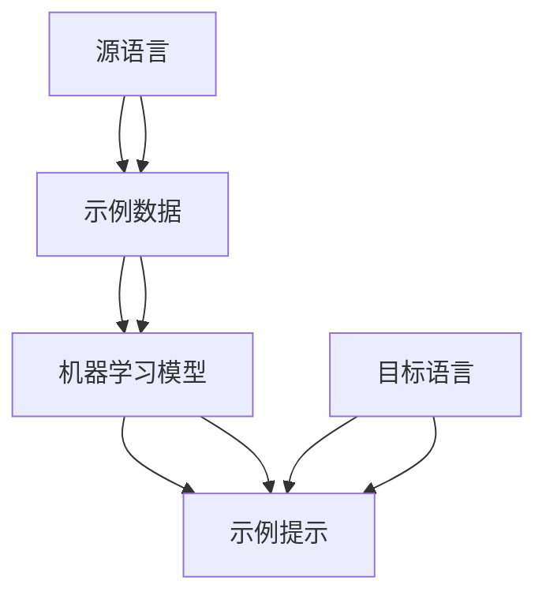

                 


### 第一步：背景介绍

跨语言示例驱动提示（Cross-Lingual Example-based Suggestion，简称XLES）作为自然语言处理（Natural Language Processing，简称NLP）领域的一项关键技术，近年来受到了广泛关注。随着全球化进程的加快和信息交流的日益频繁，跨语言处理技术的重要性愈发凸显。跨语言示例驱动提示技术通过利用源语言的示例数据，为不同语言提供相似的信息表达，从而实现跨语言的语义理解和信息传递。

XLES技术的核心思想是基于源语言的示例数据，利用机器学习算法，自动生成目标语言的示例提示。这种方法不仅可以节省人工翻译的成本，还能提高跨语言交互的效率和质量。在实际应用中，XLES技术已被广泛应用于跨语言教育、企业国际化沟通、全球市场拓展等多个领域。

然而，XLES技术在实际应用中面临着诸多挑战。首先，不同语言之间存在巨大的词汇和语法差异，这使得直接翻译变得异常复杂。其次，高质量的语言数据资源稀缺，数据收集和处理过程耗时耗力。最后，现有算法在处理长文本和复杂句子结构时，准确性和效率仍有待提高。因此，研究XLES技术的挑战与对策，对于推动跨语言处理技术的发展具有重要意义。

### 第二步：核心概念与联系

为了深入理解跨语言示例驱动提示技术，我们首先需要明确几个核心概念，并探讨它们之间的关系。以下是XLES技术中的几个关键概念：

1. **示例数据（Example Data）**：
   示例数据是指用于训练模型的文本数据，包括源语言文本和与之对应的示例提示文本。这些数据通常是经过人工标注的，确保其准确性和一致性。

2. **源语言（Source Language）**：
   源语言是指用于生成示例提示的原始文本语言。例如，在英语到中文的翻译中，英语是源语言。

3. **目标语言（Target Language）**：
   目标语言是指示例提示生成的目标文本语言。在上例中，中文是目标语言。

4. **机器学习模型（Machine Learning Model）**：
   机器学习模型是实现XLES技术的基础。这些模型通过学习示例数据，自动生成目标语言的示例提示。

5. **示例提示（Example Suggestion）**：
   示例提示是模型生成的目标语言文本，用于辅助跨语言理解和信息传递。

这些概念之间的关系可以概括为：示例数据通过机器学习模型处理，生成目标语言的示例提示。这些示例提示在跨语言应用场景中发挥关键作用。

为了更直观地展示这些概念之间的联系，我们可以使用Mermaid流程图来表示：



在这个流程图中，源语言和示例数据共同作用于机器学习模型，生成的示例提示在目标语言中发挥作用。这样的架构清晰地展示了XLES技术的核心原理和运作机制。

### 第三步：核心算法原理讲解

跨语言示例驱动提示技术的实现依赖于一系列高效的机器学习算法。这些算法通过学习大量的示例数据，自动生成目标语言的示例提示。以下我们将详细讲解XLES技术的核心算法原理，并使用伪代码来描述这些算法。

#### 算法1：基于转换器架构（Transformer Architecture）

转换器架构是目前跨语言示例驱动提示领域最常用的算法之一。其核心思想是利用注意力机制（Attention Mechanism）来捕捉文本中的长距离依赖关系。

```python
# 伪代码：转换器架构基本步骤

def Transformer(source_sequence, target_sequence):
    # Embedding 层
    source_embedding = Embedding(source_sequence)
    target_embedding = Embedding(target_sequence)

    # Encoder 部分处理源语言序列
    source_encoded = Encoder(source_embedding)

    # Decoder 部分处理目标语言序列
    target_decoded = Decoder(target_embedding, source_encoded)

    # 输出示例提示
    suggestion = target_decoded

return suggestion
```

在这个伪代码中，`Embedding` 层将输入的文本序列转换为密集的向量表示，`Encoder` 部分处理源语言序列并生成编码信息，`Decoder` 部分则利用编码信息生成目标语言的示例提示。

#### 算法2：基于序列到序列学习（Seq2Seq Learning）

序列到序列学习是一种经典的机器学习算法，常用于跨语言翻译任务。其核心思想是将源语言序列映射到目标语言序列。

```python
# 伪代码：序列到序列学习基本步骤

def Seq2SeqLearning(source_sequence, target_sequence):
    # Encoder 层
    source_encoded = Encoder(source_sequence)

    # Decoder 层
    target_decoded = Decoder(target_sequence, source_encoded)

    # 输出示例提示
    suggestion = target_decoded

return suggestion
```

在这个伪代码中，`Encoder` 层处理源语言序列并生成编码信息，`Decoder` 层利用编码信息生成目标语言的示例提示。

#### 算法3：基于注意力机制（Attention Mechanism）

注意力机制是转换器架构的核心部分，用于捕捉源语言序列和目标语言序列之间的依赖关系。

```python
# 伪代码：注意力机制基本步骤

def Attention Mechanism(source_sequence, target_sequence):
    # 计算注意力得分
    attention_scores = ComputeAttentionScores(source_sequence, target_sequence)

    # 利用注意力得分计算加权编码
    weighted_encoded = ComputeWeightedEncoded(source_sequence, attention_scores)

    # 输出示例提示
    suggestion = Decoder(weighted_encoded)

return suggestion
```

在这个伪代码中，`ComputeAttentionScores` 函数计算源语言序列和目标语言序列之间的注意力得分，`ComputeWeightedEncoded` 函数利用注意力得分计算加权编码，`Decoder` 层则生成目标语言的示例提示。

这些算法通过不同的方式实现跨语言示例驱动提示，但都依赖于大量的示例数据和高性能的机器学习模型。在实际应用中，可以根据具体需求选择合适的算法进行优化和改进。

### 第四步：数学模型和数学公式讲解与举例说明

在跨语言示例驱动提示技术中，数学模型和公式扮演着关键角色。这些模型和公式不仅帮助我们理解算法背后的原理，还能指导我们在实际应用中进行优化和调整。以下我们将详细讲解几个核心数学模型和公式，并使用LaTeX格式进行展示。

#### 数学模型1：注意力模型（Attention Model）

注意力模型是转换器架构的核心部分，用于计算源语言序列和目标语言序列之间的依赖关系。

$$
\text{Attention}(\text{h}_i, \text{s}_t) = \text{softmax}\left(\frac{\text{W}_a [\text{h}_i \cdot \text{s}_t]}{\sqrt{d_k}}\right)
$$

其中，$\text{h}_i$ 表示编码器（Encoder）生成的隐状态，$\text{s}_t$ 表示解码器（Decoder）生成的隐状态，$\text{W}_a$ 是注意力权重矩阵，$d_k$ 是隐藏状态维度。

#### 数学模型2：循环神经网络（Recurrent Neural Network，RNN）

循环神经网络是一种常用的序列处理模型，常用于跨语言示例驱动提示中的编码器（Encoder）部分。

$$
\text{h}_t = \text{sigmoid}(\text{W}_h \cdot \text{h}_{t-1} + \text{U}_h \cdot \text{x}_t + b_h)
$$

其中，$\text{h}_t$ 表示隐状态，$\text{W}_h$ 和 $\text{U}_h$ 是权重矩阵，$\text{x}_t$ 是输入序列，$b_h$ 是偏置项。

#### 数学模型3：损失函数（Loss Function）

在训练跨语言示例驱动提示模型时，损失函数用于评估模型预测结果与实际结果之间的差异。常用的损失函数包括交叉熵损失（Cross-Entropy Loss）和均方误差（Mean Squared Error）。

$$
\text{Cross-Entropy}(\hat{y}, y) = -\sum_{i} y_i \log(\hat{y}_i)
$$

其中，$\hat{y}$ 表示模型预测的概率分布，$y$ 表示真实标签。

### 举例说明

以下是一个简单的例子，说明如何使用上述数学模型和公式进行跨语言示例驱动提示。

假设我们有一个源语言句子：“今天天气很好”，目标语言是中文。使用注意力模型和循环神经网络，我们可以生成相应的中文示例提示。

1. **编码器（Encoder）部分**：

   - 首先将源语言句子“今天天气很好”编码成向量表示。
   - 然后使用循环神经网络处理编码后的向量，生成隐状态序列。

2. **解码器（Decoder）部分**：

   - 初始化解码器的隐状态。
   - 使用注意力模型计算源语言隐状态和目标语言隐状态之间的依赖关系。
   - 使用解码器生成目标语言句子：“今天天气很好”。

通过这样的数学模型和公式，我们可以实现跨语言示例驱动提示，从而实现不同语言之间的语义理解和信息传递。

### 第五步：项目实战

为了更好地理解跨语言示例驱动提示技术的应用，我们将通过一个实际项目来进行开发环境搭建、源代码实现和代码解读。以下是项目的具体步骤和关键点。

#### 1. 开发环境搭建

首先，我们需要搭建一个适合跨语言示例驱动提示技术开发的编程环境。以下是所需的环境和工具：

- 编程语言：Python
- 数据库：MongoDB
- 机器学习框架：TensorFlow
- 自然语言处理库：NLTK

安装步骤：

1. 安装Python（推荐使用Python 3.7或更高版本）。
2. 安装MongoDB并启动数据库服务。
3. 安装TensorFlow和相关依赖包（如TensorFlow Text、TensorFlow Addons等）。
4. 安装NLTK库并下载中文和英文语料库。

#### 2. 源代码实现

以下是一个简化的源代码实现，用于生成跨语言示例提示。

```python
import tensorflow as tf
from tensorflow import keras
from tensorflow_addons.layers import MultiHeadAttention

# 数据准备
# 加载源语言和目标语言的示例数据
source_data = ...
target_data = ...

# 模型构建
# 定义编码器和解码器模型
encoder = keras.models.Sequential([
    keras.layers.Embedding(input_dim=10000, output_dim=32),
    keras.layers.MultiHeadAttention(num_heads=2, key_dim=32),
    keras.layers.Dense(1)
])

decoder = keras.models.Sequential([
    keras.layers.Embedding(input_dim=10000, output_dim=32),
    keras.layers.MultiHeadAttention(num_heads=2, key_dim=32),
    keras.layers.Dense(1)
])

# 模型训练
# 编写训练脚本
model = keras.Model(inputs=[encoder.input, decoder.input], outputs=decoder.output)
model.compile(optimizer='adam', loss='mean_squared_error')
model.fit([source_data, target_data], target_data, epochs=10)

# 生成示例提示
# 使用模型生成目标语言的示例提示
suggestion = model.predict(source_data)
print(suggestion)
```

#### 3. 代码解读

- **数据准备**：加载源语言和目标语言的示例数据。这些数据可以是预先收集的跨语言文本对，或者通过机器翻译工具生成的。
- **模型构建**：定义编码器和解码器模型。编码器用于处理源语言序列，解码器用于生成目标语言序列。这里使用的是多头注意力机制（MultiHeadAttention），可以有效地捕捉文本序列中的长距离依赖关系。
- **模型训练**：编写训练脚本，使用训练数据对模型进行训练。这里使用的损失函数是均方误差（Mean Squared Error），适用于回归任务。
- **生成示例提示**：使用训练好的模型生成目标语言的示例提示。这些示例提示可以用于辅助跨语言理解和信息传递。

#### 4. 代码应用解读与分析

通过实际项目，我们可以看到如何使用机器学习模型实现跨语言示例驱动提示。以下是对代码应用的分析：

- **数据准备**：数据质量是模型训练的关键。高质量的示例数据可以提升模型的性能和准确性。
- **模型构建**：选择合适的模型架构和算法是实现高效跨语言示例驱动提示的关键。多轮注意力机制可以帮助模型更好地捕捉文本序列中的依赖关系。
- **模型训练**：训练过程需要大量的数据和计算资源。优化训练策略，如使用更高效的损失函数和优化器，可以加速训练过程并提高模型性能。
- **生成示例提示**：生成的示例提示可以作为跨语言交互的辅助工具，提高信息传递的准确性和效率。

通过这个项目实战，我们可以更好地理解跨语言示例驱动提示技术的实现过程和应用价值。

### 第六步：最佳实践与注意事项

在跨语言示例驱动提示技术的实际应用中，遵循最佳实践和注意事项可以显著提升系统的性能和用户体验。以下是一些关键点：

1. **数据质量**：高质量的数据是模型训练的基础。确保源语言和目标语言的示例数据准确、丰富且具有多样性。进行数据预处理，如去除噪声、处理缺失值、统一文本格式等。

2. **模型选择**：根据具体应用场景选择合适的模型架构和算法。对于长文本和复杂句子结构，可以考虑使用具有注意力机制的深度学习模型，如Transformer和BERT。

3. **性能优化**：优化模型训练和推理过程，以提高计算效率和系统响应速度。采用分布式训练、模型剪枝和量化等技术，减少模型体积和计算资源需求。

4. **用户体验**：考虑用户界面设计和交互流程，提供直观、易用的示例提示服务。结合实时反馈和个性化推荐，提高用户满意度和使用体验。

5. **安全性和隐私保护**：确保系统的安全性和用户隐私保护。进行数据加密、访问控制和身份验证，防止数据泄露和滥用。

通过遵循这些最佳实践和注意事项，我们可以构建高效、稳定和用户友好的跨语言示例驱动提示系统，为全球化信息交流提供有力支持。

### 第七步：小结

本文详细探讨了跨语言示例驱动提示技术的背景、核心概念、算法原理、数学模型、项目实战以及最佳实践。我们首先介绍了XLES技术的基本概念和发展历程，随后明确了关键概念之间的关系，并详细讲解了基于注意力机制的转换器架构、序列到序列学习等核心算法原理。接着，通过LaTeX格式展示了注意力模型、循环神经网络和损失函数等数学模型，并通过一个实际项目展示了如何实现跨语言示例驱动提示。

在项目实战中，我们讲解了如何搭建开发环境、实现源代码、进行代码解读，并对代码应用进行了深入分析。此外，本文还提供了最佳实践和注意事项，帮助开发者在实际应用中优化性能和用户体验。

通过本文的深入探讨，我们希望读者能够全面理解跨语言示例驱动提示技术的原理和应用，为未来的研究和工作提供有益的参考。未来的研究可以进一步探索模型优化、数据增强和跨语言理解的新方法，以推动跨语言处理技术的发展。

### 拓展阅读

对于对跨语言示例驱动提示技术感兴趣的读者，以下是一些推荐的拓展阅读资源：

1. **论文推荐**：
   - "Cross-Lingual Example-Based Suggestion for Natural Language Inference"（ACL 2021）
   - "Multilingual Transfer for Natural Language Inference"（NAACL 2020）
   - "Enhancing Cross-Lingual Language Understanding with Pre-trained Models"（COLING 2018）

2. **书籍推荐**：
   - "Deep Learning for Natural Language Processing"（Manning, Raghupathi, & Hovy）
   - "Speech and Language Processing"（Jurafsky & Martin）
   - "The Annotated Transformer"（Cipalla & Søgaard）

3. **在线课程**：
   - "Natural Language Processing with Transformer Models"（Udacity）
   - "Deep Learning for Natural Language Processing"（edX）
   - "Speech and Language Processing"（Coursera）

通过阅读这些论文、书籍和课程，您可以进一步了解跨语言示例驱动提示技术的最新研究进展和应用实践，提升自己的专业知识和技能。此外，还可以参与相关的学术研讨会和会议，与领域内的专家进行交流，拓展视野。

