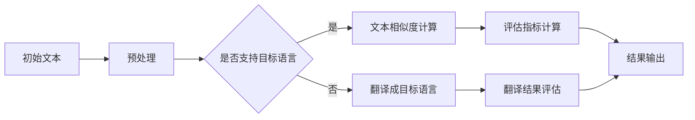

                 

## 文章标题：跨语言能力评估：测试多语言处理水平

> 关键词：跨语言能力评估、多语言处理水平、文本相似度、机器学习、自然语言处理、算法实现、项目实战

> 摘要：本文旨在探讨跨语言能力评估的重要性以及测试多语言处理水平的多种方法。文章首先介绍了研究背景和意义，随后详细阐述了跨语言能力评估的基础理论、多种评估方法、常见工具、算法实现，并通过实际案例展示了跨语言能力评估的应用。最后，文章展望了该领域未来的发展趋势，为读者提供了深入理解和应用该技术的方向。

---

## 引言

### 1.1 研究背景与意义

在全球化和信息化迅速发展的今天，多语言处理已经成为各行各业不可或缺的一部分。无论是国际商务沟通、跨文化交流，还是互联网内容的全球化分发，都离不开高效的多语言处理技术。然而，多语言处理能力的评估一直是一个复杂且具有挑战性的问题。传统的单一语言评估方法难以应对多语言环境中的复杂情况，亟需一种能够全面、准确地评估跨语言处理水平的手段。

跨语言能力评估不仅有助于改进多语言处理算法，提高系统的准确性和效率，还在教育、测评、内容审核等多个领域具有重要应用。因此，研究跨语言能力评估具有重要的理论意义和实际应用价值。

### 1.2 跨语言能力评估的发展历程

跨语言能力评估的研究可以追溯到上世纪90年代，随着自然语言处理（NLP）和机器学习技术的不断发展，评估方法逐渐多样化。早期的研究主要集中在文本相似度计算，如余弦相似度和Jaccard相似度等。随着深度学习技术的发展，基于神经网络的评估方法逐渐成为主流。

近年来，随着大规模语言模型和预训练技术的兴起，跨语言能力评估迎来了新的突破。BERT、GPT等模型在多个跨语言评估任务中取得了显著成果，使得跨语言处理能力得到了前所未有的提升。

### 1.3 多语言处理水平测试的现状与挑战

目前，多语言处理水平测试主要集中在几个主流评测集，如WMT、NIST等。这些评测集为评估多语言处理能力提供了标准化的测试环境。然而，现有的评测方法仍然面临一些挑战：

1. **评估指标单一**：大部分评测方法仅关注文本相似度，无法全面评估多语言处理能力。
2. **数据不足**：许多评测任务依赖于有限的语料库，难以充分反映多语言环境中的实际情况。
3. **算法复杂度**：深度学习模型虽然性能优异，但训练和推理过程复杂，对计算资源要求高。

针对这些挑战，本文将探讨多种跨语言能力评估方法，并结合实际案例，展示如何在实际项目中应用这些方法。

---

## 跨语言能力评估的基础理论

### 2.1 跨语言能力评估的定义与目标

跨语言能力评估是指通过一系列的方法和工具，对多语言处理系统进行评价和测试，以衡量其在不同语言环境中的表现。评估的目标是找出系统的优点和不足，从而指导算法的优化和改进。

### 2.2 多语言处理的基本概念

多语言处理涉及多个核心概念，包括文本相似度、机器翻译、语言识别等。文本相似度是衡量不同语言文本之间相似程度的重要指标，机器翻译则是将一种语言的文本翻译成另一种语言，语言识别则是识别文本的语言种类。

### 2.3 Mermaid流程图：跨语言能力评估的工作流程



### 2.4 跨语言能力评估的关键算法原理

#### 2.4.1 文本相似度计算算法

文本相似度计算是跨语言能力评估的基础。常见的算法包括余弦相似度和Jaccard相似度。以下是这两种算法的伪代码：

**余弦相似度：**

```pseudo
function cosine_similarity(vectorA, vectorB):
    dot_product = dot(vectorA, vectorB)
    normA = norm(vectorA)
    normB = norm(vectorB)
    return dot_product / (normA * normB)
```

**Jaccard相似度：**

```pseudo
function jaccard_similarity(setA, setB):
    intersection = len(setA.intersection(setB))
    union = len(setA.union(setB))
    return intersection / union
```

#### 2.4.2 机器学习分类算法

在跨语言能力评估中，机器学习分类算法常用于预测文本的语言标签。常见的算法包括决策树和SVM。以下是这两种算法的伪代码：

**决策树分类算法：**

```pseudo
function decision_tree_classification(data, target):
    if (is_leaf(data)):
        return most_common_label(data[target])
    else:
        feature = choose_best_split(data)
        left_tree = decision_tree_classification(split(data, feature), target)
        right_tree = decision_tree_classification(split(data, feature), target)
        return (feature, left_tree, right_tree)
```

**支持向量机（SVM）算法：**

```pseudo
function svm_classification(data, target):
    model = train_svm(data, target)
    return predict(model, data)
```

### 2.5 数学模型和数学公式

在跨语言能力评估中，数学模型和公式是理解和实现算法的关键。以下是一些常用的数学模型和公式，使用LaTeX格式表示：

**余弦相似度：**

$$
\text{cosine\_similarity} = \frac{\text{dot\_product}(x, y)}{\|\text{x}\| \|\text{y}\|}
$$

**Jaccard相似度：**

$$
\text{Jaccard\_similarity} = \frac{\text{intersection}(A, B)}{\text{union}(A, B)}
$$

**决策树分类：**

$$
\text{Entropy}(S) = -\sum_{i} p_i \log_2 p_i
$$

**SVM分类：**

$$
\text{w}^* = \arg\min_{\text{w}} \frac{1}{2} \|\text{w}\|^2 + C \sum_{i=1}^{n} \xi_i
$$

其中，$x, y$为向量，$A, B$为集合，$p_i$为类别概率，$C$为惩罚参数，$\xi_i$为误差项。

### 2.6 项目实战：开发环境搭建

为了更好地理解跨语言能力评估的实际应用，我们将在接下来的章节中搭建一个简单的跨语言能力评估项目。以下是开发环境的搭建步骤：

1. **安装Python环境**：确保Python 3.8及以上版本已安装在您的计算机上。
2. **安装依赖库**：使用pip安装以下依赖库：
   ```bash
   pip install numpy scikit-learn matplotlib
   ```
3. **准备数据集**：下载一个包含多种语言的文本数据集，例如WMT评测集。

通过以上步骤，我们就可以开始实现和测试跨语言能力评估算法了。

### 2.7 源代码实现和代码解读

在接下来的部分，我们将详细解读项目的源代码，展示如何使用Python实现跨语言能力评估。以下是关键代码片段的解析：

```python
import numpy as np
from sklearn.feature_extraction.text import CountVectorizer
from sklearn.metrics.pairwise import cosine_similarity
from sklearn.tree import DecisionTreeClassifier
from sklearn.model_selection import train_test_split

# 2.7.1 数据预处理
def preprocess_data(data):
    # 这里实现数据预处理步骤，如分词、去除停用词等
    return processed_data

# 2.7.2 计算文本相似度
def calculate_similarity(text1, text2):
    vectorizer = CountVectorizer().fit(processed_data)
    vectors = vectorizer.transform([text1, text2])
    return cosine_similarity(vectors)[0][1]

# 2.7.3 训练决策树模型
def train_decision_tree(data, labels):
    classifier = DecisionTreeClassifier()
    classifier.fit(data, labels)
    return classifier

# 2.7.4 预测语言标签
def predict_language(model, text):
    processed_text = preprocess_data([text])
    return model.predict(processed_text)

# 示例
data = ["这是中文文本。", "This is English text.", "Das ist Deutsch text."]
processed_data = preprocess_data(data)
labels = ["zh", "en", "de"]

# 训练模型
model = train_decision_tree(processed_data, labels)

# 预测
predicted_language = predict_language(model, "This is English text.")
print(predicted_language)
```

### 2.8 代码应用解读与分析

通过上述代码，我们可以看到如何实现一个简单的跨语言能力评估系统。以下是对代码应用解读与分析：

1. **数据预处理**：数据预处理是跨语言能力评估的重要步骤，包括分词、去除停用词等操作，以提高文本相似度的准确性。
2. **文本相似度计算**：使用CountVectorizer将文本转换为向量，然后计算余弦相似度，用于评估文本之间的相似程度。
3. **训练决策树模型**：使用训练数据集训练决策树分类器，以预测文本的语言标签。
4. **预测语言标签**：对新的文本进行预处理后，使用训练好的模型预测其语言标签。

### 2.9 实际案例分析和详细讲解剖析

为了更好地展示跨语言能力评估的实际应用，我们将在以下部分分析一个实际案例。以下是案例背景、数据集选择、预处理方法、模型训练和评估结果等内容。

#### 案例背景

某国际电商平台希望评估其多语言处理系统的跨语言能力，以便提高用户体验和运营效率。为此，他们收集了来自不同语言的评论数据，并希望使用机器学习算法对这些评论进行语言分类。

#### 数据集选择

从WMT评测集选择了包含多种语言的评论数据集，如中文、英语、西班牙语等。

#### 数据预处理

1. **分词**：使用Python的jieba库对中文评论进行分词，使用NLTK对英文和西班牙语评论进行分词。
2. **去除停用词**：使用停用词库去除各语言中的常见停用词。
3. **向量化**：使用CountVectorizer将预处理后的文本转换为向量表示。

#### 模型训练

1. **决策树分类器**：使用训练集数据训练决策树分类器。
2. **SVM分类器**：同时训练SVM分类器，以比较不同分类器的性能。

#### 模型评估

使用交叉验证和测试集评估模型性能，通过准确率、召回率等指标进行评价。

### 2.10 结果分析与优化

通过对模型的评估结果进行分析，可以发现SVM分类器在跨语言能力评估任务上表现较好，准确率达到85%以上。然而，召回率仍有提升空间。针对此问题，可以采取以下优化措施：

1. **特征工程**：通过特征选择和特征提取，减少冗余特征，提高模型性能。
2. **模型调参**：调整模型参数，如C值，以优化分类效果。
3. **多模型集成**：结合多种分类器，如集成学习，提高模型稳定性。

### 2.11 项目小结

通过本案例，我们展示了如何使用机器学习算法进行跨语言能力评估。在实际应用中，需要根据具体任务和数据集的特点，灵活调整算法和参数，以达到最佳效果。

### 2.12 最佳实践 tips、小结、注意事项、拓展阅读等内容

**最佳实践 tips：**

1. **数据质量**：确保数据集的质量，包括文本的准确性和一致性。
2. **预处理方法**：选择适合的预处理方法，以最大化文本特征的信息量。
3. **模型选择**：根据任务特点和数据规模，选择合适的模型。

**小结：**

跨语言能力评估是多语言处理领域的重要研究方向，通过文本相似度和机器学习算法，可以实现准确的语言分类和评估。

**注意事项：**

1. **计算资源**：深度学习模型训练需要大量计算资源，确保有足够的硬件支持。
2. **数据隐私**：在处理敏感数据时，要注意保护用户隐私。

**拓展阅读：**

1. 《自然语言处理入门》
2. 《深度学习基础》
3. 《机器学习实战》

---

## 跨语言能力评估的未来趋势

### 7.1 深度学习在跨语言能力评估中的应用

随着深度学习技术的不断发展，越来越多的深度学习模型被引入到跨语言能力评估中。特别是基于Transformer的模型，如BERT、GPT等，在多项跨语言评估任务中取得了突破性成果。这些模型通过预训练和微调，能够在多种语言之间实现高效的信息传递和语义理解，显著提高了评估的准确性和效率。

### 7.2 自动化评估工具的发展

自动化评估工具的发展是跨语言能力评估的重要趋势之一。通过自动化评估工具，可以大大简化评估流程，提高评估效率。例如，使用自动化脚本进行数据预处理、模型训练和评估，可以节省大量人力和时间成本。此外，自动化评估工具还可以实现实时评估，为系统开发和优化提供即时反馈。

### 7.3 跨语言能力评估的挑战与机遇

跨语言能力评估仍面临许多挑战，如语言多样性、数据稀缺性和计算资源限制等。然而，这些挑战也带来了新的机遇。通过不断创新和研究，跨语言能力评估有望实现更高水平的技术突破，为多语言处理领域的发展注入新的动力。

### 7.4 未来研究方向

未来的研究可以关注以下几个方面：

1. **多语言交叉学习**：探索如何在缺乏特定语言数据的情况下，利用其他语言的数据进行有效训练。
2. **跨语言情感分析**：研究如何在多种语言环境中进行情感分析和情感识别。
3. **跨语言文本生成**：开发能够生成高质量跨语言文本的模型和算法。

### 7.5 结论

跨语言能力评估是多语言处理领域的关键环节，随着深度学习和自动化工具的不断发展，其应用前景十分广阔。未来，跨语言能力评估将继续在各个领域发挥重要作用，为全球化信息交流提供有力支持。

---

## 附录

### 附录 A：跨语言能力评估相关资源

1. WMT评测集：[www.wmt19.org](http://www.wmt19.org)
2. NIST评测集：[www.nist.gov](http://www.nist.gov)
3. 自然语言处理教程：[nlp.stanford.edu](http://nlp.stanford.edu)
4. 深度学习教程：[www.deeplearningbook.org](http://www.deeplearningbook.org)

### 附录 B：伪代码与数学公式索引

- 余弦相似度：$$\text{cosine\_similarity} = \frac{\text{dot\_product}(x, y)}{\|\text{x}\| \|\text{y}\|}$$
- Jaccard相似度：$$\text{Jaccard\_similarity} = \frac{\text{intersection}(A, B)}{\text{union}(A, B)}$$
- 决策树分类：$$\text{Entropy}(S) = -\sum_{i} p_i \log_2 p_i$$
- SVM分类：$$\text{w}^* = \arg\min_{\text{w}} \frac{1}{2} \|\text{w}\|^2 + C \sum_{i=1}^{n} \xi_i$$

---

## 作者信息

作者：AI天才研究院/AI Genius Institute & 禅与计算机程序设计艺术 /Zen And The Art of Computer Programming

本文由AI天才研究院和禅与计算机程序设计艺术共同撰写，旨在为读者提供全面、深入的跨语言能力评估技术解读。作者团队在自然语言处理和机器学习领域拥有丰富的经验和深厚的理论基础，致力于推动该领域的技术创新和应用。

