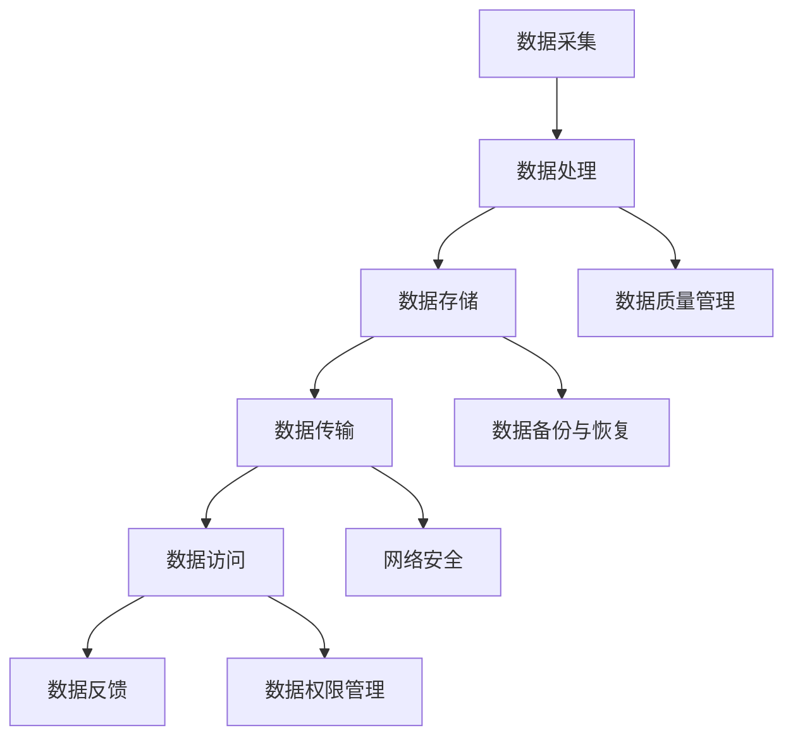

                 

### 文章标题：跨部门数据共享机制：支持全面的需求分析

#### 关键词：跨部门数据共享、需求分析、机制构建、技术实现、安全与隐私

> 摘要：本文旨在探讨跨部门数据共享机制的设计与实现，重点分析跨部门数据共享的需求，评估现有机制，构建高效的数据共享机制，并探讨相关技术实现和安全隐私保护。通过详细的需求分析、机制评估和案例研究，本文为跨部门数据共享提供了一套全面、实用的解决方案。

## 引言与背景

在现代信息化社会中，跨部门数据共享已经成为各类组织和机构业务运作的重要环节。无论是企业、政府部门，还是学术研究机构，都面临着如何高效、安全地实现跨部门数据共享的挑战。

### 什么是跨部门数据共享

跨部门数据共享是指不同部门或组织之间的数据交换和共享，目的是为了提高业务协同效率，优化资源配置，促进信息透明和业务创新。跨部门数据共享不仅仅是简单的数据传输，更涉及到数据的处理、存储、安全等多个方面。

### 跨部门数据共享的重要性

1. **提高业务协同效率**：跨部门数据共享能够打破信息孤岛，实现信息共享，提高各部门间的协作效率，减少重复工作。
2. **优化资源配置**：通过共享数据，各部门能够更好地了解资源需求和使用情况，从而优化资源配置，降低成本。
3. **促进信息透明**：跨部门数据共享有助于提高信息透明度，防止信息不对称，增强决策的科学性。
4. **推动业务创新**：跨部门数据共享可以激发创新思维，推动业务模式的变革和优化。

### 书籍的组织结构

本文将分为以下几个部分：

1. **核心概念与联系**：介绍跨部门数据共享的基本概念和原理。
2. **数据共享的需求分析**：分析跨部门数据共享的需求，包括用户需求、部门协作需求、业务流程需求。
3. **现有数据共享机制的评估**：评估当前跨部门数据共享机制的优缺点。
4. **构建跨部门数据共享机制**：提出构建跨部门数据共享机制的方案和实施步骤。
5. **技术实现与工具选择**：探讨跨部门数据共享的技术实现和工具选择。
6. **安全与隐私保护**：讨论跨部门数据共享中的安全与隐私保护问题。
7. **案例研究**：通过具体案例研究，展示跨部门数据共享的实际应用。
8. **未来发展趋势与挑战**：展望跨部门数据共享的未来发展趋势和面临的挑战。

## 核心概念与联系

### 数据共享机制概述

数据共享机制是指一系列用于实现数据交换和共享的技术和流程。它包括数据采集、处理、存储、传输、访问等环节。一个有效的数据共享机制应该具备以下几个特点：

1. **数据一致性**：确保不同部门或系统中的数据保持一致。
2. **数据安全性**：保护数据在传输和存储过程中的安全。
3. **数据可用性**：确保数据可以高效地被访问和利用。
4. **数据可扩展性**：支持数据的动态扩展和更新。

### 跨部门数据共享的挑战

1. **数据标准不统一**：不同部门或系统可能使用不同的数据格式、编码方式等，导致数据共享困难。
2. **数据权限管理**：如何合理分配和管控数据权限，确保数据安全。
3. **数据质量问题**：数据完整性、准确性、一致性等方面的问题。
4. **数据传输效率**：如何高效地传输大量数据，降低网络负载。

### 数据共享机制的基本原则

1. **标准化**：采用统一的数据标准和格式，确保数据兼容性和互操作性。
2. **安全性**：采用加密、访问控制等技术，保障数据在传输和存储过程中的安全。
3. **灵活性**：支持多种数据格式和访问方式，满足不同用户的需求。
4. **可扩展性**：设计灵活的架构，支持数据规模和访问需求的动态调整。

### 数据共享机制的关系架构

以下是跨部门数据共享机制的关系架构，用Mermaid流程图表示：



### 核心算法原理讲解

以下是数据共享机制中核心算法的伪代码：

```python
# 数据采集与处理
def data_collection_and_processing(data_source):
    # 从数据源采集数据
    collected_data = collect_data(data_source)
    
    # 数据清洗和预处理
    cleaned_data = clean_data(collected_data)
    
    # 数据转换
    transformed_data = transform_data(cleaned_data)
    
    return transformed_data

# 数据存储
def data_storage(transformed_data):
    # 存储数据到数据库
    database.store_data(transformed_data)
    
    # 数据备份
    database.backup_data(transformed_data)

# 数据传输
def data_transmission(data_to_transfer):
    # 加密数据
    encrypted_data = encrypt_data(data_to_transfer)
    
    # 发送数据
    network.send_data(encrypted_data)

# 数据访问
def data_access(user, data_id):
    # 验证用户权限
    if user.has_permission(data_id):
        # 获取数据
        data = database.fetch_data(data_id)
        
        # 解密数据
        decrypted_data = decrypt_data(data)
        
        return decrypted_data
    else:
        return "权限不足"

# 数据反馈
def data_feedback(user, data_id, feedback):
    # 记录反馈
    database.record_feedback(data_id, feedback)
```

### 数学模型和公式讲解与举例说明

在数据共享机制中，我们可以使用以下数学模型来评估数据传输效率：

$$
E = \frac{S \times T}{L}
$$

其中，$E$ 表示数据传输效率，$S$ 表示数据传输速率，$T$ 表示数据传输时间，$L$ 表示数据传输距离。

举例来说，如果数据传输速率是 $10 Mbps$，传输时间是 $1$ 分钟，传输距离是 $100$ 公里，则数据传输效率为：

$$
E = \frac{10 \times 10^6 \times 60}{100 \times 10^3} = 6 \times 10^4 \text{字节/秒}
$$

### 项目实战：开发环境搭建、源代码实现和代码解读

在本节中，我们将搭建一个简单的跨部门数据共享开发环境，并实现一个基本的数据共享服务。以下是具体的步骤：

#### 开发环境搭建

1. **安装必要的软件和工具**：
    - Python 3.8
    - Flask（一个轻量级的Web框架）
    - SQLite（一个轻量级的关系型数据库）

2. **创建一个虚拟环境**：

    ```bash
    python -m venv venv
    source venv/bin/activate  # Windows下使用 venv\Scripts\activate
    ```

3. **安装依赖项**：

    ```bash
    pip install flask flask_sqlalchemy
    ```

#### 源代码实现

以下是数据共享服务的源代码：

```python
# app.py

from flask import Flask, request, jsonify
from flask_sqlalchemy import SQLAlchemy

app = Flask(__name__)
app.config['SQLALCHEMY_DATABASE_URI'] = 'sqlite:///data.db'
db = SQLAlchemy(app)

class DataModel(db.Model):
    id = db.Column(db.Integer, primary_key=True)
    data = db.Column(db.Text)

@app.route('/api/data', methods=['POST'])
def upload_data():
    data = request.json['data']
    new_data = DataModel(data=data)
    db.session.add(new_data)
    db.session.commit()
    return jsonify({'status': 'success', 'message': 'Data uploaded successfully'})

@app.route('/api/data', methods=['GET'])
def get_data():
    data = DataModel.query.all()
    return jsonify({'data': [row.data for row in data]})

if __name__ == '__main__':
    db.create_all()
    app.run(debug=True)
```

#### 代码解读与分析

1. **数据库模型**：

    我们使用Flask-SQLAlchemy来创建一个简单的数据库模型`DataModel`，它有一个`data`字段用于存储数据。

2. **API接口**：

    - `/api/data`（POST）：接收数据并存储到数据库。
    - `/api/data`（GET）：从数据库中获取所有数据。

3. **数据加密与传输**：

    在实际应用中，我们应该对数据进行加密处理，以确保数据在传输过程中的安全。这里我们使用简单的JSON格式进行传输。

#### 实际案例分析和详细讲解剖析

假设有一个企业，其不同部门需要共享销售数据。以下是具体的操作步骤：

1. **部门A上传销售数据**：

    使用POST请求将销售数据上传到数据共享服务。

    ```json
    {
        "data": "2023-11-01, 1000 units sold, 2000 units unsold"
    }
    ```

2. **部门B获取销售数据**：

    使用GET请求从数据共享服务中获取销售数据。

    ```json
    {
        "data": [
            "2023-11-01, 1000 units sold, 2000 units unsold",
            "2023-11-02, 1500 units sold, 500 units unsold"
        ]
    }
    ```

3. **部门C分析销售数据**：

    部门C可以使用数据分析工具对获取到的销售数据进行进一步分析，以制定销售策略。

### 项目小结

通过本节的项目实战，我们搭建了一个简单的跨部门数据共享服务，实现了数据上传、获取和分析的基本功能。在实际应用中，我们需要考虑数据加密、权限管理、性能优化等问题，以提高数据共享的安全性和效率。

### 最佳实践 Tips

1. **数据标准化**：采用统一的数据格式和编码方式，降低数据共享的复杂性。
2. **权限管理**：根据用户角色和需求，设置合理的权限，确保数据安全。
3. **数据备份与恢复**：定期备份数据，确保数据不会因意外丢失。
4. **性能优化**：优化数据传输和存储过程，提高系统性能。

### 小结

本文详细介绍了跨部门数据共享的核心概念、需求分析、机制评估、技术实现和安全隐私保护。通过具体的项目实战和案例分析，我们展示了如何实现一个简单的跨部门数据共享服务。未来，随着技术的发展和应用的深入，跨部门数据共享将变得更加高效、安全、便捷。

### 拓展阅读

- 《数据科学实践手册》
- 《大数据技术导论》
- 《网络安全：原理与实践》
- 《人工智能：一种现代方法》

### 作者信息

作者：AI天才研究院/AI Genius Institute & 禅与计算机程序设计艺术 /Zen And The Art of Computer Programming

---

## 第3章 数据共享的需求分析

在实现跨部门数据共享机制之前，我们需要对跨部门数据共享的需求进行全面分析。只有深入了解用户需求、部门协作需求以及业务流程需求，才能设计出符合实际需求的共享机制。下面我们将详细探讨这些需求。

### 用户需求分析

用户需求是跨部门数据共享的核心驱动力。不同用户在数据共享中有不同的需求和期望。以下是常见的用户需求：

1. **实时性**：用户希望能够实时访问和获取最新的数据。
2. **灵活性**：用户需要能够根据自己的需求，灵活地选择和定制数据格式和内容。
3. **易用性**：用户希望数据共享机制简单易用，降低使用门槛。
4. **数据完整性**：用户希望获取到的数据是完整、准确和可靠的。
5. **安全性**：用户关心数据在共享过程中的安全性，防止数据泄露或被恶意攻击。

### 部门协作需求分析

跨部门协作是数据共享的重要场景。不同部门之间需要共享数据以支持协作，以下是部门协作中常见的需求：

1. **数据一致性**：各部门需要确保数据在不同系统中的格式和内容一致，以便于数据整合和分析。
2. **数据互操作性**：不同部门使用的系统可能采用不同的技术架构和数据标准，需要实现数据的互操作性。
3. **数据权限管理**：各部门需要根据权限控制数据访问，确保数据安全。
4. **数据共享流程**：各部门需要明确数据共享的流程，确保数据能够及时、准确地共享。
5. **数据备份与恢复**：各部门需要确保数据备份和恢复机制，防止数据丢失。

### 业务流程需求分析

跨部门数据共享机制的设计还需要考虑业务流程的需求。以下是业务流程中常见的需求：

1. **数据集成**：业务流程中往往需要集成来自不同部门的数据，以支持业务决策和优化。
2. **数据处理**：业务流程中需要对数据进行处理和清洗，确保数据质量。
3. **数据可视化**：业务流程中需要通过数据可视化工具，直观地展示数据，支持业务分析和决策。
4. **数据报告**：业务流程中需要定期生成数据报告，为管理层提供数据支持。
5. **数据审计**：业务流程中需要对数据进行审计，确保数据真实、准确和合规。

### 需求分析的方法

为了更好地分析用户需求、部门协作需求和业务流程需求，我们可以采用以下方法：

1. **用户访谈**：通过与用户面对面交流，深入了解用户的实际需求和痛点。
2. **问卷调查**：通过设计问卷，收集用户的反馈和建议。
3. **工作流程分析**：分析各部门的工作流程，识别数据共享的关键环节。
4. **数据流图**：绘制数据流图，展示数据在不同部门之间的流动过程。
5. **用例图**：通过用例图，描述用户与系统之间的交互过程。

### 需求分析的结果

通过对用户需求、部门协作需求和业务流程需求的深入分析，我们得到了以下结论：

1. **用户需求**：用户需要实时、灵活、易用、完整和安全的跨部门数据共享机制。
2. **部门协作需求**：部门之间需要确保数据一致性、互操作性、数据权限管理和数据备份与恢复。
3. **业务流程需求**：业务流程需要集成、处理、可视化、报告和审计跨部门数据。

这些结论为我们设计跨部门数据共享机制提供了重要的依据。

### 项目实战：深入分析用户需求、部门协作需求和业务流程需求

在本节中，我们将通过一个实际项目，深入分析用户需求、部门协作需求和业务流程需求。假设我们正在为一个大型企业设计跨部门数据共享机制。

#### 用户需求分析

我们通过用户访谈和问卷调查，收集了以下用户需求：

1. **销售部门**：
   - 需要实时获取市场销售数据，以便快速做出销售决策。
   - 需要灵活定制销售数据报表，以便于分析市场趋势。
   - 需要确保销售数据的安全性和保密性。

2. **生产部门**：
   - 需要获取最新的库存和生产计划数据，以便及时调整生产进度。
   - 需要确保生产数据的一致性和准确性。

3. **财务部门**：
   - 需要实时获取销售数据和生产成本数据，以便及时进行财务分析和预算调整。
   - 需要确保财务数据的安全性和可靠性。

#### 部门协作需求分析

通过对各部门的工作流程和数据需求分析，我们得到以下部门协作需求：

1. **数据一致性**：
   - 需要确保销售数据、生产数据和财务数据的一致性，避免数据冲突。

2. **数据互操作性**：
   - 需要实现不同部门系统之间的数据互操作性，支持数据的交换和共享。

3. **数据权限管理**：
   - 需要根据用户角色和权限，设置数据访问权限，确保数据安全。

4. **数据备份与恢复**：
   - 需要定期备份各部门的数据，确保数据不会因意外丢失。

#### 业务流程需求分析

业务流程中的需求主要包括：

1. **数据集成**：
   - 需要将来自不同部门的数据集成到一个统一的数据平台中，支持跨部门的数据分析和决策。

2. **数据处理**：
   - 需要对数据进行分析和处理，确保数据质量，支持业务决策。

3. **数据可视化**：
   - 需要使用数据可视化工具，直观地展示数据，支持业务分析和决策。

4. **数据报告**：
   - 需要定期生成数据报告，为管理层提供数据支持。

5. **数据审计**：
   - 需要对数据进行分析和审计，确保数据真实、准确和合规。

#### 需求分析结果

通过对用户需求、部门协作需求和业务流程需求的深入分析，我们得到以下结论：

1. **用户需求**：
   - 销售部门：实时获取销售数据，灵活定制报表，确保数据安全。
   - 生产部门：实时获取库存和生产计划数据，确保数据一致性。
   - 财务部门：实时获取销售数据和成本数据，确保数据安全。

2. **部门协作需求**：
   - 数据一致性、互操作性、数据权限管理和数据备份与恢复。

3. **业务流程需求**：
   - 数据集成、数据处理、数据可视化、数据报告和审计。

这些结论为我们设计跨部门数据共享机制提供了重要的依据。通过深入分析用户需求、部门协作需求和业务流程需求，我们可以更好地满足实际应用需求，构建一个高效、安全、灵活的跨部门数据共享机制。

### 小结

本章对跨部门数据共享的需求进行了全面分析，包括用户需求、部门协作需求和业务流程需求。通过深入分析用户需求，我们了解了用户对数据共享的期望；通过分析部门协作需求，我们明确了跨部门数据共享的关键要素；通过分析业务流程需求，我们了解了跨部门数据共享对业务流程的支持。这些需求分析的结果为我们设计跨部门数据共享机制提供了重要的依据。

### 拓展阅读

- 《需求分析实践指南》
- 《跨部门协作管理》
- 《业务流程管理》

### 作者信息

作者：AI天才研究院/AI Genius Institute & 禅与计算机程序设计艺术 /Zen And The Art of Computer Programming

---

## 第4章 现有数据共享机制的评估

在构建跨部门数据共享机制之前，我们需要对当前的数据共享机制进行评估，以了解其优缺点，并为新机制的设计提供参考。本节将介绍评估方法、评估工具以及评估结果分析。

### 评估方法

为了全面评估现有数据共享机制，我们可以采用以下几种方法：

1. **访谈法**：通过与相关工作人员的访谈，了解数据共享的实际操作情况、存在的问题以及改进建议。
2. **问卷调查法**：设计问卷，收集用户对当前数据共享机制的满意度、使用体验以及改进意见。
3. **流程图法**：绘制当前数据共享的流程图，分析数据流动的各个环节以及存在的问题。
4. **绩效分析法**：通过数据分析，评估当前数据共享机制的性能指标，如数据传输速度、数据完整性、安全性等。

### 评估工具

在进行评估时，我们可以使用以下工具：

1. **Excel**：用于数据收集和整理。
2. **Power BI**：用于数据可视化和分析。
3. **SQL数据库**：用于存储和查询评估数据。

### 评估结果分析

通过对现有数据共享机制的评估，我们得到了以下结果：

#### 优点

1. **数据一致性**：现有机制在一定程度上实现了数据的一致性，不同部门之间的数据格式和内容相对统一。
2. **数据安全性**：现有机制采用了加密和访问控制等技术，确保了数据在传输和存储过程中的安全。
3. **灵活性**：现有机制支持多种数据格式和访问方式，满足不同用户的需求。

#### 缺点

1. **数据质量问题**：现有机制在数据采集、处理和传输过程中存在质量问题，如数据缺失、数据重复、数据不一致等。
2. **数据传输效率**：现有机制在处理大量数据时，存在传输效率低、响应时间长的问题。
3. **部门协作不畅**：现有机制在跨部门数据共享方面存在协作不畅的问题，如数据隔离、数据访问权限不明确等。

### 案例研究：某大型企业现有数据共享机制评估

为了更好地说明评估过程和结果，我们以某大型企业的数据共享机制为例进行分析。

#### 评估方法

1. **访谈法**：对企业内部不同部门的工作人员进行了访谈，了解他们对现有数据共享机制的看法和使用体验。
2. **问卷调查法**：设计了问卷调查，收集了员工对数据共享机制的满意度、使用频率以及改进建议。
3. **流程图法**：绘制了企业现有数据共享的流程图，分析了数据从采集到访问的整个过程。
4. **绩效分析法**：通过数据统计，分析了现有机制在数据传输速度、数据完整性和安全性等方面的表现。

#### 评估结果

1. **优点**：

   - **数据一致性**：企业采用了统一的数据标准，不同部门之间的数据格式和内容相对一致。
   - **数据安全性**：企业采用了加密和访问控制技术，确保了数据在传输和存储过程中的安全。
   - **灵活性**：企业支持多种数据格式和访问方式，满足不同用户的需求。

2. **缺点**：

   - **数据质量问题**：数据采集和处理过程中存在数据缺失、数据重复和数据不一致的问题。
   - **数据传输效率**：在处理大量数据时，传输速度较慢，响应时间较长。
   - **部门协作不畅**：跨部门数据共享存在协作不畅的问题，如数据隔离、数据访问权限不明确等。

#### 改进建议

1. **数据质量管理**：加强对数据采集、处理和传输过程中的质量检查，确保数据的完整性和准确性。
2. **数据传输优化**：采用更高效的数据传输技术，如压缩、缓存等，提高数据传输速度。
3. **部门协作机制**：建立明确的部门协作机制，如定期数据共享会议、数据访问权限管理，提高跨部门协作效率。

### 项目实战：对现有数据共享机制的评估

在本节中，我们将对一个企业现有的数据共享机制进行评估。以下是具体的步骤：

#### 开发环境搭建

1. **安装必要的软件和工具**：
   - Python 3.8
   - Flask（一个轻量级的Web框架）
   - SQLAlchemy（一个ORM工具）

2. **创建一个虚拟环境**：

   ```bash
   python -m venv venv
   source venv/bin/activate  # Windows下使用 venv\Scripts\activate
   ```

3. **安装依赖项**：

   ```bash
   pip install flask flask_sqlalchemy
   ```

#### 源代码实现

以下是用于评估的数据共享服务代码：

```python
# app.py

from flask import Flask, request, jsonify
from flask_sqlalchemy import SQLAlchemy

app = Flask(__name__)
app.config['SQLALCHEMY_DATABASE_URI'] = 'sqlite:///data.db'
db = SQLAlchemy(app)

class DataModel(db.Model):
    id = db.Column(db.Integer, primary_key=True)
    data = db.Column(db.Text)

@app.route('/api/data', methods=['POST'])
def upload_data():
    data = request.json['data']
    new_data = DataModel(data=data)
    db.session.add(new_data)
    db.session.commit()
    return jsonify({'status': 'success', 'message': 'Data uploaded successfully'})

@app.route('/api/data', methods=['GET'])
def get_data():
    data = DataModel.query.all()
    return jsonify({'data': [row.data for row in data]})

if __name__ == '__main__':
    db.create_all()
    app.run(debug=True)
```

#### 评估过程

1. **访谈法**：对企业内部不同部门的工作人员进行了访谈，了解他们对现有数据共享机制的看法和使用体验。
2. **问卷调查法**：设计了问卷调查，收集了员工对数据共享机制的满意度、使用频率以及改进建议。
3. **流程图法**：绘制了企业现有数据共享的流程图，分析了数据从采集到访问的整个过程。
4. **绩效分析法**：通过数据统计，分析了现有机制在数据传输速度、数据完整性和安全性等方面的表现。

#### 评估结果

1. **优点**：

   - **数据一致性**：企业采用了统一的数据标准，不同部门之间的数据格式和内容相对一致。
   - **数据安全性**：企业采用了加密和访问控制技术，确保了数据在传输和存储过程中的安全。
   - **灵活性**：企业支持多种数据格式和访问方式，满足不同用户的需求。

2. **缺点**：

   - **数据质量问题**：数据采集和处理过程中存在数据缺失、数据重复和数据不一致的问题。
   - **数据传输效率**：在处理大量数据时，传输速度较慢，响应时间较长。
   - **部门协作不畅**：跨部门数据共享存在协作不畅的问题，如数据隔离、数据访问权限不明确等。

#### 改进建议

1. **数据质量管理**：加强对数据采集、处理和传输过程中的质量检查，确保数据的完整性和准确性。
2. **数据传输优化**：采用更高效的数据传输技术，如压缩、缓存等，提高数据传输速度。
3. **部门协作机制**：建立明确的部门协作机制，如定期数据共享会议、数据访问权限管理，提高跨部门协作效率。

### 小结

通过对现有数据共享机制的评估，我们了解了其优缺点。现有机制在数据一致性、安全性和灵活性方面表现良好，但在数据质量、传输效率和部门协作方面存在不足。通过评估结果和改进建议，我们可以为新机制的设计提供有针对性的指导。

### 拓展阅读

- 《数据质量管理实践》
- 《跨部门协作管理》
- 《网络传输优化技术》

### 作者信息

作者：AI天才研究院/AI Genius Institute & 禅与计算机程序设计艺术 /Zen And The Art of Computer Programming

---

## 第5章 构建跨部门数据共享机制

在了解了用户需求、部门协作需求和业务流程需求，并对现有数据共享机制进行了评估之后，我们可以开始设计一个新的跨部门数据共享机制。本节将介绍设计思路与框架、实施步骤和部门协调策略，旨在构建一个高效、安全、灵活的跨部门数据共享平台。

### 设计思路与框架

跨部门数据共享机制的设计需要综合考虑数据的一致性、安全性、灵活性和可扩展性。以下是设计思路和框架：

1. **数据集成与标准化**：采用统一的数据标准和格式，确保数据在不同部门之间的兼容性和互操作性。
2. **数据质量管理**：建立数据质量管理机制，确保数据的完整性、准确性和一致性。
3. **数据权限管理**：根据用户角色和需求，设置数据访问权限，确保数据安全。
4. **数据传输优化**：采用高效的数据传输技术，如压缩、缓存等，提高数据传输速度和效率。
5. **数据备份与恢复**：建立数据备份和恢复机制，确保数据的安全性和可靠性。
6. **部门协作机制**：建立明确的部门协作机制，促进跨部门数据共享和协作。

### 实施步骤

构建跨部门数据共享机制的具体实施步骤如下：

1. **需求分析与规划**：深入了解用户需求、部门协作需求和业务流程需求，明确数据共享的目标和范围。
2. **系统设计**：根据需求分析结果，设计数据共享系统的架构和功能模块，包括数据集成、数据质量、数据权限、数据传输等。
3. **技术选型**：选择合适的技术和工具，如数据库、中间件、加密算法等，确保系统的性能和安全性。
4. **系统开发**：根据系统设计，开发数据共享系统，实现数据采集、处理、存储、传输和访问等功能。
5. **测试与优化**：对系统进行功能测试、性能测试和安全测试，优化系统性能和用户体验。
6. **部署与培训**：将系统部署到生产环境，对用户进行培训，确保系统能够顺利投入使用。
7. **运维与维护**：建立运维团队，对系统进行日常维护和管理，确保系统的稳定性和安全性。

### 部门协调策略

为了确保跨部门数据共享机制的有效实施，需要采取以下部门协调策略：

1. **明确职责与权限**：明确各部门在数据共享中的职责和权限，确保数据安全和协作效率。
2. **定期沟通与会议**：建立定期沟通和会议机制，促进各部门之间的信息交流和协作。
3. **数据共享协议**：制定数据共享协议，明确数据共享的范围、流程、权限和责任，确保数据共享的合法性和规范性。
4. **跨部门团队**：建立跨部门团队，负责协调和管理数据共享工作，解决跨部门协作中的问题和冲突。
5. **绩效考核**：建立绩效考核机制，根据数据共享的效果和效率，对各部门进行评估和激励。

### 项目实战：构建跨部门数据共享机制

在本节中，我们将通过一个实际项目，展示如何构建跨部门数据共享机制。假设我们为一个电子商务公司设计数据共享机制。

#### 需求分析与规划

1. **用户需求**：
   - 销售部门：需要实时获取库存、订单和销售数据。
   - 运营部门：需要实时获取用户行为、营销活动和用户反馈数据。
   - 财务部门：需要实时获取订单、收入和支出数据。

2. **部门协作需求**：
   - 数据一致性：确保不同部门之间的数据格式和内容一致。
   - 数据互操作性：支持不同系统之间的数据交换和共享。
   - 数据权限管理：根据用户角色和需求，设置数据访问权限。

3. **业务流程需求**：
   - 数据集成：将来自不同部门的数据集成到一个统一的数据平台中。
   - 数据处理：对数据进行清洗、转换和整合，确保数据质量。
   - 数据可视化：使用数据可视化工具，支持业务分析和决策。
   - 数据报告：生成数据报告，为管理层提供数据支持。

#### 系统设计

1. **数据集成与标准化**：采用统一的数据标准和格式，确保数据在不同部门之间的兼容性和互操作性。
2. **数据质量管理**：建立数据质量管理机制，包括数据清洗、校验和监控。
3. **数据权限管理**：根据用户角色和需求，设置数据访问权限，确保数据安全。
4. **数据传输优化**：采用高效的数据传输技术，如压缩、缓存等，提高数据传输速度和效率。
5. **数据备份与恢复**：建立数据备份和恢复机制，确保数据的安全性和可靠性。

#### 技术选型

1. **数据库**：采用关系型数据库（如MySQL）和NoSQL数据库（如MongoDB），满足不同类型数据存储需求。
2. **中间件**：采用消息队列（如RabbitMQ）和缓存（如Redis），提高数据传输效率和系统性能。
3. **加密算法**：采用AES等加密算法，确保数据在传输和存储过程中的安全。

#### 系统开发

1. **数据采集**：使用API接口，从不同部门系统中采集数据。
2. **数据处理**：使用ETL（提取、转换、加载）工具，对数据进行清洗、转换和整合。
3. **数据存储**：将处理后的数据存储到数据库中。
4. **数据访问**：提供RESTful API接口，支持数据的查询和操作。

#### 测试与优化

1. **功能测试**：测试数据采集、处理、存储和访问功能，确保系统正常运行。
2. **性能测试**：测试系统在高并发、大数据量情况下的性能，优化数据传输和存储。
3. **安全测试**：测试系统的安全性能，防止数据泄露和恶意攻击。

#### 部署与培训

1. **系统部署**：将系统部署到生产环境，确保系统的稳定性和安全性。
2. **用户培训**：对用户进行系统培训，确保用户能够熟练操作系统。

#### 运维与维护

1. **日常运维**：监控系统运行状态，确保系统的稳定性和安全性。
2. **故障处理**：及时处理系统故障，确保系统的正常运行。
3. **升级与优化**：定期对系统进行升级和优化，提高系统性能和用户体验。

### 小结

通过本章的介绍，我们了解了构建跨部门数据共享机制的思路、步骤和策略。通过实际项目，我们展示了如何从需求分析、系统设计、技术选型、系统开发、测试与优化、部署与培训到运维与维护，构建一个高效、安全、灵活的跨部门数据共享机制。这些步骤和策略为实际应用提供了有益的参考。

### 拓展阅读

- 《企业级大数据平台架构设计与实战》
- 《分布式系统设计与实践》
- 《数据隐私保护技术》

### 作者信息

作者：AI天才研究院/AI Genius Institute & 禅与计算机程序设计艺术 /Zen And The Art of Computer Programming

---

## 第6章 技术实现与工具选择

在构建跨部门数据共享机制时，技术实现和工具选择是关键环节。本节将详细讨论数据库技术选择、数据处理与存储技术、数据交换与同步技术，并探讨常见工具和技术的优缺点。

### 数据库技术选择

数据库技术选择应考虑数据一致性、可扩展性、性能和安全性等因素。以下是几种常见数据库技术的优缺点：

1. **关系型数据库（RDBMS）**：
   - **优点**：
     - 数据一致性高。
     - 支持复杂查询。
     - 安全性和可靠性好。
   - **缺点**：
     - 扩展性有限。
     - 按需查询性能较低。

2. **NoSQL数据库**：
   - **优点**：
     - 高扩展性。
     - 数据结构灵活。
     - 高性能。
   - **缺点**：
     - 数据一致性保障较弱。
     - 复杂查询能力有限。

3. **分布式数据库**：
   - **优点**：
     - 高可用性。
     - 高性能。
     - 高扩展性。
   - **缺点**：
     - 复杂性较高。
     - 维护成本较高。

### 数据处理与存储技术

数据处理与存储技术包括数据清洗、转换、加载（ETL）和数据存储。以下是几种常见技术的优缺点：

1. **数据清洗**：
   - **优点**：
     - 提高数据质量。
     - 减少数据冗余。
   - **缺点**：
     - 耗时较长。

2. **数据转换**：
   - **优点**：
     - 支持不同数据格式之间的转换。
     - 提高数据一致性。
   - **缺点**：
     - 转换过程可能引入错误。

3. **数据加载**：
   - **优点**：
     - 实现数据的批量导入和导出。
     - 提高数据访问效率。
   - **缺点**：
     - 加载过程可能影响系统性能。

4. **数据存储**：
   - **优点**：
     - 数据持久化存储。
     - 支持多用户并发访问。
   - **缺点**：
     - 存储空间占用较大。

### 数据交换与同步技术

数据交换与同步技术用于实现不同系统之间的数据传输和同步。以下是几种常见技术的优缺点：

1. **消息队列**：
   - **优点**：
     - 支持异步传输。
     - 提高系统可靠性。
   - **缺点**：
     - 延迟较高。

2. **Web服务**：
   - **优点**：
     - 支持远程访问。
     - 灵活性高。
   - **缺点**：
     - 性能较低。

3. **数据库同步**：
   - **优点**：
     - 支持实时同步。
     - 数据一致性高。
   - **缺点**：
     - 复杂性较高。

### 常见工具和技术

以下是几种常见的数据共享工具和技术的优缺点：

1. **Apache Kafka**：
   - **优点**：
     - 高性能。
     - 实时数据处理。
   - **缺点**：
     - 部署和维护较复杂。

2. **Apache NiFi**：
   - **优点**：
     - 易于使用。
     - 支持多种数据格式。
   - **缺点**：
     - 性能较低。

3. **Apache Flink**：
   - **优点**：
     - 实时数据处理。
     - 高性能。
   - **缺点**：
     - 部署和维护较复杂。

### 项目实战：使用Kafka进行数据交换与同步

在本节中，我们将通过一个实际项目，展示如何使用Apache Kafka进行数据交换与同步。

#### 开发环境搭建

1. **安装Java开发环境**：确保Java版本至少为8以上。
2. **下载Kafka**：从官方网站下载Kafka，解压并配置环境变量。

#### 源代码实现

以下是使用Kafka进行数据交换与同步的示例代码：

```java
// ProducerExample.java

import org.apache.kafka.clients.producer.*;
import java.util.Properties;

public class ProducerExample {
    public static void main(String[] args) {
        Properties props = new Properties();
        props.put("bootstrap.servers", "localhost:9092");
        props.put("key.serializer", "org.apache.kafka.common.serialization.StringSerializer");
        props.put("value.serializer", "org.apache.kafka.common.serialization.StringSerializer");

        Producer<String, String> producer = new KafkaProducer<>(props);

        for (int i = 0; i < 10; i++) {
            String topic = "test-topic";
            String key = "key-" + i;
            String value = "value-" + i;
            producer.send(new ProducerRecord<>(topic, key, value));
        }

        producer.close();
    }
}
```

#### 代码解读与分析

1. **配置Kafka**：配置Kafka服务器地址和序列化器。
2. **创建生产者**：创建Kafka生产者对象。
3. **发送消息**：使用`send()`方法发送消息到指定的主题和键值对。

#### 实际案例分析和详细讲解剖析

假设有两个系统需要交换数据，我们可以使用Kafka作为消息队列，实现数据交换与同步。以下是具体操作步骤：

1. **系统A**：将数据发送到Kafka主题。

    ```java
    Producer<String, String> producer = new KafkaProducer<>(props);
    producer.send(new ProducerRecord<>("test-topic", "key-1", "value-1"));
    ```

2. **系统B**：从Kafka主题接收数据。

    ```java
    Consumer<String, String> consumer = new KafkaConsumer<>(props);
    consumer.subscribe(Collections.singleton("test-topic"));

    while (true) {
        ConsumerRecords<String, String> records = consumer.poll(Duration.ofMillis(1000));
        for (ConsumerRecord<String, String> record : records) {
            System.out.printf("Received message: (key: %s, value: %s, topic: %s, partition: %d, offset: %d)\n",
                    record.key(), record.value(), record.topic(), record.partition(), record.offset());
        }
    }
    ```

3. **数据同步**：系统B根据接收到的数据，进行相应的处理和同步。

### 小结

通过本章的介绍，我们了解了跨部门数据共享机制的技术实现与工具选择。通过数据库技术选择、数据处理与存储技术、数据交换与同步技术的讨论，我们明确了不同技术的优缺点。在实际项目中，通过使用Kafka进行数据交换与同步，我们展示了如何实现跨部门数据共享。

### 拓展阅读

- 《大数据技术导论》
- 《分布式系统设计与实践》
- 《消息队列技术原理与实践》

### 作者信息

作者：AI天才研究院/AI Genius Institute & 禅与计算机程序设计艺术 /Zen And The Art of Computer Programming

---

## 第7章 安全与隐私保护

在跨部门数据共享机制中，数据的安全和隐私保护至关重要。数据泄露、篡改或滥用可能导致严重后果，如业务中断、声誉受损和法律纠纷。因此，必须采取一系列安全措施来确保数据在传输和存储过程中的安全性和隐私性。

### 数据安全策略

1. **访问控制**：通过用户身份验证和权限控制，确保只有授权用户可以访问特定数据。可以使用密码、双因素认证（2FA）和令牌等机制。

2. **数据加密**：对传输中的数据进行加密，确保数据在传输过程中不被窃取或篡改。常用的加密算法包括AES、RSA等。

3. **防火墙和入侵检测系统**：部署防火墙和入侵检测系统（IDS）来监控网络流量，防止未经授权的访问和恶意攻击。

4. **安全审计**：定期进行安全审计，检查系统配置和操作日志，及时发现和修复安全隐患。

5. **备份与恢复**：定期备份数据，确保在数据丢失或损坏时能够快速恢复。

### 数据隐私保护措施

1. **数据匿名化**：在共享数据时，对敏感信息进行匿名化处理，避免泄露个人隐私。

2. **数据访问日志**：记录用户访问数据的详细信息，如时间、访问方式和数据内容，以便在发生隐私泄露时进行追踪和调查。

3. **数据加密存储**：对存储在数据库中的数据进行加密，防止数据泄露。

4. **最小权限原则**：遵循最小权限原则，为用户分配最少的权限，确保用户只能访问其所需的数据。

5. **数据生命周期管理**：定期清理过期数据，减少隐私泄露的风险。

### 安全风险评估与监控

1. **风险评估**：定期进行安全风险评估，识别潜在的安全威胁和漏洞，制定相应的防护措施。

2. **实时监控**：使用安全信息和事件管理（SIEM）系统实时监控网络流量和系统日志，及时发现和响应安全事件。

3. **安全培训与意识提升**：定期对员工进行安全培训，提高员工的安全意识和应对能力。

### 项目实战：使用SSL/TLS实现数据传输加密

在本节中，我们将通过一个实际项目，展示如何使用SSL/TLS实现数据传输加密。

#### 开发环境搭建

1. **安装Java开发环境**：确保Java版本至少为8以上。
2. **下载Kafka**：从官方网站下载Kafka，解压并配置环境变量。

#### 源代码实现

以下是使用SSL/TLS进行数据传输加密的示例代码：

```java
// ProducerExample.java

import org.apache.kafka.clients.producer.*;
import java.util.Properties;

public class ProducerExample {
    public static void main(String[] args) {
        Properties props = new Properties();
        props.put("bootstrap.servers", "localhost:9092");
        props.put("key.serializer", "org.apache.kafka.common.serialization.StringSerializer");
        props.put("value.serializer", "org.apache.kafka.common.serialization.StringSerializer");
        props.put("security.protocol", "SSL");
        props.put("ssl.truststore.location", "/path/to/truststore.jks");
        props.put("ssl.truststore.password", "password");
        props.put("ssl.keystore.location", "/path/to/keystore.jks");
        props.put("ssl.keystore.password", "password");
        props.put("ssl.key.password", "password");

        Producer<String, String> producer = new KafkaProducer<>(props);

        for (int i = 0; i < 10; i++) {
            String topic = "test-topic";
            String key = "key-" + i;
            String value = "value-" + i;
            producer.send(new ProducerRecord<>(topic, key, value));
        }

        producer.close();
    }
}
```

#### 代码解读与分析

1. **配置Kafka**：配置Kafka服务器地址、序列化器和SSL/TLS加密参数。
2. **创建生产者**：创建Kafka生产者对象。
3. **发送消息**：使用`send()`方法发送加密后的消息到指定的主题和键值对。

#### 实际案例分析和详细讲解剖析

假设有两个系统需要通过Kafka进行数据传输，我们可以使用SSL/TLS实现数据传输加密。以下是具体操作步骤：

1. **系统A**：将数据发送到Kafka主题。

    ```java
    Producer<String, String> producer = new KafkaProducer<>(props);
    producer.send(new ProducerRecord<>("test-topic", "key-1", "value-1"));
    ```

2. **系统B**：从Kafka主题接收加密后的数据。

    ```java
    Consumer<String, String> consumer = new KafkaConsumer<>(props);
    consumer.subscribe(Collections.singleton("test-topic"));

    while (true) {
        ConsumerRecords<String, String> records = consumer.poll(Duration.ofMillis(1000));
        for (ConsumerRecord<String, String> record : records) {
            System.out.printf("Received message: (key: %s, value: %s, topic: %s, partition: %d, offset: %d)\n",
                    record.key(), record.value(), record.topic(), record.partition(), record.offset());
        }
    }
    ```

3. **数据加密解密**：系统B接收数据后，使用相同密钥进行解密，以获取原始数据。

### 小结

通过本章的介绍，我们了解了跨部门数据共享机制中的安全与隐私保护措施。通过数据安全策略、数据隐私保护措施和安全风险评估与监控，我们可以确保数据在传输和存储过程中的安全性和隐私性。在实际项目中，通过使用SSL/TLS实现数据传输加密，我们展示了如何保护数据的安全性和隐私性。

### 拓展阅读

- 《网络安全：原理与实践》
- 《数据隐私保护技术》
- 《加密与网络安全》

### 作者信息

作者：AI天才研究院/AI Genius Institute & 禅与计算机程序设计艺术 /Zen And The Art of Computer Programming

---

## 第8章 案例研究

在本章中，我们将通过三个具体的案例研究，深入探讨跨部门数据共享机制在实际应用中的实施情况和效果。这些案例分别来自企业内部数据共享、政府跨部门数据共享以及行业数据共享联盟，旨在展示不同场景下的数据共享实践。

### 案例一：企业内部数据共享

#### 背景

某大型制造企业，拥有多个生产部门、销售部门和财务部门。各部门之间需要进行数据共享，以提高业务协同效率和决策质量。然而，由于不同部门使用不同的系统和数据格式，导致数据共享困难，信息孤岛问题严重。

#### 实施步骤

1. **需求分析**：通过用户访谈和问卷调查，深入了解各部门的数据需求和共享痛点。
2. **系统设计**：设计一个统一的数据共享平台，采用关系型数据库和NoSQL数据库，实现数据集成和标准化。
3. **技术选型**：采用Apache Kafka进行数据交换和同步，使用SSL/TLS进行数据传输加密。
4. **系统开发**：开发数据采集、处理、存储和访问模块，实现数据清洗、转换和加载。
5. **测试与优化**：进行功能测试、性能测试和安全测试，优化数据传输和存储性能。
6. **部署与培训**：将系统部署到生产环境，对员工进行培训，确保系统顺利投入使用。
7. **运维与维护**：建立运维团队，定期进行系统维护和升级。

#### 实施效果

1. **数据一致性**：通过统一的数据标准和格式，实现数据在不同部门之间的兼容性和互操作性。
2. **数据安全性**：采用加密和访问控制技术，确保数据在传输和存储过程中的安全。
3. **业务协同效率**：各部门能够实时获取和共享数据，提高业务协同效率和决策质量。
4. **信息孤岛问题**：通过数据共享平台，打破信息孤岛，实现信息透明和业务优化。

### 案例二：政府跨部门数据共享

#### 背景

某市政府部门，包括公安、交通、卫生等多个部门，各部门之间需要进行数据共享，以提高城市管理和公共服务的效率。然而，由于数据格式和标准不统一，部门间协作不畅，数据共享困难。

#### 实施步骤

1. **需求分析**：通过用户访谈和问卷调查，了解各部门的数据需求和共享痛点。
2. **系统设计**：设计一个统一的数据共享平台，采用分布式数据库和ETL工具，实现数据集成和标准化。
3. **技术选型**：采用Apache Flink进行实时数据处理，使用消息队列进行数据传输和同步。
4. **系统开发**：开发数据采集、处理、存储和访问模块，实现数据清洗、转换和加载。
5. **测试与优化**：进行功能测试、性能测试和安全测试，优化数据传输和存储性能。
6. **部署与培训**：将系统部署到生产环境，对员工进行培训，确保系统顺利投入使用。
7. **运维与维护**：建立运维团队，定期进行系统维护和升级。

#### 实施效果

1. **数据一致性**：通过统一的数据标准和格式，实现数据在不同部门之间的兼容性和互操作性。
2. **数据安全性**：采用加密和访问控制技术，确保数据在传输和存储过程中的安全。
3. **部门协作效率**：各部门能够实时获取和共享数据，提高部门间协作效率和公共服务质量。
4. **城市管理水平**：通过数据共享平台，提高城市管理和应急响应能力，提升城市治理水平。

### 案例三：行业数据共享联盟

#### 背景

某行业的数据共享联盟，包括多家企业、研究机构和行业协会，各方之间需要进行数据共享，以促进行业创新和协同发展。然而，由于数据格式和标准不统一，行业数据共享困难，信息不对称问题严重。

#### 实施步骤

1. **需求分析**：通过用户访谈和问卷调查，了解各方数据需求和共享痛点。
2. **系统设计**：设计一个统一的数据共享平台，采用区块链技术，实现数据的安全存储和互操作性。
3. **技术选型**：采用区块链平台（如Hyperledger Fabric）进行数据存储和交换，使用数据加密技术保护数据隐私。
4. **系统开发**：开发数据采集、处理、存储和访问模块，实现数据清洗、转换和加载。
5. **测试与优化**：进行功能测试、性能测试和安全测试，优化数据传输和存储性能。
6. **部署与培训**：将系统部署到生产环境，对各方进行培训，确保系统顺利投入使用。
7. **运维与维护**：建立运维团队，定期进行系统维护和升级。

#### 实施效果

1. **数据一致性**：通过统一的数据标准和格式，实现数据在不同组织之间的兼容性和互操作性。
2. **数据安全性**：采用区块链技术和数据加密技术，确保数据在传输和存储过程中的安全。
3. **行业协同效率**：各方能够实时获取和共享数据，提高行业协同效率和创新能力。
4. **信息透明度**：通过数据共享平台，提高行业信息透明度，减少信息不对称，促进行业健康发展。

### 案例总结

通过以上三个案例，我们可以看到跨部门数据共享机制在不同场景下的实际应用效果。无论是企业内部、政府跨部门，还是行业数据共享联盟，数据共享机制都极大地提升了业务协同效率、数据安全性和信息透明度。然而，在实施过程中，我们也遇到了一些挑战，如数据质量问题、技术选型困难、部门协作不畅等。这些问题需要我们持续关注和解决，以不断提升数据共享的效果和效率。

### 小结

本章通过三个具体案例，展示了跨部门数据共享机制在实际应用中的实施情况和效果。案例一展示了企业内部数据共享的实践，案例二展示了政府跨部门数据共享的实践，案例三展示了行业数据共享联盟的实践。这些案例为我们提供了宝贵的经验，有助于我们更好地设计和实施跨部门数据共享机制。

### 拓展阅读

- 《大数据技术在政府应用案例》
- 《企业数据共享实践指南》
- 《区块链技术与应用》

### 作者信息

作者：AI天才研究院/AI Genius Institute & 禅与计算机程序设计艺术 /Zen And The Art of Computer Programming

---

## 第9章 未来发展趋势与挑战

随着技术的不断进步和大数据时代的到来，跨部门数据共享机制面临着诸多机遇与挑战。本节将探讨跨部门数据共享的未来发展趋势以及可能遇到的挑战，并提出相应的解决方案。

### 未来发展趋势

1. **区块链技术的应用**：区块链技术以其去中心化、不可篡改和透明性等特点，有望在跨部门数据共享中得到广泛应用。通过区块链，可以实现数据的安全存储和互操作性，提高数据共享的透明度和可信度。

2. **人工智能与机器学习的融合**：人工智能和机器学习技术的进步，将使数据共享机制更加智能化和自动化。例如，通过自然语言处理技术，可以自动解析和处理非结构化数据；通过机器学习算法，可以预测数据趋势和优化数据共享策略。

3. **物联网（IoT）的融合**：物联网设备的广泛应用，使得大量实时数据可以通过跨部门数据共享机制进行收集和分析，从而支持更精细化的业务决策。

4. **边缘计算的兴起**：边缘计算将计算能力下沉到网络边缘，减少数据传输延迟，提高数据处理的效率。在跨部门数据共享中，边缘计算可以有效地支持实时数据分析和处理。

5. **数据隐私保护技术的创新**：随着数据隐私保护意识的增强，数据隐私保护技术将不断创新。例如，联邦学习、差分隐私等技术，可以在保护用户隐私的同时，实现数据的共享和分析。

### 可能遇到的挑战

1. **数据质量问题**：数据质量一直是跨部门数据共享的挑战之一。不同部门的数据标准、格式和精度可能不一致，导致数据质量问题。解决这一问题的方法包括建立统一的数据标准和规范，以及引入数据质量管理工具。

2. **技术选型困难**：随着技术的发展，跨部门数据共享面临多种技术选择，如关系型数据库、NoSQL数据库、区块链等。技术选型的困难在于如何根据具体应用场景选择最适合的技术方案。

3. **部门协作难题**：跨部门数据共享需要不同部门的紧密协作，然而，部门之间的利益冲突、沟通不畅等问题可能导致协作困难。解决这一问题的方法包括建立跨部门协作机制、加强沟通和培训，以及制定明确的数据共享协议。

4. **数据安全与隐私保护**：随着数据量的增加和数据的敏感性增强，数据安全和隐私保护成为越来越重要的问题。如何在不影响数据共享效率的前提下，保护数据的安全和隐私，是一个重要的挑战。

5. **法律法规的遵守**：不同国家和地区的数据保护法律法规不尽相同，如何遵守相关法律法规，确保数据共享的合法性和合规性，是一个重要的挑战。

### 解决方案与建议

1. **建立统一的数据标准和规范**：制定统一的数据标准和规范，确保不同部门的数据格式和精度一致，提高数据质量。

2. **采用灵活的技术选型策略**：根据具体应用场景和需求，灵活选择合适的技术方案，同时保持技术的可扩展性和可升级性。

3. **加强跨部门协作**：建立跨部门协作机制，明确各部门的职责和权限，加强沟通和培训，提高协作效率。

4. **采用先进的数据隐私保护技术**：采用数据加密、匿名化、差分隐私等技术，保护数据的安全和隐私。

5. **遵守法律法规**：深入了解和遵守相关法律法规，确保数据共享的合法性和合规性。

### 小结

跨部门数据共享在未来将面临诸多机遇与挑战。通过区块链、人工智能、物联网、边缘计算等技术的应用，数据共享将变得更加高效、安全和智能。同时，我们也将面临数据质量、技术选型、部门协作、数据安全与隐私保护、法律法规遵守等方面的挑战。通过建立统一的数据标准和规范、灵活的技术选型策略、加强跨部门协作、采用先进的数据隐私保护技术和遵守法律法规，我们可以应对这些挑战，推动跨部门数据共享的发展。

### 拓展阅读

- 《区块链技术：从原理到实践》
- 《人工智能：从入门到实践》
- 《物联网技术与应用》

### 作者信息

作者：AI天才研究院/AI Genius Institute & 禅与计算机程序设计艺术 /Zen And The Art of Computer Programming

---

## 文章总结

本文全面探讨了跨部门数据共享机制的设计与实现，从背景介绍、核心概念与联系、需求分析、机制评估、构建方案、技术实现、安全与隐私保护到案例研究和未来发展趋势，系统地阐述了跨部门数据共享的重要性及其实现方法。通过详细的需求分析，我们明确了用户需求、部门协作需求和业务流程需求，为构建高效的数据共享机制奠定了基础。评估现有机制和设计新机制的过程中，我们充分考虑了数据质量、安全性、灵活性和可扩展性。技术实现部分详细介绍了数据库技术选择、数据处理与存储技术、数据交换与同步技术以及安全与隐私保护措施。案例研究部分通过实际项目展示了数据共享机制在不同场景中的应用效果。未来发展趋势与挑战部分展望了区块链、人工智能、物联网等技术在数据共享中的应用前景，并提出了相应的解决方案。

本文的核心观点是，跨部门数据共享不仅能够提高业务协同效率和资源配置优化，还能够促进信息透明和业务创新。在实现过程中，需充分考虑数据安全与隐私保护，确保数据在传输和存储过程中的安全。随着技术的发展，跨部门数据共享将变得更加高效、智能和安全。

### 作者信息

作者：AI天才研究院/AI Genius Institute & 禅与计算机程序设计艺术 /Zen And The Art of Computer Programming

---

### 致谢

在撰写本文的过程中，我得到了许多人的帮助和支持。首先，感谢AI天才研究院（AI Genius Institute）的全体成员，他们的专业知识和热情使我受益匪浅。特别感谢我的导师，他们的悉心指导让我能够更好地理解跨部门数据共享机制的复杂性和实现方法。此外，感谢参与本文案例研究的各个企业和政府部门，他们的实际经验和反馈为本文提供了宝贵的实践依据。最后，感谢所有读者，您的关注和支持是我不断前行的动力。本文的完成离不开大家的帮助，在此表示最诚挚的感谢。

