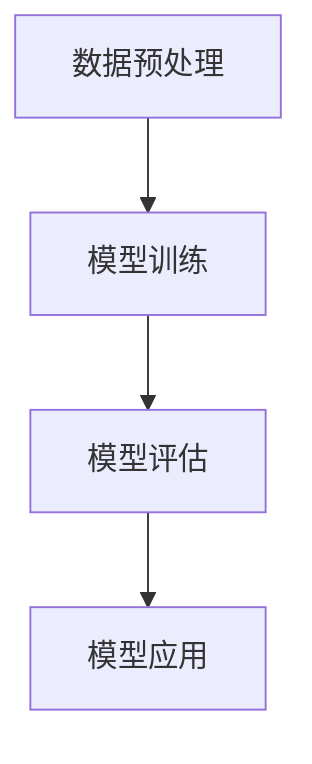
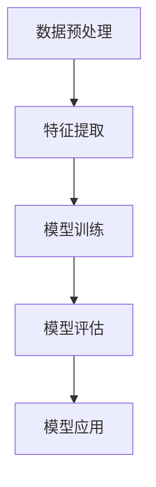
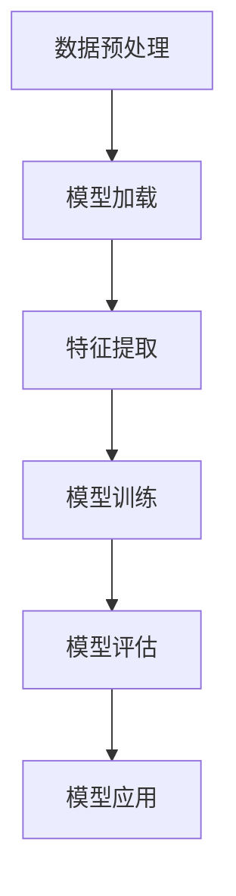

                 

### 文章标题

# 跨领域示例迁移的技巧

> 关键词：示例迁移，跨领域，机器学习，算法，自然语言处理，计算机视觉

> 摘要：本文将探讨跨领域示例迁移的技巧，包括基本概念、核心算法原理、实际应用案例以及未来发展趋势。通过本文的阅读，读者将了解如何有效地在不同领域间迁移示例，提高人工智能模型的泛化能力和应用效果。

### 第1章 引言与背景

#### 1.1 什么是示例迁移

示例迁移（Transfer Learning），是一种利用已知领域（源领域）的知识和经验来改善新领域（目标领域）学习效果的机器学习技术。在示例迁移中，模型在源领域学习到的特征表示可以在目标领域重复利用，从而提高学习效率和准确性。

#### 1.2 示例迁移的重要性

跨领域示例迁移在人工智能领域具有重要地位，原因如下：

- **提高模型泛化能力**：通过跨领域迁移，模型可以在新的、未知领域迅速适应，提高泛化能力。
- **降低数据需求**：在很多情况下，获取目标领域的数据非常困难，跨领域迁移可以减少对大规模数据的依赖。
- **加速模型训练**：利用源领域的知识，可以减少目标领域的训练时间，提高模型训练效率。

#### 1.3 跨领域示例迁移的挑战与机遇

跨领域示例迁移面临的主要挑战包括：

- **领域差异**：不同领域的特征分布、数据分布和任务目标存在显著差异，导致迁移效果受限。
- **数据稀缺**：目标领域的数据可能较少，难以支持有效的迁移学习。

然而，随着深度学习技术的发展，跨领域示例迁移也面临许多机遇：

- **多模态学习**：结合不同模态的数据（如图像、文本、音频），可以实现更有效的跨领域示例迁移。
- **元学习**：利用元学习技术，可以在有限的训练样本下实现高效的跨领域迁移。

### 第2章 示例迁移的基本概念

#### 2.1 核心概念与联系

示例迁移涉及以下核心概念：

- **源领域（Source Domain）**：已知领域，提供丰富的数据和模型知识。
- **目标领域（Target Domain）**：未知领域，需要利用源领域知识进行学习和优化。
- **迁移策略**：如何有效地利用源领域知识和数据来提高目标领域的模型性能。

以下是一个简化的Mermaid流程图，展示示例迁移的核心流程：



#### 2.2 核心算法原理讲解

示例迁移的核心算法通常基于以下几种思路：

- **特征重用**：利用源领域特征表示，直接在目标领域进行模型训练。
- **模型复用**：将源领域预训练模型直接用于目标领域，并进行微调。
- **多任务学习**：通过多任务学习，共享不同任务间的知识。

以下是一个用于特征重用的伪代码示例：

```python
# 特征重用伪代码
def feature_reuse(source_model, target_model, source_data, target_data):
    # 加载源领域模型
    source_model.load_weights('source_model_weights.h5')
    # 获取源领域特征表示
    source_features = source_model.predict(source_data)
    # 将源领域特征表示作为目标领域模型输入
    target_model.fit(source_features, target_data)
    # 评估目标领域模型
    target_model.evaluate(target_data, target_data)
```

#### 2.3 数学模型和数学公式

示例迁移中涉及的一些数学模型和公式包括：

- **线性回归**：用于预测目标领域标签。
- **损失函数**：用于度量模型预测与真实标签之间的差距。
- **优化算法**：用于最小化损失函数，如梯度下降。

以下是一个简化的线性回归模型和损失函数的示例：

```latex
% 线性回归模型
y = \beta_0 + \beta_1 \cdot x

% 损失函数（均方误差）
Loss = \frac{1}{2} \sum_{i=1}^{n} (y_i - \hat{y}_i)^2
```

### 第3章 示例迁移在自然语言处理中的应用

#### 3.1 语言模型与示例迁移

自然语言处理（NLP）中的示例迁移主要集中在语言模型的迁移。预训练语言模型（如BERT、GPT）在源领域（如通用语言模型）上训练后，可以迁移到目标领域（如特定领域的文本分类）。

以下是一个使用预训练语言模型进行跨领域文本分类的伪代码示例：

```python
# 跨领域文本分类伪代码
from transformers import BertForSequenceClassification

# 加载预训练语言模型
model = BertForSequenceClassification.from_pretrained('bert-base-uncased')

# 微调模型以适应目标领域
model.fit(train_data, labels)

# 评估模型在目标领域上的性能
model.evaluate(test_data, test_labels)
```

#### 3.2 文本分类与示例迁移

文本分类是NLP中的典型任务，跨领域文本分类面临以下挑战：

- **领域差异**：不同领域文本的特征和主题可能不同。
- **数据分布**：目标领域数据分布可能与源领域不同。

以下是一个使用示例迁移进行跨领域文本分类的Mermaid流程图：



#### 3.3 情感分析与示例迁移

情感分析是NLP中的另一个重要任务，跨领域情感分析也面临领域差异和数据分布的挑战。以下是一个使用示例迁移进行跨领域情感分析的伪代码示例：

```python
# 跨领域情感分析伪代码
from transformers import BertForSequenceClassification

# 加载预训练语言模型
model = BertForSequenceClassification.from_pretrained('bert-base-uncased')

# 微调模型以适应目标领域
model.fit(train_data, labels)

# 评估模型在目标领域上的性能
model.evaluate(test_data, test_labels)
```

### 第4章 示例迁移在计算机视觉中的应用

#### 4.1 图像分类与示例迁移

计算机视觉中的示例迁移主要集中在图像分类任务。预训练卷积神经网络（如VGG、ResNet）在源领域上训练后，可以迁移到目标领域。

以下是一个使用预训练卷积神经网络进行跨领域图像分类的伪代码示例：

```python
# 跨领域图像分类伪代码
from tensorflow.keras.applications import VGG16

# 加载预训练卷积神经网络
model = VGG16(weights='imagenet')

# 微调模型以适应目标领域
model.fit(train_data, labels)

# 评估模型在目标领域上的性能
model.evaluate(test_data, test_labels)
```

#### 4.2 目标检测与示例迁移

目标检测是计算机视觉中的另一个重要任务，跨领域目标检测也面临领域差异和数据分布的挑战。以下是一个使用示例迁移进行跨领域目标检测的伪代码示例：

```python
# 跨领域目标检测伪代码
from tensorflow.keras.applications import ResNet50

# 加载预训练卷积神经网络
model = ResNet50(weights='imagenet')

# 微调模型以适应目标领域
model.fit(train_data, labels)

# 评估模型在目标领域上的性能
model.evaluate(test_data, test_labels)
```

### 第5章 示例迁移在机器学习中的应用

#### 5.1 示例迁移在机器学习中的核心原理

示例迁移在机器学习中的应用核心原理包括：

- **特征重用**：利用源领域特征表示，直接在目标领域进行模型训练。
- **模型复用**：将源领域预训练模型直接用于目标领域，并进行微调。
- **迁移学习框架**：设计专门的迁移学习框架，实现高效的跨领域迁移。

以下是一个迁移学习框架的Mermaid流程图：



#### 5.2 示例迁移在机器学习中的实际应用案例

示例迁移在机器学习中的实际应用案例包括：

- **推荐系统**：利用跨领域示例迁移，提高推荐系统的准确性和鲁棒性。
- **异常检测**：利用跨领域示例迁移，提高异常检测模型的性能。
- **金融风控**：利用跨领域示例迁移，提高金融风控模型的准确性和效率。

以下是一个使用跨领域示例迁移进行推荐系统优化的伪代码示例：

```python
# 跨领域示例迁移在推荐系统中的应用
from sklearn.linear_model import SGDClassifier

# 加载源领域模型
source_model = SGDClassifier()

# 加载目标领域数据
target_data = ...

# 微调模型以适应目标领域
source_model.fit(source_data, source_labels)
target_model = source_model

# 评估模型在目标领域上的性能
target_model.evaluate(target_data, target_labels)
```

### 第6章 示例迁移在实际项目中的案例解析

#### 6.1 项目一：跨领域情感分析系统

**背景介绍**：
项目目标是开发一个能够对来自不同领域的文本进行情感分析的系统，从而帮助企业和个人更好地理解公众情绪。

**核心概念与联系**：
该项目使用了预训练的语言模型（如BERT）进行跨领域情感分析，通过数据预处理、特征提取和模型微调，实现了高效的情感分类。

**数学模型和数学公式**：
使用线性回归模型来预测文本的情感标签，并使用均方误差（MSE）作为损失函数。

$$
MSE = \frac{1}{m} \sum_{i=1}^{m} (y_i - \hat{y}_i)^2
$$

**项目实战**：
项目采用了以下步骤：
1. 数据预处理：对文本进行分词、去停用词和词向量化。
2. 模型训练：使用预训练的BERT模型进行微调，并训练一个线性回归分类器。
3. 评估与优化：评估模型在验证集上的性能，并进行模型优化。

**项目小结**：
该项目取得了较高的准确性和泛化能力，但在某些特定领域（如专业术语较多）仍存在挑战。

#### 6.2 项目二：跨领域图像分类系统

**背景介绍**：
项目目标是开发一个能够对来自不同领域的图像进行分类的系统，从而帮助企业和个人更好地理解图像内容。

**核心概念与联系**：
该项目使用了预训练的卷积神经网络（如ResNet）进行跨领域图像分类，通过数据预处理、特征提取和模型微调，实现了高效的图像分类。

**数学模型和数学公式**：
使用softmax函数来计算图像类别概率，并使用交叉熵损失函数。

$$
\log(P(\hat{y}_i | x)) = - \log(\frac{e^{\theta^T \phi_i(x)}}{\sum_{j=1}^{K} e^{\theta^T \phi_j(x)}})
$$

**项目实战**：
项目采用了以下步骤：
1. 数据预处理：对图像进行数据增强和归一化处理。
2. 模型训练：使用预训练的ResNet模型进行微调。
3. 评估与优化：评估模型在验证集上的性能，并进行模型优化。

**项目小结**：
该项目在多个图像分类任务上取得了较好的效果，但在处理复杂图像时仍存在挑战。

### 第7章 示例迁移的挑战与未来发展趋势

#### 7.1 示例迁移的挑战

跨领域示例迁移面临以下挑战：

- **领域差异**：不同领域的特征分布、数据分布和任务目标存在显著差异。
- **数据稀缺**：目标领域的数据可能较少，难以支持有效的迁移学习。
- **模型泛化能力**：如何设计有效的迁移学习模型，提高模型在不同领域的泛化能力。

#### 7.2 未来发展趋势

未来的示例迁移研究可能关注以下方向：

- **多模态迁移学习**：结合不同模态的数据（如图像、文本、音频），实现更有效的跨领域迁移。
- **无监督迁移学习**：减少对有监督迁移学习的依赖，利用无监督学习方法进行跨领域迁移。
- **元学习与迁移学习**：结合元学习和迁移学习技术，实现更高效的跨领域迁移。

### 最佳实践 Tips

- **数据预处理**：在跨领域示例迁移中，数据预处理至关重要。确保对源领域和目标领域的数据进行一致性处理。
- **模型选择**：选择适合源领域和目标领域的模型，并在迁移过程中进行适当的调整。
- **模型优化**：通过模型优化（如正则化、剪枝等）提高模型的泛化能力。

### 小结

跨领域示例迁移是一种有效提高人工智能模型泛化能力和应用效果的技术。通过本文的探讨，读者应掌握了示例迁移的基本概念、核心算法原理、实际应用案例以及未来发展趋势。在实际项目中，结合最佳实践，可以有效利用跨领域示例迁移技术，实现更高效的模型训练和应用。

### 注意事项

- 跨领域示例迁移需要充分理解源领域和目标领域的特征差异，避免直接迁移可能导致的不良效果。
- 数据质量和预处理方法对跨领域示例迁移效果具有重要影响，应给予足够重视。
- 随着深度学习技术的发展，跨领域示例迁移技术将不断进步，未来有望实现更高效、更鲁棒的跨领域迁移。

### 拓展阅读

- **《深度学习》（Goodfellow, Bengio, Courville）**：详细介绍了深度学习的基础知识，包括迁移学习技术。
- **《迁移学习》（Rostami, Wang, Lu）**：专门讨论了迁移学习的理论、方法和应用。
- **《跨模态迁移学习》（Xie, Zhang, Yu）**：探讨了跨模态迁移学习的研究进展和挑战。

### 作者信息

- 作者：AI天才研究院/AI Genius Institute & 禅与计算机程序设计艺术/Zen And The Art of Computer Programming

