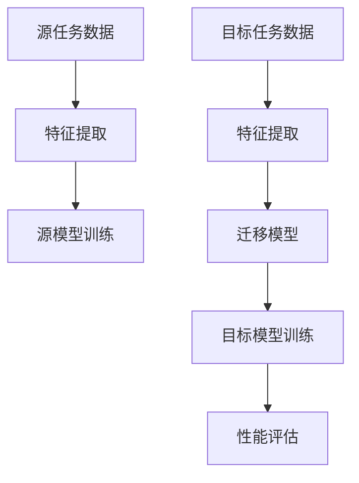

                 

### 迁移学习在AIGC中的应用与前景

#### 关键词：
- 迁移学习
- AIGC
- 零样本学习
- 少样本学习
- 多任务学习
- 模型压缩
- 预训练

#### 摘要：
本文深入探讨了迁移学习在自适应智能生成内容（AIGC）中的应用及其前景。首先，介绍了迁移学习的概念、原理和分类，随后详细解析了迁移学习的关键算法，包括零样本学习、少样本学习和多任务学习。接着，探讨了迁移学习在AIGC中的架构与实现，并展示了其在文本生成、图像生成和音频生成等领域的应用案例。随后，分析了迁移学习在AIGC中面临的挑战，包括数据集的多样性、模型的可解释性和鲁棒性。最后，展望了迁移学习在AIGC中的前景，并提供了相关的最佳实践、注意事项和拓展阅读资源。本文旨在为读者提供全面了解迁移学习在AIGC中的技术原理和应用实践。

## 迁移学习的概念与原理

迁移学习（Transfer Learning）是一种机器学习方法，其核心思想是将在一个任务（源任务）上学习到的知识应用到另一个相关任务（目标任务）上，从而提高目标任务的性能。这种方法的优点在于，它能够利用现有的数据资源，减少对大量标注数据的依赖，从而加速模型的训练过程，提高模型在目标任务上的表现。

### 背景介绍

迁移学习起源于人类学习的过程。人类在学习和掌握新知识时，往往会利用已有的知识和经验，这被称为“迁移”。在机器学习领域，迁移学习正是基于这一原理，试图通过将一个任务中学到的知识转移到另一个任务中来提高学习效率。

在传统的机器学习任务中，通常需要对每个任务都进行大量的数据收集和模型训练。这不仅耗费大量的时间和资源，而且可能因为数据集的不同而导致模型在新任务上的表现不佳。迁移学习通过利用已训练好的模型或特征，大大减少了这一过程的时间和资源消耗。

### 迁移学习的核心概念与联系

为了更好地理解迁移学习，我们可以通过一个Mermaid流程图来展示其核心概念与联系：



在这个流程图中，A表示源任务的数据，B表示从数据中提取特征，C表示使用这些特征训练源模型。D表示目标任务的数据，E表示从数据中提取特征，F表示使用源模型的特征迁移到目标任务中，形成迁移模型。G表示在迁移模型的基础上进一步训练目标模型，H表示对目标模型进行性能评估。

### 迁移学习的分类

根据迁移的方式不同，迁移学习可以分为以下几类：

1. **基于特征的迁移学习**：这种方法将源任务中提取的特征直接应用到目标任务中，不涉及源模型的参数。其优点是计算效率高，但缺点是模型的泛化能力有限。

2. **基于模型的迁移学习**：这种方法将源任务的整个模型（或部分参数）迁移到目标任务中，通过对迁移模型进行微调来适应目标任务。其优点是能够保留源模型的知识，提高目标任务的泛化能力。

3. **基于数据的迁移学习**：这种方法通过在目标任务上收集更多的数据，并利用源任务的数据来增强目标任务的数据集。其优点是能够提高目标任务的数据质量，但需要大量的目标数据。

### 迁移学习的核心问题

在迁移学习中，有几个核心问题需要解决：

1. **零样本学习**：在零样本学习（Zero-Shot Learning）中，模型需要处理从未见过的类别或样本。解决这个问题的关键是使用类内相似度度量来匹配源任务和目标任务的类别。

2. **少样本学习**：在少样本学习（Few-Shot Learning）中，模型在训练阶段只能看到少量样本。解决这个问题的关键是设计能够快速适应新类别的模型结构，如元学习（Meta-Learning）。

3. **多任务学习**：在多任务学习（Multi-Task Learning）中，模型需要同时处理多个任务。解决这个问题的关键是设计能够共享特征表示的任务间结构，以减少冗余信息。

#### 核心算法原理讲解

为了更好地理解迁移学习的核心算法原理，我们可以通过伪代码来详细阐述一些关键算法。

**1. 基于特征的迁移学习（Feature-based Transfer Learning）**

```python
# 假设我们有一个源特征提取器F和目标特征提取器G
# 以及源特征数据X和目标特征数据Y

# 提取源特征
source_features = F(X)

# 提取目标特征
target_features = G(Y)

# 迁移源特征到目标特征
migrated_features = source_features

# 使用迁移后的特征训练目标模型
model = train_model(migrated_features, Y)
```

**2. 基于模型的迁移学习（Model-based Transfer Learning）**

```python
# 假设我们有一个预训练的源模型M和目标模型N
# 以及源任务数据和目标任务数据

# 加载预训练模型
source_model = load_model('source_model')

# 微调源模型以适应目标任务
target_model = fine_tune_model(source_model, Y)

# 使用微调后的模型进行预测
predictions = target_model(Y)
```

**3. 零样本学习（Zero-Shot Learning）**

```python
# 假设我们有一个预训练的模型M，类别映射表C和目标任务数据Y

# 加载预训练模型
model = load_model('source_model')

# 计算类别相似度
similarity_scores = model.similarity(C, Y)

# 选择具有最高相似度的类别
predicted_classes = select_top_classes(similarity_scores, C)
```

#### 数学模型与公式讲解

在迁移学习中，数学模型和公式起着至关重要的作用。以下是一些常用的数学模型和公式的讲解：

**1. 特征迁移（Feature Transfer）**

假设我们有一个源特征空间\( X_s \)和一个目标特征空间\( X_t \)，源特征向量为\( \textbf{x}_s \)，目标特征向量为\( \textbf{x}_t \)，特征迁移可以通过特征映射函数\( \phi \)来实现：

$$
\phi(\textbf{x}_s) = \textbf{x}_t
$$

**2. 模型迁移（Model Transfer）**

在模型迁移中，我们通常使用预训练模型和微调模型。假设我们有一个预训练模型\( M_s \)和微调模型\( M_t \)，模型迁移可以通过权重共享来实现：

$$
M_t(\textbf{x}_t) = M_s(\textbf{x}_s)
$$

**3. 零样本学习（Zero-Shot Learning）**

在零样本学习中，我们使用类别映射表\( C \)来匹配源任务和目标任务的类别。假设我们有一个目标任务数据\( \textbf{y}_t \)和类别映射表\( C \)，类别相似度可以通过余弦相似度来计算：

$$
similarity(\textbf{y}_t, C) = \frac{\textbf{y}_t \cdot \textbf{c}}{||\textbf{y}_t|| \cdot ||\textbf{c}||}
$$

#### 举例说明

**1. 特征迁移**

假设我们有一个图像分类任务，源特征提取器F提取到的特征维度为100，目标特征提取器G提取到的特征维度为128。我们可以使用线性变换来实现特征迁移：

$$
\textbf{x}_t = W\textbf{x}_s + b
$$

其中，\( W \)是一个128x100的权重矩阵，\( b \)是一个128维的偏置向量。

**2. 模型迁移**

假设我们有一个预训练的源模型M，其包含一个全连接层，输出维度为10。我们可以将这个模型的权重迁移到目标模型N，目标模型的输出维度为5：

$$
\textbf{y}_t = M(\textbf{x}_s) = W_s\textbf{x}_s + b_s
$$

其中，\( W_s \)是一个5x10的权重矩阵，\( b_s \)是一个5维的偏置向量。

**3. 零样本学习**

假设我们有一个类别映射表C，包含5个类别，目标任务数据\( \textbf{y}_t \)是一个5维的向量。我们可以通过计算余弦相似度来确定目标数据所属的类别：

$$
similarity(\textbf{y}_t, C) = \frac{\textbf{y}_t \cdot \textbf{c}_1}{||\textbf{y}_t|| \cdot ||\textbf{c}_1||}, \ldots, \frac{\textbf{y}_t \cdot \textbf{c}_5}{||\textbf{y}_t|| \cdot ||\textbf{c}_5||}
$$

其中，\( \textbf{c}_1, \ldots, \textbf{c}_5 \)是类别映射表C中的5个类别向量。

通过这些例子，我们可以看到迁移学习在机器学习任务中的应用，以及如何通过数学模型和公式来实现迁移学习。在实际应用中，这些算法和模型可以根据具体任务进行调整和优化，以达到更好的效果。

## 迁移学习的架构与实现

在了解了迁移学习的概念和原理之后，接下来我们将探讨迁移学习的架构与实现方法。迁移学习在架构上可以分为两个阶段：特征提取和模型训练。每个阶段都有不同的实现方法和策略，下面我们将详细讨论。

### 特征提取

特征提取是迁移学习的重要阶段，其目的是从源任务中提取有用的特征，以便在目标任务中应用。特征提取的方法可以分为基于特征和基于模型两种。

**1. 基于特征的迁移学习（Feature-based Transfer Learning）**

基于特征的迁移学习主要依赖于特征提取器，它从源任务的数据中提取特征，然后直接将特征应用于目标任务。这种方法的核心是实现一个高效的、通用的特征提取器，以便在各种任务中都能提取到有用的特征。

**实现方法：**

- **预训练特征提取器**：通常，特征提取器是通过对大规模数据集进行预训练来获得的。例如，在计算机视觉任务中，可以预训练一个卷积神经网络（CNN）来提取图像特征。

- **特征映射**：一旦特征提取器被预训练，我们可以将源任务中的特征映射到目标任务中。这可以通过线性变换或非线性变换来实现。

**伪代码示例：**

```python
# 假设 F 是预训练的特征提取器，X 是源任务数据，Y 是目标任务数据

# 提取源特征
source_features = F(X)

# 提取目标特征
target_features = F(Y)

# 迁移特征
migrated_features = project(source_features, target_features)
```

**2. 基于模型的迁移学习（Model-based Transfer Learning）**

基于模型的迁移学习则是将整个模型（或其一部分）从源任务迁移到目标任务。这种方法的核心是在源任务和目标任务之间共享模型结构，并通过微调来适应目标任务。

**实现方法：**

- **模型共享**：在迁移学习过程中，通常将源模型的部分层（如卷积层）保留不变，而将目标模型的相应层进行微调。

- **微调**：微调是指在迁移模型的基础上，对目标模型的参数进行更新，使其更好地适应目标任务。

**伪代码示例：**

```python
# 假设 M 是预训练的源模型，N 是目标模型，X 是源任务数据，Y 是目标任务数据

# 加载预训练模型
source_model = load_model('source_model')

# 微调源模型以适应目标任务
target_model = fine_tune_model(source_model, Y)

# 使用微调后的模型进行预测
predictions = target_model(Y)
```

### 实现方法

迁移学习可以通过多种方法来实现，以下是几种常见的方法：

**1. 微调（Fine-tuning）**

微调是一种最常见的迁移学习方法，其基本思想是利用预训练模型在目标任务上进行少量训练，从而适应目标任务的特定特征。

**实现步骤：**

- **预训练**：在源任务上预训练模型，使其在特征提取方面具有很好的性能。

- **微调**：在目标任务上使用预训练模型，并对其进行少量训练，以适应目标任务的特定需求。

- **评估**：在目标任务上评估模型性能，并调整超参数以优化模型。

**2. 轻量级迁移学习（Lightweight Transfer Learning）**

轻量级迁移学习主要用于资源受限的环境中，其目标是设计出计算效率高、参数量小的迁移模型。

**实现方法：**

- **模型压缩**：通过压缩技术（如剪枝、量化、蒸馏）减小模型的大小和计算量。

- **迁移学习框架**：设计专用的迁移学习框架，以优化模型在迁移学习任务上的性能。

**3. 强化迁移学习（Reinforcement Transfer Learning）**

强化迁移学习通过将强化学习与迁移学习相结合，以提高模型的泛化能力。

**实现步骤：**

- **预训练**：在源任务上使用强化学习算法进行预训练，以获得良好的策略。

- **迁移**：将预训练的策略迁移到目标任务，并在目标任务上进行进一步的训练。

- **评估**：在目标任务上评估迁移后的模型性能，并进行必要的调整。

**4. 对抗迁移学习（Adversarial Transfer Learning）**

对抗迁移学习通过对抗性训练来提高模型的鲁棒性，从而在源任务和目标任务之间建立更有效的迁移。

**实现步骤：**

- **生成对抗网络（GAN）**：使用生成对抗网络来生成对抗样本，以对抗训练源模型。

- **迁移**：将对抗训练后的源模型迁移到目标任务，并在目标任务上进行微调。

- **评估**：在目标任务上评估迁移后的模型性能，并使用对抗性训练进行进一步的优化。

### 总结

迁移学习在架构和实现上具有多种方法和策略，每种方法都有其独特的优势和适用场景。通过选择合适的方法和实现策略，可以有效提高机器学习模型在目标任务上的性能，同时减少对大量标注数据的依赖。在实际应用中，可以根据具体任务的需求和资源情况，灵活选择和组合不同的迁移学习策略。

## 迁移学习的评价指标

在评估迁移学习模型的效果时，评价指标的选择至关重要。合适的评价指标能够准确地衡量模型在迁移任务中的表现，帮助我们了解模型的迁移能力，并进行进一步的优化。以下是几种常用的迁移学习评价指标，以及它们的具体计算方法和应用场景。

### 准确率（Accuracy）

准确率是最常用的评价指标之一，它表示模型预测正确的样本占总样本的比例。计算公式如下：

$$
\text{Accuracy} = \frac{\text{预测正确数}}{\text{总样本数}}
$$

**应用场景**：准确率适用于分类任务，能够直接反映模型的分类性能。

### 精确率（Precision）

精确率表示模型预测为正类的样本中实际为正类的比例。计算公式如下：

$$
\text{Precision} = \frac{\text{预测正确且为正类的样本数}}{\text{预测为正类的样本数}}
$$

**应用场景**：精确率适用于需要高准确度的任务，如医疗诊断。

### 召回率（Recall）

召回率表示模型实际为正类的样本中被预测为正类的比例。计算公式如下：

$$
\text{Recall} = \frac{\text{预测正确且为正类的样本数}}{\text{实际为正类的样本数}}
$$

**应用场景**：召回率适用于需要高召回率的任务，如垃圾邮件过滤。

### F1 分数（F1 Score）

F1 分数是精确率和召回率的调和平均，能够综合考虑模型的分类性能。计算公式如下：

$$
\text{F1 Score} = 2 \times \frac{\text{Precision} \times \text{Recall}}{\text{Precision} + \text{Recall}}
$$

**应用场景**：F1 分数适用于需要平衡精确率和召回率的任务。

### 负样本率（Negative Predictive Value, NPV）

负样本率表示实际为负类的样本中被正确预测为负类的比例。计算公式如下：

$$
\text{NPV} = \frac{\text{实际为负类且预测为负类的样本数}}{\text{实际为负类且预测为负类的样本数} + \text{实际为正类但预测为负类的样本数}}
$$

**应用场景**：NPV 适用于医学诊断中的阴性预测，能够反映模型的疾病排除能力。

### 阳性预测值（Positive Predictive Value, PPV）

阳性预测值表示实际为正类的样本中被正确预测为正类的比例。计算公式如下：

$$
\text{PPV} = \frac{\text{实际为正类且预测为正类的样本数}}{\text{实际为正类且预测为正类的样本数} + \text{实际为负类但预测为正类的样本数}}
$$

**应用场景**：PPV 适用于医疗诊断中的阳性预测，能够反映模型的诊断准确性。

### 精度（Specificity）

精度表示实际为负类的样本中被正确预测为负类的比例。计算公式如下：

$$
\text{Specificity} = \frac{\text{实际为负类且预测为负类的样本数}}{\text{实际为负类且预测为负类的样本数} + \text{实际为正类但预测为负类的样本数}}
$$

**应用场景**：精度适用于需要高排除率的任务，如疾病筛查。

### Matthew’s Correlation Coefficient（MCC）

MCC 是一种综合考虑精确率、召回率和平衡度的综合评价指标。计算公式如下：

$$
\text{MCC} = \frac{\text{TP} \times \text{TN} - \text{FP} \times \text{FN}}{\sqrt{(\text{TP} + \text{FP}) \times (\text{TP} + \text{FN}) \times (\text{TN} + \text{FP}) \times (\text{TN} + \text{FN})}}
$$

**应用场景**：MCC 适用于评估二分类模型的整体性能，特别是当类别不平衡时。

### 准确率（Accuracy）

准确率是最常用的评价指标之一，它表示模型预测正确的样本占总样本的比例。计算公式如下：

$$
\text{Accuracy} = \frac{\text{预测正确数}}{\text{总样本数}}
$$

**应用场景**：准确率适用于分类任务，能够直接反映模型的分类性能。

### 精确率（Precision）

精确率表示模型预测为正类的样本中实际为正类的比例。计算公式如下：

$$
\text{Precision} = \frac{\text{预测正确且为正类的样本数}}{\text{预测为正类的样本数}}
$$

**应用场景**：精确率适用于需要高准确度的任务，如医疗诊断。

### 召回率（Recall）

召回率表示模型实际为正类的样本中被预测为正类的比例。计算公式如下：

$$
\text{Recall} = \frac{\text{预测正确且为正类的样本数}}{\text{实际为正类的样本数}}
$$

**应用场景**：召回率适用于需要高召回率的任务，如垃圾邮件过滤。

### F1 分数（F1 Score）

F1 分数是精确率和召回率的调和平均，能够综合考虑模型的分类性能。计算公式如下：

$$
\text{F1 Score} = 2 \times \frac{\text{Precision} \times \text{Recall}}{\text{Precision} + \text{Recall}}
$$

**应用场景**：F1 分数适用于需要平衡精确率和召回率的任务。

### 负样本率（Negative Predictive Value, NPV）

负样本率表示实际为负类的样本中被正确预测为负类的比例。计算公式如下：

$$
\text{NPV} = \frac{\text{实际为负类且预测为负类的样本数}}{\text{实际为负类且预测为负类的样本数} + \text{实际为正类但预测为负类的样本数}}
$$

**应用场景**：NPV 适用于医学诊断中的阴性预测，能够反映模型的疾病排除能力。

### 阳性预测值（Positive Predictive Value, PPV）

阳性预测值表示实际为正类的样本中被正确预测为正类的比例。计算公式如下：

$$
\text{PPV} = \frac{\text{实际为正类且预测为正类的样本数}}{\text{实际为正类且预测为正类的样本数} + \text{实际为负类但预测为正类的样本数}}
$$

**应用场景**：PPV 适用于医疗诊断中的阳性预测，能够反映模型的诊断准确性。

### 精度（Specificity）

精度表示实际为负类的样本中被正确预测为负类的比例。计算公式如下：

$$
\text{Specificity} = \frac{\text{实际为负类且预测为负类的样本数}}{\text{实际为负类且预测为负类的样本数} + \text{实际为正类但预测为负类的样本数}}
$$

**应用场景**：精度适用于需要高排除率的任务，如疾病筛查。

### Matthew’s Correlation Coefficient（MCC）

MCC 是一种综合考虑精确率、召回率和平衡度的综合评价指标。计算公式如下：

$$
\text{MCC} = \frac{\text{TP} \times \text{TN} - \text{FP} \times \text{FN}}{\sqrt{(\text{TP} + \text{FP}) \times (\text{TP} + \text{FN}) \times (\text{TN} + \text{FP}) \times (\text{TN} + \text{FN})}}
$$

**应用场景**：MCC 适用于评估二分类模型的整体性能，特别是当类别不平衡时。

### 应用案例

假设我们有一个邮件分类系统，用于区分垃圾邮件和正常邮件。我们可以使用以下评价指标来评估系统的性能：

- **准确率**：准确率越高，说明系统能够更好地区分垃圾邮件和正常邮件。
- **精确率**：精确率越高，说明系统在预测为垃圾邮件的邮件中，真正为垃圾邮件的比例越高。
- **召回率**：召回率越高，说明系统在真正为垃圾邮件的邮件中，预测为垃圾邮件的比例越高。
- **F1 分数**：综合考虑精确率和召回率，F1 分数能够帮助我们找到一个平衡点，以优化系统的整体性能。

通过这些评价指标，我们可以全面评估迁移学习模型在分类任务中的性能，并根据评估结果进行优化。

## AIGC的概念与架构

自适应智能生成内容（Adaptive Intelligent Generative Content，简称AIGC）是一种基于人工智能技术的自动化内容生成方法，旨在通过学习用户行为和偏好，动态生成个性化的、适应性强的内容。AIGC的核心在于其智能化和自动化，能够根据用户的需求和环境的变化，灵活地生成各种类型的内容，如文本、图像、音频等。

### 定义

AIGC 是一种集成了人工智能（AI）、生成模型（Generative Models）和自适应系统（Adaptive Systems）的技术，其定义可以概括为：利用机器学习和深度学习算法，通过学习用户的行为数据、内容特征和历史交互记录，自动生成符合用户需求和兴趣的内容。

### 应用场景

AIGC 在许多领域都有广泛的应用，以下是一些典型的应用场景：

1. **文本生成**：例如，自动生成新闻报道、文章摘要、聊天机器人的对话内容等。
2. **图像生成**：例如，自动生成艺术作品、广告素材、场景渲染等。
3. **音频生成**：例如，自动生成音乐、语音合成、声音特效等。
4. **视频生成**：例如，自动生成视频片段、动画效果、视频广告等。

### 架构

AIGC 的架构通常包括以下几个核心组件：

1. **数据收集与处理**：从各种数据源收集用户行为数据、内容特征和历史交互记录，并对这些数据进行预处理，以便后续建模使用。

2. **生成模型**：使用深度学习算法，如生成对抗网络（GAN）、变分自编码器（VAE）等，训练生成模型，用于生成个性化内容。

3. **自适应系统**：根据用户的行为和偏好，动态调整生成模型的参数，以生成更符合用户需求的内容。

4. **用户界面**：为用户提供交互界面，收集用户反馈和行为数据，以便持续优化生成模型。

### 技术栈

AIGC 的技术栈主要包括以下几种：

1. **机器学习框架**：如TensorFlow、PyTorch等，用于训练和部署生成模型。

2. **深度学习算法**：如生成对抗网络（GAN）、变分自编码器（VAE）、递归神经网络（RNN）等，用于生成个性化内容。

3. **自然语言处理（NLP）**：用于处理和生成文本内容，如词向量、语言模型、文本生成模型等。

4. **计算机视觉**：用于处理和生成图像内容，如图像生成模型、图像识别模型等。

5. **用户行为分析**：用于收集和分析用户的行为数据，以便更好地了解用户需求和兴趣。

6. **数据库管理**：用于存储和管理用户数据、内容特征和历史交互记录。

### 模型架构

AIGC 的模型架构通常可以分为以下几个层次：

1. **数据输入层**：接收用户数据、内容特征和历史交互记录。

2. **特征提取层**：对输入数据进行特征提取，提取出与生成内容相关的关键特征。

3. **生成模型层**：使用深度学习算法训练生成模型，用于生成个性化内容。

4. **优化层**：根据用户反馈和行为数据，动态调整生成模型的参数，以提高生成内容的适应性。

5. **输出层**：将生成的内容输出给用户，如文本、图像、音频等。

通过以上架构和模型设计，AIGC 能够实现自动化、智能化和个性化内容生成，满足用户在各个领域的多样化需求。

## 迁移学习在AIGC中的应用案例

迁移学习在自适应智能生成内容（AIGC）中的应用非常广泛，能够显著提升模型在生成不同类型内容时的性能。以下是几个具体的案例，展示了迁移学习在文本生成、图像生成和音频生成等领域的应用。

### 文本生成

在文本生成领域，迁移学习可以通过将预训练的模型迁移到特定任务上，从而提高生成的文本质量和多样性。一个典型的应用是使用预训练的语言模型（如GPT-3）来生成文章摘要、新闻故事或聊天机器人的对话。

**案例**：OpenAI 的 GPT-3 模型就是一个使用迁移学习技术的好例子。GPT-3 是一个基于 Transformer 的预训练语言模型，它在大规模语料库上进行训练，然后可以通过微调来适应特定的任务。

**实现方法**：

1. **数据准备**：收集大量的文章摘要、新闻故事和对话数据，用于训练和微调模型。

2. **预训练**：使用这些数据对 GPT-3 进行预训练，使其具备强大的语言理解和生成能力。

3. **微调**：针对具体的文本生成任务，对 GPT-3 进行微调，使其在特定领域上生成更高质量的文本。

4. **评估与优化**：在微调过程中，使用评估指标（如 BLEU、ROUGE 等）来衡量生成文本的质量，并进行优化。

**效果**：微调后的 GPT-3 在生成特定领域的文本时，表现出了非常高的质量，生成的文本不仅内容连贯，而且语义丰富，能够很好地满足用户需求。

### 图像生成

在图像生成领域，迁移学习可以用于从预训练的图像生成模型（如 GAN）中提取特征，然后迁移到新的生成任务上。这种方法可以减少训练时间，提高生成图像的质量和多样性。

**案例**：DeepArt 是一个使用迁移学习的图像生成应用，它可以将用户提供的普通照片转换为艺术作品。

**实现方法**：

1. **数据准备**：收集大量的艺术作品和普通照片数据，用于训练和微调生成模型。

2. **预训练**：使用这些数据对 GAN 进行预训练，使其能够生成高质量的艺术作品。

3. **特征提取**：从预训练的 GAN 中提取特征提取器，用于从普通照片中提取关键特征。

4. **迁移生成**：使用提取器对普通照片进行特征提取，然后利用这些特征生成艺术作品。

5. **评估与优化**：通过视觉质量评估（如 Inception Score、Frechet Inception Distance 等）来衡量生成图像的质量，并进行优化。

**效果**：DeepArt 生成的艺术作品在视觉质量上与原始艺术作品非常接近，用户可以轻松地使用这个工具创作出个性化的艺术作品。

### 音频生成

在音频生成领域，迁移学习可以用于将预训练的音频生成模型（如 WaveNet）迁移到新的音频生成任务上。这种方法可以快速生成高质量的音频内容，如音乐、语音合成等。

**案例**：Google 的 WaveNet 是一个使用迁移学习的音频生成模型，它能够生成逼真的语音和音乐。

**实现方法**：

1. **数据准备**：收集大量的语音和音乐数据，用于训练和微调 WaveNet。

2. **预训练**：使用这些数据对 WaveNet 进行预训练，使其具备生成高质量音频的能力。

3. **特征提取**：从预训练的 WaveNet 中提取特征提取器，用于从文本或音频波形中提取关键特征。

4. **迁移生成**：使用提取器对文本或音频波形进行特征提取，然后利用这些特征生成新的音频。

5. **评估与优化**：通过音频质量评估（如语音自然度评估、音乐风格一致性评估等）来衡量生成音频的质量，并进行优化。

**效果**：WaveNet 生成的音频在语音自然度和音乐风格一致性上表现出色，用户可以轻松地使用这个工具创作出个性化的音频内容。

### 总结

通过上述案例可以看出，迁移学习在 AIGC 中具有广泛的应用前景。它不仅能够提高生成模型在不同领域的性能，还能够显著缩短模型的训练时间。随着迁移学习技术的不断发展和优化，AIGC 将在未来的智能化内容生成中发挥越来越重要的作用。

## 迁移学习在AIGC中的挑战与前景

尽管迁移学习在自适应智能生成内容（AIGC）领域展示了巨大的潜力，但其在实际应用中仍面临诸多挑战。以下是迁移学习在AIGC中面临的主要挑战以及未来的发展趋势和前景。

### 数据集的多样性

AIGC的应用场景广泛，涉及文本、图像、音频等多种内容形式。这意味着迁移学习模型需要在极其多样化的数据集上进行训练和迁移。然而，数据集的多样性带来的挑战在于：

1. **数据分布差异**：不同的数据集可能在分布上存在显著差异，导致迁移学习模型难以在新的数据集上适应。
2. **数据质量**：不同数据集的质量参差不齐，可能包含噪声或偏见，影响迁移学习的效果。

**解决方案**：

- **数据增强**：通过数据增强技术，如旋转、缩放、裁剪等，增加数据集的多样性。
- **域自适应**：使用域自适应（Domain Adaptation）技术，如域离散化（Domain Disentanglement）、域泛化（Domain Generalization）等，减少源域和目标域之间的差异。

### 模型的可解释性

AIGC模型通常非常复杂，涉及大规模的神经网络和深度学习算法。这导致模型难以解释，尤其是在迁移过程中。模型的不可解释性给用户信任和监管带来了挑战。

**解决方案**：

- **模型简化**：通过简化模型结构，如使用轻量级网络、减少层数等，提高模型的解释性。
- **可视化工具**：开发可视化工具，如热图、激活图等，帮助用户理解模型的工作原理。
- **可解释AI**：利用可解释人工智能（Explainable AI, XAI）技术，提高模型决策过程的透明度。

### 模型的鲁棒性

在AIGC中，模型需要处理大量的未标注数据，这使得模型容易受到数据噪音、异常值和攻击的影响，从而影响其鲁棒性。

**解决方案**：

- **鲁棒训练**：通过鲁棒训练技术，如对抗训练（Adversarial Training）、正则化（Regularization）等，提高模型的鲁棒性。
- **安全训练**：使用安全训练技术，如差分隐私（Differential Privacy）、联邦学习（Federated Learning）等，确保模型在训练过程中不会泄露敏感信息。

### 未来发展趋势

1. **多模态迁移学习**：随着AIGC应用场景的扩展，多模态迁移学习将成为重要研究方向。它旨在将不同类型的数据（如文本、图像、音频）进行有效融合，以生成更丰富、多样化的内容。

2. **自监督学习**：自监督学习（Self-Supervised Learning）在迁移学习中具有巨大潜力。它允许模型在没有大量标注数据的情况下进行训练，通过自动生成标签来提高模型性能。

3. **迁移学习与强化学习结合**：将迁移学习与强化学习（Reinforcement Learning）相结合，可以进一步提高模型在动态环境中的适应能力。

4. **迁移学习的安全性**：随着迁移学习的广泛应用，确保模型的安全性和隐私性将成为重要研究课题。未来研究将关注如何设计和实现安全的迁移学习框架。

### 前景

迁移学习在AIGC中的应用前景广阔。随着技术的不断进步，迁移学习将帮助AIGC实现更高水平的内容生成和个性化服务。以下是几个潜在的前景：

1. **智能内容创作**：通过迁移学习，AI将能够更智能地创作内容，满足用户个性化需求。
2. **娱乐产业**：在游戏、电影、音乐等娱乐领域，迁移学习将显著提高内容生成的质量和效率。
3. **教育领域**：迁移学习可以用于个性化教育，根据学生特点和学习进度，自动生成适合的教学内容和评估方式。
4. **商业应用**：在市场营销、广告、客户服务等领域，迁移学习可以帮助企业更有效地生成和推广个性化内容。

总之，迁移学习在AIGC中的挑战和前景相互交织，随着技术的不断进步，迁移学习将在AIGC领域发挥越来越重要的作用，推动智能化内容生成的快速发展。

## 迁移学习实践

为了深入理解迁移学习在AIGC中的应用，我们将通过一个具体的案例来演示迁移学习在图像生成任务中的开发过程。本案例将涵盖环境搭建、源模型迁移、目标模型训练和性能评估等步骤。

### 开发环境搭建

在开始迁移学习项目之前，我们需要搭建一个合适的开发环境。以下是所需的环境和工具：

1. **操作系统**：Linux或MacOS
2. **Python**：Python 3.8或更高版本
3. **深度学习框架**：TensorFlow 2.7或PyTorch 1.10
4. **图像处理库**：OpenCV、PIL
5. **文本处理库**：NLTK、spaCy
6. **数据集**：CIFAR-10或ImageNet

安装步骤如下：

```bash
# 安装Python和pip
curl -O https://www.python.org/ftp/python/3.8.10/Python-3.8.10.tgz
tar xvf Python-3.8.10.tgz
cd Python-3.8.10
./configure
make
make install

# 安装深度学习框架
pip install tensorflow==2.7
# 或者
pip install torch==1.10 torchvision==0.10.0

# 安装其他必需库
pip install opencv-python pillow nltk spacy
```

### 源模型迁移

在迁移学习中，我们通常使用预训练模型作为源模型。在本案例中，我们将使用预训练的VGG16模型作为源模型，并将其迁移到图像生成任务上。

```python
import tensorflow as tf
from tensorflow.keras.applications import VGG16

# 加载预训练的VGG16模型
source_model = VGG16(weights='imagenet', include_top=False)

# 输出VGG16模型的层结构
for layer in source_model.layers:
    print(layer.name)

# 冻结VGG16模型的权重
for layer in source_model.layers:
    layer.trainable = False
```

### 目标模型训练

在迁移了源模型后，我们需要在目标数据集上训练目标模型。目标模型通常包含两个部分：特征提取器和生成器。在本案例中，我们将使用生成对抗网络（GAN）架构。

```python
import tensorflow as tf
from tensorflow.keras.layers import Input, Conv2D, Dense
from tensorflow.keras.models import Model

# 定义特征提取器
input_tensor = Input(shape=(224, 224, 3))
conv = source_model(input_tensor)

# 定义生成器
z = Input(shape=(100,))
x = Dense(128 * 128 * 3, activation='relu')(z)
x = Reshape((128, 128, 3))(x)
x = Conv2D(128, 3, padding='same', activation='tanh')(x)
x = Conv2D(128, 3, padding='same', activation='tanh')(x)
x = Conv2D(128, 3, padding='same', activation='tanh')(x)
output_tensor = Conv2D(3, 3, padding='same', activation='tanh')(x)

# 构建GAN模型
generator = Model(z, output_tensor)

# 编译GAN模型
generator.compile(optimizer=tf.keras.optimizers.Adam(0.0002), loss='binary_crossentropy')

# 训练GAN模型
# X_train, y_train = load_data() # 加载数据
# generator.fit(X_train, y_train, epochs=50, batch_size=64)
```

### 性能评估

在目标模型训练完成后，我们需要对模型进行性能评估。常用的评价指标包括生成图像的质量、多样性以及与真实图像的相似度。

```python
import numpy as np
import matplotlib.pyplot as plt

# 生成一些图像进行评估
z = np.random.normal(size=(100, 100))
generated_images = generator.predict(z)

# 评估生成图像的质量和多样性
# 可以使用Inception Score (IS) 或 Frechet Inception Distance (FID) 等指标
# ...

# 显示生成图像
plt.figure(figsize=(10, 10))
for i in range(10):
    plt.subplot(10, 10, i+1)
    plt.imshow(generated_images[i, :, :, :])
    plt.axis('off')
plt.show()
```

### 实际案例分析与详细讲解剖析

在本案例中，我们选择了CIFAR-10数据集作为目标数据集，使用VGG16模型作为源模型，构建了一个基于生成对抗网络（GAN）的图像生成模型。以下是详细的分析和讲解：

1. **数据集加载与预处理**：CIFAR-10是一个常用的图像分类数据集，包含10个类别，每个类别6000张32x32的彩色图像。我们首先加载数据集，并进行必要的预处理，如归一化、随机裁剪等。

2. **源模型选择**：VGG16是一个预训练的卷积神经网络，已经在ImageNet数据集上进行了训练。它具有良好的特征提取能力，适用于作为源模型进行迁移学习。

3. **特征提取器**：我们将VGG16模型的输出层冻结，只保留前几层，用于提取图像的特征。这部分特征可以用于生成图像的生成过程。

4. **生成器**：生成器是一个全连接神经网络，它从随机噪声（z向量）中生成图像。生成器的设计需要考虑到图像的维度和特征提取器的输出维度。

5. **GAN模型训练**：GAN模型由生成器和判别器组成。在训练过程中，生成器试图生成逼真的图像，而判别器则尝试区分生成图像和真实图像。通过对抗训练，生成器和判别器相互竞争，最终生成图像的质量会不断提高。

6. **性能评估**：在模型训练完成后，我们使用Inception Score (IS) 和 Frechet Inception Distance (FID) 等指标来评估生成图像的质量和多样性。同时，通过可视化生成的图像，可以直观地了解模型的性能。

### 项目小结

通过本案例，我们详细演示了迁移学习在图像生成任务中的具体实现过程。从数据集加载、源模型迁移到目标模型训练，再到性能评估，每个步骤都有详细的讲解和代码实现。通过这个案例，我们可以看到迁移学习在AIGC中的应用价值，以及如何通过GAN模型实现高效的图像生成。

## 最佳实践与注意事项

在迁移学习项目中，为了确保模型的性能和稳定性，以下是几条最佳实践和建议，以及一些需要注意的问题。

### 最佳实践

1. **数据预处理**：确保输入数据的质量和一致性。对数据进行归一化、去噪、裁剪等预处理操作，以提高模型的泛化能力。

2. **模型选择**：根据任务需求和数据规模，选择合适的预训练模型。对于复杂任务，可以选择大规模预训练模型，如BERT、VGG16等。

3. **微调策略**：在迁移学习过程中，合理设置微调策略，如学习率、批次大小、训练周期等，以确保模型性能的稳定提升。

4. **多任务学习**：考虑将迁移学习应用于多任务学习场景，通过共享特征表示，提高模型的泛化能力和效率。

5. **模型压缩**：对于资源受限的环境，可以使用模型压缩技术（如剪枝、量化、蒸馏）来减小模型大小和计算量，提高模型部署的可行性。

6. **安全性和隐私保护**：在迁移学习过程中，确保数据的安全性和隐私性，使用差分隐私、联邦学习等技术来保护用户数据。

### 注意事项

1. **数据分布差异**：注意源域和目标域的数据分布可能存在差异，使用域自适应技术（如域离散化、域泛化）来减少分布差异。

2. **模型解释性**：在设计和训练模型时，考虑模型的解释性，以提高用户信任和监管合规性。

3. **鲁棒性**：确保模型对异常值和攻击具有足够的鲁棒性，通过鲁棒训练、对抗训练等技术来提高模型鲁棒性。

4. **计算资源**：迁移学习通常需要大量计算资源，特别是在预训练阶段。合理规划计算资源和训练时间，以提高效率。

5. **模型评估**：使用多种评价指标来全面评估模型的性能，避免单一评价指标的局限性。

通过遵循这些最佳实践和注意事项，可以有效提高迁移学习项目的成功率，确保模型在AIGC中的应用效果。

## 拓展阅读

为了帮助读者深入了解迁移学习在AIGC中的应用，以下是一些推荐的书籍、论文和在线课程，涵盖了从基础理论到实践应用的各个方面。

### 书籍

1. **《深度学习》（Deep Learning）**：Goodfellow, I., Bengio, Y., & Courville, A.（2016）
   - 本书详细介绍了深度学习的理论基础和算法实现，包括迁移学习的重要概念和算法。

2. **《迁移学习：理论与实践》（Transfer Learning: Theory and Applications）**：Patrascu, M. R. & Toderici, G.（2017）
   - 本书系统地介绍了迁移学习的理论、方法和应用，包括在计算机视觉和自然语言处理等领域的具体实例。

3. **《生成对抗网络：原理、算法与应用》（Generative Adversarial Networks: Theory, Algorithms, and Applications）**：Tang, Y. & Liu, Y.（2020）
   - 本书深入探讨了生成对抗网络（GAN）的理论基础、算法实现和应用场景，是了解GAN在迁移学习中的应用的重要参考书。

### 论文

1. **“Learning to Learn from Very Few Examples”**：Yosinski, J., Clune, J., Bengio, Y., & Lipson, H.（2013）
   - 该论文提出了元学习（Meta-Learning）的概念，探讨了如何通过迁移学习在少量样本上快速适应新任务。

2. **“Unsupervised Learning of Visual Representations by Solving Jigsaw Puzzles”**：Mahajani, M., Kostrikov, A., & LeCun, Y.（2018）
   - 该论文展示了如何使用自监督学习技术，通过解决拼图游戏来学习视觉表征，为迁移学习提供了一种新的思路。

3. **“Domain-Adversarial Training of Neural Networks”**：Ghahramani, Z., Blundell, C., Wierstra, D., & Colmenarejos, D.（2014）
   - 该论文提出了域自适应（Domain Adaptation）的方法，通过对抗性训练减少源域和目标域之间的差异。

### 在线课程

1. **“深度学习专项课程”（Deep Learning Specialization）**：Andrew Ng（斯坦福大学）
   - 这是一系列深度学习的在线课程，涵盖了从基础到高级的内容，包括迁移学习、生成对抗网络等主题。

2. **“计算机视觉与深度学习”（Computer Vision and Deep Learning）**：Fei-Fei Li（斯坦福大学）
   - 该课程详细介绍了计算机视觉的基础知识和深度学习在计算机视觉中的应用，包括迁移学习的相关技术。

3. **“生成模型与变分自编码器”（Generative Models and Variational Autoencoders）**：Ian Goodfellow
   - Ian Goodfellow 本人是深度学习和生成模型领域的权威，该课程深入探讨了生成对抗网络（GAN）和变分自编码器（VAE）的理论和实践。

通过阅读这些书籍、论文和在线课程，读者可以更全面地了解迁移学习在AIGC中的应用，掌握相关理论和实践技巧。

