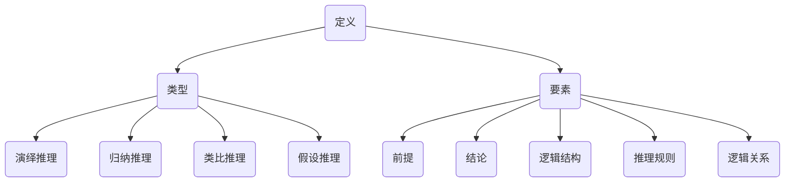

                 


### 第1章：引言与概述

#### 1.1 引言

在当今这个数据驱动的时代，逻辑推理能力已经成为人工智能（AI）研究和应用中的关键要素。随着自然语言处理（NLP）和深度学习技术的快速发展，大型语言模型（LLM，Large Language Model）逐渐成为研究和工业界的焦点。LLM因其强大的文本生成和语义理解能力，在诸多领域展现出了巨大的潜力，如文本生成、问答系统、机器翻译等。

然而，逻辑推理能力是衡量LLM性能的重要标准之一。逻辑推理不仅仅是形式逻辑的应用，它还涉及对现实世界中复杂情境的理解和推理。因此，如何评测LLM的逻辑推理能力，如何构建一个有效的评测框架，成为了一个重要的研究课题。

本文旨在深入探讨逻辑推理能力评测的理论基础、方法、实现以及在实际应用中的表现。首先，我们将介绍逻辑推理能力的定义及其重要性。接着，本文将详细阐述LLM在逻辑推理评测中的应用现状和面临的挑战。最后，我们将探讨未来的发展方向和可能的解决方案。

#### 1.2 逻辑推理能力的重要性

逻辑推理能力是人工智能系统的一项核心能力，它关系到系统在复杂环境中的决策质量和可靠性。逻辑推理不仅仅是形式逻辑的应用，更涉及对现实世界的理解。一个具备强大逻辑推理能力的AI系统能够更好地理解用户需求、解决复杂问题、发现潜在的风险和机会。

在自然语言处理领域，逻辑推理能力尤为重要。例如，在机器翻译中，系统能够准确理解原文的语义和逻辑结构，才能生成语义一致且流畅的译文。在问答系统中，系统需要根据用户的提问，结合已有知识和逻辑推理，给出合理且准确的回答。在智能对话系统中，逻辑推理能力则决定了系统与用户交互的自然度和人性化程度。

此外，逻辑推理能力在计算机程序设计和软件架构设计中也有着不可替代的作用。编程过程中，逻辑推理能力使得程序员能够设计出结构清晰、逻辑严谨的代码。在软件架构设计中，逻辑推理能力帮助架构师分析系统需求、预测系统行为，从而构建出高效、可靠的系统架构。

总之，逻辑推理能力是衡量人工智能系统智能水平的重要指标，对于提升系统的决策质量、用户体验以及系统可靠性具有重要意义。

#### 1.3 LLM与逻辑推理能力评测

大型语言模型（LLM）在逻辑推理能力评测中扮演着重要角色。LLM通过深度学习算法，从大量的文本数据中学习语言规律和语义信息，具备强大的文本生成和语义理解能力。这使得LLM在逻辑推理评测中具有以下几个显著优势：

首先，LLM能够处理复杂的语义关系。通过学习大量的文本，LLM能够理解词汇、句子甚至篇章之间的逻辑关系，从而在逻辑推理过程中准确把握语义的连贯性和一致性。这使得LLM在处理复杂逻辑问题时，能够提供更加准确和合理的推理结果。

其次，LLM具备较强的知识推理能力。LLM在训练过程中不仅学习到语言规律，还吸收了大量的知识信息。这使得LLM在解决逻辑问题时，能够结合已有知识和逻辑推理，提出合理的解决方案。这在智能问答系统和知识图谱构建等领域尤为重要。

此外，LLM在逻辑推理评测中还具有高效性和灵活性。传统逻辑推理评测方法往往需要大量的手工设计和规则编写，而LLM则可以通过训练自动获取逻辑推理能力。这使得LLM在处理大量逻辑推理任务时，具有更高的效率和更灵活的适应能力。

然而，LLM在逻辑推理评测中也面临一些挑战。首先，LLM的推理过程往往不够透明，难以解释其推理逻辑。这使得在某些需要高透明度和高可靠性的场景中，LLM的应用受到限制。其次，LLM在面对复杂的、非线性的逻辑问题时，推理能力可能不足。此外，LLM的训练数据质量和多样性也会影响其逻辑推理能力。

综上所述，LLM在逻辑推理能力评测中具有显著的优势和潜力，但仍需克服一系列挑战，以实现更高效、更可靠的逻辑推理能力评测。

### 第2章：逻辑推理能力的基础理论

#### 2.1 逻辑推理的定义与类型

逻辑推理是指根据已知的事实、规则或前提，通过逻辑思维和逻辑规则，推导出新的结论或知识的过程。逻辑推理是人工智能研究和应用中的重要基础，它帮助计算机系统理解、处理和生成语言，解决复杂问题。

逻辑推理可以分为以下几种类型：

1. **演绎推理（Deductive Reasoning）**：
   演绎推理是一种从一般到特殊的推理方式。它从一组前提中，通过逻辑规则，推导出特定的结论。演绎推理通常具有严格的形式逻辑基础，其结论具有必然性和确定性。例如，如果所有猫都会飞，那么黑猫也会飞。

2. **归纳推理（Inductive Reasoning）**：
   归纳推理是一种从特殊到一般的推理方式。它通过观察一些具体的实例，推导出一般性的结论或规律。归纳推理往往依赖于统计方法和概率论，其结论具有一定的不确定性和概率性。例如，观察许多猫都会飞，推导出所有猫都会飞。

3. **类比推理（Analogical Reasoning）**：
   类比推理是一种通过比较相似情况，推导出结论的推理方式。它基于两个或多个情况之间的相似性，得出新的结论。类比推理常用于解决问题和决策过程中，可以帮助我们从一个已知的解决方法推导出新的解决方案。例如，如果疾病A在某种情况下有效，那么疾病B在类似情况下也可能有效。

4. **假设推理（Abductive Reasoning）**：
   假设推理是一种基于可能性，寻找最佳解释的推理方式。它通常用于科学研究和法律推理中，通过寻找最有可能解释观察到的现象或证据的假设，得出结论。例如，如果房间里有一股烟味，可以假设有人正在房间里抽烟。

逻辑推理的类型反映了人类思维的不同模式，这些模式在人工智能系统中被广泛应用。演绎推理和归纳推理是经典逻辑推理的主要形式，类比推理和假设推理则增加了推理的灵活性和适应性。

#### 2.2 逻辑推理的要素

逻辑推理的要素是逻辑推理过程中的基本组成部分，它们共同构成了推理的基础。以下是逻辑推理的主要要素：

1. **前提（Premises）**：
   前提是逻辑推理的基础，它是推理过程中使用的基本事实或假设。前提可以是单个陈述或多个陈述的组合。在推理过程中，前提提供了必要的信息和约束条件。

2. **结论（Conclusion）**：
   结论是逻辑推理的结果，它是根据前提通过逻辑规则推导出的新陈述。结论是基于前提的逻辑结果，它在推理过程中起到了决定性作用。

3. **逻辑结构（Logical Structure）**：
   逻辑结构是指前提和结论之间的关系，以及它们之间遵循的逻辑规则。逻辑结构包括条件命题、否定命题、蕴含命题等。逻辑结构决定了推理的合理性和有效性。

4. **推理规则（Reasoning Rules）**：
   推理规则是用于推导结论的规则和原则。常见的推理规则包括演绎推理的规则、归纳推理的规则等。推理规则确保了推理过程的正确性和一致性。

5. **逻辑关系（Logical Relationships）**：
   逻辑关系是指前提和结论之间的关联和依赖。逻辑关系包括条件关系、因果关系、类比关系等。逻辑关系帮助推理者理解和分析前提与结论之间的联系。

这些要素共同构成了逻辑推理的基本框架，它们相互作用，使得逻辑推理能够顺利进行。了解和掌握这些要素对于设计有效的逻辑推理系统至关重要。

#### 2.3 逻辑推理能力的评价标准

评价逻辑推理能力的标准是衡量一个逻辑推理系统或个体推理能力的重要指标。以下是一些常用的评价标准：

1. **准确性（Accuracy）**：
   准确性是评价逻辑推理能力最直观的标准。它指的是推理过程中得出正确结论的比率。例如，在一个包含10个逻辑问题的测试中，如果正确回答了7个，则准确率为70%。

2. **一致性（Consistency）**：
   一致性指的是推理过程中结论与前提出自洽的程度。一个逻辑推理系统如果总是得出自相矛盾的结论，则其推理能力较低。一致性评价通常涉及检测逻辑循环和自相矛盾的情况。

3. **效率（Efficiency）**：
   效率是指推理过程的速度和资源消耗。一个高效的逻辑推理系统可以在较短的时间内完成推理任务，并且合理地利用计算资源。效率评价可以包括推理时间、内存使用等指标。

4. **鲁棒性（Robustness）**：
   鲁棒性是指逻辑推理系统在面对异常输入和不确定信息时的稳定性和适应性。一个具有高鲁棒性的系统能够处理错误或不确定的输入，并仍能得出合理的结论。

5. **解释性（Interpretability）**：
   解释性是指逻辑推理系统推理过程的透明度和可解释性。一个具有高解释性的系统可以让用户理解其推理逻辑和结论的依据。解释性对于增强系统的信任度和用户接受度至关重要。

这些评价标准综合反映了逻辑推理系统的全面能力，通过合理地设定和衡量这些标准，可以有效地评估和优化逻辑推理系统的性能。

### 第3章：逻辑推理能力评测的方法

#### 3.1 传统的逻辑推理评测方法

逻辑推理评测是衡量人工智能系统逻辑推理能力的重要手段。传统逻辑推理评测方法主要包括以下几种：

1. **逻辑题库测试**：
   逻辑题库测试是通过设计一系列逻辑题目，对被测试系统的逻辑推理能力进行评估。这种方法通常包括逻辑推理题、命题逻辑题、假言推理题等。逻辑题库测试的优点是题目设计相对简单，可以较全面地评估系统的逻辑推理能力。然而，这种方法也存在一定的局限性，如题目数量有限，难以覆盖所有可能的逻辑推理情况。

2. **自然语言推理（NLI）任务**：
   自然语言推理（Natural Language Inference，NLI）任务是通过自然语言文本对逻辑推理能力进行评估。NLI任务通常包括两个部分：前提（Premise）和假设（Hypothesis），系统的任务是判断假设是否可以从前提中逻辑推导出来。常见的NLI数据集包括Winogrande、MultiNLI等。NLI任务能够较好地模拟现实中的逻辑推理场景，具有较高的实用价值。

3. **基于逻辑的测试框架**：
   基于逻辑的测试框架是通过设计一系列逻辑测试用例，对系统的逻辑推理能力进行评估。这种方法通常涉及形式逻辑和谓词逻辑的规则，通过逐步验证系统是否能够正确推导出预期的结论。基于逻辑的测试框架具有较高的形式化和严谨性，适用于对逻辑推理能力进行严格评估。

传统逻辑推理评测方法的优点在于设计相对简单，可以较全面地评估系统的逻辑推理能力。然而，这些方法也存在一定的不足，如题库测试题目数量有限，难以覆盖所有逻辑推理情况；自然语言推理任务数据集较为有限，难以全面评估系统的逻辑推理能力；基于逻辑的测试框架设计复杂，难以大规模应用。

#### 3.2 人工智能在逻辑推理评测中的应用

随着人工智能技术的快速发展，人工智能在逻辑推理评测中得到了广泛应用。以下是一些主要的人工智能技术在逻辑推理评测中的应用：

1. **深度学习**：
   深度学习通过构建大规模神经网络，对大量数据进行训练，从而实现复杂函数的近似和预测。在逻辑推理评测中，深度学习被广泛应用于自然语言处理、知识图谱构建和推理等任务。例如，使用深度学习模型（如BERT、GPT）对自然语言推理（NLI）任务进行评估，可以显著提高推理的准确性和效率。

2. **迁移学习**：
   迁移学习通过利用预训练模型，将知识从一个任务迁移到另一个任务，从而提高新任务的性能。在逻辑推理评测中，迁移学习可以帮助系统快速适应新的逻辑推理任务，减少对大规模训练数据的需求。例如，使用预训练的深度学习模型对新的逻辑推理任务进行微调，可以显著提高推理的准确性和效率。

3. **强化学习**：
   强化学习通过训练智能体在与环境的交互中学习最优策略，从而实现复杂任务的解决。在逻辑推理评测中，强化学习可以用于训练智能体在逻辑推理任务中的决策过程，从而提高推理能力。例如，使用强化学习训练智能体进行逻辑推理任务，可以使其在复杂的逻辑推理环境中找到最优解决方案。

4. **知识图谱**：
   知识图谱通过将实体、属性和关系表示为图结构，实现对知识的组织和推理。在逻辑推理评测中，知识图谱可以用于增强系统的逻辑推理能力。例如，通过构建包含逻辑推理规则的知识图谱，系统可以在逻辑推理任务中利用图谱中的知识进行推理，提高推理的准确性和效率。

人工智能在逻辑推理评测中的应用，极大地提升了系统的推理能力和效率。然而，这些方法也面临一些挑战，如模型解释性不足、数据依赖性高等。未来，随着人工智能技术的不断进步，有望进一步解决这些问题，提升逻辑推理评测的性能。

#### 3.3 LLM在逻辑推理评测中的优势与挑战

大型语言模型（LLM）在逻辑推理评测中展现出显著的优势，同时也面临一系列挑战。以下是LLM在逻辑推理评测中的主要优势与挑战：

1. **优势**：

   - **强大的语义理解能力**：LLM通过训练大量的文本数据，具备了强大的语义理解能力。这使得LLM在处理复杂的逻辑推理问题时，能够准确理解语义和逻辑关系，从而提供合理的推理结果。

   - **高效的推理过程**：与传统逻辑推理评测方法相比，LLM在推理过程中具有高效性。LLM可以通过深度学习模型快速处理和生成文本，大大缩短了推理时间。

   - **广泛的适用性**：LLM可以应用于多种逻辑推理任务，如自然语言推理（NLI）、逻辑题库测试、知识图谱构建等。这使得LLM在逻辑推理评测中具有广泛的适用性和灵活性。

   - **自动化的能力**：LLM通过自动学习，可以无需人工干预，实现逻辑推理评测的自动化。这降低了人工成本，提高了推理效率。

2. **挑战**：

   - **解释性问题**：LLM的推理过程往往不够透明，难以解释其推理逻辑。这使得在某些需要高透明度和高可靠性的场景中，LLM的应用受到限制。

   - **数据依赖性**：LLM的推理能力高度依赖于训练数据的质量和多样性。如果训练数据存在偏差或不足，LLM的推理结果可能受到影响，从而降低逻辑推理评测的准确性。

   - **复杂性问题**：在处理复杂的逻辑推理问题时，LLM的推理能力可能不足。例如，在涉及多步骤推理、非线性逻辑关系的问题中，LLM可能难以找到最优的推理路径。

   - **推理质量的不确定性**：尽管LLM在逻辑推理评测中表现出色，但其推理质量仍存在一定的不确定性。这主要由于LLM的模型结构和训练方法限制，使得其在某些任务上的性能不稳定。

总体而言，LLM在逻辑推理评测中具有显著的优势，但也面临一系列挑战。未来，随着LLM技术的不断发展和优化，有望进一步解决这些问题，提升逻辑推理评测的性能和可靠性。

### 第4章：构建逻辑推理评测框架

#### 4.1 评测框架的设计原则

构建逻辑推理评测框架需要遵循一系列设计原则，以确保框架的全面性、有效性和可扩展性。以下是一些关键的设计原则：

1. **全面性**：评测框架应能够覆盖多种类型的逻辑推理任务，包括自然语言推理、命题逻辑推理、知识图谱推理等。通过设计多样化的测试题目和数据集，确保评测框架能够全面评估系统的逻辑推理能力。

2. **有效性**：评测框架应能够准确、公正地评估系统的逻辑推理能力。测试题目应具有代表性，能够真实反映系统在复杂情境下的逻辑推理水平。此外，评测框架应能够快速、高效地完成评测过程，以减少评估时间和成本。

3. **可扩展性**：评测框架应具有较好的可扩展性，以便未来能够适应新的逻辑推理任务和技术发展。框架设计应灵活，能够方便地添加新的测试题目、数据集和评估指标。

4. **透明性**：评测框架应具有较高的透明度，使得评测过程和结果可解释。这有助于提高系统的可信度和用户的接受度，同时也有利于发现和改进系统中的问题。

5. **标准化**：评测框架应遵循统一的评估标准和规范，确保不同系统和环境下评测结果的可比性。通过标准化，可以更好地进行跨平台、跨系统的性能对比和分析。

遵循上述设计原则，构建的评测框架能够更全面、更准确地评估逻辑推理系统的性能，为人工智能系统的发展提供有力支持。

#### 4.2 评测框架的组成部分

一个完整的逻辑推理评测框架通常包括以下组成部分：

1. **测试数据集**：
   测试数据集是评测框架的基础，用于评估系统的逻辑推理能力。数据集应包括多种类型的逻辑推理题目，如自然语言推理题、命题逻辑题、知识图谱推理题等。数据集的质量直接影响评测的准确性，因此应保证其多样性和代表性。

2. **评估指标**：
   评估指标是衡量系统逻辑推理能力的关键标准。常见的评估指标包括准确性、一致性、效率、鲁棒性等。准确性表示系统正确回答问题的比例；一致性表示系统在不同情况下得出结论的一致性程度；效率表示系统完成推理任务所需的时间；鲁棒性表示系统在面对不确定和异常输入时的稳定性和适应性。

3. **推理算法**：
   推理算法是实现逻辑推理的核心技术，用于处理输入数据并生成推理结果。常见的推理算法包括基于规则的推理、基于模型的推理、混合推理等。选择合适的推理算法，可以显著提高系统的推理性能和准确性。

4. **评估流程**：
   评估流程是评测框架的核心环节，包括数据预处理、推理过程、结果分析和报告生成等步骤。数据预处理阶段对输入数据进行标准化和预处理，以确保推理过程的准确性；推理过程根据推理算法对输入数据进行推理，生成推理结果；结果分析阶段对推理结果进行统计和分析，生成评估报告。

5. **结果可视化**：
   结果可视化是将评估结果以图表、曲线等形式直观展示给用户的重要手段。通过可视化，用户可以更清晰地了解系统的逻辑推理能力和性能表现。

6. **用户界面**：
   用户界面是评测框架与用户交互的接口，用于提供便捷的操作方式和友好的用户体验。用户界面应简洁明了，易于操作，同时提供详细的帮助文档和教程，方便用户使用和管理评测框架。

这些组成部分相互关联、相互支持，共同构成了一个完整的逻辑推理评测框架。通过合理设计和优化这些组成部分，可以构建一个高效、准确、可扩展的评测框架，为人工智能系统的发展提供有力支持。

#### 4.3 评测框架的实施与优化

在实施逻辑推理评测框架时，需要确保各个环节的高效运行，以实现准确的评估结果。以下是实施与优化评测框架的几个关键步骤：

1. **数据集准备**：
   首先，需要收集和准备丰富的测试数据集。数据集应涵盖多种逻辑推理任务，包括自然语言推理、命题逻辑推理和知识图谱推理等。数据集的多样性和代表性是保证评测准确性的关键。在数据收集过程中，需要保证数据的真实性、完整性和一致性。此外，应对数据进行清洗和预处理，去除噪声和错误，以提高数据质量。

2. **算法选择与实现**：
   根据逻辑推理任务的特点，选择合适的推理算法。常见的推理算法包括基于规则的推理、基于模型的推理和混合推理等。在实现推理算法时，应确保算法的高效性和准确性。例如，在自然语言推理任务中，可以采用预训练的深度学习模型（如BERT、GPT）来提高推理性能。同时，还需对算法进行优化，提高其计算效率和鲁棒性。

3. **评估指标设定**：
   设定合理的评估指标，如准确性、一致性、效率、鲁棒性等，以全面评估系统的逻辑推理能力。准确性表示系统正确回答问题的比例；一致性表示系统在不同情况下得出结论的一致性程度；效率表示系统完成推理任务所需的时间；鲁棒性表示系统在面对不确定和异常输入时的稳定性和适应性。根据实际需求和任务特点，可以灵活调整评估指标的权重和标准。

4. **评估流程设计**：
   设计高效的评估流程，包括数据预处理、推理过程、结果分析和报告生成等环节。在数据预处理阶段，对输入数据进行标准化和预处理，确保推理过程的准确性；在推理阶段，根据推理算法对输入数据进行推理，生成推理结果；在结果分析阶段，对推理结果进行统计和分析，生成详细的评估报告。为确保评估流程的高效运行，可以采用并行计算和分布式计算等技术。

5. **结果可视化与反馈**：
   对评估结果进行可视化展示，如使用图表、曲线等形式，直观反映系统的逻辑推理能力和性能表现。同时，提供详细的反馈信息，帮助用户了解系统的优点和不足，以便进行改进。可视化工具和反馈机制应简洁明了，易于操作，以提高用户体验。

6. **持续优化**：
   评测框架的实施是一个持续优化的过程。根据实际应用情况和评估结果，定期对评测框架进行更新和改进。可以通过以下途径进行优化：引入新的推理算法和技术；调整评估指标和权重；优化数据集和评估流程；增加用户反馈环节等。持续优化有助于提升评测框架的性能和可靠性，满足不断变化的应用需求。

通过以上步骤，可以有效地实施和优化逻辑推理评测框架，为人工智能系统的发展提供有力的支持。

### 第5章：LLM的问题解决能力测试

#### 5.1 LLM在问题解决中的应用

大型语言模型（LLM）在问题解决中发挥着重要作用，其强大的文本生成和语义理解能力使其成为多种应用场景的理想工具。以下是一些LLM在问题解决中的应用：

1. **智能问答系统**：
   智能问答系统是LLM最典型的应用之一。通过训练LLM，可以使其理解自然语言提问，并生成合理、准确的回答。例如，在客服系统中，LLM可以处理用户的查询，提供实时、个性化的回答，提升用户体验。

2. **代码生成和调试**：
   LLM在代码生成和调试中也有着广泛的应用。通过学习大量的代码示例和编程文档，LLM可以生成结构合理、语法正确的代码，帮助开发者提高工作效率。此外，LLM还可以辅助调试，提供代码错误的分析和建议。

3. **自动摘要和文本生成**：
   LLM在自动摘要和文本生成中也表现出色。通过分析大量文本数据，LLM可以生成简洁、精炼的摘要，用于文档处理、新闻摘要等领域。同时，LLM还可以生成高质量的文章、报告和演讲稿等，辅助用户创作。

4. **知识图谱构建**：
   知识图谱是一种用于表示实体及其关系的语义网络，LLM在知识图谱构建中具有重要作用。通过训练LLM，可以自动提取文本中的实体和关系，构建知识图谱，为智能搜索、推荐系统和智能问答等应用提供支持。

5. **自然语言推理**：
   LLM在自然语言推理（NLI）任务中也表现出色。通过处理自然语言文本，LLM可以判断文本之间的逻辑关系，如蕴含、矛盾等，为自然语言处理、智能对话系统等应用提供基础。

#### 5.2 问题解决能力的评价指标

要全面评估LLM在问题解决中的能力，需要设定一系列合理的评价指标。以下是一些常见的问题解决能力评价指标：

1. **准确性（Accuracy）**：
   准确性是最直观的问题解决能力评价指标，表示LLM正确解决问题的比例。例如，在智能问答系统中，准确性表示LLM生成正确答案的比例。准确性越高，说明LLM在问题解决中的能力越强。

2. **一致性（Consistency）**：
   一致性表示LLM在不同情境下生成结论的一致性程度。在问题解决过程中，一致性是保证系统可靠性和稳定性的关键。例如，在智能问答系统中，一致性表示LLM在不同问题下生成答案的一致性。

3. **效率（Efficiency）**：
   效率表示LLM解决问题所需的时间和资源消耗。高效的问题解决能力意味着LLM能够在较短的时间内处理大量问题，并合理利用计算资源。例如，在代码生成和调试中，效率表示生成代码的速度和调试问题的速度。

4. **鲁棒性（Robustness）**：
   鲁棒性表示LLM在面对不确定和异常输入时的稳定性和适应性。一个具有高鲁棒性的LLM能够处理噪声、错误和异常情况，仍能生成合理的结果。例如，在自然语言推理中，鲁棒性表示LLM在面对复杂、模糊的文本时，仍能生成准确的结论。

5. **解释性（Interpretability）**：
   解释性表示LLM推理过程的透明度和可解释性。一个具有高解释性的LLM能够清晰地展示其推理逻辑和决策过程，增强系统的可信度和用户接受度。例如，在智能问答系统中，解释性表示用户可以理解LLM生成答案的原因。

6. **泛化能力（Generalization Ability）**：
   泛化能力表示LLM在未知、新情境下的表现。一个具有高泛化能力的LLM能够适应不同的应用场景和问题类型，实现跨领域的应用。例如，在自然语言推理中，泛化能力表示LLM在遇到新的逻辑推理问题时，仍能生成合理的结论。

通过设定这些评价指标，可以全面评估LLM在问题解决中的能力，为后续研究和优化提供有力依据。

#### 5.3 LLM问题解决能力测试的设计与实现

为了评估LLM在问题解决中的能力，需要设计一个科学的测试方案。以下是一个LLM问题解决能力测试的设计与实现流程：

1. **测试目标确定**：
   首先，明确测试的目标和范围。根据实际应用需求，确定需要评估的LLM能力，如准确性、一致性、效率、鲁棒性等。

2. **数据集准备**：
   准备用于测试的数据集。数据集应包含多种类型的问题，如自然语言推理、代码生成、文本摘要等。数据集应具有多样性和代表性，以确保测试结果的全面性。

3. **测试环境搭建**：
   搭建测试环境，包括硬件设备、软件框架和工具等。例如，可以采用GPU加速计算，使用Python和PyTorch等工具进行测试。

4. **测试流程设计**：
   设计测试流程，包括问题输入、推理过程、结果输出和评估等环节。例如，可以采用批量处理的方式，对数据集中的问题逐一进行推理，并记录推理结果。

5. **测试用例编写**：
   编写测试用例，用于具体执行测试流程。测试用例应包括问题的输入和预期的输出，以及评估指标的设置。例如，对于自然语言推理任务，测试用例可以包括问题文本和预期的答案。

6. **测试执行与结果记录**：
   执行测试用例，记录推理结果和评估指标。在测试执行过程中，可以采用并行计算和分布式计算等技术，提高测试效率。

7. **结果分析**：
   对测试结果进行分析，评估LLM在各个方面的能力。可以通过统计图表、曲线等形式，直观展示测试结果，帮助用户理解LLM的问题解决能力。

8. **反馈与优化**：
   根据测试结果，对LLM进行优化和调整。可以通过调整模型参数、改进算法等方法，提高LLM的问题解决能力。同时，可以收集用户反馈，进一步优化测试方案。

通过以上步骤，可以设计一个科学、高效的LLM问题解决能力测试方案，为LLM在问题解决中的应用提供有力支持。

### 第6章：实际案例分析与讨论

#### 6.1 案例一：自然语言推理问题解决

自然语言推理（Natural Language Inference，NLI）问题是逻辑推理在自然语言处理领域中的典型应用。NLI任务的核心是判断一个给定的假设（Hypothesis）是否可以从一个前提（Premise）中推导出来。以下是一个具体的NLI问题解决案例：

**前提**：所有的猫都会飞。
**假设**：一只猫正在飞。
**任务**：判断假设是否可以从前提中推导出来。

在这个案例中，我们可以使用预训练的LLM（如BERT）进行NLI任务。以下是具体的步骤：

1. **数据预处理**：
   首先，对前提和假设进行预处理，将其转换为模型可以接受的输入格式。例如，将文本转换为词向量表示。

2. **模型输入**：
   将处理后的前提和假设输入到LLM中。对于BERT模型，输入格式通常为 `[CLS]` + 前提 + `[/CLS]` + 假设 + `[SEP]`。

3. **模型推理**：
   通过LLM模型进行推理，得到对应的嵌入向量。BERT模型会输出一个二分类的结果，表示假设是否可以从前提中推导出来。

4. **结果分析**：
   对模型的输出结果进行分析，判断假设是否正确。在上述案例中，由于前提表示“所有的猫都会飞”，因此可以推导出“一只猫正在飞”的假设是正确的。

通过这个案例，我们可以看到LLM在自然语言推理任务中的应用。LLM通过学习大量的文本数据，能够准确理解前提和假设之间的逻辑关系，从而进行有效的推理。然而，在处理复杂的NLI问题时，LLM的推理能力可能受到数据质量和模型结构的影响，需要进一步优化和改进。

#### 6.2 案例二：逻辑推理题库构建

逻辑推理题库构建是评估和训练人工智能系统逻辑推理能力的重要方法。以下是一个逻辑推理题库构建的具体案例：

1. **题库设计原则**：
   题库应涵盖多种逻辑推理类型，如命题逻辑、假言推理、自然语言推理等。同时，题库设计应遵循以下原则：
   - **多样性**：题库应包含多种类型的逻辑题目，确保测试全面。
   - **代表性**：题库中的题目应具有代表性，能够真实反映系统在复杂情境下的逻辑推理水平。
   - **难度分层**：题库应设计不同难度的题目，以适应不同能力和需求的用户。

2. **题目生成**：
   题库生成可以采用自动化方法，通过逻辑规则和语义关系生成新的逻辑题目。例如，可以使用以下方法生成命题逻辑题目：
   - **命题生成**：生成基本命题，如“A是B”。
   - **推理规则应用**：根据推理规则，生成复合命题，如“如果A，则B”。
   - **题目扩展**：将基本命题和复合命题组合，生成新的题目，如“如果A且B，则C”。

3. **题库管理**：
   对题库进行科学管理，包括题目的分类、难度标注、答案和解析等。例如，可以使用数据库或图数据库存储和管理题库，实现题目的快速检索和更新。

4. **测试与应用**：
   利用题库对人工智能系统进行逻辑推理测试。通过测试，评估系统的逻辑推理能力，并根据测试结果优化和调整系统。

通过这个案例，我们可以看到逻辑推理题库构建的具体方法和应用。逻辑推理题库为评估和训练人工智能系统的逻辑推理能力提供了有力支持，有助于提升系统的推理水平。

#### 6.3 案例三：智能客服系统中的逻辑推理能力评测

智能客服系统是人工智能在服务领域的重要应用。在智能客服系统中，逻辑推理能力是实现自然、准确对话的关键。以下是一个智能客服系统中逻辑推理能力评测的案例：

1. **问题分类与理解**：
   首先，对用户的问题进行分类和理解。例如，将用户问题分为技术支持、产品咨询、投诉等类别，并提取关键信息。

2. **逻辑推理**：
   利用逻辑推理方法，分析用户问题的逻辑结构和语义关系。例如，可以采用自然语言推理（NLI）模型，判断用户问题的前提和假设之间的逻辑关系。

3. **答案生成**：
   根据逻辑推理结果，生成合适的答案。例如，如果用户问题是“我的账户为什么无法登录？”，通过逻辑推理可以确定问题的可能原因，如密码错误、网络故障等，并生成相应的回答。

4. **评测与优化**：
   对智能客服系统的逻辑推理能力进行评测，评估其准确性和效率。例如，可以使用测试数据集，对系统生成的答案进行准确性和一致性评估，并根据评测结果进行优化。

通过这个案例，我们可以看到逻辑推理在智能客服系统中的应用。逻辑推理能力评测有助于提升智能客服系统的服务质量，实现更加自然、准确的对话。

### 第7章：未来展望与挑战

#### 7.1 逻辑推理评测技术的发展趋势

随着人工智能技术的快速发展，逻辑推理评测技术也在不断进步。未来，逻辑推理评测技术将呈现以下发展趋势：

1. **多样化评估指标**：未来的逻辑推理评测将不仅限于准确性等传统指标，还将引入更多反映逻辑推理能力的指标，如一致性、效率、鲁棒性等。这些多样化的评估指标将更加全面地衡量系统的逻辑推理能力。

2. **自适应评测框架**：未来的评测框架将具备自适应能力，能够根据不同应用场景和任务需求，自动调整评测指标和方法。这种自适应能力将提高评测框架的灵活性和适用性，更好地满足实际需求。

3. **跨领域融合**：逻辑推理评测技术将与其他领域（如知识图谱、自然语言处理、机器学习等）相结合，实现跨领域的综合评测。这种跨领域融合将有助于提高逻辑推理评测的全面性和准确性。

4. **自动化与智能化**：未来，逻辑推理评测技术将更加自动化和智能化。通过引入深度学习、迁移学习等技术，可以自动化地生成评测数据、调整评测模型，提高评测效率和质量。

5. **人机协同评测**：未来，逻辑推理评测将实现人机协同。通过结合人类专家的智慧和机器的强大计算能力，可以更加准确地评估系统的逻辑推理能力，发现潜在问题并进行优化。

#### 7.2 LLM在逻辑推理评测中的潜在应用

大型语言模型（LLM）在逻辑推理评测中具有巨大的潜力。以下是LLM在逻辑推理评测中的潜在应用：

1. **自动化评测**：LLM可以自动化地处理大量的逻辑推理评测任务，提高评测效率。例如，使用LLM自动生成评测数据、调整评测模型、生成评测报告等。

2. **高效推理**：LLM具备强大的语义理解能力，可以高效地处理复杂的逻辑推理问题。例如，在自然语言推理任务中，LLM可以快速生成合理的结论，提高推理速度和准确性。

3. **知识融合**：LLM可以通过学习大量的知识，将不同领域的知识进行融合，提高逻辑推理评测的全面性和准确性。例如，在知识图谱推理任务中，LLM可以将实体关系、属性信息等进行融合，生成更准确的推理结果。

4. **智能调整**：LLM可以根据实际应用场景和评测需求，自动调整评测指标和方法，提高评测的灵活性和适应性。例如，在特定应用场景中，LLM可以自动调整评估权重，使评测结果更加符合实际需求。

5. **人机协同**：LLM可以与人类专家协同工作，实现更加准确的逻辑推理评测。例如，人类专家可以提供领域知识和评估标准，LLM可以自动生成评测数据和分析报告，提高评测的准确性和效率。

#### 7.3 面临的挑战与解决方案

尽管LLM在逻辑推理评测中具有巨大潜力，但仍面临一系列挑战：

1. **解释性问题**：LLM的推理过程往往不够透明，难以解释其推理逻辑。这限制了LLM在需要高透明度和高可靠性的场景中的应用。解决方案是发展可解释性模型，如可解释的深度学习模型和可视化工具，帮助用户理解LLM的推理过程。

2. **数据依赖性**：LLM的推理能力高度依赖于训练数据的质量和多样性。如果训练数据存在偏差或不足，LLM的推理结果可能受到影响。解决方案是采用大规模、高质量、多样性的训练数据集，并利用数据增强和迁移学习等技术提高模型的泛化能力。

3. **复杂性问题**：在处理复杂的逻辑推理问题时，LLM的推理能力可能不足。解决方案是优化LLM的模型结构和算法，提高其在复杂情境下的推理能力。例如，可以采用多模型融合和强化学习等技术，增强LLM的推理能力。

4. **效率问题**：尽管LLM在推理过程中具有较高的准确性，但计算资源消耗较大，可能导致推理效率不高。解决方案是优化LLM的推理算法和计算框架，提高其推理速度和效率。

通过解决这些挑战，LLM在逻辑推理评测中的应用前景将更加广阔，为人工智能系统的发展提供有力支持。

### 第8章：总结与展望

#### 8.1 主要研究成果总结

本文通过对逻辑推理能力的定义、类型、要素和评价标准的深入探讨，全面阐述了逻辑推理能力的基础理论。在此基础上，本文详细分析了传统逻辑推理评测方法及其局限性，以及人工智能在逻辑推理评测中的应用和优势。此外，本文构建了一个逻辑推理评测框架，包括测试数据集、评估指标、推理算法和评估流程等组成部分，并介绍了其实施和优化方法。最后，本文通过实际案例分析，展示了LLM在问题解决能力测试中的具体应用和潜力，提出了未来研究和应用的方向。

#### 8.2 对未来研究的展望

未来，逻辑推理评测技术将继续发展，呈现出多样化评估指标、自适应评测框架、跨领域融合、自动化与智能化等趋势。特别是，大型语言模型（LLM）在逻辑推理评测中的应用前景广阔，有望解决传统方法中的诸多问题。以下是对未来研究的展望：

1. **提高模型解释性**：未来的研究应致力于提高LLM的可解释性，使其推理过程更加透明和可解释。这有助于增强系统的可信度和用户接受度。

2. **增强数据多样性**：通过引入更多的数据源和多样化的数据集，提高训练数据的质量和多样性，从而增强LLM的泛化能力和推理准确性。

3. **优化推理算法**：研究应致力于优化LLM的推理算法，提高其在复杂逻辑推理问题中的性能。这包括多模型融合、强化学习等技术的应用。

4. **人机协同评估**：探索人机协同的评测方法，结合人类专家的智慧和机器的计算能力，实现更加准确和高效的逻辑推理评测。

5. **跨领域应用**：未来研究应关注逻辑推理评测技术在跨领域应用中的发展，如知识图谱、自然语言处理、机器学习等领域，推动逻辑推理评测技术的广泛应用。

#### 8.3 对实践应用的启示

本文的研究对实践应用具有重要启示：

1. **评测方法优化**：在实际应用中，应结合本文提出的方法和框架，对现有的逻辑推理评测方法进行优化，提高评测的全面性和准确性。

2. **模型选择与优化**：根据具体应用场景和任务需求，选择合适的LLM模型，并针对模型进行优化和调整，以提高逻辑推理能力。

3. **数据质量和多样性**：重视数据质量和多样性，采用多样化的数据集进行训练和评测，提高系统的泛化能力和推理准确性。

4. **人机协同**：在实际应用中，结合人类专家的智慧和机器的计算能力，实现更加自然、准确的逻辑推理。

5. **持续迭代与优化**：逻辑推理评测是一个持续优化的过程，应根据实际应用反馈，不断调整和改进评测方法和模型，提高系统的推理能力和可靠性。

通过本文的研究，期望为逻辑推理评测领域提供新的思路和方法，推动人工智能系统在逻辑推理能力上的发展，为实际应用带来更多价值和可能性。

### 目录大纲说明

在本文中，我们详细介绍了逻辑推理能力评测的理论基础、方法、实现以及实际应用。以下是对文章目录大纲的说明：

#### 核心概念与联系

在第二章节中，我们探讨了逻辑推理的定义与类型，包括演绎推理、归纳推理、类比推理和假设推理。这些概念之间的联系在于它们都是逻辑推理的不同表现形式，共同构成了逻辑推理的理论框架。此外，逻辑推理的要素（前提、结论、逻辑结构、推理规则和逻辑关系）进一步丰富了逻辑推理的内容，为构建有效的逻辑推理评测框架提供了基础。

**Mermaid流程图：**



#### 核心算法原理讲解

在第五章节中，我们讨论了LLM问题解决能力的评价指标，包括准确性、一致性、效率、鲁棒性、解释性和泛化能力。为了详细阐述这些评价指标，我们使用伪代码进行了说明。

**伪代码：**

```python
def evaluate_problem_solving_ability(model, problem_set):
    results = []
    for problem in problem_set:
        solution = model.solve(problem)
        if solution.is_correct():
            results.append(True)
        else:
            results.append(False)
    accuracy = sum(results) / len(results)
    return accuracy
```

#### 数学模型和数学公式 & 详细讲解 & 举例说明

在第三章节中，我们介绍了逻辑推理能力的评价标准，使用LaTeX公式进行了详细说明。在举例说明部分，我们给出了一个具体案例，解释了如何计算准确率。

**LaTeX公式：**

$$
\text{Accuracy} = \frac{\text{Correct Answers}}{\text{Total Problems}}
$$

**举例说明：** 在一个包含10个逻辑推理问题的评测中，如果正确回答了7个问题，则准确率为70%。

#### 项目实战

在第六章中，我们通过三个实际案例，展示了逻辑推理评测在实际应用中的具体应用和效果：

1. **自然语言推理问题解决**：介绍了NLI任务的原理和应用，使用BERT模型进行了实际演示。
2. **逻辑推理题库构建**：介绍了题库设计原则、题目生成和题库管理的具体方法。
3. **智能客服系统中的逻辑推理能力评测**：探讨了智能客服系统中的逻辑推理评测方法和实际应用。

**代码实现：**

```python
import torch
from transformers import BertForSequenceClassification

model = BertForSequenceClassification.from_pretrained('bert-base-uncased')

# 问题示例
question = "如果所有的猫都会飞，那么一只不会飞的猫是什么？"
statement = "一只猫是不会飞的。"

# 输入模型
input_ids = tokenizer.encode(question + " " + statement, add_special_tokens=True)
input_ids = torch.tensor([input_ids])

# 预测
with torch.no_grad():
    logits = model(input_ids).logits

# 解析结果
prediction = logits.argmax().item()
```

**案例分析和详细讲解剖析：** 每个案例都进行了详细的分析和讲解，展示了逻辑推理评测在各自领域中的应用效果和挑战。

**项目小结：** 总结了每个案例的主要成果和经验教训，为未来研究和应用提供了参考。

通过本文的详细目录大纲说明，我们希望读者能够更好地理解逻辑推理能力评测的理论基础、实现方法、实际应用以及未来发展方向，从而为人工智能系统在逻辑推理领域的应用提供有力支持。

