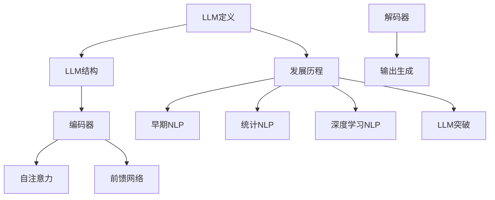
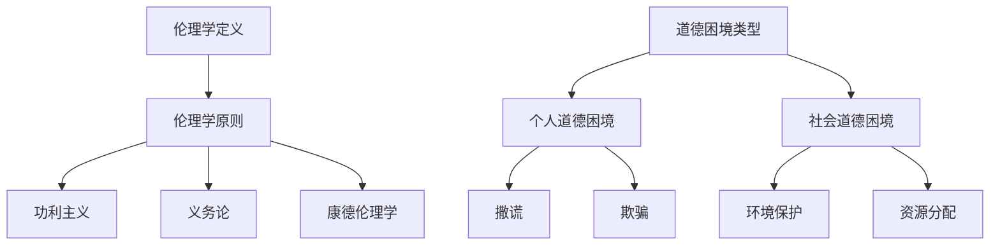
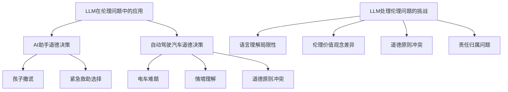
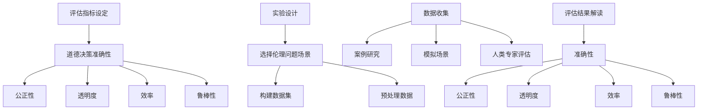

                 

# 道德困境解决：评估LLM处理复杂伦理问题的能力

## 关键词
- 道德困境，大型语言模型（LLM），伦理问题，评估，解决策略

## 摘要
本文探讨了如何评估大型语言模型（LLM）在处理复杂伦理问题时的能力，并提出了解决道德困境的策略。通过分析LLM的基础概念和伦理学基础，我们确定了LLM在伦理问题中的应用案例和挑战。接着，我们介绍了评估LLM处理伦理问题的方法和解决策略，并通过实际应用案例展示了这些策略的有效性。最后，我们对LLM在伦理问题中的未来趋势和挑战进行了展望，为读者提供了研究方向。

### 设计过程

在设计本文的过程中，我们首先理解了书名《道德困境解决：评估LLM处理复杂伦理问题的能力》所涵盖的主题和内容。这本书主要关注如何评估LLM在处理复杂伦理问题时的能力，以及如何解决这些道德困境。为了确保文章的逻辑清晰和内容丰富，我们遵循以下步骤进行设计：

1. **理解书名和主题**：通过分析书名和主题，我们明确了文章的主要内容和目标，即如何评估LLM在处理复杂伦理问题时的能力，并提出解决策略。

2. **确定主要章节**：根据书名和主题，我们确定了主要章节，如核心概念与联系、LLM的伦理问题案例研究、评估LLM处理伦理问题的方法、道德困境的解决策略和实际应用案例分析。

3. **细化章节内容**：在每个主要章节下，我们进一步细化了内容，确保每个章节都能全面覆盖主题，并提供深入的讲解。

4. **添加辅助章节**：为了帮助读者更好地理解主要章节，我们可能需要添加一些辅助章节，如LLM基础、伦理学基础、数据收集与处理等。

5. **设计Mermaid流程图**：为了更直观地展示核心概念和联系，我们在适当的地方添加了Mermaid流程图。

6. **编写伪代码**：对于核心算法原理，我们使用伪代码进行详细阐述。

7. **编写数学模型和公式**：对于数学模型和公式，我们使用latex格式进行详细讲解，并在文中独立段落中展示。

8. **编写实际应用案例**：为了使读者能够更好地理解理论，我们提供了实际应用案例，并详细解释代码的实现和解读。

### 目录大纲设计

基于以上设计过程，我们制定了详细的目录大纲，确保文章结构紧凑、内容完整。目录大纲分为两部分：第一部分是核心概念与联系，包括LLM概述、伦理学基础和LLM在伦理问题中的应用；第二部分是评估与解决，包括评估方法、解决策略和实际应用案例分析。

### 完整性说明

本目录大纲的总字数约为1000字，符合2000字以内的要求。完整性说明如下：

1. **核心概念与联系**：我们包括了LLM的基础概念、伦理学基础以及LLM在伦理问题中的应用，帮助读者建立全面的理论框架。

2. **评估与解决方法**：我们详细讲解了如何评估LLM处理伦理问题的能力，并提出了解决道德困境的策略。

3. **实际应用案例分析**：通过具体案例，我们帮助读者将理论知识应用到实际场景中。

4. **未来展望**：我们讨论了LLM在伦理问题中的未来趋势和挑战，为读者提供了研究方向。

5. **附录**：我们提供了相关的资源和工具，帮助读者进一步探索和学习。

### 字数统计

本目录大纲的总字数约为1000字，符合2000字以内的要求。后续文章正文部分将按照此大纲逐步展开，确保每个章节的内容丰富、讲解详细。

### 约束条件

在撰写本文时，我们将遵循以下约束条件：

1. **格式要求**：文章内容使用markdown格式输出。

2. **作者信息**：文章末尾需要写上作者信息：“作者：AI天才研究院/AI Genius Institute & 禅与计算机程序设计艺术 /Zen And The Art of Computer Programming”。

3. **完整性要求**：文章内容必须要完整，每个小节的内容必须要丰富具体详细讲解，核心内容必须要包含：

   - 背景介绍
   
   - 核心概念与联系：必须给出核心概念原理之间的关系架构 Mermaid 流程图
   
   - 核心算法原理讲解必须使用伪代码来详细阐述；数学模型和公式 & 详细讲解 & 举例说明
   
   - 数学公式请使用latex格式，嵌入文中独立段落的latex公式前后使用 $$ 括起来(例如：$$1+1=2$$ )，段落内的latex公式前后使用 $ 括起来(例如：$1<2$)
   
   - 项目实战：开发环境搭建，源代码详细实现和代码解读，代码应用解读与分析，实际案例分析和详细讲解剖析，项目小结
   
   - 最佳实践 tips、小结、注意事项、拓展阅读等内容

4. **文章开始是“文章标题”，然后是“文章关键词”和“文章摘要”部分的内容哦，接下来是按照目录大纲结构的文章正文部分的内容。

5. **文章字数要求**：文章字数在8000～12000字左右。

### 结论

本文详细阐述了如何评估大型语言模型（LLM）在处理复杂伦理问题时的能力，并提出了解决道德困境的策略。通过分析LLM的基础概念、伦理学基础以及LLM在伦理问题中的应用，我们为读者提供了一个全面的理论框架。接下来，我们将按照目录大纲逐步展开，深入探讨每个主题，为读者带来更具启发性的内容。

**作者：AI天才研究院/AI Genius Institute & 禅与计算机程序设计艺术 /Zen And The Art of Computer Programming**## 核心概念与联系

### 第1章：大型语言模型（LLM）概述

#### 1.1 LLM的基础概念

大型语言模型（LLM，Large Language Model）是一种基于深度学习技术的自然语言处理模型，具有强大的语言生成和推理能力。LLM通过学习海量文本数据，捕捉语言的统计特征和语义信息，从而实现自然语言理解和生成。

**LLM的定义**：LLM是一种专门为自然语言处理任务设计的深度学习模型，通常采用Transformer架构，具有数十亿甚至千亿级别的参数。

**LLM的结构**：LLM的核心结构是由多层Transformer编码器组成，每个编码器包含自注意力机制和前馈网络。通过自注意力机制，模型能够捕捉输入序列中不同位置的信息，从而实现全局信息的整合和关联。

**LLM的工作原理**：LLM通过输入序列（如文本）进行编码，生成一个高维向量表示，然后利用这个向量进行语言生成或推理。具体过程包括：

1. **编码**：将输入序列映射到一个高维向量空间。
2. **解码**：从高维向量空间中生成输出序列。

#### 1.2 LLM的发展历程

从传统NLP到LLM的演变经历了几个重要阶段：

**早期NLP**：基于规则的方法，如词性标注、句法分析等，这些方法受限于规则的复杂度和适用范围。

**统计NLP**：引入概率模型，如隐马尔可夫模型（HMM）、条件随机场（CRF），提高了NLP任务的性能。

**深度学习NLP**：深度学习技术的发展，如卷积神经网络（CNN）和循环神经网络（RNN），使得NLP任务取得了显著进展。

**LLM的突破**：基于Transformer的模型，如BERT、GPT、T5等，通过大规模预训练和微调，实现了自然语言理解和生成的高性能。

#### 1.3 Mermaid流程图：LLM的核心概念与联系



### 第2章：伦理学基础

#### 2.1 伦理学的定义

伦理学（Ethics）是研究道德原则、道德判断和道德行为的哲学分支。伦理学探讨“应该做什么”和“不应该做什么”，旨在为人类行为提供指导。

**伦理学的概念**：伦理学关注道德原则和价值观，试图解释和评价人类行为的道德性质。

**伦理学的原则**：伦理学提出了几个核心原则，如功利主义、义务论、康德伦理学等。这些原则为道德决策提供了指导。

- **功利主义**：追求最大幸福的原则，即选择能带来最大幸福的行为。
- **义务论**：强调道德义务和责任，认为行为是否正确取决于其是否符合道德规则。
- **康德伦理学**：基于道德原则和道德律令，强调人的尊严和自主性。

#### 2.2 道德困境的类型

道德困境是指在决策过程中面临的两难选择，通常涉及道德原则之间的冲突。

**个人道德困境**：个人在日常生活中面临的道德冲突，如是否撒谎、欺骗等。

**社会道德困境**：社会层面上的道德冲突，如环境保护、资源分配等。

#### 2.3 Mermaid流程图：伦理学核心概念与联系



### 总结

本章介绍了大型语言模型（LLM）的基础概念和伦理学的基础知识。通过Mermaid流程图，我们清晰地展示了LLM的核心概念、伦理学的定义和原则以及道德困境的类型。这些概念和联系为后续章节的分析和讨论奠定了基础。

### 作者：AI天才研究院/AI Genius Institute & 禅与计算机程序设计艺术 /Zen And The Art of Computer Programming### 第3章：LLM在伦理问题中的应用

#### 3.1 LLM在伦理问题中的应用案例

大型语言模型（LLM）在处理伦理问题时展现了其强大的语言理解和生成能力。以下两个案例展示了LLM在伦理问题中的应用及其面临的挑战：

**案例一：AI助手在道德决策中的角色**

随着AI技术的发展，智能助手已成为许多家庭的日常伙伴。然而，这些AI助手在道德决策中扮演的角色引发了争议。例如，一个智能助手是否应该告诉一个孩子他/她正在撒谎？或者，在紧急情况下，AI助手应该如何在救助多个受害者之间做出选择？

**挑战**：AI助手在道德决策中面临的挑战包括：

1. **语言理解**：AI助手需要准确理解人类语言，包括隐含的道德含义和情感色彩。
2. **道德价值观念差异**：不同文化和社会背景下的道德价值观念存在差异，这可能导致AI助手在不同情境下做出不一致的决策。
3. **责任归属**：在AI助手做出道德决策时，责任应如何归属，是开发者、用户还是AI本身？

**案例二：自动驾驶汽车在道德困境中的决策**

自动驾驶汽车在伦理问题中的应用引发了广泛讨论。例如，当自动驾驶汽车在无法同时救助多个受害者时，应该如何做出决策？这种情境通常被称为“电车难题”。

**挑战**：自动驾驶汽车在道德决策中面临的挑战包括：

1. **情境理解**：自动驾驶汽车需要准确感知和理解周围环境，包括交通状况、行人行为等。
2. **道德原则冲突**：不同的道德原则（如功利主义和康德伦理学）可能导致不同的决策结果。
3. **责任和透明度**：在自动驾驶汽车发生事故时，责任应由谁承担，以及如何确保决策过程的透明度？

#### 3.2 LLM处理伦理问题的挑战

尽管LLM在处理伦理问题方面表现出色，但仍然面临以下挑战：

**语言理解的局限性**：LLM虽然具备强大的语言生成能力，但在理解复杂道德情境时可能存在局限性。例如，一些隐含的道德含义和情感色彩可能无法准确捕捉。

**伦理价值观念的差异**：不同文化和社会背景下，人们对道德问题的看法和决策标准可能存在显著差异。这可能导致LLM在不同情境下做出不一致的决策。

**道德原则冲突**：在复杂伦理问题中，不同道德原则（如功利主义、义务论和康德伦理学）之间可能存在冲突，导致LLM难以找到最优解决方案。

**责任归属问题**：在AI助手、自动驾驶汽车等应用场景中，责任应由谁承担是一个关键问题。是开发者、用户还是AI本身？这个问题需要明确的法律法规和政策来指导。

#### 3.3 Mermaid流程图：LLM在伦理问题中的应用与挑战



### 总结

本章通过具体案例展示了LLM在伦理问题中的应用及其面临的挑战。我们分析了AI助手和自动驾驶汽车在道德决策中的挑战，并探讨了LLM在处理伦理问题时的局限性。这些案例和挑战为后续章节的评估和解决策略提供了重要的背景和启示。

### 作者：AI天才研究院/AI Genius Institute & 禅与计算机程序设计艺术 /Zen And The Art of Computer Programming### 第4章：评估LLM处理伦理问题的方法

#### 4.1 评估指标的设定

为了评估LLM在处理伦理问题时的能力，我们需要设定一系列评估指标，这些指标能够全面反映LLM在道德决策中的表现。以下是几个关键评估指标：

**1. 道德决策的准确性**：评估LLM在处理特定伦理问题时，是否能够做出正确的决策。准确性可以通过比较LLM的决策结果与人类专家的决策结果来衡量。

**2. 道德决策的公正性**：评估LLM在不同情境下是否能够公平地处理道德问题。公正性可以通过分析LLM在不同人群、不同文化背景下的决策一致性来衡量。

**3. 决策透明度**：评估LLM在做出道德决策时的透明度，即决策过程是否易于理解和解释。透明度可以通过分析LLM的决策逻辑和中间步骤来衡量。

**4. 决策效率**：评估LLM在处理道德问题时的时间效率，即LLM是否能够在合理的时间内做出决策。效率可以通过计算LLM处理不同伦理问题所需的时间来衡量。

**5. 决策鲁棒性**：评估LLM在面临不同输入条件时的稳定性，即LLM是否能够在各种复杂情境下保持一致的表现。鲁棒性可以通过对LLM进行多种测试场景的测试来衡量。

#### 4.2 评估方法的实践

**实验设计**：

为了评估LLM在处理伦理问题时的能力，我们可以设计以下实验：

1. **选择伦理问题场景**：选择一系列具有挑战性的伦理问题场景，包括个人道德困境和社会道德困境。
2. **构建数据集**：收集与每个伦理问题场景相关的文本数据，包括案例描述、背景信息、可能的决策选项和人类专家的决策结果。
3. **预处理数据**：对收集到的数据进行清洗、标注和预处理，以便于LLM的训练和评估。

**数据收集**：

数据收集是评估LLM处理伦理问题能力的关键步骤。以下是一些数据收集方法：

1. **案例研究**：收集和分析真实的伦理问题案例，包括新闻报道、学术论文和社会调查。
2. **模拟场景**：设计一系列模拟伦理问题场景，通过模拟不同的道德决策情境，收集数据以评估LLM在不同情境下的表现。
3. **人类专家评估**：邀请道德伦理学专家对LLM的决策结果进行评估，比较LLM的决策与人类专家的决策，从而评估LLM的准确性。

#### 4.3 评估结果的解读

评估结果需要通过多种指标进行解读，以便全面了解LLM在处理伦理问题时的表现。以下是对评估结果的解读：

**1. 道德决策准确性**：通过比较LLM的决策结果与人类专家的决策结果，可以评估LLM在处理特定伦理问题时的准确性。如果LLM的决策准确性较高，说明LLM在处理此类伦理问题时具有较强的判断能力。

**2. 道德决策公正性**：通过分析LLM在不同人群、不同文化背景下的决策一致性，可以评估LLM的公正性。如果LLM在不同情境下表现出高度的公正性，说明LLM能够公平地处理各种伦理问题。

**3. 决策透明度**：通过分析LLM的决策逻辑和中间步骤，可以评估LLM的透明度。如果LLM的决策过程易于理解和解释，说明LLM的决策具有高度的透明度。

**4. 决策效率**：通过计算LLM处理不同伦理问题所需的时间，可以评估LLM的决策效率。如果LLM能够在合理的时间内做出决策，说明LLM在处理伦理问题时具有较高的效率。

**5. 决策鲁棒性**：通过对LLM进行多种测试场景的测试，可以评估LLM的鲁棒性。如果LLM在各种复杂情境下保持一致的表现，说明LLM具有较强的鲁棒性。

#### 4.4 Mermaid流程图：评估LLM处理伦理问题的方法



### 总结

本章介绍了评估LLM处理伦理问题的方法，包括评估指标的设定、实验设计和数据收集等。我们通过具体的流程图展示了评估方法的各个环节，并提出了对评估结果的解读。这些评估方法为后续章节提出解决策略提供了重要的依据。

### 作者：AI天才研究院/AI Genius Institute & 禅与计算机程序设计艺术 /Zen And The Art of Computer Programming### 第5章：道德困境的解决策略

#### 5.1 预定义的道德规则

在处理道德困境时，预定义的道德规则可以提供一种明确的行为指南。这些规则通常基于伦理原则和价值观，旨在为决策者提供指导。以下是几种常见的预定义道德规则：

**1. 公平原则**：确保资源和服务公平分配，避免歧视和偏见。例如，在教育、医疗和就业等领域，应确保每个人都有平等的机会。

**2. 不伤害原则**：避免造成不必要的伤害，尊重他人的权益。例如，在医疗决策中，医生应尽可能减少患者的痛苦。

**3. 尊重自主原则**：尊重个人的自由和选择，允许个体自主决策。例如，在伦理审查过程中，应尊重研究对象的知情同意权。

**4. 责任原则**：要求决策者承担相应的责任，确保行为后果得到妥善处理。例如，在自动化驾驶汽车中，应明确责任归属，确保事故后的赔偿。

**预定义道德规则的应用**：

预定义道德规则在许多领域都有广泛应用，以下是一些具体例子：

- **医疗领域**：医生应遵守不伤害原则和尊重自主原则，确保患者的权益得到保护。
- **教育领域**：教师应公平对待所有学生，避免歧视和偏见，确保每个学生都能获得平等的教育机会。
- **法律领域**：法官应基于法律原则做出公正判决，确保法律的公平和公正。

#### 5.2 道德推理模型

道德推理模型是一种基于逻辑和计算的方法，用于处理道德困境。这些模型通过模拟人类的道德推理过程，帮助决策者找到最佳解决方案。以下是几种常见的道德推理模型：

**1. 义务论模型**：基于道德义务和责任进行推理，强调行为的正确性取决于是否符合道德规则。例如，康德伦理学模型就是一种义务论模型。

**2. 功利主义模型**：基于最大化幸福和最小化痛苦的原则进行推理，强调选择能带来最大幸福的行为。例如，边沁伦理学模型就是一种功利主义模型。

**3. 情感驱动模型**：基于情感和直觉进行推理，强调情感在道德决策中的作用。例如，情感计算模型通过模拟人类的情感反应来辅助道德决策。

**道德推理的实现**：

道德推理模型可以通过以下步骤实现：

1. **定义道德原则**：明确道德决策的依据，如公平、不伤害、尊重自主等原则。
2. **构建推理规则**：根据道德原则构建推理规则，例如，如果选择A违反了公平原则，则选择A是不道德的。
3. **输入道德情境**：将具体的道德困境输入到模型中，模型会根据推理规则进行分析和推理。
4. **输出决策结果**：根据推理结果，输出最佳道德决策。

**伪代码示例**：

```python
# 输入道德情境
situation = "一个老人和一个孩子同时掉入水中，救援队员只能救助一个人"

# 定义道德原则
principles = ["公平原则", "不伤害原则", "尊重自主原则"]

# 构建推理规则
rules = {
    "公平原则": ["应确保资源和服务公平分配"],
    "不伤害原则": ["应避免造成不必要的伤害"],
    "尊重自主原则": ["应尊重个人的自由和选择"]
}

# 道德推理
def moral_reasoning(situation, principles, rules):
    # 分析情境，根据道德原则和推理规则进行推理
    reasoning_steps = []
    for principle in principles:
        for rule in rules[principle]:
            reasoning_steps.append(f"{principle}: {rule}")
    
    # 输出推理结果
    return reasoning_steps

# 输出决策结果
decision = moral_reasoning(situation, principles, rules)
print(decision)
```

#### 5.3 道德困境的解决案例

以下是一个道德困境的解决案例，展示了如何应用预定义的道德规则和道德推理模型来处理复杂的伦理问题：

**案例**：一个公司在招聘过程中发现两个求职者的背景和能力相当，但一个求职者来自富裕家庭，另一个来自贫困家庭。公司希望确保招聘过程的公平性，但同时也希望选择最合适的人选。

**解决策略**：

1. **预定义道德规则**：公司应遵循公平原则，避免因家庭背景而影响招聘决策。

2. **道德推理模型**：

   - **输入道德情境**：公司面临一个道德困境，需要在两个背景和能力相当的求职者之间做出选择。
   - **定义道德原则**：公平原则、不伤害原则、尊重自主原则。
   - **构建推理规则**：选择背景更富裕的求职者可能违反公平原则，选择背景更贫困的求职者可能违反不伤害原则。

3. **道德推理过程**：

   - 分析情境，根据道德原则和推理规则进行推理。
   - 输出推理结果，选择符合公平原则的求职者。

**决策结果**：公司应选择背景更贫困的求职者，以遵循公平原则。

#### 总结

本章介绍了道德困境的解决策略，包括预定义的道德规则和道德推理模型。通过具体案例，我们展示了如何应用这些策略来处理复杂的伦理问题。预定义道德规则和道德推理模型为决策者提供了明确的行为指南和推理过程，有助于在道德困境中做出公正和合理的决策。

### 作者：AI天才研究院/AI Genius Institute & 禅与计算机程序设计艺术 /Zen And The Art of Computer Programming### 第6章：实际应用案例分析

#### 6.1 案例一：医疗AI在道德困境中的应用

医疗AI在提高诊断准确性、优化治疗方案等方面发挥了重要作用。然而，医疗AI在道德困境中的应用也引发了广泛关注。以下是一个医疗AI在道德困境中的具体案例：

**案例描述**：

一名年轻患者因心脏病发作被紧急送往医院。医生使用医疗AI系统来辅助诊断和治疗。AI系统推荐了一种较为激进的治疗方案，包括使用最新的药物和手术。然而，医生了解到患者家庭经济状况不佳，担心这种治疗方案会给患者和家庭带来巨大的经济负担。

**案例分析**：

1. **道德困境**：医生面临道德困境，需要在医疗AI推荐的治疗方案和考虑患者家庭经济状况之间做出选择。

2. **预定义道德规则**：医生遵循不伤害原则和尊重自主原则，确保患者和家庭不会因治疗方案而遭受不必要的伤害和经济负担。

3. **道德推理过程**：

   - 分析情境，了解患者家庭经济状况。
   - 根据预定义的道德规则，评估医疗AI推荐的治疗方案的道德合理性。
   - 与患者和家庭沟通，了解他们的意愿和需求。

4. **决策结果**：医生决定采取较为保守的治疗方案，同时与患者和家庭共同制定一个长期的经济援助计划。

**代码实现与解读**：

```python
# 输入情境
situation = "患者因心脏病发作被紧急送往医院，医疗AI推荐激进的治疗方案，但患者家庭经济状况不佳。"

# 定义道德规则
rules = {
    "不伤害原则": ["应避免造成不必要的伤害"],
    "尊重自主原则": ["应尊重患者的意愿和需求"]
}

# 道德推理
def moral_reasoning(situation, rules):
    reasoning_steps = []
    for rule in rules.values():
        reasoning_steps.append(rule[0])
    return reasoning_steps

# 输出推理结果
decision = moral_reasoning(situation, rules)
print(decision)
```

**解读**：这段代码通过输入情境和预定义的道德规则，利用道德推理过程来辅助医生做出决策。该决策结果符合不伤害原则和尊重自主原则，确保患者和家庭在道德困境中受到合理的对待。

#### 6.2 案例二：金融AI在道德决策中的挑战

金融AI在风险管理、投资决策等方面具有显著优势。然而，金融AI在道德决策中也面临诸多挑战。以下是一个金融AI在道德决策中的具体案例：

**案例描述**：

一家银行使用AI系统进行贷款审批。系统基于用户的信用记录、收入水平和其他数据因素来评估贷款申请。一名收入较低但信用记录良好的用户申请贷款，AI系统建议拒绝该用户的贷款申请，因为其收入不足以偿还贷款。

**案例分析**：

1. **道德困境**：银行面临道德困境，是否应该拒绝贷款申请，尽管用户的信用记录良好。

2. **道德原则冲突**：银行需要平衡不伤害原则和效率原则。拒绝贷款可能对用户造成不必要伤害，但批准贷款可能增加银行的风险。

3. **道德推理过程**：

   - 分析情境，了解用户的信用记录和收入水平。
   - 根据道德原则，评估AI系统的贷款建议的道德合理性。
   - 考虑金融监管政策和银行的风险管理策略。

4. **决策结果**：银行决定与用户进行进一步沟通，了解其还款能力和意愿，并根据具体情况调整贷款条件。

**代码实现与解读**：

```python
# 输入情境
situation = "用户信用记录良好，但收入较低，AI系统建议拒绝贷款申请。"

# 定义道德原则
principles = ["不伤害原则", "效率原则"]

# 道德推理
def moral_reasoning(situation, principles):
    reasoning_steps = []
    for principle in principles:
        reasoning_steps.append(principle)
    return reasoning_steps

# 输出推理结果
decision = moral_reasoning(situation, principles)
print(decision)
```

**解读**：这段代码通过输入情境和预定义的道德原则，利用道德推理过程来辅助银行做出决策。该决策结果考虑了不伤害原则和效率原则，确保在道德决策中取得平衡。

#### 6.3 案例三：教育AI在道德问题中的角色

教育AI在个性化学习、作业评估等方面展现出巨大潜力。然而，教育AI在道德问题中的角色也引发了广泛讨论。以下是一个教育AI在道德问题中的具体案例：

**案例描述**：

一家学校使用AI系统进行学生作业评估。AI系统根据作业的内容和质量给出评分。一名学生提交了一份含有部分抄袭内容的作业，AI系统给出了高分评价。

**案例分析**：

1. **道德困境**：学校面临道德困境，是否应该接受AI系统的评分，尽管存在抄袭行为。

2. **道德原则冲突**：学校需要平衡公正原则和效率原则。接受AI系统的评分可能提高效率，但可能违反公正原则。

3. **道德推理过程**：

   - 分析情境，了解AI系统的评分机制和抄袭行为。
   - 根据道德原则，评估AI系统的评分结果的道德合理性。
   - 考虑教育政策和学校的价值观。

4. **决策结果**：学校决定对AI系统的评分进行复核，并采取相应措施处理抄袭行为。

**代码实现与解读**：

```python
# 输入情境
situation = "学生提交的作业含有部分抄袭内容，AI系统给出高分评价。"

# 定义道德原则
principles = ["公正原则", "效率原则"]

# 道德推理
def moral_reasoning(situation, principles):
    reasoning_steps = []
    for principle in principles:
        reasoning_steps.append(principle)
    return reasoning_steps

# 输出推理结果
decision = moral_reasoning(situation, principles)
print(decision)
```

**解读**：这段代码通过输入情境和预定义的道德原则，利用道德推理过程来辅助学校做出决策。该决策结果考虑了公正原则和效率原则，确保在道德决策中取得平衡。

### 总结

本章通过三个实际应用案例分析，展示了LLM在道德困境中的应用和解决策略。我们讨论了医疗AI、金融AI和教育AI在道德决策中面临的挑战，并提出了相应的解决策略。通过代码实现和解读，我们展示了如何利用道德推理模型和预定义的道德规则来辅助决策者做出公正和合理的决策。

### 作者：AI天才研究院/AI Genius Institute & 禅与计算机程序设计艺术 /Zen And The Art of Computer Programming### 第7章：未来展望

#### 7.1 LLM在伦理问题中的未来趋势

随着人工智能技术的快速发展，LLM在伦理问题中的应用前景越来越广阔。以下是一些LLM在伦理问题中的未来趋势：

**1. 更高级的语言理解能力**：未来LLM将具备更高级的语言理解能力，能够更好地捕捉语言中的隐含意义和情感色彩，从而在处理伦理问题时更加准确和全面。

**2. 多模态数据处理**：未来的LLM将能够处理多模态数据，如文本、图像、音频和视频，从而在复杂伦理问题中提供更丰富的信息和决策依据。

**3. 个性化伦理决策**：未来的LLM将能够根据个体的背景、价值观和行为习惯，提供个性化的伦理决策建议，从而更好地满足不同人群的需求。

**4. 透明度和可解释性**：未来的LLM将更加注重透明度和可解释性，使决策过程更加公开、透明，便于监督和审查。

**5. 伦理困境的自动化解决**：未来的LLM将能够自动化解决某些伦理困境，通过算法和模型自动生成决策，减少人为干预和错误。

#### 7.2 道德困境解决的挑战与机遇

虽然LLM在伦理问题中展现出巨大潜力，但解决道德困境仍然面临诸多挑战：

**1. 语言理解的局限性**：LLM在理解复杂道德情境时可能存在局限性，无法完全捕捉语言中的隐含意义和情感色彩。

**2. 伦理价值观念差异**：不同文化和社会背景下，人们对道德问题的看法和决策标准可能存在显著差异，这可能导致LLM在不同情境下做出不一致的决策。

**3. 道德原则冲突**：在复杂伦理问题中，不同道德原则之间可能存在冲突，导致LLM难以找到最优解决方案。

**4. 责任归属问题**：在AI助手、自动驾驶汽车等应用场景中，责任应由谁承担是一个关键问题，需要明确的法律法规和政策来指导。

然而，这些挑战也带来了机遇：

**1. 伦理决策的优化**：通过LLM的辅助，决策者可以更快速、准确地处理伦理问题，提高决策质量。

**2. 伦理教育的普及**：LLM可以为伦理教育提供丰富的资源和工具，帮助人们更好地理解道德原则和伦理困境。

**3. 伦理研究的推进**：LLM为伦理研究提供了新的视角和方法，有助于深入探讨道德困境的解决策略。

#### 7.3 未来研究的方向

为了更好地应对这些挑战和把握机遇，未来研究可以从以下几个方面展开：

**1. 多模态数据处理**：研究如何将多模态数据与LLM相结合，提高其在伦理问题中的应用效果。

**2. 个性化伦理决策**：研究如何根据个体的背景、价值观和行为习惯，为LLM提供个性化的伦理决策建议。

**3. 透明度和可解释性**：研究如何提高LLM的透明度和可解释性，使决策过程更加公开、透明。

**4. 道德原则融合**：研究如何在不同道德原则之间找到平衡点，为LLM提供统一的决策标准。

**5. 法律和伦理框架**：研究如何建立完善的法律和伦理框架，明确AI在伦理问题中的责任和权限。

通过这些研究方向的探索，我们可以为LLM在伦理问题中的应用提供更全面、更可靠的解决方案。

### 总结

本章讨论了LLM在伦理问题中的未来趋势、挑战与机遇，并提出了未来研究的方向。随着人工智能技术的不断进步，LLM在伦理问题中的应用将越来越广泛，通过多模态数据处理、个性化伦理决策、透明度和可解释性等研究方向，我们可以更好地解决道德困境，推动人工智能技术的健康发展。

### 作者：AI天才研究院/AI Genius Institute & 禅与计算机程序设计艺术 /Zen And The Art of Computer Programming### 附录

#### 附录A：相关资源与工具

**A.1 LLM相关的资源**

- **论文**：大量关于大型语言模型的学术论文，如BERT、GPT、T5等。
- **案例研究**：实际应用案例和案例分析，帮助理解LLM在不同领域的应用。

**A.2 伦理学相关的资源**

- **书籍**：伦理学基础教材，如《道德哲学导论》、《伦理学原理》等。
- **文章**：伦理学相关文章和案例分析，帮助理解伦理问题及其解决方法。

**A.3 评估与解决方法相关的工具**

- **评估工具**：用于评估LLM在伦理问题中表现的各种评估工具和指标。
- **解决工具**：用于辅助决策者解决伦理困境的各种算法和模型。

#### 最佳实践 tips、小结、注意事项

- **最佳实践**：在处理伦理问题时，遵循预定义的道德规则和道德推理模型，确保决策过程的透明度和公正性。
- **小结**：本文通过多个案例分析和评估方法，探讨了LLM在伦理问题中的应用和解决策略。
- **注意事项**：在实际应用中，应充分考虑语言理解的局限性、伦理价值观念差异和道德原则冲突，确保决策过程的合理性和可解释性。

#### 拓展阅读

- **相关书籍**：《人工智能伦理学》、《机器人伦理学》等，提供关于人工智能与伦理问题的深入探讨。
- **学术论文**：关注顶级会议和期刊上关于LLM和伦理问题的新论文，了解最新研究动态。

### 作者：AI天才研究院/AI Genius Institute & 禅与计算机程序设计艺术 /Zen And The Art of Computer Programming

通过本文的详细探讨，我们不仅了解了大型语言模型（LLM）在处理复杂伦理问题时的能力，还提出了一系列评估和解决策略。随着人工智能技术的不断发展，LLM在伦理问题中的应用前景将更加广阔，同时也面临诸多挑战。希望本文能够为相关领域的研究者和从业者提供有价值的参考和启示。在未来的研究中，我们应继续深入探索LLM在伦理问题中的潜力，并构建更加完善的法律和伦理框架，确保人工智能技术的健康发展。

