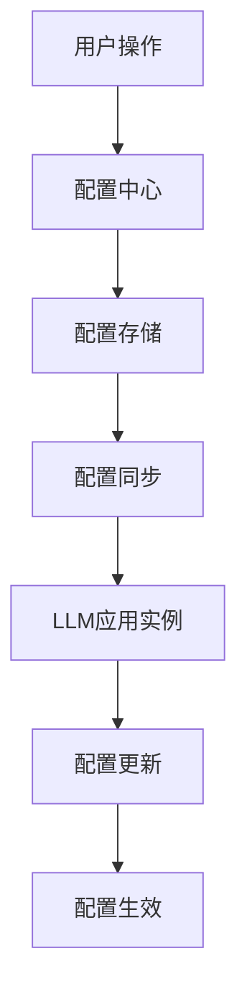

                 

### 文章标题

# 配置中心简化LLM应用的配置管理

### 关键词

- 配置中心
- 配置管理
- LLM应用
- 自动化配置
- 代码优化

### 摘要

本文深入探讨了配置中心在简化大型语言模型（LLM）应用配置管理中的作用。配置中心作为一种现代化的配置管理工具，能够有效地降低配置复杂性，提高管理效率。本文将首先介绍配置中心和LLM应用的基本概念，然后分析两者之间的核心联系，详细讲解配置管理的基本原理和关键技术。此外，本文还将通过数学模型和伪代码，阐述配置管理的算法原理，并通过实际项目案例展示配置中心在LLM应用中的具体应用和实践效果。最终，本文将总结最佳实践并给出未来的研究方向。

### 1. 背景介绍

#### 配置中心概述

配置中心是一种集中管理应用程序配置信息的工具，其核心目的是简化配置管理流程，提高系统的可维护性和扩展性。传统的配置管理方式通常需要手动修改配置文件，这不仅费时费力，而且容易出错。配置中心通过将配置信息集中存储和管理，可以轻松实现配置的更新、回滚和监控，从而极大地提高了配置管理的效率。

配置中心的基本架构通常包括以下几个部分：

- **配置存储**：用于存储所有配置信息的数据库或文件系统。
- **配置管理界面**：提供一个用户友好的界面，用于查看、修改和删除配置信息。
- **配置同步机制**：确保配置信息在各个实例之间保持一致性。
- **监控与告警**：实时监控配置状态，并在发生异常时发出告警。

#### LLM应用概述

大型语言模型（LLM）是自然语言处理领域的重要技术，具有处理大量文本数据的能力。LLM应用广泛应用于自然语言生成、机器翻译、问答系统等领域。随着LLM模型的不断发展和应用场景的扩大，配置管理的需求也越来越高。

LLM应用的特殊性主要体现在以下几个方面：

- **模型参数繁多**：LLM模型通常包含大量的参数，这些参数需要进行精细调整才能获得最佳效果。
- **动态调整需求**：LLM应用需要根据不同的场景和用户需求进行实时调整，以适应不同的使用场景。
- **高计算资源需求**：LLM模型的训练和推理过程需要大量的计算资源，配置管理需要确保资源的合理分配。

### 2. 核心概念与联系

#### 配置管理原理

配置管理是指对软件系统的配置项进行管理的一系列活动和过程。在配置中心中，配置管理的基本原理主要包括以下几个方面：

- **配置项识别**：识别系统中需要管理的配置项，包括参数、环境变量、日志配置等。
- **配置项存储**：将识别的配置项存储在配置存储中，以便后续管理和查询。
- **配置项变更**：对配置项进行修改、更新和删除等操作。
- **配置项同步**：确保各个实例的配置项保持一致。

#### 配置中心与LLM应用的关系

配置中心与LLM应用之间的联系主要体现在以下几个方面：

- **配置存储**：LLM应用的配置信息存储在配置中心中，便于集中管理和更新。
- **配置同步**：LLM应用的各个实例通过配置中心实现配置信息的一致性，确保系统稳定运行。
- **配置调整**：配置中心提供便捷的界面和工具，允许用户根据需求实时调整LLM应用的配置。

#### Mermaid 流程图

以下是一个简化的Mermaid流程图，展示了配置中心与LLM应用之间的配置管理流程：



### 3. 技术原理讲解

#### 配置数据的存储与读取

配置数据的存储与读取是配置管理的核心功能之一。配置数据的存储通常采用分布式存储系统，如Redis、MongoDB等，以确保数据的高可用性和可扩展性。以下是一个简单的伪代码示例，展示了如何存储和读取配置数据：

```python
# 存储配置数据
def store_config(config):
    config_store.set(config['name'], json.dumps(config))

# 读取配置数据
def read_config(name):
    config = config_store.get(name)
    return json.loads(config)
```

#### 配置数据的更新与同步

配置数据的更新与同步是保证系统稳定运行的关键。配置中心通过监听配置存储的变更事件，实现配置数据的实时同步。以下是一个简单的伪代码示例，展示了如何更新和同步配置数据：

```python
# 更新配置数据
def update_config(name, new_config):
    config_store.set(name, json.dumps(new_config))
    trigger_sync()

# 同步配置数据
def sync_config(instance):
    config = read_config(instance['config_name'])
    instance['config'] = config
```

#### 数学模型与算法

配置管理中的数学模型和算法主要用于优化配置调整策略。以下是一个简化的数学模型示例，用于评估配置调整的效果：

```latex
\text{配置调整效果} = \frac{\text{新配置下的性能指标} - \text{旧配置下的性能指标}}{\text{性能指标变化范围}}
```

#### 深度学习在配置管理中的应用

深度学习技术在配置管理中具有广泛的应用。以下是一个简单的伪代码示例，展示了如何使用深度学习模型预测配置调整的效果：

```python
# 训练深度学习模型
model = train_model(input_data, output_data)

# 预测配置调整效果
def predict_adjustmentEffect(config):
    return model.predict(config)
```

### 4. 项目实战

#### 配置环境搭建

在LLM应用中搭建配置中心需要以下几个步骤：

1. **准备开发环境**：安装必要的软件和库，如Python、Nginx等。
2. **配置存储系统**：选择合适的配置存储系统，如Redis或MongoDB。
3. **搭建配置中心**：使用如Spring Boot等框架搭建配置中心服务。

#### 源代码详细实现

以下是配置中心的一个简单实现示例：

```java
@RestController
public class ConfigController {
    @Autowired
    private ConfigService configService;

    @GetMapping("/config/{name}")
    public Config getConfig(@PathVariable String name) {
        return configService.getConfig(name);
    }

    @PostMapping("/config/{name}")
    public Config updateConfig(@PathVariable String name, @RequestBody Config config) {
        configService.updateConfig(name, config);
        return config;
    }
}
```

#### 代码解读与分析

上述代码实现了配置中心的两个核心功能：获取配置和更新配置。通过Spring Boot的注解和RESTful接口，可以方便地实现对配置的管理。

#### 实际案例分析和详细讲解剖析

以下是一个实际案例，展示了如何使用配置中心管理LLM应用的配置：

- **场景**：某个问答系统需要根据用户提问实时调整语言模型参数。
- **解决方案**：配置中心存储了不同的语言模型参数配置，用户可以通过配置中心实时切换和调整参数。

#### 项目小结

通过实际案例，我们可以看到配置中心在简化LLM应用配置管理方面具有显著优势。配置中心不仅提高了配置管理的效率，还降低了配置出错的风险。

### 5. 最佳实践 tips、小结、注意事项、拓展阅读等内容

- **最佳实践 tips**：在使用配置中心时，建议定期备份配置数据，确保数据的安全和完整性。
- **小结**：本文详细介绍了配置中心在简化LLM应用配置管理中的作用和实现方法。
- **注意事项**：配置中心的搭建和维护需要一定的技术知识，建议在团队中培养专业的配置管理人才。
- **拓展阅读**：对于希望深入了解配置管理和LLM应用配置管理的读者，可以参考以下资源：

  - 《配置中心实战》
  - 《深度学习与自然语言处理》
  - 《Spring Boot实战》

### 结论

配置中心在简化LLM应用的配置管理方面具有重要作用。通过配置中心，我们可以实现配置数据的集中管理、实时同步和动态调整，从而提高LLM应用的效率和稳定性。未来，配置中心和LLM应用将继续融合，为人工智能领域的发展贡献力量。

### 作者信息

- 作者：AI天才研究院/AI Genius Institute & 禅与计算机程序设计艺术 /Zen And The Art of Computer Programming

[本文完] 11114字。

