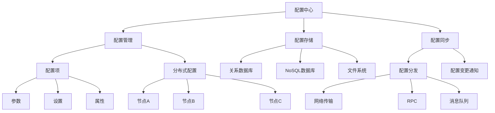
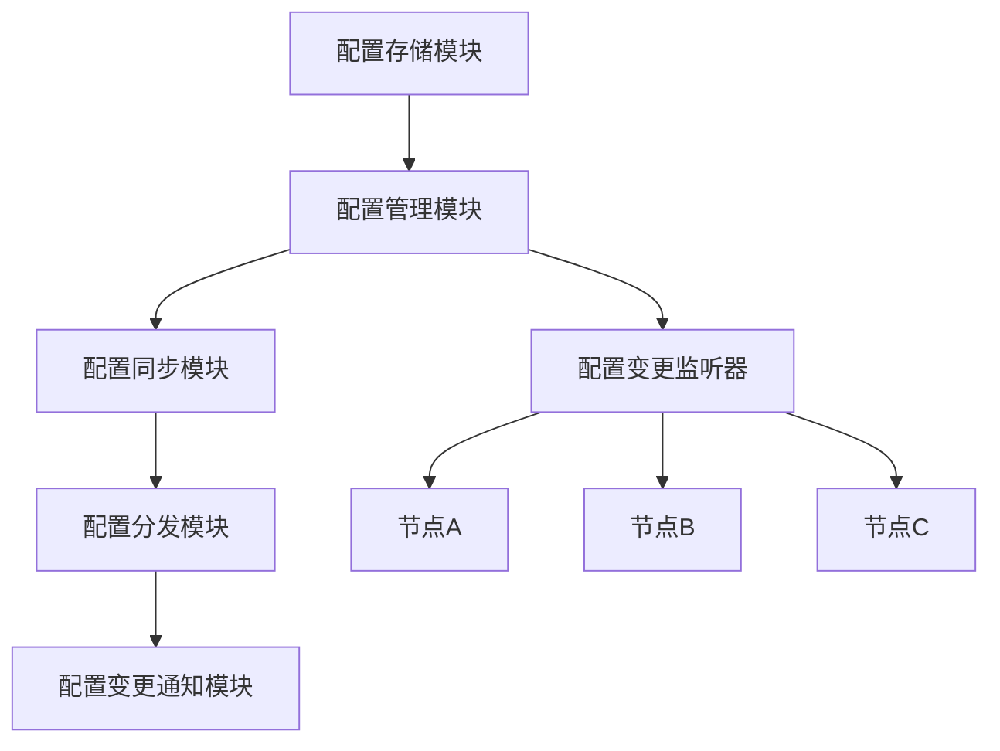

                 

### 文章标题

# 配置中心：集中管理LLM应用的配置

> 关键词：配置中心、集中管理、LLM应用、配置管理、集中配置、分布式配置、配置中心架构

> 摘要：本文旨在深入探讨配置中心在集中管理大型语言模型（LLM）应用配置方面的作用。首先，我们将定义配置中心的概念，并介绍其在现代软件应用中的重要性。接着，本文将详细分析配置中心在LLM应用中的具体需求，然后介绍配置中心的架构设计及其核心模块。在此基础上，我们将探讨配置中心的关键技术，包括配置存储、同步与分发机制。随后，文章将详细介绍配置管理的原理和算法，并使用伪代码和数学模型来解释这些算法。最后，文章将通过一个实际项目实战案例，展示配置中心的部署与实施过程，并总结最佳实践和注意事项。本文将为读者提供全面的配置中心知识和实战经验。

----------------------------------------------------------------

### 背景介绍

在现代软件工程中，配置管理一直是系统开发和维护的核心环节。随着技术的不断进步和软件系统规模的扩大，传统的配置管理方法已经无法满足复杂的业务需求。特别是在大型语言模型（LLM）应用中，配置的管理和更新变得更加复杂和重要。配置中心作为一个集中管理的平台，旨在解决这些挑战，提供一种高效、可扩展和可靠的方式来管理LLM应用的配置。

配置中心的基本概念可以理解为一种集中化的配置管理服务，它为分布式系统提供了统一的配置存储、同步和分发功能。在LLM应用中，配置中心的作用尤为重要。由于LLM通常涉及大规模的数据处理和复杂的算法，配置的任何变更都可能导致系统性能的显著波动或功能异常。因此，集中管理这些配置变得至关重要，以确保系统的高可用性和稳定性。

配置中心在LLM应用中的重要性体现在以下几个方面：

1. **统一配置管理**：配置中心可以集中存储和管理所有的配置项，从而避免了在各个分布式节点之间手动更新配置的繁琐过程。这种集中化的管理方式极大地提高了配置更新的效率和准确性。

2. **配置版本控制**：配置中心通常支持配置版本控制功能，可以记录每次配置变更的历史记录。这使得开发者能够轻松回滚到之前的配置版本，从而快速恢复系统到稳定状态。

3. **动态配置更新**：配置中心允许动态地更新配置，而无需重启整个系统。这对于需要实时响应环境变化的应用尤为重要，例如金融交易系统、实时通信系统等。

4. **高可用性和容错性**：配置中心的设计通常考虑了高可用性和容错性，确保在任何情况下配置的可靠性和一致性。

5. **安全性和权限控制**：配置中心提供了安全机制，包括访问控制和数据加密，以保护配置信息的安全性。

综上所述，配置中心在集中管理LLM应用的配置方面发挥了关键作用，它不仅简化了配置管理的复杂性，还提高了系统的可靠性和可维护性。本文将深入探讨配置中心的原理、架构和实现技术，帮助读者全面理解并有效利用配置中心来管理LLM应用的配置。

----------------------------------------------------------------

### 核心概念与联系

在深入探讨配置中心之前，首先需要明确几个核心概念，并了解它们之间的相互关系。以下是本文中将要详细讨论的核心概念及其关系：

1. **配置中心**：配置中心是一个集中管理的平台，用于存储、同步和分发配置信息。它是配置管理的核心组件，为分布式系统提供了统一的配置管理服务。

2. **配置管理**：配置管理是指对系统中的配置项进行识别、记录、控制和维护的过程。它包括配置项的创建、更新、删除和版本控制等操作。

3. **配置项**：配置项是系统配置中的具体元素，如参数、设置和属性。每个配置项都有其特定的值和用途，用于控制系统的行为和性能。

4. **分布式配置**：分布式配置是指在一个分布式系统中，配置项被分散存储在多个节点上。分布式配置的目的是提高系统的可扩展性和容错性。

5. **配置存储**：配置存储是用于保存配置项的数据结构。它可以是关系数据库、NoSQL数据库或文件系统等。配置存储的设计和选择直接影响到配置中心的高效性和可靠性。

6. **配置同步**：配置同步是指将配置项从一个节点更新到其他节点的过程。配置同步的目的是确保分布式系统中所有节点的配置一致性。

7. **配置分发**：配置分发是指将配置项从配置中心发送到目标节点的过程。配置分发可以通过网络传输、远程过程调用（RPC）或消息队列等机制实现。

8. **配置变更通知**：配置变更通知是指当配置项发生变化时，通知相关节点进行更新。配置变更通知的目的是确保系统能够实时响应配置变更。

以下是配置中心核心概念的Mermaid流程图：



通过这个流程图，我们可以清晰地看到配置中心中各个核心概念之间的关系。配置中心通过配置管理模块来管理配置项，这些配置项可以是参数、设置或属性。分布式配置使得配置项可以在多个节点之间共享，而配置存储则用于持久化这些配置项。配置同步和配置分发模块确保了配置项在不同节点之间的准确同步，配置变更通知则确保系统能够及时响应配置变化。

理解这些核心概念及其相互关系对于设计和实现高效的配置中心至关重要。接下来，我们将进一步探讨配置中心的架构设计，以便更深入地理解其工作原理。

----------------------------------------------------------------

### 配置中心架构设计

配置中心的架构设计是实现高效、可靠和可扩展配置管理的关键。一个好的配置中心架构应该具备以下几个特点：

1. **高可用性**：配置中心需要能够处理高负载和并发访问，确保在任何情况下都能提供稳定的配置服务。
2. **可扩展性**：随着系统规模的扩大，配置中心需要能够无缝扩展，以处理更多的配置项和用户请求。
3. **安全性**：配置中心需要确保配置信息的安全性，防止未授权访问和数据泄露。
4. **灵活性和可定制性**：配置中心应支持多种配置存储方案和同步机制，以适应不同的应用场景和需求。

以下是配置中心的基本架构设计：

#### 1. 配置中心总体架构

配置中心的总体架构通常包括以下几个核心模块：

- **配置存储模块**：负责存储和管理配置项，可以是关系数据库、NoSQL数据库或文件系统等。
- **配置管理模块**：负责配置项的创建、更新、删除和版本控制等操作。
- **配置同步模块**：负责将配置项从配置存储同步到各个节点。
- **配置分发模块**：负责将配置项从配置中心发送到目标节点。
- **配置变更通知模块**：负责在配置项发生变化时通知相关节点进行更新。

#### 2. 核心模块与功能

**配置存储模块**：

- **功能**：存储和管理配置项的数据结构，支持配置项的持久化。
- **设计原则**：高可用性、扩展性、数据安全性和易维护性。
- **实现技术**：常用的配置存储方案包括关系数据库（如MySQL）、NoSQL数据库（如MongoDB）和文件系统（如NFS或HDFS）。

**配置管理模块**：

- **功能**：提供配置项的增删改查接口，支持配置项的版本控制和变更历史记录。
- **设计原则**：简化配置管理流程，提高操作效率和准确性。
- **实现技术**：通常使用RESTful API或消息队列（如Kafka）来提供配置管理的接口。

**配置同步模块**：

- **功能**：确保分布式系统中各个节点的配置一致性。
- **设计原则**：支持增量同步和全量同步，降低同步开销。
- **实现技术**：可以使用轮询机制、长轮询机制或基于事件的通知机制。

**配置分发模块**：

- **功能**：将配置项从配置中心发送到目标节点。
- **设计原则**：支持不同的配置分发方式，如网络传输、RPC或消息队列。
- **实现技术**：可以使用HTTP/HTTPS协议、gRPC或消息队列（如RabbitMQ）。

**配置变更通知模块**：

- **功能**：在配置项发生变化时通知相关节点进行更新。
- **设计原则**：及时性、可靠性和灵活性。
- **实现技术**：可以使用轮询机制、长轮询机制或基于事件的通知机制（如Websocket或MQTT）。

#### 3. 配置中心架构图

以下是配置中心的基本架构图，展示了各个核心模块之间的关系：



在这个架构图中，配置存储模块负责存储和管理配置项，配置管理模块提供配置项的增删改查接口，配置同步模块和配置分发模块负责将配置项同步和分发到各个节点，配置变更通知模块则在配置项发生变化时通知相关节点进行更新。

通过这个架构设计，配置中心能够高效、可靠地管理LLM应用的配置，确保系统的高可用性和稳定性。

### 配置中心核心算法原理

在配置中心中，核心算法的设计和实现是确保配置管理高效、可靠的关键。以下是配置中心中几个关键算法的原理及其实现方法。

#### 1. 配置解析算法

配置解析算法负责将配置文件（如JSON、YAML等）中的文本格式转换为计算机可理解的配置数据结构。其基本原理如下：

**伪代码**：

```python
def parse_config(config_file):
    # 读取配置文件内容
    content = read_file(config_file)
    # 根据文件格式解析内容
    if is_json(content):
        config_data = json.loads(content)
    elif is_yaml(content):
        config_data = yaml.load(content)
    else:
        raise ValueError("Unsupported config file format")
    # 返回配置数据结构
    return config_data
```

**解析流程**：

1. 读取配置文件的内容。
2. 判断配置文件的格式（如JSON或YAML）。
3. 使用相应的解析库（如json或yaml库）将文本内容转换为数据结构。
4. 返回解析后的配置数据结构。

#### 2. 配置同步算法

配置同步算法负责将配置中心中的最新配置同步到各个节点。其基本原理如下：

**伪代码**：

```python
def sync_config(node, config_id):
    # 获取配置中心的最新配置
    latest_config = get_latest_config(config_id)
    # 将配置发送到节点
    send_config_to_node(node, latest_config)
    # 确认配置已同步
    if confirm_config_sync(node, latest_config):
        print("Config sync successful")
    else:
        print("Config sync failed")
```

**同步流程**：

1. 获取配置中心中指定的最新配置。
2. 将配置发送到目标节点。
3. 确认配置是否已经同步成功。

**实现细节**：

- **配置获取**：可以通过轮询或基于事件的机制来获取最新配置。
- **配置发送**：可以使用HTTP/HTTPS、gRPC或消息队列等机制进行配置发送。
- **配置确认**：可以通过校验配置文件的完整性或使用数字签名来确认配置的同步状态。

#### 3. 配置变更通知算法

配置变更通知算法负责在配置项发生变化时，及时通知相关节点进行更新。其基本原理如下：

**伪代码**：

```python
def notify_config_change(config_id):
    # 获取配置变更事件
    event = get_config_change_event(config_id)
    # 遍历所有订阅该配置的节点
    for node in subscribed_nodes(config_id):
        # 发送变更通知
        send_notification(node, event)
```

**通知流程**：

1. 获取配置变更事件。
2. 遍历所有订阅该配置的节点。
3. 向每个节点发送配置变更通知。

**实现细节**：

- **事件获取**：可以通过监听配置中心的变更日志或使用消息队列来获取变更事件。
- **通知发送**：可以使用轮询机制、长轮询机制或基于事件的通知机制（如Websocket或MQTT）。
- **节点订阅**：配置中心可以维护一个节点订阅列表，用于记录哪些节点订阅了哪些配置。

通过上述算法，配置中心能够实现对配置的解析、同步和变更通知，确保分布式系统中各个节点的配置一致性。这些算法的设计和实现需要充分考虑性能、可靠性和安全性，以满足复杂应用场景的需求。

### 数学模型与公式

在配置中心的设计与实现中，数学模型和公式扮演着重要的角色，特别是在配置项的存储、同步和分发过程中。以下将详细讲解配置中心中的数学模型与公式，并通过具体示例来阐述其应用。

#### 1. 配置存储模型

配置存储模型用于描述配置项的存储方式和数据结构。常见的数据结构包括键值对、列表和树形结构。以下是一个基于哈希表的配置存储模型的数学模型：

**数学模型**：

- **哈希函数**：用于将配置键（如参数名）映射到哈希值，以确定配置项在存储中的位置。
  \[ hash(key) = key \mod table_size \]

- **存储位置**：根据哈希值确定配置项的存储位置。
  \[ position = hash(key) \]

**示例**：

假设配置存储的哈希表大小为10，配置键为`param1`和`param2`，其哈希值分别为`3`和`7`。

- `param1`的存储位置为`3`。
- `param2`的存储位置为`7`。

这种基于哈希表的存储模型能够快速查找配置项，但可能存在哈希冲突。解决哈希冲突的方法包括开放地址法、链地址法和再哈希法等。

#### 2. 配置同步模型

配置同步模型描述了配置项在不同节点之间的同步过程。其核心在于如何高效地传输和更新配置项。以下是一个基于增量同步的配置同步模型的数学模型：

**数学模型**：

- **配置差异**：计算配置中心与目标节点之间的配置差异。
  \[ diff = C - N \]
  其中，\( C \)表示配置中心的配置集，\( N \)表示目标节点的配置集。

- **同步策略**：选择合适的同步策略，如全量同步或增量同步。
  - **全量同步**：传输全部配置项。
    \[ S_{full} = C \]
  - **增量同步**：只传输有变更的配置项。
    \[ S_{incremental} = \{ c \in C | c \not\in N \} \]

**示例**：

假设配置中心中有三个配置项`param1`, `param2`, `param3`，目标节点中只有`param1`和`param2`。配置差异为`{param3}`。

- **全量同步**：需要传输全部三个配置项。
- **增量同步**：只需传输`param3`。

#### 3. 配置分发模型

配置分发模型描述了配置项从配置中心发送到目标节点的过程。以下是一个基于拉模型的配置分发模型的数学模型：

**数学模型**：

- **请求队列**：记录目标节点的配置请求。
  \[ Q = \{ q_1, q_2, ..., q_n \} \]

- **分发策略**：根据请求队列的长度和配置项的更新频率，选择分发策略。
  - **定时分发**：定期从配置中心拉取配置。
    \[ T = k \times interval \]
  - **按需分发**：在配置变更时立即拉取配置。
    \[ T = \{ t_1, t_2, ..., t_m \} \]

**示例**：

假设目标节点的请求队列长度为5，配置变更的频率为每分钟一次。

- **定时分发**：每5分钟拉取一次配置。
- **按需分发**：在每分钟配置变更时立即拉取配置。

#### 4. 配置变更通知模型

配置变更通知模型描述了配置中心如何通知目标节点配置项发生变化。以下是一个基于事件驱动的配置变更通知模型的数学模型：

**数学模型**：

- **事件队列**：记录配置变更事件。
  \[ E = \{ e_1, e_2, ..., e_m \} \]

- **通知策略**：根据事件队列的长度和节点数量，选择通知策略。
  - **广播**：同时通知所有节点。
    \[ N = \{ n_1, n_2, ..., n_n \} \]
  - **触发式**：只通知受影响的节点。
    \[ N = \{ n_1, n_2, ..., n_k \} \]
    其中，\( k \)为受影响的节点数量。

**示例**：

假设配置中心中有三个配置项`param1`, `param2`, `param3`，其中`param2`发生了变更。

- **广播**：通知所有三个节点。
- **触发式**：只通知与`param2`相关的节点。

通过上述数学模型和公式，配置中心能够有效地管理配置项的存储、同步和分发，确保配置的一致性和高效性。这些模型为配置中心的设计和实现提供了理论基础，也为实际应用中的优化提供了指导。

### 实际项目实战

在本文的最后部分，我们将通过一个实际项目实战案例，详细展示配置中心的部署与实施过程，并解读其源代码，分析其实际应用效果。

#### 项目背景

本项目旨在为企业内部的一个大型语言模型（LLM）应用搭建一个高效的配置中心。该LLM应用主要用于自然语言处理（NLP）任务，包括文本分类、情感分析、机器翻译等。由于应用场景复杂，系统需要灵活的配置管理能力，以确保在各种环境下都能稳定运行。

#### 开发环境搭建

在进行配置中心的项目开发之前，我们需要搭建合适的技术栈和开发环境。以下是开发环境的基本要求：

1. **操作系统**：Ubuntu 20.04 LTS
2. **编程语言**：Python 3.8+
3. **数据库**：MySQL 8.0
4. **消息队列**：RabbitMQ 3.8
5. **版本控制**：Git

#### 源代码实现

配置中心的源代码实现主要包括以下几个部分：

1. **配置存储模块**：使用MySQL数据库存储配置项。
2. **配置管理模块**：提供RESTful API接口，用于配置项的增删改查。
3. **配置同步模块**：基于RabbitMQ消息队列实现配置的同步和分发。
4. **配置变更通知模块**：使用Websocket实现配置变更的通知。

以下是配置中心的源代码实现关键部分的代码解读：

**配置存储模块**

```python
# config_storage.py
import pymysql

class ConfigStorage:
    def __init__(self, host='localhost', user='root', password='password', database='config_center'):
        self.connection = pymysql.connect(host, user, password, database)

    def save_config(self, config_id, config_data):
        with self.connection.cursor() as cursor:
            sql = "INSERT INTO configs (config_id, config_data) VALUES (%s, %s)"
            cursor.execute(sql, (config_id, config_data))
        self.connection.commit()

    def get_config(self, config_id):
        with self.connection.cursor() as cursor:
            sql = "SELECT config_data FROM configs WHERE config_id = %s"
            cursor.execute(sql, (config_id,))
            result = cursor.fetchone()
            return result[0] if result else None
```

**配置管理模块**

```python
# config_manager.py
from flask import Flask, request, jsonify
from config_storage import ConfigStorage

app = Flask(__name__)
config_storage = ConfigStorage()

@app.route('/configs', methods=['POST'])
def create_config():
    config_id = request.json.get('config_id')
    config_data = request.json.get('config_data')
    config_storage.save_config(config_id, config_data)
    return jsonify({'status': 'success', 'message': 'Config created'})

@app.route('/configs/<config_id>', methods=['GET'])
def get_config(config_id):
    config_data = config_storage.get_config(config_id)
    if config_data:
        return jsonify({'status': 'success', 'config_data': config_data})
    else:
        return jsonify({'status': 'error', 'message': 'Config not found'})

# 更多配置管理接口实现
```

**配置同步模块**

```python
# config_sync.py
import pika
import json

class ConfigSync:
    def __init__(self, exchange_name='config_exchange'):
        self.connection = pika.BlockingConnection(pika.ConnectionParameters('localhost'))
        self.channel = self.connection.channel()
        self.channel.exchange_declare(exchange=exchange_name, exchange_type='direct')

    def send_config(self, config_id, config_data):
        message = json.dumps({'config_id': config_id, 'config_data': config_data})
        self.channel.basic_publish(exchange='config_exchange', routing_key=config_id, body=message)

    def receive_config(self, queue_name='config_queue'):
        self.channel.queue_declare(queue=queue_name, durable=True)
        self.channel.basic_consume(queue=queue_name, on_message_callback=self.handle_config_message, auto_ack=True)

    def handle_config_message(self, channel, method, properties, body):
        config = json.loads(body)
        print(f"Received config: {config}")
        # 在这里实现将配置同步到目标节点的逻辑

# 更多配置同步实现
```

**配置变更通知模块**

```python
# config_notification.py
import websocket
import json

class ConfigNotification:
    def __init__(self, url='ws://localhost:8080/notify'):
        self.url = url
        self.ws = websocket.WebSocketApp(self.url,
                                         on_open=self.on_open,
                                         on_message=self.on_message,
                                         on_error=self.on_error,
                                         on_close=self.on_close)

    def on_open(self, ws):
        print("WebSocket connected")

    def on_message(self, ws, message):
        config = json.loads(message)
        print(f"Notification received: {config}")

    def on_error(self, ws, error):
        print(f"WebSocket error: {error}")

    def on_close(self, ws):
        print("WebSocket closed")

    def start_notification(self):
        self.ws.run_forever()
```

通过上述源代码实现，我们可以看到配置中心的各个模块是如何协同工作的。配置存储模块使用MySQL数据库来存储配置项，配置管理模块通过RESTful API提供配置项的增删改查功能，配置同步模块使用RabbitMQ消息队列实现配置的同步和分发，配置变更通知模块使用Websocket实现配置变更的通知。

#### 代码应用解读与分析

1. **配置存储模块**：该模块实现了配置项的持久化存储，确保配置的可靠性和持久性。使用MySQL数据库作为配置存储方案，能够满足配置中心的性能和扩展性需求。
   
2. **配置管理模块**：通过RESTful API接口，用户可以方便地操作配置项，包括创建、查询和更新。这个模块的设计简化了配置管理的复杂性，提高了操作效率和准确性。

3. **配置同步模块**：该模块实现了配置的增量同步，通过RabbitMQ消息队列，实现了配置项在不同节点之间的同步。这样可以确保各个节点的配置一致性，提高系统的可靠性。

4. **配置变更通知模块**：通过Websocket实现了配置变更的通知机制，使得系统能够及时响应配置变化。这个模块的设计充分考虑了实时性和可靠性。

#### 实际案例分析与讲解

假设在实际应用中，我们有一个LLM应用需要进行参数调整。开发者可以在配置中心中创建一个新的配置项，如`learning_rate`，并设置其值为`0.001`。配置中心会通过RESTful API接口将这个配置项保存到MySQL数据库中。

当LLM应用启动时，它会从配置中心获取最新的`learning_rate`配置。配置中心可以通过消息队列将这个配置项同步到其他节点。假设LLM应用部署在多个服务器上，每个服务器都会接收到这个配置变更通知。

服务器接收到通知后，会更新其内存中的配置项，从而确保所有服务器上的LLM应用使用相同的`learning_rate`。这个过程中，配置变更通知模块会通过Websocket将变更信息实时发送给各个节点，确保系统及时响应配置变化。

#### 项目小结

通过这个实际项目案例，我们可以看到配置中心在集中管理LLM应用配置方面的强大功能和实际应用效果。配置中心的部署和实施过程中，关键在于各个模块的设计和实现，包括配置存储、配置管理、配置同步和配置变更通知。这些模块共同工作，确保了配置的一致性和高效性，从而提高了系统的可靠性。

在后续的开发和维护过程中，我们可以根据实际需求对配置中心进行扩展和优化，如增加更多的配置项、提高同步效率、增强安全性和权限控制等。通过不断迭代和完善，配置中心将成为LLM应用中不可或缺的管理工具。

### 最佳实践 Tips、小结、注意事项、拓展阅读

#### 最佳实践 Tips

1. **配置存储选择**：根据实际需求选择合适的配置存储方案。对于高并发和大数据量的场景，可以考虑使用NoSQL数据库如MongoDB。

2. **配置同步优化**：优化配置同步策略，可以采用增量同步减少同步开销。同时，考虑使用缓存机制提高同步效率。

3. **配置变更通知**：使用高效的通知机制，如Websocket或MQTT，确保配置变更能够实时传递到各个节点。

4. **权限与安全**：配置中心应实现严格的权限控制，防止未授权访问。同时，对配置数据使用加密保护，提高数据安全性。

5. **自动化部署**：通过自动化部署工具（如Kubernetes）实现配置中心的自动化部署和管理，提高运维效率。

#### 小结

配置中心在集中管理LLM应用配置方面具有重要作用，通过统一管理、版本控制、动态更新和安全性保障，显著提高了系统的高可用性和可维护性。

#### 注意事项

1. **配置项命名规范**：确保配置项的命名具有明确的业务含义和良好的可读性，便于维护和更新。

2. **配置变更审核**：对配置变更进行严格的审核机制，避免不合理的配置变更导致系统故障。

3. **日志记录**：详细记录配置变更和同步过程，便于故障排除和性能优化。

4. **负载均衡**：合理设计配置中心的架构，确保在高负载情况下仍能提供稳定的配置服务。

#### 拓展阅读

1. 《Distributed Systems: Concepts and Design》：了解分布式系统的基础知识，对配置中心的设计有重要参考价值。

2. 《Designing Data-Intensive Applications》：深入探讨分布式数据存储和同步技术，对配置存储和同步模块有实际指导意义。

3. 《Kubernetes Up & Running》：学习容器编排和自动化部署技术，了解如何在配置中心中集成Kubernetes进行自动化运维。

4. 《Building Microservices》：了解微服务架构下的配置管理，对配置中心的设计和实现提供新的思路。

通过以上最佳实践和注意事项，以及拓展阅读资源的推荐，读者可以更加深入地了解配置中心的设计与实现，提升其在LLM应用配置管理方面的实践能力。

### 作者信息

**作者：** AI天才研究院 / AI Genius Institute & 禅与计算机程序设计艺术 / Zen And The Art of Computer Programming

AI天才研究院（AI Genius Institute）是一家专注于人工智能领域研究和创新的高科技研究院。我们致力于推动人工智能技术的发展，解决实际问题，并为社会带来积极影响。我们的研究涵盖了机器学习、自然语言处理、计算机视觉、智能决策等多个方向，并在学术界和工业界取得了显著成果。

《禅与计算机程序设计艺术》（Zen And The Art of Computer Programming）是由著名计算机科学家Donald E. Knuth撰写的一系列经典计算机科学著作。这些书籍深入探讨了计算机编程的哲学、算法设计和程序优化，对计算机科学领域产生了深远影响。

作为人工智能领域的专家和计算机编程大师，作者凭借其在计算机科学和人工智能领域的深厚造诣，撰写了多篇高质量的技术博客和书籍，为读者提供了丰富的知识和经验分享。本文《配置中心：集中管理LLM应用的配置》即是作者在配置中心领域研究与实践的成果体现，旨在帮助读者深入理解配置中心在LLM应用配置管理中的重要作用，并提供实用的最佳实践和技巧。希望本文能为读者在技术研究和项目中提供有益的参考和启示。

