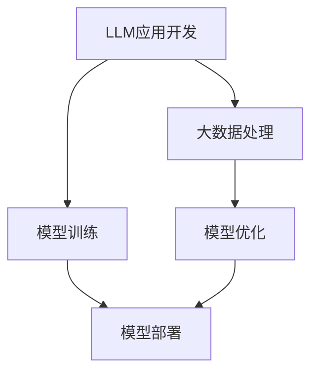

                 

### 文章标题：重塑LLM应用开发的需求管理流程

#### 关键词：LLM应用开发、需求管理、需求识别、需求分析、需求定义、需求验证

#### 摘要：
本文将深入探讨如何在LLM（大型语言模型）应用开发过程中，重构需求管理流程。我们将从需求管理的理论基础出发，详细分析需求管理的核心原则和实践方法，以及需求变更管理和工具技术的应用。文章将通过具体的算法原理、伪代码、数学模型和实际案例，帮助读者理解并掌握LLM应用开发中需求管理的精髓。

## 第一部分：需求管理的理论基础

### 第1章：了解LLM应用开发

#### 1.1 LLM应用开发的现状与挑战

随着人工智能技术的飞速发展，LLM（Large Language Model）已经成为自然语言处理领域的重要工具。LLM在文本生成、机器翻译、问答系统等多个领域展现出强大的应用潜力。然而，LLM应用开发的复杂性也带来了诸多挑战。

#### Mermaid流程图：

在LLM应用开发过程中，数据处理、模型训练、模型优化和模型部署是关键步骤。这些步骤相互依赖，任何一个环节出现问题都可能导致整个项目的失败。因此，有效的需求管理至关重要。

#### 1.2 需求管理的重要性

需求管理是软件项目管理的重要组成部分。在LLM应用开发中，需求管理的重要性体现在以下几个方面：

1. **确保项目目标明确**：通过需求管理，可以确保项目团队对项目目标和需求有清晰的理解，从而避免项目偏离方向。
2. **提高项目成功率**：有效的需求管理可以降低项目风险，提高项目成功率。
3. **优化资源分配**：需求管理有助于优化项目资源分配，确保项目在预算和时间范围内完成。

#### 1.3 需求管理的基本概念

需求管理涉及多个核心概念，包括需求识别、需求分析、需求定义、需求验证等。

1. **需求识别**：需求识别是需求管理的第一步，旨在明确用户需求。
2. **需求分析**：需求分析是对识别出的需求进行深入研究和分析，确定需求的可行性和优先级。
3. **需求定义**：需求定义是对需求进行明确和具体化的过程，确保需求可以被准确理解和实现。
4. **需求验证**：需求验证是确保需求满足用户需求的过程，通常通过用户反馈和测试进行。

### 第2章：需求管理的核心原则

#### 2.1 需求识别

需求识别是需求管理的起点。在进行需求识别时，可以采用以下方法：

1. **用户访谈**：通过与用户的直接交流，了解用户的需求和期望。
2. **问卷调查**：通过问卷调查收集大量用户意见，了解用户需求。

#### 2.2 需求分析

需求分析是对识别出的需求进行深入研究和分析的过程。在进行需求分析时，可以采用以下方法：

1. **用户故事编写**：用户故事是一种描述用户需求的方法，它通常以“作为用户，我想做到什么”的形式表达。
2. **场景分析**：通过分析用户在不同场景下的需求，确定需求的优先级。

#### 2.3 需求定义

需求定义是对需求进行明确和具体化的过程。在进行需求定义时，可以采用以下方法：

1. **需求文档**：需求文档是对需求进行详细描述的文档，它通常包括需求概述、需求描述、需求分析等内容。
2. **需求模型**：需求模型是需求定义的一种可视化表示，它可以帮助项目团队更好地理解需求。

#### 2.4 需求验证

需求验证是确保需求满足用户需求的过程。在进行需求验证时，可以采用以下方法：

1. **用户反馈**：通过用户反馈收集用户对需求实现情况的评价。
2. **测试**：通过测试验证需求的实现是否符合预期。

### 第3章：需求管理流程

#### 3.1 需求管理流程概述

需求管理流程包括需求收集、需求分析、需求定义与文档化、需求验证等步骤。

#### 3.2 需求收集

需求收集是需求管理的第一步，旨在明确用户需求。在进行需求收集时，可以采用以下方法：

1. **用户访谈**：通过与用户的直接交流，了解用户的需求和期望。
2. **问卷调查**：通过问卷调查收集大量用户意见，了解用户需求。

#### 3.3 需求分析

需求分析是对识别出的需求进行深入研究和分析的过程。在进行需求分析时，可以采用以下方法：

1. **用户故事编写**：用户故事是一种描述用户需求的方法，它通常以“作为用户，我想做到什么”的形式表达。
2. **场景分析**：通过分析用户在不同场景下的需求，确定需求的优先级。

#### 3.4 需求定义与文档化

需求定义与文档化是对需求进行明确和具体化的过程。在进行需求定义与文档化时，可以采用以下方法：

1. **需求文档**：需求文档是对需求进行详细描述的文档，它通常包括需求概述、需求描述、需求分析等内容。
2. **需求模型**：需求模型是需求定义的一种可视化表示，它可以帮助项目团队更好地理解需求。

#### 3.5 需求验证

需求验证是确保需求满足用户需求的过程。在进行需求验证时，可以采用以下方法：

1. **用户反馈**：通过用户反馈收集用户对需求实现情况的评价。
2. **测试**：通过测试验证需求的实现是否符合预期。

## 第二部分：需求管理的实践方法

### 第4章：用户需求分析

#### 4.1 用户研究方法

用户研究是了解用户需求的关键步骤。在进行用户研究时，可以采用以下方法：

1. **用户访谈**：通过与用户的直接交流，了解用户的需求和期望。
2. **用户调查**：通过问卷调查收集大量用户意见，了解用户需求。

#### 4.2 用户访谈

用户访谈是一种深入了解用户需求的方法。在进行用户访谈时，可以采用以下步骤：

1. **准备访谈问题**：在访谈前，准备一系列有针对性的问题，以了解用户的需求和期望。
2. **进行访谈**：与用户进行面对面的交流，记录用户的反馈和意见。
3. **分析访谈结果**：对访谈结果进行分析，确定用户需求。

#### 4.3 用户调查

用户调查是一种收集大量用户意见的方法。在进行用户调查时，可以采用以下步骤：

1. **设计问卷**：设计一份包含关键问题的问卷，以了解用户的需求和期望。
2. **分发问卷**：将问卷分发给目标用户，收集用户反馈。
3. **分析调查结果**：对调查结果进行分析，确定用户需求。

#### 4.4 用户故事编写

用户故事是一种描述用户需求的方法。用户故事通常以“作为用户，我想做到什么”的形式表达。编写用户故事时，可以采用以下步骤：

1. **确定用户角色**：确定用户角色，明确用户故事的主体。
2. **描述用户需求**：以用户角色为中心，描述用户希望实现的需求。
3. **确定用户故事的价值**：评估用户故事的价值，确定其优先级。

### 第5章：需求优先级排序

#### 5.1 优先级排序方法

在需求管理过程中，对需求进行优先级排序至关重要。以下是一些常用的优先级排序方法：

1. **商业价值评估**：根据需求的商业价值进行排序，优先处理高商业价值的需求。
2. **技术可行性评估**：根据需求的技术可行性进行排序，优先处理可行性较高的需求。
3. **风险评估**：根据需求的风险程度进行排序，优先处理风险较低的需求。

#### 5.2 商业价值评估

商业价值评估是确定需求优先级的重要方法。在进行商业价值评估时，可以采用以下步骤：

1. **确定关键指标**：根据项目目标和业务需求，确定关键指标。
2. **评估需求价值**：对每个需求进行价值评估，确定其商业价值。
3. **排序需求**：根据评估结果，对需求进行优先级排序。

#### 5.3 技术可行性评估

技术可行性评估是确定需求优先级的另一个重要方法。在进行技术可行性评估时，可以采用以下步骤：

1. **分析技术环境**：了解项目所需的技术环境和现有技术资源。
2. **评估需求可行性**：对每个需求进行技术可行性评估。
3. **排序需求**：根据评估结果，对需求进行优先级排序。

#### 5.4 风险评估

风险评估是确定需求优先级的另一个关键方法。在进行风险评估时，可以采用以下步骤：

1. **识别风险因素**：识别可能导致需求实现失败的风险因素。
2. **评估风险影响**：对每个风险因素进行影响评估。
3. **排序需求**：根据评估结果，对需求进行优先级排序。

### 第6章：需求变更管理

#### 6.1 变更请求处理流程

在需求管理过程中，需求变更管理至关重要。以下是一个典型的变更请求处理流程：

1. **变更请求提交**：用户或项目团队提出变更请求。
2. **变更影响分析**：评估变更对项目的影响。
3. **变更请求评审**：对变更请求进行评审，决定是否接受变更。
4. **变更实施与监控**：实施变更，并对变更效果进行监控。

#### 6.2 变更影响分析

变更影响分析是变更请求处理的关键步骤。在进行变更影响分析时，可以采用以下方法：

1. **评估变更对需求的影响**：分析变更对现有需求的影响，确定变更是否可行。
2. **评估变更对项目进度的影响**：分析变更对项目进度的影响，确定变更是否会影响项目交付。
3. **评估变更对项目成本的影响**：分析变更对项目成本的影响，确定变更是否会导致成本增加。

#### 6.3 变更请求评审

变更请求评审是决定是否接受变更的关键步骤。在进行变更请求评审时，可以采用以下方法：

1. **评估变更的必要性**：分析变更的必要性，确定变更是否真的需要。
2. **评估变更的可行性**：分析变更的可行性，确定变更是否可以在现有资源和时间内实现。
3. **评估变更的风险**：分析变更的风险，确定变更是否会导致项目失败。

#### 6.4 变更实施与监控

变更实施与监控是确保变更成功的关键步骤。在进行变更实施与监控时，可以采用以下方法：

1. **制定变更计划**：根据变更请求，制定变更计划，明确变更步骤和时间表。
2. **实施变更**：按照变更计划，实施变更，确保变更按照预期进行。
3. **监控变更效果**：对变更效果进行监控，确保变更达到了预期目标。

### 第三部分：需求管理的工具与技术

### 第7章：需求管理工具

#### 7.1 需求管理工具的选择

在需求管理过程中，选择合适的工具至关重要。以下是一些常用的需求管理工具：

1. **JIRA**：一款功能强大的需求管理工具，适用于各种规模的项目。
2. **Trello**：一款简洁直观的需求管理工具，适用于小型团队和项目。
3. **Asana**：一款功能全面的协作工具，也可以用于需求管理。

#### 7.2 需求管理工具的功能

需求管理工具通常具备以下功能：

1. **需求收集**：提供多种方式收集用户需求，如在线问卷、用户访谈等。
2. **需求分析**：对收集到的需求进行整理和分析，生成需求文档。
3. **需求跟踪**：跟踪需求的进展情况，确保需求按时完成。
4. **需求变更管理**：管理需求变更，确保变更得到有效处理。

#### 7.3 需求管理工具的实操

在实际操作中，可以按照以下步骤使用需求管理工具：

1. **创建项目**：在需求管理工具中创建项目，明确项目目标和范围。
2. **创建需求**：创建需求，填写需求描述、优先级等信息。
3. **分配任务**：将需求分配给项目团队成员，明确责任和进度。
4. **跟踪进展**：跟踪需求进展，确保按时完成。
5. **处理变更**：处理需求变更，确保变更得到有效管理。

### 第8章：敏捷需求管理

#### 8.1 敏捷开发概述

敏捷开发是一种以人为核心、迭代和渐进的方法论。它强调灵活性和适应性，旨在快速响应变化和需求。

#### 8.2 敏捷需求管理流程

敏捷需求管理流程通常包括以下步骤：

1. **用户故事编写**：编写用户故事，描述用户需求。
2. **迭代计划**：根据用户故事，制定迭代计划，明确迭代目标和交付物。
3. **迭代执行**：执行迭代计划，实现用户故事。
4. **迭代评审**：对迭代成果进行评审，收集用户反馈。
5. **迭代回顾**：回顾迭代过程，总结经验教训。

#### 8.3 敏捷需求管理工具

敏捷需求管理工具通常具有以下功能：

1. **用户故事管理**：管理用户故事，包括编写、分配和跟踪。
2. **迭代计划**：制定迭代计划，包括任务分配和进度跟踪。
3. **迭代评审**：支持迭代评审，收集用户反馈。
4. **迭代回顾**：支持迭代回顾，总结经验教训。

### 第9章：需求管理的最佳实践

#### 9.1 需求管理的最佳实践总结

在需求管理过程中，以下是一些最佳实践：

1. **明确需求**：确保需求清晰、具体，避免模糊和不明确的需求。
2. **优先级排序**：根据商业价值、技术可行性等因素进行需求优先级排序。
3. **用户参与**：鼓励用户参与需求管理过程，收集用户反馈。
4. **变更管理**：建立有效的变更管理流程，确保变更得到有效处理。
5. **持续沟通**：保持与用户和团队成员的持续沟通，确保需求得到及时更新和确认。

#### 9.2 案例分析

以下是一个需求管理的案例分析：

**案例背景**：某公司计划开发一款智能客服系统，以提供24/7的客户服务。

**需求识别**：通过用户访谈和问卷调查，确定了以下需求：

1. **实时问答**：用户希望系统能够提供实时问答服务。
2. **知识库管理**：用户希望系统能够管理大量的知识库，以便快速检索和回答问题。
3. **多渠道支持**：用户希望系统能够支持多渠道接入，如网站、移动应用等。

**需求分析**：对识别出的需求进行深入分析，确定了以下关键需求：

1. **实时问答**：采用自然语言处理技术，实现实时问答功能。
2. **知识库管理**：设计一套知识库管理系统，支持知识库的创建、更新和检索。
3. **多渠道支持**：实现多渠道接入功能，支持网站和移动应用接入。

**需求定义与文档化**：将关键需求进行明确和具体化，生成需求文档。

**需求验证**：通过用户反馈和测试，验证需求的实现是否符合预期。

**需求变更管理**：在项目过程中，根据用户反馈和业务变化，对需求进行变更管理。

**案例分析**：通过以上需求管理实践，成功开发出了一款智能客服系统，满足了用户需求。

#### 9.3 未来需求管理的趋势与展望

未来需求管理将朝着以下方向发展：

1. **智能化**：利用人工智能技术，实现需求识别、分析和预测。
2. **敏捷化**：进一步推广敏捷开发方法，提高需求管理的灵活性和适应性。
3. **协同化**：加强用户、项目团队和技术团队的协同合作，提高需求实现效率。
4. **可视化**：通过可视化工具，更直观地展示需求状态和进度。

### 附录

#### 附录A：常用需求管理术语解释

1. **需求**：用户或项目团队希望实现的功能或服务。
2. **用户故事**：一种描述用户需求的方法，通常以“作为用户，我想做到什么”的形式表达。
3. **优先级**：需求的优先级，通常根据商业价值、技术可行性等因素进行排序。
4. **需求文档**：对需求进行详细描述的文档，包括需求概述、需求描述、需求分析等内容。
5. **需求模型**：需求的一种可视化表示，帮助项目团队更好地理解需求。
6. **变更请求**：对现有需求进行变更的请求。
7. **需求验证**：确保需求满足用户需求的过程，通常通过用户反馈和测试进行。

#### 附录B：需求文档模板

1. **需求概述**：简要描述需求的目标和范围。
2. **需求描述**：详细描述需求的具体内容和功能。
3. **需求分析**：分析需求的可行性和优先级。
4. **需求模型**：展示需求的可视化模型。
5. **需求验证**：说明如何验证需求的实现是否符合预期。

#### 附录C：需求管理工具资源

1. **JIRA**：https://www.atlassian.com/software/jira
2. **Trello**：https://trello.com/
3. **Asana**：https://asana.com/

## 结束语

需求管理是LLM应用开发过程中的关键环节。通过本文的探讨，我们了解了需求管理的基本概念、核心原则和实践方法。希望本文能帮助读者更好地理解并掌握需求管理的精髓，为LLM应用开发提供有力支持。

### 作者信息：

**作者：AI天才研究院/AI Genius Institute & 禅与计算机程序设计艺术 /Zen And The Art of Computer Programming**

