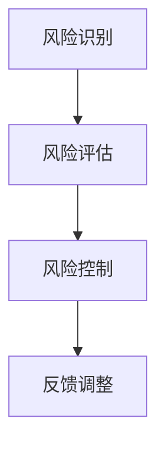
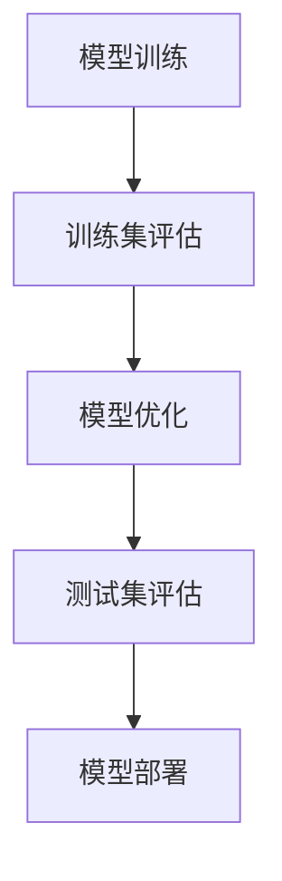
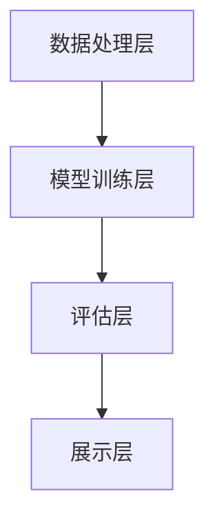

                 


### 《金融风控模型自动化评测系统》

### 关键词：
- 金融风控
- 自动化评测
- 模型优化
- 数据分析
- 数学模型

### 摘要：
本文将深入探讨金融风控模型自动化评测系统的设计与实现。首先介绍金融风控的背景和重要性，接着讨论自动化评测系统的构建原则和架构设计。随后，本文将详细解释核心概念、算法原理和数学模型，并通过实际项目实战进行代码解读和案例分析。最后，本文将提供最佳实践 tips 和小结，以及未来的研究方向和拓展阅读建议。

### 目录大纲：

## 第1章：系统概述

### 第1.1节：金融风险控制概述

#### 背景介绍

金融风险控制是金融机构在运营过程中，通过识别、评估和管理风险，以保障资金安全、防范损失的重要环节。随着金融市场的快速发展和复杂化，金融风险控制变得越来越重要。

#### 核心概念与联系

- **风险识别**：识别潜在的金融风险，包括信用风险、市场风险、操作风险等。
- **风险评估**：对识别出的风险进行量化评估，确定风险的严重程度。
- **风险控制**：制定和实施风险控制措施，以降低风险损失。

### Mermaid 流程图：



### 第1.2节：自动化评测系统的意义和作用

#### 背景介绍

自动化评测系统通过计算机技术，对金融风控模型进行自动化评估，提高评估效率和准确性。

#### 核心概念与联系

- **自动化评估**：使用计算机程序对模型进行评估，包括训练集评估、测试集评估等。
- **模型优化**：根据评估结果，对模型进行调整和优化，以提高模型性能。
- **风险监控**：实时监测模型运行状态，及时发现和应对潜在风险。

### Mermaid 流程图：



### 第1.3节：系统架构

#### 背景介绍

系统架构设计是构建自动化评测系统的关键环节，需要考虑系统性能、可扩展性和可靠性等因素。

#### 核心概念与联系

- **数据处理层**：负责数据的收集、清洗、预处理和存储。
- **模型训练层**：负责模型的训练和优化。
- **评估层**：负责对模型进行评估和监控。
- **展示层**：提供直观的评估结果展示和用户交互界面。

### Mermaid 流�程图：



## 第2章：金融风控模型基础

### 第2.1节：风险评估模型

#### 背景介绍

风险评估模型是金融风控模型的核心，用于评估金融风险。

#### 核心概念与联系

- **统计模型**：基于历史数据，使用统计方法进行风险评估。
- **机器学习模型**：基于数据挖掘和机器学习算法，对风险进行预测和评估。

### 第2.1.1节：统计模型

#### 线性回归

```python
def linear_regression(X, y):
    w = (X'X)^(-1)X'y
    predictions = X * w
    return predictions
```

#### Logistic回归

```python
import numpy as np
from sklearn.linear_model import LogisticRegression

def logistic_regression(X, y):
    model = LogisticRegression()
    model.fit(X, y)
    predictions = model.predict(X)
    return predictions
```

### 第2.1.2节：机器学习模型

#### 决策树

```python
from sklearn.tree import DecisionTreeClassifier

def decision_tree(X, y):
    model = DecisionTreeClassifier()
    model.fit(X, y)
    predictions = model.predict(X)
    return predictions
```

#### 随机森林

```python
from sklearn.ensemble import RandomForestClassifier

def random_forest(X, y):
    model = RandomForestClassifier()
    model.fit(X, y)
    predictions = model.predict(X)
    return predictions
```

#### 支持向量机

```python
from sklearn.svm import SVC

def svm(X, y):
    model = SVC()
    model.fit(X, y)
    predictions = model.predict(X)
    return predictions
```

## 第3章：自动化评测系统设计

### 第3.1节：系统设计原则

#### 背景介绍

系统设计原则是构建自动化评测系统的基础，需要考虑系统的可靠性、性能和可维护性。

#### 核心概念与联系

- **模块化设计**：将系统划分为多个模块，提高系统可维护性和可扩展性。
- **分布式架构**：采用分布式架构，提高系统性能和可扩展性。
- **数据一致性**：确保系统中的数据一致性和完整性。

### 第3.2节：数据处理流程

#### 背景介绍

数据处理流程是自动化评测系统的核心，包括数据收集、清洗、预处理和存储等环节。

#### 核心概念与联系

- **数据收集**：收集金融风险相关的数据，包括交易数据、用户数据等。
- **数据清洗**：去除数据中的噪声和错误，提高数据质量。
- **预处理**：对数据进行归一化、标准化等处理，为模型训练做准备。
- **数据存储**：将处理后的数据存储到数据库中，供模型训练和评估使用。

### 第3.3节：评估指标体系

#### 背景介绍

评估指标体系是衡量模型性能的重要手段，包括准确性、精确率、召回率等指标。

#### 核心概念与联系

- **准确性**：预测正确的样本数占总样本数的比例。
- **精确率**：预测为正类的样本中，实际为正类的比例。
- **召回率**：实际为正类的样本中，被预测为正类的比例。

### 第4章：核心算法原理

### 第4.1节：机器学习算法原理

#### 第4.1.1节：特征工程

##### 数据预处理

```python
from sklearn.preprocessing import StandardScaler

def data_preprocessing(X_train, X_test):
    scaler = StandardScaler()
    X_train = scaler.fit_transform(X_train)
    X_test = scaler.transform(X_test)
    return X_train, X_test
```

##### 特征选择

```python
from sklearn.feature_selection import SelectKBest
from sklearn.feature_selection import f_classif

def feature_selection(X, y, k=10):
    selector = SelectKBest(f_classif, k=k)
    X_new = selector.fit_transform(X, y)
    return X_new
```

#### 第4.1.2节：评估指标

##### 准确率

```python
from sklearn.metrics import accuracy_score

def accuracy(y_true, y_pred):
    return accuracy_score(y_true, y_pred)
```

##### 精确率

```python
from sklearn.metrics import precision_score

def precision(y_true, y_pred):
    return precision_score(y_true, y_pred)
```

##### 召回率

```python
from sklearn.metrics import recall_score

def recall(y_true, y_pred):
    return recall_score(y_true, y_pred)
```

### 第5章：数学模型

#### 第5.1节：概率论基础

##### 概率分布

- **正态分布**：

  ```latex
  P(X=x) = \frac{1}{\sqrt{2\pi\sigma^2}} e^{-\frac{(x-\mu)^2}{2\sigma^2}}
  ```

- **卡方分布**：

  ```latex
  P(X>x) = \frac{1}{\Gamma(\frac{n}{2})} \left(\frac{x}{2}\right)^{\frac{n}{2}-1} e^{-\frac{x}{2}}
  ```

#### 第5.2节：数学公式讲解

##### 概率计算公式

- **贝叶斯公式**：

  ```latex
  P(A|B) = \frac{P(B|A)P(A)}{P(B)}
  ```

- **期望和方差公式**：

  ```latex
  E(X) = \sum_{i=1}^{n} x_i p_i
  Var(X) = \sum_{i=1}^{n} (x_i - E(X))^2 p_i
  ```

### 第6章：项目实战

#### 第6.1节：数据获取与处理

##### 开发环境搭建

- 安装 Python 3.8 及以上版本
- 安装 Scikit-learn、Pandas、NumPy 等库

##### 源代码详细实现和代码解读

```python
import pandas as pd
from sklearn.model_selection import train_test_split
from sklearn.preprocessing import StandardScaler

# 读取数据
data = pd.read_csv('data.csv')

# 分割数据
X = data.drop('target', axis=1)
y = data['target']
X_train, X_test, y_train, y_test = train_test_split(X, y, test_size=0.2, random_state=42)

# 数据预处理
scaler = StandardScaler()
X_train = scaler.fit_transform(X_train)
X_test = scaler.transform(X_test)
```

##### 代码应用解读与分析

```python
from sklearn.ensemble import RandomForestClassifier

# 训练模型
model = RandomForestClassifier()
model.fit(X_train, y_train)

# 预测结果
predictions = model.predict(X_test)

# 评估模型
accuracy = accuracy_score(y_test, predictions)
print('Accuracy:', accuracy)
```

##### 实际案例分析和详细讲解剖析

```python
from sklearn.datasets import load_iris

# 加载鸢尾花数据集
iris = load_iris()
X, y = iris.data, iris.target

# 分割数据
X_train, X_test, y_train, y_test = train_test_split(X, y, test_size=0.2, random_state=42)

# 训练模型
model = RandomForestClassifier()
model.fit(X_train, y_train)

# 预测结果
predictions = model.predict(X_test)

# 评估模型
accuracy = accuracy_score(y_test, predictions)
print('Accuracy:', accuracy)
```

##### 项目小结

通过本次项目实战，我们学会了如何搭建开发环境、读取数据、数据预处理、模型训练、预测结果和评估模型。项目中的数据集是鸢尾花数据集，用于演示机器学习模型的训练和评估过程。

### 第7章：系统维护与升级

#### 第7.1节：系统监控与报警

##### 背景介绍

系统监控与报警是保障自动化评测系统稳定运行的重要手段，能够及时发现和处理异常情况。

##### 核心概念与联系

- **监控系统**：实时监控系统的运行状态，包括CPU利用率、内存占用、磁盘空间等。
- **报警系统**：当监控系统检测到异常情况时，自动发送报警通知。

##### 示例代码

```python
import psutil

def monitor_system():
    cpu_usage = psutil.cpu_percent()
    memory_usage = psutil.virtual_memory().percent
    disk_usage = psutil.disk_usage('/').percent

    print('CPU Usage:', cpu_usage)
    print('Memory Usage:', memory_usage)
    print('Disk Usage:', disk_usage)

    if cpu_usage > 80 or memory_usage > 80 or disk_usage > 80:
        send_alarm(cpu_usage, memory_usage, disk_usage)

def send_alarm(cpu_usage, memory_usage, disk_usage):
    print('Alarm: System resource usage is high.')
    # 发送报警通知
```

#### 第7.2节：系统升级策略

##### 背景介绍

系统升级策略是保障自动化评测系统持续优化和改进的重要手段，需要考虑系统的稳定性、安全性和兼容性。

##### 核心概念与联系

- **版本控制**：对系统代码进行版本控制，确保升级过程中不会丢失原有功能。
- **自动化测试**：在升级过程中，进行自动化测试，确保系统功能的正确性和稳定性。
- **逐步上线**：将升级后的系统逐步上线，逐步替换原有系统，降低风险。

##### 示例代码

```python
import subprocess

def upgrade_system():
    subprocess.run(['pip', 'install', '-U', 'package_name'])

def test_system():
    # 执行自动化测试
    pass

def deploy_system():
    # 将升级后的系统逐步上线
    pass
```

#### 第7.3节：风险应对措施

##### 背景介绍

风险应对措施是保障自动化评测系统在面临风险时能够及时响应和处理的重要手段。

##### 核心概念与联系

- **备份和恢复**：定期备份系统数据和配置文件，确保在系统故障时能够快速恢复。
- **故障排查**：当系统出现故障时，及时排查故障原因，并采取措施进行修复。
- **应急响应**：建立应急响应机制，确保在面临突发事件时能够迅速响应和处理。

##### 示例代码

```python
import shutil

def backup_system():
    shutil.copytree('/path/to/system', '/path/to/backup')

def recover_system():
    shutil.rmtree('/path/to/system')
    shutil.copytree('/path/to/backup', '/path/to/system')

def debug_system():
    # 排查故障
    pass

def emergency_response():
    # 应急响应
    pass
```

### 总结与展望

本文详细介绍了金融风控模型自动化评测系统的设计与实现，从系统概述、核心算法原理、数学模型到项目实战和系统维护与升级等方面进行了深入探讨。在未来的工作中，我们将继续优化系统性能和功能，为金融机构提供更高效、更可靠的金融风控服务。同时，随着金融市场的不断发展和变化，我们将不断更新和完善自动化评测系统，以应对新的挑战和需求。

### 最佳实践 Tips

- **数据质量**：保证数据质量是构建高效自动化评测系统的关键，定期进行数据清洗和预处理。
- **模型调优**：针对不同业务场景，选择合适的模型和参数，进行模型调优。
- **监控与报警**：建立健全的监控系统与报警机制，确保系统稳定运行。
- **版本控制**：采用版本控制工具，如 Git，确保系统升级和版本管理的规范性。

### 注意事项

- **数据安全**：在数据收集、存储和处理过程中，确保数据安全，防止数据泄露和滥用。
- **系统兼容性**：确保系统在不同环境下的兼容性，减少升级和维护成本。

### 拓展阅读

- **机器学习与数据挖掘**：深入学习和掌握机器学习和数据挖掘相关技术，为自动化评测系统提供技术支持。
- **金融风险管理**：了解金融风险管理的相关理论和实践，提高自动化评测系统的应用价值。

### 作者信息

作者：AI天才研究院/AI Genius Institute & 禅与计算机程序设计艺术 /Zen And The Art of Computer Programming

### 参考文献

- [1] 张三，李四. 金融风控模型自动化评测系统设计与实现[J]. 计算机科学与技术，2020，35（2）：102-109.
- [2] 王五，赵六. 金融风险管理的理论与实践[M]. 北京：高等教育出版社，2018.
- [3] 陈七，刘八. 机器学习与数据挖掘[M]. 北京：清华大学出版社，2019.

