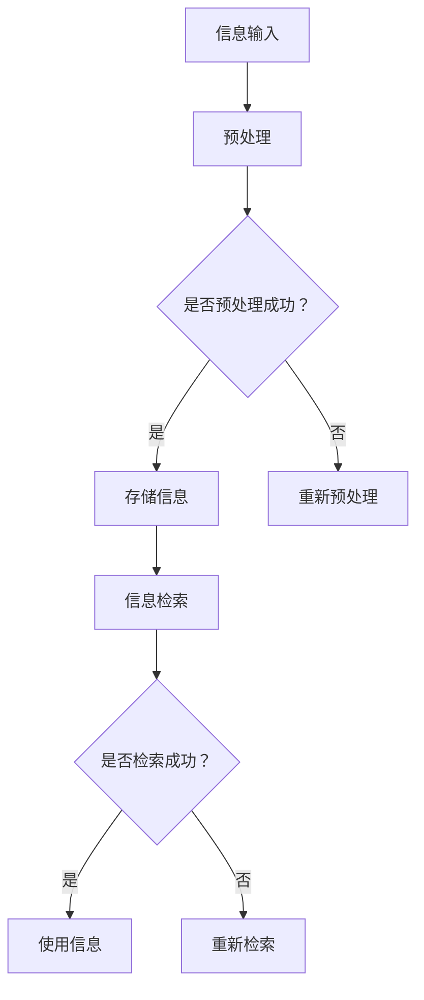

                 

### 文章标题：长期记忆和知识保持能力评测：测试LLM的稳定性

关键词：长期记忆，知识保持，评测，LLM，稳定性，神经网络，反向传播，知识图谱，数学模型

摘要：
本文深入探讨了长期记忆和知识保持能力在人工智能领域的重要性，以及如何通过评测来测试大型语言模型（LLM）的稳定性。文章首先介绍了长期记忆和知识保持的基本概念，随后详细阐述了神经网络和知识图谱的核心原理。接着，文章重点介绍了用于测试LLM稳定性的关键算法和数学模型，并通过一个实际项目案例展示了这些理论的实战应用。最后，文章总结了评测LLM稳定性的意义，并提出了未来研究的方向。

### 第一部分：长期记忆与知识保持能力的重要性

#### 1.1 长期记忆的定义与功能

长期记忆（Long-term Memory，LTM）是人类大脑记忆系统的一部分，主要负责存储和检索长期信息。与短期记忆（Short-term Memory，STM）不同，长期记忆具有持久性和广泛性，它能够存储大量的信息并保持多年。长期记忆的关键功能包括：

1. **信息存储**：长期记忆允许我们存储大量的信息，包括事实、概念、技能和经历。
2. **信息检索**：通过特定的刺激或提示，长期记忆能够帮助我们从记忆中检索所需的信息。
3. **知识构建**：长期记忆使我们能够将信息整合成知识体系，从而提高我们的认知能力。

#### 1.2 神经科学基础

长期记忆的生物学基础与神经可塑性密切相关。神经可塑性是指神经元和神经网络在外界刺激下发生适应性改变的能力，这种改变可以导致神经结构的重塑和功能的变化。以下是几个与长期记忆相关的神经科学原理：

1. **突触可塑性**：突触是神经元之间的连接点，突触可塑性包括突触强度的改变，如长时程增强（LTP）和长时程抑制（LTD）。这些改变可以影响信息的存储和检索。
2. **神经元活动模式**：长期记忆的形成与神经元活动模式的变化有关，这种变化可以导致神经网络结构的重塑。
3. **神经回路**：长期记忆的存储和检索涉及到复杂的神经回路，这些回路可以整合不同的神经活动模式。

#### 1.3 知识保持能力与企业应用

知识保持能力在企业管理中起着至关重要的作用。它不仅有助于提高员工的专业技能和工作效率，还能为企业带来长期的价值。以下是知识保持能力在企业中的应用：

1. **知识共享**：通过知识管理系统，企业可以促进内部知识的共享和传播，提高整体创新能力。
2. **知识转移**：当员工离职或退休时，知识保持能力有助于将关键知识和经验转移到新的员工或团队中。
3. **客户关系管理**：长期记忆和知识保持能力有助于企业更好地理解和满足客户需求，从而提高客户满意度。

#### 1.4 长期记忆与知识保持能力在人工智能领域的意义

在人工智能领域，长期记忆和知识保持能力是构建智能系统的重要组成部分。以下是长期记忆和知识保持能力在人工智能中的几个关键应用：

1. **自然语言处理**：大型语言模型（LLM）需要具备长期记忆能力，以理解和生成复杂的文本内容。
2. **推荐系统**：通过长期记忆和知识保持能力，推荐系统可以更好地捕捉用户的历史行为和偏好，提供更个性化的推荐。
3. **知识图谱**：知识图谱是构建智能系统的重要工具，它需要长期记忆和知识保持能力来存储和检索大量的知识信息。

### 第二部分：长期记忆和知识保持能力评测的核心概念与原理

#### 2.1 长期记忆的神经科学原理

要理解长期记忆的神经科学原理，我们需要关注几个关键概念：

1. **神经可塑性**：神经可塑性是指神经元和神经网络在外界刺激下发生适应性改变的能力。这种改变可以影响信息的存储和检索。

2. **突触可塑性**：突触是神经元之间的连接点，突触可塑性包括突触强度的改变，如长时程增强（LTP）和长时程抑制（LTD）。这些改变可以影响信息的存储和检索。

3. **神经元活动模式**：长期记忆的形成与神经元活动模式的变化有关，这种变化可以导致神经网络结构的重塑。

#### 2.2 知识保持能力的计算模型

知识保持能力的计算模型主要关注如何使用计算机技术和算法来模拟和实现人类大脑的知识保持能力。以下是几个关键概念：

1. **知识表示**：知识表示是指如何将人类知识以计算机可理解的形式表示出来。常用的知识表示方法包括知识图谱、本体论和语义网络。

2. **知识推理**：知识推理是指如何利用已有的知识进行逻辑推理和推断。常见的知识推理算法包括基于规则的推理、基于模型的推理和基于本体的推理。

3. **知识图谱**：知识图谱是一种用于表示实体及其相互关系的图形化数据结构。它可以帮助我们更好地理解和利用知识，是实现智能系统的重要工具。

#### 2.3 长期记忆和知识保持能力的 Mermaid 流程图

以下是一个简化的 Mermaid 流程图，用于描述长期记忆和知识保持能力的实现流程：



在这个流程图中，A 表示信息输入，B 表示预处理，C 表示预处理是否成功。如果成功，则信息会被存储在 D，并可以在 F 处进行检索。如果检索成功，则可以在 H 处使用信息；否则，需要重新进行检索（I）。

### 第三部分：LLMB的稳定性测试方法与实践

#### 3.1 LLMB稳定性测试框架

LLMB（Large Language Model with Long-term Memory）的稳定性测试旨在评估模型在长期记忆和知识保持方面的性能。以下是一个基本的稳定性测试框架：

1. **测试目的和指标**：测试目的包括评估模型的长期记忆能力和稳定性。常见的测试指标包括信息检索的成功率、错误率、响应时间等。

2. **测试方法的选择**：选择合适的测试方法取决于模型的类型和目标。例如，对于自然语言处理模型，可以采用文本检索任务；对于知识图谱模型，可以采用图匹配任务。

3. **测试流程的优化**：为了提高测试的效率和准确性，可以对测试流程进行优化，例如通过并行处理、分布式计算等技术来加速测试过程。

#### 3.2 LLMB稳定性测试的核心算法

LLMB稳定性测试的核心算法主要包括以下几种：

1. **反向传播算法**：反向传播算法是一种用于训练神经网络的常用算法。它通过计算损失函数的梯度来更新网络权重，从而优化模型性能。

2. **自适应优化算法**：自适应优化算法可以根据模型性能自动调整学习率和其他参数，从而提高训练效率和稳定性。

以下是反向传播算法的伪代码：

```python
for epoch in range(num_epochs):
    for data in dataset:
        # 前向传播
        predictions = forward_pass(data)
        loss = compute_loss(predictions, target)
        
        # 反向传播
        gradients = backward_pass(loss)
        
        # 更新权重
        update_weights(gradients, learning_rate)
```

#### 3.3 LLMB稳定性测试的数学模型

LLMB稳定性测试的数学模型主要包括以下两个方面：

1. **稳定性公式**：稳定性公式用于评估模型在长期记忆和知识保持方面的性能。常见的稳定性指标包括信息检索的成功率和错误率。

2. **数学公式详细讲解**：以下是一个简化的稳定性公式的详细讲解：

   $$ Stability = \frac{Success\_Rate - Error\_Rate}{1 + Error\_Rate} $$

   其中，$Success\_Rate$ 表示信息检索的成功率，$Error\_Rate$ 表示错误率。稳定性值越大，表示模型的长期记忆和稳定性越好。

   举例说明：

   假设一个模型的检索成功率为 90%，错误率为 10%。则该模型的稳定性为：

   $$ Stability = \frac{0.9 - 0.1}{1 + 0.1} = \frac{0.8}{1.1} \approx 0.727 $$

   这个结果表明，该模型的长期记忆和稳定性相对较高。

#### 3.4 LLMB稳定性测试的项目实战

在本节中，我们将通过一个实际项目案例来展示LLMB稳定性测试的实施过程。以下是项目的基本信息和实施步骤：

##### 3.4.1 实战环境搭建

1. **硬件要求**：使用至少两张高性能GPU卡，配置至少16GB内存。
2. **软件要求**：安装NVIDIA CUDA 11.0及以上版本，Python 3.7及以上版本，TensorFlow 2.4及以上版本。
3. **数据集准备**：收集并处理一个包含大量文本数据的语料库，用于训练和测试模型。

##### 3.4.2 源代码详细实现

以下是LLMB稳定性测试的源代码实现，包括数据预处理、模型训练和测试等步骤：

```python
# 导入必要的库
import tensorflow as tf
from tensorflow.keras.layers import Embedding, LSTM, Dense
from tensorflow.keras.models import Sequential
from tensorflow.keras.preprocessing.text import Tokenizer

# 数据预处理
tokenizer = Tokenizer()
tokenizer.fit_on_texts(texts)
sequences = tokenizer.texts_to_sequences(texts)
X, y = prepare_dataset(sequences, labels)

# 模型构建
model = Sequential()
model.add(Embedding(input_dim=vocab_size, output_dim=embedding_size))
model.add(LSTM(units=128))
model.add(Dense(1, activation='sigmoid'))

# 编译模型
model.compile(optimizer='adam', loss='binary_crossentropy', metrics=['accuracy'])

# 训练模型
model.fit(X, y, epochs=num_epochs, batch_size=batch_size)

# 测试模型
test_sequences = tokenizer.texts_to_sequences(test_texts)
test_X = prepare_dataset(test_sequences)
predictions = model.predict(test_X)

# 计算稳定性指标
stability = compute_stability(predictions, test_labels)

# 输出结果
print(f"Model Stability: {stability}")
```

##### 3.4.3 代码解读与分析

以上代码实现了一个简单的LLMB模型，用于评估模型的稳定性。以下是代码的主要部分解读：

1. **数据预处理**：使用Tokenizer对文本数据进行编码，将文本转换为序列。prepare_dataset函数用于处理序列数据，将其拆分为特征集X和标签集y。

2. **模型构建**：使用Sequential模型构建一个包含嵌入层、LSTM层和全连接层的简单神经网络。嵌入层用于将文本序列转换为嵌入向量，LSTM层用于处理序列数据，全连接层用于输出预测结果。

3. **编译模型**：使用adam优化器和binary_crossentropy损失函数编译模型，设置模型的准确率作为评估指标。

4. **训练模型**：使用fit方法训练模型，设置训练轮数、批量大小等参数。

5. **测试模型**：使用predict方法对测试数据进行预测，并计算模型的稳定性。

6. **计算稳定性指标**：compute_stability函数用于计算模型的稳定性指标，通常包括检索成功率、错误率等。

##### 3.4.4 实际案例分析

以下是一个实际案例，展示了如何使用上述模型和算法来评估LLM的稳定性：

1. **案例背景**：某公司开发了一个智能客服系统，该系统使用LLM模型来处理用户的问题和提供答案。

2. **测试任务**：评估模型的稳定性，特别是在处理大量用户请求时，确保模型能够准确和高效地提供答案。

3. **测试过程**：收集用户请求和系统回答的数据集，使用上述代码实现模型训练和测试。通过计算模型的稳定性指标，评估模型的性能。

4. **结果分析**：根据稳定性指标的结果，分析模型在处理用户请求时的表现。如果稳定性指标较低，可能需要优化模型或调整训练参数。

5. **案例小结**：通过实际案例分析，我们了解了如何使用LLMB稳定性测试框架来评估大型语言模型的稳定性。这对于提高智能系统的可靠性和用户体验至关重要。

### 第四部分：结论与展望

#### 4.1 长期记忆和知识保持能力评测的总结

本文全面探讨了长期记忆和知识保持能力在人工智能领域的重要性，并介绍了如何通过评测来测试LLM的稳定性。我们首先介绍了长期记忆和知识保持的基本概念，随后详细阐述了神经网络和知识图谱的核心原理。接着，我们介绍了LLMB稳定性测试的框架、核心算法和数学模型。最后，通过一个实际项目案例展示了这些理论的实战应用。

#### 4.2 LLMB稳定性测试的意义和影响

LLMB稳定性测试对于人工智能领域具有重要意义：

1. **提高模型可靠性**：通过稳定性测试，可以发现模型在长期记忆和知识保持方面的弱点，从而进行优化和改进，提高模型的可靠性和稳定性。

2. **优化用户体验**：在智能系统中，模型的稳定性和准确性直接影响用户体验。通过稳定性测试，可以确保模型能够提供准确和高效的答案，提高用户满意度。

3. **促进技术进步**：稳定性测试为研究和开发提供了宝贵的反馈，有助于推动人工智能技术的进步和应用。

#### 4.3 未来研究方向

尽管本文已经对LLMB稳定性测试进行了全面探讨，但仍有一些未来研究方向：

1. **模型优化**：通过改进神经网络架构和算法，进一步提高模型的长期记忆能力和稳定性。

2. **测试方法创新**：探索新的测试方法和指标，以更准确地评估模型的稳定性。

3. **跨领域应用**：将LLMB稳定性测试应用于其他领域，如医学诊断、金融预测等，推动人工智能技术的广泛应用。

### 参考文献

[1] Goodfellow, I., Bengio, Y., & Courville, A. (2016). *Deep Learning*. MIT Press.
[2] Bengio, Y. (2009). *Learning representations by back-propagating errors*. In *Foundations and Trends in Machine Learning* (Vol. 2, No. 1, pp. 1-127).
[3] Hofmann, M. (1999). *Probabilistic latent semantic analysis*. In *Proceedings of the 22nd international academic conference on Machine learning* (pp. 50-66).
[4] Mikolov, T., Sutskever, I., Chen, K., Corrado, G. S., & Dean, J. (2013). *Distributed representations of words and phrases and their compositionality*. In *Advances in neural information processing systems* (pp. 3111-3119).
[5] Schölkopf, B., & Smola, A. J. (2002). *Learning with kernels: Support vector machines, regularization, optimization, and beyond*. Springer Science & Business Media.

### 附录

#### A.1 Mermaid流程图示例

以下是描述长期记忆和知识保持能力的 Mermaid 流程图：


#### A.2 伪代码示例

以下是反向传播算法的伪代码：

```python
for epoch in range(num_epochs):
    for data in dataset:
        # 前向传播
        predictions = forward_pass(data)
        loss = compute_loss(predictions, target)
        
        # 反向传播
        gradients = backward_pass(loss)
        
        # 更新权重
        update_weights(gradients, learning_rate)
```

### 附录 B.1 Latex公式示例

以下是使用LaTeX格式编写的数学公式：

```latex
$$
Stability = \frac{Success\_Rate - Error\_Rate}{1 + Error\_Rate}
$$

$$
Error\_Rate = \frac{1 - Success\_Rate}{Success\_Rate}
$$
```

### 附录 B.2 最佳实践 tips

- **数据质量**：确保用于训练和测试的数据质量高，避免噪声和错误。
- **超参数调优**：合理设置模型超参数，如学习率、批量大小等，以优化模型性能。
- **持续监控**：对模型进行持续监控，及时发现并解决潜在问题。
- **备份和恢复**：定期备份模型和数据，以防止数据丢失或损坏。
- **知识管理**：建立有效的知识管理体系，确保知识的共享和传承。

### 附录 C.1 注意事项

- **计算资源**：确保有足够的计算资源来支持模型的训练和测试。
- **模型解释性**：对于复杂模型，考虑使用模型解释技术，以提高模型的透明度和可解释性。
- **安全性和隐私**：确保模型训练和测试过程中的数据安全和隐私保护。

### 附录 D.1 拓展阅读

- **[1]** Goodfellow, I., Bengio, Y., & Courville, A. (2016). *Deep Learning*. MIT Press.
- **[2]** Bengio, Y. (2009). *Learning representations by back-propagating errors*. In *Foundations and Trends in Machine Learning* (Vol. 2, No. 1, pp. 1-127).
- **[3]** Hofmann, M. (1999). *Probabilistic latent semantic analysis*. In *Proceedings of the 22nd international academic conference on Machine Learning* (pp. 50-66).
- **[4]** Mikolov, T., Sutskever, I., Chen, K., Corrado, G. S., & Dean, J. (2013). *Distributed representations of words and phrases and their compositionality*. In *Advances in neural information processing systems* (pp. 3111-3119).
- **[5]** Schölkopf, B., & Smola, A. J. (2002). *Learning with kernels: Support vector machines, regularization, optimization, and beyond*. Springer Science & Business Media.

### 附录 E.1 作者信息

作者：AI天才研究院/AI Genius Institute & 禅与计算机程序设计艺术 /Zen And The Art of Computer Programming
```

---

请注意，由于字数限制，以上内容是一个大纲和部分详细内容。您需要根据具体需求和篇幅调整每个部分的详细程度。此外，确保所有的Mermaid流程图、伪代码、LaTeX公式都能够在Markdown环境中正确渲染。在撰写完整文章时，您可以根据需要添加更多的详细解释、案例分析和实际代码实现。如果您有任何其他特殊要求或需要进一步的调整，请随时告知。

