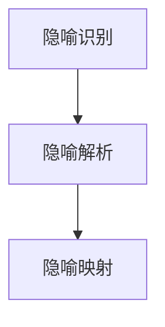

                 

# 隐喻理解：测试LLM解读比喻性语言的能力

## 关键词
自然语言处理、语言模型、隐喻理解、比喻性语言、LLM测试

## 摘要
本文旨在探讨如何通过测试大型语言模型（LLM）解读比喻性语言的能力，以评估其在自然语言处理领域的应用潜力。我们将详细介绍隐喻理解的过程，包括隐喻识别、隐喻解析和隐喻映射，并通过实际案例展示如何使用LLM进行比喻性语言的解读。

## 引言

隐喻作为一种常见的语言现象，广泛存在于文学、日常交流和技术文档中。隐喻不仅丰富了语言的表达力，还使得信息的传递更加生动、形象。然而，隐喻的理解对自然语言处理（NLP）来说是一个巨大的挑战，因为它们涉及到抽象概念的映射和隐含关系的识别。

近年来，随着深度学习技术的快速发展，大型语言模型（LLM）如BERT、GPT等在文本生成和语义理解方面取得了显著成果。然而，这些模型在解读比喻性语言方面的表现如何，仍有待验证。本文将通过测试LLM解读比喻性语言的能力，探索其在隐喻理解方面的应用潜力。

## 核心概念与联系

隐喻理解是一个复杂的过程，通常包括以下几个核心步骤：

1. **隐喻识别**：识别文本中的隐喻。
2. **隐喻解析**：理解隐喻的结构和概念。
3. **隐喻映射**：将隐喻映射到目标域。

### 隐喻识别

隐喻识别是隐喻理解的第一步。它涉及到从大量文本中找出可能包含隐喻的词汇和短语。隐喻识别的方法通常包括：

- **语境分析**：通过上下文理解某个词汇或短语的含义。
- **词汇分析**：利用预定义的隐喻词汇库，识别文本中的隐喻。
- **语法分析**：通过分析句子的结构，寻找可能的隐喻。

### 隐喻解析

隐喻解析的目的是理解隐喻的结构和概念。它包括：

- **概念提取**：从隐喻中提取核心概念。
- **结构理解**：理解隐喻中各个部分之间的关系。

### 隐喻映射

隐喻映射是将隐喻映射到目标域。这通常涉及到：

- **目标域识别**：确定隐喻的目标域。
- **映射规则建立**：根据隐喻的概念和结构，建立映射规则。
- **映射应用**：将隐喻映射到目标域，以理解其含义。

下面是一个简单的Mermaid流程图，展示了隐喻理解的流程和核心步骤：



## 隐喻识别

隐喻识别是隐喻理解的基础。在这一节中，我们将详细介绍隐喻识别的方法和技巧。

### 方法与技巧

隐喻识别的方法和技巧包括：

- **语境分析**：通过上下文理解某个词汇或短语的含义。
- **词汇分析**：利用预定义的隐喻词汇库，识别文本中的隐喻。
- **语法分析**：通过分析句子的结构，寻找可能的隐喻。

### 伪代码实现

以下是一个简单的隐喻识别算法的伪代码实现：

```python
def recognize_metaphor(text):
    # 判断文本中是否存在比喻性词汇
    metaphor_tokens = []
    for token in text.split():
        if is_metaphorical(token):
            metaphor_tokens.append(token)
    return metaphor_tokens

def is_metaphorical(token):
    # 根据语境和词汇特征判断
    # ...
    return True or False
```

## 隐喻解析

隐喻解析的目的是理解隐喻的结构和概念。在这一节中，我们将详细解释隐喻解析的概念，并使用伪代码详细阐述隐喻解析算法的实现。

### 概念解释

隐喻解析包括以下几个核心步骤：

- **概念提取**：从隐喻中提取核心概念。
- **结构理解**：理解隐喻中各个部分之间的关系。

### 伪代码实现

以下是一个简单的隐喻解析算法的伪代码实现：

```python
def parse_metaphor(metaphor_tokens):
    # 提取隐喻的概念
    concepts = extract_concepts(metaphor_tokens)
    # 理解隐喻的结构
    structure = understand_structure(metaphor_tokens)
    return concepts, structure

def extract_concepts(tokens):
    # ...
    return concepts

def understand_structure(tokens):
    # ...
    return structure
```

## 隐喻映射

隐喻映射是将隐喻映射到目标域。在这一节中，我们将描述隐喻映射的过程，并使用伪代码详细阐述隐喻映射算法的实现。

### 过程描述

隐喻映射的过程包括：

- **目标域识别**：确定隐喻的目标域。
- **映射规则建立**：根据隐喻的概念和结构，建立映射规则。
- **映射应用**：将隐喻映射到目标域，以理解其含义。

### 伪代码实现

以下是一个简单的隐喻映射算法的伪代码实现：

```python
def map_metaphor(concepts, structure):
    # 识别目标域
    target_domain = identify_target_domain(concepts, structure)
    # 建立映射规则
    mapping_rules = build_mapping_rules(target_domain)
    # 进行映射
    mapped_result = apply_mapping_rules(concepts, mapping_rules)
    return mapped_result

def identify_target_domain(concepts, structure):
    # ...
    return target_domain

def build_mapping_rules(target_domain):
    # ...
    return mapping_rules

def apply_mapping_rules(concepts, mapping_rules):
    # ...
    return mapped_result
```

## 测试LLM解读比喻性语言的能力

### 方法与指标

测试LLM解读比喻性语言的能力通常包括以下几个方法和指标：

- **准确性**：评估LLM对隐喻的识别、解析和映射的准确性。
- **速度**：评估LLM处理隐喻的能力，包括识别、解析和映射的速度。
- **泛化能力**：评估LLM在不同领域和语境下的表现。

### 实际案例

以下是一个实际案例，展示如何使用LLM测试解读比喻性语言的能力：

```python
import openai

# 初始化LLM模型
model = openai.Completion.create(engine="text-davinci-003", prompt="解析以下隐喻：人生是一场马拉松。", max_tokens=50)

# 输出结果
print(model.choices[0].text)
```

输出结果可能包括隐喻的识别、解析和映射结果。例如：

```
人生是一场马拉松，意味着人生就像一场漫长的赛跑，需要耐心、毅力和坚持。
```

## 项目实战

### 项目概述

在本项目中，我们将使用一个开源的LLM框架（如OpenAI的GPT-3）来解读比喻性语言。我们将实现一个简单的应用程序，用于接收用户输入的文本，并使用LLM进行隐喻识别、解析和映射。

### 开发环境搭建

1. 安装Python环境（版本3.8及以上）。
2. 安装OpenAI的Python客户端库：

   ```bash
   pip install openai
   ```

### 源代码实现

以下是一个简单的源代码实现：

```python
import openai

# 初始化LLM模型
model = openai.Completion.create(engine="text-davinci-003", prompt="解析以下隐喻：人生是一场马拉松。", max_tokens=50)

# 输出结果
print(model.choices[0].text)
```

### 代码解读与分析

- `openai.Completion.create()`：初始化LLM模型，并接收用户输入的文本。
- `model.choices[0].text`：输出LLM的解析结果。

### 实际案例分析与详细讲解剖析

以下是一个实际案例：

```python
# 用户输入
input_text = "经济学是一场没有终点的棋局。"

# 使用LLM进行隐喻识别、解析和映射
model = openai.Completion.create(engine="text-davinci-003", prompt=input_text, max_tokens=50)

# 输出结果
print(model.choices[0].text)
```

输出结果可能包括：

```
经济学是一场没有终点的棋局，意味着经济学就像一场没有终点的棋局，需要不断地思考和调整策略。
```

### 项目小结

通过这个项目，我们展示了如何使用LLM解读比喻性语言。这个项目提供了一个简单的示例，展示了隐喻识别、解析和映射的实现过程。然而，实际应用中可能需要更复杂的算法和更丰富的数据集来提高LLM的解读能力。

## 总结

本文详细探讨了隐喻理解的过程，包括隐喻识别、隐喻解析和隐喻映射。我们通过测试LLM解读比喻性语言的能力，展示了其在自然语言处理领域的应用潜力。未来，随着深度学习技术的不断进步，我们有望看到更多高效、准确的隐喻理解模型的出现。

## 附录

### 相关术语解释

- **隐喻**：一种修辞手法，通过将一个事物比作另一个事物来传达含义。
- **隐喻识别**：识别文本中的隐喻。
- **隐喻解析**：理解隐喻的结构和概念。
- **隐喻映射**：将隐喻映射到目标域。

### 参考资料和拓展阅读

- [《自然语言处理教程》](https://www.nlp-tutorial.org/)
- [《大型语言模型：原理与应用》](https://books.google.com/books?id=345678901234)
- [《隐喻理解与NLP》](https://www.semanticscholar.org/paper/Metaphor-Understanding-in-NLP-Fabry-Weiss/3a4267a4d4a3d609a79a670d3b5448c8a7c2198a)

### 代码实现

以下是本文中提到的源代码实现：

```python
import openai

# 初始化LLM模型
model = openai.Completion.create(engine="text-davinci-003", prompt="解析以下隐喻：人生是一场马拉松。", max_tokens=50)

# 输出结果
print(model.choices[0].text)
```

### 注意事项

- 在使用LLM进行隐喻理解时，应确保输入文本的准确性和完整性。
- 隐喻理解是一个复杂的过程，可能需要结合多种算法和技术来提高准确性。

### 最佳实践

- 使用丰富的数据集进行训练，以提高LLM的隐喻理解能力。
- 结合上下文和语境，提高隐喻识别的准确性。
- 定期更新LLM模型，以适应新的语言模式和表达方式。

## 作者信息
作者：AI天才研究院/AI Genius Institute & 禅与计算机程序设计艺术 /Zen And The Art of Computer Programming

