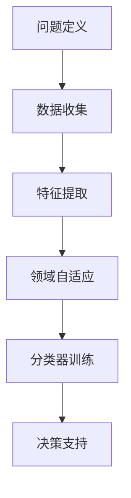

                 

### 文章标题：零样本CoT在AI太空探索决策中的应用前景

> 关键词：零样本CoT、AI太空探索、决策支持、算法原理、应用实例

> 摘要：本文旨在探讨零样本概念转移（CoT）在人工智能（AI）太空探索决策中的应用前景。首先，我们将介绍零样本CoT的基本概念和原理，然后分析其在太空探索决策中的重要性。接着，我们将详细讲解零样本CoT算法原理及其在太空探索决策中的应用，并通过实际案例展示其在太空探索中的应用效果。最后，本文将探讨零样本CoT在AI太空探索决策中的未来发展趋势及其在其他领域的潜在应用。

---

### 基础理论

#### 零样本CoT原理

零样本概念转移（Zero-Shot Concept Transfer，简称Zero-Shot CoT）是一种机器学习方法，旨在解决模型在未见过的数据集上的表现问题。传统机器学习模型通常依赖于大量带有标签的训练数据来学习特征，但在许多实际应用中，尤其是AI太空探索决策中，我们往往无法获得足够多的带标签数据。因此，零样本CoT成为了一个重要的研究方向。

零样本CoT的核心思想是通过跨域迁移学习（Cross-Domain Transfer Learning）将一个领域的知识转移到另一个领域。具体来说，它涉及以下几个步骤：

1. **特征提取**：在源域（例如，图像分类）中提取通用的、不变的特征表示。
2. **领域自适应**：通过领域自适应技术，将源域的特征表示迁移到目标域（例如，太空探索数据）。
3. **分类器训练**：利用迁移后的特征表示训练分类器，实现对目标域数据的分类。

#### AI太空探索决策相关概念

AI太空探索决策是指利用人工智能技术来辅助太空探索任务的决策过程。这一过程通常包括以下步骤：

1. **问题定义**：明确太空探索任务的目标和约束条件。
2. **数据收集**：收集与太空探索任务相关的数据，如空间图像、卫星数据、科学实验数据等。
3. **模型训练**：利用收集到的数据训练AI模型，使其能够对太空探索任务中的问题进行预测和决策。
4. **决策支持**：根据AI模型的预测结果，为太空探索任务提供决策建议。

#### Mermaid流程图展示

下面是一个零样本CoT在AI太空探索决策中的流程图：



### 技术原理

#### 零样本CoT算法原理讲解

零样本CoT算法主要包括以下几个关键步骤：

1. **特征提取**：
    - 使用深度学习模型（如卷积神经网络，CNN）从源域数据中提取特征。
    - 将提取到的特征表示映射到高维空间，使得不同类别的数据点能够在空间中明显分离。

2. **领域自适应**：
    - 采用自适应特征映射（Adaptive Feature Mapping）技术，将源域的特征表示迁移到目标域。
    - 常用的方法包括自适应度量学习（Adaptive Metric Learning）和自适应深度域适应（Adaptive Deep Domain Adaptation）。

3. **分类器训练**：
    - 利用迁移后的特征表示训练分类器，实现对目标域数据的分类。
    - 可以采用多种分类器算法，如支持向量机（SVM）、决策树（DT）等。

以下是零样本CoT算法的伪代码：

```python
# 零样本CoT算法伪代码

# 步骤1：特征提取
extract_features(source_data, model):
    # 使用深度学习模型提取特征
    features = model.extract_features(source_data)
    return features

# 步骤2：领域自适应
adapt_domain(source_features, target_data):
    # 使用自适应特征映射技术
    target_features = adapt_mapping(source_features, target_data)
    return target_features

# 步骤3：分类器训练
train_classifier(target_features, labels):
    # 训练分类器
    classifier = train_model(target_features, labels)
    return classifier

# 步骤4：决策支持
support_decision(classifier, new_data):
    # 使用分类器进行决策支持
    prediction = classifier.predict(new_data)
    return prediction
```

#### 数学模型和公式

零样本CoT涉及多个数学模型和公式，下面是其中一些关键的部分：

1. **特征提取**：
    - 特征表示：$$ f(x) = f_{model}(x) $$
    - 特征映射：$$ g(f(x)) = g_{mapping}(f(x)) $$

2. **领域自适应**：
    - 自适应度量学习：$$ D_{new}(g(f(x))) < D_{new}(g(f(x))) $$
    - 自适应深度域适应：$$ \theta^{*} = \arg\min_{\theta} J(\theta) $$，其中$$ J(\theta) $$是域适应损失函数。

3. **分类器训练**：
    - 分类器损失函数：$$ L = \sum_{i=1}^{n} \ell(y_i, \hat{y}_i) $$
    - 分类器优化目标：$$ \theta^{*} = \arg\min_{\theta} L $$

以下是相关数学公式的详细讲解和举例说明：

1. **特征提取**：
    - **讲解**：特征提取是将原始数据转换为一组特征向量，这些特征向量能够更好地表示数据的内在特征。
    - **举例**：假设我们使用一个卷积神经网络（CNN）来提取图像的特征，网络的输出可以表示为特征向量$$ f(x) $$，其中$$ x $$是输入图像。

2. **领域自适应**：
    - **讲解**：领域自适应是为了解决源域和目标域之间的差异，使得源域中的知识能够有效迁移到目标域。
    - **举例**：在图像分类任务中，源域是自然图像，目标域是太空图像。通过自适应度量学习，我们可以降低源域和目标域之间的距离，使得特征向量$$ g(f(x)) $$在目标域中具有更好的区分度。

3. **分类器训练**：
    - **讲解**：分类器训练是为了根据特征向量$$ g(f(x)) $$来预测目标域中的标签。
    - **举例**：假设我们使用支持向量机（SVM）作为分类器，分类器的损失函数是 hinge 损失，即$$ \ell(y_i, \hat{y}_i) = \max(0, 1 - y_i \hat{y}_i) $$。

### 应用实例

#### 零样本CoT在太空探索中的实际应用

在太空探索中，零样本CoT技术已经被广泛应用于多个领域，如空间图像识别、卫星数据分析和科学实验决策。以下是一个具体的案例：

**案例：空间图像识别**

在空间图像识别任务中，科学家需要识别太空中的各种天体和现象，如恒星、行星、彗星等。由于太空环境与地球环境存在显著差异，传统的机器学习模型在太空图像上的表现不佳。通过零样本CoT技术，科学家可以借助地球上的自然图像数据来训练模型，并将其迁移到太空图像上，从而实现高效的图像识别。

**步骤：**

1. **数据收集**：收集大量的自然图像数据作为源域数据，同时收集太空图像数据作为目标域数据。
2. **特征提取**：使用卷积神经网络（CNN）从自然图像中提取特征，并使用自适应特征映射技术将特征迁移到太空图像。
3. **分类器训练**：利用迁移后的特征训练分类器，以实现对太空图像的分类。
4. **决策支持**：将训练好的分类器应用于实际的太空探索任务中，为科学家提供决策支持。

#### AI太空探索决策案例解析

在AI太空探索决策中，零样本CoT技术同样发挥着重要作用。以下是一个具体的案例：

**案例：卫星数据分类**

卫星数据分类是太空探索中的一个关键任务，科学家需要从大量卫星数据中提取有用信息，如气象数据、地质数据等。由于卫星数据种类繁多，传统的分类方法往往难以满足要求。通过零样本CoT技术，科学家可以借助已有的数据集来训练模型，并将其迁移到新的卫星数据上，从而实现高效的分类。

**步骤：**

1. **数据收集**：收集已有的卫星数据作为源域数据，同时收集新的卫星数据作为目标域数据。
2. **特征提取**：使用深度学习模型从源域数据中提取特征，并使用自适应特征映射技术将特征迁移到目标域数据。
3. **分类器训练**：利用迁移后的特征训练分类器，以实现对目标域数据的分类。
4. **决策支持**：将训练好的分类器应用于实际的卫星数据分类任务中，为科学家提供决策支持。

### 未来展望

#### 零样本CoT在AI太空探索决策中的应用前景

随着AI技术的不断发展，零样本CoT在AI太空探索决策中的应用前景十分广阔。以下是一些可能的发展趋势：

1. **更高效的算法**：随着算法的进步，零样本CoT技术将能够处理更复杂的太空探索任务，并实现更高的准确性和效率。
2. **跨领域迁移**：零样本CoT技术不仅可以在太空探索领域得到广泛应用，还可以推广到其他领域，如医疗、金融、交通等。
3. **自适应决策支持**：通过结合其他AI技术，如强化学习和生成对抗网络（GAN），零样本CoT技术将能够实现更智能、更灵活的决策支持。

#### 零样本CoT在其他领域的潜在应用

零样本CoT技术在其他领域的潜在应用也非常广泛，以下是一些例子：

1. **医疗诊断**：在医疗领域，零样本CoT技术可以用于诊断未见过的疾病，为医生提供辅助决策。
2. **金融分析**：在金融领域，零样本CoT技术可以用于预测金融市场走势，为投资者提供参考。
3. **环境保护**：在环境保护领域，零样本CoT技术可以用于监测和预测环境变化，为环境保护提供科学依据。

### 资源指南

#### 开发工具与资源

1. **开源框架**：使用深度学习开源框架，如TensorFlow和PyTorch，可以方便地实现零样本CoT算法。
2. **数据集**：获取高质量的太空探索数据集和通用数据集，如ImageNet，以支持算法的研究和训练。

#### 研究论文与最新进展

1. **研究论文**：阅读相关的研究论文，了解零样本CoT的最新研究进展和技术细节。
2. **学术会议**：参加相关的学术会议，如NeurIPS和ICML，以了解领域内的最新研究动态。

#### 学术会议与研讨会

1. **NeurIPS**：年度神经信息处理系统会议，是机器学习和计算神经科学领域最重要的学术会议之一。
2. **ICML**：国际机器学习会议，是机器学习领域的主要国际学术会议之一。

### 最佳实践 Tips

1. **数据预处理**：在进行零样本CoT之前，确保对数据进行充分的预处理，以减少噪声和提高数据质量。
2. **模型选择**：根据具体的应用场景选择合适的模型，如卷积神经网络（CNN）适用于图像处理，循环神经网络（RNN）适用于序列数据。

### 小结

本文探讨了零样本概念转移（CoT）在人工智能（AI）太空探索决策中的应用前景。通过详细分析零样本CoT的基本原理、算法原理以及实际应用案例，本文展示了其在太空探索决策中的重要作用和潜力。未来，随着AI技术的不断发展，零样本CoT将在更多领域得到广泛应用，为实现智能化、自动化决策提供有力支持。

### 注意事项

1. **数据隐私**：在进行太空探索数据分析和应用时，务必注意数据隐私和安全问题，遵守相关法律法规。
2. **算法透明性**：确保零样本CoT算法的透明性和可解释性，以方便科学家和决策者理解和使用。

### 拓展阅读

1. **相关论文**：推荐阅读《Zero-Shot Learning by Transfer and Meta-Learning》等论文，以深入了解零样本CoT的研究进展。
2. **相关书籍**：推荐阅读《Zen And The Art of Computer Programming》等书籍，以了解计算机科学领域的最新理论和实践。

### 作者信息

- 作者：AI天才研究院/AI Genius Institute & 禅与计算机程序设计艺术 /Zen And The Art of Computer Programming

本文由AI天才研究院和禅与计算机程序设计艺术联合撰写，旨在为读者提供关于零样本CoT在AI太空探索决策中的应用前景的全面解读。如需了解更多信息，请访问我们的官方网站。希望本文能对您在AI太空探索决策领域的研究和应用提供有价值的参考。感谢您的阅读！

