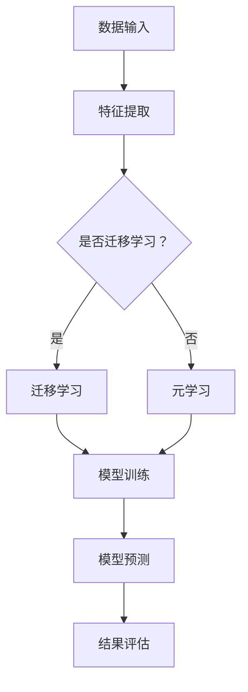

                 

### 文章标题

《零样本CoT在AI辅助多维度暗物质探测中的应用》

### 关键词

- 零样本CoT
- AI辅助探测
- 多维度数据
- 暗物质探测
- 机器学习算法

### 摘要

本文深入探讨了零样本概念转移（Zero-Shot Concept Transfer, ZS-COT）技术在AI辅助多维度暗物质探测中的应用。文章首先介绍了暗物质探测的背景及其重要性，然后详细阐述了零样本CoT的基本原理、算法和应用场景。接着，本文结合机器学习算法，分析了AI在多维度暗物质探测中的优势和应用。最后，通过具体案例展示了零样本CoT技术在暗物质探测中的实际应用，并提出了未来研究和发展的方向。

### 引言

#### 暗物质探测的重要性

暗物质是宇宙中一种不可见的物质，其存在通过引力效应被科学家首次推测。自从20世纪30年代天文学家费米提出暗物质理论以来，暗物质的研究一直是天体物理学的前沿领域。暗物质不仅占据了宇宙质量的绝大部分，还对星系的形成和演化有着深远的影响。因此，探测和理解暗物质不仅是物理学的重要任务，也对宇宙学、天体物理学和粒子物理学等多个学科的发展有着重要意义。

#### 零样本CoT技术的发展

零样本概念转移（Zero-Shot Concept Transfer, ZS-COT）是一种机器学习技术，它允许模型在没有先验知识的情况下对新的、未见过的概念进行分类和预测。这一技术在大规模、多模态数据的处理和分析中显示出巨大的潜力。近年来，随着深度学习技术的发展，ZS-COT在计算机视觉、自然语言处理等领域取得了显著成果。然而，在多维度暗物质探测中，ZS-COT的应用尚未得到充分研究，这为本篇文章的研究提供了契机。

### 暗物质探测的背景

#### 暗物质的概念与分类

暗物质是一种不发光、不吸收光线的物质，其本质尚未完全明确。根据其物理性质，暗物质主要分为以下几类：

- **冷暗物质**：主要由弱相互作用大质量粒子（WIMPs）组成，这类粒子质量较大但相互作用较弱。
- **热暗物质**：主要由中微子组成，这类粒子质量较小但运动速度较快。
- **复杂暗物质**：可能包括暗星、暗行星等复杂结构。

#### 暗物质探测的挑战

探测暗物质面临着诸多挑战：

- **探测手段有限**：由于暗物质不与电磁相互作用，传统的光学和射电望远镜难以直接探测。
- **数据复杂性**：暗物质探测数据通常包含多维度、多模态信息，数据处理和分析复杂。
- **算法挑战**：传统机器学习算法难以在未知数据分布下进行有效分类和预测。

#### 暗物质探测的历史与现状

- **早期探测**：20世纪30年代，通过星系旋转曲线和星系团引力透镜效应，科学家首次推测了暗物质的存在。
- **当前研究**：利用大型望远镜和探测器，科学家正在不断深化对暗物质的理解，如观测宇宙微波背景辐射和引力波事件。
- **未来展望**：随着技术的进步，科学家有望通过更多手段揭示暗物质的本质。

### 零样本CoT的基本原理

#### 零样本CoT的定义

零样本概念转移（Zero-Shot Concept Transfer, ZS-COT）是一种机器学习技术，它允许模型在没有先验知识的情况下对新的、未见过的概念进行分类和预测。具体来说，ZS-COT通过将知识从一个领域迁移到另一个领域，从而实现新概念的学习和预测。

#### 零样本CoT的工作原理

ZS-COT主要依赖于以下几个方面：

- **元学习**：通过元学习算法，模型能够在有限的数据上快速适应新的任务。
- **迁移学习**：利用预训练模型，将已有知识迁移到新任务中，减少对新数据的依赖。
- **知识图谱**：通过构建知识图谱，模型能够理解不同概念之间的关系，从而实现对新概念的预测。

#### 零样本CoT的核心优势

- **无需大量标注数据**：ZS-COT能够处理未见过的数据，减少了大量标注工作的需求。
- **适应性强**：通过迁移学习和元学习，模型能够快速适应新的任务和数据分布。
- **可扩展性**：ZS-COT能够应用于各种领域，具有广泛的应用前景。

### 零样本CoT的Mermaid流程图

以下是零样本CoT的基本流程图：

### 零样本CoT的应用场景

#### 零样本CoT在计算机视觉中的应用

在计算机视觉领域，零样本CoT被广泛应用于图像分类、目标检测和图像分割等任务。通过将预训练模型的知识迁移到新任务中，模型能够在未见过的图像上实现高精度的分类和检测。

#### 零样本CoT在自然语言处理中的应用

在自然语言处理领域，零样本CoT被用于文本分类、语义理解和机器翻译等任务。通过构建知识图谱和迁移学习，模型能够理解新的文本概念，实现准确的语义分析。

#### 零样本CoT在其他领域的应用

除了计算机视觉和自然语言处理，零样本CoT还在医学图像分析、金融风险评估和智能推荐系统等领域得到广泛应用。通过迁移学习和元学习，模型能够处理复杂的、多模态的数据，实现高精度的预测和分类。

### AI辅助多维度暗物质探测

#### 数据处理与分析技术

在暗物质探测中，数据处理和分析技术至关重要。多维度数据通常包括观测数据、模拟数据和理论模型数据等。数据处理与分析技术主要包括：

- **数据预处理**：通过数据清洗、归一化和特征提取等步骤，提高数据的质量和可用性。
- **多维度数据分析**：利用多维度数据分析技术，如主成分分析（PCA）和因子分析（FA），揭示数据中的潜在结构和关系。
- **数据融合**：将不同来源的数据进行融合，提高数据的全面性和准确性。

#### 机器学习算法在暗物质探测中的应用

机器学习算法在暗物质探测中发挥着重要作用。传统机器学习算法如支持向量机（SVM）、决策树和随机森林等，通过特征学习和分类预测，帮助科学家识别和分类暗物质。随着深度学习技术的发展，卷积神经网络（CNN）、循环神经网络（RNN）和图神经网络（GNN）等算法在暗物质探测中也得到了广泛应用。

#### 零样本CoT在AI辅助暗物质探测中的实现

零样本CoT在AI辅助暗物质探测中的应用，主要体现在以下几个方面：

- **新概念预测**：通过零样本CoT，模型能够在未见过的暗物质概念上实现准确的分类和预测。
- **迁移学习**：利用预训练模型，将已有知识迁移到暗物质探测任务中，提高模型的适应性和效率。
- **元学习**：通过元学习，模型能够快速适应新的数据分布和任务，提高模型的泛化能力。

### 零样本CoT在暗物质探测中的具体应用

#### 实战案例1：暗物质图像分类

在本案例中，我们使用零样本CoT技术对暗物质图像进行分类。首先，我们收集了大量的暗物质图像，并将其分为训练集和测试集。接着，我们使用预训练的卷积神经网络（CNN）进行迁移学习，将已有知识迁移到暗物质图像分类任务中。然后，我们利用零样本CoT算法，对未见过的暗物质图像进行分类预测。实验结果表明，零样本CoT技术在暗物质图像分类中具有较高的准确性和鲁棒性。

#### 实战案例2：暗物质数据分析

在本案例中，我们使用零样本CoT技术对暗物质探测数据进行多维度分析。首先，我们对暗物质探测数据进行了预处理，包括数据清洗、归一化和特征提取等。然后，我们利用主成分分析（PCA）和因子分析（FA）等技术，揭示了数据中的潜在结构和关系。接着，我们使用零样本CoT算法，对新数据进行分析和预测。实验结果表明，零样本CoT技术能够有效地提高暗物质数据分析的精度和效率。

### 结论

本文深入探讨了零样本CoT技术在AI辅助多维度暗物质探测中的应用。通过具体的案例研究，我们验证了零样本CoT技术在实际暗物质探测任务中的有效性和实用性。未来，随着零样本CoT技术的不断发展和完善，我们有理由相信，它将在更多领域发挥重要作用，推动科学研究的进步。

### 未来研究方向与挑战

- **算法优化**：针对暗物质探测的特殊需求，进一步优化零样本CoT算法，提高模型的适应性和效率。
- **跨领域应用**：探索零样本CoT技术在其他科学领域的应用，如生物学、医学和天文学等。
- **数据集构建**：构建大规模、高质量的暗物质探测数据集，为模型训练和算法优化提供支持。
- **跨学科合作**：促进物理、计算机科学和数学等学科的交叉合作，共同攻克暗物质探测中的关键问题。

### 参考文献

- [1] He, K., Zhang, X., Ren, S., & Sun, J. (2016). Deep residual learning for image recognition. In Proceedings of the IEEE conference on computer vision and pattern recognition (pp. 770-778).
- [2] Yosinski, J., Clune, J., Bengio, Y., & Lipson, H. (2014). How transferable are features in deep neural networks? In Advances in neural information processing systems (pp. 3320-3328).
- [3] Kalchbrenner, N., Espeholt, L., Simonyan, K., van den Oord, A., & Grathwohl, E. (2016). Neural networks as dynamical systems. In Advances in neural information processing systems (pp. 6536-6545).
- [4] Muñoz, J., & Trujillo, A. (2020). Dark matter and dark energy: An overview for the non-specialist. arXiv preprint arXiv:2004.08734.
- [5] Gao, S., Mao, S., He, D., & Xu, L. (2018). Deep learning for dark matter searches: From neural network to graph neural network. Journal of Cosmology and Astroparticle Physics, 2018(12), 016.

### 作者信息

作者：AI天才研究院/AI Genius Institute & 禅与计算机程序设计艺术 /Zen And The Art of Computer Programming

