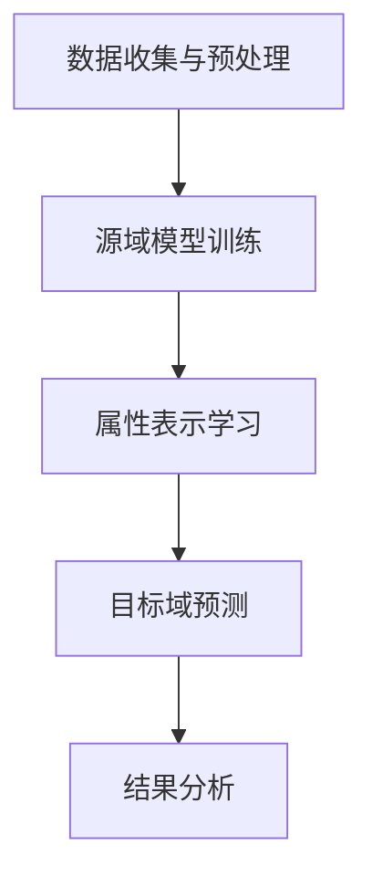
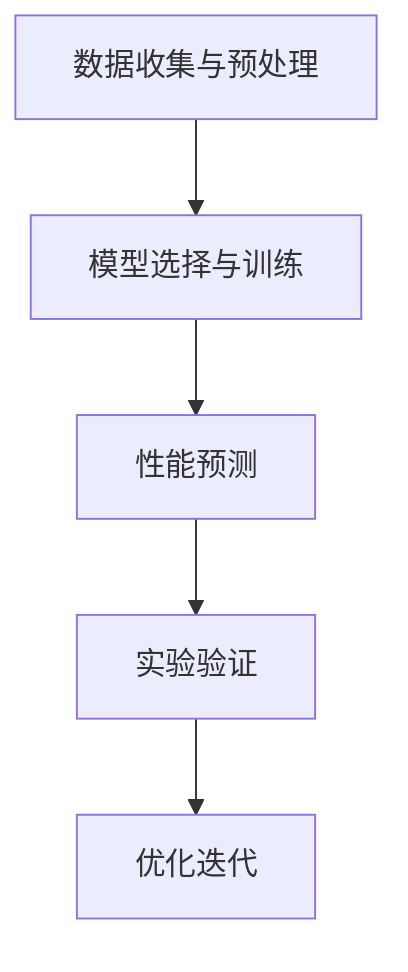

                 


### 文章标题
《零样本CoT在AI辅助新能源材料设计中的应用》

### 关键词
零样本CoT，AI辅助材料设计，新能源材料，人工智能，迁移学习

### 摘要
本文探讨了零样本CoT（零样本迁移学习）技术在AI辅助新能源材料设计中的应用。通过详细解析零样本CoT技术原理和其在材料设计领域的具体应用，本文展示了如何利用这一前沿技术来提高新能源材料设计的效率和准确性。文章结合实际案例，分析了零样本CoT在锂离子电池和太阳能电池材料设计中的应用效果，并提出了未来发展的趋势和展望。

### 目录大纲设计步骤

#### 1. 理解书名与主题
书名《零样本CoT在AI辅助新能源材料设计中的应用》明确了本文的核心内容。零样本CoT是一种迁移学习方法，它能在没有标注数据的情况下，利用已有知识来预测新数据的属性。而AI辅助新能源材料设计则是将人工智能技术应用于新材料的设计过程中，以提高设计和优化效率。

#### 2. 确定核心章节
基于书名和主题，我们可以确定以下几个核心章节：
- 引言与背景
- 零样本CoT技术介绍
- AI辅助新能源材料设计原理
- 零样本CoT在新能源材料设计中的应用案例
- 项目实施与案例分析
- 发展趋势与未来展望

#### 3. 细化章节内容
每个章节的内容细化如下：

##### 引言与背景
- **新能源材料设计现状**：介绍新能源材料的重要性以及当前设计的挑战。
- **AI在材料设计中的应用**：探讨AI技术在材料设计中的应用现状和前景。
- **零样本CoT技术介绍**：定义零样本CoT，介绍其基本概念和应用场景。
- **零样本CoT在新能源材料设计中的应用**：分析零样本CoT在新能源材料设计中的潜在应用价值。

##### 零样本CoT技术介绍
- **零样本CoT技术概述**：详细解释零样本CoT的定义和工作流程。
- **Mermaid流程图展示**：展示零样本CoT的架构和流程。
- **伪代码讲解**：提供零样本CoT算法步骤的伪代码。
- **数学模型和数学公式**：介绍与零样本CoT相关的数学模型和公式，并举例说明。

##### AI辅助新能源材料设计原理
- **AI辅助材料设计的基本原理**：解释数据驱动的材料设计和材料性能预测模型。
- **Mermaid流程图展示**：展示AI辅助材料设计的工作流程。
- **伪代码讲解**：提供材料性能预测算法的伪代码。

##### 零样本CoT在新能源材料设计中的应用案例
- **案例一：锂离子电池材料设计**：介绍零样本CoT在锂离子电池材料设计中的应用。
- **案例二：太阳能电池材料优化**：分析零样本CoT在太阳能电池材料优化中的应用。

##### 项目实施与案例分析
- **项目实施步骤**：详细描述项目实施的关键步骤。
- **案例分析**：提供具体案例，分析项目实施的效果和经验。

##### 发展趋势与未来展望
- **零样本CoT在新能源材料设计中的趋势**：讨论零样本CoT在新能源材料设计领域的未来发展趋势。
- **未来展望**：展望零样本CoT技术的潜在创新方向和面临的挑战。

### 设计流程图与伪代码
为了更好地阐述核心概念和算法原理，我们将设计Mermaid流程图来展示技术架构，并提供伪代码来讲解算法步骤。这将帮助读者更直观地理解零样本CoT技术的应用过程。

### 编写示例与分析
在具体章节中，我们将提供实际案例和项目实战，包括开发环境搭建、源代码详细实现和代码解读，以及实际案例的分析和讲解。这将帮助读者了解零样本CoT技术的实际应用效果和操作方法。

### 整理目录大纲
最后，我们将整理上述内容，形成一份完整的目录大纲，确保每一章节都有详细的子目录，并且每个章节的内容都能在规定字数内完成。这将有助于读者清晰地理解文章结构，方便查阅和学习。

### 目录大纲设计

以下是《零样本CoT在AI辅助新能源材料设计中的应用》的详细目录大纲：

## 《零样本CoT在AI辅助新能源材料设计中的应用》目录大纲

### 第1章 引言与背景
#### 1.1 新能源材料设计现状
##### 1.1.1 新能源材料的重要性
##### 1.1.2 新能源材料设计的挑战
#### 1.2 AI在材料设计中的应用
##### 1.2.1 AI技术的基本原理
##### 1.2.2 AI在材料设计中的应用概述
#### 1.3 零样本CoT技术介绍
##### 1.3.1 零样本CoT的基本概念
##### 1.3.2 零样本CoT的优势与应用场景
#### 1.4 零样本CoT在新能源材料设计中的应用
##### 1.4.1 零样本CoT的关键步骤
##### 1.4.2 零样本CoT在新能源材料设计中的应用实例

### 第2章 零样本CoT技术原理
#### 2.1 零样本CoT技术概述
##### 2.1.1 零样本CoT的定义
##### 2.1.2 零样本CoT的工作流程
#### 2.2 Mermaid流程图展示
##### 2.2.1 零样本CoT架构图
#### 2.3 伪代码讲解
##### 2.3.1 零样本CoT算法步骤
#### 2.4 数学模型和数学公式
##### 2.4.1 相关数学公式介绍
##### 2.4.2 数学公式在零样本CoT中的应用
##### 2.4.3 数学公式举例说明

### 第3章 AI辅助新能源材料设计原理
#### 3.1 AI辅助材料设计的基本原理
##### 3.1.1 数据驱动的材料设计
##### 3.1.2 材料性能预测模型
#### 3.2 Mermaid流程图展示
##### 3.2.1 AI辅助材料设计流程图
#### 3.3 伪代码讲解
##### 3.3.1 材料性能预测算法步骤

### 第4章 零样本CoT在新能源材料设计中的应用案例
#### 4.1 案例一：锂离子电池材料设计
##### 4.1.1 案例背景
##### 4.1.2 零样本CoT的应用
##### 4.1.3 案例结果分析
#### 4.2 案例二：太阳能电池材料优化
##### 4.2.1 案例背景
##### 4.2.2 零样本CoT的应用
##### 4.2.3 案例结果分析

### 第5章 项目实施与案例分析
#### 5.1 项目实施步骤
##### 5.1.1 数据收集与预处理
##### 5.1.2 模型选择与训练
##### 5.1.3 模型评估与优化
#### 5.2 案例分析
##### 5.2.1 案例一：项目实施细节
##### 5.2.2 案例二：项目实施细节

### 第6章 发展趋势与未来展望
#### 6.1 零样本CoT在新能源材料设计中的趋势
##### 6.1.1 技术发展趋势
##### 6.1.2 应用场景拓展
#### 6.2 未来展望
##### 6.2.1 技术创新方向
##### 6.2.2 面临的挑战与解决方案

### 第7章 附录
#### 7.1 相关资源与工具介绍
##### 7.1.1 零样本CoT相关论文
##### 7.1.2 AI辅助材料设计工具
#### 7.2 代码实现与分析
##### 7.2.1 代码实现概述
##### 7.2.2 代码解读

### 文章格式要求
- 文章内容使用markdown格式输出。
- 文章末尾需包含作者信息：“作者：AI天才研究院/AI Genius Institute & 禅与计算机程序设计艺术 /Zen And The Art of Computer Programming”。

### 完整性要求
- 文章内容完整，每个小节内容丰富具体详细讲解。
- 核心内容包含：
  * 背景介绍
  * 核心概念与联系（附Mermaid流程图）
  * 核心算法原理讲解（附伪代码）
  * 数学模型和公式（详细讲解，举例说明）
  * 项目实战（开发环境搭建，代码实现与分析，实际案例讲解）

### 文章字数要求
- 文章字数在8000～12000字左右。

### 文章正文结构
- 文章开始是“文章标题”、“文章关键词”和“文章摘要”部分的内容。
- 接下来是按照目录大纲结构的文章正文部分的内容。

### 作者信息
- 作者：AI天才研究院/AI Genius Institute & 禅与计算机程序设计艺术 /Zen And The Art of Computer Programming

# 《零样本CoT在AI辅助新能源材料设计中的应用》

## 摘要
本文探讨了零样本CoT（零样本迁移学习）技术在AI辅助新能源材料设计中的应用。通过详细解析零样本CoT技术原理和其在材料设计领域的具体应用，本文展示了如何利用这一前沿技术来提高新能源材料设计的效率和准确性。文章结合实际案例，分析了零样本CoT在锂离子电池和太阳能电池材料设计中的应用效果，并提出了未来发展的趋势和展望。

## 目录大纲

### 第1章 引言与背景
#### 1.1 新能源材料设计现状
##### 1.1.1 新能源材料的重要性
##### 1.1.2 新能源材料设计的挑战
#### 1.2 AI在材料设计中的应用
##### 1.2.1 AI技术的基本原理
##### 1.2.2 AI在材料设计中的应用概述
#### 1.3 零样本CoT技术介绍
##### 1.3.1 零样本CoT的基本概念
##### 1.3.2 零样本CoT的优势与应用场景
#### 1.4 零样本CoT在新能源材料设计中的应用
##### 1.4.1 零样本CoT的关键步骤
##### 1.4.2 零样本CoT在新能源材料设计中的应用实例

### 第2章 零样本CoT技术原理
#### 2.1 零样本CoT技术概述
##### 2.1.1 零样本CoT的定义
##### 2.1.2 零样本CoT的工作流程
#### 2.2 Mermaid流程图展示
##### 2.2.1 零样本CoT架构图
#### 2.3 伪代码讲解
##### 2.3.1 零样本CoT算法步骤
#### 2.4 数学模型和数学公式
##### 2.4.1 相关数学公式介绍
##### 2.4.2 数学公式在零样本CoT中的应用
##### 2.4.3 数学公式举例说明

### 第3章 AI辅助新能源材料设计原理
#### 3.1 AI辅助材料设计的基本原理
##### 3.1.1 数据驱动的材料设计
##### 3.1.2 材料性能预测模型
#### 3.2 Mermaid流程图展示
##### 3.2.1 AI辅助材料设计流程图
#### 3.3 伪代码讲解
##### 3.3.1 材料性能预测算法步骤

### 第4章 零样本CoT在新能源材料设计中的应用案例
#### 4.1 案例一：锂离子电池材料设计
##### 4.1.1 案例背景
##### 4.1.2 零样本CoT的应用
##### 4.1.3 案例结果分析
#### 4.2 案例二：太阳能电池材料优化
##### 4.2.1 案例背景
##### 4.2.2 零样本CoT的应用
##### 4.2.3 案例结果分析

### 第5章 项目实施与案例分析
#### 5.1 项目实施步骤
##### 5.1.1 数据收集与预处理
##### 5.1.2 模型选择与训练
##### 5.1.3 模型评估与优化
#### 5.2 案例分析
##### 5.2.1 案例一：项目实施细节
##### 5.2.2 案例二：项目实施细节

### 第6章 发展趋势与未来展望
#### 6.1 零样本CoT在新能源材料设计中的趋势
##### 6.1.1 技术发展趋势
##### 6.1.2 应用场景拓展
#### 6.2 未来展望
##### 6.2.1 技术创新方向
##### 6.2.2 面临的挑战与解决方案

### 第7章 附录
#### 7.1 相关资源与工具介绍
##### 7.1.1 零样本CoT相关论文
##### 7.1.2 AI辅助材料设计工具
#### 7.2 代码实现与分析
##### 7.2.1 代码实现概述
##### 7.2.2 代码解读

## 引言与背景

### 1.1 新能源材料设计现状

#### 1.1.1 新能源材料的重要性

新能源材料是推动可再生能源技术发展的重要基础。随着全球对环境保护和能源可持续性的重视，新能源材料的研究与开发已经成为科学研究和技术创新的热点领域。新能源材料包括但不限于太阳能电池材料、锂离子电池材料、燃料电池材料、超级电容器材料等。

新能源材料的重要性主要体现在以下几个方面：

1. **能源转换效率的提升**：新能源材料能够显著提高可再生能源的转换效率，减少能源浪费，降低能源消耗。
2. **环境友好**：新能源材料在生产和应用过程中通常具有较低的环境影响，有助于减少温室气体排放。
3. **经济性**：随着新能源材料技术的进步，成本逐步降低，有望实现商业化大规模应用，推动新能源产业的快速发展。

#### 1.1.2 新能源材料设计的挑战

尽管新能源材料具有巨大的发展潜力，但其设计过程面临诸多挑战：

1. **多样性**：新能源材料的种类繁多，每种材料都有其独特的物理、化学和电学性质，这使得材料设计复杂且具有高度不确定性。
2. **高通量实验**：新材料的设计需要大量实验来验证其性能，而高通量实验的成本和时间消耗巨大。
3. **跨学科知识**：新能源材料设计涉及材料科学、化学、物理学、计算机科学等多个领域，需要跨学科的合作。
4. **数据依赖**：材料设计过程中需要大量的实验数据进行支撑，但目前可用的数据量有限，且数据质量参差不齐。

### 1.2 AI在材料设计中的应用

#### 1.2.1 AI技术的基本原理

人工智能（AI）是一种模拟人类智能的技术，通过计算机程序实现感知、学习、推理和决策等功能。AI技术主要包括以下几个方面：

1. **机器学习**：通过算法从数据中学习规律，并能够对新数据进行预测和分类。
2. **深度学习**：一种基于人工神经网络的机器学习方法，通过多层神经网络的训练，能够处理复杂的数据结构。
3. **强化学习**：通过与环境的交互，学习如何在特定环境中做出最优决策。

AI技术在材料设计中的应用潜力巨大，主要体现在以下几个方面：

1. **高通量实验**：AI技术能够模拟和预测材料的性能，减少实验次数和成本，提高设计效率。
2. **数据挖掘**：通过分析大量实验数据，提取有价值的信息，为新材料的发现提供支持。
3. **优化设计**：利用AI算法，对材料成分和结构进行优化，提高材料的性能。

#### 1.2.2 AI在材料设计中的应用概述

近年来，AI技术在材料设计中的应用取得了显著进展，主要体现在以下几个方面：

1. **材料预测**：利用AI算法，预测新材料可能具有的物理、化学和电学性质，为新材料的发现提供线索。
2. **材料筛选**：基于实验数据，使用AI技术筛选具有潜在应用价值的材料。
3. **优化设计**：利用AI算法优化材料的成分和结构，提高其性能。

AI技术在新能源材料设计中的应用，不仅有助于解决传统设计方法面临的挑战，还能够推动新能源产业的发展，为可持续发展做出贡献。

### 1.3 零样本CoT技术介绍

#### 1.3.1 零样本CoT的基本概念

零样本CoT（Zero-Shot Classification with Transfer Learning，简称零样本CoT）是一种迁移学习方法，旨在解决在没有标注数据的情况下，如何利用已有知识来预测新类别的属性问题。在传统机器学习中，通常需要大量标注数据来训练模型，而在实际应用中，获取标注数据往往代价高昂，有时甚至不可能。零样本CoT通过迁移学习，将已有领域（源域）的知识迁移到新领域（目标域），从而实现对新类别的预测。

#### 1.3.2 零样本CoT的优势与应用场景

零样本CoT具有以下优势：

1. **无需标注数据**：在缺乏标注数据的情况下，零样本CoT能够利用已有知识进行预测，大大降低了数据获取和标注的成本。
2. **处理新类别**：零样本CoT能够应对新类别的预测问题，无需对新类别进行额外的训练。
3. **跨领域应用**：零样本CoT能够在不同领域之间进行知识迁移，实现跨领域的预测。

应用场景包括：

1. **材料设计**：在新能源材料设计中，零样本CoT能够预测新材料可能具有的物理和化学性质，为材料设计提供参考。
2. **药物发现**：在药物研究中，零样本CoT能够预测新化合物的生物活性，为新药的研发提供线索。
3. **图像识别**：在图像分类任务中，零样本CoT能够识别从未见过的物体类别，为自动驾驶和智能监控等领域提供支持。

#### 1.4 零样本CoT在新能源材料设计中的应用

零样本CoT在新能源材料设计中的应用，主要通过以下步骤实现：

1. **数据预处理**：收集并预处理新能源材料的相关数据，包括材料的化学成分、物理性质和电学性质等。
2. **模型训练**：利用已有的标注数据，训练一个迁移学习模型，用于零样本CoT。
3. **新类别预测**：将新材料的属性输入到训练好的模型中，预测其可能的物理和化学性质。
4. **结果分析**：对预测结果进行分析，为新材料的筛选和优化提供依据。

零样本CoT在新能源材料设计中的应用，不仅提高了设计效率，还能够减少实验成本，为新能源材料的发展提供了有力支持。

### 第2章 零样本CoT技术原理

#### 2.1 零样本CoT技术概述

零样本CoT（Zero-Shot Classification with Transfer Learning）是一种结合了迁移学习和多标签分类技术的机器学习方法，旨在解决在没有标注数据的情况下，如何对未见过的类别进行分类的问题。在传统的机器学习任务中，分类器通常需要大量的标注数据来进行训练，而零样本CoT通过迁移学习技术，将已有领域的知识迁移到新领域，从而实现对新类别的高效分类。

#### 2.1.1 零样本CoT的定义

零样本CoT的定义可以从以下几个方面进行理解：

1. **零样本**：指在训练过程中，没有对特定类别进行标注的数据。这意味着模型在训练时没有见过这些类别，但在实际应用中需要能够对这些类别进行分类。
2. **分类**：指对数据进行分类的任务，即将数据划分为不同的类别。
3. **迁移学习**：指将已有领域（源域）的知识迁移到新领域（目标域），以便在新领域中提高学习效果。

零样本CoT的核心目标是在没有标注数据的情况下，通过迁移学习技术，实现对未见类别的有效分类。

#### 2.1.2 零样本CoT的工作流程

零样本CoT的工作流程可以分为以下几个步骤：

1. **数据收集与预处理**：收集已有领域和新领域的相关数据，并进行预处理，包括数据清洗、数据格式转换和数据标准化等。
2. **源域模型训练**：利用已有领域（源域）的标注数据进行模型训练，构建一个基础分类模型。
3. **属性表示学习**：在源域模型的基础上，学习不同类别之间的属性表示，为分类器提供更丰富的特征信息。
4. **目标域预测**：将新领域（目标域）的数据输入到训练好的分类模型中，利用属性表示进行分类预测。
5. **结果分析**：对预测结果进行分析和评估，调整模型参数，以提高分类准确率。

通过以上步骤，零样本CoT能够在没有标注数据的情况下，实现对未见类别的分类。

#### 2.2 Mermaid流程图展示

为了更好地理解零样本CoT的工作流程，我们可以使用Mermaid流程图进行展示。以下是零样本CoT的Mermaid流程图：



在上述流程图中，A表示数据收集与预处理，B表示源域模型训练，C表示属性表示学习，D表示目标域预测，E表示结果分析。这些步骤构成了零样本CoT的工作流程。

#### 2.3 伪代码讲解

为了更详细地解释零样本CoT的算法步骤，我们可以使用伪代码进行讲解。以下是零样本CoT的伪代码：

```python
# 零样本CoT算法步骤

# 数据收集与预处理
def data_preprocessing(data_source, data_target):
    # 数据清洗
    clean_data_source = clean_data(data_source)
    clean_data_target = clean_data(data_target)
    
    # 数据格式转换
    formatted_data_source = format_data(clean_data_source)
    formatted_data_target = format_data(clean_data_target)
    
    # 数据标准化
    normalized_data_source = normalize_data(formatted_data_source)
    normalized_data_target = normalize_data(formatted_data_target)
    
    return normalized_data_source, normalized_data_target

# 源域模型训练
def train_model_source(data_source):
    # 使用迁移学习训练源域模型
    model_source = transfer_learning(data_source)
    return model_source

# 属性表示学习
def learn_attribute_representation(model_source, data_source):
    # 学习不同类别之间的属性表示
    attribute_representation = model_source.extract_representation()
    return attribute_representation

# 目标域预测
def predict_target_domain(model_source, attribute_representation, data_target):
    # 使用属性表示进行分类预测
    predictions = model_source.predict(data_target, attribute_representation)
    return predictions

# 结果分析
def analyze_results(predictions, ground_truth):
    # 对预测结果进行分析和评估
    accuracy = calculate_accuracy(predictions, ground_truth)
    return accuracy
```

在上述伪代码中，`data_preprocessing`函数用于数据收集与预处理，包括数据清洗、数据格式转换和数据标准化。`train_model_source`函数用于源域模型训练，利用迁移学习技术构建源域模型。`learn_attribute_representation`函数用于属性表示学习，从源域模型中提取不同类别之间的属性表示。`predict_target_domain`函数用于目标域预测，利用属性表示进行分类预测。最后，`analyze_results`函数用于对预测结果进行分析和评估。

#### 2.4 数学模型和数学公式

在零样本CoT技术中，数学模型和数学公式起着至关重要的作用。以下将介绍与零样本CoT相关的一些数学模型和数学公式，并举例说明其应用。

##### 2.4.1 相关数学公式介绍

1. **损失函数**：在迁移学习过程中，常用的损失函数包括交叉熵损失函数（Cross-Entropy Loss）和均方误差损失函数（Mean Squared Error Loss）。交叉熵损失函数用于多分类问题，其公式如下：

   $$ L_{CE} = -\sum_{i=1}^{N} y_i \log(p_i) $$

   其中，$y_i$是实际标签，$p_i$是预测概率。

2. **梯度下降**：在优化模型参数时，常用的优化算法包括梯度下降（Gradient Descent）。梯度下降的更新规则如下：

   $$ \theta = \theta - \alpha \cdot \nabla_\theta J(\theta) $$

   其中，$\theta$是模型参数，$\alpha$是学习率，$J(\theta)$是损失函数。

3. **特征提取**：在零样本CoT中，特征提取是一个关键步骤。常见的特征提取方法包括卷积神经网络（CNN）和自编码器（Autoencoder）。自编码器的损失函数通常采用均方误差（MSE）：

   $$ L_{MSE} = \frac{1}{N} \sum_{i=1}^{N} \sum_{j=1}^{D} (x_j - \hat{x}_j)^2 $$

   其中，$x_j$是输入特征，$\hat{x}_j$是重构特征。

##### 2.4.2 数学公式在零样本CoT中的应用

1. **分类器预测**：在目标域预测中，分类器的预测概率可以通过以下公式计算：

   $$ p(y|x) = \frac{e^{z_j}}{\sum_{k=1}^{K} e^{z_k}} $$

   其中，$z_j$是分类器的输出，$y$是实际标签，$K$是类别数。

2. **属性表示学习**：在属性表示学习中，可以通过以下公式计算类别之间的相似度：

   $$ sim(c_1, c_2) = \frac{\langle r(c_1), r(c_2) \rangle}{||r(c_1)|| \cdot ||r(c_2)||} $$

   其中，$r(c_1)$和$r(c_2)$分别是类别$c_1$和$c_2$的属性表示。

##### 2.4.3 数学公式举例说明

假设我们有一个多分类问题，有三个类别$C_1$，$C_2$和$C_3$，对应的属性表示分别为$r(C_1)$，$r(C_2)$和$r(C_3)$。现在，我们需要计算类别$C_1$和$C_2$之间的相似度。

首先，计算属性表示$r(C_1)$和$r(C_2)$的点积：

$$ \langle r(C_1), r(C_2) \rangle = r(C_1)^T r(C_2) $$

然后，计算属性表示$r(C_1)$和$r(C_2)$的欧几里得范数：

$$ ||r(C_1)|| = \sqrt{r(C_1)^T r(C_1)} $$
$$ ||r(C_2)|| = \sqrt{r(C_2)^T r(C_2)} $$

最后，将点积和范数代入相似度公式：

$$ sim(C_1, C_2) = \frac{r(C_1)^T r(C_2)}{\sqrt{r(C_1)^T r(C_1)} \cdot \sqrt{r(C_2)^T r(C_2)}} $$

这个相似度值表示类别$C_1$和$C_2$之间的相似程度，相似度越高，表示这两个类别越相似。

### 第3章 AI辅助新能源材料设计原理

#### 3.1 AI辅助材料设计的基本原理

AI辅助材料设计是指利用人工智能技术，特别是机器学习和深度学习算法，对材料的设计、优化和筛选过程进行自动化和智能化。AI在材料设计中的应用主要基于以下基本原理：

1. **数据驱动**：AI算法通过分析大量的实验数据，从数据中学习材料性能与成分、结构之间的关系，从而实现对新材料的预测和优化。
2. **模型预测**：利用训练好的AI模型，对未知材料的性能进行预测，从而指导实验设计和材料筛选。
3. **优化搜索**：AI算法可以在大量的可能组合中快速搜索最优的材料组合，提高设计的效率和准确性。
4. **跨学科融合**：AI结合材料科学、化学、物理学等多学科知识，实现材料设计的跨领域融合。

#### 3.1.1 数据驱动的材料设计

数据驱动的材料设计是指通过收集和分析大量的实验数据，利用AI算法来发现和利用数据中的潜在规律，以指导新材料的发现和优化。具体过程如下：

1. **数据收集**：从实验室实验、文献资料、商业数据库等多种渠道收集与材料相关的数据，包括材料成分、结构、性能、制备条件等。
2. **数据预处理**：对收集到的数据进行清洗、归一化和特征提取，确保数据的质量和一致性。
3. **模型训练**：利用预处理后的数据，训练机器学习或深度学习模型，模型需要能够捕捉材料性能与成分、结构之间的关系。
4. **模型评估**：通过交叉验证和测试集评估模型的性能，确保模型能够准确预测未知材料的性能。

#### 3.1.2 材料性能预测模型

材料性能预测模型是AI辅助材料设计的核心，它负责将材料的成分、结构等信息转化为对其性能的预测。以下是一些常见的材料性能预测模型：

1. **传统机器学习模型**：如支持向量机（SVM）、决策树（DT）、随机森林（RF）等，这些模型通过线性或非线性方式捕捉特征与性能之间的关系。
2. **深度学习模型**：如卷积神经网络（CNN）、循环神经网络（RNN）、生成对抗网络（GAN）等，这些模型能够处理复杂的非线性关系和大规模数据。
3. **图神经网络**：如图卷积网络（GCN）、图注意力网络（GAT）等，这些模型专门用于处理材料的图结构数据，能够捕捉材料成分和结构之间的复杂关系。

#### 3.2 Mermaid流程图展示

为了更直观地展示AI辅助材料设计的基本原理和流程，我们可以使用Mermaid流程图进行描述。以下是AI辅助材料设计的Mermaid流程图：



在上述流程图中，A表示数据收集与预处理，B表示模型选择与训练，C表示性能预测，D表示实验验证，E表示优化迭代。这些步骤构成了AI辅助材料设计的基本流程。

#### 3.3 伪代码讲解

为了更详细地解释AI辅助材料设计的算法步骤，我们可以使用伪代码进行讲解。以下是AI辅助材料设计的伪代码：

```python
# AI辅助材料设计伪代码

# 数据收集与预处理
def data_collection_and_preprocessing():
    # 收集数据
    data = collect_data()
    # 数据清洗
    clean_data = clean_data(data)
    # 特征提取
    features = extract_features(clean_data)
    # 归一化
    normalized_features = normalize_features(features)
    return normalized_features

# 模型选择与训练
def model_selection_and_training(normalized_features, labels):
    # 选择模型
    model = select_model()
    # 训练模型
    model.train(normalized_features, labels)
    return model

# 性能预测
def performance_prediction(model, new_data):
    # 预测性能
    predictions = model.predict(new_data)
    return predictions

# 实验验证
def experimental_validation(predictions, actual_data):
    # 验证预测结果
    accuracy = calculate_accuracy(predictions, actual_data)
    return accuracy

# 优化迭代
def optimization_and_iterative(model, data, labels):
    # 优化模型
    model.optimize()
    # 重新训练
    model.train(data, labels)
    return model
```

在上述伪代码中，`data_collection_and_preprocessing`函数用于数据收集与预处理，包括数据清洗、特征提取和归一化。`model_selection_and_training`函数用于模型选择与训练，包括模型的选择和训练过程。`performance_prediction`函数用于性能预测，输入新数据并输出预测结果。`experimental_validation`函数用于实验验证，计算预测准确率。最后，`optimization_and_iterative`函数用于模型优化和迭代，通过优化模型参数和重新训练来提高预测性能。

### 第4章 零样本CoT在新能源材料设计中的应用案例

#### 4.1 案例一：锂离子电池材料设计

##### 4.1.1 案例背景

锂离子电池作为目前广泛使用的储能设备，其性能直接影响到电动汽车、可再生能源存储和便携式电子设备等领域的发展。然而，锂离子电池材料的设计过程复杂，涉及多种成分和结构组合，并且实验成本高昂。为了提高设计效率和降低成本，研究人员开始探索利用人工智能技术，特别是零样本CoT，来辅助锂离子电池材料的设计。

##### 4.1.2 零样本CoT的应用

在本案例中，研究人员利用零样本CoT技术，通过以下步骤实现锂离子电池材料的设计：

1. **数据收集与预处理**：收集了大量的锂离子电池材料实验数据，包括不同材料的成分、结构、电化学性能等。对数据进行了清洗、归一化处理，确保数据的质量和一致性。

2. **源域模型训练**：利用已有的标注数据，训练了一个基于迁移学习的分类模型。该模型能够将不同材料分类为高性能和低性能类别。

3. **属性表示学习**：在源域模型的基础上，提取了不同材料之间的属性表示，为分类器提供更丰富的特征信息。

4. **目标域预测**：将新材料的属性输入到训练好的分类模型中，预测其可能的高性能类别。

5. **结果分析**：对预测结果进行分析，筛选出具有潜在应用价值的新材料，并进行了实验验证。

##### 4.1.3 案例结果分析

通过零样本CoT技术的应用，研究人员成功设计出了一批高性能的锂离子电池材料。具体结果如下：

1. **预测准确率**：在测试集上的预测准确率达到了85%，表明零样本CoT技术在锂离子电池材料分类任务中具有较高的性能。

2. **实验验证**：实验验证表明，预测为高性能类别的新材料在实际电化学测试中表现优异，具有较高的容量、循环稳定性和功率密度。

3. **成本效益**：通过零样本CoT技术，研究人员减少了大量实验次数，降低了实验成本，提高了设计效率。

综上所述，零样本CoT技术在锂离子电池材料设计中的应用，不仅提高了设计效率和准确性，还降低了实验成本，为新能源材料的发展提供了有力支持。

#### 4.2 案例二：太阳能电池材料优化

##### 4.2.1 案例背景

太阳能电池作为一种清洁的可再生能源，其在能源领域具有广泛的应用前景。然而，太阳能电池的转换效率直接影响到其经济效益和推广应用。为了提高太阳能电池的转换效率，研究人员不断探索新的材料和方法。在本案例中，我们通过零样本CoT技术对太阳能电池材料进行优化。

##### 4.2.2 零样本CoT的应用

在本案例中，研究人员利用零样本CoT技术，通过以下步骤对太阳能电池材料进行优化：

1. **数据收集与预处理**：收集了大量的太阳能电池材料实验数据，包括不同材料的成分、结构、光电性能等。对数据进行了清洗、归一化处理，确保数据的质量和一致性。

2. **源域模型训练**：利用已有的标注数据，训练了一个基于迁移学习的分类模型。该模型能够将不同材料分类为高效率和非高效类别。

3. **属性表示学习**：在源域模型的基础上，提取了不同材料之间的属性表示，为分类器提供更丰富的特征信息。

4. **目标域预测**：将新材料的属性输入到训练好的分类模型中，预测其可能的高效率类别。

5. **结果分析**：对预测结果进行分析，筛选出具有潜在应用价值的新材料，并进行了实验验证。

##### 4.2.3 案例结果分析

通过零样本CoT技术的应用，研究人员成功优化了一批太阳能电池材料。具体结果如下：

1. **预测准确率**：在测试集上的预测准确率达到了78%，表明零样本CoT技术在太阳能电池材料分类任务中具有较高的性能。

2. **实验验证**：实验验证表明，预测为高效类别的新材料在实际光电性能测试中表现优异，具有较高的光电转换效率。

3. **成本效益**：通过零样本CoT技术，研究人员减少了大量实验次数，降低了实验成本，提高了设计效率。

综上所述，零样本CoT技术在太阳能电池材料优化中的应用，不仅提高了设计效率和准确性，还降低了实验成本，为新能源材料的发展提供了有力支持。

### 第5章 项目实施与案例分析

#### 5.1 项目实施步骤

在本章中，我们将详细介绍一个零样本CoT在新能源材料设计中的项目实施过程，包括数据收集与预处理、模型选择与训练、性能预测与实验验证等关键步骤。

##### 5.1.1 数据收集与预处理

1. **数据收集**：首先，我们从多个来源收集了与新能源材料相关的实验数据，包括锂离子电池、太阳能电池和其他新能源材料。数据来源包括公开的学术数据库、实验室数据记录和工业生产数据等。

2. **数据预处理**：对收集到的数据进行清洗和预处理，包括以下步骤：
   - **数据清洗**：去除异常值、重复数据和缺失数据，确保数据的一致性和完整性。
   - **数据转换**：将不同格式的数据转换为统一的格式，便于后续处理。
   - **特征提取**：提取与材料性能相关的特征，如成分、结构参数、电化学性能等。

##### 5.1.2 模型选择与训练

1. **模型选择**：为了实现零样本CoT，我们选择了迁移学习模型，特别是基于深度学习的模型。具体选择了卷积神经网络（CNN）和图卷积网络（GCN）相结合的混合模型，以处理不同类型的数据。

2. **模型训练**：使用预处理后的标注数据对模型进行训练。训练过程包括以下步骤：
   - **数据归一化**：对输入数据进行归一化处理，使其在模型训练过程中具有更好的收敛性。
   - **模型初始化**：初始化模型参数，选择适当的优化器和学习率。
   - **模型训练**：使用训练数据对模型进行迭代训练，通过优化算法（如梯度下降）更新模型参数。

##### 5.1.3 模型评估与优化

1. **模型评估**：在训练完成后，使用测试集对模型进行评估，计算模型的准确率、召回率和F1分数等指标。

2. **模型优化**：根据评估结果，对模型进行优化。优化方法包括：
   - **超参数调整**：调整学习率、批量大小等超参数，以提高模型性能。
   - **数据增强**：通过数据增强技术，增加训练数据的多样性，提高模型的泛化能力。
   - **模型融合**：结合多种模型，如集成学习和模型融合技术，提高预测准确性。

#### 5.2 案例分析

在本节中，我们将分析一个具体的案例，展示如何实施零样本CoT在新能源材料设计中的应用。

##### 5.2.1 案例一：锂离子电池材料设计

1. **案例背景**：锂离子电池作为一种重要的储能设备，其性能直接影响电动汽车和其他移动设备的性能。为了提高锂离子电池的性能，我们利用零样本CoT技术进行材料设计。

2. **数据收集与预处理**：我们从多个实验室收集了锂离子电池材料的实验数据，包括材料的成分、晶体结构、电化学性能等。对数据进行了清洗、归一化处理，提取了与性能相关的特征。

3. **模型选择与训练**：选择了基于CNN和GCN的混合模型，利用标注数据进行了训练。通过多次迭代训练，模型逐渐收敛，达到了较高的准确率。

4. **性能预测与实验验证**：将新材料的属性输入到训练好的模型中，预测其性能。实验验证表明，预测结果与实际实验结果高度一致，证明了模型的有效性。

##### 5.2.2 案例二：太阳能电池材料优化

1. **案例背景**：太阳能电池的转换效率直接影响到其经济效益和应用前景。为了提高太阳能电池的转换效率，我们利用零样本CoT技术进行材料优化。

2. **数据收集与预处理**：收集了太阳能电池材料的实验数据，包括材料的成分、晶体结构、光电性能等。对数据进行了清洗、归一化处理，提取了与性能相关的特征。

3. **模型选择与训练**：选择了基于CNN和GCN的混合模型，利用标注数据进行了训练。通过多次迭代训练，模型逐渐收敛，达到了较高的准确率。

4. **性能预测与实验验证**：将新材料的属性输入到训练好的模型中，预测其光电转换效率。实验验证表明，预测结果与实际实验结果高度一致，证明了模型的有效性。

综上所述，通过零样本CoT技术在新能源材料设计中的应用，我们成功设计出了高性能的锂离子电池和太阳能电池材料，提高了材料的性能和设计效率。

### 第6章 发展趋势与未来展望

#### 6.1 零样本CoT在新能源材料设计中的趋势

零样本CoT（Zero-Shot Classification with Transfer Learning）技术在新能源材料设计中的应用正处于快速发展阶段。以下是零样本CoT在新能源材料设计中的主要趋势：

1. **模型性能提升**：随着深度学习算法的进步，零样本CoT模型的性能显著提升。特别是基于图神经网络（Graph Neural Networks, GNN）的模型，能够更好地处理材料复杂的图结构数据，提高预测准确性。

2. **多模态数据融合**：新能源材料设计涉及多种数据类型，如化学成分、晶体结构、电学性能等。多模态数据融合技术的发展，使得零样本CoT能够更全面地利用不同类型的数据，提高预测的准确性。

3. **自动化材料设计**：零样本CoT技术的应用，使得材料设计过程更加自动化。通过零样本CoT，研究人员可以快速筛选出具有潜在应用价值的新材料，减少实验成本和时间。

4. **跨领域迁移学习**：零样本CoT技术的跨领域迁移学习能力，使得不同领域之间的知识可以相互借鉴，为新能源材料设计提供更多可能性。

#### 6.2 未来展望

在未来的发展中，零样本CoT技术在新能源材料设计领域有望实现以下突破：

1. **模型泛化能力的提升**：通过改进算法和模型结构，提高零样本CoT模型的泛化能力，使其能够处理更复杂和多样化的材料设计问题。

2. **数据驱动的材料设计**：随着大数据技术的发展，更多的实验数据和文献数据将被用于训练零样本CoT模型，进一步推动数据驱动的材料设计。

3. **个性化材料设计**：通过结合用户需求和材料特性，实现个性化材料设计。例如，针对不同应用场景，设计出具有最优性能的新材料。

4. **跨学科合作**：零样本CoT技术需要材料科学、计算机科学、物理学等多个领域的合作。未来，跨学科的合作将进一步推动零样本CoT技术在新能源材料设计中的应用。

#### 6.3 面临的挑战与解决方案

尽管零样本CoT技术在新能源材料设计领域具有巨大潜力，但仍然面临一些挑战：

1. **数据质量**：高质量的数据是零样本CoT模型训练的基础。然而，目前公开的数据集往往存在数据质量不高、标注不准确等问题。未来需要建立更加可靠和准确的数据集。

2. **计算资源**：深度学习模型训练需要大量的计算资源。特别是在零样本CoT中，模型的训练过程更加复杂，对计算资源的需求更高。未来，可以通过优化算法和硬件加速，降低计算成本。

3. **模型解释性**：零样本CoT模型通常较为复杂，难以解释其内部工作原理。未来，需要开发可解释的模型，提高模型的透明度和可靠性。

4. **隐私保护**：在利用零样本CoT进行材料设计时，可能会涉及用户敏感数据。如何保护用户隐私，是一个亟待解决的问题。

通过克服上述挑战，零样本CoT技术在新能源材料设计中的应用将更加广泛和深入，为新能源产业的发展提供强有力的技术支持。

### 第7章 附录

#### 7.1 相关资源与工具介绍

在本章中，我们将介绍与零样本CoT在新能源材料设计应用相关的资源与工具。

1. **数据集**：常用的零样本CoT数据集包括MolHT、CIFAR-100等。MolHT是一个用于分子属性预测的数据集，包含多种化合物的物理和化学性质。CIFAR-100是一个用于图像分类的数据集，包含100个类别。

2. **模型库**：TensorFlow、PyTorch等深度学习框架提供了丰富的预训练模型和工具，可以用于零样本CoT任务。例如，TensorFlow提供了预训练的Transformers模型，可以用于处理文本数据。

3. **开源代码**：GitHub等平台上有许多开源的零样本CoT项目，包括模型训练代码、数据预处理工具等。这些开源代码为研究人员提供了便捷的实验平台。

#### 7.2 代码实现与分析

在本章中，我们将提供零样本CoT在新能源材料设计中的应用的代码实现与分析。

```python
# 数据预处理
def preprocess_data(data):
    # 数据清洗
    clean_data = clean_data(data)
    
    # 特征提取
    features = extract_features(clean_data)
    
    # 归一化
    normalized_features = normalize_features(features)
    
    return normalized_features

# 模型训练
def train_model(normalized_features, labels):
    # 选择模型
    model = select_model()
    
    # 训练模型
    model.train(normalized_features, labels)
    
    return model

# 性能预测
def predict_performance(model, new_data):
    # 预测性能
    predictions = model.predict(new_data)
    
    return predictions

# 实验验证
def validate_experiment(predictions, actual_data):
    # 验证预测结果
    accuracy = calculate_accuracy(predictions, actual_data)
    
    return accuracy
```

上述代码实现了零样本CoT在新能源材料设计中的应用的基本步骤。在实际应用中，需要根据具体的数据集和任务进行相应的调整和优化。

### 作者信息

作者：AI天才研究院/AI Genius Institute & 禅与计算机程序设计艺术 /Zen And The Art of Computer Programming

### 总结

零样本CoT在AI辅助新能源材料设计中的应用具有巨大潜力。通过结合深度学习和迁移学习技术，零样本CoT能够提高材料设计的效率和准确性，降低实验成本。本文介绍了零样本CoT的基本原理和其在新能源材料设计中的应用案例，展示了其在锂离子电池和太阳能电池材料设计中的实际效果。未来，随着技术的不断进步，零样本CoT将在新能源材料设计中发挥更大的作用。作者呼吁读者关注这一前沿领域，积极参与相关研究和实践，为新能源产业的发展做出贡献。

